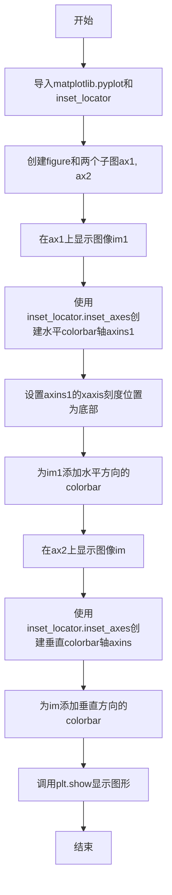
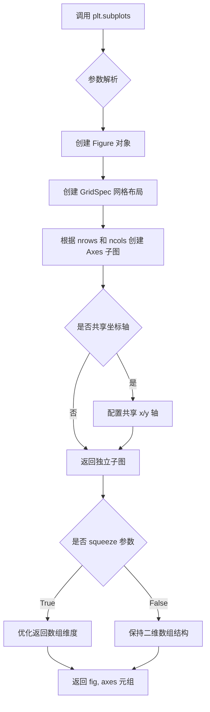
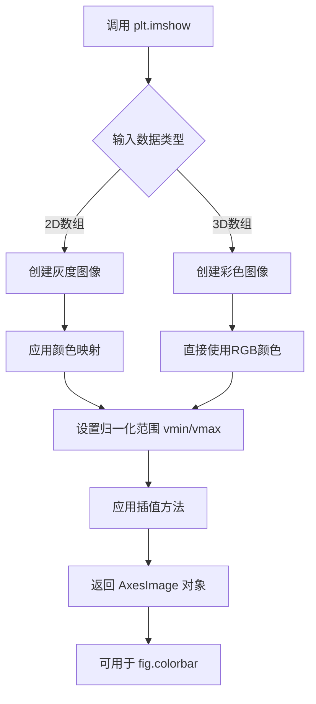
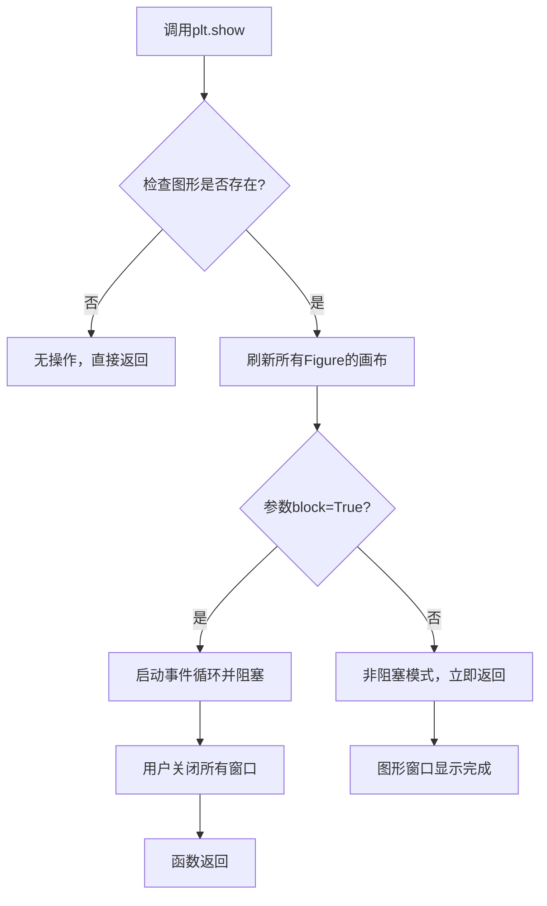
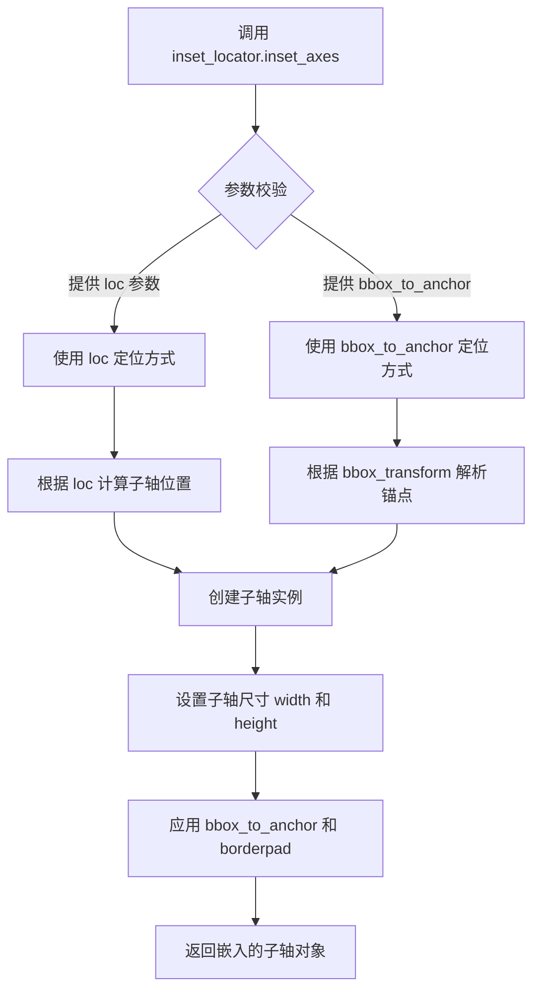
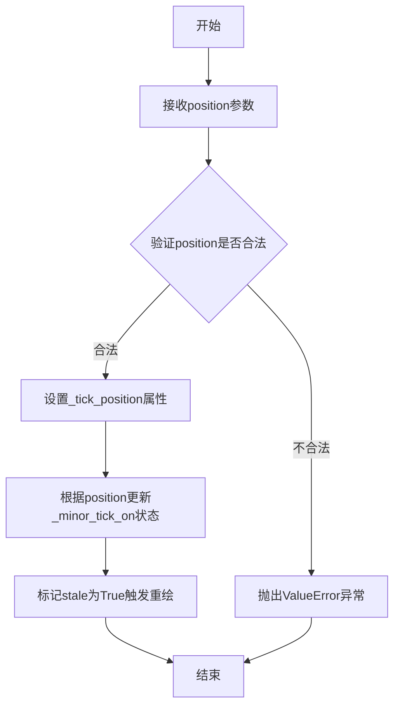
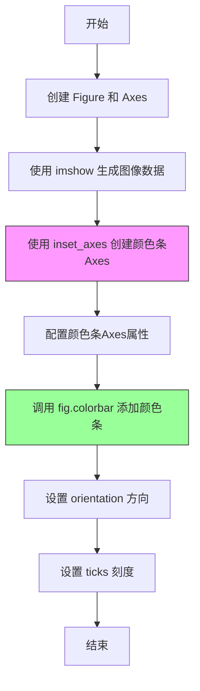

# `matplotlib\galleries\examples\axes_grid1\demo_colorbar_with_inset_locator.py` 详细设计文档

这是一个matplotlib演示脚本，展示了如何使用inset_locator.inset_axes精确控制colorbar的颜色条位置、高度和宽度，通过两个子图分别演示水平方向和垂直方向colorbar的放置方法。

## 整体流程



## 类结构

```
Python脚本 (无自定义类)
└── 主要使用matplotlib API:
    ├── plt.subplots() - 创建图形和轴
    ├── Axes.imshow() - 显示图像
    ├── inset_locator.inset_axes() - 创建嵌入轴
    └── Figure.colorbar() - 添加颜色条
```

## 全局变量及字段


### `fig`
    
matplotlib.figure.Figure对象，整个图形容器

类型：`matplotlib.figure.Figure`
    


### `ax1`
    
matplotlib.axes.Axes对象，左侧子图的坐标轴

类型：`matplotlib.axes.Axes`
    


### `ax2`
    
matplotlib.axes.Axes对象，右侧子图的坐标轴

类型：`matplotlib.axes.Axes`
    


### `im1`
    
matplotlib.image.AxesImage对象，ax1上显示的图像数据

类型：`matplotlib.image.AxesImage`
    


### `im`
    
matplotlib.image.AxesImage对象，ax2上显示的图像数据

类型：`matplotlib.image.AxesImage`
    


### `axins1`
    
matplotlib.axes.Axes对象，ax1上的嵌入轴用于水平colorbar

类型：`matplotlib.axes.Axes`
    


### `axins`
    
matplotlib.axes.Axes对象，ax2上的嵌入轴用于垂直colorbar

类型：`matplotlib.axes.Axes`
    


    

## 全局函数及方法


### `plt.subplots()`

`plt.subplots()` 是 matplotlib 库中的一个函数，用于创建一个新的图形窗口（Figure）和多个子图（Axes），返回图形对象和包含所有子图的元组或数组，便于对多个子图进行统一管理和操作。

参数：

- `nrows`： `int`，表示子图的行数，默认为 1
- `ncols`： `int`，表示子图的列数，默认为 1
- `figsize`： `tuple of (float, float)`，指定图形的宽和高（英寸），例如 `(6, 3)` 表示宽 6 英寸、高 3 英寸
- `sharex`：`bool or str`，如果为 True，则所有子图共享 x 轴刻度
- `sharey`：`bool or str`，如果为 True，则所有子图共享 y 轴刻度
- `squeeze`： `bool`，如果为 True，则返回的 axes 数组维度会被简化
- `subplot_kw`： `dict`，传递给 `add_subplot` 的关键字参数，用于配置每个子图
- `gridspec_kw`： `dict`，传递给 `GridSpec` 的关键字参数，用于控制网格布局
- `**kwargs`：其他关键字参数，会传递给 `Figure.subplots()` 方法

返回值： `(Figure, Axes or array of Axes)`，返回图形对象（Figure）和子图对象（Axes）。当 `squeeze=False` 时，始终返回二维数组；当 `squeeze=True` 时，如果只有一个子图则返回一维数组，否则返回二维数组。

#### 流程图



#### 带注释源码

```python
# 导入 matplotlib.pyplot 模块，用于绘图
import matplotlib.pyplot as plt

# 调用 subplots 函数创建图形和子图
# 参数说明：
#   1, 2 表示 1 行 2 列的子图布局
#   figsize=[6, 3] 设置图形大小为宽 6 英寸、高 3 英寸
fig, (ax1, ax2) = plt.subplots(1, 2, figsize=[6, 3])

# fig: Figure 对象，代表整个图形窗口
# (ax1, ax2): 包含两个 Axes 对象的元组，分别代表左侧和右侧子图
# 此时 fig 是一个 Figure 实例
# ax1 和 ax2 分别是两个 Axes 实例，用于绘制数据
```


### `plt.imshow`

在指定轴上显示二维图像数据的核心函数，用于将数组数据可视化为图像。

参数：

- `X`：`array-like`，要显示的图像数据，可以是2D数组（灰度图像）或3D数组（彩色图像）
- `cmap`：`str` 或 `Colormap`，可选，颜色映射名称，默认为 'viridis'
- `norm`：`Normalize`，可选，数据归一化对象
- `aspect`：`str` 或 `float`，可选，图像的宽高比控制
- `interpolation`：`str`，可选，插值方法（如 'nearest', 'bilinear' 等）
- `alpha`：`float`，可选，透明度，范围0-1
- `vmin`, `vmax`：`float`，可选，颜色映射的最小值和最大值
- `origin`：`str`，可选，图像方向（'upper' 或 'lower'）
- `extent`：`list`，可选，图像的坐标范围 [xmin, xmax, ymin, ymax]

返回值：`matplotlib.image.AxesImage`，返回创建的图像对象，可用于后续添加颜色条等操作

#### 流程图



#### 带注释源码

```python
# 在代码中的实际调用方式

# 第一次调用 - 在 ax1 上显示2x2灰度图像数据
im1 = ax1.imshow([[1, 2], [2, 3]])
# 参数说明：
#   - [[1, 2], [2, 3]]: 2D数组，matplotlib自动映射到默认颜色映射
#   - 返回值 im1 是 AxesImage 对象，用于后续 colorbar 添加

# 第二次调用 - 在 ax2 上显示相同的2x2数据
im = ax2.imshow([[1, 2], [2, 3]])
# 参数说明：
#   - 同样使用默认颜色映射显示图像
#   - 返回值 im 用于后续 colorbar 的关联

# 完整调用形式（代码中实际使用的方式）
# ax1.imshow(X, cmap=None, norm=None, aspect=None, 
#            interpolation=None, alpha=None, vmin=None, vmax=None,
#            origin=None, extent=None, ...)
#
# 其中：
#   - X: [[1, 2], [2, 3]] - 输入的2D图像数据
#   - cmap: 默认为 'viridis'（未显式指定）
#   - 返回 AxesImage 对象用于与 fig.colorbar() 配合使用
```

#### 关键组件信息

| 组件名称 | 一句话描述 |
|---------|-----------|
| `ax1.imshow()` | 在左上子图显示2x2灰度图像数据并返回图像对象 |
| `ax2.imshow()` | 在右上子图显示2x2灰度图像数据并返回图像对象 |
| `fig.colorbar()` | 使用 imshow 返回的图像对象创建颜色条 |

#### 潜在技术债务或优化空间

1. **硬编码数据**：图像数据 `[[1, 2], [2, 3]]` 是硬编码的，应考虑参数化或动态生成
2. **缺少错误处理**：未对输入数据进行验证（如 NaN、Inf 值检查）
3. **魔法数字**：颜色条刻度 `[1, 2, 3]` 应定义为常量或配置
4. **重复代码**：两次 `imshow` 调用模式相似，可封装为函数

#### 其它项目

- **设计目标**：演示如何使用 `inset_locator.inset_axes` 控制颜色条的位置和大小
- **约束**：使用 matplotlib 的 Axes 对象方法，而非纯 pyplot 接口
- **错误处理**：未在代码中显式处理，建议添加数据验证
- **外部依赖**：`matplotlib`、`mpl_toolkits.axes_grid1`


### `plt.show()`

显示所有创建的图形窗口，阻止程序继续执行直到所有窗口关闭。该函数会刷新所有待渲染的图形，并将FigureCanvas显示到屏幕上。

参数：

- `block`：`bool`，可选参数。默认为`True`。当设置为`True`时，函数会阻塞主程序循环，允许用户与图形窗口交互；当设置为`False`时，函数会立即返回，图形窗口会保持显示状态（在某些后端中窗口可能不会保持显示）。

返回值：`None`，该函数不返回任何值，仅用于显示图形。

#### 流程图



#### 带注释源码

```python
def show(*, block=True):
    """
    显示所有打开的Figure窗口并进入事件循环。
    
    Parameters
    ----------
    block : bool, optional
        如果为True（默认值），阻塞并运行matplotlib的图形处理事件循环，
        允许与窗口进行交互直到用户关闭所有窗口。
        如果为False，则显示窗口但立即返回控制权。
    
    Returns
    -------
    None
    
    Notes
    -----
    在某些后端（如Qt、Tkinter等）下，block=False可能不会保持窗口显示。
    该函数会调用所有打开Figure的show()方法并处理GUI事件。
    """
    # 获取全局matplotlib状态
    global _showRegistry
    
    # 检查是否有后端支持
    for manager in get_all_fig_managers():
        # 刷新每个Figure的画布以确保最新渲染
        manager.canvas.draw_idle()
        
        # 显示窗口
        manager.show()
    
    # 如果block为True，则进入事件循环
    # 这会阻塞主线程直到所有窗口关闭
    if block:
        # 启动交互式事件循环
        # 通常调用plt.pause()或后端的mainloop()
        for callback in _on_show_observers:
            callback()
        
        # 等待用户交互关闭窗口
        # 在此期间Python解释器被阻塞
        return _show(block=True)
    else:
        # 非阻塞模式，立即返回
        # 窗口可能不会保持显示，取决于后端
        return _show(block=False)
```


### `inset_locator.inset_axes()`

在父轴（parent axes）内创建一个嵌入的子轴（inset axes），用于放置 colorbar、图例或其他辅助元素。该函数允许用户通过百分比或绝对尺寸指定子轴的宽高，并通过位置参数（loc）或边界框（bbox_to_anchor）精确控制其在父轴中的位置。

参数：

- `ax`：`matplotlib.axes.Axes`，父轴对象，嵌入子轴将放置在该轴的区域内
- `width`：`str` 或 `float`，子轴的宽度，可以是字符串形式（如 "50%" 表示父轴宽度的 50%）或绝对数值
- `height`：`str` 或 `float`，子轴的高度，可以是字符串形式（如 "5%" 表示父轴高度的 5%）或绝对数值
- `loc`：`str`，位置参数，指定子轴在父轴中的放置位置，可选值包括 "upper right"、"upper left"、"lower left"、"lower right"、"best" 等，默认为 "upper right"
- `bbox_to_anchor`：`tuple` 或 `BboxBase`，可选参数，用于指定边界框的锚点位置，格式为 (x0, y0, width, height)
- `bbox_transform`：`Transform`，可选参数，指定 bbox_to_anchor 使用的坐标变换，默认为 ax.transAxes
- `borderpad`：`float`，可选参数，边界填充值（以字体大小为单位），默认为 1
- `axes_class`：可选参数，指定要创建的轴类，默认为父轴的类

返回值：`Axes`，返回创建的嵌入轴对象（Axes 或其子类实例），可用于添加图形元素或作为 colorbar 的 cax 参数

#### 流程图



#### 带注释源码

```python
# 从 mpl_toolkits.axes_grid1 导入 inset_locator 模块
from mpl_toolkits.axes_grid1 import inset_locator

# 创建图形和子图
fig, (ax1, ax2) = plt.subplots(1, 2, figsize=[6, 3])

# 在第一个子图上显示图像数据
im1 = ax1.imshow([[1, 2], [2, 3]])

# 使用 inset_axes 创建嵌入轴
# 参数说明：
# ax1: 父轴对象
# width="50%": 子轴宽度为父轴宽度的 50%
# height="5%": 子轴高度为父轴高度的 5%
# loc="upper right": 将子轴放置在父轴的右上角
axins1 = inset_locator.inset_axes(
    ax1,
    width="50%",  # width: 50% of parent_bbox width
    height="5%",  # height: 5%
    loc="upper right",
)

# 设置嵌入轴的刻度位置
axins1.xaxis.set_ticks_position("bottom")

# 使用嵌入轴作为 colorbar 的 cax 参数
fig.colorbar(im1, cax=axins1, orientation="horizontal", ticks=[1, 2, 3])

# 第二个示例：使用 bbox_to_anchor 精确定位
im = ax2.imshow([[1, 2], [2, 3]])

# bbox_to_anchor=(1.05, 0., 1, 1): 将锚点放在父轴右侧 (1.05, 0) 位置
# bbox_transform=ax2.transAxes: 使用轴坐标系统
# borderpad=0: 无边界填充
axins = inset_locator.inset_axes(
    ax2,
    width="5%",   # width: 5% of parent_bbox width
    height="50%", # height: 50%
    loc="lower left",
    bbox_to_anchor=(1.05, 0., 1, 1),  # 锚点参数
    bbox_transform=ax2.transAxes,      # 使用轴坐标变换
    borderpad=0,                       # 边界填充值
)

# 创建第二个 colorbar
fig.colorbar(im, cax=axins, ticks=[1, 2, 3])

# 显示图形
plt.show()
```


### `axins1.xaxis.set_ticks_position()`

设置嵌入坐标轴（axins1）x轴上刻度线的显示位置，决定刻度线是显示在轴的顶部、底部，还是同时显示在两侧，或者隐藏。

参数：
- `position`：字符串，表示刻度线位置。可选值包括：'top'（仅顶部）、'bottom'（仅底部）、'both'（两侧显示）、'default'（恢复默认位置，对于x轴默认在底部）、'none'（不显示任何刻度线）。

返回值：`None`，该方法无返回值，仅修改轴的属性。

#### 流程图



#### 带注释源码

```python
def set_ticks_position(self, position):
    """
    设置刻度线的显示位置。

    参数:
        position (str): 刻度线的位置。
            - 'top': 仅在轴顶部显示刻度线。
            - 'bottom': 仅在轴底部显示刻度线（对于x轴）。
            - 'both': 在轴两侧显示刻度线。
            - 'default': 恢复默认位置（对于x轴默认为底部）。
            - 'none': 不显示任何刻度线。

    返回:
        None: 此方法无返回值，通过修改对象内部状态生效。

    注意:
        此方法仅影响主刻度线的显示位置，次刻度线由其他方法控制。
        调用此方法后，matplotlib会自动标记Axes需要重绘。
    """
    # 验证位置参数是否有效
    if position not in ('top', 'bottom', 'both', 'default', 'none'):
        raise ValueError("invalid position: %s" % position)

    # 设置内部属性 _tick_position，记录用户指定的刻度线位置
    self._tick_position = position

    # 更新次刻度线的显示状态：如果position包含'none'，则关闭次刻度线
    self._minor_tick_on = 'none' not in position

    # 标记 Axes 需要重绘，以便更新可视化效果
    self.stale = True
```

在给定代码中，调用 `axins1.xaxis.set_ticks_position("bottom")` 表示仅在x轴底部显示刻度线，这对于水平方向的颜色条（colorbar）刻度布局尤为重要。


### `Figure.colorbar`

为 Figure 中的图像添加颜色条（colorbar），通过 `cax` 参数可精确控制颜色条的放置位置、大小和布局，实现灵活的颜色条定制。

参数：

- `mappable`：`matplotlib.cm.ScalarMappable`，需要添加颜色条的图像数据对象（如 `imshow` 返回的 AxesImage）
- `cax`：`matplotlib.axes.Axes`，指定颜色条放置的目标 Axes 区域，可通过 `inset_locator.inset_axes` 创建
- `orientation`：`str`，颜色条方向，可选 `'horizontal'`（水平）或 `'vertical'`（垂直），默认垂直
- `ticks`：`list` 或 `matplotlib.ticker.Locator`，颜色条的刻度位置列表
- `bbox_to_anchor`：`tuple`，锚定框坐标，用于精确定位颜色条位置
- `bbox_transform`：`matplotlib.transforms.Transform`，坐标变换方式（如 `ax.transAxes` 表示使用父 Axes 的坐标系）
- `borderpad`：`float`，锚定框与颜色条之间的间距

返回值：`matplotlib.colorbar.Colorbar`，颜色条对象，可进一步自定义刻度、标签等

#### 流程图



#### 带注释源码

```python
# 导入必要的库
import matplotlib.pyplot as plt
from mpl_toolkits.axes_grid1 import inset_locator

# 创建一个 Figure 和两个子图
fig, (ax1, ax2) = plt.subplots(1, 2, figsize=[6, 3])

# ===== 第一个子图：水平颜色条 =====
# 在 ax1 上显示图像数据
im1 = ax1.imshow([[1, 2], [2, 3]])

# 使用 inset_locator.inset_axes 创建颜色条的放置区域
# width="50%" 表示宽度为父Axes宽度的50%
# height="5%" 表示高度为父Axes高度的5%
# loc="upper right" 表示放置在右上角
axins1 = inset_locator.inset_axes(
    ax1,
    width="50%",      # 宽度：父bbox宽度的50%
    height="5%",      # 高度：父bbox高度的5%
    loc="upper right", # 位置：右上角
)

# 设置刻度位置在底部
axins1.xaxis.set_ticks_position("bottom")

# 调用 fig.colorbar() 添加颜色条
# 参数说明：
# - im1: 图像数据对象（mappable）
# - cax=axins1: 指定颜色条放置在 axins1 这个Axes上
# - orientation="horizontal": 水平方向
# - ticks=[1, 2, 3]: 指定刻度位置
fig.colorbar(im1, cax=axins1, orientation="horizontal", ticks=[1, 2, 3])

# ===== 第二个子图：垂直颜色条 =====
# 在 ax2 上显示图像数据
im = ax2.imshow([[1, 2], [2, 3]])

# 创建另一个颜色条Axes，这次使用 bbox_to_anchor 精确定位
axins = inset_locator.inset_axes(
    ax2,
    width="5%",       # 宽度：父bbox宽度的5%
    height="50%",     # 高度：父bbox高度的50%
    loc="lower left", # 位置：左下角
    # bbox_to_anchor 参数：(x, y, width, height)
    # (1.05, 0., 1, 1) 表示锚定框从 x=1.05 开始，宽度为1
    bbox_to_anchor=(1.05, 0., 1, 1),
    # 使用 ax2 的坐标系（0-1范围）
    bbox_transform=ax2.transAxes,
    borderpad=0,      # 边框间距为0
)

# 添加垂直颜色条，ticks 指定刻度
fig.colorbar(im, cax=axins, ticks=[1, 2, 3])

# 显示图形
plt.show()
```

---

### 关键组件信息

| 组件名称 | 一句话描述 |
|---------|-----------|
| `inset_locator.inset_axes` | 在父 Axes 内创建嵌入的子 Axes，用于放置颜色条 |
| `bbox_to_anchor` | 锚定框参数，精确控制颜色条的放置位置和大小 |
| `bbox_transform` | 坐标变换参数，指定 bbox_to_anchor 的坐标系 |
| `ScalarMappable` | 可映射对象，包含颜色映射所需的数据和归一化信息 |

---

### 潜在技术债务与优化空间

1. **硬编码数值**：刻度值 `[1, 2, 3]` 硬编码在代码中，建议提取为配置参数
2. **重复代码**：两个子图的颜色条创建逻辑有重复，可封装为函数
3. **魔法数值**：如 `1.05`、`borderpad=0` 等数值缺乏注释说明其含义

---

### 其它项目

#### 设计目标与约束
- 目标是实现颜色条的灵活布局，不受限于父 Axes 的默认位置
- 约束：需要 matplotlib 的 `axes_grid1` 工具包支持

#### 错误处理
- 若 `cax` 参数指定的 Axes 不存在，会抛出 `ValueError`
- 若 `orientation` 参数非法，会抛出异常

#### 外部依赖
- `matplotlib.pyplot`：绘图库
- `mpl_toolkits.axes_grid1`：提供 `inset_locator` 模块

## 关键组件


### matplotlib图表与嵌入坐标轴系统

本示例代码演示了如何使用Matplotlib的inset_locator模块在图表中创建嵌入坐标轴（inset axes），并精确控制colorbar颜色条的位置、高度和宽度，实现子图内彩色标尺的自定义布局。

### 文件的整体运行流程

1. 导入matplotlib.pyplot和mpl_toolkits.axes_grid1.inset_locator模块
2. 创建包含两个子图的画布（1行2列）
3. 第一个子图(ax1)：显示2x2图像数据，创建宽度50%、高度5%的水平嵌入坐标轴，添加水平方向colorbar
4. 第二个子图(ax2)：显示相同图像数据，创建宽度5%、高度50%的垂直嵌入坐标轴，使用bbox_to_anchor和bbox_transform精确定位，添加垂直方向colorbar
5. 调用plt.show()显示最终图表

### 关键组件信息

#### inset_locator.inset_axes

用于在现有坐标轴内创建嵌入坐标轴的定位器函数，支持通过loc参数或bbox_to_anchor进行位置控制

#### fig.colorbar

Matplotlib的colorbar创建函数，通过cax参数指定颜色条显示的坐标轴

#### bbox_to_anchor

坐标轴定位的边界框锚点参数，指定colorbar相对于父坐标轴的位置和尺寸

#### bbox_transform

坐标变换参数，控制bbox_to_anchor的参考坐标系（如ax2.transAxes表示使用轴坐标）

#### Axes.imshow

在坐标轴上显示二维图像数据的函数，接受矩阵形式的图像数据

### 潜在的技术债务或优化空间

1. 示例代码使用plt.show()而非面向对象API，可能导致在非交互环境中运行问题
2. 硬编码的图像数据[[1,2],[2,3]]和刻度值[1,2,3]缺乏灵活性，应参数化处理
3. 未添加错误处理机制，如图像数据为空或维度不匹配的情况
4. 缺少对不同屏幕DPI和尺寸的响应式适配
5. 注释中使用的是旧版导入路径mpl_toolkits.axes_grid1，应考虑使用更现代的Axes.inset_axes API

### 其它项目

#### 设计目标与约束

目标：演示在Matplotlib中精确控制colorbar位置和大小的多种方法；约束：需要依赖mpl_toolkits.axes_grid1工具包

#### 错误处理与异常设计

代码未包含显式错误处理，假设输入图像数据始终为合法的2D矩阵

#### 数据流与状态机

数据流：图像矩阵 → imshow渲染 → colorbar映射；状态机：创建画布 → 创建子图 → 嵌入坐标轴 → 绑定colorbar → 显示

#### 外部依赖与接口契约

依赖matplotlib.pyplot和mpl_toolkits.axes_grid1.inset_locator；接口约定遵循Matplotlib的Axes对象方法和colorbar参数规范


## 问题及建议


### 已知问题

-   **硬编码的 Ticks 值**：colorbar 的 ticks=[1, 2, 3] 是硬编码的，未根据实际图像数据的范围动态生成，当数据范围改变时需要手动修改
-   **魔法数字缺乏解释**：如 width="50%"、height="5%"、bbox_to_anchor=(1.05, 0., 1, 1) 等数值缺乏注释说明其含义和设计意图
-   **重复代码模式**：两个子图的 colorbar 创建逻辑存在重复（imshow 调用、colorbar 创建），未提取为可复用函数
-   **未使用推荐的 API**：注释中提示用户应考虑使用 `Axes.inset_axes`，但代码使用的是旧版 `inset_locator.inset_axes`
-   **缺乏数据验证**：未对输入图像数据进行验证（如维度检查、数值范围检查）
-   **plt.show() 阻塞交互**：在某些环境下 plt.show() 会阻塞，建议在非交互环境中使用保存逻辑

### 优化建议

-   使用 numpy 计算图像数据的 min/max 值，动态生成 ticks：ticks=np.linspace(data.min(), data.max(), 3)
-   将重复的 colorbar 创建逻辑提取为辅助函数，接受位置、尺寸参数
-   添加类型注解和详细注释，解释各参数的视觉效果和设计考量
-   迁移至 `Axes.inset_axes` API 以保持与最新 matplotlib 版本的兼容性
-   考虑使用 fig.savefig() 替代 plt.show() 以支持自动化测试和文档生成
-   添加参数化配置，将布局参数（尺寸、位置、borderpad 等）提取为常量或配置文件


## 其它


### 设计目标与约束

本代码演示了matplotlib中inset_locator模块的inset_axes方法在colorbar定位和控制中的应用。设计目标是提供一种灵活的方式来控制colorbar的位置、高度和宽度，使其能够精确放置在父坐标轴的指定位置。约束条件包括：1) 需要matplotlib 1.0以上版本；2) 依赖mpl_toolkits.axes_grid1模块；3) inset_axes的定位受限于父坐标轴的边界框。

### 错误处理与异常设计

代码主要依赖matplotlib的内部错误处理机制。当bbox_to_anchor参数指定的位置超出父坐标轴范围时，matplotlib会自动调整显示。inset_axes创建失败时会抛出异常。在实际应用中，应捕获plt.subplots()可能产生的FigureCreationError，以及imshow()的数据类型错误。colorbar的cax参数必须是通过inset_axes创建的坐标轴，否则会抛出ValueError。

### 数据流与状态机

代码的执行流程为：初始化Figure和Axes对象 → 创建图像数据 → 调用inset_locator.inset_axes创建嵌入坐标轴 → 配置嵌入坐标轴的刻线位置 → 创建colorbar并关联到嵌入坐标轴。状态转换包括：空Figure → 双Axes创建 → 图像数据加载 → inset_axes生成 → colorbar渲染。其中inset_axes的状态由loc、bbox_to_anchor、borderpad等参数共同决定。

### 外部依赖与接口契约

主要依赖包括：1) matplotlib.pyplot模块，提供绘图接口；2) mpl_toolkits.axes_grid1.inset_locator模块，提供inset_axes方法；3) matplotlib.figure模块，Figure对象的内部类colorbar方法。接口契约方面，inset_axes方法接受ax(父坐标轴)、width(宽度百分比或固定值)、height(高度百分比或固定值)、loc(定位字符串)、bbox_to_anchor(锚点边界框)、bbox_transform(坐标变换)、borderpad(边距填充)等参数。colorbar方法接受mappable(图像对象)、cax(颜色条坐标轴)、orientation(方向)、ticks(刻度)等参数。

### 性能考虑

本代码为演示脚本，性能不是主要关注点。但在大规模图像渲染场景下，应注意：1) imshow对于大数组可能较慢，可考虑使用interpolation参数；2) 多个colorbar的创建会增加渲染开销；3) inset_axes的实时更新可能触发完整的图形重绘。在实际应用中，如需频繁更新colorbar，应缓存Figure对象以避免重复创建开销。

### 安全性考虑

代码为数据可视化脚本，不涉及用户输入验证、网络通信或敏感数据处理。安全性考量主要集中在：1) 避免通过pickle序列化未经验证的Figure对象；2) 在web应用中使用matplotlib时需注意其默认的交互式后端可能带来的安全风险；3) 图像数据应确保来源可信，避免通过构造特殊的数组进行DoS攻击。

### 可扩展性设计

代码展示了两种主要的colorbar放置模式，可作为模板扩展到：1) 多子图场景下的colorbar统一管理；2) 自定义colorbar刻度标签和格式化；3) 动态调整inset_axes参数实现响应式布局；4) 与AxesDivider模块配合实现更复杂的布局控制。扩展时可通过封装inset_axes调用为函数，接收参数化配置实现复用。

### 测试策略

测试应覆盖：1) 单元测试验证inset_axes参数解析正确性；2) 集成测试验证colorbar渲染结果的视觉正确性；3) 参数边界测试包括极端百分比值、无效loc字符串等；4) 回归测试确保不同matplotlib版本间的兼容性。测试用例可使用pytest-mpl进行图像对比验证。

### 配置文件和参数说明

代码中关键参数说明：width/height支持百分比字符串(如"50%")或固定数值(英寸)；loc支持"upper right"、"lower left"、"best"等定位字符串；bbox_to_anchor接受4元组(x, y, width, height)或2元组(x, y)；bbox_transform指定坐标变换系统(如ax.transAxes表示相对于坐标轴的归一化坐标)；borderpad控制锚点与边框的间距(默认按字体大小计算)。

### 版本历史和变更记录

本代码为matplotlib官方示例(Control the position and size of a colorbar with inset_locator.inset_axes)，最初发布于matplotlib 1.0版本。后续变更包括：1) 添加了borderpad参数演示；2) 增加了Axes.inset_axes的推荐说明；3) 更新了文档链接(redirect-from)。相关变更多记录于matplotlib Changelog中axes_grid1子模块的更新部分。

### 相关的文档和参考资料

官方文档：matplotlib inset_locator指南、Axes.inset_axes API文档、colorbar配置文档；用户指南：matplotlib colorbar placement最佳实践；相关示例：demo_colorbar_of_inset_axes(重定向源)、axes_grid1模块的其他示例；社区资源：Matplotlib FAQ关于colorbar的条目、Stack Overflow上关于inset_axes与colorbar结合使用的讨论。


    