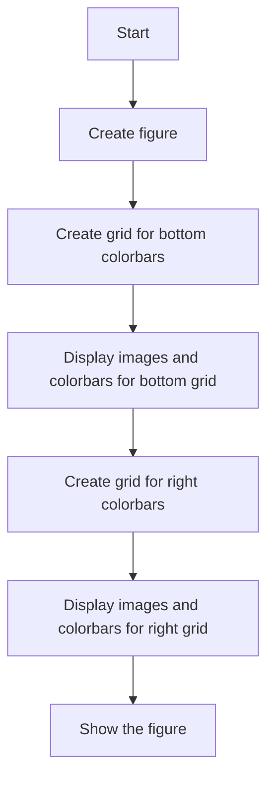
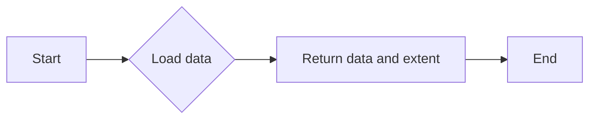
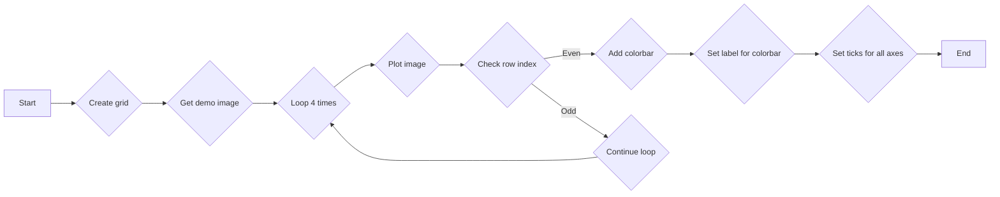
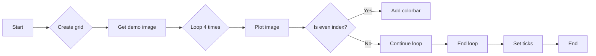
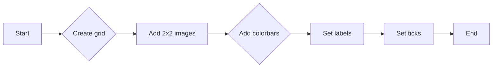

# `matplotlib\galleries\examples\axes_grid1\demo_edge_colorbar.py` 详细设计文档

This code demonstrates the use of shared colorbars for rows and columns in an image grid using Matplotlib's AxesGrid.

## 整体流程



## 类结构

```
matplotlib.pyplot (module)
├── get_demo_image (function)
│   ├── cbook (module)
│   └── bivariate_normal.npy (data)
├── demo_bottom_cbar (function)
│   ├── AxesGrid (class)
│   ├── imshow (function)
│   └── colorbar (function)
└── demo_right_cbar (function)
```

## 全局变量及字段


### `fig`
    
The main figure object where all subplots are drawn.

类型：`matplotlib.figure.Figure`
    


### `Z`
    
The data array to be visualized.

类型：`numpy.ndarray`
    


### `extent`
    
The extent of the data array, given as (xmin, xmax, ymin, ymax).

类型：`tuple`
    


### `cmaps`
    
The list of colormap names to be used for the images.

类型：`list`
    


### `grid`
    
The grid of axes where the images and colorbars are placed.

类型：`mpl_toolkits.axes_grid1.axes_grid.AxesGrid`
    


### `im`
    
The image object representing the visualization of the data array.

类型：`matplotlib.image.AxesImage`
    


### `cax`
    
The axes object containing the colorbar for the corresponding image.

类型：`matplotlib.axes.Axes`
    


### `AxesGrid.fig`
    
The figure object to which the grid is attached.

类型：`matplotlib.figure.Figure`
    


### `AxesGrid.nrows_ncols`
    
The number of rows and columns in the grid.

类型：`tuple`
    


### `AxesGrid.axes_pad`
    
The padding between axes in the grid.

类型：`float`
    


### `AxesGrid.share_all`
    
Whether all axes in the grid share the same x and y limits.

类型：`bool`
    


### `AxesGrid.label_mode`
    
The label mode for the axes in the grid.

类型：`str`
    


### `AxesGrid.cbar_location`
    
The location of the colorbar in the grid.

类型：`str`
    


### `AxesGrid.cbar_mode`
    
The mode of the colorbar in the grid.

类型：`str`
    


### `AxesGrid.cbar_pad`
    
The padding between the colorbar and the axes in the grid.

类型：`float`
    


### `AxesGrid.cbar_size`
    
The size of the colorbar in the grid.

类型：`str`
    


### `AxesGrid.direction`
    
The direction of the grid, either 'row' or 'column'.

类型：`str`
    
    

## 全局函数及方法


### get_demo_image()

获取用于演示的图像数据。

参数：

- 无

返回值：`numpy.ndarray`，图像数据，一个15x15的数组，以及图像的边界坐标。

#### 流程图



#### 带注释源码

```python
def get_demo_image():
    # Load sample data from a file
    z = cbook.get_sample_data("axes_grid/bivariate_normal.npy")  # 15x15 array
    # Return the data and the extent of the image
    return z, (-3, 4, -4, 3)
```


### demo_bottom_cbar(fig)

This function creates a grid of 2x2 images with a colorbar for each column in the grid.

参数：

- `fig`：`matplotlib.figure.Figure`，The figure object where the grid of images and colorbars will be plotted.

返回值：无

#### 流程图



#### 带注释源码

```python
def demo_bottom_cbar(fig):
    """
    A grid of 2x2 images with a colorbar for each column.
    """
    grid = AxesGrid(fig, 121,  # similar to subplot(121)
                    nrows_ncols=(2, 2),
                    axes_pad=0.10,
                    share_all=True,
                    label_mode="1",
                    cbar_location="bottom",
                    cbar_mode="edge",
                    cbar_pad=0.25,
                    cbar_size="15%",
                    direction="column"
                    )

    Z, extent = get_demo_image()
    cmaps = ["autumn", "summer"]
    for i in range(4):
        im = grid[i].imshow(Z, extent=extent, cmap=cmaps[i//2])
        if i % 2:
            grid.cbar_axes[i//2].colorbar(im)

    for cax in grid.cbar_axes:
        cax.axis[cax.orientation].set_label("Bar")

    # This affects all Axes as share_all = True.
    grid.axes_llc.set_xticks([-2, 0, 2])
    grid.axes_llc.set_yticks([-2, 0, 2])
```


### demo_right_cbar(fig)

This function creates a grid of 2x2 images with each row having its own colorbar on the right side.

参数：

- `fig`：`matplotlib.figure.Figure`，The figure object to which the grid of images and colorbars will be added.

返回值：`None`，This function does not return any value.

#### 流程图


#### 带注释源码

```python
def demo_right_cbar(fig):
    """
    A grid of 2x2 images. Each row has its own colorbar.
    """
    grid = AxesGrid(fig, 122,  # similar to subplot(122)
                    nrows_ncols=(2, 2),
                    axes_pad=0.10,
                    label_mode="1",
                    share_all=True,
                    cbar_location="right",
                    cbar_mode="edge",
                    cbar_size="7%",
                    cbar_pad="2%",
                    )
    Z, extent = get_demo_image()
    cmaps = ["spring", "winter"]
    for i in range(4):
        im = grid[i].imshow(Z, extent=extent, cmap=cmaps[i//2])
        if i % 2:
            grid.cbar_axes[i//2].colorbar(im)
    for cax in grid.cbar_axes:
        cax.axis[cax.orientation].set_label('Foo')
    grid.axes_llc.set_xticks([-2, 0, 2])
    grid.axes_llc.set_yticks([-2, 0, 2])
```


### demo_bottom_cbar(fig)

This function creates a grid of 2x2 images with a colorbar for each column.

参数：

- `fig`：`matplotlib.figure.Figure`，The figure to which the grid will be added.

返回值：无

#### 流程图



#### 带注释源码

```python
def demo_bottom_cbar(fig):
    """
    A grid of 2x2 images with a colorbar for each column.
    """
    grid = AxesGrid(fig, 121,  # similar to subplot(121)
                    nrows_ncols=(2, 2),
                    axes_pad=0.10,
                    share_all=True,
                    label_mode="1",
                    cbar_location="bottom",
                    cbar_mode="edge",
                    cbar_pad=0.25,
                    cbar_size="15%",
                    direction="column"
                    )

    Z, extent = get_demo_image()
    cmaps = ["autumn", "summer"]
    for i in range(4):
        im = grid[i].imshow(Z, extent=extent, cmap=cmaps[i//2])
        if i % 2:
            grid.cbar_axes[i//2].colorbar(im)

    for cax in grid.cbar_axes:
        cax.axis[cax.orientation].set_label("Bar")

    # This affects all Axes as share_all = True.
    grid.axes_llc.set_xticks([-2, 0, 2])
    grid.axes_llc.set_yticks([-2, 0, 2])
```


### demo_bottom_cbar(fig)

This function creates a grid of 2x2 images with a colorbar for each column.

参数：

- `fig`：`matplotlib.figure.Figure`，The figure to which the grid will be added.

返回值：无

#### 流程图



#### 带注释源码

```python
def demo_bottom_cbar(fig):
    """
    A grid of 2x2 images with a colorbar for each column.
    """
    grid = AxesGrid(fig, 121,  # similar to subplot(121)
                    nrows_ncols=(2, 2),
                    axes_pad=0.10,
                    share_all=True,
                    label_mode="1",
                    cbar_location="bottom",
                    cbar_mode="edge",
                    cbar_pad=0.25,
                    cbar_size="15%",
                    direction="column"
                    )

    Z, extent = get_demo_image()
    cmaps = ["autumn", "summer"]
    for i in range(4):
        im = grid[i].imshow(Z, extent=extent, cmap=cmaps[i//2])
        if i % 2:
            grid.cbar_axes[i//2].colorbar(im)

    for cax in grid.cbar_axes:
        cax.axis[cax.orientation].set_label("Bar")

    # This affects all Axes as share_all = True.
    grid.axes_llc.set_xticks([-2, 0, 2])
    grid.axes_llc.set_yticks([-2, 0, 2])
```


### demo_right_cbar(fig)

This function creates a grid of 2x2 images. Each row has its own colorbar.

参数：

- `fig`：`matplotlib.figure.Figure`，The figure to which the grid will be added.

返回值：无

#### 流程图


#### 带注释源码

```python
def demo_right_cbar(fig):
    """
    A grid of 2x2 images. Each row has its own colorbar.
    """
    grid = AxesGrid(fig, 122,  # similar to subplot(122)
                    nrows_ncols=(2, 2),
                    axes_pad=0.10,
                    label_mode="1",
                    share_all=True,
                    cbar_location="right",
                    cbar_mode="edge",
                    cbar_size="7%",
                    cbar_pad="2%",
                    )
    Z, extent = get_demo_image()
    cmaps = ["spring", "winter"]
    for i in range(4):
        im = grid[i].imshow(Z, extent=extent, cmap=cmaps[i//2])
        if i % 2:
            grid.cbar_axes[i//2].colorbar(im)

    for cax in grid.cbar_axes:
        cax.axis[cax.orientation].set_label('Foo')

    # This affects all Axes because we set share_all = True.
    grid.axes_llc.set_xticks([-2, 0, 2])
    grid.axes_llc.set_yticks([-2, 0, 2])
```

## 关键组件


### 张量索引与惰性加载

张量索引与惰性加载允许在图像网格中按需加载和显示图像数据，而不是一次性加载整个数据集。

### 反量化支持

反量化支持确保图像数据在显示时能够正确地映射到颜色映射中，从而提供准确的视觉表示。

### 量化策略

量化策略用于优化图像数据的处理和显示，通过减少数据精度来提高性能和效率。


## 问题及建议


### 已知问题

-   **全局变量和函数的复用性低**：代码中定义了`get_demo_image`函数和两个`demo_bottom_cbar`、`demo_right_cbar`函数，这些函数在功能上相似，但针对不同的颜色条位置进行操作。如果需要添加新的颜色条位置，可能需要复制和修改这些函数。
-   **代码可读性**：函数和变量命名不够清晰，例如`demo_bottom_cbar`和`demo_right_cbar`，从命名上无法直接理解其功能。
-   **异常处理**：代码中没有异常处理机制，如果发生错误（如文件读取失败），程序可能会崩溃。

### 优化建议

-   **提高代码复用性**：可以将`get_demo_image`和颜色条绘制逻辑提取出来，创建一个更通用的函数，这样可以根据不同的颜色条位置重用代码。
-   **改进命名**：使用更具描述性的命名来提高代码的可读性，例如将`demo_bottom_cbar`和`demo_right_cbar`分别改为`createBottomCbarGrid`和`createRightCbarGrid`。
-   **添加异常处理**：在读取文件和执行绘图操作时添加异常处理，确保程序在遇到错误时能够优雅地处理异常，而不是直接崩溃。
-   **代码结构**：可以考虑将绘图逻辑封装到一个类中，这样可以更好地组织代码，并提高代码的可维护性。
-   **性能优化**：如果图像数据非常大，可以考虑使用更高效的数据处理和绘图方法来提高性能。


## 其它


### 设计目标与约束

- 设计目标：实现一个图像网格，其中每行或每列共享一个颜色条。
- 约束条件：使用matplotlib库进行图像绘制和颜色条添加。
- 约束条件：确保颜色条与对应的图像行或列对齐。

### 错误处理与异常设计

- 错误处理：在获取示例图像数据时，如果数据文件不存在，则抛出异常。
- 异常设计：捕获异常并给出相应的错误信息。

### 数据流与状态机

- 数据流：从`get_demo_image`函数获取图像数据，然后传递给`demo_bottom_cbar`和`demo_right_cbar`函数进行处理。
- 状态机：无状态机，程序按顺序执行。

### 外部依赖与接口契约

- 外部依赖：matplotlib库。
- 接口契约：`get_demo_image`函数返回图像数据和范围，`demo_bottom_cbar`和`demo_right_cbar`函数负责绘制图像和颜色条。

### 安全性与隐私

- 安全性：无敏感数据处理，程序安全。
- 隐私：无个人数据收集，隐私保护。

### 性能考量

- 性能考量：确保图像和颜色条绘制快速且准确。
- 性能优化：无特定性能优化，但确保代码简洁以提高执行效率。

### 可维护性与可扩展性

- 可维护性：代码结构清晰，易于理解和维护。
- 可扩展性：可以通过添加新的图像处理函数来扩展功能。

### 测试与验证

- 测试：编写单元测试以确保每个函数按预期工作。
- 验证：通过实际运行示例来验证程序的功能。

### 文档与注释

- 文档：提供详细的设计文档和代码注释。
- 注释：在代码中添加必要的注释，以提高代码的可读性。

### 用户界面与交互

- 用户界面：无用户界面，程序通过命令行运行。
- 交互：无用户交互，程序自动执行。

### 部署与维护

- 部署：将程序打包并部署到目标环境。
- 维护：定期检查程序运行状态，确保稳定运行。


    