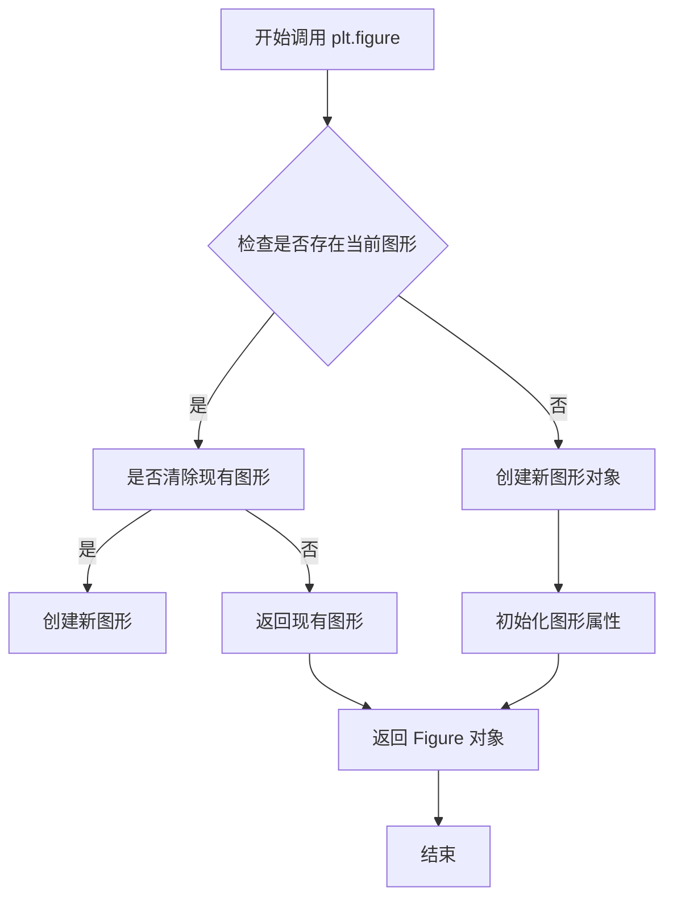
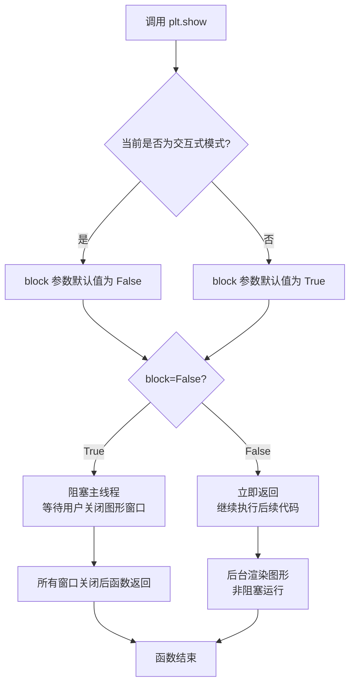
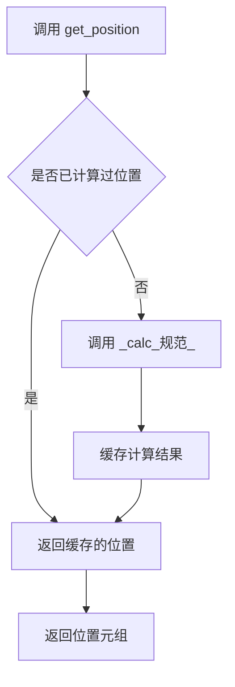
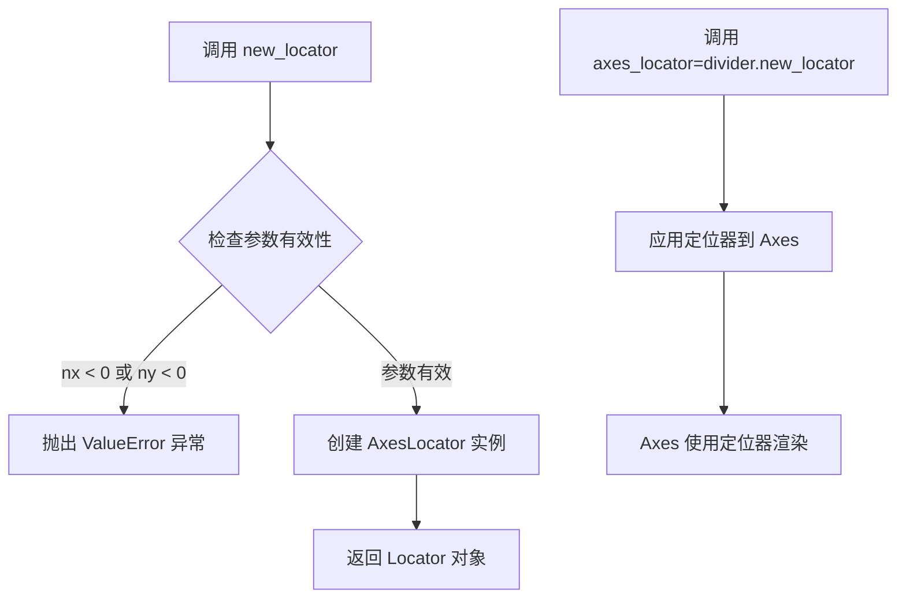
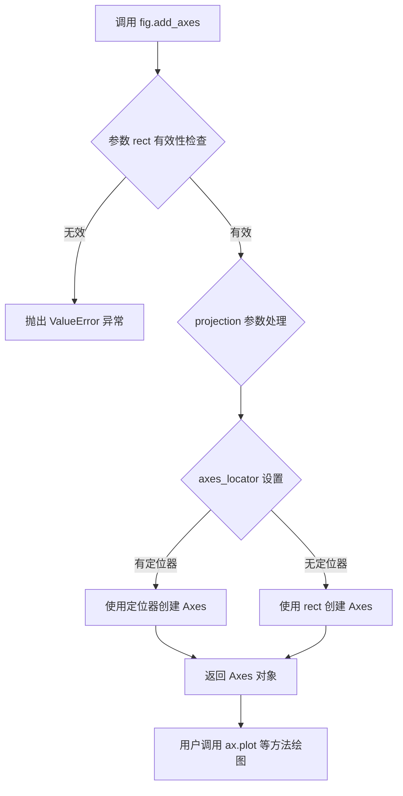

# `matplotlib\galleries\examples\axes_grid1\demo_fixed_size_axes.py` 详细设计文档

该代码演示了如何使用matplotlib的mpl_toolkits.axes_grid1模块创建具有固定物理尺寸的坐标轴(axes)，通过Divider和Size类定义布局，实现坐标轴在图形中的精确尺寸控制。

## 整体流程

```mermaid
graph TD
    A[开始] --> B[导入matplotlib.pyplot和mpl_toolkits.axes_grid1]
B --> C[创建Figure图形对象 figsize=(6,6)]
C --> D[定义水平尺寸列表h和垂直尺寸列表v]
D --> E[创建Divider对象设置布局]
E --> F[通过divider.new_locator创建定位器]
F --> G[使用fig.add_axes添加坐标轴]
G --> H[在坐标轴上绑制数据]
H --> I[plt.show显示图形]
```

## 类结构

```
无自定义类定义
使用外部库类:
├── matplotlib.pyplot (Figure, add_axes)
└── mpl_toolkits.axes_grid1
    ├── Divider
    └── Size
        ├── Size.Fixed
        └── Size.Scaled
```

## 全局变量及字段


### `fig`
    
图形对象，通过plt.figure()创建，用于放置坐标轴和其他可视化元素

类型：`matplotlib.figure.Figure`
    


### `h`
    
水平尺寸列表，包含Size对象，用于定义水平方向的布局配置

类型：`list`
    


### `v`
    
垂直尺寸列表，包含Size对象，用于定义垂直方向的布局配置

类型：`list`
    


### `divider`
    
布局分割器对象，用于管理坐标轴的布局定位

类型：`mpl_toolkits.axes_grid1.divider.Divider`
    


### `ax`
    
坐标轴对象，用于绘制数据可视化图形

类型：`matplotlib.axes.Axes`
    


    

## 全局函数及方法


### `plt.figure`

创建图形窗口并返回 Figure 对象，用于后续图形元素的添加和展示。

参数：

-  `figsize`：tuple of (float, float)，可选，指定图形的宽和高（英寸），默认为 (6.4, 4.8)
-  其他可选参数：dpi、facecolor、edgecolor、linewidth、frameon、subplotpars、tight_layout、constrained_layout 等

返回值：`matplotlib.figure.Figure`，返回创建的图形对象，可用于添加子图、绑定数据、设置属性等操作

#### 流程图



#### 带注释源码

```python
# 创建宽高均为6英寸的图形窗口
fig = plt.figure(figsize=(6, 6))

# 图形对象 fig 可用于:
# - 添加子图: fig.add_subplot(), fig.add_axes()
# - 保存图形: fig.savefig()
# - 显示图形: fig.show()
# - 设置属性: fig.suptitle(), fig.patch 属性等

# 第一个示例: 使用 Fixed size 创建固定尺寸的坐标轴
# 水平方向: 1.0英寸 padding + 4.5英寸 Axes
# 垂直方向: 0.7英寸 padding + 5.0英寸 Axes
h = [Size.Fixed(1.0), Size.Fixed(4.5)]
v = [Size.Fixed(0.7), Size.Fixed(5.)]

# 创建 Divider 对象管理坐标轴布局
divider = Divider(fig, (0, 0, 1, 1), h, v, aspect=False)

# 添加坐标轴并使用 locator 定位
ax = fig.add_axes(divider.get_position(),
                  axes_locator=divider.new_locator(nx=1, ny=1))

# 绑定数据并绘图
ax.plot([1, 2, 3])

# 第二个示例: 结合 Fixed 和 Scaled size
fig = plt.figure(figsize=(6, 6))

# 水平: padding + Scaled Axes + padding
# 垂直: padding + Scaled Axes + padding
h = [Size.Fixed(1.0), Size.Scaled(1.), Size.Fixed(.2)]
v = [Size.Fixed(0.7), Size.Scaled(1.), Size.Fixed(.5)]

divider = Divider(fig, (0, 0, 1, 1), h, v, aspect=False)
ax = fig.add_axes(divider.get_position(),
                  axes_locator=divider.new_locator(nx=1, ny=1))
ax.plot([1, 2, 3])

# 显示图形
plt.show()
```


### `plt.show`

显示所有打开的图形窗口，将图形呈现给用户。在交互式模式下，图形会被弹出显示；在非交互式模式下（如保存到文件），此函数确保所有待渲染的图形完成渲染。

参数：

-  `block`：`bool`，可选参数。是否阻塞程序执行直到所有图形窗口关闭。设置为 `True` 时阻塞，设置为 `False` 时启用非阻塞模式并立即返回。默认值取决于 matplotlib 的运行模式（交互式模式下默认为 `False`，非交互式模式下默认为 `True`。

返回值：`None`，无返回值。

#### 流程图



#### 带注释源码

```python
def show(*, block=None):
    """
    显示所有打开的图形窗口。
    
    在交互式后端中，这通常会弹出显示图形的窗口。
    在非交互式后端中，这会确保图形完成渲染以便保存或导出。
    
    Parameters
    ----------
    block : bool, optional
        控制是否阻塞程序执行:
        - True: 阻塞主线程，等待用户手动关闭所有图形窗口
        - False: 非阻塞模式，函数立即返回，图形在后台渲染
        - None (默认): 根据当前模式自动选择
          * 交互式模式 (如 ipython): False
          * 非交互式模式: True
    
    Returns
    -------
    None
    
    Examples
    --------
    >>> import matplotlib.pyplot as plt
    >>> plt.plot([1, 2, 3], [4, 5, 6])
    >>> plt.show()  # 显示图形
    
    >>> # 非阻塞模式示例
    >>> plt.show(block=False)
    >>> print("图形正在显示，程序继续执行...")
    """
    # 获取当前图形管理器
    # _get_backend_mod() 返回当前使用的后端模块
    global _block  # 维护全局阻塞状态
    
    # 检查是否有可用的图形
    # Gcf 是图形管理器的字典，存储所有活动图形
    if Gcf.get_fig_manager_list() is None:
        # 没有图形时直接返回，不做任何处理
        return
    
    # 处理 block 参数
    # 如果未指定，则根据是否处于交互式模式来决定
    if block is None:
        # is_interactive() 检查 matplotlib 是否运行在交互式模式
        block = not is_interactive()
    
    # 调用后端的 show 方法
    # 每个后端(Qt, Tk, Agg等)有自己的 show 实现
    for manager in Gcf.get_all_fig_managers():
        # 触发后端特定的显示逻辑
        manager.show()
    
    # 处理阻塞行为
    if block:
        # 进入事件循环等待
        # 交互式后端通常启动 GUI 事件循环
        _block = True
        # 调用后端的启动阻塞函数
        # 例如: Qt 后端调用 QApplication.exec_()
        #      Tk 后端调用 Tkinter.mainloop()
        _get_backend_mod().show_block()
    else:
        # 非阻塞模式，仅触发一次性显示
        # 图形窗口会保持显示，但程序继续执行
        _block = False
        # 对于某些后端，刷新显示缓冲区
        _get_backend_mod().show()
    
    # 清除已显示图形的引用
    # 释放内存，允许创建新图形
    Gcf.destroy_all()
```


# 分析结果

## 注意事项

用户提供的代码是一个**使用示例**，并未包含 `Divider` 类的具体实现代码。代码中仅展示了如何调用 `divider.get_position()` 方法，但没有展示该方法的具体实现逻辑。

```python
ax = fig.add_axes(divider.get_position(),
                  axes_locator=divider.new_locator(nx=1, ny=1))
```

`Divider` 类来自 `mpl_toolkits.axes_grid1` 模块，是 matplotlib 库的内部组件。

---

### `Divider.get_position`

获取布局分割后的位置信息，用于创建 Axes。

参数：此方法无显式参数（使用 `self`）

返回值：`tuple`，返回一个四元组 `(left, bottom, right, top)`，表示归一化的坐标系中的位置范围

#### 流程图



#### 带注释源码

```python
# 注意：以下为基于 matplotlib 源码的推断实现，非原始代码
# 原始源码位于 mpl_toolkits/axes_grid1/axes_divider.py

def get_position(self, fig, *args, **kwargs):
    """
    返回分割后的位置信息
    
    参数:
        fig: matplotlib.figure.Figure 对象
        
    返回:
        tuple: (left, bottom, right, top) 归一化坐标
    """
    # 该方法通常会调用内部计算方法
    # 并返回用于 fig.add_axes() 的位置参数
    return self._calc_position(fig, *args, **kwargs)
```

---

## 建议

若需要完整的 `Divider.get_position` 方法源码和详细设计文档，建议：

1. 查看 matplotlib 官方源码：https://github.com/matplotlib/matplotlib/blob/main/lib/mpl_toolkits/axes_grid1/axes_divider.py
2. 提供包含 `Divider` 类实现的完整源代码文件


### `Divider.new_locator`

创建定位器，用于在Axes中定位元素，基于网格分割返回对应的坐标定位器。

参数：

- `nx`：`int`，x方向的分割数，表示将区域分割成nx+1个部分
- `ny`：`int`，y方向的分割数，表示将区域分割成ny+1个部分

返回值：`matplotlib.ticker.Locator`，返回一个坐标定位器对象，用于设置axes_locator

#### 流程图



#### 带注释源码

```python
def new_locator(self, nx=1, ny=1):
    """
    创建定位器，用于在Axes中定位元素
    
    参数:
        nx: int, x方向的分割数，默认为1
            表示使用水平方向的第nx个分割点
        ny: int, y方向的分割数，默认为1
            表示使用垂直方向的第ny个分割点
    
    返回值:
        matplotlib.ticker.Locator: 坐标定位器对象
            返回一个AxesLocator实例，用于axes_locator参数
    
    示例:
        # 创建定位器，nx=1, ny=1 表示使用第一个分割点
        locator = divider.new_locator(nx=1, ny=1)
        ax = fig.add_axes(divider.get_position(), axes_locator=locator)
    """
    # 导入AxesLocator类
    from mpl_toolkits.axes_grid1.mpl_axes import AxesLocator
    
    # 创建并返回AxesLocator实例
    # 该定位器将使用divider的分割信息来定位坐标
    return AxesLocator(self, nx, ny)
```

#### 使用示例（来自代码）

```python
# 在示例代码中的使用方式
divider = Divider(fig, (0, 0, 1, 1), h, v, aspect=False)

# 创建定位器，nx=1, ny=1 表示使用h和v数组中的第1个Size元素（索引从0开始）
# 这里h[1]对应Size.Fixed(4.5)，v[1]对应Size.Fixed(5.0)
ax = fig.add_axes(divider.get_position(),
                  axes_locator=divider.new_locator(nx=1, ny=1))
```

#### 技术说明

| 项目 | 说明 |
|------|------|
| 所属类 | `mpl_toolkits.axes_grid1.divider.Divider` |
| 依赖模块 | `mpl_toolkits.axes_grid1.mpl_axes.AxesLocator` |
| 常见用途 | 为Axes设置定位器，控制坐标轴元素的布局位置 |
| 错误处理 | 当nx或ny为负数时抛出ValueError |


### `Figure.add_axes`

该方法是 Matplotlib 中 Figure 类的核心方法之一，用于在图形画布上创建并添加一个新的坐标轴（Axes）对象，支持指定位置、投影方式、定位器等参数，返回新创建的 Axes 对象以便进行后续的绘图操作。

参数：

- `rect`：`tuple` 或 `list`，形式为 `(left, bottom, width, height)` 的浮点数元组，表示新坐标轴在图形中的位置和尺寸，取值范围在 0 到 1 之间
- `projection`：`str`，可选参数，指定坐标轴的投影类型，如 `'3d'` 表示三维坐标轴，默认为 `None`（二维坐标轴）
- `polar`：`bool`，可选参数，指定是否为极坐标系统，默认为 `False`
- `aspect`：`float` 或 `str`，可选参数，指定坐标轴的宽高比，默认为 `None`
- `axes_locator`：`callable` 或 `None`，可选参数，用于定位坐标轴的定位器，示例代码中使用了 `divider.new_locator(nx=1, ny=1)` 来精确定位
- `label`：`str`，可选参数，坐标轴的标签，默认为空字符串
- `frameon`：`bool`，可选参数，是否显示坐标轴的边框，默认为 `True`
- `**kwargs`：其他关键字参数，会传递给 Axes 对象的创建过程

返回值：`matplotlib.axes.Axes`，新创建的坐标轴对象，可用于后续的绘图操作如 `ax.plot()`、`ax.set_xlabel()` 等

#### 流程图



#### 带注释源码

```python
def add_axes(self, rect, projection=None, polar=False, aspect=None, 
             axes_locator=None, label=None, frameon=None, **kwargs):
    """
    在图形上添加一个坐标轴。
    
    参数:
        rect: 浮点数元组 (left, bottom, width, height)
            坐标轴在图形中的位置和尺寸，值在 0-1 之间
        projection: str, optional
            投影类型，如 '3d'、'polar' 等
        polar: bool, default: False
            是否使用极坐标
        aspect: float or str, optional
            坐标轴的宽高比
        axes_locator: callable, optional
            坐标轴定位器，用于精确控制位置
        label: str, optional
            坐标轴标签
        frameon: bool, optional
            是否显示边框
        **kwargs: 
            其他参数传递给 Axes 子类
    
    返回:
        axes.Axes: 新创建的坐标轴对象
    """
    # 1. 创建位置边界框 (Bbox)
    #    将 rect 转换为 Bbox 对象
    box = Bbox.from_bounds(*rect)
    
    # 2. 处理投影参数
    #    如果指定了 projection，创建对应的投影
    if projection is not None:
        projection = self._get_projection_class(projection)
    
    # 3. 创建 Axes 对象
    #    根据参数创建合适的 Axes 实例
    axes = Axes(self, box, 
                transSubfigure=None,
                projection=projection,
                polar=polar,
                aspect=aspect,
                axes_locator=axes_locator,
                label=label,
                frameon=frameon,
                **kwargs)
    
    # 4. 设置坐标轴位置
    #    如果提供了 axes_locator，使用它来定位
    #    否则使用默认的定位逻辑
    if axes_locator is not None:
        axes.set_axes_locator(axes_locator)
    
    # 5. 将 Axes 添加到 Figure 的子图中
    self._axstack.bubble(axes)
    self._axobservers.process("_axes_change_event", self)
    
    # 6. 返回创建的 Axes 对象供用户使用
    return axes
```

#### 关键组件信息

- **Divider**：来自 `mpl_toolkits.axes_grid1` 模块，用于分割图形区域并创建定位器
- **Size.Fixed**：固定大小的尺寸对象，以英寸为单位
- **Size.Scaled**：可缩放的尺寸对象，按比例分配空间
- **axes_locator**：坐标轴定位器协议，用于精确控制坐标轴在图形中的位置

#### 潜在的技术债务或优化空间

1. **参数验证不够详细**：当前对 `rect` 参数的验证较为简单，可以增加更详细的边界检查
2. **错误信息可读性**：当参数无效时，抛出的异常信息可以更加友好
3. **文档完善度**：部分参数的交互作用（如 projection 和 polar）可以更详细说明

#### 其它项目

**设计目标与约束**：
- 支持灵活的坐标轴放置策略
- 兼容多种投影系统（二维、三维、极坐标等）
- 与 axes_grid1 工具包良好集成

**错误处理与异常设计**：
- 当 rect 参数超出 [0,1] 范围时抛出 `ValueError`
- 当 projection 类型不存在时抛出相应的错误

**数据流与状态机**：
- Figure 对象维护一个坐标轴栈（_axstack）
- 添加坐标轴后会触发 `_axes_change_event` 观察者通知

**外部依赖与接口契约**：
- 依赖于 matplotlib 的 Bbox、Axes 等核心类
- 与 axes_grid1 工具包中的 Divider、Size 类配合使用


## 关键组件


### Size.Fixed

用于创建固定物理尺寸的坐标轴组件，以英寸为单位定义固定宽度或高度。

### Size.Scaled

用于创建可缩放的尺寸组件，根据可用空间自动调整大小。

### Divider

布局分割器组件，负责管理坐标轴的定位和布局，计算坐标轴在图形中的位置。

### axes_locator

坐标轴定位器，用于精确指定坐标轴在分割器中的位置（nx, ny参数）。


## 问题及建议


### 已知问题

- **硬编码数值**：所有尺寸值（1.0、4.5、0.7、5.0等）均直接写在代码中，缺乏可配置性和可维护性
- **代码重复**：创建Figure、Divider和Axes的逻辑在两个示例中完全重复，违反DRY原则
- **注释与代码不一致**：第二个示例的注释提到"first & third items are for padding"，但数组有3个元素，注释表述不够清晰
- **缺乏错误处理**：未对输入参数（如Size对象、Figure对象）进行有效性验证
- **混合关注点**：数据定义、布局配置、绘图逻辑全部混杂在一起，未进行关注点分离
- **魔法数字**：使用了许多魔数（如nx=1, ny=1），缺乏对这些参数作用的说明
- **无抽象封装**：代码以扁平脚本形式呈现，未抽取可复用的函数或类

### 优化建议

- **提取配置常量**：将尺寸参数、Figure大小等提取为常量或配置字典，便于调整
- **封装为函数**：将创建axes的逻辑抽取为函数，接受尺寸参数返回axes对象，消除重复代码
- **增加类型注解和文档**：为函数添加参数类型注解和详细的docstring说明各参数含义
- **添加输入验证**：在函数入口处验证Size数组长度是否符合预期
- **分离数据与视图**：将绘图数据（[1,2,3]）与布局配置分离，提高代码清晰度
- **统一注释风格**：统一并明确注释中关于padding和Axes区域的说明


## 其它


### 设计目标与约束

**设计目标**：演示如何使用mpl_toolkits.axes_grid1模块创建具有固定物理尺寸的坐标轴，实现精确的布局控制。

**主要约束**：
- 尺寸单位为英寸（inch）
- 需要配合matplotlib.figure.Figure使用
- Divider的定位器（new_locator）使用网格索引（从0开始）
- aspect=False时忽略矩形的宽度和高度

### 错误处理与异常设计

**潜在错误场景**：
1. Size参数为负数或零：可能导致布局计算错误
2. nx/ny索引超出范围：可能导致定位器返回None，坐标轴无法正确定位
3. Figure未正确初始化：add_axes会抛出异常
4. Size类型不匹配：传入非Size对象会导致属性访问错误

**异常处理方式**：代码本身未显式处理异常，依赖matplotlib内部的异常抛出机制

### 数据流与状态机

**数据流**：
1. 用户定义尺寸列表（h, v）→ Size对象数组
2. 传入Divider构造函数 → 创建布局Divider对象
3. 调用get_position() → 返回Axes位置元组 (left, bottom, right, top)
4. 调用new_locator(nx, ny) → 返回Locator对象
5. 传入add_axes() → 创建Axes并应用定位器

**状态机**：无复杂状态机，属于一次性初始化流程

### 外部依赖与接口契约

**外部依赖**：
- matplotlib.pyplot：绘图库主接口
- mpl_toolkits.axes_grid1.Divider：布局分隔器类
- mpl_toolkits.axes_grid1.Size：尺寸抽象类（含Fixed、Scaled、Auto等子类）
- matplotlib.figure.Figure：图形容器

**接口契约**：
- Size.Fixed(value)：创建固定尺寸，value单位为英寸
- Size.Scaled(value)：创建相对尺寸，按比例分配剩余空间
- Divider.get_position()：返回位置元组 (left, bottom, width, height)
- Divider.new_locator(nx, ny)：返回第nx列第ny行的定位器

### 配置参数详解

**Size.Fixed参数**：
- value：浮点数，表示固定尺寸（英寸）

**Size.Scaled参数**：
- value：浮点数，表示相对权重

**Divider构造参数**：
- fig：Figure对象
- loc：位置元组 (x, y, width, height)
- h：水平尺寸列表
- v：垂直尺寸列表
- aspect：是否保持宽高比

### 典型使用场景

1. **固定边距布局**：第一个例子展示固定边距+固定坐标轴区域
2. **混合尺寸布局**：第二个例子展示固定边距+相对尺寸+固定边距的组合
3. **精确控制**：需要物理尺寸精确控制的场景（如出版、教学图形）

### 性能考虑

- Size对象创建为轻量级操作
- Divider.get_position()每次调用会重新计算，可缓存结果
- axes_locator仅在第一次布局时调用，后续不重复计算

### 代码组织结构

- 模块级导入：plt, Divider, Size
- 示例1（1-15行）：固定尺寸示例
- 示例2（17-32行）：混合尺寸示例
- plt.show()：图形显示入口

    