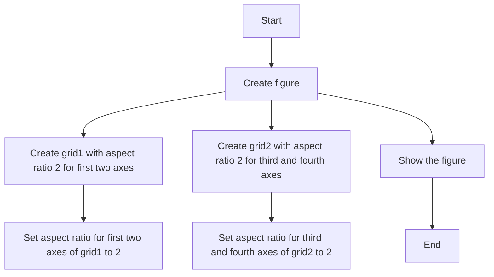
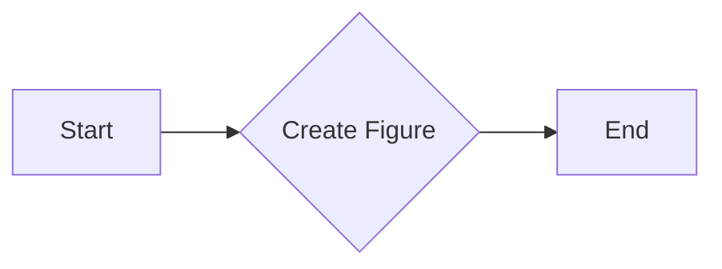
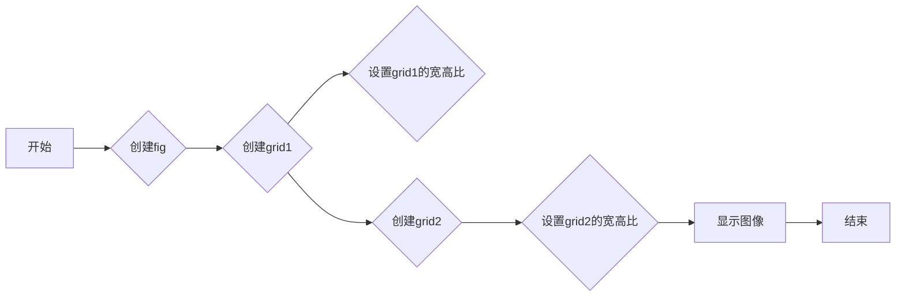
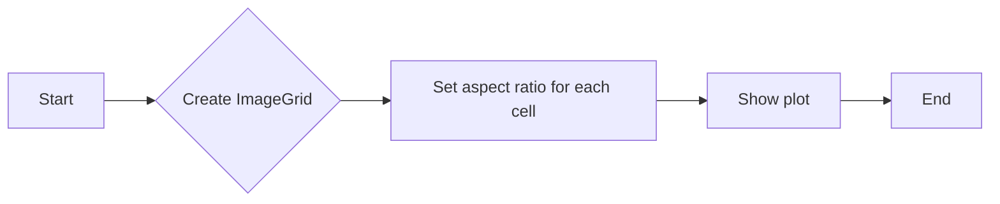

# `matplotlib\galleries\examples\axes_grid1\demo_imagegrid_aspect.py` 详细设计文档

This code creates a grid of images with a fixed aspect ratio using the matplotlib library.

## 整体流程



## 类结构

```
ImageGrid (matplotlib class)
├── fig (matplotlib.figure.Figure)
│   ├── grid1 (mpl_toolkits.axes_grid1.ImageGrid)
│   ├── grid2 (mpl_toolkits.axes_grid1.ImageGrid)
│   └── axes_pad (float)
└── aspect (bool)
```

## 全局变量及字段


### `fig`
    
The main figure object created by matplotlib for plotting.

类型：`matplotlib.figure.Figure`
    


### `grid1`
    
The ImageGrid object for the first grid of subplots.

类型：`mpl_toolkits.axes_grid1.imagegrid.ImageGrid`
    


### `grid2`
    
The ImageGrid object for the second grid of subplots.

类型：`mpl_toolkits.axes_grid1.imagegrid.ImageGrid`
    


### `axes_pad`
    
The padding between subplots in the grid.

类型：`float`
    


### `aspect`
    
Whether to set the aspect of the subplots to be equal.

类型：`bool`
    


### `matplotlib.figure.Figure.fig`
    
The main figure object created by matplotlib for plotting.

类型：`matplotlib.figure.Figure`
    


### `mpl_toolkits.axes_grid1.imagegrid.ImageGrid.grid1`
    
The ImageGrid object for the first grid of subplots.

类型：`mpl_toolkits.axes_grid1.imagegrid.ImageGrid`
    


### `mpl_toolkits.axes_grid1.imagegrid.ImageGrid.grid2`
    
The ImageGrid object for the second grid of subplots.

类型：`mpl_toolkits.axes_grid1.imagegrid.ImageGrid`
    


### `mpl_toolkits.axes_grid1.imagegrid.ImageGrid.axes_pad`
    
The padding between subplots in the grid.

类型：`float`
    


### `mpl_toolkits.axes_grid1.imagegrid.ImageGrid.aspect`
    
Whether to set the aspect of the subplots to be equal.

类型：`bool`
    
    

## 全局函数及方法


### plt.figure()

该函数用于创建一个新的图形窗口，并返回一个Figure对象。

参数：

- 无

返回值：`Figure`，一个matplotlib图形窗口对象，用于绘制图形和子图。

#### 流程图



#### 带注释源码

```python
import matplotlib.pyplot as plt

# 创建一个新的图形窗口
fig = plt.figure()

# ... (后续代码)
```


### ImageGrid

该函数创建了一个具有固定宽高比的图像网格，用于在matplotlib中展示图像。

参数：

- `fig`：`matplotlib.figure.Figure`，matplotlib图形对象，用于创建图像网格。
- `nrows`：`int`，网格的行数。
- `ncols`：`int`，网格的列数。
- `axes_pad`：`float`，轴之间的填充。
- `aspect`：`bool`，是否保持轴的宽高比。
- `share_all`：`bool`，是否共享所有轴。

返回值：`ImageGrid`对象，用于管理图像网格。

#### 流程图



#### 带注释源码

```python
"""
=========================================
ImageGrid cells with a fixed aspect ratio
=========================================
"""

import matplotlib.pyplot as plt

from mpl_toolkits.axes_grid1 import ImageGrid

fig = plt.figure()  # 创建matplotlib图形对象

grid1 = ImageGrid(fig, 121, (2, 2), axes_pad=0.1,
                  aspect=True, share_all=True)  # 创建图像网格
for i in [0, 1]:
    grid1[i].set_aspect(2)  # 设置grid1的宽高比

grid2 = ImageGrid(fig, 122, (2, 2), axes_pad=0.1,
                  aspect=True, share_all=True)  # 创建图像网格
for i in [1, 3]:
    grid2[i].set_aspect(2)  # 设置grid2的宽高比

plt.show()  # 显示图像
```


### plt.show()

`plt.show()` 是 Matplotlib 库中的一个全局函数，用于显示当前图形。

参数：

- 无

返回值：无

#### 流程图


#### 带注释源码

```python
"""
=========================================
ImageGrid cells with a fixed aspect ratio
=========================================
"""

import matplotlib.pyplot as plt

from mpl_toolkits.axes_grid1 import ImageGrid

fig = plt.figure()  # 创建一个图形

grid1 = ImageGrid(fig, 121, (2, 2), axes_pad=0.1,
                  aspect=True, share_all=True)  # 创建一个 ImageGrid
for i in [0, 1]:
    grid1[i].set_aspect(2)  # 设置网格中每个轴的纵横比

grid2 = ImageGrid(fig, 122, (2, 2), axes_pad=0.1,
                  aspect=True, share_all=True)  # 创建另一个 ImageGrid
for i in [1, 3]:
    grid2[i].set_aspect(2)  # 设置网格中每个轴的纵横比

plt.show()  # 显示图形
```


### ImageGrid.__init__

初始化ImageGrid对象，创建具有固定宽高比的图像网格。

参数：

- `fig`：`matplotlib.figure.Figure`，当前图像的Figure对象，用于创建图像网格。
- `nrows`：`int`，网格的行数。
- `ncols`：`int`，网格的列数。
- `axes_pad`：`float`，轴之间的填充。
- `aspect`：`bool`，是否保持轴的宽高比。
- `share_all`：`bool`，是否共享所有轴。

返回值：无

#### 流程图



#### 带注释源码

```python
"""
=========================================
ImageGrid cells with a fixed aspect ratio
=========================================
"""

import matplotlib.pyplot as plt

from mpl_toolkits.axes_grid1 import ImageGrid

def __init__(self, fig, nrows, ncols, axes_pad=0.1, aspect=True, share_all=True):
    # 创建图像网格
    self.grid = ImageGrid(fig, 121, (nrows, ncols), axes_pad=axes_pad,
                          aspect=aspect, share_all=share_all)
    # 设置每个单元格的宽高比
    for i in range(nrows * ncols):
        self.grid[i].set_aspect(2)
    # 显示图像
    plt.show()
```


### ImageGrid.set_aspect

设置图像网格中单元格的纵横比。

参数：

- `aspect`：`float`，纵横比值。该值表示单元格的宽度与高度的比值。

返回值：`None`，该方法不返回任何值。

#### 流程图


#### 带注释源码

```python
from mpl_toolkits.axes_grid1 import ImageGrid

# 设置图像网格中单元格的纵横比
def set_aspect(self, aspect):
    for i in range(self.nrows * self.ncols):
        self.axes[i].set_aspect(aspect)
```


## 关键组件


### 张量索引与惰性加载

支持对图像网格中的张量进行索引，并在需要时才加载图像数据，以优化内存使用。

### 反量化支持

提供对反量化操作的支持，允许在量化过程中进行逆量化处理。

### 量化策略

实现不同的量化策略，如均匀量化、三值量化等，以适应不同的应用场景。


## 问题及建议


### 已知问题

-   {问题1}：代码中使用了硬编码的图号（121 和 122），这可能导致维护困难，如果图号发生变化，代码需要相应修改。
-   {问题2}：代码中使用了 `matplotlib.pyplot` 的 `ImageGrid`，但没有进行异常处理，如果 `matplotlib` 库无法正常工作，程序可能会崩溃。
-   {问题3}：代码没有进行任何形式的日志记录或错误报告，这不利于调试和问题追踪。

### 优化建议

-   {建议1}：将图号作为参数传递给函数，以便于维护和修改。
-   {建议2}：添加异常处理，确保在 `matplotlib` 库无法正常工作时，程序能够优雅地处理异常。
-   {建议3}：引入日志记录，以便于追踪程序的运行状态和潜在的错误。
-   {建议4}：考虑使用面向对象的方法来封装图像网格的创建和配置，以提高代码的可重用性和可维护性。
-   {建议5}：如果图像网格的配置是可重复使用的，可以考虑将其封装成一个类或模块，以便在不同的项目中重用。


## 其它


### 设计目标与约束

- 设计目标：实现一个具有固定宽高比的图像网格，用于展示图像。
- 约束条件：使用matplotlib库进行图像绘制，确保图像网格的宽高比一致。

### 错误处理与异常设计

- 错误处理：代码中未包含显式的错误处理机制。
- 异常设计：由于代码主要依赖于matplotlib库，因此可能需要处理matplotlib相关的异常。

### 数据流与状态机

- 数据流：代码中主要涉及图像网格的创建和配置。
- 状态机：代码中没有明显的状态转换过程。

### 外部依赖与接口契约

- 外部依赖：代码依赖于matplotlib库。
- 接口契约：matplotlib库提供了图像网格的创建和配置接口。


    