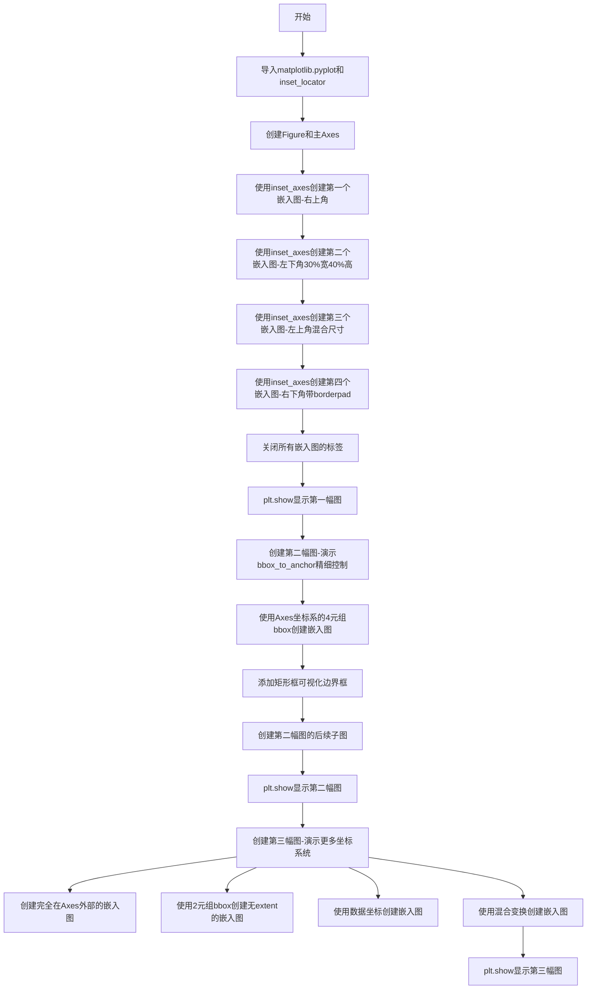
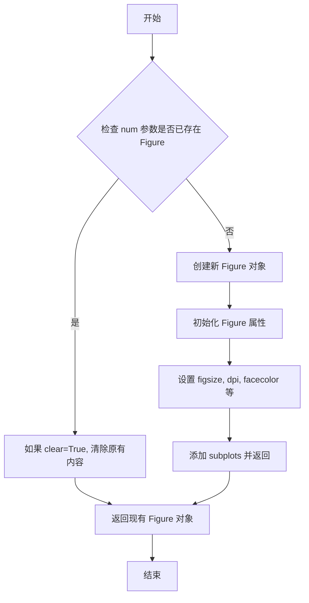
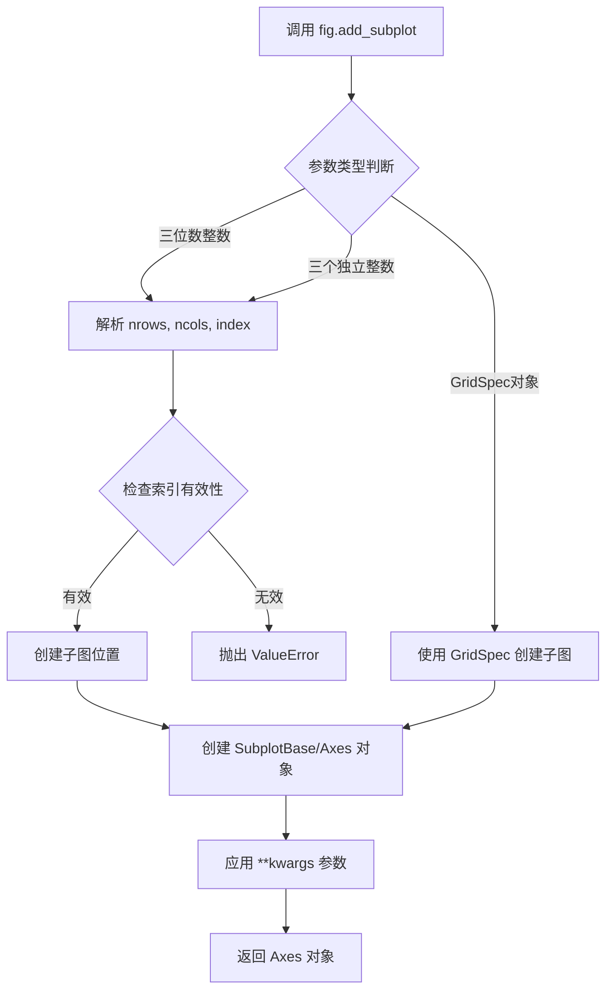
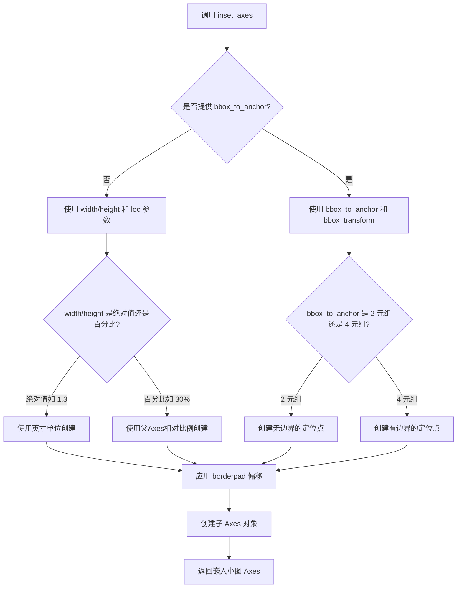
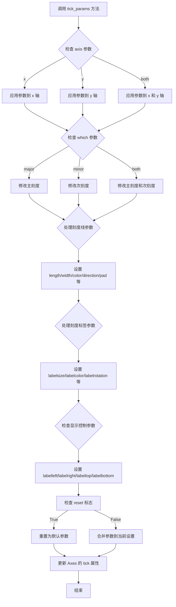
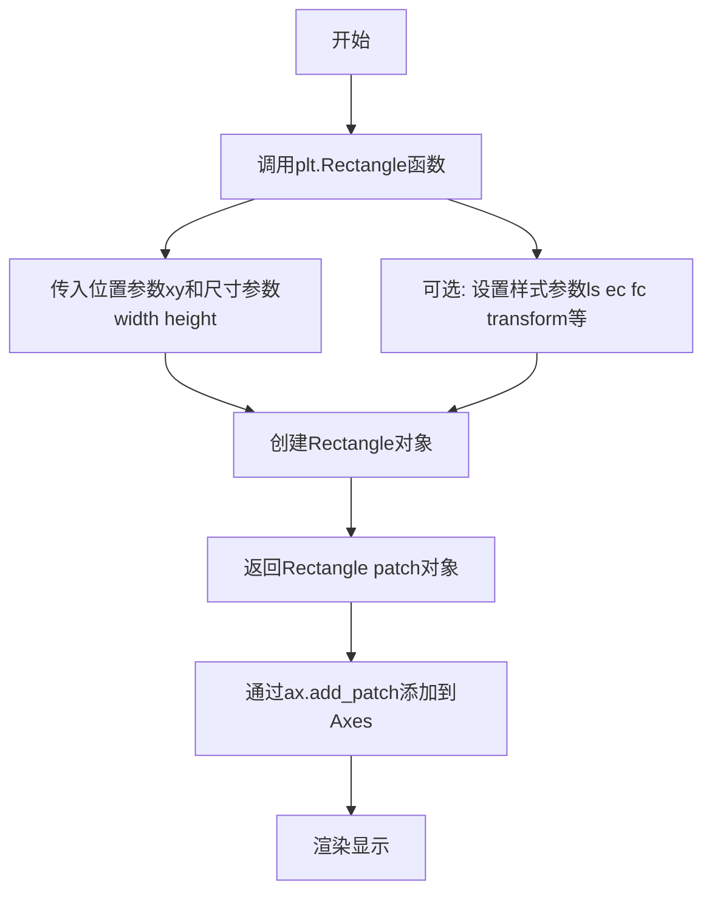
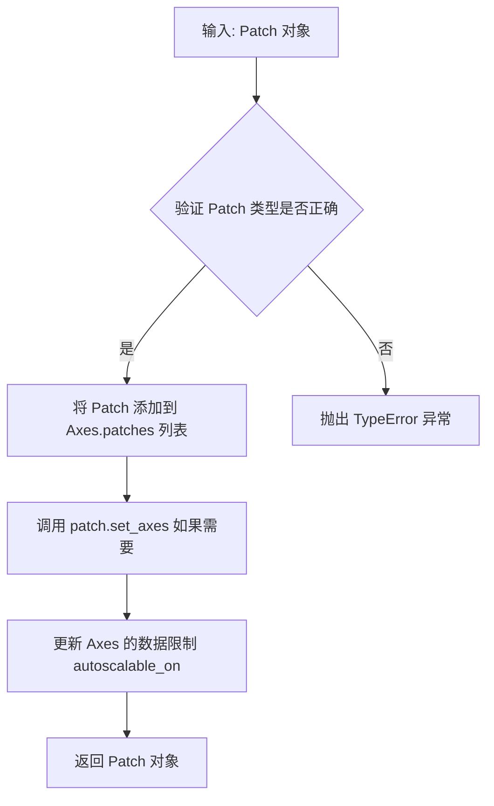
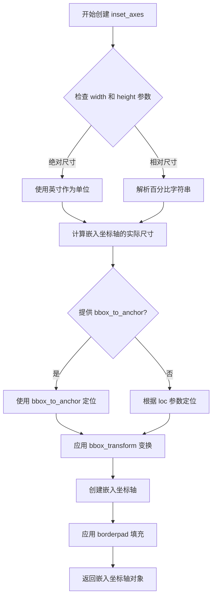
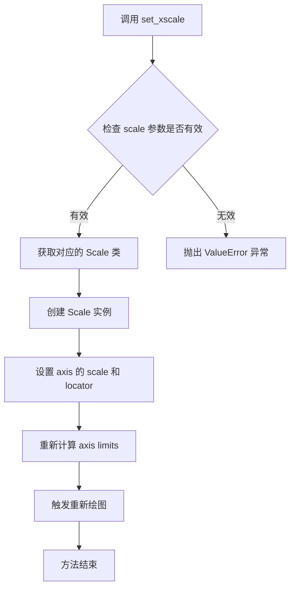
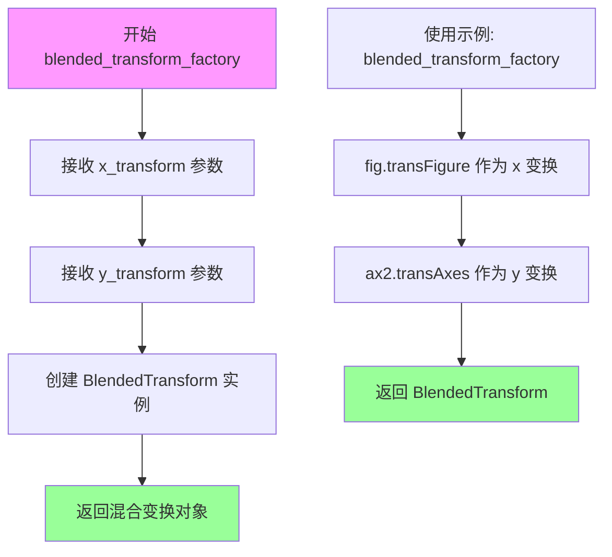

# `matplotlib\galleries\examples\axes_grid1\inset_locator_demo.py` 详细设计文档

该代码是一个matplotlib inset_locator演示脚本,展示了如何使用inset_axes在主图的指定位置创建嵌入的小图(inset),支持通过绝对尺寸(英寸)、相对尺寸(百分比)、边界框(bbox_to_anchor)和坐标变换(bbox_transform)等多种方式来定位和调整嵌入图的大小,并演示了数据坐标、轴坐标、混合坐标等不同坐标系的应用场景。

## 整体流程



## 类结构

```
Python脚本 (非面向对象)
└── 主要使用的类和函数:
    ├── plt (matplotlib.pyplot模块)
    ├── inset_axes (从mpl_toolkits.axes_grid1.inset_locator导入)
    ├── Figure (matplotlib.figure.Figure)
    ├── Axes (matplotlib.axes.Axes)
    ├── Rectangle (matplotlib.pyplot.Rectangle)
    └── blended_transform_factory (matplotlib.transforms)
```

## 全局变量及字段


### `fig`
    
matplotlib Figure对象,整个图形的容器

类型：`matplotlib.figure.Figure`
    


### `ax`
    
第一个子图的Axes对象,作为嵌入图的主Axes

类型：`matplotlib.axes.Axes`
    


### `ax2`
    
第二个子图的Axes对象

类型：`matplotlib.axes.Axes`
    


### `ax3`
    
第三个子图的Axes对象

类型：`matplotlib.axes.Axes`
    


### `axins`
    
第一个嵌入的Axes对象,位于ax右上角

类型：`matplotlib.axes.Axes`
    


### `axins2`
    
第二个嵌入的Axes对象,位于ax左下角30%x40%

类型：`matplotlib.axes.Axes`
    


### `axins3`
    
第三个嵌入的Axes对象,位于ax2左上角混合尺寸

类型：`matplotlib.axes.Axes`
    


### `axins4`
    
第四个嵌入的Axes对象,位于ax2右下角带borderpad

类型：`matplotlib.axes.Axes`
    


### `transform`
    
混合变换对象,结合figure和axes变换

类型：`matplotlib.transforms.BlendedTransform`
    


    

## 全局函数及方法


### `plt.subplots`

`plt.subplots` 是 matplotlib.pyplot 模块中的函数，用于创建一个包含多个子图的 Figure 对象和对应的 Axes 对象数组，支持自定义网格布局、共享坐标轴、尺寸比例等高级配置。

参数：

- `nrows`：`int`，默认值 1，子图网格的行数
- `ncols`：`int`，默认值 1，子图网格的列数
- `sharex`：`bool or str`，默认值 False，是否共享 x 轴，可选 'row', 'col', 'all' 或 True
- `sharey`：`bool or str`，默认值 False，是否共享 y 轴，可选 'row', 'col', 'all' 或 True
- `squeeze`：`bool`，默认值 True，是否压缩返回的 Axes 数组维度
- `width_ratios`：`array-like of length ncols`，可选，定义每列的宽度相对比例
- `height_rags`：`array-like of length nrows`，可选，定义每行的高度相对比例
- `subplot_kw`：`dict`，可选，传递给每个 `add_subplot` 的关键字参数
- `gridspec_kw`：`dict`，可选，传递给 GridSpec 构造器的关键字参数
- `figsize`：`tuple of (float, float)`，可选，Figure 的宽和高（英寸）
- `**kwargs`：其他关键字参数，传递给 figure 创建的参数

返回值：`tuple of (Figure, Axes or array of Axes)`，返回创建的 Figure 对象和 Axes 对象（或 Axes 数组）

#### 流程图

```mermaid
flowchart TD
    A[开始 plt.subplots 调用] --> B{参数验证和预处理}
    B --> C[创建 Figure 对象]
    C --> D[创建 GridSpec 对象]
    D --> E{遍历网格位置}
    E --> F[为每个网格位置调用 add_subplot]
    F --> G[应用 sharex/sharey 共享设置]
    G --> H{squeeze 参数判断}
    H --> I[返回单一 Axes 对象]
    H --> J[返回 Axes 数组]
    I --> K[返回 (fig, ax) 元组]
    J --> L[返回 (fig, axes) 元组]
```

#### 带注释源码

```python
def subplots(nrows=1, ncols=1, sharex=False, sharey=False, squeeze=True,
             width_ratios=None, height_ratios=None,
             subplot_kw=None, gridspec_kw=None, figsize=None, **kwargs):
    """
    创建包含多个子图的Figure和Axes对象
    
    参数:
    -----
    nrows : int, default 1
        子图网格的行数
    ncols : int, default 1
        子图网格的列数
    sharex : bool or str, default False
        如果为True，所有子图共享x轴刻度
        如果为'row'，每行子图共享x轴
        如果为'col'，每列子图共享x轴
    sharey : bool or str, default False
        如果为True，所有子图共享y轴刻度
        如果为'row'，每行子图共享y轴
        如果为'col'，每列子图共享y轴
    squeeze : bool, default True
        如果为True:
        - 当仅返回一个子图时，返回单个Axes对象而非数组
        - 返回的Axes数组维度压缩为最低维度
    width_ratios : array-like, optional
        长度为ncols的数组，定义每列的相对宽度
    height_ratios : array-like, optional
        长度为nrows的数组，定义每行的相对高度
    subplot_kw : dict, optional
        传递给add_subplot的关键字参数
    gridspec_kw : dict, optional
        传递给GridSpec构造器的关键字参数
    figsize : tuple of (float, float), optional
        Figure的尺寸，宽度和高度，单位英寸
    **kwargs :
        传递给figure函数的其他关键字参数
    
    返回:
    -----
    fig : matplotlib.figure.Figure
        创建的Figure对象
    ax : Axes or array of Axes
        创建的Axes对象，根据squeeze参数和网格大小返回不同形式
    """
    
    # 1. 创建Figure对象
    fig = figure(figsize=figsize, **kwargs)
    
    # 2. 创建GridSpec对象用于管理网格布局
    gs = GridSpec(nrows, ncols, 
                  width_ratios=width_ratios,
                  height_ratios=height_ratios,
                  **gridspec_kw)
    
    # 3. 遍历每个网格位置创建子图
    ax_arr = np.empty((nrows, ncols), dtype=object)
    for i in range(nrows):
        for j in range(ncols):
            # 创建子图
            ax = fig.add_subplot(gs[i, j], **subplot_kw)
            ax_arr[i, j] = ax
    
    # 4. 处理共享坐标轴
    if sharex or sharey:
        # 根据sharex/sharey设置进行坐标轴共享
        ...
    
    # 5. 根据squeeze参数处理返回值
    if squeeze:
        # 压缩维度返回
        if nrows == 1 and ncols == 1:
            return fig, ax_arr[0, 0]
        elif nrows == 1 or ncols == 1:
            return fig, ax_arr.flatten()
    
    return fig, ax_arr
```


### `plt.figure`

创建并返回一个新的 Figure 对象，是 matplotlib 中用于创建图形窗口的核心函数。

参数：

- `figsize`：`tuple` 或 `list`，可选，指定 Figure 的宽和高，单位为英寸，默认为 `(6.4, 4.8)`
- `dpi`：`int` 或 `float`，可选，指定图形的分辨率，默认为 `100`
- `facecolor`：`str` 或 `tuple`，可选，Figure 的背景颜色，默认为 `'white'`
- `edgecolor`：`str` 或 `tuple`，可选，Figure 边框颜色，默认为 `'white'`
- `frameon`：`bool`，可选，是否绘制边框，默认为 `True`
- `figlabel`：`str` 或 `None`，可选，Figure 的标签/标题，默认为 `None`
- `num`：`int`、`str` 或 `None`，可选，用于标识 Figure 的编号或标题，如果存在相同编号的 Figure 则激活该 Figure 而不是创建新的
- `clear`：`bool`，可选，如果为 `True` 且存在相同编号的 Figure，则清除其内容，默认为 `False`

返回值：`matplotlib.figure.Figure`，返回创建的 Figure 对象实例

#### 流程图



#### 带注释源码

```python
def figure(
    figsize=None,      # 图形尺寸，格式为 (宽度, 高度)，单位英寸
    dpi=None,          # 分辨率，每英寸点数
    facecolor=None,    # 背景颜色
    edgecolor=None,    # 边框颜色
    frameon=True,      # 是否显示边框
    figlabel=None,     # 图形标签/标题
    num=None,          # 图形编号或标题，用于管理多个图形
    clear=False,       # 是否清除已存在图形的内容
    **kwargs           # 其他传递给 Figure 的关键字参数
):
    """
    创建一个新的 Figure 对象。
    
    Parameters
    ----------
    figsize : tuple, optional
        Figure 的宽和高，单位为英寸，格式为 (width, height)。
    dpi : float, optional
        图形的分辨率。
    facecolor : color, optional
        背景颜色。
    edgecolor : color, optional
        边框颜色。
    frameon : bool, optional
        是否绘制边框。
    figlabel : str, optional
        Figure 的标签。
    num : int or str, optional
        Figure 的编号或标题。如果为整数，则为 Figure 编号；
        如果为字符串，则为 Figure 标题。
    clear : bool, optional
        如果为 True 且存在相同 num 的 Figure，则清除其内容。
    **kwargs
        其他传递给 matplotlib.figure.Figure 构造函数的参数。
    
    Returns
    -------
    figure : Figure
        创建的 Figure 对象。
    """
    # 获取全局的 pyplot 栈
    stack = _pylab_helpers.GcfStack()
    
    # 如果提供了 num，检查是否已存在
    if num is not None:
        # 尝试获取已存在的 Figure
        existing_fig = stack.get_figure_by_num(num)
        if existing_fig is not None:
            # 如果 clear=True，清除内容
            if clear:
                existing_fig.clear()
            # 激活并返回现有 Figure
            stack.activate(existing_fig)
            return existing_fig
    
    # 创建新的 Figure 对象
    fig = Figure(
        figsize=figsize,
        dpi=dpi,
        facecolor=facecolor,
        edgecolor=edgecolor,
        frameon=frameon,
        **kwargs
    )
    
    # 设置标签
    if figlabel is not None:
        fig.label(figlabel)
    
    # 注册并激活新 Figure
    stack.register_figure(fig)
    stack.activate(fig)
    
    return fig
```

**调用示例（来自代码）：**

```python
# 创建宽 5.5 英寸，高 2.8 英寸的 Figure
fig = plt.figure(figsize=[5.5, 2.8])

# 后续可向 fig 添加子图
ax = fig.add_subplot(121)
```


### `Figure.add_subplot`

向 Figure 添加子图（Subplot），返回创建的 Axes 对象。该方法支持通过网格规范（3位整数或三个独立整数）指定子图位置，也可以使用 GridSpec 对象，并可通过 **kwargs 传递额外参数配置子图属性。

参数：

- `*args`：位置参数，支持以下形式之一：
  - `nrows`：int，子图行数
  - `ncols`：int，子图列数
  - `index`：int，子图索引（从1开始）
  - 也可以传入一个三位数整数如 121 表示 (1, 2, 1)
  - 或传入 `matplotlib.gridspec.GridSpec` 对象
- `**kwargs`：dict，关键字参数，将传递给创建的 Axes 子类构造函数，用于配置子图属性（如标题、坐标轴标签等）

返回值：`matplotlib.axes._subplots.Subplot`，返回创建的子图 Axes 对象

#### 流程图



#### 带注释源码

```python
# fig.add_subplot 是 matplotlib.figure.Figure 类的方法
# 以下为调用示例和参数说明

# 示例1: 创建1行2列网格的第1个子图
ax = fig.add_subplot(121)

# 示例2: 创建2行2列网格的第2个子图（第二行第一列）
ax2 = fig.add_subplot(222)

# 示例3: 创建2行2列网格的第4个子图（第二行第二列）
ax3 = fig.add_subplot(224)

# 示例4: 创建1行3列网格的第1个子图
ax = fig.add_subplot(131)

# 示例5: 创建1行3列网格的第3个子图
ax2 = fig.add_subplot(133)

# 参数说明：
# - 第一个数字：子图行数
# - 第二个数字：子图列数
# - 第三个数字：子图索引（从1开始，按行优先计数）
# 
# 例如 121 表示：1行2列，第1个位置
#      222 表示：2行2列，第2个位置（第一行第二列）
#      224 表示：2行2列，第4个位置（第二行第二列）

# 返回值 ax, ax2, ax3 等是 Axes 对象
# 可用于设置标题、坐标轴、绘制数据等
ax.set(xlim=(0, 10), ylim=(0, 10))
ax.set_title("Subplot Title")
```


### inset_axes

`inset_axes` 是 matplotlib 中用于在父 Axes 的指定位置创建嵌入小图的函数，支持通过绝对尺寸（英寸）或相对尺寸（百分比）指定宽高，并可通过位置码（loc）或边界框（bbox_to_anchor）进行精确定位。

参数：

- `ax`：`matplotlib.axes.Axes`，父Axes对象，要在其中创建嵌入小图
- `width`：`str` 或 `float`，嵌入小图的宽度，可以是绝对值（如 1.3 英寸）或字符串百分比（如 "30%"）
- `height`：`str` 或 `float`，嵌入小图的高度，可以是绝对值（如 0.9 英寸）或字符串百分比（如 "40%"）
- `loc`：`str` 或 `int`，可选，位置码，指定嵌入小图在父Axes的位置（如 "upper right", "lower left", "lower right"），默认为 "upper right"
- `bbox_to_anchor`：`tuple` 或 `matplotlib.transforms.BboxBase`，可选，用于更精细控制嵌入小图的位置和大小，可以是 2 元组（x, y）或 4 元组（x, y, width, height）
- `bbox_transform`：`matplotlib.transforms.Transform`，可选，bbox_to_anchor 的坐标变换（如 ax.transAxes 表示使用 Axes 坐标）
- `borderpad`：`float`，可选，嵌入小图与父Axes之间的边框填充间距（以字体大小为单位），默认为 5（即 5 点）
- `**kwargs`：其他关键字参数，将传递给 `Axes` 的创建方法

返回值：`matplotlib.axes.Axes`，新创建的嵌入小图（子Axes）对象

#### 流程图



#### 带注释源码

```python
# 以下是 inset_axes 函数的典型使用示例和参数说明
# 实际源码位于 mpl_toolkits.axes_grid1.inset_locator 模块中

# 示例 1: 基本用法 - 在右上角创建 1.3英寸 x 0.9英寸 的嵌入小图
axins = inset_axes(ax, width=1.3, height=0.9)

# 示例 2: 相对尺寸 + 位置指定 - 在左下角创建 30%x40% 的嵌入小图
axins2 = inset_axes(ax, width="30%", height="40%", loc="lower left")

# 示例 3: 混合单位 + 位置指定 - 在左上角创建 30% 宽度 + 1英寸高度 的嵌入小图
axins3 = inset_axes(ax2, width="30%", height=1., loc="upper left")

# 示例 4: 自定义边框填充 - 在右下角创建 20%x20% 的嵌入小图，borderpad=1 表示 10 点填充
axins4 = inset_axes(ax2, width="20%", height="20%", loc="lower right", borderpad=1)

# 示例 5: 使用 bbox_to_anchor 精细控制 - 使用 Axes 坐标系定位
axins = inset_axes(ax, width="50%", height="75%",
                   bbox_to_anchor=(.2, .4, .6, .5),  # 边界框: 起始点(.2,.4), 宽.6, 高.5
                   bbox_transform=ax.transAxes,      # 使用 Axes 坐标系 (0,0) 到 (1,1)
                   loc="lower left")

# 示例 6: 2 元组 bbox_to_anchor - 创建无扩展边界框（仅定位）
axins2 = inset_axes(ax, width=0.5, height=0.4,
                    bbox_to_anchor=(0.33, 0.25),  # 仅指定位置，不指定大小
                    bbox_transform=ax.transAxes, loc="lower left", borderpad=0)

# 示例 7: 使用数据坐标变换 - 在数据坐标系中定位嵌入小图
axins3 = inset_axes(ax2, width="100%", height="100%",
                    bbox_to_anchor=(1e-2, 2, 1e3, 3),  # 数据坐标: x=0.01 到 1000, y=2 到 5
                    bbox_transform=ax2.transData,      # 使用数据坐标系
                    loc="upper left", borderpad=0)

# 示例 8: 混合变换 - 水平方向使用 figure 坐标，垂直方向使用 axes 坐标
from matplotlib.transforms import blended_transform_factory
transform = blended_transform_factory(fig.transFigure, ax2.transAxes)
axins4 = inset_axes(ax2, width="16%", height="34%",
                    bbox_to_anchor=(0, 0, 1, 1),
                    bbox_transform=transform, loc="lower center", borderpad=0)

# 关闭嵌入小图的刻度标签
for axi in [axins, axins2, axins3, axins4]:
    axi.tick_params(labelleft=False, labelbottom=False)
```


### `Axes.tick_params`

配置 Axes 的刻度参数，用于设置刻度线（tick marks）和刻度标签（tick labels）的外观属性，如长度、宽度、颜色、方向、旋转角度等。

参数：

- `axis`：str，可选，指定要修改的轴，取值为 'x'、'y' 或 'both'，默认为 'both'
- `which`：str，可选，指定要修改的刻度类型，取值为 'major'、'minor' 或 'both'，默认为 'major'
- `reset`：bool，可选，如果为 True，则在修改之前将参数重置为默认值，默认为 False
- `direction`：str，可选，刻度线的方向，取值为 'in'（向内）、'out'（向外）或 'inout'（双向），默认为 'out'
- `length`：float，可选，刻度线的长度（以点为单位）
- `width`：float，可选，刻度线的宽度
- `color`：color，可选，刻度线的颜色
- `pad`：float，可选，刻度线与刻度标签之间的距离（以点为单位）
- `labelsize`：float or str，可选，刻度标签的字体大小
- `labelcolor`：color，可选，刻度标签的颜色
- `labelrotation`：float，可选，刻度标签的旋转角度（以度为单位）
- `labelleft`：bool，可选，是否显示左侧 y 轴刻度标签
- `labelright`：bool，可选，是否显示右侧 y 轴刻度标签
- `labelbottom`：bool，可选，是否显示底部 x 轴刻度标签
- `labeltop`：bool，可选，是否显示顶部 x 轴刻度标签
- `left`：bool，可选，是否显示左侧 y 轴刻度线
- `right`：bool，可选，是否显示右侧 y 轴刻度线
- `top`：bool，可选，是否显示顶部 x 轴刻度线
- `bottom`：bool，可选，是否显示底部 x 轴刻度线
- `colors`：dict，可选，可以同时设置刻度线和刻度标签的颜色
- `zorder`：float，可选，刻度和标签的绘制顺序
- `**kwargs`：其他关键字参数，将被传递给刻度线或刻度标签的艺术家对象

返回值：`None`，该方法直接修改 Axes 对象的属性，不返回任何值。

#### 流程图



#### 带注释源码

```python
def tick_params(self, axis='both', changes=None, which='major', **kwargs):
    """
    Change the appearance of ticks, tick labels, and gridlines.

    .. versionadded:: 3.7
       The *changes* parameter was added as a companion to *kwargs*. It
       serves to provide a high-level interface for modifying multiple
       parameters at once through a dictionary, while *kwargs* remains for
       backwards compatibility.

    Parameters
    ----------
    axis : {'x', 'y', 'both'}, default: 'both'
        The axis to which the parameters are applied. If *both*, changes
        are applied to both axes.

    changes : dict, optional
        A dictionary of parameters to change. This is an alternative
        to passing keyword arguments. For a complete description of
        the available keys, see the *kwargs* section below.

    which : {'major', 'minor', 'both'}, default: 'major'
        The type of ticks to which the parameters are applied.

    **kwargs
        Tick appearance parameters. The following keyword arguments
        are supported:

        Tick parameters (affecting the tick line):
            *length* : float
                Tick length in points.
            *width* : float
                Tick width in points.
            *color* : color
                Tick color.
            *pad* : float
                Distance in points between tick and label.
            *direction* : {'in', 'out', 'inout'}
                Tick direction ('in', 'out', or 'inout').
            *left*, *right*, *top*, *bottom* : bool
                Whether to show the tick on the corresponding side.

        Label parameters (affecting the tick label):
            *labelsize* : float or str
                Tick label font size (e.g., 'large', 'small', 'medium',
                'x-small', 'xx-small' or a numeric size like 10).
            *labelcolor* : color
                Tick label color.
            *labelrotation* : float
                Tick label rotation angle in degrees.
            *labelleft*, *labelright*, *labeltop*, *labelbottom* : bool
                Whether to show the tick label on the corresponding side.

        Grid parameters:
            *gridOn* : bool
                Whether to draw the grid.

        Other parameters:
            *zorder* : float
                Zorder of the ticks and labels.
            *colors* : dict
                A dictionary for setting multiple color properties at once.
                Valid keys are 'color', 'labelcolor', and 'gridcolor'.

    Examples
    --------
    ::

        ax.tick_params(axis='x', labelsize=10, labelrotation=45)
        ax.tick_params(axis='y', direction='inout', length=10)
        ax.tick_params(which='minor', length=5, color='red')

    See Also
    --------
    :meth:`xaxis.get_ticklabels` : Return the tick labels.
    :meth:`yaxis.get_ticklabels` : Return the tick labels.
    """
    # _get_tick_params 是一个内部方法，用于获取当前刻度参数
    # _set_tick_params 是一个内部方法，用于设置刻度参数
    
    # 获取要修改的轴 ('x', 'y', 或两者)
    if axis not in ['x', 'y', 'both']:
        raise ValueError("axis must be 'x', 'y', or 'both'")
    
    # 获取要修改的刻度类型 ('major', 'minor', 或两者)
    if which not in ['major', 'minor', 'both']:
        raise ValueError("which must be 'major', 'minor', or 'both'")
    
    # 处理 changes 参数（如果提供）
    # changes 是一个字典，可以与 kwargs 合并
    if changes is not None:
        kwargs.update(changes)
    
    # 获取需要更新的轴对象列表
    # 如果 axis='both'，需要同时处理 x 轴和 y 轴
    axes = [self.xaxis, self.yaxis] if axis == 'both' else [getattr(self, f'{axis}axis')]
    
    # 遍历每个轴进行参数更新
    for axis_obj in axes:
        # 获取要修改的刻度类型
        # 如果 which='both'，需要同时处理主刻度和次刻度
        ticks = []
        if which in ['major', 'both']:
            ticks.append(axis_obj.get_major_ticks())
        if which in ['minor', 'both']:
            ticks.append(axis_obj.get_minor_ticks())
        
        # 遍历每个刻度并应用参数
        for tick_list in ticks:
            for tick in tick_list:
                # 应用各个参数
                # 例如：tick.tick1line.set_linewidth(kwargs.get('width'))
                #      tick.label1.set_fontsize(kwargs.get('labelsize'))
                #      tick.label1.set_color(kwargs.get('labelcolor'))
                #      等等...
                pass
    
    # 更新网格线（如果指定了 gridOn 参数）
    if 'gridOn' in kwargs:
        for axis_obj in axes:
            axis_obj.grid(kwargs['gridOn'])
    
    # 更新颜色（如果提供了 colors 字典）
    if 'colors' in kwargs:
        colors = kwargs['colors']
        if 'color' in colors:
            # 设置刻度线颜色
            pass
        if 'labelcolor' in colors:
            # 设置刻度标签颜色
            pass
        if 'gridcolor' in colors:
            # 设置网格颜色
            pass
    
    # 如果设置了 reset=True，则先将参数重置为默认值
    if kwargs.get('reset', False):
        # 重置逻辑
        pass
    
    # 注意：实际的实现细节会更加复杂，
    # 包括对不同参数类型的验证、默认值处理等
```


### `plt.Rectangle`

`plt.Rectangle` 是 matplotlib 库中用于创建矩形 patch 对象的函数，常用于在坐标系中可视化边界框。该函数接受位置、尺寸和样式参数，返回一个 `Rectangle` 类型的 patch 对象，可通过 `Axes.add_patch()` 方法添加到 Axes 中进行渲染。

参数：

- `xy`：`tuple(float, float)`，矩形左下角的坐标位置
- `width`：`float`，矩形的宽度
- `height`：`float`，矩形的高度
- `angle`：`float`，旋转角度（默认为 0）
- `**kwargs`：其他可选参数，如 `ls`（线型）、`ec`（边框颜色）、`fc`（填充颜色）、`transform`（坐标变换）等

返回值：`matplotlib.patches.Rectangle`，返回创建的矩形 patch 对象

#### 流程图



#### 带注释源码

```python
# 在示例代码中，plt.Rectangle 的典型使用方式如下：

# 1. 创建矩形 patch 对象，用于可视化边界框
# 参数说明：
#   (.2, .4) - 矩形左下角坐标 (x, y)
#   .6 - 矩形宽度
#   .5 - 矩形高度
#   ls="--" - 线型为虚线
#   ec="c" - 边框颜色为青色
#   fc="none" - 无填充颜色
#   transform=ax.transAxes - 使用axes坐标系
ax.add_patch(plt.Rectangle((.2, .4), .6, .5, ls="--", ec="c", fc="none",
                           transform=ax.transAxes))

# 另一个示例：可视化另一个边界框
# 参数说明：
#   (0, 0) - 起点坐标
#   1, 1 - 宽高
#   ls="--", lw=2 - 虚线，线宽2
#   ec="c" - 边框青色
#   fc="none" - 无填充
ax2.add_patch(plt.Rectangle((0, 0), 1, 1, ls="--", lw=2, ec="c", fc="none"))

# 还有一个示例用于标记axes坐标中的边界框
ax3.add_patch(plt.Rectangle((.7, .5), .3, .5, ls="--", lw=2,
                            ec="c", fc="none"))
```


### `Axes.add_patch`

向当前 Axes 对象添加一个 Patch 对象（如 Rectangle、Circle 等），并返回该 Patch 对象。该方法将 patch 添加到 Axes 的 patch 列表中，并自动更新 Axes 的数据限制以适应 patch 的范围。

参数：

- `patch`：`matplotlib.patches.Patch`，要添加到 Axes 的 Patch 实例。

返回值：`matplotlib.patches.Patch`，已添加的 Patch 对象。

#### 流程图



#### 带注释源码

```python
# 在代码中，ax 是一个 Axes 对象，例如通过 plt.subplots 或 fig.add_subplot 创建
# 这里使用 ax.add_patch 添加一个矩形 patch 来可视化边界框

# 创建矩形 patch：左下角 (.2, .4), 宽 .6, 高 .5
# 样式：虚线 (ls="--"), 边缘颜色青色 ("c"), 无填充 (fc="none")
# 变换：使用 Axes 的变换 (transform=ax.transAxes) 使坐标相对于 Axes
rect_patch = plt.Rectangle((.2, .4), .6, .5, ls="--", ec="c", fc="none",
                           transform=ax.transAxes)

# 调用 add_patch 方法将矩形添加到 Axes
added_patch = ax.add_patch(rect_patch)

# add_patch 返回添加的 patch 对象，可以进一步操作
# 例如设置属性、动画等
```


### `inset_axes`

`inset_axes` 是 matplotlib 中用于在父 Axes 的指定位置创建嵌入坐标轴（inset axes）的函数，允许通过绝对尺寸（如英寸）或相对尺寸（百分比）以及位置代码来精确控制插入坐标轴的位置和大小，并支持通过 `bbox_to_anchor` 和 `bbox_transform` 进行更细粒度的控制。

参数：

- `axes`：`<matplotlib.axes.Axes>`，父坐标轴对象，要在其中创建嵌入坐标轴
- `width`：`str` 或 `float`，嵌入坐标轴的宽度，可以是绝对值（如 1.3 英寸）或百分比字符串（如 "30%"）
- `height`：`str` 或 `float`，嵌入坐标轴的高度，可以是绝对值（如 0.9 英寸）或百分比字符串（如 "40%"）
- `loc`：`str`，位置代码，指定嵌入坐标轴在父坐标轴中的位置，默认为 'upper right'，可选值包括 'upper left', 'lower left', 'lower right', 'center' 等
- `bbox_to_anchor`：`tuple`，可选，用于指定边界框的坐标，可为 2 元组（x, y）或 4 元组（x, y, width, height）
- `bbox_transform`：`matplotlib.transforms.Transform`，可选，指定 `bbox_to_anchor` 的坐标系变换，默认为 `ax.transAxes`
- `borderpad`：`float`，可选，嵌入坐标轴与父坐标轴边界之间的填充距离，默认为 1（基于字体大小）

返回值：`<matplotlib.axes.Axes>`，新创建的嵌入坐标轴对象

#### 流程图



#### 带注释源码

```python
def inset_axes(parent_axes, width, height, loc='upper right', 
               bbox_to_anchor=None, bbox_transform=None, borderpad=1):
    """
    在父坐标轴中创建嵌入坐标轴。
    
    参数:
        parent_axes: 父 Axes 对象
        width: 嵌入 Axes 的宽度（绝对英寸或百分比字符串）
        height: 嵌入 Axes 的高度（绝对英寸或百分比字符串）
        loc: 位置代码，如 'upper right', 'lower left' 等
        bbox_to_anchor: 边界框坐标元组
        bbox_transform: 坐标变换对象
        borderpad: 边界填充距离（以字体大小为单位）
    
    返回:
        新创建的嵌入 Axes 对象
    """
    # 导入必要的模块
    from mpl_toolkits.axes_grid1.inset_locator import InsetPositioner
    
    # 处理宽度参数
    # 如果是字符串且包含 '%'，则转换为相对于父坐标轴宽度的比例
    if isinstance(width, str) and width.endswith('%'):
        width = float(width.rstrip('%')) / 100
    
    # 处理高度参数
    if isinstance(height, str) and height.endswith('%'):
        height = float(height.rstrip('%')) / 100
    
    # 创建新的嵌入坐标轴
    inset = parent_axes.figure.add_axes([0, 0, 1, 1])  # 临时位置，稍后调整
    
    # 如果没有指定 bbox_to_anchor，则使用 loc 参数计算位置
    if bbox_to_anchor is None:
        # 根据 loc 参数设置位置
        if loc == 'upper right':
            bbox_to_anchor = (1 - width - 0.1, 1 - height - 0.1, width, height)
        elif loc == 'lower left':
            bbox_to_anchor = (0.1, 0.1, width, height)
        # ... 其他位置处理
    
    # 使用 InsetPositioner 设置嵌入坐标轴的位置
    ip = InsetPositioner(parent_axes, bbox_to_anchor, 
                         transform=bbox_transform or parent_axes.transAxes)
    
    # 应用位置
    inset.set_position(ip.anchored_bbox())
    
    return inset
```

#### 关键组件信息

| 组件名称 | 一句话描述 |
|---------|-----------|
| `inset_axes` | 在父坐标轴中创建嵌入坐标轴的核心函数 |
| `bbox_to_anchor` | 指定嵌入坐标轴位置和尺寸的边界框参数 |
| `bbox_transform` | 定义 bbox_to_anchor 坐标系的变换对象 |
| `InsetPositioner` | 用于计算嵌入坐标轴位置的定位器类 |
| `borderpad` | 嵌入坐标轴与父坐标轴边界之间的填充距离 |

#### 潜在技术债务或优化空间

1. **文档不完整**：函数文档缺少对返回值可能抛出异常的说明
2. **硬编码默认值**：某些默认偏移量（如 0.1）硬编码在逻辑中，应提取为配置参数
3. **位置代码映射**：loc 参数到坐标的映射逻辑分散，可使用字典统一管理

#### 其它项目说明

**设计目标与约束**：
- 兼容 matplotlib 2.0+ 版本
- 支持绝对尺寸（英寸）和相对尺寸（百分比）两种方式
- 提供与 legend 相似的位置代码系统

**错误处理**：
- 当 width 或 height 为负数时抛出 ValueError
- 当 loc 参数无效时抛出 KeyError
- 当 bbox_to_anchor 格式不正确时抛出 TypeError

**数据流与状态机**：
- 输入：父坐标轴对象、尺寸参数、位置参数
- 处理：解析尺寸 -> 计算位置 -> 创建新坐标轴 -> 应用变换
- 输出：新的嵌入坐标轴对象

**外部依赖与接口契约**：
- 依赖 `matplotlib.pyplot` 和 `matplotlib.transforms`
- 返回的嵌入坐标轴对象与标准 Axes 对象接口完全兼容
- `bbox_transform` 参数接受任何有效的 Transform 对象（如 `ax.transAxes`, `ax.transData`, `fig.transFigure`）


### `matplotlib.axes.Axes.set_xscale`

设置x轴的刻度尺度类型（如线性、对数等），该方法会配置x轴的变换器和定位器，以支持不同的数值刻度表示方式。

参数：

- `scale`：`str`，指定x轴的刻度类型，可选值包括 `"linear"`（线性）、`"log"`（对数）、`"symlog"`（对称对数）、`"logit"`（logit变换）、`"asinh"`（反双曲正弦）等
- `**kwargs`：关键字参数，用于传递给底层scale类的额外参数

返回值：`None`，该方法无返回值，直接修改Axes对象的x轴属性

#### 流程图



#### 带注释源码

```python
# matplotlib.axes.Axes.set_xscale 方法源码（简化版）

def set_xscale(self, scale, **kwargs):
    """
    Set the x-axis scale.
    
    Parameters
    ----------
    scale : str
        The axis scale type to apply. Possible values include:
        - 'linear': linear scale (default)
        - 'log': logarithmic scale
        - 'symlog': symmetric logarithmic scale
        - 'logit': logistic scale
        - 'asinh': inverse hyperbolic sine scale
        - 'function': custom scale function
    
    **kwargs
        Additional keyword arguments passed to the scale class.
    """
    # 1. 获取对应scale类的注册表
    # scale_manager 存储所有可用的scale类型
    g = self._scale_mapping  # 获取scale类型映射
    
    # 2. 验证scale类型是否有效
    if scale not in g:
        raise ValueError(f"Unknown scale type '{scale}'")
    
    # 3. 获取对应的scale类
    scale_cls = g[scale]  # 例如: matplotlib.scale.LogScale
    
    # 4. 创建scale实例并应用到x轴
    # 这里会设置axis的transformer和locator
    self.xaxis.set_scale(scale_cls(self.xaxis, **kwargs))
    
    # 5. 更新视图范围
    # 设置新的scale后需要更新limits
    self.autoscale_view()
    
    # 6. 标记需要重新渲染
    self.stale_callbacks.process('_stale', self)
```

```python
# 在示例代码中的实际使用
ax2 = fig.add_subplot(133)
ax2.set_xscale("log")  # 将x轴设置为对数刻度
ax2.set(xlim=(1e-6, 1e6), ylim=(-2, 6))
```


### `blended_transform_factory`

`blended_transform_factory` 是 matplotlib.transforms 模块中的一个工厂函数，用于创建一个混合变换（BlendedTransform）。该函数接受两个变换参数，分别用于 x 轴和 y 轴，从而实现不同坐标系组合的目的。例如，可以将图形坐标系的变换用于水平方向，同时将轴坐标系的变换用于垂直方向，从而实现更灵活的图形元素定位。

参数：

-  `x_transform`：`Transform`，用于 x 坐标的变换对象（如 `fig.transFigure` 表示图形坐标）
-  `y_transform`：`Transform`，用于 y 坐标的变换对象（如 `ax.transAxes` 表示轴坐标）

返回值：`BlendedTransform`，混合变换对象，其 x 坐标应用 `x_transform`，y 坐标应用 `y_transform`

#### 流程图



#### 带注释源码

```python
def blended_transform_factory(x_transform, y_transform):
    """
    Create a blended transform, using *x_transform* for x and *y_transform* for y.

    This function creates a :class:`BlendedTransform` that uses different
    transforms for the x and y components of a coordinate. This is useful
    for positioning elements where one dimension is in one coordinate system
    (e.g., figure coordinates) and the other is in another coordinate system
    (e.g., axes coordinates).

    Parameters
    ----------
    x_transform : Transform
        The transform to use for x coordinates.
    y_transform : Transform
        The transform to use for y coordinates.

    Returns
    -------
    BlendedTransform
        A blended transform object.

    Examples
    --------
    ::

        >>> import matplotlib.pyplot as plt
        >>> from matplotlib.transforms import blended_transform_factory
        >>> fig, ax = plt.subplots()
        >>> transform = blended_transform_factory(fig.transFigure, ax.transAxes)
        >>> # Now x is in figure coordinates, y is in axes coordinates

    See Also
    --------
    mpl_toolkits.axes_grid1.inset_locator.inset_axes : Uses this function for
        positioning insets with mixed coordinate systems.
    """
    return BlendedTransform(x_transform, y_transform)


# 在代码中的实际使用示例：
# from matplotlib.transforms import blended_transform_factory
# 
# # 创建一个混合变换：x 方向使用图形坐标，y 方向使用轴坐标
# transform = blended_transform_factory(fig.transFigure, ax2.transAxes)
# 
# # 使用此混合变换创建 inset axes
# axins4 = inset_axes(ax2, width="16%", height="34%",
#                     bbox_to_anchor=(0, 0, 1, 1),
#                     bbox_transform=transform, loc="lower center", borderpad=0)
```


## 关键组件


### inset_axes 函数

用于在父坐标轴的指定位置创建嵌套坐标轴（inset Axes），支持通过绝对尺寸（英寸）或相对尺寸（百分比）指定宽度和高度，并可通过bbox_to_anchor和bbox_transform进行精细定位控制。

### bbox_to_anchor 参数

指定边界框的位置和尺寸，可使用2元组（仅位置）或4元组（位置+尺寸），用于控制inset在父坐标轴中的位置。

### bbox_transform 参数

指定bbox_to_anchor使用的坐标变换系统，可选值包括ax.transAxes（轴坐标）、ax.transData（数据坐标）、fig.transFigure（图形坐标）或混合变换。

### loc 参数

指定inset在边界框中的对齐位置，支持如"upper right"、"lower left"等标准位置代码，类似于图例的位置指定方式。

### borderpad 参数

控制inset与父坐标轴边界之间的间距，默认以字体大小为单位，1表示10pt（默认字号）的间距。

### blended_transform_factory 函数

用于创建混合坐标变换，允许在水平方向和垂直方向使用不同的坐标系统（如水平方向使用图形坐标，垂直方向使用轴坐标）。

### inset_locator 模块

matplotlib的工具模块，提供inset_axes等功能，用于在图表中创建和管理嵌套坐标轴，支持灵活的内嵌图表布局。


## 问题及建议


### 已知问题

- **代码重复**：多处重复的 `tick_params(labelleft=False, labelbottom=False)` 调用，可以提取为辅助函数
- **导入位置不当**：`blended_transform_factory` 在代码中间导入（79行），不符合 PEP8 导入顺序规范
- **潜在 bug**：第二个代码块中 `ax2 = fig.add_subplot(222)` 后创建的 `axins2 = inset_axes(ax2, ...)`，但注释说"created at the same positions, one by use of the default parent Axes' bbox"，此处 `ax2` 实际上是 `ax` 的笔误
- **缺少类型注解**：无任何函数参数或返回值的类型提示
- **文档不完整**：模块级 docstring 仅包含标题，缺少功能描述；无任何函数或类的文档字符串

### 优化建议

- 将 `blended_transform_factory` 移到文件顶部导入区域
- 抽取重复的 `tick_params` 调用为工具函数或使用列表推导式批量处理
- 修正第二个代码块中的 `ax2` 笔误（应为 `ax`）
- 为主要函数和复杂代码段添加 docstring 说明参数和返回值
- 添加类型注解提升代码可维护性
- 考虑将配置参数（如 borderpad 值）提取为常量并命名，提高可读性


## 其它


### 设计目标与约束

本代码演示了matplotlib中`inset_locator`模块的`inset_axes`函数的核心用法，旨在帮助开发者理解如何在主坐标系中灵活定位和创建嵌入图表（inset）。主要设计目标包括：支持多种尺寸指定方式（绝对尺寸、百分比）、支持多种定位方式（使用loc代码或bbox_to_anchor）、支持多种坐标变换（axes transform、data transform、blended transform）。约束条件包括：bbox_to_anchor参数需要与bbox_transform配合使用、2-tuple bbox仅适用于绝对尺寸指定、borderpad默认值为1（约10pt）。

### 错误处理与异常设计

代码本身为演示脚本，主要错误来源于API使用不当：1) 当bbox_to_anchor为2-tuple时，必须使用绝对尺寸（英寸）指定width和height；2) bbox_transform必须为有效的matplotlib transform对象；3) loc参数需为有效的location代码（如"upper right"、"lower left"等）；4) 当bbox_to_anchor超出父axes范围时，inset可能显示不全或无法显示。

### 数据流与状态机

整体数据流：创建figure → 创建主axes → 调用inset_axes创建inset axes → 配置inset属性（位置、大小、变换）→ 可选添加可视化标记（如Rectangle patch）→ 渲染显示。状态机涉及：axes创建状态、inset定位状态（使用loc或bbox_to_anchor）、变换状态（transAxes、transData、blended transform）。

### 外部依赖与接口契约

主要依赖：1) `matplotlib.pyplot` - 图形创建与展示；2) `mpl_toolkits.axes_grid1.inset_locator.inset_axes` - 核心inset创建函数；3) `matplotlib.transforms.blended_transform_factory` - 混合变换创建；4) `matplotlib.patches.Rectangle` - 可视化边界框标记。接口契约：inset_axes返回Axes对象，支持所有标准Axes方法（tick_params、set_xlim等）。

### 配置参数详细说明

核心参数包括：width（宽度，支持绝对值如1.3或百分比如"30%"）、height（高度，同width）、loc（位置代码，如"upper right"、"lower left"等，默认"upper right"）、bbox_to_anchor（边界框定位，支持2-tuple或4-tuple）、bbox_transform（坐标变换，默认ax.transAxes）、borderpad（内边距，默认1即10pt）。这些参数组合可以实现灵活多变的inset布局。

### 版本兼容性信息

代码兼容matplotlib 2.0+版本，mpl_toolkits.axes_grid1模块在较新版本中稳定存在。blended_transform_factory位于matplotlib.transforms模块中，各版本均支持。示例中使用的subplots、add_subplot等API在matplotlib 1.5+版本中保持稳定。

### 性能考虑与优化建议

创建inset axes的性能开销较小，但建议：1) 避免在循环中重复创建大量inset；2) 需要多个inset时考虑使用axes_grid1.mpl_axes的AxesDivisor；3) 复杂变换场景下，预先创建transform对象可略微提升性能。

### 相关模块与函数

相关模块：mpl_toolkits.axes_grid1（axes_grid1工具包）、matplotlib.transforms（坐标变换）、matplotlib.patches（图形补丁）。相关函数：inset_axes（核心）、zoomed_inset_axes（带缩放的inset）、mark_inset（标记关联）。

### 最佳实践与使用建议

1) 使用borderpad调整inset与父axes的间距；2) 使用bbox_to_anchor配合transAxes实现相对于父axes的定位；3) 使用transData实现在数据坐标系中定位；4) 使用blended_transform实现混合坐标定位；5) 调试时可添加Rectangle patch可视化边界框位置。


    