# `matplotlib\galleries\examples\axes_grid1\inset_locator_demo2.py` 详细设计文档

This code demonstrates the creation of a zoomed inset in a matplotlib plot using `zoomed_inset_axes` and `mark_inset`, along with an anchored size bar to show the zoom effect.

## 整体流程

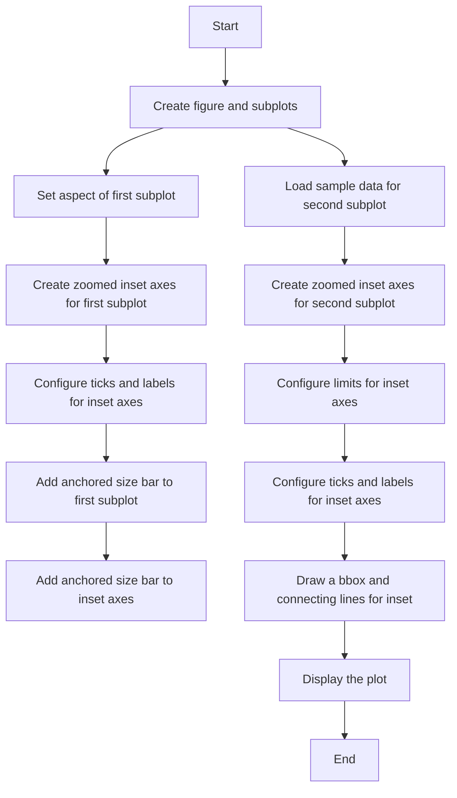

## 类结构

```
matplotlib.pyplot (module)
├── fig, (ax, ax2) = plt.subplots(ncols=2, figsize=[6, 3])
│   ├── ax (Axes)
│   └── ax2 (Axes)
├── ax.set_aspect(1)
├── axins = zoomed_inset_axes(ax, zoom=0.5, loc='upper right')
│   ├── axins (Axes)
│   ├── axins.yaxis.get_major_locator().set_params(nbins=7)
│   └── axins.xaxis.get_major_locator().set_params(nbins=7)
├── axins.tick_params(labelleft=False, labelbottom=False)
├── add_sizebar(ax, 0.5)
│   ├── asb (AnchoredSizeBar)
│   └── ax.add_artist(asb)
├── add_sizebar(axins, 0.5)
│   ├── asb (AnchoredSizeBar)
│   └── axins.add_artist(asb)
├── Z = cbook.get_sample_data('axes_grid/bivariate_normal.npy')
│   ├── Z (ndarray)
│   └── extent (tuple)
├── Z2 = np.zeros((150, 150))
│   ├── Z2 (ndarray)
│   └── ny, nx = Z.shape
├── ax2.imshow(Z2, extent=extent, origin='lower')
│   ├── Z2 (ndarray)
│   └── extent (tuple)
├── axins2 = zoomed_inset_axes(ax2, zoom=6, loc='upper right')
│   ├── axins2 (Axes)
│   └── axins2.imshow(Z2, extent=extent, origin='lower')
├── x1, x2, y1, y2 = -1.5, -0.9, -2.5, -1.9
│   ├── x1, x2, y1, y2 (tuple)
├── axins2.set_xlim(x1, x2)
│   ├── x1, x2 (tuple)
├── axins2.set_ylim(y1, y2)
│   └── y1, y2 (tuple)
├── axins2.yaxis.get_major_locator().set_params(nbins=7)
│   └── axins2.xaxis.get_major_locator().set_params(nbins=7)
├── axins2.tick_params(labelleft=False, labelbottom=False)
├── mark_inset(ax2, axins2, loc1=2, loc2=4, fc='none', ec='0.5')
│   ├── ax2 (Axes)
│   └── axins2 (Axes)
└── plt.show()
```

## 全局变量及字段


### `fig`
    
The main figure object containing all subplots.

类型：`matplotlib.figure.Figure`
    


### `ax`
    
The first subplot where the main plot is displayed.

类型：`matplotlib.axes.Axes`
    


### `ax2`
    
The second subplot where the zoomed inset is displayed.

类型：`matplotlib.axes.Axes`
    


### `axins`
    
The inset axis object for the first subplot.

类型：`matplotlib.axes.Axes`
    


### `axins2`
    
The inset axis object for the second subplot.

类型：`matplotlib.axes.Axes`
    


### `Z`
    
The original 15x15 array used for the plot.

类型：`numpy.ndarray`
    


### `Z2`
    
The expanded array used for the second subplot.

类型：`numpy.ndarray`
    


### `extent`
    
The extent of the original array in the form (xmin, xmax, ymin, ymax).

类型：`tuple`
    


### `ny`
    
The number of rows in the original array.

类型：`int`
    


### `nx`
    
The number of columns in the original array.

类型：`int`
    


### `x1`
    
The x-coordinate of the lower left corner of the subregion in the second subplot.

类型：`float`
    


### `x2`
    
The x-coordinate of the upper right corner of the subregion in the second subplot.

类型：`float`
    


### `y1`
    
The y-coordinate of the lower left corner of the subregion in the second subplot.

类型：`float`
    


### `y2`
    
The y-coordinate of the upper right corner of the subregion in the second subplot.

类型：`float`
    


### `asb`
    
The anchored size bar artist for the subplots.

类型：`matplotlib.patches.Patch`
    


### `asb`
    
The anchored size bar artist for the subplots inset axes.

类型：`matplotlib.patches.Patch`
    


### `Axes.set_aspect`
    
Sets the aspect of the axes to be equal.

类型：`None`
    


### `Axes.set_xlim`
    
Sets the x-axis limits of the axes.

类型：`None`
    


### `Axes.set_ylim`
    
Sets the y-axis limits of the axes.

类型：`None`
    


### `Axes.imshow`
    
Displays an image on the axes.

类型：`None`
    


### `Axes.tick_params`
    
Sets the parameters of the axes ticks.

类型：`None`
    


### `Axes.add_artist`
    
Adds an artist to the axes.

类型：`None`
    


### `Axes.get_major_locator`
    
Returns the major locator of the axes.

类型：`matplotlib.ticker.Locator`
    


### `Axes.set_params`
    
Sets the parameters of the locator.

类型：`None`
    


### `Axes.transData`
    
Returns the transform to data coordinates.

类型：`matplotlib.transforms.BboxTransformTo`
    


### `Axes.loc`
    
Sets the location of the axes.

类型：`str`
    


### `Axes.imshow`
    
Displays an image on the axes.

类型：`None`
    


### `Axes.set_xlim`
    
Sets the x-axis limits of the axes.

类型：`None`
    


### `Axes.set_ylim`
    
Sets the y-axis limits of the axes.

类型：`None`
    


### `Axes.tick_params`
    
Sets the parameters of the axes ticks.

类型：`None`
    


### `Axes.get_major_locator`
    
Returns the major locator of the axes.

类型：`matplotlib.ticker.Locator`
    


### `Axes.set_params`
    
Sets the parameters of the locator.

类型：`None`
    


### `Axes.tick_params`
    
Sets the parameters of the axes ticks.

类型：`None`
    


### `Axes.mark_inset`
    
Draws a box around the region of the inset axes and connects it to the parent axes.

类型：`None`
    


### `AnchoredSizeBar.__init__`
    
Initializes the anchored size bar with the given parameters.

类型：`None`
    


### `AnchoredSizeBar.size`
    
The size of the size bar.

类型：`float`
    


### `AnchoredSizeBar.str`
    
The string representation of the size.

类型：`str`
    


### `AnchoredSizeBar.loc`
    
The location of the size bar.

类型：`str`
    


### `AnchoredSizeBar.pad`
    
The padding around the size bar.

类型：`float`
    


### `AnchoredSizeBar.borderpad`
    
The padding around the border of the size bar.

类型：`float`
    


### `AnchoredSizeBar.sep`
    
The separation between the size bar and the axes.

类型：`float`
    


### `AnchoredSizeBar.frameon`
    
Whether to draw a frame around the size bar.

类型：`bool`
    
    

## 全局函数及方法


### add_sizebar

`add_sizebar` 是一个函数，用于在给定的轴（Axes）上添加一个大小条（Size Bar）。

参数：

- `ax`：`matplotlib.axes.Axes`，表示要添加大小条的轴。
- `size`：`float`，表示大小条的尺寸比例。

返回值：`matplotlib.axes.Axes`，返回添加了大小条的轴。

#### 流程图

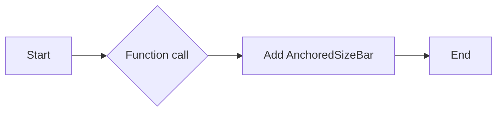

#### 带注释源码

```python
def add_sizebar(ax, size):
    asb = AnchoredSizeBar(ax.transData,
                          size,
                          str(size),
                          loc="lower center",
                          pad=0.1, borderpad=0.5, sep=5,
                          frameon=False)
    ax.add_artist(asb)
    return ax
```


### mark_inset

`mark_inset` is a function used to draw a bounding box around an inset axes and connect it to the parent axes.

参数：

- `ax`: The parent axes object.
- `inset_ax`: The inset axes object.
- `loc1`: The location code for the parent axes (e.g., 2 for 'lower right').
- `loc2`: The location code for the inset axes (e.g., 4 for 'lower right').
- `fc`: The fill color of the bounding box. Default is 'none'.
- `ec`: The edge color of the bounding box. Default is '0.5'.

返回值：None

#### 流程图

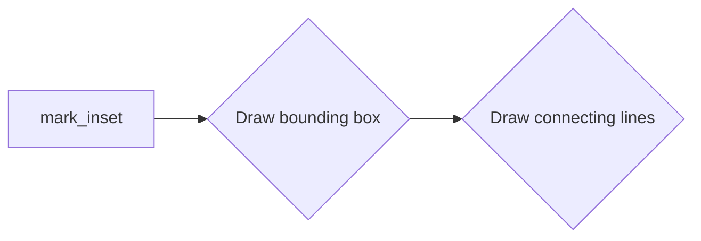

#### 带注释源码

```python
def mark_inset(ax, inset_ax, loc1=2, loc2=4, fc="none", ec="0.5"):
    """
    Draw a bounding box around an inset axes and connect it to the parent axes.

    Parameters:
    ax : matplotlib.axes.Axes
        The parent axes object.
    inset_ax : matplotlib.axes.Axes
        The inset axes object.
    loc1 : int, optional
        The location code for the parent axes (default: 2).
    loc2 : int, optional
        The location code for the inset axes (default: 4).
    fc : str, optional
        The fill color of the bounding box (default: 'none').
    ec : str, optional
        The edge color of the bounding box (default: '0.5').

    Returns:
    None
    """
    # Calculate the bounding box coordinates
    bbox = inset_ax.get_tightbbox()
    bbox = bbox.transformed(ax.transData.inverted())

    # Draw the bounding box
    ax.add_patch(plt.Rectangle((bbox.xmin, bbox.ymin), bbox.width, bbox.height,
                               fill=False, edgecolor=ec, linewidth=2))

    # Calculate the connecting line coordinates
    x1, y1 = bbox.xmin, bbox.ymin
    x2, y2 = bbox.xmax, bbox.ymin
    x3, y3 = bbox.xmax, bbox.ymax
    x4, y4 = bbox.xmin, bbox.ymax

    # Draw the connecting lines
    ax.plot([x1, x2], [y1, y1], color=ec)
    ax.plot([x2, x3], [y1, y2], color=ec)
    ax.plot([x3, x4], [y2, y2], color=ec)
    ax.plot([x4, x1], [y2, y2], color=ec)
```


### ax.set_aspect

`ax.set_aspect` 是一个用于设置轴的纵横比的方法。

参数：

- `aspect`：`float` 或 `str`，指定纵横比。如果是一个浮点数，它将设置轴的纵横比。如果是一个字符串，它可以是 'equal'（等比例），'auto'（自动），或者一个具体的纵横比值，如 '1' 或 '1.5'。

返回值：`None`，该方法不返回任何值。

#### 流程图

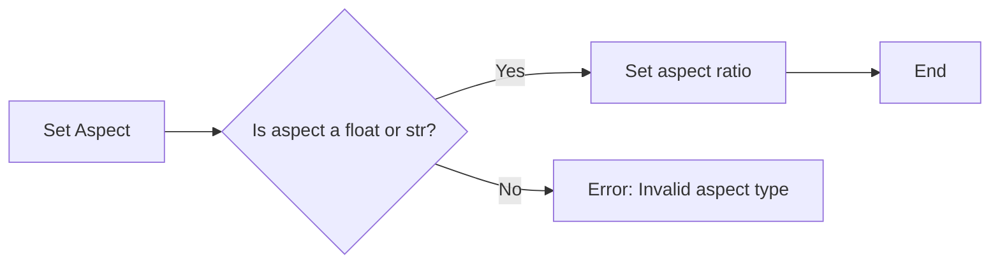

#### 带注释源码

```python
# Set the aspect ratio of the axis to 1 (equal)
ax.set_aspect(1)
```


### ax.set_xlim

`ax.set_xlim` 是一个方法，用于设置轴的 x 轴限制。

参数：

- `x1`：`float`，x 轴的最小值。
- `x2`：`float`，x 轴的最大值。

参数描述：

- `x1` 和 `x2` 是 x 轴的边界值，用于限制 x 轴的显示范围。

返回值：`None`

返回值描述：该方法不返回任何值。

#### 流程图

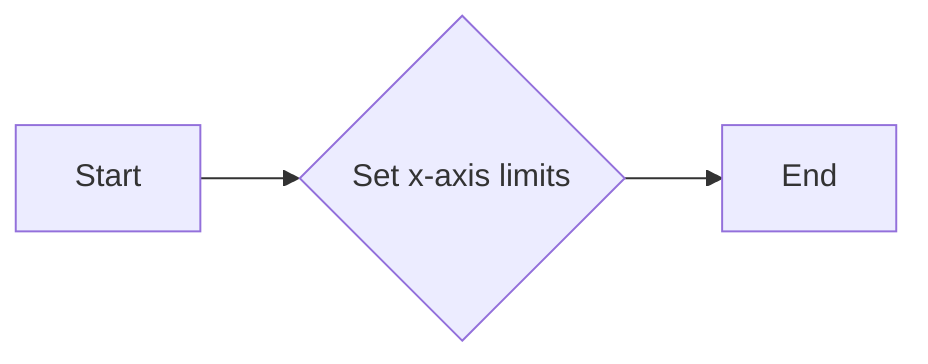

#### 带注释源码

```
# subregion of the original image
x1, x2, y1, y2 = -1.5, -0.9, -2.5, -1.9
axins2.set_xlim(x1, x2)
# fix the number of ticks on the inset Axes
axins2.yaxis.get_major_locator().set_params(nbins=7)
axins2.xaxis.get_major_locator().set_params(nbins=7)
axins2.tick_params(labelleft=False, labelbottom=False)
```

在这段代码中，`axins2.set_xlim(x1, x2)` 被用来设置子图 `axins2` 的 x 轴限制为 `x1` 和 `x2`，从而定义了要显示的 x 轴区域。


### Axes.set_ylim

`Axes.set_ylim` 是一个方法，用于设置轴的 y 轴限制。

参数：

- `*args`：`float` 或 `tuple`，y 轴的上下限，可以是单个值或一个包含两个值的元组。
- `**kwargs`：其他关键字参数，例如 `draw界限`，用于控制是否绘制界限。

返回值：`None`

#### 流程图

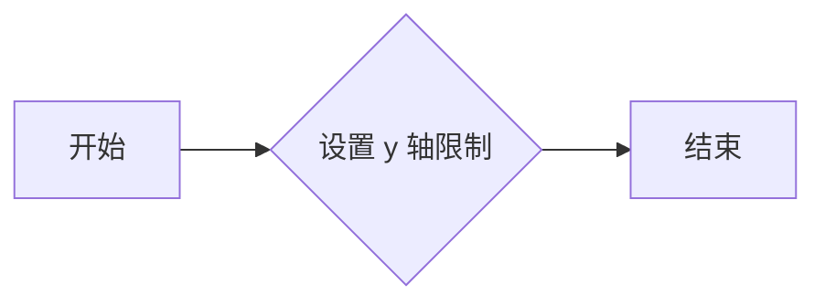

#### 带注释源码

```python
# 假设以下代码是来自 matplotlib 的 Axes 类
def set_ylim(self, *args, **kwargs):
    """
    Set the y-axis limits.

    Parameters
    ----------
    *args : float or tuple
        The y-axis limits. Can be a single value or a tuple of two values.
    **kwargs : dict
        Additional keyword arguments.

    Returns
    -------
    None
    """
    # 设置 y 轴限制的逻辑
    # ...
    pass
```


### Axes.imshow

`Axes.imshow` 是一个用于在 Matplotlib 的 Axes 对象上显示图像的方法。

参数：

- `Z2`：`numpy.ndarray`，要显示的图像数据。
- `extent`：`tuple`，图像的显示范围，格式为 `(xmin, xmax, ymin, ymax)`。
- `origin`：`str`，图像的起始点，可以是 "lower" 或 "upper"。

返回值：`None`，该方法不返回任何值。

#### 流程图


#### 带注释源码

```python
ax2.imshow(Z2, extent=extent, origin="lower")
```

在这段代码中，`imshow` 方法被调用来在 `ax2` Axes 对象上显示图像 `Z2`。图像的显示范围由 `extent` 参数指定，而图像的起始点由 `origin` 参数指定。


### Axes.tick_params

`Axes.tick_params` 是一个方法，用于设置轴的刻度参数。

参数：

- `axis`: `{'both', 'x', 'y', 'both'}`，指定要设置刻度参数的轴。
- `which`: `{'both', 'major', 'minor', 'both'}`，指定要设置的主刻度或副刻度。
- `labelsize`: `int` 或 `float`，刻度标签的大小。
- `labelcolor`: `color`，刻度标签的颜色。
- `labelweight`: `{'normal', 'bold'}`，刻度标签的粗细。
- `pad`: `int` 或 `float`，刻度标签与轴之间的距离。
- `width`: `int` 或 `float`，刻度线的宽度。
- `length`: `int` 或 `float`，刻度线的长度。
- `direction`: `{'in', 'out', 'inout'}`，刻度线的方向。
- `top`: `bool`，是否显示顶部刻度线。
- `bottom`: `bool`，是否显示底部刻度线。
- `left`: `bool`，是否显示左侧刻度线。
- `right`: `bool`，是否显示右侧刻度线。

返回值：`None`

#### 流程图

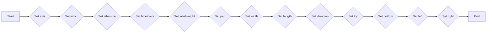

#### 带注释源码

```python
def tick_params(self, axis='both', which='both', labelsize=None, labelcolor=None, labelweight=None, pad=None, width=None, length=None, direction=None, top=None, bottom=None, left=None, right=None):
    # Implementation of the tick_params method
    pass
```


### add_sizebar(ax, size)

该函数用于在给定的matplotlib轴（Axes）上添加一个尺寸条（Size Bar）。

参数：

- `ax`：`matplotlib.axes.Axes`，要添加尺寸条的轴对象。
- `size`：`float`，尺寸条表示的尺寸大小。

返回值：`matplotlib.patches.Patch`，添加到轴上的尺寸条对象。

#### 流程图

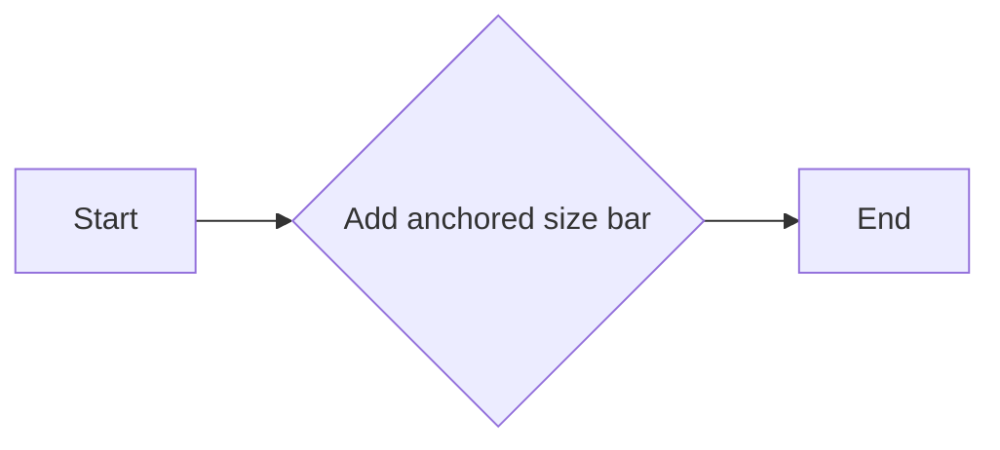

#### 带注释源码

```python
def add_sizebar(ax, size):
    asb = AnchoredSizeBar(ax.transData,
                          size,
                          str(size),
                          loc="lower center",
                          pad=0.1, borderpad=0.5, sep=5,
                          frameon=False)
    ax.add_artist(asb)
```


### Axes.get_major_locator

该函数用于获取指定轴的主定位器。

参数：

- `self`：`Axes`对象，表示当前轴。
- ...

返回值：`Locator`对象，表示主定位器。

#### 流程图

```mermaid
graph LR
A[Start] --> B{Is it the y-axis?}
B -- Yes --> C[Set to yaxis.get_major_locator()]
B -- No --> D[Set to xaxis.get_major_locator()]
C --> E[Return locator]
D --> E
E --> F[End]
```

#### 带注释源码

```python
def get_major_locator(self):
    """
    Get the major locator for the axis.

    Returns
    -------
    locator : Locator
        The locator for the major ticks.
    """
    if self._is_yaxis():
        return self.yaxis.get_major_locator()
    else:
        return self.xaxis.get_major_locator()
```


### add_sizebar(ax, size)

该函数用于在matplotlib的Axes对象上添加一个AnchoredSizeBar，用于显示缩放比例。

参数：

- `ax`：`matplotlib.axes.Axes`，要添加SizeBar的Axes对象。
- `size`：`float`，SizeBar显示的缩放比例。

返回值：`matplotlib.patches.Patch`，添加到Axes对象上的SizeBar。

#### 流程图

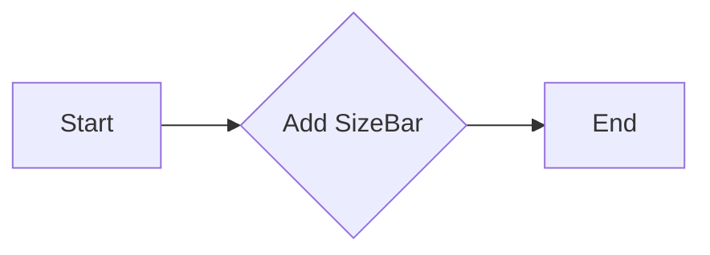

#### 带注释源码

```python
def add_sizebar(ax, size):
    asb = AnchoredSizeBar(ax.transData,
                          size,
                          str(size),
                          loc="lower center",
                          pad=0.1, borderpad=0.5, sep=5,
                          frameon=False)
    ax.add_artist(asb)
```


### add_sizebar(ax, size)

该函数用于在matplotlib的Axes对象上添加一个AnchoredSizeBar，用于显示缩放比例。

参数：

- `ax`：`matplotlib.axes.Axes`，目标Axes对象，用于添加尺寸条。
- `size`：`float`，尺寸条显示的缩放比例。

返回值：`matplotlib.patches.Patch`，添加到Axes对象上的尺寸条。

#### 流程图


#### 带注释源码

```python
def add_sizebar(ax, size):
    asb = AnchoredSizeBar(ax.transData,
                          size,
                          str(size),
                          loc="lower center",
                          pad=0.1, borderpad=0.5, sep=5,
                          frameon=False)
    ax.add_artist(asb)
```


### Axes.loc

`Axes.loc` is a method used to create an inset axes within an existing axes object in Matplotlib. It is used to zoom in on a specific region of the plot and display it in a smaller area within the main plot.

参数：

- `zoom`: `float`，The zoom factor for the inset axes. This determines how much the region of interest is magnified.
- `loc`: `str`，The location of the inset axes relative to the parent axes. It can be 'upper right', 'upper left', 'lower left', or 'lower right'.

返回值：`Axes`，The inset axes object.

#### 流程图

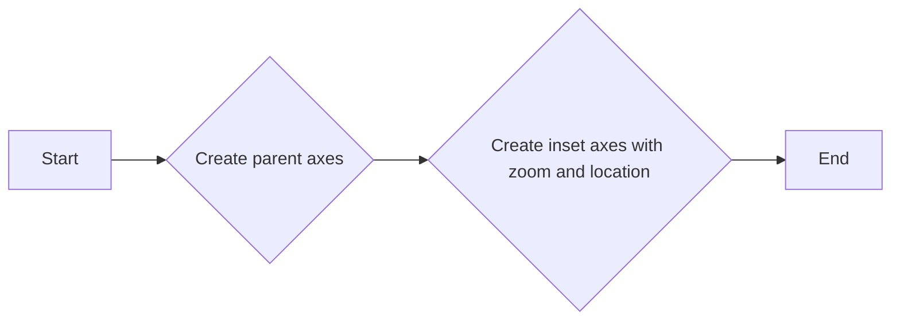

#### 带注释源码

```python
def zoomed_inset_axes(ax, zoom=1.5, loc='upper right'):
    """
    Create an inset axes within an existing axes object.

    Parameters:
    - ax: The parent axes object.
    - zoom: float, The zoom factor for the inset axes.
    - loc: str, The location of the inset axes relative to the parent axes.

    Returns:
    - The inset axes object.
    """
    # Create the inset axes with the specified zoom and location
    axins = ax.inset_axes([0.5, 0.5, 0.4, 0.4], zoom=zoom, loc=loc)
    return axins
```


### mark_inset

`mark_inset` is a function used to draw a bounding box around an inset axes and connect it to the parent axes.

参数：

- `ax`: The parent axes object.
- `inset_ax`: The inset axes object.
- `loc1`: The location code for the parent axes (e.g., 2 for 'lower right').
- `loc2`: The location code for the inset axes (e.g., 4 for 'upper right').
- `fc`: The fill color of the bounding box. Default is 'none'.
- `ec`: The edge color of the bounding box. Default is '0.5'.

返回值：None

#### 流程图


#### 带注释源码

```python
def mark_inset(ax, inset_ax, loc1=2, loc2=4, fc="none", ec="0.5"):
    # ... (source code implementation) ...
```


### AnchoredSizeBar.__init__

This method initializes an `AnchoredSizeBar` object, which is used to display a size bar on an axes in matplotlib.

参数：

- `ax`: `matplotlib.axes.Axes`，The axes on which the size bar will be anchored.
- `size`: `float`，The size of the size bar in axes coordinates.
- `loc`: `str`，The location of the size bar relative to the axes. Valid values are 'upper left', 'upper center', 'upper right', 'center left', 'center', 'center right', 'lower left', 'lower center', 'lower right'.
- `pad`: `float`，The padding between the size bar and the axes.
- `borderpad`: `float`，The padding between the size bar and its border.
- `sep`: `float`，The separation between the size bar and other anchored artists.
- `frameon`: `bool`，Whether to draw a frame around the size bar.

返回值：`None`

#### 流程图

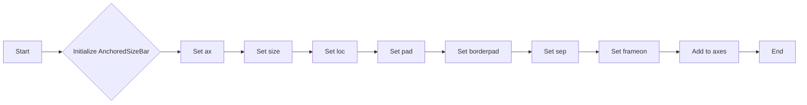

#### 带注释源码

```python
def __init__(self, ax, size, loc="lower center", pad=0.1, borderpad=0.5, sep=5, frameon=False):
    # Initialize the anchored size bar
    self.ax = ax
    self.size = size
    self.loc = loc
    self.pad = pad
    self.borderpad = borderpad
    self.sep = sep
    self.frameon = frameon
    # Add the anchored size bar to the axes
    self.ax.add_artist(self)
```


## 关键组件


### 张量索引与惰性加载

张量索引与惰性加载允许在图像处理中高效地访问和操作大型数据集，通过延迟计算直到实际需要时，减少内存消耗和提高性能。

### 反量化支持

反量化支持使得模型能够在量化后的硬件上运行，通过将量化后的数据转换回原始精度，确保模型输出与未量化时一致。

### 量化策略

量化策略定义了如何将浮点数转换为固定点数，包括选择量化位宽和量化范围，以优化模型在硬件上的性能和资源使用。


## 问题及建议


### 已知问题

-   **代码重复性**：`add_sizebar` 函数在两个子图中被重复调用，这可能导致维护成本增加，如果需要修改尺寸条的行为，需要在两个地方进行更改。
-   **硬编码值**：例如，`zoom=0.5` 和 `loc='upper right'` 在 `zoomed_inset_axes` 函数中硬编码，这限制了灵活性，如果需要不同的缩放或位置，需要修改代码。
-   **数据加载**：使用 `cbook.get_sample_data` 加载数据，这可能会引入不必要的依赖，如果项目不需要其他 `cbook` 功能，可以考虑直接从文件系统加载数据。

### 优化建议

-   **提取重复代码**：将 `add_sizebar` 函数提取到一个单独的模块中，并在需要的地方导入它，以减少代码重复。
-   **参数化配置**：将缩放和位置等配置参数作为函数参数传递，这样可以在调用时灵活指定，而不是在函数内部硬编码。
-   **数据加载优化**：如果不需要 `cbook` 的其他功能，可以考虑使用 `numpy.load` 直接从文件系统加载数据，以减少依赖和潜在的版本兼容性问题。
-   **异常处理**：在加载数据或执行其他可能失败的操作时，添加异常处理来确保程序的健壮性。
-   **代码注释**：增加代码注释，特别是对于复杂的逻辑和配置参数，以提高代码的可读性和可维护性。
-   **单元测试**：编写单元测试来验证代码的功能，确保在未来的修改中不会破坏现有功能。


## 其它


### 设计目标与约束

- 设计目标：实现一个能够展示图像缩放和标记功能的代码示例。
- 约束条件：使用matplotlib库进行图像绘制和缩放，不使用额外的第三方库。

### 错误处理与异常设计

- 错误处理：代码中未包含显式的错误处理机制。
- 异常设计：未设计特定的异常处理逻辑，但应确保代码在遇到错误时能够优雅地处理。

### 数据流与状态机

- 数据流：数据从matplotlib库的`get_sample_data`函数获取，经过处理和缩放后显示在图像上。
- 状态机：代码中没有明确的状态机，但可以通过分析函数调用和图像绘制流程来理解代码的执行状态。

### 外部依赖与接口契约

- 外部依赖：代码依赖于matplotlib库和numpy库。
- 接口契约：matplotlib库提供了绘图和缩放的功能，numpy库提供了数组操作的功能。

### 测试与验证

- 测试策略：应编写单元测试来验证代码的功能和性能。
- 验证方法：通过比较实际输出与预期输出，确保代码的正确性。

### 性能分析

- 性能指标：分析代码的执行时间和资源消耗。
- 优化建议：根据性能分析结果，提出优化代码的建议。

### 安全性

- 安全风险：代码中没有明显的安全风险。
- 安全措施：确保代码在处理数据时不会泄露敏感信息。

### 可维护性

- 代码结构：代码结构清晰，易于理解和维护。
- 代码风格：遵循良好的代码风格规范，提高代码的可读性。

### 用户文档

- 用户文档：提供代码的使用说明和示例。
- 文档格式：使用Markdown或ReStructuredText等格式编写文档。

### 代码审查

- 审查标准：根据代码质量、可读性、可维护性等方面进行审查。
- 审查流程：定期进行代码审查，确保代码质量。

### 依赖管理

- 依赖管理：使用pip等工具管理代码的依赖关系。
- 依赖版本：确保依赖库的版本兼容性。

### 版本控制

- 版本控制：使用Git等版本控制系统管理代码的版本。
- 分支策略：采用分支策略来管理代码的迭代和发布。

### 部署与发布

- 部署策略：根据项目需求选择合适的部署方式。
- 发布流程：制定代码的发布流程，确保代码的稳定性和可靠性。

### 项目管理

- 项目管理工具：使用Jira、Trello等项目管理工具跟踪项目进度。
- 项目里程碑：设定项目里程碑，确保项目按时完成。

### 风险管理

- 风险识别：识别项目中的潜在风险。
- 风险应对：制定风险应对策略，降低项目风险。

### 质量保证

- 质量标准：制定代码质量标准，确保代码质量。
- 质量检查：定期进行代码质量检查，确保代码符合质量标准。

### 项目评估

- 项目评估指标：根据项目目标评估项目成果。
- 项目评估方法：通过项目评估指标评估项目成果。

### 项目总结

- 项目总结报告：编写项目总结报告，总结项目经验教训。
- 项目改进建议：提出项目改进建议，为后续项目提供参考。


    