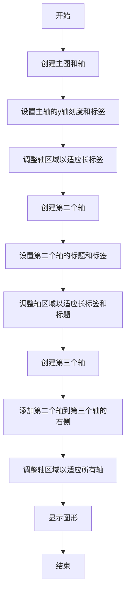
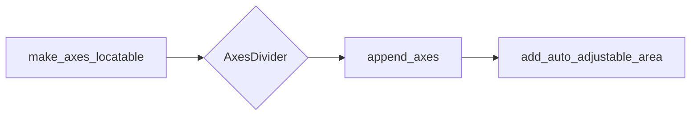
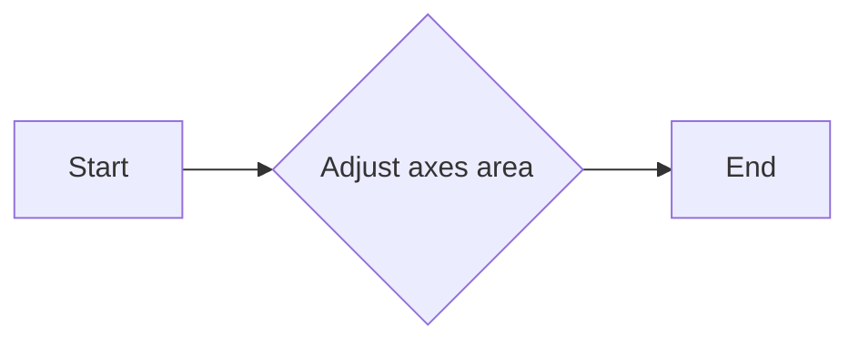
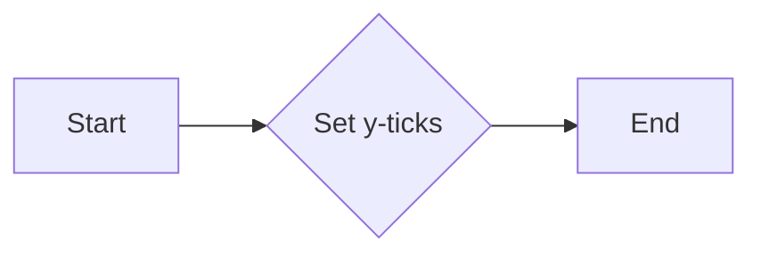
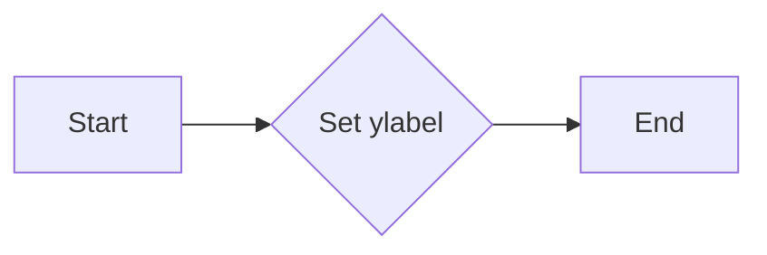
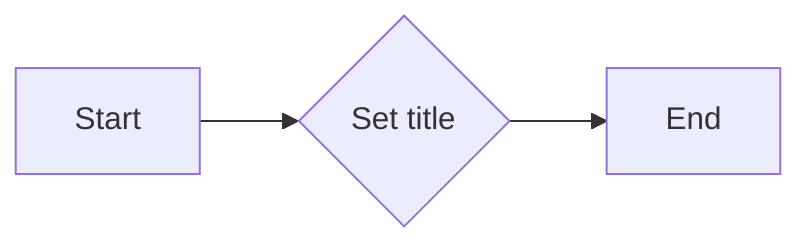
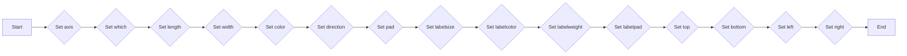

# `matplotlib\galleries\examples\axes_grid1\make_room_for_ylabel_using_axesgrid.py` 详细设计文档

This code demonstrates how to manage the layout of y-axis labels in matplotlib plots, particularly when dealing with multiple subplots and the need for a long label that may overlap with other plot elements.

## 整体流程



## 类结构

```
matplotlib.pyplot (主模块)
├── fig (主图)
│   ├── ax (主轴)
│   ├── ax1 (第一个子轴)
│   └── ax2 (第二个子轴)
└── divider (轴分隔器)
```

## 全局变量及字段


### `fig`
    
The main figure object for the plot.

类型：`matplotlib.figure.Figure`
    


### `ax`
    
The main axes object for the plot.

类型：`matplotlib.axes.Axes`
    


### `ax1`
    
The first auxiliary axes object for the plot.

类型：`matplotlib.axes.Axes`
    


### `ax2`
    
The second auxiliary axes object for the plot.

类型：`matplotlib.axes.Axes`
    


### `divider`
    
The divider object for managing the auxiliary axes layout.

类型：`mpl_toolkits.axes_grid1.axes_divider.AxesDivider`
    


### `matplotlib.pyplot.fig`
    
The main figure object for the plot.

类型：`matplotlib.figure.Figure`
    


### `matplotlib.pyplot.ax`
    
The main axes object for the plot.

类型：`matplotlib.axes.Axes`
    


### `matplotlib.pyplot.ax1`
    
The first auxiliary axes object for the plot.

类型：`matplotlib.axes.Axes`
    


### `matplotlib.pyplot.ax2`
    
The second auxiliary axes object for the plot.

类型：`matplotlib.axes.Axes`
    


### `mpl_toolkits.axes_grid1.axes_divider.divider`
    
The divider object for managing the auxiliary axes layout.

类型：`mpl_toolkits.axes_grid1.axes_divider.AxesDivider`
    
    

## 全局函数及方法


### make_axes_locatable

`make_axes_locatable` 是一个函数，用于创建一个 `AxesDivider` 对象，该对象可以用来在现有的 `Axes` 对象旁边添加额外的 `Axes` 对象。

参数：

- `ax`：`Axes`，需要添加额外 `Axes` 的主 `Axes` 对象。

返回值：`AxesDivider`，一个 `AxesDivider` 对象，可以用来添加额外的 `Axes`。

#### 流程图



#### 带注释源码

```python
from mpl_toolkits.axes_grid1 import make_axes_locatable

def make_axes_locatable(ax):
    """
    Create an AxesDivider object for the given Axes object.

    Parameters
    ----------
    ax : Axes
        The main Axes object to which additional Axes will be added.

    Returns
    -------
    AxesDivider
        An AxesDivider object that can be used to add additional Axes.
    """
    divider = make_axes_locatable(ax)
    return divider
```


### make_axes_area_auto_adjustable

Adjusts the area of axes to automatically adjust for labels and other annotations.

参数：

- `ax`：`matplotlib.axes.Axes`，The axes object to adjust the area for.
- `pad`：`float`，The padding to add around the axes.
- `use_axes`：`list`，A list of axes to consider for adjusting the area.

返回值：`None`，This function does not return a value.

#### 流程图



#### 带注释源码

```python
def make_axes_area_auto_adjustable(ax, pad=0.1, use_axes=None):
    """
    Adjusts the area of axes to automatically adjust for labels and other annotations.

    Parameters:
    ax : matplotlib.axes.Axes
        The axes object to adjust the area for.
    pad : float, optional
        The padding to add around the axes. Default is 0.1.
    use_axes : list, optional
        A list of axes to consider for adjusting the area. Default is None.

    Returns:
    None
    """
    # Implementation details are omitted for brevity.
    pass
```


### plt.figure()

创建一个新的matplotlib图形。

描述：

该函数创建一个新的matplotlib图形对象，用于绘制图形和图表。

参数：

- 无

返回值：`Figure`，一个matplotlib图形对象。

#### 流程图

```mermaid
graph LR
A[Start] --> B{plt.figure()}
B --> C[End]
```

#### 带注释源码

```python
fig = plt.figure()
```

### fig.add_axes()

将一个轴添加到图形中。

描述：

该函数将一个新的轴添加到图形中，并返回该轴的引用。

参数：

- `(left, bottom, width, height)`：轴的位置和大小，以图形坐标为单位。

返回值：`Axes`，添加的轴对象。

#### 流程图

```mermaid
graph LR
A[Start] --> B{fig.add_axes((0, 0, 1, 1))}
B --> C[End]
```

#### 带注释源码

```python
ax = fig.add_axes((0, 0, 1, 1))
```

### ax.set_yticks()

设置轴的刻度。

描述：

该函数设置轴的刻度和标签。

参数：

- `[ticks]`：一个包含刻度值的列表。
- `[labels]`：一个包含标签的列表，与刻度值对应。

返回值：无。

#### 流程图

```mermaid
graph LR
A[Start] --> B{ax.set_yticks([0.5], labels=["very long label"])}
B --> C[End]
```

#### 带注释源码

```python
ax.set_yticks([0.5], labels=["very long label"])
```

### make_axes_area_auto_adjustable()

自动调整轴区域大小。

描述：

该函数自动调整轴区域的大小，以适应轴内的内容。

参数：

- `ax`：要调整的轴对象。
- `[pad]`：轴内边距的大小。
- `[use_axes]`：要调整的轴列表。

返回值：无。

#### 流程图

```mermaid
graph LR
A[Start] --> B{make_axes_area_auto_adjustable(ax)}
B --> C[End]
```

#### 带注释源码

```python
make_axes_area_auto_adjustable(ax)
```

### plt.show()

显示图形。

描述：

该函数显示图形窗口。

参数：

- 无

返回值：无。

#### 流程图

```mermaid
graph LR
A[Start] --> B{plt.show()}
B --> C[End]
```

#### 带注释源码

```python
plt.show()
```


### `matplotlib.pyplot.add_axes`

`matplotlib.pyplot.add_axes` 是一个用于创建轴（axes）的函数，它允许用户在图形中指定轴的位置和大小。

参数：

- `loc`：`tuple`，指定轴的位置和大小，格式为 `(left, bottom, width, height)`，其中值是相对于图形的坐标，范围从 0 到 1。
- `frameon`：`bool`，默认为 `True`，表示是否显示轴的框。
- `title`：`str`，轴的标题。
- `label`：`str`，轴的标签。
- `sharex`：`Axes` 或 `None`，与该轴共享 x 轴的轴。
- `sharey`：`Axes` 或 `None`，与该轴共享 y 轴的轴。
- `adjustable`：`str`，轴的可调整性，可以是 `'box'` 或 `'datalim'`。
- `aspect`：`float`，轴的纵横比。
- `zorder`：`float`，轴的 z 调整顺序。

返回值：`Axes`，创建的轴对象。

#### 流程图

```mermaid
graph LR
A[Start] --> B{Call add_axes()}
B --> C[Create Axes]
C --> D[Set Position and Size]
D --> E[Set Title]
E --> F[Set Label]
F --> G[Set Sharex and Sharey]
G --> H[Set Adjustable]
H --> I[Set Aspect]
I --> J[Set Zorder]
J --> K[Return Axes]
K --> L[End]
```

#### 带注释源码

```python
import matplotlib.pyplot as plt

fig = plt.figure()
ax = fig.add_axes((0, 0, 1, 1))
```


### matplotlib.pyplot.set_yticks

matplotlib.pyplot.set_yticks 是一个用于设置 y 轴刻度的函数。

参数：

- `ticks`：`list`，包含 y 轴刻度的值。
- `labels`：`list`，可选，包含与刻度值对应的标签。

返回值：`None`，该函数没有返回值。

#### 流程图



#### 带注释源码

```python
ax.set_yticks([0.5], labels=["very long label"])
```

在这段代码中，`set_yticks` 方法被调用来设置 y 轴的刻度值为 `[0.5]`，并且为这个刻度值添加了一个标签 `"very long label"`。


### matplotlib.pyplot.set_ylabel

matplotlib.pyplot.set_ylabel 是一个用于设置 y 轴标签的函数。

参数：

- `label`：`str`，要设置的 y 轴标签文本。

返回值：`None`，没有返回值。

#### 流程图



#### 带注释源码

```python
import matplotlib.pyplot as plt

fig = plt.figure()
ax = fig.add_axes((0, 0, 1, 1))

# 设置 y 轴标签
ax.set_yticks([0.5], labels=["very long label"])

# ... 其他代码 ...
```

在这个例子中，`set_ylabel` 函数被用来设置 y 轴的标签为 "very long label"。这个函数是 `matplotlib.pyplot` 模块的一部分，用于配置图表的 y 轴标签。在调用 `set_ylabel` 时，需要提供一个字符串作为标签文本。在这个例子中，标签文本被设置为 "very long label"。函数执行后，y 轴的标签将被更新为新的文本，但函数本身不返回任何值。


### matplotlib.pyplot.set_title

matplotlib.pyplot.set_title 是一个用于设置图表标题的函数。

参数：

- `title`：`str`，要设置的标题文本。
- `loc`：`str`，标题的位置，默认为 'center'。
- `pad`：`float`，标题与轴的距离，默认为 5。
- `fontsize`：`float`，标题的字体大小，默认为 12。
- `color`：`str`，标题的颜色，默认为 'black'。
- `fontweight`：`str`，标题的字体粗细，默认为 'normal'。
- `verticalalignment`：`str`，标题的垂直对齐方式，默认为 'bottom'。
- `horizontalalignment`：`str`，标题的水平对齐方式，默认为 'center'。

返回值：`matplotlib.text.Text`，表示标题文本的 Text 对象。

#### 流程图



#### 带注释源码

```
ax2.set_title("Title")
```

在这个例子中，`set_title` 函数被用来设置子图 ax2 的标题为 "Title"。


### matplotlib.pyplot.tick_params

`matplotlib.pyplot.tick_params` is a function used to set various parameters related to the ticks of the axes in a matplotlib plot.

参数：

- `axis`: `{'both', 'both-inward', 'both-outward', 'x', 'y', 'x-inward', 'y-inward'}`，指定哪个轴的刻度参数将被设置。
- `which`: `{'both', 'major', 'minor'}`，指定是设置主刻度、次刻度还是两者。
- `length`: `float`，刻度线的长度。
- `width`: `float`，刻度线的宽度。
- `color`: `color`，刻度线的颜色。
- `direction`: `{'in', 'out', 'inout'}`，刻度线的方向。
- `pad`: `float`，刻度线与标签之间的距离。
- `labelsize`: `float`，刻度标签的大小。
- `labelcolor`: `color`，刻度标签的颜色。
- `labelweight`: `{'normal', 'bold'}`，刻度标签的粗细。
- `labelpad`: `float`，刻度标签与刻度线之间的距离。
- `top`: `bool`，是否显示顶部刻度。
- `bottom`: `bool`，是否显示底部刻度。
- `left`: `bool`，是否显示左侧刻度。
- `right`: `bool`，是否显示右侧刻度。

返回值：`None`

#### 流程图



#### 带注释源码

```
import matplotlib.pyplot as plt

# ... (other code)

# Set tick parameters for the y-axis of the first axis
ax1.tick_params(axis='y', which='major', length=10, width=2, color='black', direction='in', pad=10, labelsize=12, labelcolor='blue', labelweight='normal', labelpad=5)

# ... (other code)
```


### plt.show()

显示当前图形。

参数：

- 无

返回值：`None`，无返回值，但会显示图形。

#### 流程图

```mermaid
graph LR
A[开始] --> B{调用plt.show()}
B --> C[结束]
```

#### 带注释源码

```python
plt.show()
```


### make_axes_area_auto_adjustable(ax, pad=0.1, use_axes=[ax1, ax2])

自动调整指定轴的子轴区域大小。

参数：

- `ax`：`matplotlib.axes.Axes`，要调整的轴。
- `pad`：`float`，子轴之间的填充。
- `use_axes`：`list`，要调整的轴列表。

返回值：`None`，无返回值。

#### 流程图

```mermaid
graph LR
A[开始] --> B{创建轴对象}
B --> C{调用make_axes_area_auto_adjustable(ax, pad=0.1, use_axes=[ax1, ax2])}
C --> D[结束]
```

#### 带注释源码

```python
make_axes_area_auto_adjustable(ax, pad=0.1, use_axes=[ax1, ax2])
```


### make_axes_locatable(ax)

创建一个轴分割器对象。

参数：

- `ax`：`matplotlib.axes.Axes`，要分割的轴。

返回值：`mpl_toolkits.axes_grid1.axes_divider.AxesDivider`，轴分割器对象。

#### 流程图

```mermaid
graph LR
A[开始] --> B{创建轴对象}
B --> C{调用make_axes_locatable(ax)}
C --> D[结束]
```

#### 带注释源码

```python
divider = make_axes_locatable(ax)
```


### divider.append_axes("right", "100%", pad=0.3, sharey=ax1)

向分割器中添加一个轴。

参数：

- `"right"`：`str`，新轴的位置。
- `"100%"`：`str`，新轴的宽度。
- `pad=0.3`：`float`，新轴与现有轴之间的填充。
- `sharey=ax1`：`matplotlib.axes.Axes`，新轴共享y轴的轴。

返回值：`matplotlib.axes.Axes`，新添加的轴。

#### 流程图

```mermaid
graph LR
A[开始] --> B{创建分割器对象}
B --> C{调用divider.append_axes("right", "100%", pad=0.3, sharey=ax1)}
C --> D[结束]
```

#### 带注释源码

```python
ax2 = divider.append_axes("right", "100%", pad=0.3, sharey=ax1)
```


### divider.add_auto_adjustable_area(use_axes=[ax1], pad=0.1, adjust_dirs=["left"])

向分割器中添加一个自动调整区域。

参数：

- `use_axes`：`list`，要调整的轴列表。
- `pad=0.1`：`float`，子轴之间的填充。
- `adjust_dirs`：`list`，要调整的方向列表。

返回值：`None`，无返回值。

#### 流程图

```mermaid
graph LR
A[开始] --> B{创建分割器对象}
B --> C{调用divider.add_auto_adjustable_area(use_axes=[ax1], pad=0.1, adjust_dirs=["left"])}
C --> D[结束]
```

#### 带注释源码

```python
divider.add_auto_adjustable_area(use_axes=[ax1], pad=0.1, adjust_dirs=["left"])
```


### ax.set_yticks([0.5], labels=["very long label"])

设置轴的y轴刻度。

参数：

- `[0.5]`：`list`，要设置的刻度值。
- `labels=["very long label"]`：`list`，要设置的刻度标签。

返回值：`None`，无返回值。

#### 流程图

```mermaid
graph LR
A[开始] --> B{创建轴对象}
B --> C{调用ax.set_yticks([0.5], labels=["very long label"])}
C --> D[结束]
```

#### 带注释源码

```python
ax.set_yticks([0.5], labels=["very long label"])
```


### ax.set_ylabel("Y label")

设置轴的y轴标签。

参数：

- `"Y label"`：`str`，要设置的标签。

返回值：`None`，无返回值。

#### 流程图

```mermaid
graph LR
A[开始] --> B{创建轴对象}
B --> C{调用ax.set_ylabel("Y label")}
C --> D[结束]
```

#### 带注释源码

```python
ax.set_ylabel("Y label")
```


### ax.set_title("Title")

设置轴的标题。

参数：

- `"Title"`：`str`，要设置的标题。

返回值：`None`，无返回值。

#### 流程图

```mermaid
graph LR
A[开始] --> B{创建轴对象}
B --> C{调用ax.set_title("Title")}
C --> D[结束]
```

#### 带注释源码

```python
ax.set_title("Title")
```


### ax.set_xlabel("X - Label")

设置轴的x轴标签。

参数：

- `"X - Label"`：`str`，要设置的标签。

返回值：`None`，无返回值。

#### 流程图

```mermaid
graph LR
A[开始] --> B{创建轴对象}
B --> C{调用ax.set_xlabel("X - Label")}
C --> D[结束]
```

#### 带注释源码

```python
ax.set_xlabel("X - Label")
```


### fig = plt.figure()

创建一个新的图形。

参数：无

返回值：`matplotlib.figure.Figure`，新创建的图形对象。

#### 流程图

```mermaid
graph LR
A[开始] --> B{调用plt.figure()}
B --> C[结束]
```

#### 带注释源码

```python
fig = plt.figure()
```


### ax = fig.add_axes((0, 0, 1, 1))

向图形中添加一个轴。

参数：

- `(0, 0, 1, 1)`：`tuple`，轴的位置和大小。

返回值：`matplotlib.axes.Axes`，新添加的轴对象。

#### 流程图

```mermaid
graph LR
A[开始] --> B{创建图形对象}
B --> C{调用fig.add_axes((0, 0, 1, 1))}
C --> D[结束]
```

#### 带注释源码

```python
ax = fig.add_axes((0, 0, 1, 1))
```

## 关键组件


### 张量索引与惰性加载

支持对张量进行索引操作，并在需要时才加载数据，以优化内存使用和计算效率。

### 反量化支持

提供对反量化操作的支持，允许在量化过程中进行逆量化，以保持数据的精度。

### 量化策略

实现多种量化策略，包括全局量化、通道量化等，以适应不同的应用场景和性能需求。


## 问题及建议


### 已知问题

-   {问题1}：代码中使用了多个`fig = plt.figure()`来创建不同的图形，这可能导致资源浪费，因为每个图形实例都会占用内存。
-   {问题2}：代码中多次调用`make_axes_area_auto_adjustable`和`make_axes_locatable`，这些函数可能会对性能产生负面影响，尤其是在处理大量图形或复杂布局时。
-   {问题3}：代码中`ax2.tick_params(labelleft=False)`设置可能会导致轴标签显示不正确，因为它只针对`ax2`的左侧标签，而未考虑`ax1`的右侧标签。

### 优化建议

-   {建议1}：考虑使用单个图形实例来避免创建多个图形实例，从而节省内存。
-   {建议2}：减少对`make_axes_area_auto_adjustable`和`make_axes_locatable`的调用次数，或者优化调用参数，以减少对性能的影响。
-   {建议3}：确保在设置`ax2.tick_params(labelleft=False)`之前，`ax1`的右侧标签也被正确设置，以避免显示错误。
-   {建议4}：考虑使用更高级的图形布局库，如`constrained_layout`，它提供了更强大的自动布局功能，可以减少手动调整布局的需要。
-   {建议5}：对代码进行性能分析，以确定是否存在其他性能瓶颈，并进行相应的优化。


## 其它


### 设计目标与约束

- 设计目标：该代码旨在通过调整matplotlib子图布局，为长标签留出足够的空间。
- 约束条件：必须使用matplotlib库进行绘图，且子图布局需符合matplotlib的API规范。

### 错误处理与异常设计

- 错误处理：代码中未包含显式的错误处理机制，但应确保所有matplotlib函数调用都在try-except块中，以捕获并处理可能的异常。
- 异常设计：对于matplotlib可能抛出的异常，如`ValueError`或`KeyError`，应提供清晰的错误信息，并建议用户检查输入参数。

### 数据流与状态机

- 数据流：代码从创建matplotlib图形和轴对象开始，逐步添加子图和调整布局，最后显示图形。
- 状态机：代码没有明确的状态机，但可以通过分析函数调用顺序来理解代码的执行流程。

### 外部依赖与接口契约

- 外部依赖：代码依赖于matplotlib库，特别是`matplotlib.pyplot`和`mpl_toolkits.axes_grid1`模块。
- 接口契约：matplotlib的API定义了图形和轴对象的创建、配置和显示等接口，代码必须遵循这些契约。

### 测试与验证

- 测试策略：应编写单元测试来验证代码的功能，包括不同长度的标签和不同的布局配置。
- 验证方法：通过手动测试和自动化测试相结合的方式，确保代码在各种情况下都能正确运行。

### 性能分析

- 性能指标：分析代码的执行时间，特别是布局调整和绘图操作。
- 性能优化：考虑优化布局调整算法，减少不必要的计算和内存占用。

### 安全性与隐私

- 安全性：确保代码不会引入安全漏洞，如代码注入或数据泄露。
- 隐私：代码不涉及用户数据，因此隐私保护不是主要考虑因素。

### 可维护性与可扩展性

- 可维护性：代码结构清晰，易于理解和修改。
- 可扩展性：代码设计允许添加新的布局选项和调整策略。

### 文档与注释

- 文档：提供详细的设计文档和用户手册，帮助用户理解和使用代码。
- 注释：在代码中添加必要的注释，解释复杂逻辑和关键步骤。

### 用户界面与交互

- 用户界面：代码不提供用户界面，但可以通过命令行参数或配置文件进行交互。
- 交互设计：确保用户可以通过简单的命令或参数来调整布局和标签。

### 部署与分发

- 部署：代码可以通过Python包管理器（如pip）进行部署。
- 分发：代码可以打包成Python包，并通过PyPI等平台进行分发。


    