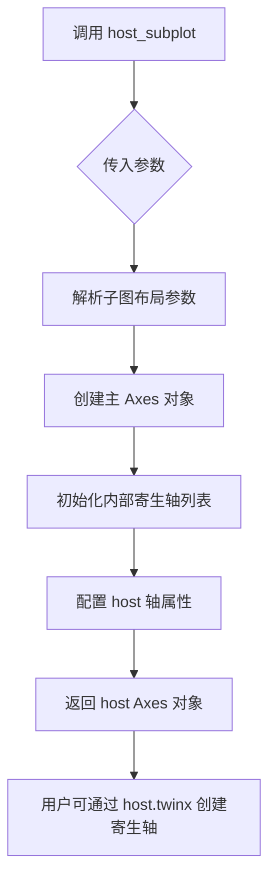
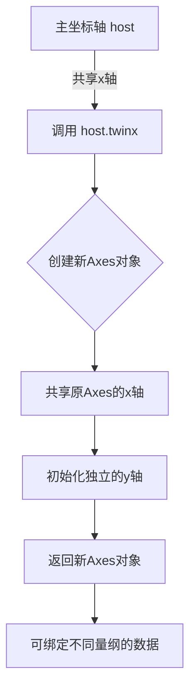
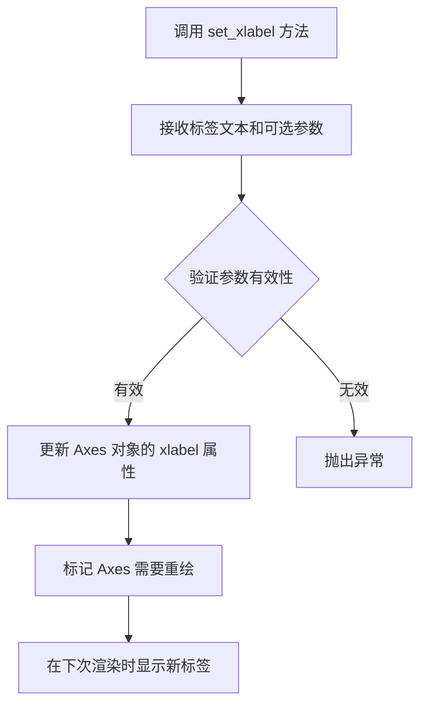
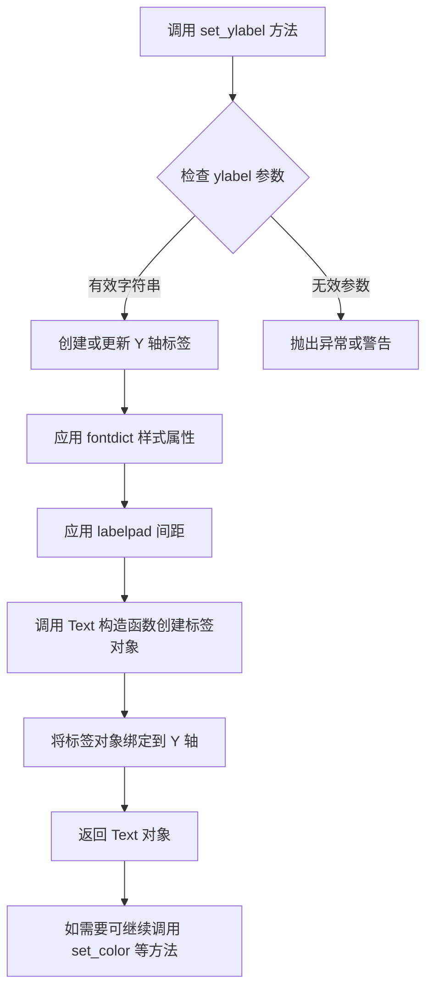
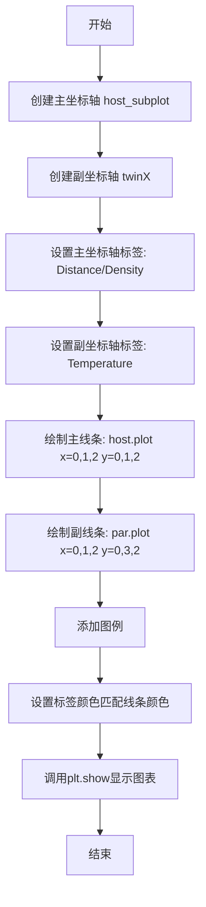
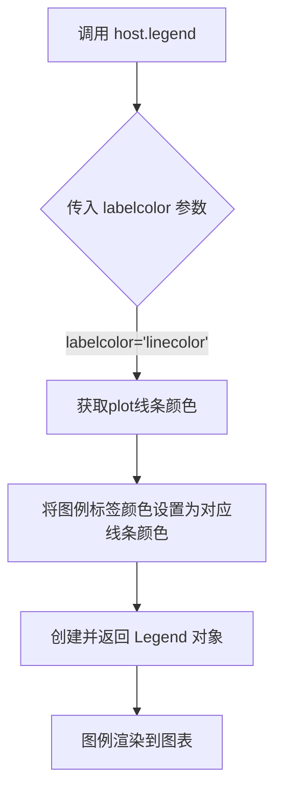
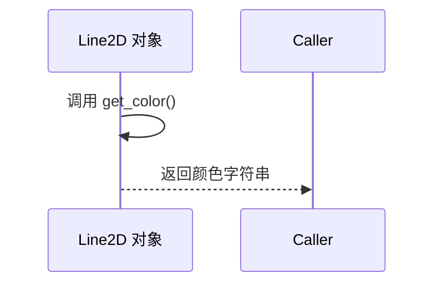
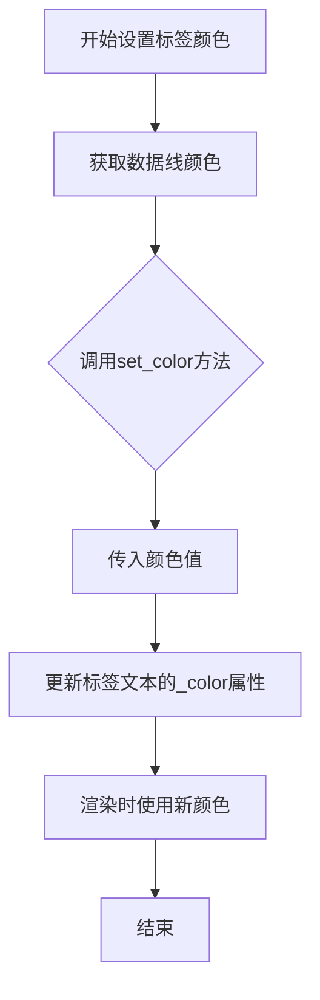
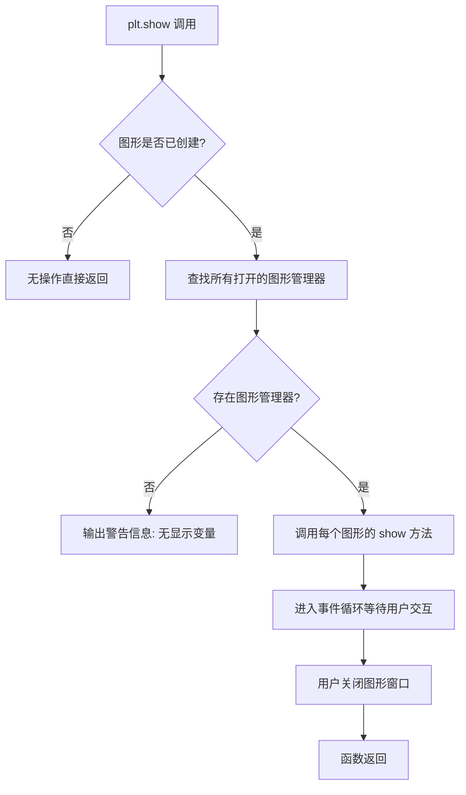

# `matplotlib\galleries\examples\axes_grid1\parasite_simple.py` 详细设计文档

这是一个使用matplotlib创建寄生轴（Parasite Axis）绑定的示例代码，通过双y轴绑定的形式同时展示两组不同量纲的数据（密度和温度），实现数据可视化的多元化展示。

## 整体流程

```mermaid
graph TD
    A[开始] --> B[创建主坐标轴 host_subplot(111)]
    B --> C[创建寄生坐标轴 par = host.twinx()]
    C --> D[设置主坐标轴标签]
    D --> E[设置寄生坐标轴标签]
    E --> F[在主坐标轴绑制密度曲线]
    F --> G[在寄生坐标轴绑制温度曲线]
    G --> H[设置图例]
    H --> I[设置坐标轴标签颜色]
    I --> J[调用 plt.show() 显示图表]
```

## 类结构

```
此代码为脚本形式，无自定义类结构
仅使用 matplotlib 第三方库的面向对象API进行绑图
```

## 全局变量及字段


### `host`
    
主坐标轴对象，通过host_subplot(111)创建，用于绘制密度曲线

类型：`matplotlib.axes.Axes`
    


### `par`
    
寄生/副坐标轴对象，通过host.twinx()创建，用于绘制温度曲线

类型：`matplotlib.axes.Axes`
    


### `p1`
    
密度曲线对象，由host.plot返回，表示密度随距离的变化

类型：`matplotlib.lines.Line2D`
    


### `p2`
    
温度曲线对象，由par.plot返回，表示温度随距离的变化

类型：`matplotlib.lines.Line2D`
    


    

## 全局函数及方法


### `host_subplot`

`host_subplot` 是 matplotlib 的 `mpl_toolkits.axes_grid1` 模块中的一个函数，用于创建一个"主机"子图（host subplot），该子图可以关联一个或多个"寄生"子图（parasite subplots），实现多坐标轴共享同一 x 轴的功能。

参数：

- `*args`：可变位置参数，接受标准的 matplotlib 子图参数（如 `111`、`212` 等），用于指定子图的位置布局
- `**kwargs`：关键字参数，传递给底层的 `Axes` 创建函数，可包含 `projection`、`polar`、`aspect` 等 Axes 属性

返回值：`~matplotlib.axes.Axes`，返回创建的宿主（host）Axes 对象，后续可通过 `.twinx()` 或 `.twiny()` 方法添加寄生坐标轴

#### 流程图



#### 带注释源码

```python
# 以下为 mpl_toolkits.axes_grid1 中 host_subplot 的核心逻辑

def host_subplot(*args, **kwargs):
    """
    创建一个可用于添加寄生坐标轴的主机子图
    
    参数:
        *args: 子图位置参数，如 111, 212 等 (对应 nrows, ncols, index)
        **kwargs: 传递给 Axes 的关键字参数
    
    返回值:
        Axes: 主机坐标轴对象
    """
    
    # 导入必要的模块
    import matplotlib.pyplot as plt
    from mpl_toolkits.axes_grid1.mpl_axes import MplAxes
    
    # 1. 获取当前图形，如果没有则创建一个新图形
    fig = plt.gcf()
    
    # 2. 使用 subplot2grid 或直接使用 add_subplot 创建基础 Axes
    #    *args 通常是类似 111, 212 的三元组 (rows, cols, index)
    ax = fig.add_subplot(*args, **kwargs)
    
    # 3. 将普通 Axes 转换为支持寄生轴的 MplAxes 子类
    #    这里使用了_axes_grid1 内部的 Axes 包装机制
    host = mpl_axes.AxesHostSubplot(ax)
    
    # 4. 将新创建的 host 轴添加到图形中，替换原来的 ax
    fig.add_axes(host)
    
    # 5. 初始化寄生轴列表，用于后续管理 twin 轴
    host._host_axes = []  # 存储所有寄生轴的引用
    
    # 6. 返回配置好的 host 轴对象
    return host

# ---------------------------------------------------------
# 实际使用示例（来自代码片段）：
# ---------------------------------------------------------

# 导入 host_subplot 函数
from mpl_toolkits.axes_grid1 import host_subplot

# 创建主机子图，111 表示 1行1列第1个位置
host = host_subplot(111)

# 使用 twinx() 创建寄生（双y轴）坐标轴
par = host.twinx()

# 设置标签
host.set_xlabel("Distance")
host.set_ylabel("Density")
par.set_ylabel("Temperature")

# 绘制数据
p1, = host.plot([0, 1, 2], [0, 1, 2], label="Density")
p2, = par.plot([0, 1, 2], [0, 3, 2], label="Temperature")

# 设置图例和颜色
host.legend(labelcolor="linecolor")
host.yaxis.label.set_color(p1.get_color())
par.yaxis.label.set_color(p2.get_color())

plt.show()
```


### `host.twinx()`

创建共享x轴的副坐标轴（twin axis），使两个子图共享同一个x轴但拥有各自独立的y轴，常用于在同一个图表中展示不同量纲的数据系列（如温度和密度）。

参数：

- 此方法无显式参数（内部自动继承父坐标轴的x轴属性）

返回值：`matplotlib.axes.Axes`，返回新创建的副坐标轴对象，与主坐标轴共享x轴但拥有独立的y轴。

#### 流程图



#### 带注释源码

```python
# host.twinx() 的内部实现逻辑（matplotlib源码概念）

def twinx(self):
    """
    在当前坐标轴上创建一个共享x轴的副坐标轴
    
    Returns:
        ax_sub: 新的Axes对象，与原坐标轴共享x轴
    """
    
    # 1. 克隆当前坐标轴的属性
    ax_sub = self.figure.add_subplot(1, 1, 1, sharex=self)
    
    # 2. 关键：共享x轴（共享same_x_axis属性）
    ax_sub.sharex(self)
    
    # 3. 关闭子坐标轴的自动调整布局
    #    避免与主坐标轴标签重叠
    ax_sub.tick_params(labelbottom=False)
    
    # 4. 返回新创建的副坐标轴
    #    此时ax_sub和self共享x轴
    #    但各自有独立的y轴（yaxis对象）
    return ax_sub
```

---

### 关键组件信息

| 组件名称 | 一句话描述 |
|---------|-----------|
| `host_subplot(111)` | 创建主坐标轴容器，返回Axes对象 |
| `host.twinx()` | 创建共享x轴的副坐标轴 |
| `host.plot()` | 在主坐标轴上绘制数据曲线 |
| `par.plot()` | 在副坐标轴上绘制数据曲线 |
| `legend()` / `labelcolor` | 设置图例颜色与曲线一致 |

---

### 潜在技术债务与优化空间

1. **硬编码布局**：`host_subplot(111)` 使用固定布局，可考虑使用`GridSpec`实现更灵活的网格布局
2. **缺乏错误处理**：未检查返回值是否为`None`（当内存不足或figure已关闭时可能返回`None`）
3. **颜色同步依赖**：通过`get_color()`动态获取颜色增强了可视化一致性，但缺少颜色映射表配置
4. **魔法数字**：`111`表示1行1列第1个子图，建议用变量替代提升可读性

---

### 其它项目

#### 设计目标与约束
- **目标**：在同一图表中展示两个不同量纲的数据系列（密度 vs 温度）
- **约束**：副坐标轴必须共享主坐标轴的x轴，确保数据点水平对齐

#### 错误处理与异常设计
- `host_subplot(111)` 可能在figure已关闭时抛出`RuntimeError`
- `twinx()` 在某些后端可能导致坐标轴标签重叠，需手动调整`subplots_adjust`

#### 数据流与状态机
- 数据流向：`数据列表` → `host.plot()/par.plot()` → `Axes.lines` → `渲染到Figure`
- 颜色状态：通过`get_color()`获取线条颜色，动态同步到坐标轴标签颜色

#### 外部依赖与接口契约
- 依赖库：`matplotlib>=3.0`, `mpl_toolkits.axes_grid1`
- 接口契约：`twinx()` 必须返回Axes子类实例，且该实例的`xaxis`与原坐标轴共享同一`Spine`对象


### `host.set_xlabel`

设置x轴的标签文字，用于描述x轴所代表的数据含义。

参数：

-  `xlabel`：字符串（str），x轴标签的文本内容，例如 "Distance"
-  `fontdict`：字典（dict，可选），用于控制标签文本的字体属性，如字体大小、颜色、权重等
-  `labelpad`：浮点数（float，可选），标签与坐标轴之间的间距，默认为None
-  `**kwargs`：关键字参数（可选），其他matplotlib支持的文本属性，如 fontsize、fontweight、color 等

返回值：无（`None`），该方法直接修改 Axes 对象的属性，不返回任何值

#### 流程图



#### 带注释源码

```python
# 调用 host 对象的 set_xlabel 方法设置 x 轴标签
# host 是一个 Axes 对象（通过 host_subplot(111) 创建）
# 参数 "Distance" 是 x 轴要显示的标签文本
host.set_xlabel("Distance")
```


### `Axes.set_ylabel`

该方法属于Matplotlib库中Axes类的成员函数，用于设置坐标轴的Y轴标签文字。在给定的代码示例中，通过调用`host.set_ylabel("Density")`和`par.set_ylabel("Temperature")`分别为主坐标轴和副坐标轴设置对应的Y轴标签，从而在可视化图表中清晰标识不同数据系列所代表的物理含义。

参数：

- `ylabel`：`str`，要设置的Y轴标签文本内容
- `fontdict`：字典（可选），用于控制标签文字的字体属性（如字号、颜色、字体等）
- `labelpad`：浮点数（可选），标签与坐标轴之间的间距
- `kwargs`：关键字参数，其他传递给Text对象的属性

返回值：`Text`，返回创建的Y轴标签文本对象，可用于后续样式设置（如颜色、字体等）

#### 流程图



#### 带注释源码

```python
# 代码示例中的实际调用方式
host.set_ylabel("Density")      # 为主坐标轴设置Y轴标签为"Density"
par.set_ylabel("Temperature")   # 为副坐标轴设置Y轴标签为"Temperature"

# 后续的样式设置（基于返回值）
host.yaxis.label.set_color(p1.get_color())  # 获取p1的颜色并应用到Y轴标签
par.yaxis.label.set_color(p2.get_color())   # 获取p2的颜色并应用到Y轴标签

# set_ylabel 方法的典型签名（Matplotlib源码逻辑简化）
def set_ylabel(self, ylabel, fontdict=None, labelpad=None, **kwargs):
    """
    设置Y轴标签
    
    参数:
        ylabel: str - 标签文本
        fontdict: dict - 字体属性字典（可选）
        labelpad: float - 标签与轴的间距（可选）
        **kwargs: 其他Text属性
    
    返回:
        Text: 标签文本对象
    """
    # 1. 处理标签文本
    self.yaxis.set_label_text(ylabel)
    
    # 2. 应用字体属性
    if fontdict:
        self.yaxis.label.update(fontdict)
    
    # 3. 处理间距
    if labelpad is not None:
        self.yaxis.labelpad = labelpad
    
    # 4. 应用其他属性（如颜色、字体大小等）
    self.yaxis.label.update(kwargs)
    
    # 5. 返回标签对象供后续操作
    return self.yaxis.label
```

#### 关联信息

在代码上下文中的使用：

```python
# 创建图表和副坐标轴
host = host_subplot(111)  # 创建主坐标轴
par = host.twinx()        # 创建共享X轴的副坐标轴

# 设置轴标签
host.set_ylabel("Density")   # 主轴Y轴：密度
par.set_ylabel("Temperature") # 副轴Y轴：温度

# 后续样式设置依赖set_ylabel的返回值
host.yaxis.label.set_color(p1.get_color())  # 根据数据线颜色设置标签颜色
```

#### 关键点说明

| 项目 | 说明 |
|------|------|
| **所属类** | `matplotlib.axes.Axes` |
| **库来源** | `matplotlib.pyplot` |
| **典型场景** | 双Y轴图表、数据可视化、多系列对比 |
| **返回值使用** | 可链式调用`set_color()`、`set_fontsize()`等方法 |
| **与副轴关系** | 每个Axes对象独立维护自己的Y轴标签 |


### `matplotlib.pyplot.plot` (在代码中的调用)

该代码展示了一个典型的**双Y轴图表（Parasite Simple）**，使用matplotlib的`host_subplot`和`twinx`方法创建主副两个Y轴，分别绘制"密度"和"温度"数据，并通过`plot`方法绑定线条数据。

参数：

- `x`：list，数据点的X坐标（横坐标），这里使用`[0, 1, 2]`
- `y`：list，数据点的Y坐标（纵坐标），如密度数据`[0, 1, 2]`或温度数据`[0, 3, 2]`
- `label`：str，线条的标签名称，用于图例显示，如`"Density"`、`"Temperature"`

返回值：`tuple`，返回线条对象的元组，如`(p1,)`或`(p2,)`，用于后续设置颜色等属性

#### 流程图



#### 带注释源码

```python
"""
===============
Parasite Simple
===============
"""
# 导入matplotlib的pyplot模块，用于绘图
import matplotlib.pyplot as plt

# 从mpl_toolkits.axes_grid1导入host_subplot，用于创建带有副轴的坐标轴
from mpl_toolkits.axes_grid1 import host_subplot

# 创建主坐标轴（宿主坐标轴），111表示1行1列第1个图
host = host_subplot(111)

# 创建副坐标轴，与主坐标轴共享X轴，但有独立的Y轴（双Y轴）
par = host.twinx()

# 设置主坐标轴的X轴标签
host.set_xlabel("Distance")

# 设置主坐标轴的Y轴标签
host.set_ylabel("Density")

# 设置副坐标轴的Y轴标签
par.set_ylabel("Temperature")

# 在主坐标轴上绘制第一条线：密度数据
# 参数：x坐标列表[0,1,2]，y坐标列表[0,1,2]，图例标签"Density"
# 返回值：线条对象元组，用逗号解包获取第一个元素
p1, = host.plot([0, 1, 2], [0, 1, 2], label="Density")

# 在副坐标轴上绘制第二条线：温度数据
# 参数：x坐标列表[0,1,2]，y坐标列表[0,3,2]，图例标签"Temperature"
p2, = par.plot([0, 1, 2], [0, 3, 2], label="Temperature")

# 添加图例，labelcolor="linecolor"表示图例文字颜色与线条颜色一致
host.legend(labelcolor="linecolor")

# 设置主坐标轴Y轴标签颜色为第一条线的颜色（通过get_color()获取）
host.yaxis.label.set_color(p1.get_color())

# 设置副坐标轴Y轴标签颜色为第二条线的颜色
par.yaxis.label.set_color(p2.get_color())

# 显示最终的图表
plt.show()
```


### `host.legend`

该方法用于设置坐标轴的图例，通过`labelcolor`参数将图例标签颜色与对应线条颜色保持一致，实现图例与plot曲线的视觉统一。

参数：

- `labelcolor`：字符串类型，指定图例标签的颜色样式，此处传入`"linecolor"`表示图例标签颜色与线条颜色自动匹配

返回值：`matplotlib.legend.Legend`类型，返回创建的图例对象，可用于后续图例样式的进一步定制

#### 流程图



#### 带注释源码

```python
# host 是通过 mpl_toolkits.axes_grid1.host_subplot(111) 创建的主坐标轴
# par 是通过 host.twinx() 创建的副坐标轴，与host共享x轴

# 调用 legend 方法设置图例
# 参数 labelcolor="linecolor" 表示图例中各标签的文字颜色
# 将与对应曲线的颜色保持一致，实现视觉统一
host.legend(labelcolor="linecolor")
# 上述调用等同于:
# host.legend(handles=[p1, p2], labels=["Density", "Temperature"], labelcolor="linecolor")
# 默认情况下会自动收集当前坐标轴上所有plot的线条和标签

# 后续可以进一步美化图例，例如：
# legend = host.legend()
# legend.get_frame().set_alpha(0.5)  # 设置图例背景透明度
```


### `Line2D.get_color`

获取线条的颜色，返回表示线条颜色的字符串。

参数：此方法无显式参数（隐式参数 `self` 表示线条对象本身）。

返回值：`str`，返回线条的颜色，通常为十六进制颜色代码（如 '#1f77b4'）或颜色名称（如 'blue'）。

#### 流程图



#### 带注释源码

```python
# matplotlib.lines.Line2D.get_color 方法源码示例
def get_color(self):
    """
    获取线条的颜色。
    
    返回值：
        color : str
            线条的颜色，可以是十六进制字符串或颜色名称。
    """
    # self._color 是内部存储颜色的属性
    return self._color
```

**注**：在提供的代码中，`p1.get_color()` 和 `p2.get_color()` 分别调用了 `host.plot` 和 `par.plot` 返回的 `Line2D` 对象的 `get_color` 方法，以获取两条曲线的颜色并用于设置 yaxis 标签的颜色。


### `matplotlib.text.Text.set_color`

设置文本颜色，用于将yaxis标签设置为与对应数据线相同的颜色，以保持视觉一致性。

参数：

- `color`：matplotlib颜色参数，可以是颜色名称字符串（如'red'、'blue'）、十六进制字符串（如'#ff0000'）、RGB/RGBA元组（如(1.0, 0.0, 0.0, 1.0)）或matplotlib颜色规范中的任何有效颜色值

返回值：`None`，无返回值（该方法直接修改对象的内部状态）

#### 流程图



#### 带注释源码

```python
# 设置Y轴标签颜色 - 代码中的应用示例
# host 是主坐标轴（左侧Y轴显示Density密度）
# par 是副坐标轴（右侧Y轴显示Temperature温度）

# 获取数据线p1的颜色（蓝色）
line1_color = p1.get_color()

# 获取数据线p2的颜色（红色）
line2_color = p2.get_color()

# 方法1：通过yaxis.label.set_color设置标签颜色
host.yaxis.label.set_color(line1_color)  # 将Density标签设置为与数据线相同的蓝色
par.yaxis.label.set_color(line2_color)   # 将Temperature标签设置为与数据线相同的红色

# 方法2：legend中的labelcolor参数也可以设置图例颜色
host.legend(labelcolor="linecolor")      # 图例标签颜色与对应线条颜色一致
```

**源码位置**：matplotlib库的`lib/matplotlib/text.py`文件中的`Text`类

**方法签名**：
```python
def set_color(self, color):
    """
    Set the color of the text.

    Parameters
    ----------
    color : :mpltype:`color`
    """
    # 内部实现会解析颜色值并存储在self._color中
    self._color = colors.to_rgba(color)
    self.stale = True  # 标记需要重绘
```

**调用链**：
- `set_xlabel/set_ylabel` 创建 `Text` 对象
- `yaxis.label` 返回 `Text` 实例
- `set_color(color)` 修改文本颜色属性
- 绘制时通过 `get_color()` 获取颜色并渲染


### `plt.show`

显示所有绑定的图表。该函数是 matplotlib 库的顶层函数，用于显示当前所有打开的图形窗口，并进入事件循环以响应用户交互。

参数：

- 该函数无位置参数
- `*args`：可变位置参数，传递给底层的 `show()` 实现（通常为空）
- `**kwargs`：可变关键字参数，用于传递额外的配置选项

返回值：`None`，无返回值

#### 流程图



#### 带注释源码

```python
def show(*args, **kwargs):
    """
    显示所有绑定的图表。
    
    该函数会显示所有之前通过 plt.figure() 或 plt.plot() 等命令
    创建的图形，并进入交互模式等待用户操作。
    
    参数:
        *args: 位置参数列表，传递给底层图形管理器
        **kwargs: 关键字参数，用于配置显示行为
                  常见参数包括:
                  - block: 是否阻塞执行 (True/False)
    
    返回值:
        None: 该函数不返回任何值
    
    示例:
        >>> import matplotlib.pyplot as plt
        >>> plt.plot([1, 2, 3], [1, 4, 9])
        >>> plt.show()  # 打开图形窗口显示图表
    """
    
    # 获取全局 matplotlib 配置
    _plt = importlib.import_module('matplotlib.pyplot')
    
    # 获取当前所有的图形对象
    allnums = _plt._get_all_figurenums()
    
    # 如果没有打开的图形，发出警告
    if not allnums:
        warnings.warn("Matplotlib is currently using a non-GUI backend, "
                     "so no figures are displayed.")
    
    # 遍历所有图形并显示
    for manager in _plt._pylab_helpers.Gcf.get_all_fig_managers():
        # 调用底层图形管理器的 show 方法
        # block 参数控制是否阻塞主线程
        manager.show(block=kwargs.get('block', True))
    
    # 立即返回（非阻塞模式）
    if not kwargs.get('block', True):
        return
    
    # 阻塞等待用户关闭图形窗口
    # 这会启动 GUI 事件循环
    _plt._ion()  # 启用交互模式
    _plt.show._call_show()
```

## 关键组件


### 图表宿主轴（host_subplot）

使用 mpl_toolkits.axes_grid1 的 host_subplot 创建主图表轴，作为双轴图表的基准轴，用于绑定第一个数据集（密度数据）。

### 共享轴（twinx）

通过 host.twinx() 创建共享X轴的第二个Y轴，用于显示第二个数据集（温度数据），实现双Y轴图表展示。

### 数据系列绑定与标签

使用 host.plot 和 par.plot 分别绑定密度和温度数据系列，并通过 set_xlabel/set_ylabel 设置坐标轴标签，实现不同量纲数据的可视化。

### 图例与颜色同步

通过 host.legend 和 labelcolor 参数实现图例颜色与数据系列颜色同步，并使用 get_color() 获取颜色后设置轴标签颜色，保持视觉一致性。


## 问题及建议


### 已知问题

- **硬编码数据**：所有绘图数据（x、y坐标值）直接以列表形式写在代码中，缺乏数据配置化和外部数据源支持，导致修改数据时需要直接改动源码
- **缺乏错误处理**：代码未对导入依赖、绘图操作进行异常捕获，如果 matplotlib 导入失败或绘图环境异常，程序将直接崩溃
- **无类型注解**：Python 代码未使用类型提示（Type Hints），降低了代码的可读性和 IDE 静态检查能力
- **魔法数值**：坐标轴范围、图形尺寸、DPI 等使用默认值（111、None 等），缺乏显式配置
- **过程式代码**：所有逻辑堆砌在模块级，未封装为可复用的函数或类，导致代码可维护性和可测试性差
- **资源管理不明确**：plt.show() 为阻塞调用，未显式管理图形对象生命周期，可能导致资源泄漏
- **标签硬编码**：坐标轴标签、图例文本直接写死，不利于国际化或动态配置
- **文档缺失**：模块仅包含标题注释，函数/类无文档字符串（Docstring），不利于后续维护

### 优化建议

- **封装为函数或类**：将绘图逻辑封装为可配置的函数（如 `create_parasite_plot(data, config)`）或类（如 `ParasitePlotter`），提升可复用性和可测试性
- **添加类型注解**：为函数参数、返回值添加类型提示，如 `def create_parasite_plot(x: list[float], y1: list[float], y2: list[float]) -> None`
- **外部化配置**：使用配置文件（JSON/YAML）或参数化方式传递数据，避免硬编码
- **增加错误处理**：用 try-except 包装关键操作，捕获 ImportError、ValueError 等异常并给出友好提示
- **显式图形配置**：通过 figure()、subplots() 等显式设置图形尺寸、DPI、布局，避免依赖默认行为
- **添加文档字符串**：为封装后的函数/类编写 Docstring，说明参数、返回值和用途
- **资源清理**：使用上下文管理器（with 语句）或显式调用 plt.close() 管理图形资源


## 其它


### 设计目标与约束

本代码的核心目标是演示如何使用matplotlib在单图中绘制具有不同y轴尺度的双轴图表，实现密度与温度数据的可视化对比。设计约束包括：仅依赖matplotlib标准库，需保持代码简洁性，确保图表清晰可读。

### 错误处理与异常设计

由于代码较为简单，未实现复杂的错误处理机制。潜在异常包括：数据维度不匹配异常（当x、y数据长度不一致时plt.plot会抛出ValueError）、图形窗口初始化失败异常（plt.show()在无显示环境下可能卡死）。建议添加数据校验逻辑和headless模式支持。

### 数据流与状态机

本代码无复杂状态机，为线性执行流程。数据流为：静态数据列表 → plt.plot()绑定数据 → 图表渲染对象 → plt.show()显示。数据状态为只读，无运行时状态变化。

### 外部依赖与接口契约

主要依赖matplotlib库（版本需3.0以上）和mpl_toolkits.axes_grid1子模块。接口契约包括：host_subplot()返回Axes对象、plot()方法返回Line2D对象元组、legend()和set_color()方法无返回值。所有API均为matplotlib公开接口。

### 性能考虑与优化空间

当前代码性能无明显问题。优化空间包括：数据量增大时可使用numpy数组替代列表、频繁重绘时可考虑交互式后端、复杂图表可缓存Axes对象避免重复创建。

### 安全性考虑

代码不涉及用户输入处理、网络通信或敏感数据，安全性风险较低。仅需注意在生产环境中plt.show()可能导致的阻塞问题，建议使用非交互式后端（如Agg）进行服务端渲染。

### 可扩展性设计

当前实现仅支持静态双轴图。可扩展方向包括：封装为Plotter类支持多系列数据、添加动态更新方法支持动画、扩展为多子图矩阵布局、参数化配置颜色和标签。

### 配置管理与版本要求

建议在代码开头定义配置常量（如颜色方案、标签名称、轴标签），便于后续维护。matplotlib版本要求>=3.0，Python版本要求>=3.5。


    