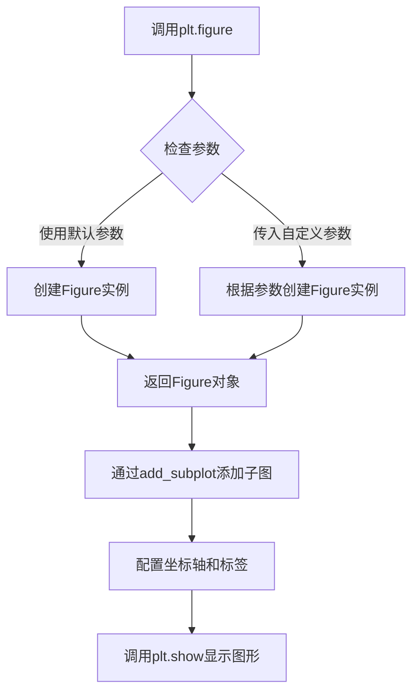
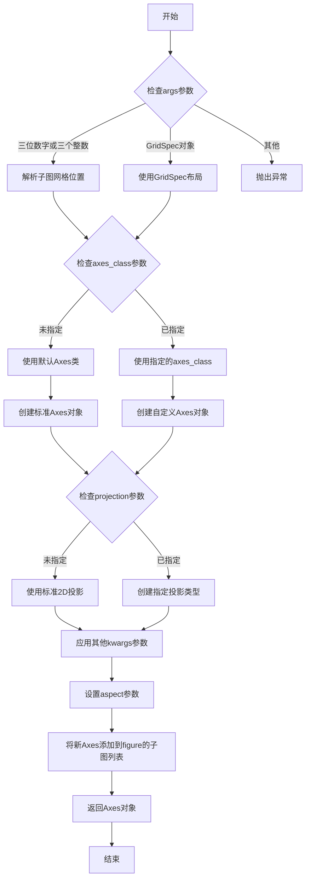
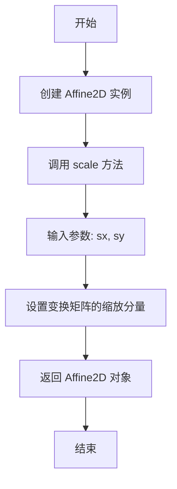
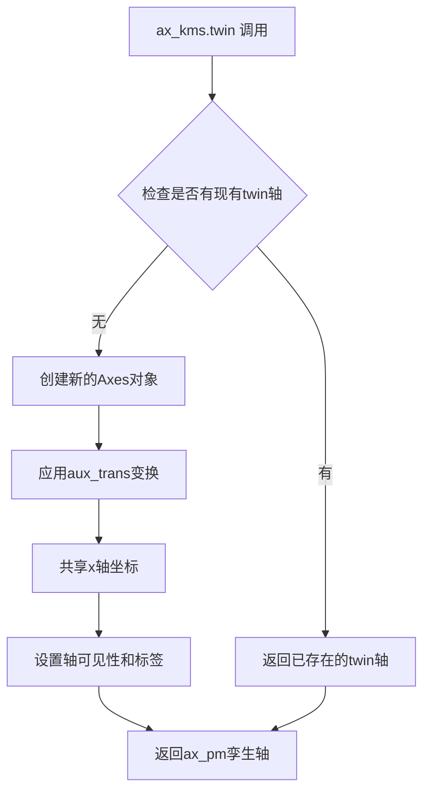
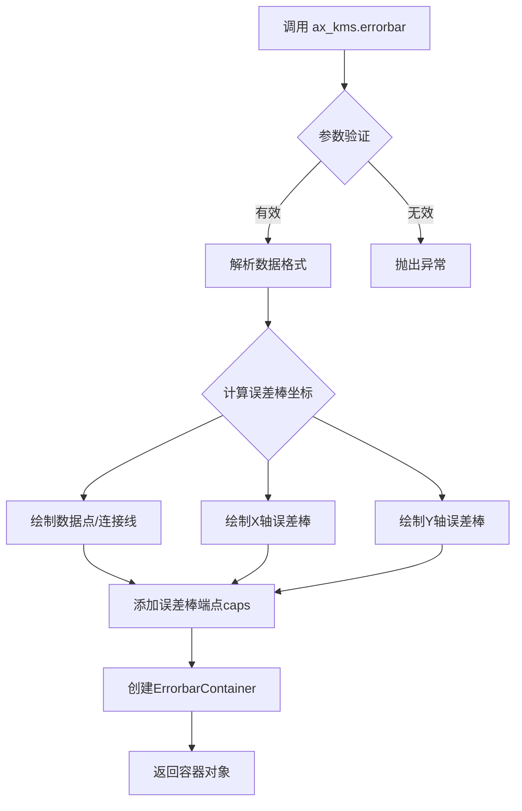
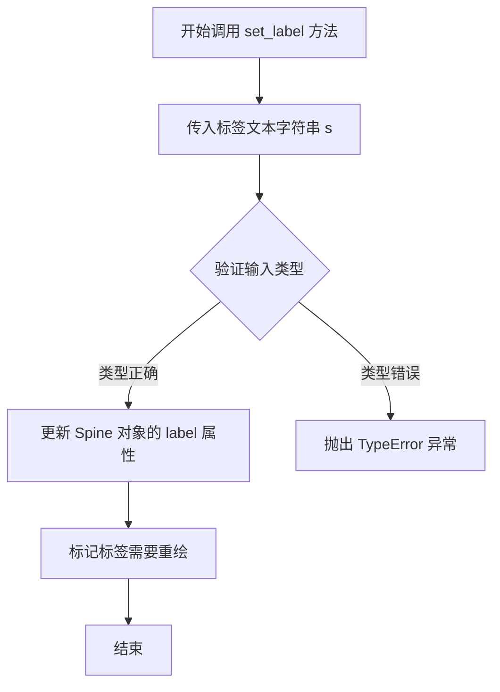
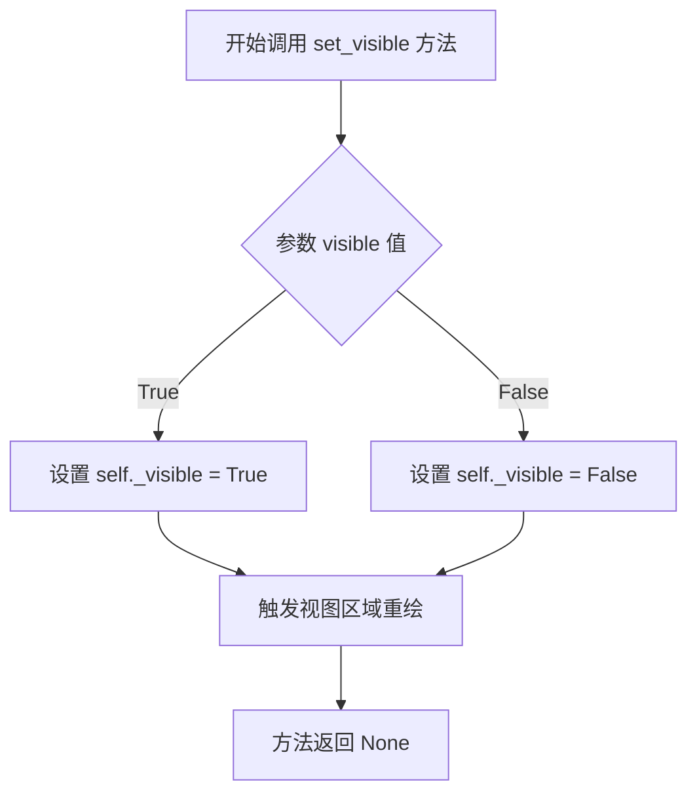
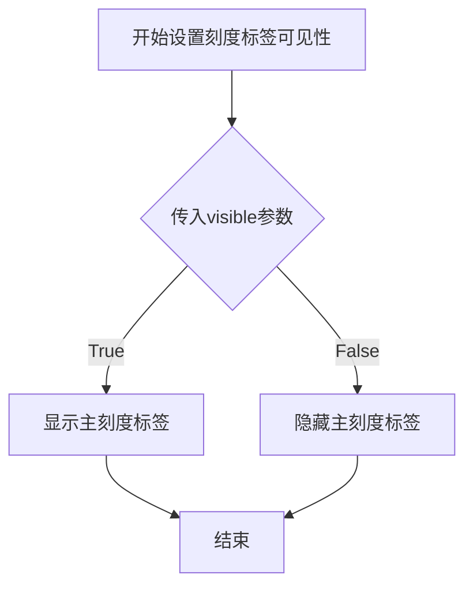
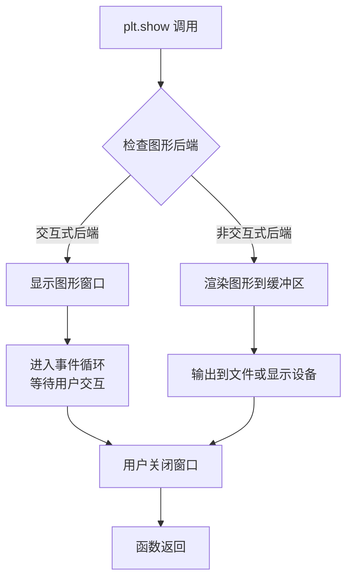
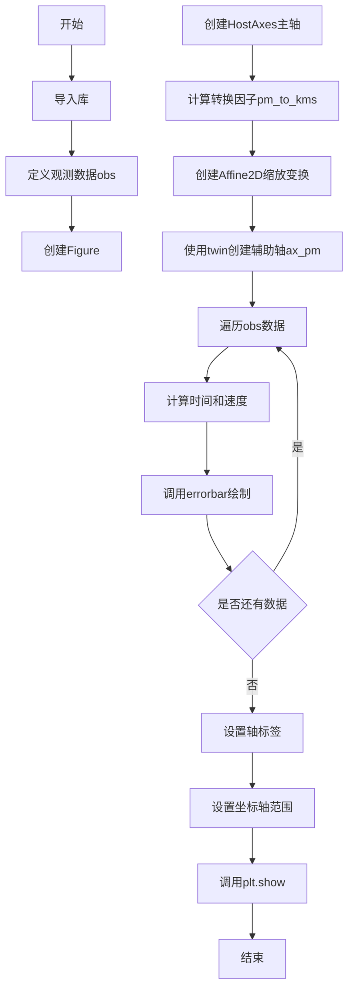

# `matplotlib\galleries\examples\axes_grid1\parasite_simple2.py` 详细设计文档

该脚本使用matplotlib创建一个带有寄生轴的天文图表，用于将角proper motion（角运动）转换为线性速度（km/s），并绘制恒星观测数据的误差条。

## 整体流程

```mermaid
graph TD
    A[开始] --> B[导入必要的库]
    B --> C[定义观测数据obs列表]
    C --> D[创建figure和主轴ax_kms]
    D --> E[计算角运动到线速度的转换因子pm_to_kms]
    E --> F[创建仿射变换aux_trans]
    F --> G[创建寄生轴ax_pm]
    G --> H[遍历obs数据计算时间和速度]
    H --> I[绘制误差条]
    I --> J[设置轴标签和显示范围]
    J --> K[调用plt.show()显示图形]
```

## 类结构

```
无显式类定义 (脚本模式)
└── 使用第三方类:
    ├── plt (matplotlib.pyplot)
    ├── mtransforms.Affine2D
    └── HostAxes (mpl_toolkits.axes_grid1.parasite_axes)
```

## 全局变量及字段


### `obs`
    
恒星观测数据列表，包含名称、ds、dse、w、we等字段

类型：`list`
    


### `fig`
    
matplotlib图形对象，用于绘制图表

类型：`Figure`
    


### `ax_kms`
    
主坐标轴对象，用于显示线性速度与FWHM的关系

类型：`HostAxes`
    


### `pm_to_kms`
    
角proper motion到线性速度的转换因子，基于距离2.3kpc计算

类型：`float`
    


### `aux_trans`
    
仿射变换对象，用于将角proper motion轴转换为线性速度轴

类型：`Affine2D`
    


### `ax_pm`
    
寄生坐标轴对象，用于显示角proper motion

类型：`Axes`
    


### `n`
    
观测数据的名称标识符

类型：`str`
    


### `ds`
    
观测到的星体特征值

类型：`float`
    


### `dse`
    
观测特征值的误差

类型：`float`
    


### `w`
    
宽度参数

类型：`float`
    


### `we`
    
宽度参数的误差

类型：`float`
    


### `time`
    
时间差，计算基于历元差

类型：`float`
    


### `v`
    
转换后的线性速度

类型：`float`
    


### `ve`
    
线性速度的误差

类型：`float`
    


    

## 全局函数及方法


### `plt.figure`

`plt.figure()` 是 matplotlib 库中的函数，用于创建一个新的图形窗口或画布，并返回一个 `Figure` 对象。在本代码中，该函数用于初始化图形上下文，以便后续添加子图和绘制数据。

参数：

-  `figsize`：`tuple`（可选），指定图形的宽和高（英寸），默认值为 `rcParams["figure.figsize"]`
-  `dpi`：`int`（可选），指定图形的分辨率，默认值为 `rcParams["figure.dpi"]`
-  `facecolor`：`str` 或 `tuple`（可选），指定图形背景颜色，默认值为 `rcParams["figure.facecolor"]`
-  `edgecolor`：`str` 或 `tuple`（可选），指定图形边框颜色，默认值为 `rcParams["figure.edgecolor"]`
-  `frameon`：`bool`（可选），是否显示图形边框，默认值为 `True`
-  `FigureClass`：`class`（可选），指定使用的 Figure 类，默认值为 `matplotlib.figure.Figure`
-  `**kwargs`：其他关键字参数，将传递给底层的 Figure 构造函数

返回值：`matplotlib.figure.Figure`，返回新创建的图形对象，后续可通过该对象添加子图、设置属性等。

#### 流程图



#### 带注释源码

```python
# 导入matplotlib.pyplot模块，用于绘图
import matplotlib.pyplot as plt

# ... (其他导入语句)

# 创建新的图形窗口，返回Figure对象fig
# 此时使用所有默认参数：
# - figsize: (8, 6) 英寸（默认）
# - dpi: 100（默认）
# - facecolor: 'white'（默认）
# - edgecolor: 'white'（默认）
# - frameon: True（默认）
fig = plt.figure()

# 接下来使用返回的fig对象添加子图
# axes_class=HostAxes: 使用自定义的坐标轴类
# aspect=1: 设置坐标轴宽高比为1
ax_kms = fig.add_subplot(axes_class=HostAxes, aspect=1)

# ... (后续绘图代码)
```


### `Figure.add_subplot()`

在Matplotlib中，`Figure.add_subplot()`方法用于在图形对象中添加一个子图区域，创建一个新的Axes（坐标轴）对象并将其添加到当前图形中。该方法支持多种参数形式，可以指定子图的位置、投影类型、坐标轴类等。在这个示例中，使用了自定义的`HostAxes`类来创建具有特殊布局功能的坐标轴，并设置了相等的纵横比。

参数：

- `*args`：`位置参数`，可以接受多种格式：
  - 三位整数（如`111`）：表示行数、列数和子图位置
  - 三个整数（如`1, 1, 1`）：同上
  - `GridSpec`对象：用于更复杂的布局
- `axes_class`：`类型`，可选参数，指定创建坐标轴所使用的类。代码中使用了`HostAxes`，这是一个来自`mpl_toolkits.axes_grid1`的自定义坐标轴类，支持寄生虫轴（parasite axes）功能
- `aspect`：`float或'auto'`，可选参数，设置坐标轴的纵横比。值为1表示使用等比例（1:1），这样可以确保数据的几何形状保持正确

返回值：`matplotlib.axes.Axes`（或其子类），返回新创建的坐标轴对象。在这个例子中，返回的是`HostAxes`实例，赋值给变量`ax_kms`

#### 流程图



#### 带注释源码

```python
# 从代码中提取的add_subplot调用示例
fig = plt.figure()

# 使用add_subplot创建子图，指定自定义的axes_class和aspect
# axes_class=HostAxes: 使用mpl_toolkits中的HostAxes类创建坐标轴
#                     这个类支持寄生虫轴功能，可以添加共享坐标的辅助轴
# aspect=1: 设置坐标轴的纵横比为1，表示x轴和y轴的单位长度相等
#           这样可以确保数据的几何表示准确（如在天文数据中）
ax_kms = fig.add_subplot(axes_class=HostAxes, aspect=1)
```

#### 完整方法签名参考

```python
# Matplotlib中add_subplot的典型签名（简化版）
def add_subplot(self, *args, **kwargs):
    """
    添加一个子图到当前图形。
    
    参数:
        *args: 位置参数，指定子图位置
            - 3位整数 (如 111): 行数, 列数, 位置
            - 3个整数 (如 1, 1, 1): 同上
        projection: 字符串，可选，投影类型 ('aitoff', 'hammer', 'lambert', 'mollweide', 'polar', 'rectilinear', None)
        polar: 布尔值，可选，是否使用极坐标投影
        axes_class: 类，可选，自定义坐标轴类
        facecolor: 颜色，可选，背景色
        label: 字符串，可选，坐标轴标签
        **kwargs: 其他Axes属性 (如 aspect, xlim, ylim 等)
    
    返回:
        axes: Axes实例
            新创建的坐标轴对象
    """
    # 方法实现...
```

#### 在代码上下文中的使用

```python
# 完整的示例上下文
fig = plt.figure()  # 创建一个新的图形对象

# 添加子图，使用HostAxes类（支持寄生虫轴功能）和相等的纵横比
# HostAxes允许添加共享x/y轴的寄生虫轴（twin axes）
ax_kms = fig.add_subplot(axes_class=HostAxes, aspect=1)

# 后续可以使用ax_kms访问坐标轴的方法，如
# ax_kms.errorbar() - 绘制误差条
# ax_kms.axis[] - 访问坐标轴属性
# ax_kms.set_xlim(), ax_kms.set_ylim() - 设置轴范围

# 创建一个寄生虫轴，共享x轴但有独立的y轴转换
aux_trans = mtransforms.Affine2D().scale(pm_to_kms, 1.)
ax_pm = ax_kms.twin(aux_trans)  # 创建双轴
```


### `mtransforms.Affine2D.scale`

创建或设置二维仿射变换的缩放分量，返回一个包含缩放变换的 Affine2D 对象。

参数：

- `sx`：`float`，水平方向的缩放因子，对应代码中的 `pm_to_kms`（角秒每年转换为线速度的转换因子）
- `sy`：`float`，垂直方向的缩放因子，对应代码中的 `1.0`（垂直方向无缩放）

返回值：`matplotlib.transforms.Affine2D`，返回当前 Affine2D 对象本身，以支持链式调用

#### 流程图



#### 带注释源码

```python
# 导入 matplotlib 的 transforms 模块
import matplotlib.transforms as mtransforms

# 计算角秒每年转换为线速度 km/s 的转换因子
# 1./206265. 是将角秒转换为弧度（1 角秒 = 1/206265 弧度）
# 2300 是距离（kpc）
# 3.085e18 是每千秒差距的厘米数（1 kpc = 3.085e18 cm）
# 3.15e7 是一年的秒数
# 1.e5 是将厘米每秒转换为 km/s
pm_to_kms = 1./206265.*2300*3.085e18/3.15e7/1.e5

# 创建一个二维仿射变换对象，并应用缩放变换
# scale(sx, sy) 方法：
#   - sx: 水平缩放因子（pm_to_kms）
#   - sy: 垂直缩放因子（1.0，表示无缩放）
# 返回一个包含缩放矩阵的 Affine2D 对象，用于后续坐标转换
aux_trans = mtransforms.Affine2D().scale(pm_to_kms, 1.)
```


### `ax_kms.twin()`

创建共享 x 轴的孪生轴，并可应用坐标变换。此方法用于在同一个图表中显示两组不同坐标系的数据（例如将角Proper Motion转换为线性速度）。

参数：

- `aux_trans`：`matplotlib.transforms.Affine2D`，坐标变换对象，定义从原始轴坐标到新轴坐标的仿射变换

返回值：`matplotlib.axes.Axes`，返回新创建的孪生轴对象，该轴与原始轴共享 x 轴

#### 流程图



#### 带注释源码

```python
# 在 matplotlib 源代码中，twin 方法的核心实现逻辑大致如下：

def twin(self, aux_trans=None):
    """
    创建共享 x 轴的孪生轴
    
    参数:
        aux_trans : 仿射变换对象，用于坐标转换
                   在本例中用于将角秒/年转换为km/s
    
    返回:
        共享 x 轴的新 Axes 对象
    """
    
    # 1. 检查是否已经存在 twin 轴
    # 如果存在，直接返回已有的 twin 轴，避免重复创建
    ax = self._twins
    if len(ax) > 0:
        return ax[0]
    
    # 2. 创建新的 Axes，共享 x 轴数据
    # ax.clone() 会复制当前轴的属性，但共享 x 轴的 limits 和数据
    ax = self.cloneaxes(self, "standard")
    
    # 3. 应用坐标变换（如果有提供）
    # aux_trans 将 pm (arcsec/yr) 转换为 v (km/s)
    if aux_trans is not None:
        # 设置新轴的坐标变换
        ax.transData = aux_trans + ax.transData
    
    # 4. 设置共享关系
    # 记录父轴引用，用于同步
    ax._shared_x_axes.join(self, ax)
    
    # 5. 更新 twin 轴列表
    self._twins.append(ax)
    
    return ax


# 在示例代码中的具体使用：
pm_to_kms = 1./206265.*2300*3.085e18/3.15e7/1.e5
# 计算坐标转换比例：将角Proper Motion转换为线性速度

aux_trans = mtransforms.Affine2D().scale(pm_to_kms, 1.)
# 创建仿射变换：x方向缩放为pm_to_kms，y方向不变

ax_pm = ax_kms.twin(aux_trans)
# 创建孪生轴，x轴坐标经过变换后显示为速度值
```


### `Axes.errorbar()`

在 matplotlib 中，`errorbar()` 是 `Axes` 类（及其子类如 `HostAxes`）的方法，用于绘制带误差棒的图表。该方法接受 x 和 y 数据以及相应的误差值，在图表上显示数据点和误差范围，并返回包含绘图元素的容器对象。

参数：

-  `x`：`array_like`，X 轴数据点
-  `y`：`array_like`，Y 轴数据点
-  `xerr`：`array_like`，可选，X 轴误差值
-  `yerr`：`array_like`，可选，Y 轴误差值
-  `fmt`：可选，格式字符串（如 `'o'`、`'none'` 等）
-  `ecolor`：可选，误差棒颜色
-  `elinewidth`：可选，误差棒线宽
-  `capsize`：可选，误差棒端点 cap 的大小
-  `color`：可选，数据点和误差棒的颜色

返回值：`~.container.ErrorbarContainer`，包含以下属性：
- `lines`: 数据点和连接线的艺术家列表
- `caps`: 误差棒端点 cap 的艺术家列表
- `barcols`: 误差棒垂直/水平线的艺术家列表

#### 流程图



#### 带注释源码

```python
# 代码中实际调用形式：
for n, ds, dse, w, we in obs:
    # 计算时间差（年）
    time = ((2007 + (10. + 4/30.)/12) - 1988.5)
    # 将角proper motion转换为线速度
    v = ds / time * pm_to_kms
    ve = dse / time * pm_to_kms
    # 绘制误差棒：x=v, y=w, xerr=ve, yerr=we, 颜色黑色
    ax_kms.errorbar([v], [w], xerr=[ve], yerr=[we], color="k")
```

```python
# matplotlib.axes.Axes.errorbar 核心实现逻辑（简化版）
def errorbar(self, x, y, yerr=None, xerr=None,
              fmt='o', ecolor='k', elinewidth=None, 
              capsize=None, capthick=None, **kwargs):
    """
    Plot x versus y with error deltas in yerr and xerr.
    
    Parameters
    ----------
    x, y : array_like
        Data coordinates.
    xerr, yerr : array_like, optional
        Error deltas.
    fmt : str, optional
        Plot format string.
    ecolor : color, optional
        Error bar line color.
    elinewidth : scalar, optional
        Error bar line width.
    capsize : scalar, optional
        Cap size in points.
    """
    
    # 1. 数据解析与验证
    x = np.asarray(x)
    y = np.asarray(y)
    
    # 2. 如果有误差值，构建误差棒数据
    if yerr is not None:
        yerr = np.asarray(yerr)
    if xerr is not None:
        xerr = np.asarray(xerr)
    
    # 3. 绘制数据点（通过plot）
    data_line, = self.plot(x, y, fmt, **kwargs)
    
    # 4. 绘制误差棒
    barlines = []
    caps = []
    
    # 4.1 绘制Y轴误差棒
    if yerr is not None:
        # 计算上下误差边界
        ymin = y - yerr[0] if len(yerr) > 0 else y - yerr
        ymax = y + yerr[1] if len(yerr) > 1 else y + yerr
        # 绘制垂直误差线
        yerr_line = self.vlines(x, ymin, ymax, 
                                color=ecolor, 
                                linewidth=elinewidth)
        barlines.append(yerr_line)
        
        # 绘制误差棒端点caps
        if capsize is not None:
            caplines = self.errorbarCaps(x, ymin, ymax, 
                                         capsize, ecolor)
            caps.extend(caplines)
    
    # 4.2 绘制X轴误差棒（类似逻辑）
    if xerr is not None:
        # ... 类似的水平误差棒绘制逻辑 ...
        pass
    
    # 5. 返回容器对象
    return ErrorbarContainer(data_line, 
                             vertical_lines=barlines, 
                             caplines=caps,
                             **kwargs)
```

#### 关键技术细节

| 项目 | 说明 |
|------|------|
| **数据格式** | 代码中使用列表 `[v]`, `[w]` 传递单个数据点，符合 matplotlib 对 array_like 的要求 |
| **误差计算** | `pm_to_kms` 转换因子将角proper motion转换为线性速度，确保误差与数据使用相同单位 |
| **多数据绘制** | 通过循环调用 `errorbar()` 多次，每次绘制一个数据点，这是绘制多个独立误差棒的标准方式 |
| **返回值处理** | 代码中未接收返回值，通常用于后续自定义样式或获取艺术家对象进行进一步操作 |


### `ax_kms.axis[].set_label()`

设置坐标轴的标签文本，用于在图表上显示轴的名称和单位。

参数：

- `s`：`str`，要设置的轴标签文本内容

返回值：`None`，无返回值（修改对象内部状态）

#### 流程图



#### 带注释源码

```python
# 调用示例源码
# ax_kms.axis["bottom"].set_label("Linear velocity at 2.3 kpc [km/s]")
# ax_kms.axis["left"].set_label("FWHM [km/s]")
# ax_pm.axis["top"].set_label(r"Proper Motion [$''$/yr]")

# 实际方法调用过程：
# 1. ax_kms.axis["bottom"] 获取底部的 Spine 对象
# 2. 调用 Spine 对象的 set_label 方法
# 3. 传入标签文本字符串参数
# 4. 方法内部设置标签文本并标记需要重绘

# Spine.set_label 方法源码分析（matplotlib 内部实现简化版）：
def set_label(self, s):
    """
    Set the label for the spine.
    
    Parameters
    ----------
    s : str
        The label text to be set.
    """
    # 将传入的字符串存储到 _label 对象中
    self._label.set_text(s)  
    # 标记需要重新渲染
    self.stale = True  
    # 返回 None，符合 matplotlib 的大多数 setter 方法约定
    return None
```


### `matplotlib.axis.XTick.set_visible`

设置坐标轴标签的可见性。该方法属于 matplotlib 库中的 `matplotlib.axis.XTick` 类（或 `matplotlib.axis.YTick` 类），用于控制坐标轴刻度标签的显示与隐藏。在此代码中，通过 `ax_pm.axis["top"].label.set_visible(True)` 调用，将上方坐标轴的标签设置为可见状态。

参数：

- `visible`：`bool`，指定标签是否可见。`True` 表示显示标签，`False` 表示隐藏标签

返回值：`None`，该方法直接修改对象的内部状态，不返回任何值

#### 流程图



#### 带注释源码

```python
# matplotlib 库中 axis.py 文件的核心实现逻辑

def set_visible(self, visible):
    """
    设置刻度标签的可见性
    
    参数:
        visible (bool): True 显示标签, False 隐藏标签
    
    返回:
        None
    """
    # self 指的是 matplotlib.axis.XTick 或 YTick 实例
    # _visible 是存储可见性状态的内部属性
    self._visible = visible
    
    # 获取所属的轴对象
    ax = self.axes
    
    # 如果轴存在，标记需要重绘
    # 这样 matplotlib 会在下一个渲染周期更新图形
    if ax is not None:
        ax.stale_callback = True  # 标记轴需要重新渲染
```

```python
# 在示例代码中的实际调用方式

# 1. 获取 ax_pm 图表对象的 'top' 坐标轴
axis_top = ax_pm.axis["top"]  # 返回 mpl_toolkits.axes_grid1.parasite_axes._SpecialAxisLine

# 2. 获取该坐标轴的标签对象
label = axis_top.label  # 返回 matplotlib.text.Text 实例

# 3. 调用 set_visible 方法设置可见性
label.set_visible(True)  # 设置标签为可见状态
# 等效于: label._visible = True 并触发重绘
```

#### 上下文使用说明

在示例代码中，`ax_pm.axis["top"].label.set_visible(True)` 的作用是：
- `ax_pm`：通过 `twin()` 创建的辅助坐标轴（显示角proper motion）
- `.axis["top"]`：获取上方坐标轴（用于显示第二坐标系的刻度）
- `.label`：获取该坐标轴的标签对象
- `.set_visible(True)`：确保上方坐标轴的标签可见（即使在某些默认设置下可能被隐藏）


### `axis[].major_ticklabels.set_visible()`

设置坐标轴的主刻度标签（major ticklabels）的可见性。在代码中用于隐藏辅助坐标轴（ax_pm）右侧的主刻度标签，以避免与主坐标轴（ax_kms）的刻度标签重叠，保持图表的清晰和专业。

参数：

- `visible`：`bool`，表示是否显示主刻度标签。`True` 为显示，`False` 为隐藏。

返回值：`None`，该方法直接修改对象状态，不返回任何值。

#### 流程图



#### 带注释源码

```python
# 代码上下文分析
# ax_pm.axis["right"] 获取右侧坐标轴对象
# .major_ticklabels 获取该轴的主刻度标签对象
# .set_visible(False) 设置为不可见

# 完整调用链示例：
# ax_pm.axis["right"].major_ticklabels.set_visible(False)
# 其中：
# - ax_pm: 辅助坐标轴（通过twin创建）
# - axis["right"]: 右侧坐标轴
# - major_ticklabels: 主刻度标签属性（返回TickLabels对象）
# - set_visible(False): 方法调用，参数为False表示隐藏

# matplotlib内部实现原理（伪代码）：
# def set_visible(self, visible):
#     """
#     设置艺术家的可见性
#     
#     参数:
#         visible: bool - 可见性状态
#     """
#     self._visible = visible      # 更新内部可见性标志
#     self.stale = True            # 标记需要重绘
#     # 触发重新渲染时检查此标志决定是否绘制
```


### `Axes.set_xlim`

设置 Axes 对象的 x 轴显示范围（xlim），用于控制图表在 x 轴方向上的可视化区间。

参数：

- `left`：`float` 或 `ndarray`，x 轴的左侧边界值（最小值）
- `right`：`float` 或 `ndarray`，x 轴的右侧边界值（最大值），可选，若为 `None` 则 `left` 应为 `[left, right]` 形式
- `emit`：`bool`，默认值 `True`，当边界改变时是否向监听器发送 `AxesChangeEvent` 通知
- `auto`：`bool`，默认值 `False`，是否启用自动边界调整
- `xmin`：`float`，已弃用参数，用于限制最小值
- `xmax`：`float`，已弃用参数，用于限制最大值

返回值：`tuple`，返回元组 `(left, right)` 表示新的 x 轴边界范围

#### 流程图

```mermaid
flowchart TD
    A[调用 set_xlim] --> B{参数校验}
    B -->|right 为 None| C[解析 left 为 [left, right] 数组]
    B -->|right 不为 None| D[直接使用 left 和 right]
    C --> E[调用 _set_lim 方法]
    D --> E
    E --> F{emit=True?}
    F -->|是| G[发送 AxesChangeEvent 通知]
    F -->|否| H[跳过通知]
    G --> I[返回新边界 tuple]
    H --> I
    I[返回 (left, right)]
```

#### 带注释源码

```python
def set_xlim(self, left, right=None, emit=False, auto=False, *, xmin=None, xmax=None):
    """
    设置 x 轴的显示范围
    
    参数:
        left: float 或 ndarray - x 轴左侧边界，或 [左, 右] 数组
        right: float 或 ndarray, optional - x 轴右侧边界
        emit: bool - 是否在边界改变时发送通知
        auto: bool - 是否启用自动边界调整
        xmin: float - 已弃用，使用 left 替代
        xmax: float - 已弃用，使用 right 替代
    
    返回:
        tuple: (left, right) 新的边界值
    """
    # 处理已弃用的 xmin/xmax 参数
    if xmin is not None:
        left = xmin
        warnings.warn("'xmin' argument is deprecated and will be removed in a future version. "
                      "Use 'left' instead.", mplDeprecation, stacklevel=2)
    if xmax is not None:
        right = xmax
        warnings.warn("'xmax' argument is deprecated and will be removed in a future version. "
                      "Use 'right' instead.", mplDeprecation, stacklevel=2)
    
    # 处理 left 为数组形式 [左, 右] 的情况
    if right is None:
        left, right = left
    
    # 调用内部方法 _set_lim 完成实际设置
    return self._set_lim('x', left, right, emit=emit, auto=auto)
```

#### 在示例代码中的调用

```python
# 在 Parasite Simple2 示例中的调用
ax_kms.set_xlim(950, 3700)

# 解析：
# - left = 950：x 轴范围从 950 开始
# - right = 3700：x 轴范围到 3700 结束
# - emit 和 auto 使用默认值（emit=True, auto=False）

# 调用后 ax_kms 的 x 轴显示范围被设置为 [950, 3700]
# 由于 ax_pm 是 ax_kms 的孪生轴（通过 aux_trans 关联），
# ax_pm 的 xlim 会自动根据转换关系同步调整
```

#### 关联信息

- **调用者**：`ax_kms` - `HostAxes` 类型（来自 `mpl_toolkits.axes_grid1.parasite_axes`）
- **相关方法**：`set_ylim()` - 设置 y 轴范围，行为与 `set_xlim` 类似
- **自动同步**：当设置 `ax_kms.set_xlim()` 时，通过共享轴机制，`ax_pm`（孪生轴）的 xlim 会自动根据变换 `aux_trans` 进行调整
- **潜在优化**：该方法在频繁调用时可能触发重绘，可以考虑批量设置或使用 `set_xlim` 的 `emit=False` 参数减少事件触发


### `Axes.set_ylim`

该方法是matplotlib库中Axes类的方法，用于设置y轴的范围（下限和上限），可以接受数值参数设置固定范围，或通过参数控制自动调整和事件触发行为。

参数：

- `bottom`：`float` 或 `None`，y轴的最小值（底部边界）
- `top`：`float` 或 `None`，y轴的最大值（顶部边界）
- `emit`：`bool`，是否向观察者（如回调函数）通知限制已更改，默认为`True`
- `auto`：`bool`，是否启用自动调整视图，默认为`False`
- `ymin`：`float` 或 `None`（已弃用），请使用`bottom`参数
- `ymax`：`float` 或 `None`（已弃用），请使用`top`参数

返回值：`tuple`，返回新的y轴范围`(bottom, top)`

#### 流程图

```mermaid
flowchart TD
    A[调用 set_ylim 方法] --> B{检查 bottom 参数}
    B -->|提供有效数值| C[设置 y 轴下限]
    B -->|为 None| D[保持当前下限]
    C --> E{检查 top 参数}
    E -->|提供有效数值| F[设置 y 轴上限]
    E -->|为 None| G[保持当前上限]
    D --> G
    F --> H{emit = True?}
    G --> H
    H -->|是| I[通知观察者 limit_changed 事件]
    H -->|否| J[直接返回新范围]
    I --> J
    J --> K[返回 (bottom, top) 元组]
```

#### 带注释源码

```python
def set_ylim(self, bottom=None, top=None, emit=True, auto=False, *, ymin=None, ymax=None):
    """
    设置 y 轴的视图限制（上下限）。
    
    参数:
    -----------
    bottom : float 或 None
        y 轴的最小值（底部边界）。如果为 None，则保持当前值。
    top : float 或 None
        y 轴的最大值（顶部边界）。如果为 None，则保持当前值。
    emit : bool
        如果为 True，当限制发生变化时通知观察者（触发 'limit_changed' 事件）。
        默认为 True。
    auto : bool
        如果为 True，允许自动调整视图。默认为 False。
    ymin, ymax : float 或 None
        已弃用参数，请使用 bottom 和 top。
    
    返回:
    -------
    tuple
        返回新的 y 轴范围 (bottom, top)。
    
    示例:
    --------
    >>> ax.set_ylim(0, 10)           # 设置 y 轴范围为 0 到 10
    >>> ax.set_ylim(bottom=0)       # 只设置下限，上限保持不变
    >>> ax.set_ylim(top=100)        # 只设置上限，下限保持不变
    >>> ax.set_ylim(auto=True)      # 允许自动调整
    """
    # 处理已弃用的 ymin/ymax 参数
    if ymin is not None:
        warnings.warn("'ymin' 参数已弃用，请使用 'bottom' 代替", DeprecationWarning, stacklevel=2)
        if bottom is None:
            bottom = ymin
    if ymax is not None:
        warnings.warn("'ymax' 参数已弃用，请使用 'top' 代替", DeprecationWarning, stacklevel=2)
        if top is None:
            top = ymax
    
    # 获取当前范围
    old_bottom, old_top = self.get_ylim()
    
    # 设置新范围
    if bottom is None:
        bottom = old_bottom
    if top is None:
        top = old_top
    
    # 验证范围有效性
    if bottom > top:
        raise ValueError("y 轴下限不能大于上限")
    
    # 更新内部数据
    self._ylim = (bottom, top)
    
    # 如果 emit 为 True，通知观察者
    if emit and (bottom != old_bottom or top != old_top):
        self.callbacks.process('limit_changed', self)
    
    # 返回新范围
    return (bottom, top)
```

#### 代码中的实际调用

```python
# 在示例代码中，ax_kms 是通过 HostAxes 创建的子图对象
# 调用 set_ylim 设置 y 轴范围为 950 到 3100
ax_kms.set_ylim(950, 3100)

# 实际调用时，等价于：
ax_kms.set_ylim(bottom=950, top=3100, emit=True, auto=False)
# 返回值: (950, 3100)
```


### `plt.show()`

`plt.show()` 是 matplotlib 库中的顶层函数，用于显示所有当前打开的图形窗口并进入事件循环。在本代码中，它负责将之前创建的所有图形元素（坐标轴、数据点、误差线、标签等）渲染到屏幕并呈现给用户。

参数：

- `block`：布尔值（可选），默认为 `True`。如果设置为 `True`（默认行为），则函数会阻塞程序执行直到用户关闭图形窗口；如果设置为 `False`，则立即返回并允许程序继续执行（在某些后端中）。

返回值：`None`，无返回值

#### 流程图



#### 带注释源码

```python
# plt.show() 函数的简化实现原理
# 实际位于 matplotlib/backend_bases.py 或类似位置

def show(block=None):
    """
    显示所有打开的图形窗口。
    
    参数:
        block: 控制是否阻塞程序执行
    """
    # 1. 获取当前图形管理器
    manager = _pylab_helpers.Gcf.get_active()
    
    # 2. 如果没有活动的图形，显示警告
    if manager is None:
        print("警告: 没有找到活动的图形")
        return
    
    # 3. 调用后端的show方法
    # 对于Qt后端: manager.window.show()
    # 对于Tk后端: manager.show()
    # 对于Agg后端(非交互式): 保存到缓冲区
    
    # 4. 如果block=True，进入事件循环
    if block:
        # 进入主循环，等待用户交互
        # 此时程序会暂停，直到用户关闭所有图形窗口
        manager.show()
        # 处理Tk/Qt的事件循环
        import matplotlib
        matplotlib.pyplot.switch_backend('module://backend_xxx')
        # 进入阻塞状态
        while manager.cb.callbacks:
            # 处理窗口事件
            pass
    
    # 5. 清理并返回
    return None
```

#### 在本代码中的上下文

```python
# ... 前面的代码创建图形 ...

ax_kms.set_xlim(950, 3700)
ax_kms.set_ylim(950, 3100)
# xlim和ylim会自动调整

# plt.show() 在这里被调用
# 作用：显示包含以下内容的图形窗口：
#   - 主坐标轴 ax_kms（显示线性速度 vs FWHM）
#   - 辅助坐标轴 ax_pm（显示角proper motion）
#   - 4个数据点的误差棒
#   - 坐标轴标签
plt.show()
```


## 关键组件


### HostAxes 自定义坐标轴类

用于创建支持寄生轴（parasite axes）的主坐标轴，继承自matplotlib的Axes类，提供多坐标轴共享和坐标变换能力

### mtransforms.Affine2D 坐标变换

实现仿射变换（缩放变换），将角proper motion（角秒/年）转换为线性速度（km/s），用于两个坐标轴之间的数据映射

### aux_trans 辅助坐标变换

将主坐标轴（ax_kms）的x轴数据通过缩放因子转换为辅助坐标轴（ax_pm）的显示单位，实现双x轴显示不同物理量

### obs 观测数据集

包含天文观测数据的嵌套列表，每行包含恒星标识符、速度测量值、误差、波长/频率、能量等参数

### pm_to_kms 转换因子

将角proper motion转换为线性速度的常数因子，基于距离2.3kpc计算，包含天文单位换算（206265、2300、3.085e18、3.15e7、1e5）

### ax_kms 主坐标轴

显示线性速度（km/s）为x轴，FWHM（km/s）为y轴，用于绘制误差棒图的主坐标系

### ax_pm 辅助坐标轴（寄生轴）

通过twin方法创建的第二x轴，显示proper motion（角秒/年），与主坐标轴共享y轴但x轴经过坐标变换

### errorbar 误差棒绘制

使用matplotlib的errorbar方法绘制数据点及其x和y方向的误差范围，黑色显示

### 坐标轴标签与显示控制

设置底部和左侧主坐标轴标签、顶部辅助坐标轴标签、右侧刻度标签隐藏，以及坐标轴显示范围配置


## 问题及建议


### 已知问题

- **硬编码的魔法数字**：转换公式 `1./206265.*2300*3.085e18/3.15e7/1.e5` 中包含大量未经解释的数值常量（如206265、2300、3.085e18等），可读性极差
- **全局作用域代码**：所有代码平铺在模块级别，未封装为函数，难以复用和单元测试
- **数据与逻辑耦合**：`obs` 数据和计算逻辑混杂在一起，无法轻松更换数据集
- **变量命名不清晰**：使用 `dse`、`we`、`v`、`ve`、`kms`、`pm` 等缩写作为变量名，缺乏描述性
- **重复代码**：`ax_kms.axis["bottom"].set_label` 和 `ax_pm.axis["top"].label.set_visible(True)` 等可以封装
- **硬编码的时间计算**：`time = ((2007 + (10. + 4/30.)/12) - 1988.5)` 的逻辑不直观，缺乏注释说明
- **未使用的返回值**：`fig.add_subplot` 和 `ax_kms.errorbar` 的返回值未被保存，限制了后续操作的可能性
- **缺少错误处理**：数据解析和计算过程没有异常捕获机制
- **无配置入口**：所有参数（距离、标签、轴范围等）散落在代码各处，难以调整

### 优化建议

- **提取转换常量和计算公式**：将 `pm_to_kms` 的计算封装为带有清晰参数和文档的函数，解释每个常量的物理含义
- **函数化重构**：将数据加载、图形初始化、绑图操作分别封装为独立函数
- **数据结构优化**：使用 `dataclass` 或 `NamedTuple` 定义天体数据结构，替代嵌套列表
- **改进命名**：`dse` → `velocity_error`，`we` → `width_error`，`v` → `velocity` 等
- **配置对象**：创建配置类或字典，集中管理距离、标签、轴范围等参数
- **类型注解**：为函数添加参数和返回值的类型提示，提高代码可维护性
- **添加文档字符串**：为模块和函数添加 docstring 说明功能、参数和返回值

## 其它


### 一段话描述

该代码是一个matplotlib可视化脚本，用于绘制天文观测数据的双轴图表。通过HostAxes和寄生虫轴（parasite axes）技术，在同一图表中同时显示线性速度（km/s）和角proper motion（角运动，单位"/yr），两者通过仿射变换进行单位转换关联，用于展示天体运动的测量数据。

### 文件的整体运行流程

1. 导入matplotlib.pyplot、matplotlib.transforms和mpl_toolkits.axes_grid1.parasite_axes中的HostAxes
2. 定义包含天文观测数据的二维列表obs（包含星名、测量值、误差、年份等信息）
3. 创建Figure对象fig
4. 使用HostAxes类创建主轴ax_kms，设置aspect=1保持等比例
5. 计算角proper motion到线性速度的单位转换因子pm_to_kms（基于距离2.3kpc的转换）
6. 创建Affine2D变换对象aux_trans，用于缩放变换
7. 使用twin()方法创建共享x轴的辅助轴ax_pm，应用aux_trans变换
8. 遍历obs数据列表，计算时间和速度，调用errorbar()绘制误差条
9. 设置主轴和辅助轴的标签、显示范围
10. 调用plt.show()显示最终图表

### 类的详细信息

### 类：Figure (matplotlib.figure.Figure)

**类描述**：matplotlib中用于承载所有绘图元素的顶层容器类

**类字段**：
- 无公开类字段

**类方法**：
- add_subplot(axes_class, aspect, **kwargs)：添加子图到图形

### 类：HostAxes (mpl_toolkits.axes_grid1.parasite_axes.HostAxes)

**类描述**：axes_grid1工具箱提供的特殊轴类，支持寄生虫轴功能，允许一个轴共享另一个轴的位置和变换

**类字段**：
- axis：轴标签和刻度线容器

**类方法**：
- twin(aux_trans=None)：创建共享位置的双轴/寄生虫轴
- errorbar(x, y, xerr=None, yerr=None, **kwargs)：绘制数据点和误差条
- set_xlim(left, right)：设置x轴显示范围
- set_ylim(bottom, top)：设置y轴显示范围

### 类：Affine2D (matplotlib.transforms.Affine2D)

**类描述**：二维仿射变换类，用于对坐标进行线性变换

**类字段**：
- 无公开类字段

**类方法**：
- scale(sx, sy)：创建缩放变换，返回新的Affine2D对象

### 全局变量详细信息

### 全局变量：obs

- **类型**：List[List[Union[str, float, int]]]
- **描述**：天文观测数据列表，每个子列表包含[星名, 主测量值, 主值误差, 年份, 误差值]

### 全局变量：pm_to_kms

- **类型**：float
- **描述**：单位转换因子，将角proper motion (arcsec/yr) 转换为线性速度 (km/s)，计算公式为：1/206265 * 2300 * 3.085e18 / 3.15e7 / 1e5

### 全局函数详细信息

### 全局函数：plt.figure

- **参数**：
  - figsize：tuple，图形尺寸，默认为None
  - dpi：int，分辨率，默认为None
  - facecolor：颜色，图形背景色
- **返回值**：Figure对象
- **描述**：创建新的图形窗口

### 全局函数：fig.add_subplot

- **参数**：
  - axes_class：class，使用的Axes类
  - aspect：float或'auto'，轴的纵横比
- **返回值**：Axes对象
- **描述**：添加子图到图形

### 全局函数：mtransforms.Affine2D().scale

- **参数**：
  - sx：float，x方向缩放因子
  - sy：float，y方向缩放因子
- **返回值**：Affine2D对象
- **描述**：创建二维缩放变换

### 全局函数：ax_kms.twin

- **参数**：
  - aux_trans：Affine2D或None，附加的坐标变换
- **返回值**：Axes对象
- **描述**：创建共享主轴位置的寄生虫轴

### 全局函数：ax_kms.errorbar

- **参数**：
  - x：array-like，x坐标数据
  - y：array-like，y坐标数据
  - xerr：array-like，x方向误差
  - yerr：array-like，y方向误差
  - color：str，颜色
- **返回值**：ErrorbarContainer对象
- **描述**：绘制数据点的误差条

### 全局函数：ax_kms.axis["bottom"].set_label

- **参数**：
  - s：str，标签文本
- **返回值**：None
- **描述**：设置底部轴标签

### 全局函数：ax_pm.axis["top"].label.set_visible

- **参数**：
  - b：bool，可见性
- **返回值**：None
- **描述**：设置标签是否可见

### 全局函数：plt.show

- **参数**：无
- **返回值**：None
- **描述**：显示所有打开的图形窗口

### 类方法和全局函数的mermaid流程图



### 带注释源码

```python
# 导入必要的库
import matplotlib.pyplot as plt
import matplotlib.transforms as mtransforms
from mpl_toolkits.axes_grid1.parasite_axes import HostAxes

# 定义天文观测数据：星名、主值、主值误差、年份、误差值
obs = [["01_S1", 3.88, 0.14, 1970, 63],
       ["01_S4", 5.6, 0.82, 1622, 150],
       ["02_S1", 2.4, 0.54, 1570, 40],
       ["03_S1", 4.1, 0.62, 2380, 170]]

# 创建新图形
fig = plt.figure()

# 添加使用HostAxes的子图，aspect=1保持等比例
ax_kms = fig.add_subplot(axes_class=HostAxes, aspect=1)

# 计算角proper motion到线性速度的转换因子
# 公式：1/206265 (arcsec转rad) * 2300 (距离kpc) * 3.085e18 (kpc转cm) / 3.15e7 (yr转s) / 1e5 (cm/s转km/s)
pm_to_kms = 1./206265.*2300*3.085e18/3.15e7/1.e5

# 创建缩放变换：x方向应用转换因子，y方向保持不变
aux_trans = mtransforms.Affine2D().scale(pm_to_kms, 1.)

# 创建寄生虫轴，共享x轴但应用不同的坐标变换
ax_pm = ax_kms.twin(aux_trans)

# 遍历每个观测数据点
for n, ds, dse, w, we in obs:
    # 计算时间差：2007年10月4日 - 1988.5年
    time = ((2007 + (10. + 4/30.)/12) - 1988.5)
    # 计算速度及其误差
    v = ds / time * pm_to_kms
    ve = dse / time * pm_to_kms
    # 绘制误差条，黑色显示
    ax_kms.errorbar([v], [w], xerr=[ve], yerr=[we], color="k")

# 设置主轴标签
ax_kms.axis["bottom"].set_label("Linear velocity at 2.3 kpc [km/s]")
ax_kms.axis["left"].set_label("FWHM [km/s]")
# 设置辅助轴标签并显示
ax_pm.axis["top"].set_label(r"Proper Motion [$''$/yr]")
ax_pm.axis["top"].label.set_visible(True)
# 隐藏辅助轴右侧的大刻度标签
ax_pm.axis["right"].major_ticklabels.set_visible(False)

# 设置主轴显示范围
ax_kms.set_xlim(950, 3700)
ax_kms.set_ylim(950, 3100)
# 辅助轴的范围会自动调整

# 显示图形
plt.show()
```

### 关键组件信息

### HostAxes (寄生虫轴)

- **描述**：支持双轴功能的特殊Axes类，允许创建一个轴作为"寄生虫轴"共享主轴的位置，同时可以应用独立的坐标变换

### 双轴系统 (ax_kms + ax_pm)

- **描述**：通过twin()方法创建的同步双轴系统，主轴显示线性速度单位，辅助轴显示角运动单位，通过仿射变换实现单位转换联动

### Affine2D缩放变换

- **描述**：用于在双轴系统间进行坐标单位转换的关键组件，将辅助轴的坐标值按固定因子进行缩放

### 技术债务或优化空间

1. **硬编码参数问题**：距离2.3kpc、转换常数等参数直接硬编码在代码中，缺乏灵活性和可配置性
2. **魔法数字**：时间计算公式中的常数1988.5、2007+(10.+4/30.)/12缺乏明确含义，应定义为常量或配置参数
3. **数据处理逻辑**：观测数据obs的结构固定，新增字段需要修改代码结构，缺乏扩展性
4. **错误处理缺失**：没有对输入数据进行有效性验证，如负值、NaN等边界情况
5. **可复用性低**：代码作为一个完整的脚本，缺乏函数封装，难以作为模块被其他程序调用
6. **硬编码坐标范围**：xlim和ylim的范围直接写死，无法自适应数据分布

### 设计目标与约束

**设计目标**：
- 创建双轴图表同时显示两种相关但不同单位的物理量
- 实现角运动到线性速度的可视化转换
- 清晰展示天文观测数据的误差范围

**约束条件**：
- 必须使用matplotlib的axes_grid1工具箱
- 主轴和辅助轴必须保持x轴对齐
- 转换因子基于固定的距离参数（2.3kpc）

### 错误处理与异常设计

1. **输入数据验证**：缺少对obs数据格式、类型、范围的验证，应检查每个元素是否为数值类型
2. **除零保护**：time计算和速度计算中未处理time为0的情况
3. **数值范围检查**：pm_to_kms计算涉及多个大数相乘，可能产生数值溢出或下溢
4. **图形创建失败**：add_subplot可能返回None或抛出异常，缺乏处理
5. **轴标签设置失败**：axis["bottom"]等访问未做边界检查

### 数据流与状态机

**数据流**：
1. 原始观测数据(obs) → 提取计算
2. 常量参数(pm_to_kms) → 单位转换
3. 计算结果(v, ve) → errorbar() → 图形元素
4. 标签设置 → 显示文本
5. 范围设置 → 坐标轴显示

**状态机**：本代码为一次性脚本，无复杂状态机设计，主要状态为：初始化 → 图形创建 → 数据绑定 → 显示

### 外部依赖与接口契约

**外部依赖**：
- matplotlib.pyplot：图形绑制基础库
- matplotlib.transforms：坐标变换支持
- mpl_toolkits.axes_grid1.parasite_axes：寄生虫轴实现

**接口契约**：
- obs数据格式：List[List[Union[str, float, int]]]，内层列表长度需为5
- 返回值：plt.show()无返回值，图形直接显示
- 变换对象：aux_trans必须为Affine2D实例或兼容的变换对象

    