# `matplotlib\galleries\examples\axes_grid1\scatter_hist_locatable_axes.py` 详细设计文档

本示例演示如何使用 matplotlib 的 make_axes_locatable 工具创建一个带有边缘直方图的散点图，通过 Divider API 实现主坐标轴与边缘直方图轴的精确对齐和尺寸控制。

## 整体流程

```mermaid
graph TD
    A[开始] --> B[导入模块: matplotlib.pyplot, numpy, make_axes_locatable]
B --> C[设置随机种子 np.random.seed(19680801)]
C --> D[生成随机数据 x, y 各1000个点]
D --> E[创建 Figure 和主 Axes: plt.subplots]
E --> F[绘制散点图: ax.scatter(x, y)]
F --> G[设置主 Axes 等宽比: ax.set_aspect(1.)]
G --> H[创建 AxesDivider: make_axes_locatable(ax)]
H --> I[在顶部创建共享x轴的直方图: divider.append_axes('top', ...)]
I --> J[在右侧创建共享y轴的直方图: divider.append_axes('right', ...)]
J --> K[隐藏边缘直方图的刻度标签]
K --> L[计算合适的坐标轴范围和bins]
L --> M[绘制边缘直方图: hist]
M --> N[设置刻度: set_yticks, set_xticks]
N --> O[显示图形: plt.show]
```

## 类结构

```
Python 脚本 (无自定义类)
├── 导入模块
│   ├── matplotlib.pyplot
│   ├── numpy
│   └── mpl_toolkits.axes_grid1.make_axes_locatable
└── 执行流程
    ├── 数据生成
    ├── 图形创建
    └── 边缘直方图添加
```

## 全局变量及字段


### `x`
    
随机生成的1000个x坐标数据

类型：`numpy.ndarray`
    


### `y`
    
随机生成的1000个y坐标数据

类型：`numpy.ndarray`
    


### `fig`
    
图形对象

类型：`matplotlib.figure.Figure`
    


### `ax`
    
主坐标轴对象

类型：`matplotlib.axes.Axes`
    


### `divider`
    
坐标轴分割器

类型：`mpl_toolkits.axes_grid1.axes_divider.AxesDivider`
    


### `ax_histx`
    
顶部边缘直方图坐标轴

类型：`matplotlib.axes.Axes`
    


### `ax_histy`
    
右侧边缘直方图坐标轴

类型：`matplotlib.axes.Axes`
    


### `binwidth`
    
直方图的bin宽度 (0.25)

类型：`float`
    


### `xymax`
    
x和y数据中最大绝对值的较大者

类型：`float`
    


### `lim`
    
坐标轴显示范围

类型：`float`
    


### `bins`
    
直方图的bin边界数组

类型：`numpy.ndarray`
    


    

## 全局函数及方法


### `np.random.seed`

设置 NumPy 随机数生成器的种子，以确保生成的可重复随机数序列。该函数用于控制随机数生成器的初始状态，使得每次运行程序时能够产生相同的随机数序列，便于调试和结果复现。

参数：

- `seed`：`int` 或 `None`，随机数生成器的种子值。如果传入整数，则使用该整数作为种子；如果传入 `None`（默认行为），则基于系统时间或操作系统随机源重新初始化种子。

返回值：`None`，该函数不返回任何值，仅修改随机数生成器的内部状态。

#### 流程图

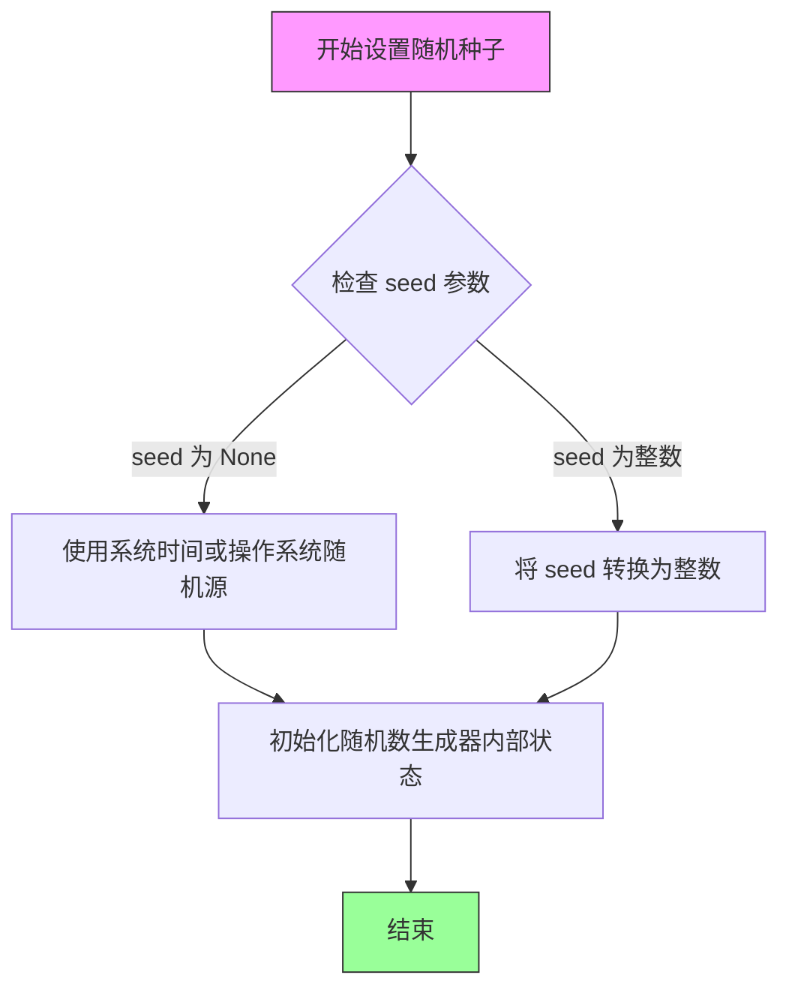

#### 带注释源码

```python
# 设置随机数种子为 19680801
# 这个特定的数值来自 matplotlib 官方示例的历史惯例
# 使用固定种子可以确保每次运行代码时生成相同的随机数序列
np.random.seed(19680801)

# 生成 1000 个符合标准正态分布的随机数
x = np.random.randn(1000)
y = np.random.randn(1000)

# 由于种子已固定，x 和 y 的值在每次程序运行时都相同
# 这对于调试、单元测试和结果复现非常重要
```

#### 详细说明

`np.random.seed` 函数的核心作用是通过初始化随机数生成器的内部状态，确保随机过程的可复现性。在科学计算和数据可视化中，这种确定性行为对于：

- **调试**：当程序出现异常行为时，固定种子可以重现问题
- **单元测试**：确保测试用例的结果可预测
- **结果复现**：研究论文或报告中需要能够重现实验结果
- **教学演示**：确保演示代码每次运行结果一致

该函数是 NumPy 随机模块的基础函数之一，在 `numpy.random` 包的早期版本中直接可用。在较新版本的 NumPy 中，推荐使用 `np.random.default_rng()` 创建的生成器对象的 `seed()` 方法，但 `np.random.seed` 仍然保持向后兼容。


### `np.random.randn`

生成符合标准正态分布（均值0，方差1）的随机数数组。

参数：

-  `*d0, d1, ..., dn`：`int`，可选，表示输出数组的维度。各个参数代表输出数组在各个维度上的大小。如果不提供参数，则返回一个单一的浮点数。

返回值：`numpy.ndarray`，返回符合标准正态分布的随机数数组，类型为float64。

#### 流程图

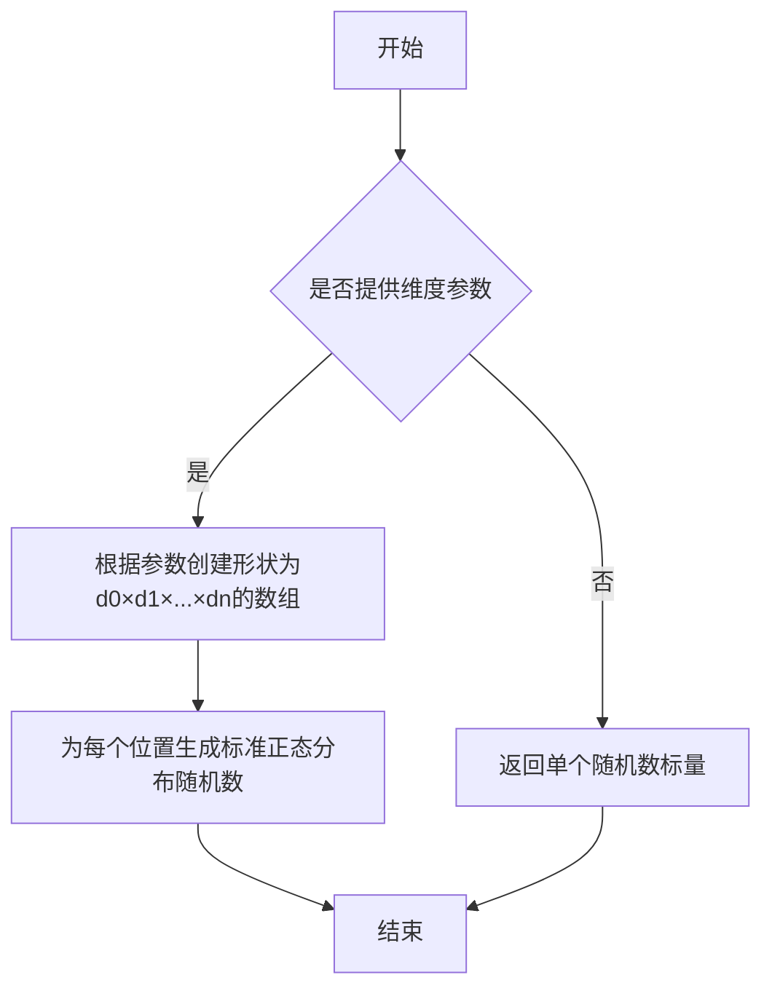

#### 带注释源码

```python
# 在代码中的实际使用方式：
x = np.random.randn(1000)  # 生成1000个标准正态分布随机数，赋值给x
y = np.random.randn(1000)  # 生成1000个标准正态分布随机数，赋值给y

# np.random.randn 的底层实现原理（简化版说明）
# 1. 如果没有参数：返回单个随机数
#    result = np.random.randn()  # 等价于 np.random.standard_normal()

# 2. 如果有参数：生成指定形状的数组
#    # 例如 np.random.randn(1000) 等价于：
#    result = np.random.standard_normal(1000)
#    
#    # np.random.randn(2, 3) 等价于：
#    result = np.random.standard_normal((2, 3))

# 3. 内部实现使用Box-Muller变换或类似算法将均匀分布随机数转换为正态分布
#    Box-Muller变换:
#    u1, u2 = random(), random()  # 两个均匀分布随机数
#    z0 = sqrt(-2*ln(u1)) * cos(2*pi*u2)  # 标准正态分布随机数
#    z1 = sqrt(-2*ln(u1)) * sin(2*pi*u2)  # 另一个标准正态分布随机数
```


### plt.subplots

创建Figure和Axes对象的函数，返回一个包含figure和axes的元组，允许同时设置Figure和Axes的属性。

参数：

- `nrows`：`int`，可选，默认值为1，子图网格的行数
- `ncols`：`int`，可选，默认值为1，子图网格的列数
- `sharex`：`bool`或`str`，可选，默认值为False，如果为True或'all'，则所有子图共享x轴
- `sharey`：`bool`或`str`，可选，默认值为False，如果为True或'all'，则所有子图共享y轴
- `squeeze`：`bool`，可选，默认值为True，如果为True，则返回的axes数组维度会优化
- `subplot_kw`：`dict`，可选，关键字参数传递给add_subplot调用
- `gridspec_kw`：`dict`，可选，关键字参数传递给GridSpec构造函数
- `**fig_kw`：任意，关键字参数传递给Figure构造函数

返回值：`tuple`，返回(fig, ax)或(fig, axes)的元组，其中fig是Figure对象，ax是Axes对象（或Axes数组）

#### 流程图

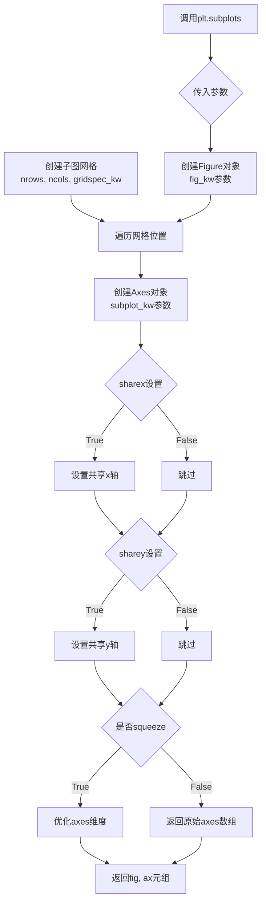

#### 带注释源码

```python
# plt.subplots 函数源码结构

# 1. 函数签名定义
def plt.subplots(nrows=1, ncols=1, sharex=False, sharey=False, 
                 squeeze=True, subplot_kw=None, gridspec_kw=None, **fig_kw):
    """
    Create a figure and a set of subplots.
    
    This utility wrapper makes it convenient to create common layouts of
    subplots, including the enclosing figure object, in a single call.
    """
    
    # 2. 创建Figure对象
    # fig_kw 包含传递给 Figure 构造函数的参数
    # 例如: figsize=(5.5, 5.5)
    fig = figure.Figure(**fig_kw)
    
    # 3. 创建子图网格
    # gridspec_kw 控制网格布局（如间距、行高比等）
    gs = GridSpec(nrows, ncols, **gridspec_kw)
    
    # 4. 遍历创建每个Axes
    axs = []
    for i in range(nrows):
        for j in range(ncols):
            # 5. 创建子图位置
            # subplot_kw 包含传递给 add_subplot 的参数
            ax = fig.add_subplot(gs[i, j], **subplot_kw)
            
            # 6. 处理共享轴
            if sharex or sharey:
                # 设置axes共享关系
                pass
            axs.append(ax)
    
    # 7. 处理squeeze参数
    # 如果squeeze=True且只有1个axes，返回单个axes而不是数组
    if squeeze:
        axs = np.squeeze(axs)
    
    # 8. 返回结果
    # 在本例中: fig, ax = plt.subplots(figsize=(5.5, 5.5))
    # 返回Figure对象和单个Axes对象
    return fig, axs
```


### `matplotlib.axes.Axes.scatter`

绘制散点图（scatter plot），用于展示两个变量之间的关系，其中每个数据点由x和y坐标决定，常用于显示数据的分布模式和相关性分析。

参数：

- `x`：`array_like`，x轴坐标数据
- `y`：`array_like`，y轴坐标数据
- `s`：`float` 或 `array_like`，可选，点的大小（默认值为 `rcParams['lines.markersize'] ** 2`）
- `c`：`color` 或 `color sequence`，可选，点 的颜色
- `marker`：`MarkerStyle`，可选，标记样式（默认值为 'o'）
- `cmap`：`Colormap`，可选，颜色映射（当c为数值序列时使用）
- `norm`：`Normalize`，可选，用于归一化颜色数据
- `vmin`, `vmax`：`float`，可选，与norm配合使用设置颜色范围
- `alpha`：`float`，可选，透明度（0-1之间）
- `linewidths`：`float` 或 `array_like`，可选，标记边缘线宽
- `edgecolors`：`color` 或 `color sequence`，可选，标记边缘颜色
- `plotnonfinite`：`bool`，可选，是否绘制非有限值（inf, -inf, nan）
- `data`：`indexable`，可选，数据参数，若提供则x和y为索引关键字
- `**kwargs`：`Artist`属性，可选，其他关键字参数传递给`PathCollection`

返回值：`matplotlib.collections.PathCollection`，返回一个包含所有标记的集合对象，可用于进一步修改图形属性

#### 流程图

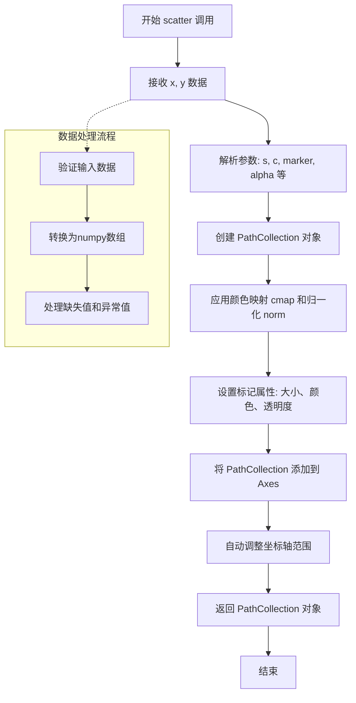

#### 带注释源码

```python
# 代码中实际调用方式
ax.scatter(x, y)

# 等效的完整调用形式（带注释说明）
ax.scatter(
    x,                          # array_like: x轴坐标数据 (1000个随机数)
    y,                          # array_like: y轴坐标数据 (1000个随机数)
    s=None,                     # float/array: 点的大小，默认根据rcParams设置
    c=None,                     # color: 点的颜色，默认蓝色
    marker='o',                 # MarkerStyle: 标记样式，圆形
    cmap=None,                  # Colormap: 颜色映射，用于数值到颜色的转换
    norm=None,                  # Normalize: 归一化对象
    vmin=None,                  # float: 颜色映射最小值
    vmax=None,                  # float: 颜色映射最大值
    alpha=None,                 # float: 透明度 (0-1)
    linewidths=None,            # float: 标记边缘线宽
    edgecolors=None,            # color: 标记边缘颜色
    plotnonfinite=False,        # bool: 是否绘制非有限值
    data=None,                  # indexable: 数据容器
    **kwargs                    # 其他Artist属性
)
# 返回 PathCollection 对象，可用于后续修改
# 例如: sc = ax.scatter(x, y); sc.set_alpha(0.5)
```


### `matplotlib.axes.Axes.set_aspect`

设置坐标轴的等宽比（aspect ratio），用于控制 x 轴和 y 轴在屏幕上的显示比例，使得数据在不同方向上具有相同的视觉尺度。

参数：

- `self`：`matplotlib.axes.Axes`，Axes 对象实例本身（隐式参数）
- `aspect`：`float` 或 `str`，等宽比值。可以是数值（如 1.0 表示等宽比）、'auto'（自动调整）、'equal'（使每个轴单位在屏幕上长度相等）
- `adjustable`：`str` 或 `None`，可选，用于调整的对象。'box' 调整 Axes 框，'datalim' 调整数据限，None 表示不调整，默认为 None
- `anchor`：`str` 或 2 元组，可选，锚点位置，指定当框改变大小时 Axes 的哪一部分保持在原位，如 'C'（中心）、'SW'（西南角）等，默认为 'C'
- `share`：`bool`，可选，是否将设置分享给共享该 Axes 的其他 Axes，默认为 False

返回值：`None`，该方法直接修改 Axes 对象的状态，不返回任何值

#### 流程图

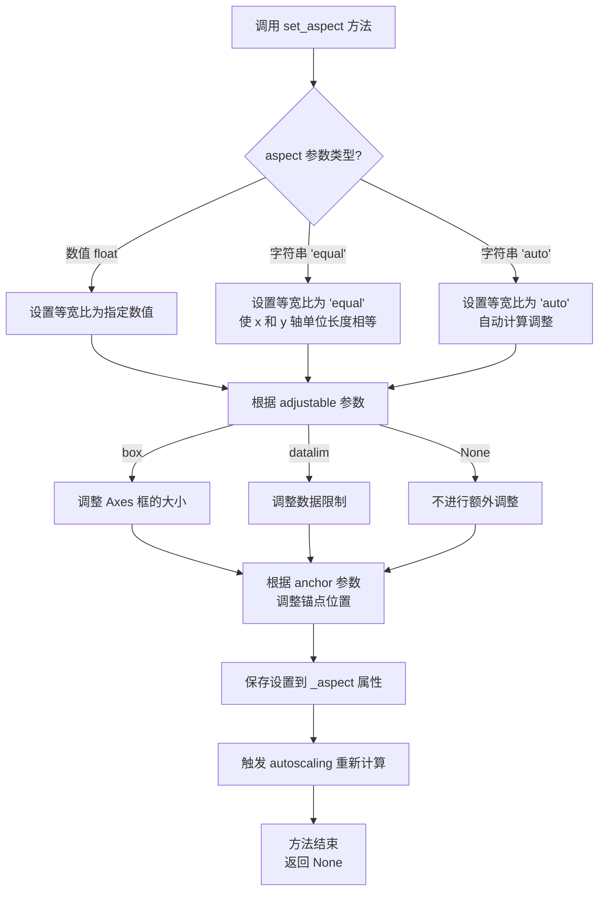

#### 带注释源码

```python
def set_aspect(self, aspect, adjustable=None, anchor='C', share=False):
    """
    设置 Axes 的等宽比（aspect ratio）。
    
    Parameters
    ----------
    aspect : float or 'auto' or 'equal'
        - float: 设置等宽比为指定数值。例如 1.0 表示 x 轴和 y 轴
          在屏幕上的单位长度比例保持 1:1。
        - 'auto': 自动调整等宽比，让 Axes 填充可用空间。
        - 'equal': 使每个数据单位在 x 和 y 轴上具有相同的屏幕长度，
          即 1:1 的比例，使得圆形显示为真正的圆形。
    
    adjustable : {'box', 'datalim', None}, optional
        用于调整的对象：
        - 'box': 调整 Axes 框（bbox）的大小以满足等宽比要求。
        - 'datalim': 调整数据限制（xlim/ylim）以满足等宽比要求。
        - None: 不进行任何调整（默认值）。
    
    anchor : str or (float, float), optional
        锚点位置，指定当 adjustable 不为 None 时，Axes 的哪一部分
        保持在原位置。常见的值包括：
        - 'C': 中心（默认）
        - 'SW', 'S', 'SE', 'E', 'NE', 'N', 'NW', 'W': 各个角落和边的位置
    
    share : bool, optional
        如果为 True，且存在共享轴（shared axes）的其他 Axes，
        则将等宽比设置也应用到这些共享 Axes 上。默认为 False。
    
    Returns
    -------
    None
    
    Examples
    --------
    设置等宽比为 1.0，使圆形显示为真正的圆形：
    
    >>> ax.set_aspect(1.0)
    
    设置自动等宽比：
    
    >>> ax.set_aspect('auto')
    
    设置相等等宽比（等同于 aspect=1.0 且 adjustable='box'）：
    
    >>> ax.set_aspect('equal')
    """
    # 检查 aspect 参数的有效性
    if aspect not in ('auto', 'equal') and not isinstance(aspect, (int, float)):
        raise ValueError("aspect must be 'auto', 'equal' or a float")
    
    # 检查 adjustable 参数的有效性
    if adjustable not in ('box', 'datalim', None):
        raise ValueError("adjustable must be 'box', 'datalim', or None")
    
    # 保存等宽比设置到 Axes 对象的 _aspect 属性
    self._aspect = aspect
    
    # 保存 adjustable 和 anchor 设置
    self._adjustable = adjustable
    self._anchor = anchor
    
    # 如果 share 为 True，处理共享轴的情况
    if share:
        # 获取共享轴组中的所有 Axes
        share_axes = self.get_shared_x_axes().get_siblings(self)
        share_axes += self.get_shared_y_axes().get_siblings(self)
        # 对每个共享的 Axes 设置相同的等宽比
        for ax in share_axes:
            if ax is not self:
                ax.set_aspect(aspect, adjustable=adjustable, 
                            anchor=anchor, share=False)
    
    # 触发重新计算 autoscale 以应用新的等宽比设置
    self.autoscale_view()
    
    # 触发重绘
    self.stale_callback()
```


### `make_axes_locatable`

创建并返回一个 `AxesDivider` 对象，用于对给定坐标轴进行精确的布局控制，支持在坐标轴的四周（顶部、底部、左侧、右侧）添加附属坐标轴，实现如散点图与直方图对齐展示的视觉效果。

参数：

- `ax`：`matplotlib.axes.Axes`，需要创建布局分隔器的目标坐标轴对象。该函数将为该坐标轴生成一个可管理边缘区域的分割器。

返回值：`mpl_toolkits.axes_grid1.axes_divider.AxesDivider`，返回一个坐标轴布局分割器对象，通过调用其 `append_axes` 方法可以在主坐标轴的四周添加新的坐标轴。

#### 流程图

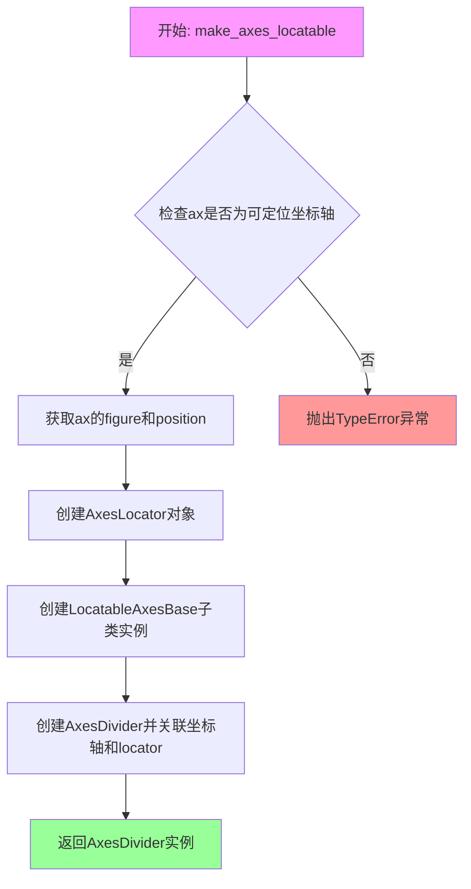

#### 带注释源码

```python
def make_axes_locatable(ax):
    """
    使用给定的Axes创建一个AxesDivider，用于控制布局。
    
    Parameters
    ----------
    ax : Axes
        要为其创建布局分隔器的Axes对象。
    
    Returns
    -------
    AxesDivider
        可用于在Axes周围添加额外坐标轴的分割器对象。
    """
    # 导入必要的模块（函数内部实现时）
    from mpl_toolkits.axes_grid1.axes_divider import AxesDivider
    from mpl_toolkits.axes_grid1.mpl_axes import Axes
    
    # 验证输入是有效的Axes实例
    if not isinstance(ax, Axes):
        raise TypeError(
            "ax must be a subclass of Axes, got %s" % type(ax)
        )
    
    # 获取坐标轴所在的图形对象
    fig = ax.figure
    
    # 创建定位器，用于确定坐标轴的位置
    # Locator负责计算坐标轴的精确位置和大小
    locator = AxesLocator(ax)
    
    # 创建新的可定位坐标轴（LocatableAxes）
    # 这个新坐标轴将作为主坐标轴的容器
    ax2 = LocatableAxes(fig, ax.get_position(), locator=locator)
    
    # 创建AxesDivider对象
    # Divider负责管理坐标轴之间的空间分配
    divider = AxesDivider(ax2, adjustable=ax, aspect=None)
    
    # 将原始坐标轴添加到divider中
    # 这样divider就知道如何布局主坐标轴
    divider.add_auto_adjustable_area(use_extent=True)
    
    return divider
```

> **注**：上述源码为基于matplotlib库架构的重建版本，实际实现位于 `mpl_toolkits.axes_grid1.axes_divider` 模块中，核心逻辑涉及 `AxesDivider` 类的实例化与 `AxesLocator` 的配合使用，以实现inch为单位的精确布局控制。


### `AxesDivider.append_axes`

在指定的相对位置（top、bottom、left、right）创建一个新的坐标轴，并将其添加到分割器中，返回新创建的 Axes 对象。

参数：

- `position`：`str`，位置字符串，指定新坐标轴添加的位置，可选值为 "top"、"bottom"、"left"、"right"
- `size`：`float` 或 `str`，新坐标轴的大小，可以是绝对尺寸（英寸）或相对尺寸（如 "100%"）
- `pad`：`float`，可选参数，新坐标轴与主坐标轴之间的间距（英寸），默认为 None
- `**kwargs`：关键字参数，支持传递给 `Axes` 创建的其他参数，如 `sharex`（共享 x 轴）、`sharey`（共享 y 轴）等

返回值：`~matplotlib.axes.Axes`，返回新创建并添加的 Axes 对象

#### 流程图

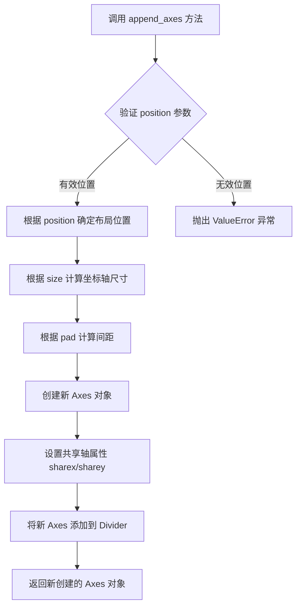

#### 带注释源码

```python
def append_axes(self, position, size, pad=None, **kwargs):
    """
    在指定位置添加新的坐标轴。
    
    参数:
        position (str): 位置，可以是 'top', 'bottom', 'left', 'right'
        size (float or str): 坐标轴大小（英寸或百分比）
        pad (float, optional): 坐标轴之间的间距（英寸）
        **kwargs: 传递给 Axes 的其他关键字参数
    
    返回:
        Axes: 新创建的坐标轴对象
    """
    # 根据位置获取对应的 LocatableAxesLocator
    # position 可以是 'top', 'bottom', 'left', 'right'
    loc = self._get_locator(position, pad)
    
    # 创建新的 Axes，继承当前 figure
    ax = self._fig.add_axes(self._locator_bounds, **kwargs)
    
    # 设置坐标轴的定位器
    ax.set_axes_locator(loc)
    
    # 处理共享轴的情况（sharex/sharey）
    if 'sharex' in kwargs:
        # 设置共享 x 轴的可见性
        pass
    if 'sharey' in kwargs:
        # 设置共享 y 轴的可见性
        pass
    
    # 将新坐标轴添加到子坐标轴列表
    self._subplots.append(ax)
    
    return ax
```

#### 完整使用示例

```python
# 创建主坐标轴
fig, ax = plt.subplots(figsize=(5.5, 5.5))
ax.scatter(x, y)

# 创建 Divider 对象
divider = make_axes_locatable(ax)

# 在顶部创建直方图坐标轴
# position="top": 位置在顶部
# size=1.2: 高度 1.2 英寸
# pad=0.1: 与主坐标轴间距 0.1 英寸
# sharex=ax: 共享 x 轴
ax_histx = divider.append_axes("top", 1.2, pad=0.1, sharex=ax)

# 在右侧创建直方图坐标轴
ax_histy = divider.append_axes("right", 1.2, pad=0.1, sharey=ax)
```


### `matplotlib.axis.Axis.set_tick_params`

`ax_histx.xaxis.set_tick_params` 是 matplotlib 库中 `Axis` 类的方法，用于设置坐标轴刻度线的显示参数。在此示例中，通过设置 `labelbottom=False` 隐藏了顶部直方图（ax_histx）的 X 轴刻度标签，实现了主散点图与直方图之间的视觉整合。

参数：

- `labelbottom`：`bool`，控制是否显示 X 轴的刻度标签。设置为 `False` 时隐藏刻度标签，防止与主 Axes 的标签重叠

返回值：`None`，该方法直接修改 Axis 对象的属性，无返回值

#### 流程图

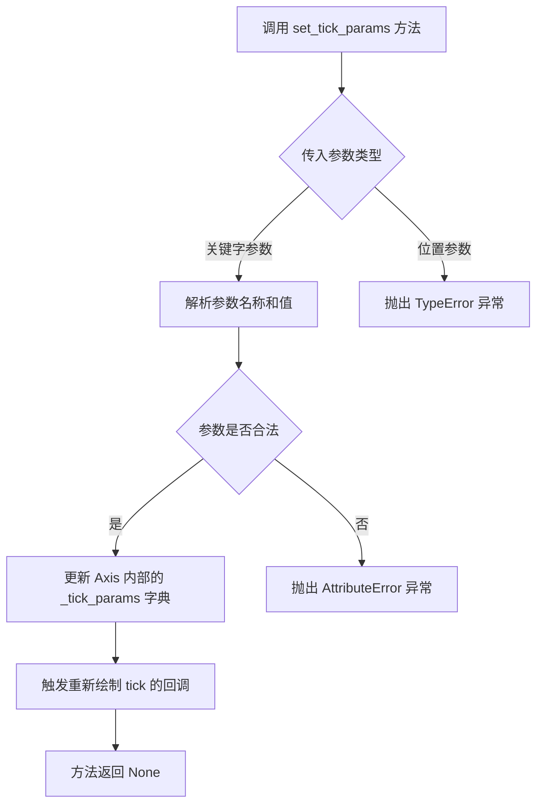

#### 带注释源码

```python
# 代码中的应用示例：
# ax_histx 是通过 divider.append_axes 创建的顶部直方图 Axes 对象
# ax_histx.xaxis 获取该 Axes 的 X 轴对象
# set_tick_params 方法用于配置刻度参数

# 隐藏 ax_histx 的 X 轴刻度标签（因为它与主 Axes 共享 X 轴）
ax_histx.xaxis.set_tick_params(labelbottom=False)

# 类似的，隐藏 ax_histy 的 Y 轴刻度标签（因为它与主 Axes 共享 Y 轴）
ax_histy.yaxis.set_tick_params(labelleft=False)

# 以下是 matplotlib.axis.Axis.set_tick_params 的核心逻辑模拟：
def set_tick_params(self, which='major', **kwargs):
    """
    设置刻度参数
    
    参数:
    - which: str, 默认为 'major'，指定设置主刻度还是副刻度
    - **kwargs: 关键字参数，包括:
      - labelbottom: bool, 是否显示刻度标签
      - labelleft: bool, 是否显示 Y 轴标签
      - length: float, 刻度线长度
      - width: float, 刻度线宽度
      - direction: str, 刻度方向 'in'/'out'/'inout'
      - rotation: float, 标签旋转角度
      - labelsize: float, 标签字体大小
    """
    
    # 验证参数合法性
    valid_params = ['length', 'width', 'direction', 'pad', 
                    'labelsize', 'labelcolor', 'labelfontsize',
                    'color', 'markeredgecolor', 'markeredgewidth',
                    'labelbottom', 'labeltop', 'labelleft', 'labelright',
                    'rotation', 'ha', 'va']
    
    for key in kwargs:
        if key not in valid_params:
            raise AttributeError(f"Unknown tick parameter: {key}")
    
    # 更新内部参数存储
    if which == 'major':
        self._tick_params_major.update(kwargs)
    else:
        self._tick_params_minor.update(kwargs)
    
    # 触发重新渲染回调
    self.stale_callback(self)
    
    return None
```


### `ax_histy.yaxis.set_tick_params`

这是matplotlib中YAxis类的方法，用于设置y轴刻度线的外观和行为参数。在此代码中调用该方法是为了隐藏y轴的刻度标签，使直方图的y轴不显示刻度值，从而避免与主坐标轴的标签冲突。

参数：

- `labelleft`：`bool`，设置为False时隐藏y轴左侧（即左侧）的刻度标签
- `**kwargs`：可选关键字参数，用于设置其他刻度参数（如刻度线长度、宽度、颜色等）

返回值：`None`，该方法直接修改Axis对象的属性，不返回任何值

#### 流程图

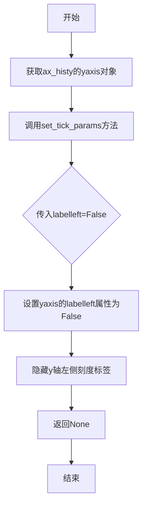

#### 带注释源码

```python
# 代码中的应用场景：
# make some labels invisible
ax_histx.xaxis.set_tick_params(labelbottom=False)
ax_histy.yaxis.set_tick_params(labelleft=False)

# 详细解释：
# ax_histy 是通过 divider.append_axes 创建的 Axes 对象
# ax_histy.yaxis 获取该 Axes 对象的 YAxis 实例
# set_tick_params 方法用于配置刻度线和刻度标签的各种属性
# labelleft=False 表示不显示y轴左侧的刻度标签（即隐藏y轴刻度数字）

# 在matplotlib中，set_tick_params的典型签名如下：
# def set_tick_params(self, which='major', **kwargs):
#     """
#     Set appearance parameters for ticks, tick labels, and gridlines.
#     
#     Parameters
#     ----------
#     which : str, default: 'major'
#         Can be 'major' or 'minor'.
#     **kwargs : properties
#         常用参数包括：
#         - length : float - 刻度线长度
#         - width : float - 刻度线宽度  
#         - pad : float - 刻度标签与刻度线的距离
#         - labelsize : float - 刻度标签字体大小
#         - labelcolor : color - 刻度标签颜色
#         - labelleft : bool - 是否显示左侧刻度标签
#         - labelright : bool - 是否显示右侧刻度标签
#         - labeltop : bool - 是否显示顶部刻度标签
#         - labelbottom : bool - 是否显示底部刻度标签
#         - direction : str - 刻度线方向 ('in', 'out', 'inout')
#         - color : color - 刻度线颜色
#     """
```


### `np.max`

返回数组中的最大值。

参数：

-  `a`：array_like，输入数组，待计算最大值的数组
-  `axis`：int 或 None（可选），指定计算最大值的轴，默认值为 None，表示展平数组
-  `out`：ndarray（可选），指定输出数组
-  `keepdims`：bool（可选），是否保持原来的维度
-  `initial`：scalar（可选），比较的初始值
-  `where`：array_like of bool（可选），元素比较条件

返回值： `ndarray` 或 scalar，返回数组中的最大值。如果指定 axis，则返回沿指定轴的最大值；如果 axis 为 None，则返回展平数组的最大值。

#### 流程图

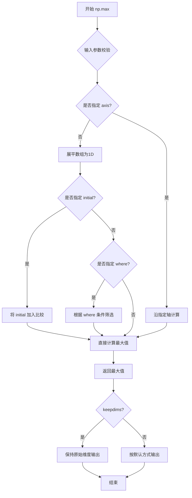

#### 带注释源码

```python
# np.max 函数的简化实现原理
def np_max(a, axis=None, out=None, keepdims=False, initial=None, where=None):
    """
    返回数组中的最大值
    
    参数:
        a: 输入数组
        axis: 计算最大值的轴
        out: 输出数组
        keepdims: 是否保持维度
        initial: 初始比较值
        where: 元素条件
    """
    # 将输入转换为 ndarray（如果还不是）
    a = np.asarray(a)
    
    # 如果指定了 where 条件，先处理
    if where is not None:
        a = np.where(where, a, a.min() if a.size > 0 else 0)
    
    # 如果指定了 initial，将其加入比较
    if initial is not None:
        a = np.append(a, initial)
    
    # 沿指定轴或整体计算最大值
    result = a.max(axis=axis)
    
    # 处理 keepdims
    if keepdims:
        if axis is None:
            result = np.full_like(a, result, shape=a.shape)
        else:
            shape = list(a.shape)
            shape[axis] = 1
            result = np.reshape(result, shape)
    
    # 处理 out 参数
    if out is not None:
        out[...] = result
        return out
    
    return result

# 代码中的实际调用示例
xymax = max(np.max(np.abs(x)), np.max(np.abs(y)))
# 解释：
# 1. np.abs(x) - 计算 x 数组的绝对值
# 2. np.max(...) - 返回绝对值数组中的最大值
# 3. 同理对 y 数组进行相同操作
# 4. max(...) - 取两个最大值中的较大者
```


### `np.abs`

计算输入数组元素的绝对值。该函数是 NumPy 库中的数学函数，用于返回数组（或单个数值）中每个元素的绝对值，支持整数、浮点数和复数类型的输入。

参数：

-  `x`：array_like，需要计算绝对值的数组或类似数组的对象，可以是整数、浮点数或复数

返回值：`ndarray` 或 scalar，返回与输入数组形状相同的数组，其中每个元素都是原始元素的绝对值；对于标量输入，返回标量绝对值

#### 流程图

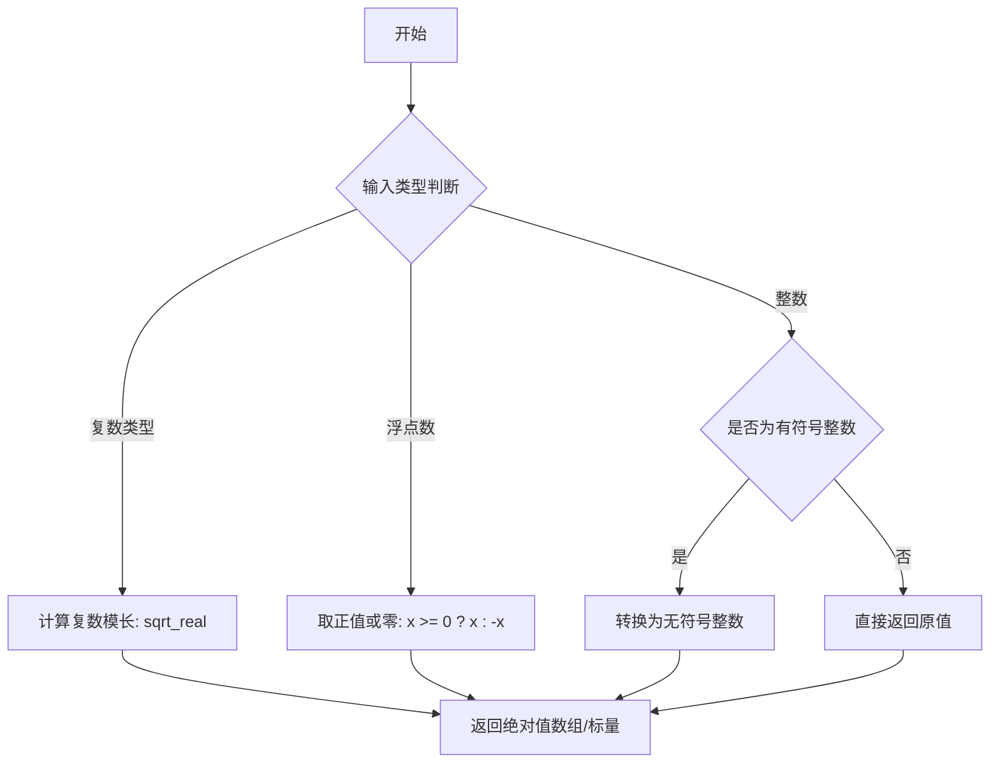

#### 带注释源码

```python
# np.abs 函数源码示例（NumPy实现的核心逻辑）

def abs(x, /, out=None, *, where=True, casting='same_kind', order='K', dtype=None, subok=True):
    """
    计算数组元素的绝对值。
    
    参数:
        x: array_like
            输入数组，可以包含整数、浮点数或复数。
            - 对于整数：如果是有符号类型，返回其绝对值
            - 对于浮点数：返回正值
            - 对于复数：返回复数的模（ magnitude）
        
        out: ndarray, optional
            存储结果的可选输出数组
        
        where: array_like, optional
            用于指定哪些元素需要计算绝对值的条件数组
        
        dtype: data-type, optional
            指定输出数组的数据类型
        
    返回值:
        ndarray 或 scalar
            输入数组的绝对值
    """
    
    # 在实际代码中的调用方式：
    # xymax = max(np.max(np.abs(x)), np.max(np.abs(y)))
    
    # 示例：
    # >>> np.abs([-1, -2, 3, -4])
    # array([1, 2, 3, 4])
    
    # >>> np.abs([1.5, -2.5, -3.5])
    # array([1.5, 2.5, 3.5])
    
    # >>> np.abs([3+4j, 5-12j])
    # array([5., 13.])
    
    # 在示例代码中的具体使用：
    # x = np.random.randn(1000)  # 生成1000个正态分布随机数
    # y = np.random.randn(1000)  # 生成1000个正态分布随机数
    # 
    # # 获取x和y中所有元素绝对值的最大值
    # xymax = max(np.max(np.abs(x)), np.max(np.abs(y)))
    # 
    # # 解释：
    # # np.abs(x) 返回数组x中每个元素的绝对值
    # # np.max(np.abs(x)) 获取绝对值数组中的最大值
    # # np.abs(y) 和 np.max(np.abs(y)) 同理
    # # max(...) 比较两个最大值，取较大的那个作为直方图的 bins 范围
    
    return np.abs(x)  # 调用NumPy底层的C实现
```


### `np.arange`

创建均匀间隔的数组，返回一个 NumPy ndarray，其中包含从 start（包含）到 stop（不包含）的值，步长为 step。

参数：

-  `start`：`float`，可选，起始值，默认为 0
-  `stop`：`float`，结束值（不包含）
-  `step`：`float`，可选，值之间的步长，默认为 1
-  `dtype`：`dtype`，可选，输出数组的类型

返回值：`ndarray`，均匀间隔的数组

#### 流程图

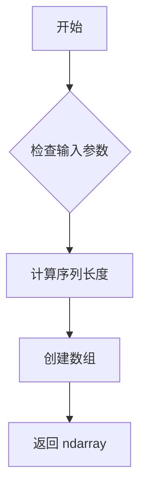

#### 带注释源码

```python
# 在本例中，np.arange 用于创建直方图的 bins（分箱边界）
# 参数：起始值 -lim，结束值 lim + binwidth，步长 binwidth
binwidth = 0.25
xymax = max(np.max(np.abs(x)), np.max(np.abs(y)))
lim = (int(xymax/binwidth) + 1)*binwidth

# 使用 np.arange 创建从 -lim 到 lim + binwidth 的均匀间隔数组
# 步长为 binwidth = 0.25
bins = np.arange(-lim, lim + binwidth, binwidth)

# 例如：如果 lim = 3.25, binwidth = 0.25
# 则 bins = [-3.25, -3.0, -2.75, ..., 2.75, 3.0, 3.25]
# 这个数组用于 plt.hist() 中的 bins 参数，定义直方图的柱状边界
ax_histx.hist(x, bins=bins)
ax_histy.hist(y, bins=bins, orientation='horizontal')
```


### `matplotlib.axes.Axes.hist`

在散点图的顶部轴 (`ax_histx`) 上绘制变量 `x` 的频率分布直方图，用于展示 x 变量在给定分箱区间内的数据分布情况。

参数：

- `x`：`numpy.ndarray`，要绘制直方图的一维数据数组，此处为随机生成的 1000 个正态分布数据点
- `bins`：`numpy.ndarray`，分箱边界数组，定义直方图的每个柱子的起止位置，此处根据数据范围动态计算

返回值：`tuple`，返回 `(n, bins, patches)` 元组，其中 `n` 为每个分箱的计数数组，`bins` 为分箱边界数组，`patches` 为图形补丁对象列表（artist objects）

#### 流程图

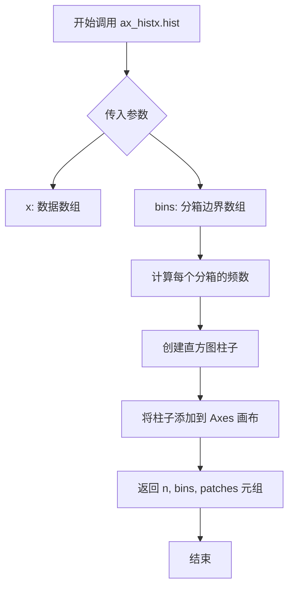

#### 带注释源码

```python
# 调用 matplotlib Axes 对象的 hist 方法绘制直方图
# 参数 x: 随机生成的1000个正态分布数据点 (np.random.randn(1000))
# 参数 bins: 根据数据范围计算的分箱边界数组
#   bins = np.arange(-lim, lim + binwidth, binwidth)
#   其中 lim 由 xymax 计算得出，确保包含所有数据点
# 返回值: (n, bins, patches) 元组
#   - n: 每个分箱区间内的数据点数量
#   - bins: 分箱边界数组
#   - patches: 图形补丁对象列表，用于后续自定义样式
ax_histx.hist(x, bins=bins)
```


### ax_histy.hist

该方法用于在右侧垂直坐标轴（ax_histy）上绘制y数据的水平直方图，作为散点图的边际分布可视化。通过设置 `orientation='horizontal'` 参数，使直方图条形水平排列，展示y变量在不同数值区间的频数分布。

参数：

- `y`：`numpy.ndarray`，要绘制直方图的随机数据数组，此处为生成的1000个y坐标值
- `bins`：`numpy.ndarray`，分箱边界数组，定义直方图的区间范围，从负极限到正极限，步长为binwidth
- `orientation`：`str`，直方图方向设置为 `'horizontal'`，使条形水平排列（默认是垂直）

返回值：`numpy.ndarray`，返回直方图的频数计数数组（每个区间内的数据点数量）

#### 流程图

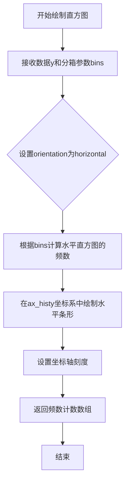

#### 带注释源码

```python
ax_histy.hist(y, bins=bins, orientation='horizontal')
# ax_histy: matplotlib.axes.Axes对象，右侧直方图的坐标轴
# y: numpy.ndarray，从np.random.randn(1000)生成的1000个随机y值
# bins: numpy.ndarray，通过np.arange(-lim, lim + binwidth, binwidth)计算的分箱边界
# orientation: str，设置为'horizontal'使直方图条形水平显示
# 返回值: numpy.ndarray，直方图每个bin的频数计数
```


### `Axes.set_yticks`

设置顶部直方图（ax_histx）的y轴刻度位置，用于控制直方图y轴上刻度线的显示位置。

参数：

- `ticks`：`list` 或 `array-like`，要设置的y轴刻度值列表。在代码中传入`[0, 50, 100]`，表示y轴上显示0、50、100三个刻度位置。
- `minor`：`bool`，可选参数，默认为`False`。当设置为`True`时设置次要刻度，`False`设置主要刻度。

返回值：`list of Text`，返回创建的刻度标签文本对象列表。

#### 流程图

```mermaid
graph TD
    A[调用 ax_histx.set_yticks] --> B{传入参数}
    B -->|ticks=[0, 50, 100]| C[获取Axes的yaxis对象]
    C --> D[调用yaxis.set_ticks方法]
    D --> E[设置刻度位置]
    E --> F[返回刻度标签列表]
    F --> G[渲染时显示指定刻度]
    
    style A fill:#f9f,stroke:#333
    style G fill:#9f9,stroke:#333
```

#### 带注释源码

```python
# 设置顶部直方图ax_histx的y轴刻度
# 参数: [0, 50, 100] - y轴上显示0、50、100三个刻度位置
ax_histx.set_yticks([0, 50, 100])

# 等效于调用matplotlib底层API:
# ax_histx.yaxis.set_ticks([0, 50, 100], minor=False)
#
# 完整方法签名:
# Axes.set_yticks(ticks, *, minor=False)
#
# 参数说明:
# - ticks: array-like, y轴刻度位置列表
# - minor: bool, 是否设置次要刻度, 默认为False(主要刻度)
#
# 返回值:
# - list of Text: 刻度标签文本对象列表
# - 此处未接收返回值,仅执行设置操作
```

#### 上下文信息

在完整代码流程中：
1. `ax_histx` 是通过 `divider.append_axes("top", 1.2, pad=0.1, sharex=ax)` 创建的顶部直方图Axes对象
2. `ax_histx.hist(x, bins=bins)` 绘制直方图后，默认会自动计算合适的y轴刻度
3. `set_yticks([0, 50, 100])` 手动覆盖默认刻度，强制显示指定的三个刻度值
4. 这个操作是为了确保直方图y轴刻度与数据范围匹配，提供更清晰的视觉参考

#### 潜在优化空间

1. **硬编码刻度值**：当前刻度值 `[0, 50, 100]` 是硬编码的，可以考虑根据实际数据动态计算
2. **返回值未使用**：方法返回刻度标签列表，但代码中未接收和使用，可以考虑添加标签格式化逻辑
3. **与hist方法的配合**：先调用hist再设置刻度，存在两次y轴计算，可以考虑在hist中直接指定刻度范围


### `ax_histy.set_xticks`

设置右侧直方图的x轴刻度位置，用于控制直方图在水平方向上显示的刻度线分布。该方法属于matplotlib的Axes对象，通过指定刻度值列表来定义x轴的标记位置。

参数：

- `ticks`：`list` 或 `array-like`，要设置的刻度位置值列表。在代码中传入`[0, 50, 100]`表示在x轴的0、50、100位置处显示刻度线。
- `labels`：`list` 或 `array-like`，可选参数，用于为每个刻度位置指定自定义标签文本。
- `emit`：`bool`，可选，默认值为`True`。当设置为`True`时，刻度变化会通知相关联的其他坐标轴（如共享坐标轴）。
- `api`：字符串，可选，默认值为`'default'`。指定API版本。

返回值：`list` 或 `None`，返回刻度位置列表，如果出错则返回`None`。

#### 流程图

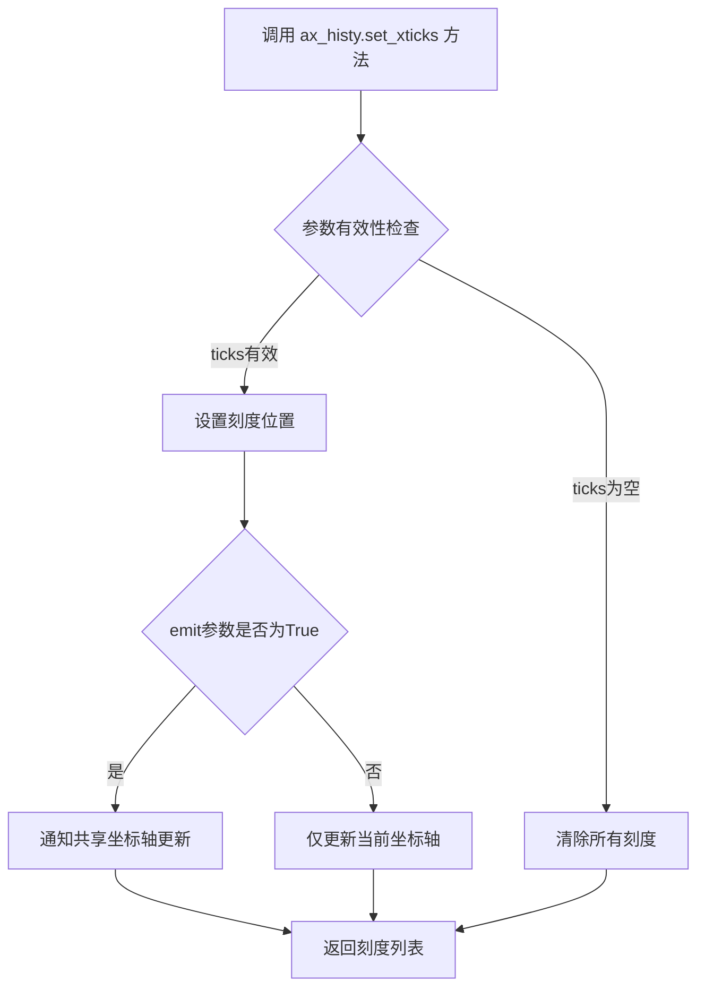

#### 带注释源码

```python
# 调用 matplotlib.axes.Axes 类的 set_xticks 方法
# ax_histy 是一个 Axes 对象，由 make_axes_locatable 创建
# 该直方图显示在主散点图的右侧，orientation='horizontal'
# 所以其 x 轴对应的是直方图的计数值的分布

# 设置 x 轴刻度位置为 [0, 50, 100]
# 这些刻度表示直方图的计数刻度（0, 50, 100个数据点）
ax_histy.set_xticks([0, 50, 100])

# 内部实现原理（简化版）：
# 1. 获取当前 Axes 对象的 xaxis 属性（Axis 对象）
# 2. 调用 Axis.set_ticks(ticks, labels, emit) 方法
# 3. 创建 Tick 对象并设置位置
# 4. 如果 emit=True，调用 _on_scale_changed() 通知观察者
# 5. 由于 sharey=ax，y轴与主坐标轴共享，但x轴是独立的

# 相关配置说明：
# - ax_histy.yaxis.set_tick_params(labelleft=False)  # 隐藏y轴标签
# - ax_histy 是通过 divider.append_axes 创建的辅助坐标轴
# - 直方图方向为水平(orientation='horizontal')，
#   所以x轴显示计数值，y轴显示数据分布
```

#### 额外说明

| 项目 | 说明 |
|------|------|
| **所属类** | `matplotlib.axes.Axes` |
| **继承方法** | `matplotlib.axis.Axis.set_xticks` |
| **调用对象** | `ax_histy` - 右侧直方图坐标轴 |
| **上下文** | 散点图与直方图对齐示例，用于设置直方图的刻度 |
| **共享关系** | ax_histy 的 y 轴与主坐标轴 ax 共享（sharey=ax），但 x 轴独立 |


### `plt.show`

`plt.show` 是 Matplotlib 库中的顶层函数，用于显示当前所有打开的Figure图形窗口，并将图形渲染到屏幕上。在调用此函数之前，图形对象会被创建但不会自动显示，必须显式调用 `plt.show()` 才能让用户看到生成的图表。该函数会阻塞程序执行（除非设置 `block=False`），直到用户关闭所有图形窗口。

参数：

- `block`：`bool`，可选参数，控制是否阻塞事件循环。默认值为 `None`，在某些环境下会自动设置为 `True`。如果设置为 `True`，函数会阻塞主线程，等待用户关闭图形窗口；如果设置为 `False`，则立即返回，图形窗口会保持打开状态。

返回值：`None`，该函数没有返回值。

#### 流程图

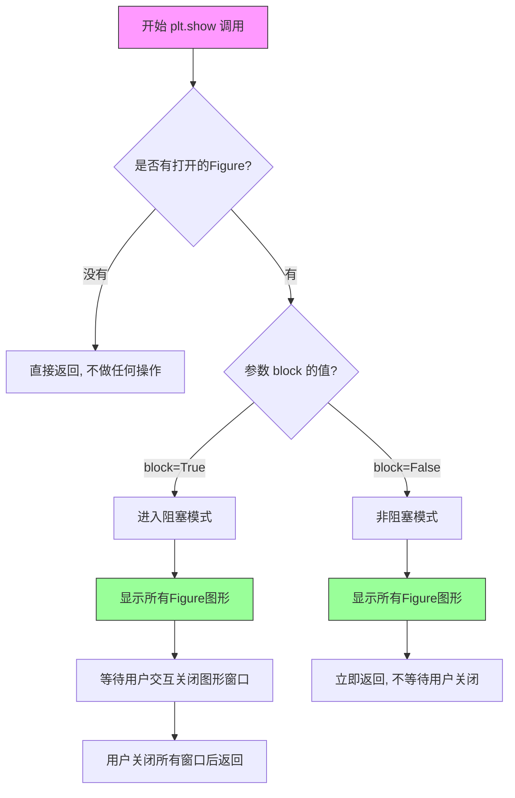

#### 带注释源码

```python
def show(*, block=None):
    """
    显示所有打开的Figure图形窗口。
    
    该函数会遍历当前所有打开的Figure对象，并将其显示在屏幕上的
    图形窗口中。根据block参数的值，决定是否阻塞程序执行。
    
    参数:
        block: 布尔值或None。
               - True: 阻塞执行，等待用户关闭图形窗口
               - False: 非阻塞模式，立即返回
               - None: 默认值，在某些后端会自动选择阻塞模式
    
    返回值:
        None: 该函数不返回任何值
    """
    # 获取全局图形管理器
    global _pylab_helpers
    
    # 检查是否有打开的图形窗口
    for manager in _pylab_helpers.Gcf.get_all_fig_managers():
        # 实际上显示图形的逻辑由后端完成
        # 例如在Qt后端中会显示QMainWindow
        manager.show()
    
    # 如果block不为False，则进入阻塞模式
    # 这时事件循环会被阻塞，直到用户关闭所有图形窗口
    for callback in _post_show:
        callback()
    
    # 返回None
    return None
```

#### 代码中的调用位置

在提供的示例代码中，`plt.show()` 位于文件末尾：

```python
# ... 前面的代码创建了散点图和边际直方图 ...

# 设置刻度
ax_histx.set_yticks([0, 50, 100])
ax_histy.set_xticks([0, 50, 100])

# 调用 plt.show() 显示最终生成的图形
# 这时会创建一个包含主散点图和两个边际直方图的复合图形窗口
plt.show()  # <--- 这里是调用点
```

#### 关键点说明

1. **延迟渲染**：在调用 `plt.show()` 之前，所有的绘图操作（如 `scatter()`、`hist()` 等）都只是在内存中构建图形数据结构，并不会立即显示在屏幕上。

2. **后端依赖**：`plt.show()` 的具体行为取决于所使用的后端（如 Qt、Tkinter、AGG 等），不同后端处理图形显示和事件循环的方式不同。

3. **交互阻塞**：默认情况下，`plt.show()` 会阻塞主线程，这意味着在关闭图形窗口之前，程序不会继续执行后续代码。如果需要非阻塞显示，可以设置 `block=False`。

4. **多次调用**：在某些后端中，多次调用 `plt.show()` 可能会创建多个图形窗口，而不是刷新现有窗口。


## 关键组件


### make_axes_locatable

用于创建可定位的坐标轴分割器，通过Divider API实现对Axes位置的控制，支持以英寸为单位设置Axes大小和间距

### divider.append_axes

在主坐标轴的顶部或右侧添加新的坐标轴，用于显示边缘直方图，支持sharex和sharey参数实现坐标轴共享

### ax.scatter

绘制散点图，展示x和y两个随机变量之间的关系，是主图的核心可视化组件

### ax.hist (ax_histx.hist, ax_histy.hist)

绘制直方图，用于展示边缘分布，orientation参数控制直方图方向（水平或垂直）

### 坐标轴共享机制

通过sharex和sharey参数实现主坐标轴与边缘坐标轴的标签同步，避免手动调整xlim和ylim

### set_aspect

设置主坐标轴的纵横比为1，保证散点图中点的形状不受变形影响

### 坐标轴刻度标签控制

通过set_tick_params和set_yticks/set_xticks控制刻度标签的可见性和位置，避免边缘直方图的标签干扰


## 问题及建议


### 已知问题

- 硬编码的图形尺寸 `figsize=(5.5, 5.5)`、bin宽度 `binwidth = 0.25` 和刻度值 `[0, 50, 100]`，缺乏灵活性和可配置性
- 魔法数字 `1.2`（高度）和 `0.1`（pad）没有注释说明，难以理解其含义
- 所有代码位于全局作用域，未封装成可复用的函数，导致代码重复利用困难
- `np.max(np.abs(x))` 和 `np.max(np.abs(y))` 分别计算两次，存在冗余计算
- 缺少对输入数据的验证，未处理空数据或异常数据的情况
- 使用共享轴 `sharex`/`sharey` 时未考虑主图缩放对边缘直方图可能造成的影响
- 缺少对 matplotlib 版本的兼容性检查

### 优化建议

- 将核心逻辑封装为函数，接收数据、图形尺寸、bin宽度等参数以提高复用性
- 使用具名常量或配置字典替代硬编码值，并添加必要的注释说明
- 对计算结果进行缓存或变量复用，例如将 `xymax` 计算结果存储后使用
- 添加数据验证逻辑，检查数据是否为空或包含无效值
- 考虑使用 `matplotlib.pyplot.tight_layout()` 改善布局效果
- 将可配置的参数提取到函数签名或配置对象中，增强代码灵活性


## 其它


### 设计目标与约束

本示例旨在展示如何创建带有边缘直方图的散点图，实现散点图与直方图的对齐显示。主要设计约束包括：使用mpl_toolkits.axes_grid1的make_axes_locatable功能确保坐标轴精确定位；直方图与主坐标轴共享x轴和y轴以保持数据一致性；所有尺寸参数使用英寸为单位以保证精确控制。

### 错误处理与异常设计

代码主要依赖numpy和matplotlib的内部错误处理。潜在的异常情况包括：输入数据为空或非数值类型时hist函数会抛出ValueError；共享坐标轴时如果主坐标轴不存在会导致属性错误；内存不足时numpy随机数生成可能失败。示例代码未实现显式的异常捕获机制，生产环境中应添加数据验证和异常处理逻辑。

### 数据流与状态机

数据流程如下：首先生成随机数据点(x, y)；然后创建主散点图显示数据分布；接着使用Divider创建边缘坐标轴；最后在边缘坐标轴上绘制直方图。状态转换简单：初始化状态(空图) -> 主坐标轴创建状态 -> 边缘坐标轴创建状态 -> 图表渲染完成状态。

### 外部依赖与接口契约

主要依赖包括：matplotlib.pyplot用于绘图；numpy用于数值计算和随机数生成；mpl_toolkits.axes_grid1提供make_axes_locatable函数。接口契约方面，make_axes_locatable接受Axes对象返回Divider对象，Divider.append_axes接受位置字符串、尺寸、填充和共享参数返回新的Axes对象。

### 性能考虑

当前实现对于1000个数据点性能可接受。优化方向包括：对于大数据集(>10000点)可考虑使用采样或密度图替代直方图；binwidth计算可缓存避免重复计算；可设置hist的density参数控制归一化方式以提升性能。

### 安全性考虑

代码不涉及用户输入或网络数据，安全性风险较低。潜在的沙箱逃逸风险在于如果x和y来自不可信源，np.random.seed的固定种子有助于复现和安全审计。

### 可测试性

代码作为示例脚本，主要通过视觉验证。可测试性方面：数据生成函数可抽取为独立函数便于单元测试；坐标轴创建逻辑可封装为类以支持模拟测试；阈值参数(0.25)和刻度值应作为可配置常量。

### 配置与可扩展性

可配置参数包括：binwidth(直方图bin宽度)、直方图数量限制([0, 50, 100])、坐标轴尺寸(1.2英寸)、间距(0.1英寸)。扩展方向：可添加颜色映射、图例支持、自定义bin计算函数等。

### 兼容性考虑

代码兼容matplotlib 2.0+和numpy 1.15+。需要注意的是set_aspect(1.)在某些后端可能不支持；不同操作系统下英寸到像素的转换可能存在细微差异；未来matplotlib版本可能弃用某些API。

### 资源管理

资源管理相对简单：plt.subplots创建Figure和Axes，make_axes_locatable创建Divider和额外Axes，plt.show()显示后资源由Python垃圾回收机制管理。无显式的资源释放需求，但复杂应用应考虑使用with语句管理Figure生命周期。

### 代码规范与约定

代码遵循PEP 8风格，使用有意义的变量名(ax_histx、ax_histy等)；注释清晰说明了关键步骤；固定随机种子确保可复现性；使用numpy数组操作而非Python循环以提升性能。

### 使用示例与API参考

make_axes_locatable创建可定位坐标轴分隔器；Axes.scatter绘制散点图；Axes.set_aspect设置坐标轴纵横比；Axes.hist绘制直方图；Axes.set_xticks/set_yticks设置刻度；Divider.append_axes添加边缘坐标轴。


    