# `matplotlib\galleries\examples\axes_grid1\simple_anchored_artists.py` 详细设计文档

This code demonstrates the use of matplotlib's anchored helper classes to draw text, circles, and sizebars in a figure with specific anchor positions.

## 整体流程

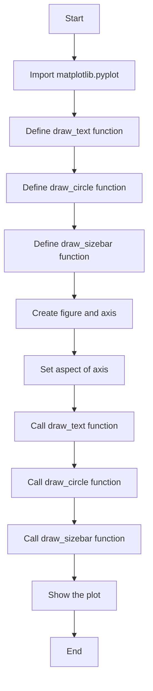

## 类结构

```
matplotlib.pyplot (Module)
├── draw_text (Function)
│   ├── from matplotlib.offsetbox import AnchoredText
│   └── at = AnchoredText(...)
│       └── ax.add_artist(at)
├── draw_circle (Function)
│   ├── from matplotlib.patches import Circle
│   └── ada = AnchoredDrawingArea(...)
│       └── ax.add_artist(ada)
├── draw_sizebar (Function)
│   ├── from mpl_toolkits.axes_grid1.anchored_artists import AnchoredSizeBar
│   └── asb = AnchoredSizeBar(...)
│       └── ax.add_artist(asb)
└── plt.subplots() (Function)
```

## 全局变量及字段


### `fig`
    
The main figure object where all plots are drawn.

类型：`matplotlib.figure.Figure`
    


### `ax`
    
The axes object where the plots are drawn within the figure.

类型：`matplotlib.axes._subplots.AxesSubplot`
    


### `AnchoredText.loc`
    
The location of the anchored text.

类型：`str`
    


### `AnchoredText.prop`
    
The properties of the text, such as font size and color.

类型：`dict`
    


### `AnchoredText.frameon`
    
Whether to draw a frame around the text.

类型：`bool`
    


### `AnchoredText.bbox_to_anchor`
    
The bounding box to anchor the text to.

类型：`tuple`
    


### `AnchoredText.bbox_transform`
    
The transform for the bounding box.

类型：`matplotlib.transforms.Transform`
    


### `Circle.center`
    
The center of the circle in axis coordinates.

类型：`tuple`
    


### `Circle.radius`
    
The radius of the circle.

类型：`float`
    


### `AnchoredDrawingArea.width`
    
The width of the drawing area.

类型：`int`
    


### `AnchoredDrawingArea.height`
    
The height of the drawing area.

类型：`int`
    


### `AnchoredDrawingArea.loc`
    
The location of the anchored drawing area.

类型：`str`
    


### `AnchoredDrawingArea.pad`
    
The padding around the drawing area.

类型：`float`
    


### `AnchoredDrawingArea.frameon`
    
Whether to draw a frame around the drawing area.

类型：`bool`
    


### `AnchoredSizeBar.transData`
    
The transform for the size bar in data coordinates.

类型：`matplotlib.transforms.Transform`
    


### `AnchoredSizeBar.length`
    
The length of the size bar in data coordinates.

类型：`float`
    


### `AnchoredSizeBar.label`
    
The label under the size bar.

类型：`str`
    


### `AnchoredSizeBar.loc`
    
The location of the anchored size bar.

类型：`str`
    


### `AnchoredSizeBar.pad`
    
The padding around the size bar.

类型：`float`
    


### `AnchoredSizeBar.borderpad`
    
The padding around the border of the size bar.

类型：`float`
    


### `AnchoredSizeBar.sep`
    
The separation between the size bar and the label.

类型：`float`
    


### `AnchoredSizeBar.frameon`
    
Whether to draw a frame around the size bar.

类型：`bool`
    
    

## 全局函数及方法


### draw_text(ax)

该函数在给定的轴（axis）上绘制两个文本框，文本框分别锚定于图的上左角的不同角落。

参数：

- `ax`：`matplotlib.axes.Axes`，轴对象，用于在轴上绘制文本框。

返回值：无

#### 流程图

```mermaid
graph LR
A[Start] --> B{draw_text()}
B --> C[End]
```

#### 带注释源码

```python
def draw_text(ax):
    """
    Draw two text-boxes, anchored by different corners to the upper-left
    corner of the figure.
    """
    from matplotlib.offsetbox import AnchoredText
    at = AnchoredText("Figure 1a",
                      loc='upper left', prop=dict(size=8), frameon=True,
                      )
    at.patch.set_boxstyle("round,pad=0.,rounding_size=0.2")
    ax.add_artist(at)

    at2 = AnchoredText("Figure 1(b)",
                       loc='lower left', prop=dict(size=8), frameon=True,
                       bbox_to_anchor=(0., 1.),
                       bbox_transform=ax.transAxes
                       )
    at2.patch.set_boxstyle("round,pad=0.,rounding_size=0.2")
    ax.add_artist(at2)
```


### draw_circle

Draw a circle in axis coordinates.

参数：

- `ax`：`matplotlib.axes.Axes`，The axes on which to draw the circle.

返回值：`None`，No return value, the circle is drawn directly on the axes.

#### 流程图

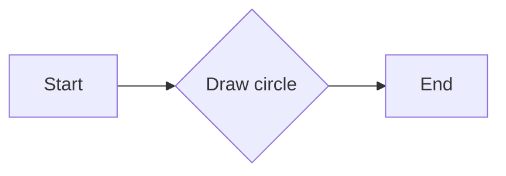

#### 带注释源码

```python
def draw_circle(ax):
    """
    Draw a circle in axis coordinates
    """
    from matplotlib.patches import Circle
    from mpl_toolkits.axes_grid1.anchored_artists import AnchoredDrawingArea
    ada = AnchoredDrawingArea(20, 20, 0, 0,
                              loc='upper right', pad=0., frameon=False)
    p = Circle((10, 10), 10)
    ada.da.add_artist(p)
    ax.add_artist(ada)
```


### draw_sizebar

Draw a horizontal bar with length of 0.1 in data coordinates, with a fixed label underneath.

参数：

- `ax`：`matplotlib.axes.Axes`，The axes on which to draw the sizebar.

返回值：`None`，No return value, the function modifies the given axes object.

#### 流程图

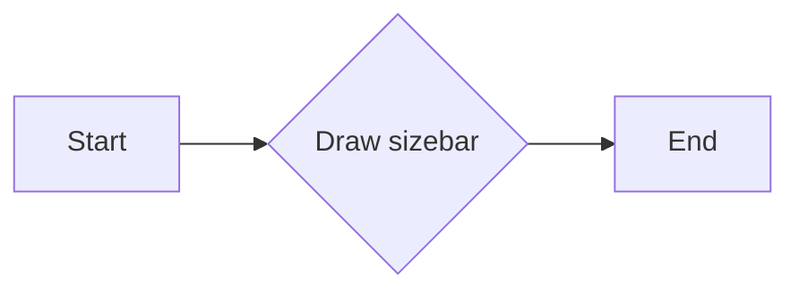

#### 带注释源码

```python
def draw_sizebar(ax):
    """
    Draw a horizontal bar with length of 0.1 in data coordinates,
    with a fixed label underneath.
    """
    from mpl_toolkits.axes_grid1.anchored_artists import AnchoredSizeBar
    asb = AnchoredSizeBar(ax.transData,
                          0.1,
                          r"1$^{\prime}$",
                          loc='lower center',
                          pad=0.1, borderpad=0.5, sep=5,
                          frameon=False)
    ax.add_artist(asb)
```


### plt.subplots

`plt.subplots` 是一个用于创建一个或多个子图的函数。

参数：

- `figsize`：`tuple`，指定整个图形的大小（宽度和高度），单位为英寸。
- `dpi`：`int`，指定图形的分辨率，单位为每英寸点数。
- `ncols`：`int`，指定子图的列数。
- `nrows`：`int`，指定子图的行数。
- `sharex`：`bool`，指定是否共享所有子图的x轴。
- `sharey`：`bool`，指定是否共享所有子图的y轴。
- `fig`：`matplotlib.figure.Figure`，如果提供，则使用该图形而不是创建一个新的图形。
- `gridspec_kw`：`dict`，传递给`GridSpec`的额外关键字参数。
- `constrained_layout`：`bool`，指定是否启用`constrained_layout`。

返回值：`matplotlib.figure.Figure`，包含子图的图形对象。

#### 流程图

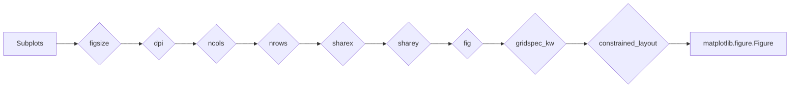

#### 带注释源码

```
fig, ax = plt.subplots(figsize=(5, 4), dpi=100, ncols=1, nrows=1, sharex=False, sharey=False, fig=None, gridspec_kw=None, constrained_layout=False)
```


### AnchoredText.__init__

初始化AnchoredText对象，用于在matplotlib图形中添加锚定文本。

参数：

- `text`：`str`，要显示的文本内容。
- `loc`：`str`，文本的定位位置，可以是'upper left', 'lower left', 'upper right', 'lower right', 'center left', 'center right', 'center', 'upper center', 'lower center'等。
- `prop`：`dict`，文本属性的字典，如字体大小、颜色等。
- `frameon`：`bool`，是否显示文本框。
- `bbox_to_anchor`：`tuple`，用于定位文本框的锚点位置。
- `bbox_transform`：`transform`，用于转换文本框的坐标。

返回值：无

#### 流程图

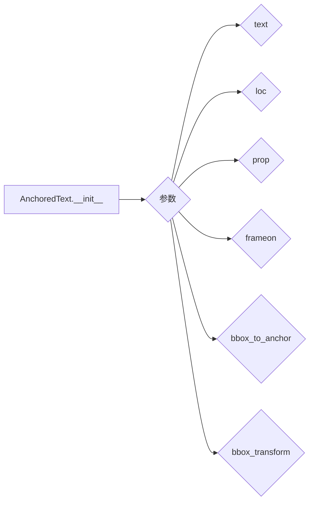

#### 带注释源码

```python
from matplotlib.offsetbox import AnchoredText

class AnchoredText:
    def __init__(self, text, loc='upper left', prop=dict(size=8), frameon=True,
                 bbox_to_anchor=(0., 1.), bbox_transform=None):
        # 初始化AnchoredText对象
        # ...
```


### draw_text(ax)

该函数在给定的轴（axis）上绘制两个文本框，文本框通过不同的角落锚定到图的上左角。

参数：

- `ax`：`matplotlib.axes.Axes`，轴对象，用于在图上绘制文本框。

返回值：无

#### 流程图

```mermaid
graph LR
A[Start] --> B{draw_text()}
B --> C[End]
```

#### 带注释源码

```python
def draw_text(ax):
    """
    Draw two text-boxes, anchored by different corners to the upper-left
    corner of the figure.
    """
    from matplotlib.offsetbox import AnchoredText
    at = AnchoredText("Figure 1a",
                      loc='upper left', prop=dict(size=8), frameon=True,
                      )
    at.patch.set_boxstyle("round,pad=0.,rounding_size=0.2")
    ax.add_artist(at)

    at2 = AnchoredText("Figure 1(b)",
                       loc='lower left', prop=dict(size=8), frameon=True,
                       bbox_to_anchor=(0., 1.),
                       bbox_transform=ax.transAxes
                       )
    at2.patch.set_boxstyle("round,pad=0.,rounding_size=0.2")
    ax.add_artist(at2)
```


### draw_text(ax)

该函数在给定的轴（axis）上绘制两个文本框，文本框通过不同的角落锚定到图的上左角。

参数：

- `ax`：`matplotlib.axes.Axes`，轴对象，用于在图上绘制文本框。

返回值：无

#### 流程图

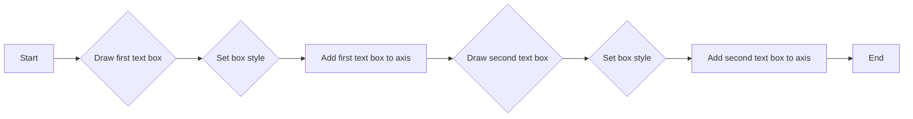

#### 带注释源码

```python
def draw_text(ax):
    """
    Draw two text-boxes, anchored by different corners to the upper-left
    corner of the figure.
    """
    from matplotlib.offsetbox import AnchoredText
    at = AnchoredText("Figure 1a",
                      loc='upper left', prop=dict(size=8), frameon=True,
                      )
    at.patch.set_boxstyle("round,pad=0.,rounding_size=0.2")
    ax.add_artist(at)

    at2 = AnchoredText("Figure 1(b)",
                       loc='lower left', prop=dict(size=8), frameon=True,
                       bbox_to_anchor=(0., 1.),
                       bbox_transform=ax.transAxes
                       )
    at2.patch.set_boxstyle("round,pad=0.,rounding_size=0.2")
    ax.add_artist(at2)
```


### draw_text(ax)

该函数在给定的轴（axis）上绘制两个文本框，这些文本框通过不同的角落锚定到图的上左角。

参数：

- `ax`：`matplotlib.axes.Axes`，轴对象，用于在图上绘制文本框。

返回值：无

#### 流程图

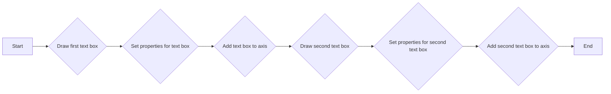

#### 带注释源码

```python
def draw_text(ax):
    """
    Draw two text-boxes, anchored by different corners to the upper-left
    corner of the figure.
    """
    from matplotlib.offsetbox import AnchoredText
    at = AnchoredText("Figure 1a",
                      loc='upper left', prop=dict(size=8), frameon=True,
                      )
    at.patch.set_boxstyle("round,pad=0.,rounding_size=0.2")
    ax.add_artist(at)

    at2 = AnchoredText("Figure 1(b)",
                       loc='lower left', prop=dict(size=8), frameon=True,
                       bbox_to_anchor=(0., 1.),
                       bbox_transform=ax.transAxes
                       )
    at2.patch.set_boxstyle("round,pad=0.,rounding_size=0.2")
    ax.add_artist(at2)
```


### Circle.__init__

Circle 类的构造函数，用于初始化一个圆形对象。

参数：

- `center`：`(float, float)`，圆心的坐标，表示为(x, y)。
- `radius`：`float`，圆的半径。

返回值：`None`，构造函数不返回值。

#### 流程图

```mermaid
classDiagram
    Circle
    Class Diagram for Circle
    Circle <|-- Circle(center: float, radius: float)
```

#### 带注释源码

```
from matplotlib.patches import Circle

class Circle(Circle):
    def __init__(self, center, radius):
        # 初始化父类Circle
        super().__init__(center, radius)
        # 这里可以添加自定义的初始化代码
```

由于提供的代码中没有直接展示 Circle 类的完整定义，以上流程图和源码是基于假设 Circle 类继承自 matplotlib.patches 中的 Circle 类。实际的 Circle 类可能包含更多的字段和方法。


### draw_circle(ax)

该函数用于在轴坐标中绘制一个圆形。

参数：

- `ax`：`matplotlib.axes.Axes`，轴对象，用于绘制圆形。

返回值：无

#### 流程图

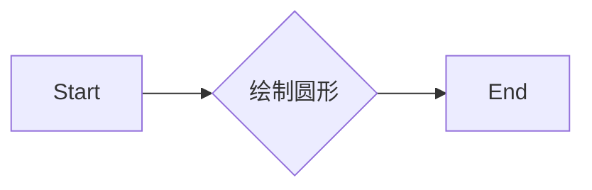

#### 带注释源码

```python
def draw_circle(ax):
    """
    Draw a circle in axis coordinates
    """
    from matplotlib.patches import Circle
    from mpl_toolkits.axes_grid1.anchored_artists import AnchoredDrawingArea
    ada = AnchoredDrawingArea(20, 20, 0, 0,
                              loc='upper right', pad=0., frameon=False)
    p = Circle((10, 10), 10)  # 创建一个圆形，中心在(10, 10)，半径为10
    ada.da.add_artist(p)  # 将圆形添加到锚定绘图区域
    ax.add_artist(ada)  # 将锚定绘图区域添加到轴对象
```


### AnchoredDrawingArea.__init__

AnchoredDrawingArea is a class used to create a drawing area that can be anchored to a specific location in an axes object.

参数：

- `self`：`AnchoredDrawingArea`对象本身。
- `width`：`int`，绘制区域的宽度。
- `height`：`int`，绘制区域的高度。
- `x`：`int`，绘制区域相对于锚点在x轴上的偏移量。
- `y`：`int`，绘制区域相对于锚点在y轴上的偏移量。
- `loc`：`str`，锚点位置，可以是'upper left', 'upper right', 'lower left', 'lower right'等。
- `pad`：`float`，绘制区域与锚点之间的填充距离。
- `frameon`：`bool`，是否显示边框。

返回值：无

#### 流程图

```mermaid
classDiagram
    class AnchoredDrawingArea {
        int width
        int height
        int x
        int y
        str loc
        float pad
        bool frameon
    }
    AnchoredDrawingArea :-- :has: matplotlib.axes.Axes
    AnchoredDrawingArea :-- :has: matplotlib.patches.Circle
    AnchoredDrawingArea :-- :has: matplotlib.offsetbox.AnchoredText
    AnchoredDrawingArea :-- :has: matplotlib.offsetbox.AnchoredSizeBar
```

#### 带注释源码

```
from matplotlib.offsetbox import AnchoredDrawingArea
from matplotlib.patches import Circle

def draw_circle(ax):
    ada = AnchoredDrawingArea(20, 20, 0, 0,
                              loc='upper right', pad=0., frameon=False)
    p = Circle((10, 10), 10)
    ada.da.add_artist(p)
    ax.add_artist(ada)
```


### draw_circle(ax)

该函数在轴坐标中绘制一个圆。

参数：

- `ax`：`matplotlib.axes.Axes`，轴对象，用于绘制圆。

返回值：无

#### 流程图

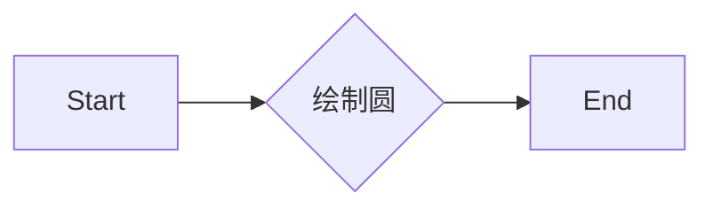

#### 带注释源码

```python
def draw_circle(ax):
    """
    Draw a circle in axis coordinates
    """
    from matplotlib.patches import Circle
    from mpl_toolkits.axes_grid1.anchored_artists import AnchoredDrawingArea
    ada = AnchoredDrawingArea(20, 20, 0, 0,
                              loc='upper right', pad=0., frameon=False)
    p = Circle((10, 10), 10)
    ada.da.add_artist(p)
    ax.add_artist(ada)
```


### AnchoredSizeBar.__init__

初始化AnchoredSizeBar对象，用于在matplotlib中创建一个固定长度的水平条形，并带有标签。

参数：

- `ax`：`matplotlib.axes.Axes`，轴对象，用于添加条形。
- `length`：`float`，条形的长度，以数据坐标为单位。
- `label`：`str`，条形下方的标签。
- `loc`：`str`，条形的位置，例如'lower center'。
- `pad`：`float`，条形与轴边缘的距离。
- `borderpad`：`float`，条形边框与轴边缘的距离。
- `sep`：`float`，条形与标签之间的距离。
- `frameon`：`bool`，是否显示条形的边框。

返回值：无

#### 流程图

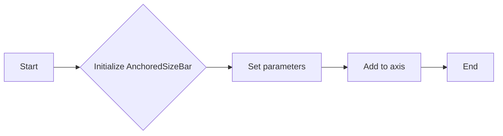

#### 带注释源码

```python
from mpl_toolkits.axes_grid1.anchored_artists import AnchoredSizeBar

def draw_sizebar(ax):
    """
    Draw a horizontal bar with length of 0.1 in data coordinates,
    with a fixed label underneath.
    """
    asb = AnchoredSizeBar(ax.transData,
                          0.1,
                          r"1$^{\prime}$",
                          loc='lower center',
                          pad=0.1, borderpad=0.5, sep=5,
                          frameon=False)
    ax.add_artist(asb)
```


### draw_sizebar(ax)

该函数用于在轴（axis）上绘制一个水平条形，条形长度为0.1个数据坐标单位，并在其下方有一个固定的标签。

参数：

- `ax`：`matplotlib.axes.Axes`，轴对象，用于在轴上绘制条形。

返回值：无

#### 流程图

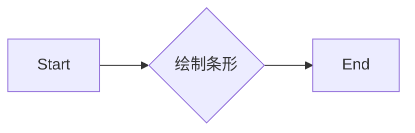

#### 带注释源码

```python
def draw_sizebar(ax):
    """
    Draw a horizontal bar with length of 0.1 in data coordinates,
    with a fixed label underneath.
    """
    from mpl_toolkits.axes_grid1.anchored_artists import AnchoredSizeBar
    asb = AnchoredSizeBar(ax.transData,
                          0.1,
                          r"1$^{\prime}$",
                          loc='lower center',
                          pad=0.1, borderpad=0.5, sep=5,
                          frameon=False)
    ax.add_artist(asb)
```


## 关键组件


### 张量索引与惰性加载

张量索引与惰性加载是用于在计算过程中延迟计算，直到实际需要结果时才进行计算，从而提高效率。

### 反量化支持

反量化支持是指代码能够处理非整数类型的量化，例如浮点数，以便在量化过程中保持精度。

### 量化策略

量化策略是指将高精度数据转换为低精度数据的方法，通常用于减少模型大小和加速推理过程。


## 问题及建议


### 已知问题

-   **全局变量和函数使用**：代码中使用了全局变量 `fig` 和 `ax`，这可能导致代码的可重用性和可维护性降低。全局变量和函数的使用应该尽量避免，除非有充分的理由。
-   **代码重复**：`draw_text`、`draw_circle` 和 `draw_sizebar` 函数中都有类似的代码用于添加艺术家的元素到轴上。可以考虑将这些重复的代码抽象成一个通用的函数。
-   **文档注释**：虽然代码中包含了函数的文档字符串，但缺少了模块级别的文档字符串，这不利于其他开发者理解整个模块的功能和目的。

### 优化建议

-   **避免全局变量**：将 `fig` 和 `ax` 作为参数传递给函数，而不是使用全局变量。
-   **代码重构**：创建一个通用的函数来添加艺术家元素到轴上，减少代码重复。
-   **添加模块文档**：为模块添加一个模块级别的文档字符串，描述模块的功能、用途和如何使用。
-   **异常处理**：在函数中添加异常处理，确保在出现错误时能够优雅地处理异常，并提供有用的错误信息。
-   **代码测试**：编写单元测试来验证函数的行为，确保代码的稳定性和可靠性。
-   **性能优化**：如果这些函数被频繁调用，可以考虑性能优化，例如使用缓存来存储重复计算的结果。


## 其它


### 设计目标与约束

- 设计目标：实现一个简单的图形绘制工具，用于在matplotlib中添加文本、圆形和尺寸条。
- 约束条件：不使用matplotlib的axes_grid1工具包中的anchored_artists模块。

### 错误处理与异常设计

- 错误处理：在函数中添加异常处理机制，确保在出现错误时能够给出清晰的错误信息。
- 异常设计：定义自定义异常类，用于处理特定的错误情况。

### 数据流与状态机

- 数据流：数据从matplotlib的轴对象（Axes）开始，通过调用不同的绘制函数，将文本、圆形和尺寸条添加到轴上。
- 状态机：没有明确的状态机，但绘制函数根据输入参数和轴对象的状态执行相应的绘制操作。

### 外部依赖与接口契约

- 外部依赖：依赖于matplotlib库中的matplotlib.pyplot、matplotlib.offsetbox和mpl_toolkits.axes_grid1模块。
- 接口契约：绘制函数的接口定义了输入参数和返回值，确保了函数的可用性和一致性。


    