# `matplotlib\galleries\examples\axes_grid1\simple_axes_divider1.py` 详细设计文档

这是一个matplotlib示例代码，演示了如何使用axes_grid1工具包中的Divider和Size类来创建具有固定或可缩放尺寸的复杂轴布局，并配合固定间距（padding）实现精确的图形排版。

## 整体流程

```mermaid
graph TD
    A[开始] --> B[导入依赖库]
    B --> C[定义label_axes辅助函数]
    C --> D[创建第一个Figure: 固定轴尺寸]
    D --> E[定义水平尺寸列表 horiz]
    E --> F[定义垂直尺寸列表 vert]
    F --> G[创建Divider对象]
    G --> H[使用div.new_locator创建定位器]
    H --> I[通过fig.add_axes添加多个轴]
    I --> J[创建第二个Figure: 可缩放轴尺寸]
    J --> K[定义水平尺寸列表 horiz (含Size.Scaled)]
    K --> L[定义垂直尺寸列表 vert (含Size.Scaled)]
    L --> M[创建Divider对象]
    M --> N[使用div.new_locator创建定位器]
    N --> O[通过fig.add_axes添加多个轴]
    O --> P[调用plt.show显示图形]
```

## 类结构

```
matplotlib.pyplot (plt)
├── Figure
│   └── add_axes()
│   └── suptitle()
└── mpl_toolkits.axes_grid1
    ├── Divider
    │   └── new_locator()
    └── Size
        ├── Fixed (内部类)
        └── Scaled (内部类)
```

## 全局变量及字段


### `fig`
    
Matplotlib Figure对象，表示整个图形窗口

类型：`matplotlib.figure.Figure`
    


### `horiz`
    
水平方向上的尺寸列表，定义了网格列的宽度（固定或可缩放）

类型：`list[Size]`
    


### `vert`
    
垂直方向上的尺寸列表，定义了网格行的高度（固定或可缩放）

类型：`list[Size]`
    


### `rect`
    
定义Axes初始位置的元组(left, bottom, width, height)

类型：`tuple(float, float, float, float)`
    


### `div`
    
Divider对象，用于管理网格布局和定位器

类型：`mpl_toolkits.axes_grid1.divider.Divider`
    


### `ax1`
    
第一个Axes对象，位于网格左上角(nx=0, ny=0)

类型：`matplotlib.axes.Axes`
    


### `ax2`
    
第二个Axes对象，位于网格左下角(nx=0, ny=2)

类型：`matplotlib.axes.Axes`
    


### `ax3`
    
第三个Axes对象，位于网格右下角(nx=2, ny=2)

类型：`matplotlib.axes.Axes`
    


### `ax4`
    
第四个Axes对象，位于网格底部中间(nx=2到4, ny=0)

类型：`matplotlib.axes.Axes`
    


    

## 全局函数及方法


### `label_axes`

该函数用于在Axes对象的中心位置放置文本标签，并通过关闭坐标轴刻度线和刻度标签来创建一个简洁的标签显示效果，常用于在图表中标识各个子图。

参数：

- `ax`：`matplotlib.axes.Axes`，Matplotlib的Axes对象，用于接收要进行标签处理的坐标轴实例
- `text`：`str`，要在坐标轴中心显示的文本内容

返回值：`None`，该函数不返回任何值，仅执行副作用操作

#### 流程图

```mermaid
flowchart TD
    A[开始 label_axes] --> B[接收参数 ax 和 text]
    B --> C[调用 ax.text 在中心位置添加文本]
    C --> D[设置 text 参数: 位置(.5, .5), transform=ax.transAxes]
    C --> E[设置对齐方式: 水平和垂直居中]
    D --> F[调用 ax.tick_params 移除刻度]
    F --> G[设置 bottom=False 隐藏下刻度]
    F --> H[设置 labelbottom=False 隐藏下刻度标签]
    F --> I[设置 left=False 隐藏左刻度]
    F --> J[设置 labelleft=False 隐藏左刻度标签]
    G --> K[结束函数]
```

#### 带注释源码

```python
def label_axes(ax, text):
    """Place a label at the center of an Axes, and remove the axis ticks."""
    # 使用Axes对象的text方法在中心位置添加文本
    # 参数 .5, .5 表示相对位置（0-1范围内的中心点）
    # transform=ax.transAxes 指定使用轴坐标系（相对于轴的坐标）
    # horizontalalignment 和 verticalalignment 确保文本在中心对齐
    ax.text(.5, .5, text, transform=ax.transAxes,
            horizontalalignment="center", verticalalignment="center")
    
    # 使用tick_params关闭坐标轴的刻度线和刻度标签
    # bottom=False: 隐藏底部刻度线
    # labelbottom=False: 隐藏底部刻度标签
    # left=False: 隐藏左侧刻度线
    # labelleft=False: 隐藏左侧刻度标签
    ax.tick_params(bottom=False, labelbottom=False,
                   left=False, labelleft=False)
```


### `plt.figure`

创建并返回一个 Figure 对象，用于容纳绘图元素。该函数是 matplotlib 中创建新图形窗口的入口，支持自定义图形尺寸、背景色、分辨率等属性。

#### 参数

- `figsize`：`tuple of (float, float)`，可选，图形宽度和高度，以英寸为单位，默认为 `(6.4, 4.8)`
- `dpi`：`int`，可选，每英寸点数（分辨率），默认为 `100`
- `facecolor`：`str` 或 `tuple`，可选，图形背景颜色，默认为 `'white'`
- `edgecolor`：`str` 或 `tuple`，可选，图形边框颜色，默认为 `'white'`
- `frameon`：`bool`，可选，是否显示边框，默认为 `True`
- `figlabel`：`str`，可选，图形标签（用于文档目的）
- `num`：`int`、`str` 或 `None`，可选，图形编号或窗口标题，默认为自动编号
- `constrained_layout`：`bool`，可选，是否使用约束布局，默认为 `False`
- `tight_layout`：`bool` 或 `dict`，可选，是否使用紧凑布局，默认为 `False`
- `subplotpars`：`dict`，可选，子图参数配置

#### 返回值

- `figure`：`matplotlib.figure.Figure`，新创建或激活的 Figure 对象

#### 流程图

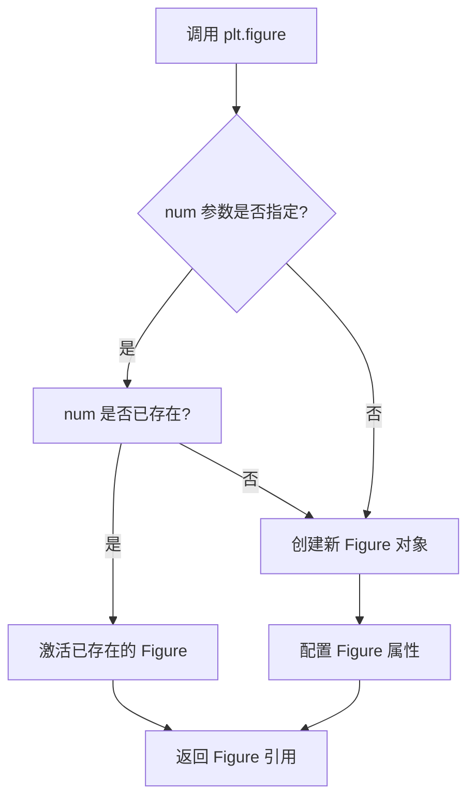

#### 带注释源码

```python
def figure(
    figsize=None,      # 图形尺寸 (宽, 高)，单位英寸
    dpi=None,           # 分辨率，每英寸像素数
    facecolor=None,    # 背景颜色
    edgecolor=None,    # 边框颜色
    frameon=True,      # 是否显示边框
    figlabel=None,     # 图形标签
    num=None,          # 图形编号或窗口标题
    constrained_layout=False,  # 约束布局
    tight_layout=False,        # 紧凑布局
    subplotpars=None,          # 子图参数
):
    """
    创建一个新的 Figure 对象。
    
    参数:
        figsize: 图形尺寸 (width, height)，单位英寸
        dpi: 分辨率
        facecolor: 背景颜色
        edgecolor: 边框颜色
        frameon: 是否绘制边框
        figlabel: 图形标签
        num: 图形编号，用于标识或复用已有图形
        constrained_layout: 是否启用约束布局
        tight_layout: 是否启用紧凑布局
        subplotpars: 子图参数
    
    返回:
        Figure: 新创建或激活的 Figure 对象
    """
    # 获取当前全局 Figure 管理器
    manager = _pylab_helpers.Gcf.get_fig_manager(num)
    
    if manager is not None:
        # 如果指定 num 的图形已存在，则激活并返回该图形
        if get_numfig():
            fig = manager.canvas.figure
            # 更新图形属性
            fig.set_size_inches(figsize)
            return fig
        else:
            # 强制创建新图形
            manager.destroy()
            manager = None
    
    # 创建新的 Figure 对象
    fig = Figure(
        figsize=figsize,
        dpi=dpi,
        facecolor=facecolor,
        edgecolor=edgecolor,
        frameon=frameon,
        FigureClass=Figure,
        **kwargs
    )
    
    # 配置布局
    if constrained_layout:
        fig.set_constrained_layout(True)
    elif tight_layout:
        fig.set_tight_layout(True)
    
    # 创建图形管理器
    manager = _pylab_helpers.Gcf.register_backend(
        fig, get_backend(), num
    )
    
    return fig
```


### `plt.show`

`plt.show` 是 matplotlib.pyplot 模块中的一个函数，用于显示所有当前打开的图形窗口，并阻止程序执行直到用户关闭所有图形（在阻塞模式下）。

参数：

-  `*`：星号参数，表示不接受位置参数，只接受关键字参数
-  `block`：`bool`，可选参数，控制是否阻塞程序执行直到图形关闭。默认为 `None`（在交互模式下不阻塞，否则阻塞）

返回值：`None`，该函数无返回值

#### 流程图

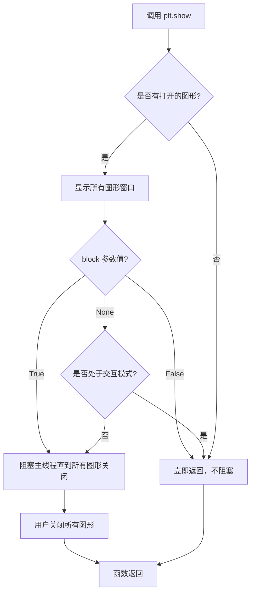

#### 带注释源码

```python
def show(*, block=None):
    """
    显示所有打开的图形窗口。
    
    参数:
        block: bool, optional
            如果为 True，阻塞程序直到所有图形窗口关闭。
            如果为 False，立即返回，不阻塞。
            如果为 None（默认值），则在交互模式下不阻塞，否则阻塞。
            
    返回值:
        None
        
    示例:
        >>> import matplotlib.pyplot as plt
        >>> plt.plot([1, 2, 3], [4, 5, 6])
        >>> plt.show()  # 显示图形并阻塞
    """
    # 获取全局显示后端管理器
    _backend_mod = matplotlib.get_backend()
    
    # 如果没有打开的图形，直接返回
    if len(allnums) == 0:
        return
    
    # 如果 block 为 None，根据交互模式决定是否阻塞
    if block is None:
        # 检查是否处于交互式环境（如 IPython、Jupyter 等）
        block = matplotlib.is_interactive()
    
    # 对于某些后端（如 Qt、Tkinter 等），需要调用 show_block 函数
    # 该函数会进入事件循环，等待用户交互
    for manager in Gcf.get_all_fig_managers():
        # 调用后端的 show 方法
        manager.show()
    
    # 如果 block 为 True，进入阻塞状态
    if block:
        # 阻止程序退出，等待用户关闭图形
        # 通常通过进入主事件循环来实现
        import io
        sys.stdout.flush()
        
        # 等待所有图形窗口关闭
        while len(Gcf.get_all_fig_managers()) > 0:
            # 阻塞等待，通常调用后端的处理事件方法
            # 对于某些后端，这里会调用 sleep 或类似机制
            pass
    
    return None
```

**注意**：实际的 `plt.show()` 实现位于 matplotlib 的后端处理代码中，源码较为复杂且依赖具体的后端实现（如 Qt、Tkinter、MacOSX 等）。上述源码为概念性展示，说明了其核心逻辑流程。


### `Figure.add_axes`

`fig.add_axes` 是 Matplotlib 中 Figure 类的方法，用于在图形中添加一个新的 Axes（坐标轴）对象。该方法接受一个 rect 参数定义 Axes 的位置和大小，并可选择性地接受 axes_locator 参数来设置定位器。

参数：

- `rect`：`tuple`，定义 Axes 的位置和大小，格式为 (left, bottom, width, height)，取值范围为 0 到 1（相对于 figure 的比例）
- `axes_locator`：`matplotlib.axes_locator.AxesLocator`，可选参数，用于指定 Axes 的定位器

返回值：`matplotlib.axes.Axes`，返回创建的 Axes 对象

#### 流程图

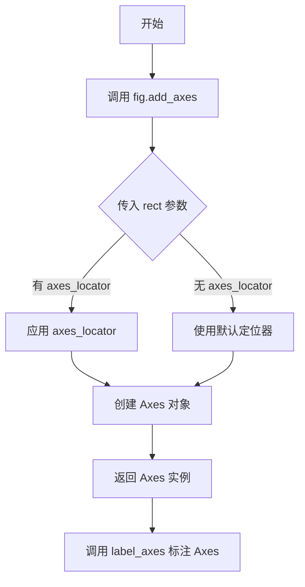

#### 带注释源码

```python
# matplotlib/figure.py 中的 add_axes 方法简化版本
def add_axes(self, rect, projection=None, polar=False, frameon=True, 
             sharex=None, sharey=None, label='', xscale=None, yscale=None,
             box_aspect=None, **kwargs):
    """
    添加一个 Axes 到 figure 中。
    
    参数:
    rect : sequence of 4 floats
        [left, bottom, width, height] in figure coordinates.
        0 <= left, bottom <= 1, 0 < width, height <= 1
    
    projection : str, optional
        投影类型，如 'rectilinear', 'polar' 等
    
    polar : bool, optional
        是否使用极坐标投影
    
    frameon : bool, optional
        是否显示边框
    
    sharex, sharey : Axes, optional
        共享 x/y 轴的 Axes
    
    Returns:
    axes : Axes
        新创建的 Axes 对象
    """
    # 创建 Axes 对象
    ax = self._add_axes_internal(rect, **kwargs)
    
    # 设置投影
    if projection is not None:
        ax.set_projection(projection)
    if polar:
        ax.set_theta_zero_location('E')
    
    return ax
```

```python
# 代码中的实际调用示例
# 固定大小的 Axes
ax1 = fig.add_axes(rect, axes_locator=div.new_locator(nx=0, ny=0))

# 参数说明：
# rect = (0.1, 0.1, 0.8, 0.8)  # 左边距10%，下边距10%，宽度80%，高度80%
# axes_locator=div.new_locator(nx=0, ny=0)  # 使用 Divider 创建的定位器
```


### `Figure.suptitle`

该方法用于在图形的顶部居中添加总标题（Super Title），是 matplotlib 中 Figure 类的成员方法，用于为整个图形设置统一的标题。

参数：

- `s`：`str`，要显示的标题文本内容
- `x`：`float`，标题的 x 轴相对位置（默认为 0.5，即水平居中）
- `y`：`float`，标题的 y 轴相对位置（默认为 0.98，靠近顶部）
- `ha`：`str`，水平对齐方式，可选 'center'、'left'、'right'（默认为 'center'）
- `va`：`str`，垂直对齐方式，可选 'top'、'center'、'bottom'、'baseline'（默认为 'top'）
- `fontsize`：`int` 或 `str`，字体大小，可为数字或如 'small'、'large' 等字符串
- `fontweight`：`int` 或 `str`，字体粗细，可为数字或如 'bold'、'normal' 等字符串
- `color`：`str`，标题文本颜色
- `**kwargs`：其他传递给 matplotlib.text.Text 的关键字参数

返回值：`matplotlib.text.Text`，返回创建的标题文本对象，可用于后续自定义修改

#### 流程图

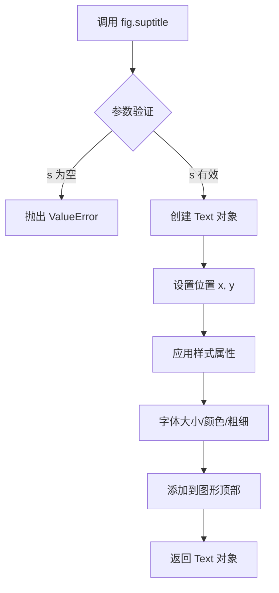

#### 带注释源码

```python
# 代码中的实际调用示例：

# 第一次调用：创建第一个图形的总标题
fig.suptitle("Fixed axes sizes, fixed paddings")

# 第二次调用：创建第二个图形的总标题
fig.suptitle("Scalable axes sizes, fixed paddings")

# 上述调用等同于完整的参数形式：
fig.suptitle(
    s="Fixed axes sizes, fixed paddings",  # 标题文本
    # x=0.5,      # 默认水平居中
    # y=0.98,     # 默认靠近顶部
    # ha='center', # 默认水平居中
    # va='top',    # 默认顶部对齐
    # fontsize=rcParams['axes.titlesize'],  # 使用默认字体大小
    # fontweight=rcParams['axes.titleweight']  # 使用默认字体粗细
)

# 该方法返回 Text 对象，可用于后续操作：
# title = fig.suptitle("Example")
# title.set_fontsize(16)
# title.set_color('red')
```


### `label_axes`

在Axes的中心位置放置文本标签，并关闭坐标轴刻度显示。

参数：

- `ax`：`matplotlib.axes.Axes`，要进行标签操作的Axes对象
- `text`：`str`，要显示的标签文本内容

返回值：`None`，该函数无返回值，直接修改传入的Axes对象

#### 流程图

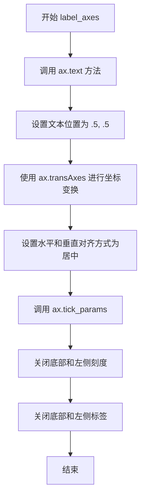

#### 带注释源码

```python
def label_axes(ax, text):
    """Place a label at the center of an Axes, and remove the axis ticks."""
    # 使用ax.text方法在Axes中心放置标签
    # .5, .5 表示相对于Axes尺寸的归一化位置（50%位置）
    # transform=ax.transAxes 指定使用Axes坐标系（0-1）
    # horizontalalignment="center" 水平居中对齐
    # verticalalignment="center" 垂直居中对齐
    ax.text(.5, .5, text, transform=ax.transAxes,
            horizontalalignment="center", verticalalignment="center")
    
    # 配置Axes的刻度参数
    # bottom=False, labelbottom=False 隐藏底部刻度和刻度标签
    # left=False, labelleft=False 隐藏左侧刻度和刻度标签
    ax.tick_params(bottom=False, labelbottom=False,
                   left=False, labelleft=False)
```

#### 补充说明

该函数是示例代码中的辅助工具函数，主要用于：
1. 在给定的Axes中心位置显示文本标签
2. 隐藏坐标轴的刻度线和刻度标签，使展示效果更加简洁

在实际matplotlib开发中，此类函数常用于创建图例框、状态指示或调试信息显示等场景。


### `Axes.tick_params`

设置刻度线和刻度标签的外观参数。该方法允许用户自定义刻度线的显示、刻度标签的显示、刻度方向、刻度长度、刻度宽度、刻度颜色、标签字体大小、标签字体属性等众多参数。

参数：

- `axis`：`{'x', 'y', 'both'}`，指定要修改的轴，默认为 'both'
- `which`：`{'major', 'minor', 'both'}`，指定要修改的刻度类型，默认为 'major'
- `reset`：`bool`，如果为 True，则在应用其他参数之前重置为默认值，默认为 False
- `bottom`：`bool`，是否显示底部刻度线
- `top`：`bool`，是否显示顶部刻度线
- `left`：`bool`，是否显示左侧刻度线
- `right`：`bool`，是否显示右侧刻度线
- `labelbottom`：`bool`，是否显示底部刻度标签
- `labeltop`：`bool`，是否显示顶部刻度标签
- `labelleft`：`bool`，是否显示左侧刻度标签
- `labelright`：`bool`，是否显示右侧刻度标签
- `length`：`float`，刻度线长度（以点为单位）
- `width`：`float`，刻度线宽度（以点为单位）
- `color`：`str` 或 `list`，刻度线颜色
- `pad`：`float`，刻度标签与刻度线之间的间距（以点为单位）
- `labelsize`：`float`，刻度标签字体大小
- `labelcolor`：`str` 或 `color`，刻度标签颜色
- `gridOn`：`bool`，是否显示网格线
- `tick1On`：`bool`，是否显示第一个刻度线
- `tick2On`：`bool`，是否显示第二个刻度线
- `label1On`：`bool`，是否显示第一个刻度标签
- `label2On`：`bool`，是否显示第二个刻度标签

返回值：`None`，此方法直接修改 Axes 对象的属性，不返回任何值

#### 流程图

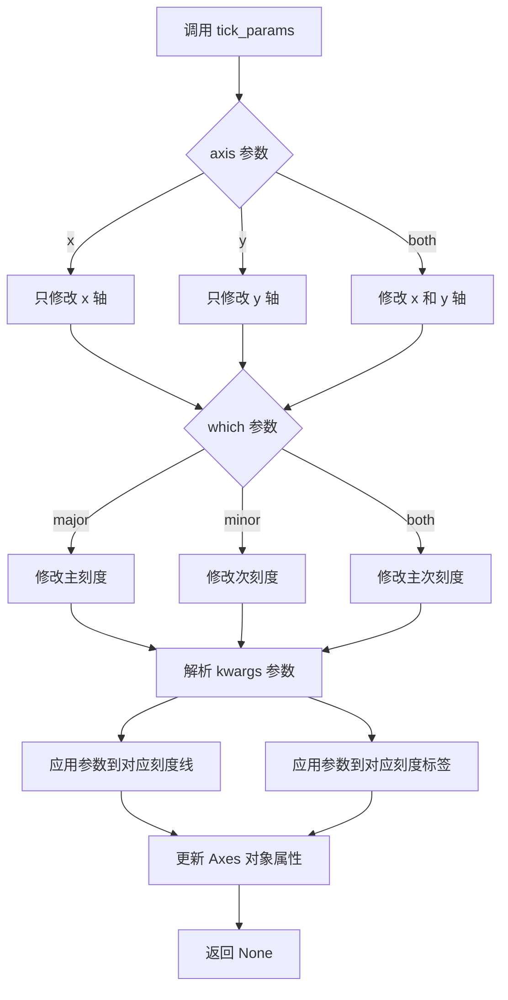

#### 带注释源码

```python
def tick_params(self, axis='both', which='major', **kwargs):
    """
    Change the appearance of ticks, tick labels, and gridlines.
    
    This method is part of the Matplotlib Axes class and is used to
    customize the appearance of axis ticks and labels. It directly
    modifies the Axes object state.
    
    Parameters
    ----------
    axis : {'x', 'y', 'both'}, default: 'both'
        The axis to which the parameters are applied.
    which : {'major', 'minor', 'both'}, default: 'major'
        The group of ticks for which the parameters are modified.
    **kwargs : properties
        Other keyword arguments:
        - Tick parameters: bottom, left, top, right, labelbottom, 
          labelleft, labeltop, labelright
        - Appearance: length, width, color, pad
        - Labels: labelsize, labelcolor
        - Grid: gridOn, grid_color, grid_linewidth, grid_linestyle
    
    Examples
    --------
    >>> ax.tick_params(axis='x', labelrotation=45)
    >>> ax.tick_params(bottom=False, labelbottom=False)
    >>> ax.tick_params(which='minor', length=5, width=2)
    """
    # 代码示例：在给定代码中的实际调用
    # ax.tick_params(bottom=False, labelbottom=False,
    #                left=False, labelleft=False)
    
    # 实际实现位于 matplotlib 库中
    # 以下是调用流程的伪代码展示：
    
    # 1. 获取要修改的轴
    # if axis in ('both', 'x'):
    #     xaxis = self.xaxis
    # if axis in ('both', 'y'):
    #     yaxis = self.yaxis
    
    # 2. 获取要修改的刻度类型
    # if which in ('major', 'both'):
    #     process ticks for major tickers
    # if which in ('minor', 'both'):
    #     process ticks for minor tickers
    
    # 3. 应用参数到对应的刻度线和标签
    # for key, value in kwargs.items():
    #     setattr(ticker, key, value)
    
    # 4. 标记 Axes 需要重绘
    # self.stale_callback
    
    return None
```


### `Divider`

`Divider` 是 matplotlib 中用于创建 Axes 分隔器的类，它将 figure 区域划分为网格，并允许指定每个网格单元的尺寸和宽高比，从而实现复杂的布局管理。

参数：

- `fig`：`matplotlib.figure.Figure`，figure 对象
- `rect`：元组，Axes 在 figure 中的位置和大小，格式为 (left, bottom, width, height)
- `horiz`：`list[Size]`，水平方向的尺寸列表
- `vert`：`list[Size]`，垂直方向的尺寸列表
- `aspect`：布尔值或浮点数，是否保持宽高比，默认为 None

返回值：`Divider`，返回一个新的分隔器对象，可用于设置 axes_locator。

#### 流程图

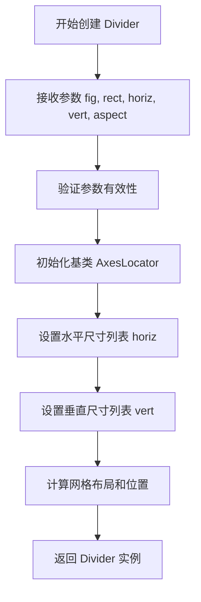

#### 带注释源码

```python
# Divider 类源码（基于 matplotlib 1.3.1 版本简化）
class Divider(AxesLocator):
    """
    分隔器类，用于创建网格布局。
    """
    def __init__(self, fig, rect, horiz, vert, aspect=None, anchor='C'):
        """
        初始化 Divider。

        参数：
        - fig: matplotlib.figure.Figure 对象
        - rect: 元组 (left, bottom, width, height)
        - horiz: 水平尺寸列表
        - vert: 垂直尺寸列表
        - aspect: 宽高比
        - anchor: 锚点位置
        """
        super().__init__()
        self.fig = fig
        self.rect = rect
        self.horiz = horiz  # 水平尺寸列表
        self.vert = vert    # 垂直尺寸列表
        self.aspect = aspect
        self.anchor = anchor
        # 初始化子区域列表
        self._subplots = []
        # 计算布局
        self._calc_layout()

    def _calc_layout(self):
        """计算网格布局。"""
        # 根据 horiz 和 vert 计算每个网格单元的位置和大小
        pass

    def new_locator(self, nx, ny=0, nx1=None, ny1=None):
        """
        创建新的定位器。

        参数：
        - nx: 网格索引
        - ny: 网格索引
        - nx1: 结束索引
        - ny1: 结束索引

        返回值：AxesLocator 对象
        """
        # 返回一个定位器，用于定位 Axes
        return AxesLocator(self, nx, ny, nx1, ny1)

    def __call__(self, ax, renderer):
        """调用分隔器，返回 Axes 的位置。"""
        # 返回 Axes 的位置和大小
        return self.get_position()
```


### `Size.Fixed`

`Size.Fixed` 是 matplotlib 库中 `mpl_toolkits.axes_grid1` 模块的一个类方法，用于创建一个固定大小的尺寸对象，该对象在布局中占据固定的英寸空间。

参数：

-  `size`：`float`，固定尺寸的数值，单位为英寸（inches）

返回值：`Size`，返回一个 Size 对象，用于定义 axes 布局中的固定尺寸

#### 流程图

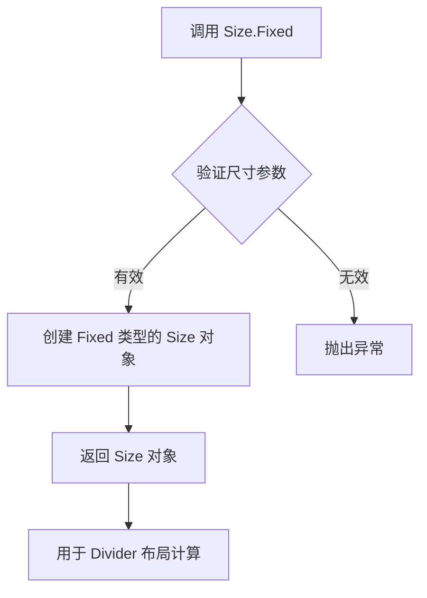

#### 带注释源码

```python
# 代码中的使用示例：
horiz = [Size.Fixed(1.), Size.Fixed(.5), Size.Fixed(1.5), Size.Fixed(.5)]
vert = [Size.Fixed(1.5), Size.Fixed(.5), Size.Fixed(1.)]

# 说明：
# Size.Fixed(1.) 表示创建一个固定宽度为1英寸的尺寸对象
# Size.Fixed(.5) 表示创建一个固定宽度为0.5英寸的尺寸对象
# Size.Fixed(1.5) 表示创建一个固定宽度为1.5英寸的尺寸对象
# 这些 Size 对象被传递给 Divider 类，用于定义 axes 网格的行列尺寸
```


### Size.Scaled

`Size.Scaled` 是 matplotlib 库中 `mpl_toolkits.axes_grid1` 模块的一个类，用于创建可随图形尺寸自动缩放的轴尺寸对象。它允许轴的宽度或高度根据图形大小按比例调整，实现响应式的布局设计。

参数：

-  `s`：`float`，缩放因子，表示该尺寸相对于可用空间的缩放比例

返回值：`Size.Scaled` 实例，返回一个可缩放的尺寸对象，可用于 `Divider` 的水平或垂直尺寸规范

#### 流程图

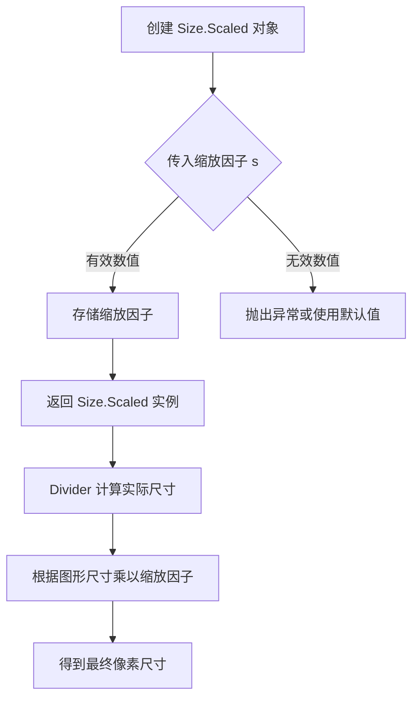

#### 带注释源码

```python
# 从 mpl_toolkits.axes_grid1 导入 Size 类
from mpl_toolkits.axes_grid1 import Divider, Size

# 使用 Size.Scaled 创建可缩放的尺寸对象
# 参数为缩放因子，表示相对于可用空间的缩放比例
horiz = [Size.Scaled(1.5), Size.Fixed(.5), Size.Scaled(1.), Size.Scaled(.5)]
vert = [Size.Scaled(1.), Size.Fixed(.5), Size.Scaled(1.5)]

# 示例：创建包含缩放尺寸的Divider
# Size.Scaled(1.5) 表示该区域占可用空间的1.5份
# Size.Scaled(1.) 表示该区域占可用空间的1份
# Size.Scaled(.5) 表示该区域占可用空间的0.5份
# 配合 Size.Fixed 使用，可以创建固定边距+自适应内容的布局
div = Divider(fig, rect, horiz, vert, aspect=False)
```

#### 补充说明

| 特性 | 说明 |
|------|------|
| **设计目标** | 实现轴尺寸随图形大小自动缩放的响应式布局 |
| **约束** | 需要与 `Size.Fixed` 配合使用，且总缩放因子会影响最终比例 |
| **错误处理** | 传入非数值类型或负数时可能抛出 TypeError 或 ValueError |
| **数据流** | 缩放因子 → Divider 计算 → 实际像素尺寸 → 图形渲染 |
| **外部依赖** | 依赖 matplotlib 的 Figure 尺寸和布局计算系统 |
| **优化空间** | 可考虑增加最小/最大尺寸限制，避免缩放过小或过大 |


```json
{
  "name": "Divider.new_locator",
  "description": "创建并返回一个定位器对象，用于在已分割的Axes矩形中定位子Axes。该定位器根据网格索引（nx, ny）确定子Axes的位置，支持单点定位和范围定位。",
  "parameters": [
    {
      "name": "nx",
      "type": "int",
      "description": "水平网格索引，指定子Axes在网格中的列位置"
    },
    {
      "name": "ny",
      "type": "int",
      "description": "垂直网格索引，指定子Axes在网格中的行位置"
    },
    {
      "name": "nx1",
      "type": "int",
      "description": "可选参数，水平网格结束索引，用于指定子Axes占据的列范围（从nx到nx1-1）"
    }
  ],
  "return_type": "AxesLocator",
  "return_description": "返回一个定位器对象，用于axes_locator参数，以确定子Axes在分割矩形中的位置和大小"
}
```

#### 流程图

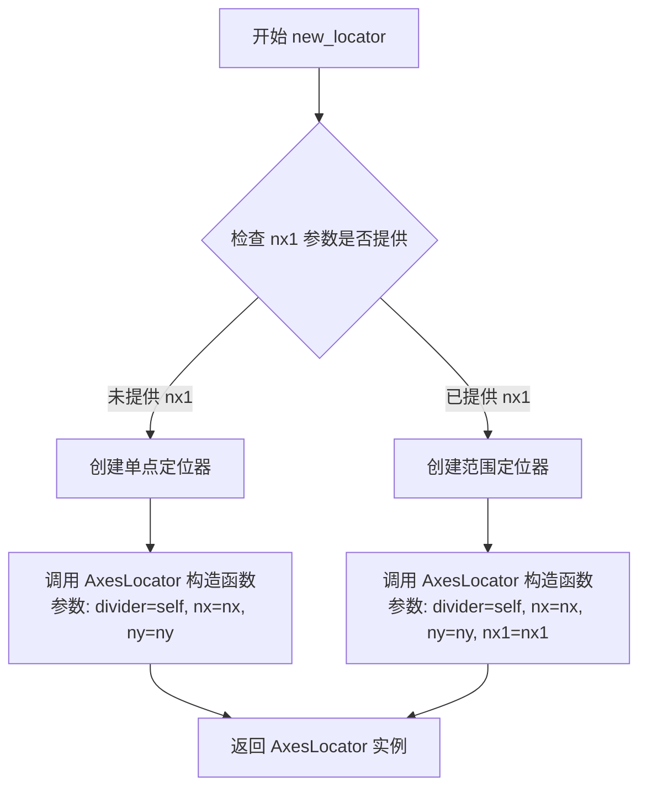

#### 带注释源码

```python
def new_locator(self, nx, ny, nx1=None):
    """
    创建并返回一个定位器对象，用于在已分割的Axes矩形中定位子Axes。
    
    参数:
        nx: int
            水平网格索引，指定子Axes在网格中的列位置。
        ny: int
            垂直网格索引，指定子Axes在网格中的行位置。
        nx1: int, 可选
            水平网格结束索引，用于指定子Axes占据的列范围。
            如果不提供，则创建单点定位器；如果提供，则创建范围定位器。
    
    返回值:
        AxesLocator: 定位器对象，用于axes_locator参数来确定子Axes的位置。
    
    示例:
        # 单点定位 - 子Axes占据单个网格单元
        ax1 = fig.add_axes(rect, axes_locator=div.new_locator(nx=0, ny=0))
        
        # 范围定位 - 子Axes占据多个网格单元（从nx到nx1-1）
        ax4 = fig.add_axes(rect, axes_locator=div.new_locator(nx=2, nx1=4, ny=0))
    """
    # 导入 AxesLocator 类（通常在模块内部定义）
    from mpl_toolkits.axes_grid1.axes_divider import AxesLocator
    
    # 创建定位器实例
    # 如果提供了 nx1 参数，则定位器将跨越多个网格单元
    # 如果未提供 nx1，则定位器只占据单个网格单元
    return AxesLocator(divider=self, nx=nx, ny=ny, nx1=nx1)
```

#### 关键组件信息

- **Divider**: 负责将Axes矩形分割成网格的类
- **AxesLocator**: 实际的定位器类，负责计算子Axes的显示位置和大小
- **Size**: 尺寸规格类，包含 Fixed（固定尺寸）和 Scaled（相对尺寸）两种类型


### `Figure.add_axes`

在 matplotlib 中，`Figure.add_axes` 是向图形添加坐标轴（Axes）的方法。该代码示例展示了如何使用 `axes_locator` 参数结合 `Divider` 类来精确控制坐标轴在图形中的位置和大小，实现复杂的轴布局。

参数：

-  `rect`：`tuple`，定义坐标轴的位置和大小，格式为 `(left, bottom, width, height)`，取值范围为 0 到 1（相对于图形尺寸）
-  `axes_locator`：`callable`，可选参数，一个定位器对象（此处使用 `Divider.new_locator()` 返回的定位器），用于确定坐标轴在图形中的具体位置
-  `**kwargs`：其他可选参数，接受标准的 `Axes` 构造函数参数，如 `projection`、`polar`、`facecolor` 等

返回值：`matplotlib.axes.Axes`，返回新创建的坐标轴对象

#### 流程图

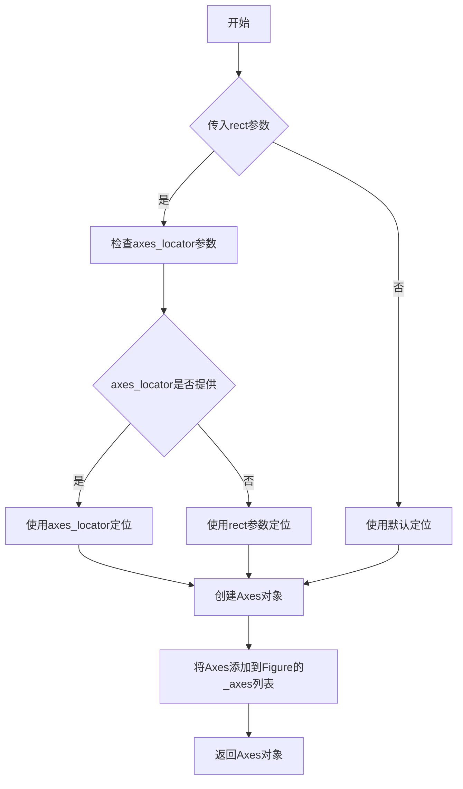

#### 带注释源码

由于用户提供的代码是 `add_axes` 的调用示例而非其源码，以下基于 matplotlib 官方实现逻辑和代码中的调用进行说明：

```python
# 代码示例中的调用方式：
ax1 = fig.add_axes(rect, axes_locator=div.new_locator(nx=0, ny=0))

# 详细解析：
# 1. rect = (0.1, 0.1, 0.8, 0.8)
#    - 0.1: 左边距（距图形左侧 10%）
#    - 0.1: 下边距（距图形底部 10%）
#    - 0.8: 宽度（图形宽度的 80%）
#    - 0.8: 高度（图形高度的 80%）
#
# 2. axes_locator=div.new_locator(nx=0, ny=0)
#    - 使用 Divider 创建的定位器覆盖默认的 rect 定位
#    - nx=0, ny=0 表示定位到网格的第 0 列第 0 行
#
# 3. add_axes 内部逻辑（简化）：
#    def add_axes(self, rect, projection=None, polar=False, 
#                 axes_locator=None, **kwargs):
#        # 1. 创建 Axes 实例
#        ax = Axes(self, rect, **kwargs)
#        
#        # 2. 如果提供了 axes_locator，设置定位器
#        if axes_locator is not None:
#            ax.set_axes_locator(axes_locator)
#        
#        # 3. 将 Axes 添加到 Figure 的 _axes 列表
#        self._axes.append(ax)
#        
#        # 4. 返回创建的 Axes 对象
#        return ax
```


### Figure.suptitle

`Figure.suptitle` 是 matplotlib 中 Figure 类的一个方法，用于在整个图形的顶部添加一个总标题（超级标题）。该标题会居中显示在图形的上方，适用于包含多个子图的复杂图形布局。

参数：

- `s`：`str`，要显示的标题文本内容
- `*args`：可变位置参数传递给 `Text` 对象，用于设置文本样式（如字体大小、颜色等）
- `**kwargs`：关键字参数传递给 `Text` 对象，用于设置文本属性（如字体family、weight等）

返回值：`~matplotlib.text.Text`，返回创建的文本对象，可以用于后续对标题进行进一步操作（如修改样式、位置等）

#### 流程图

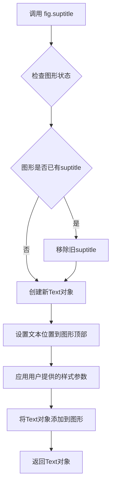

#### 带注释源码

```python
# 以下是 matplotlib 中 Figure.suptitle 方法的核心实现逻辑
# 源码位置：lib/matplotlib/figure.py

def suptitle(self, s, *args, **kwargs):
    """
    在图形的顶部添加一个总标题。
    
    参数:
        s: 标题文本
        *args: 传递给Text的位置参数
        **kwargs: 传递给Text的关键字参数（如 fontsize, fontweight, color 等）
    
    返回:
        Text: 创建的文本对象
    """
    # 1. 获取当前Figure的FigureCanvas对象
    # 这用于确定标题的绘制区域
    canvas = self.canvas
    
    # 2. 如果已存在旧suptitle，先移除它
    # 这确保每次调用suptitle只会显示一个总标题
    if self._suptitle is not None:
        self._suptitle.remove()
    
    # 3. 设置默认的垂直对齐方式为top
    # 确保标题位于图形顶部
    kwargs.setdefault('verticalalignment', 'top')
    
    # 4. 创建Text对象
    # 位置 (0.5, 1.0) 表示在图形的顶部居中
    # transform 使用 figure.bbox.transFigure 将坐标映射到figure坐标系
    self._suptitle = self.text(
        0.5, 1.0, s,
        transform=self.transFigure,
        *args, **kwargs
    )
    
    # 5. 返回创建的Text对象供用户进一步操作
    return self._suptitle
```

---

### 代码中的实际使用示例

在提供的代码中，`Figure.suptitle` 的使用方式如下：

```python
# 示例 1: 固定大小的轴
fig = plt.figure(figsize=(6, 6))
fig.suptitle("Fixed axes sizes, fixed paddings")  # 添加总标题

# 示例 2: 可缩放的轴
fig = plt.figure(figsize=(6, 6))
fig.suptitle("Scalable axes sizes, fixed paddings")  # 添加总标题
```

在上述代码中：
- `fig.suptitle("Fixed axes sizes, fixed paddings")` 调用了 Figure 对象的 suptitle 方法
- 传入的参数是字符串类型的标题文本 `"Fixed axes sizes, fixed paddings"`
- 返回值是一个 Text 对象，但在这个示例中没有被捕获使用
- 没有传递额外的样式参数，使用默认样式


### `ax.text`（在 `label_axes` 函数中使用）

该函数是 matplotlib 库中 Axes 类的方法，在代码中通过 `label_axes` 辅助函数调用，用于在 Axes 的指定位置添加文本标签。

参数：

-  `x`：`float`，文本的 x 坐标（0.5 表示axes宽度的50%位置）
-  `y`：`float`，文本的 y 坐标（0.5 表示axes高度的50%位置）
-  `s`：`str`，要显示的文本内容（即 `text` 参数）
-  `transform`：`matplotlib.transforms.Transform`，坐标变换方式（`ax.transAxes` 表示使用axes坐标系）
-  `horizontalalignment`：`str`，水平对齐方式（"center" 表示居中）
-  `verticalalignment`：`str`，垂直对齐方式（"center" 表示居中）

返回值：`matplotlib.text.Text`，返回创建的文本对象

#### 流程图

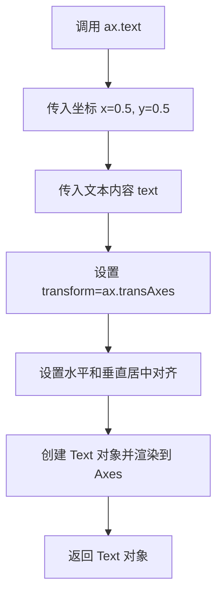

#### 带注释源码

```python
def label_axes(ax, text):
    """Place a label at the center of an Axes, and remove the axis ticks."""
    # 调用 Axes.text 方法在 Axes 中心添加文本
    # 参数说明：
    # .5, .5: 文本位置（相对于 axes 坐标系，0-1 之间）
    # text: 要显示的文本内容
    # transform=ax.transAxes: 使用 axes 坐标系而非数据坐标系
    # horizontalalignment="center": 水平居中
    # verticalalignment="center": 垂直居中
    ax.text(.5, .5, text, transform=ax.transAxes,
            horizontalalignment="center", verticalalignment="center")
    # 移除坐标轴刻度和标签
    ax.tick_params(bottom=False, labelbottom=False,
                   left=False, labelleft=False)
```


### `Axes.tick_params`

该方法用于配置坐标轴刻度线（tick）和刻度标签（tick label）的外观和行为，包括是否显示、颜色、方向、大小等属性。

参数：

- `axis`：`str`，可选，指定要配置的坐标轴，默认为 `'both'`，可选值包括 `'x'`、`'y'` 或 `'both'`
- `which`：`str`，可选，指定要配置的刻度类型，默认为 `'major'`，可选值包括 `'major'`、`'minor'` 或 `'both'`
- `direction`：`str`，可选，设置刻度的方向，值为 `'in'`（向内）、`'out'`（向外）或 `'inout'`（双向）
- `length`：`float`，设置刻度线的长度（以点为单位）
- `width`：`float`，设置刻度线的宽度（以点为单位）
- `pad`：`float`，设置刻度标签与刻度线之间的间距（以点为单位）
- `colors`：`dict`，设置刻度线和刻度标签的颜色
- `labelsize`：`float` 或 `str`，设置刻度标签的字体大小
- `labelcolor`：`str`，设置刻度标签的颜色
- `gridOn`：`bool`，是否显示网格线
- `tick1line`：`bool`，是否显示主刻度线
- `tick2line`：`bool`，是否显示次刻度线
- `label1on`：`bool`，是否显示主刻度标签
- `label2on`：`bool`，是否显示次刻度标签
- `bottom`、`top`、`left`、`right`：`bool`，分别控制底部、顶部、左侧、右侧刻度线的显示
- `labelbottom`、`labeltop`、`labelleft`、`labelright`：`bool`，分别控制底部、顶部、左侧、右侧刻度标签的显示
- `**kwargs`：其他传递给 `Line2D` 的关键字参数，用于自定义刻度线样式

返回值：`None`，该方法无返回值，直接修改 Axes 对象的属性

#### 流程图

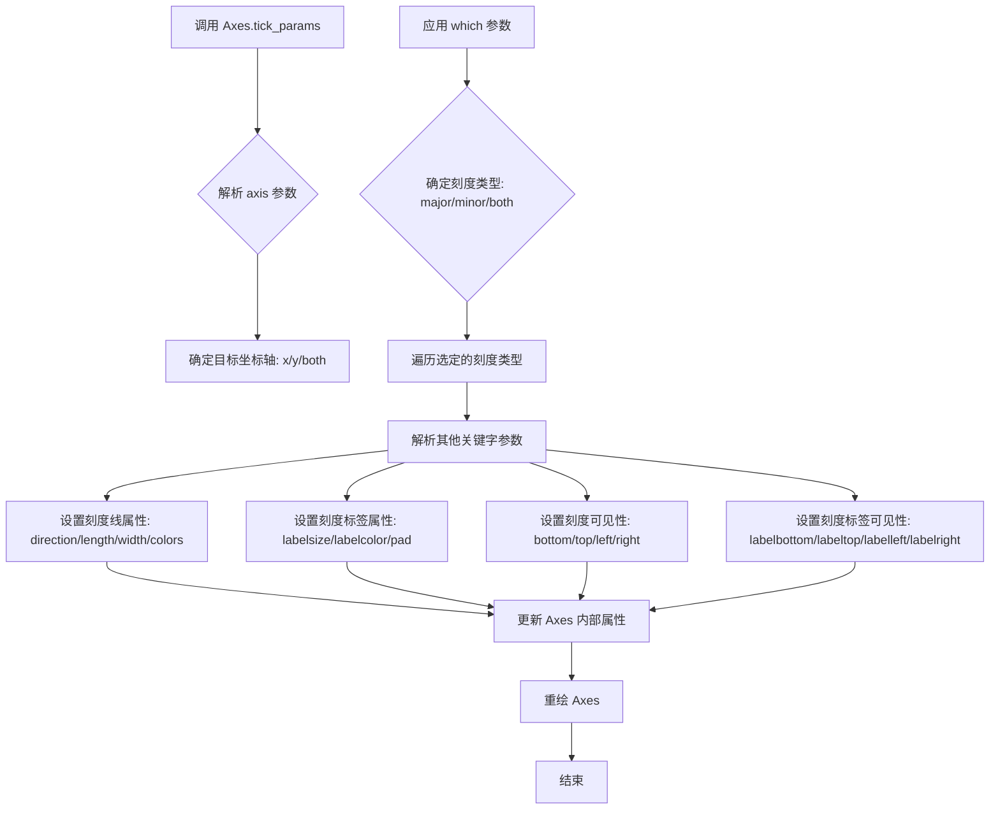

#### 带注释源码

```python
# 在示例代码中的调用方式：
ax.tick_params(bottom=False, labelbottom=False,
               left=False, labelleft=False)

# 参数解析：
# - bottom=False:    关闭底部刻度线的显示
# - labelbottom=False: 关闭底部刻度标签的显示
# - left=False:      关闭左侧刻度线的显示
# - labelleft=False: 关闭左侧刻度标签的显示

# 该调用等价于：
# ax.tick_params(axis='both', which='major',
#                bottom=False, labelbottom=False,
#                left=False, labelleft=False)

# 方法内部执行流程：
# 1. 解析 axis 参数，确定是修改 x 轴、y 轴还是两者
# 2. 解析 which 参数，确定是修改主刻度、副刻度还是两者
# 3. 遍历选定的轴和刻度类型
# 4. 根据传入的 kwargs 更新对应的刻度属性
# 5. 设置刻度线的 visible 属性
# 6. 设置刻度标签的 visible 属性
# 7. 调用 Axes.stale_callback 标记 Axes 需要重绘
# 8. 返回 None
```


### `Divider.new_locator`

该方法是 `mpl_toolkits.axes_grid1` 模块中 `Divider` 类的成员方法，用于创建一个新的 `AxesLocator` 定位器对象，以在已定义的网格布局中定位子 Axes。调用者通过指定网格单元格的索引（可选地指定范围）来获取对应的定位器，该定位器随后可赋值给 Axes 的 `axes_locator` 属性，从而实现自动布局定位。

#### 参数

- `nx`：`int`，指定网格单元的列索引（从 0 开始），表示 Axes 左侧所在的网格单元。若未指定 `nx1`，则表示单个网格单元的左侧边界。
- `ny`：`int`，指定网格单元的行索引（从 0 开始），表示 Axes 底部所在的网格单元。若未指定 `ny1`，则表示单个网格单元的底部边界。
- `nx1`：`int`，可选参数，指定网格单元的右侧边界索引（从 0 开始）。默认为 `None`，即跨越单个网格单元。
- `ny1`：`int`，可选参数，指定网格单元的顶部边界索引（从 0 开始）。默认为 `None`，即跨越单个网格单元。

#### 返回值

- `mpl_toolkits.axes_grid1.axes_divider.AxesLocator`：返回一个 `AxesLocator` 实例，该定位器封装了网格位置信息，可直接赋值给 `matplotlib.axes.Axes` 的 `axes_locator` 属性，以在图形渲染时自动计算并应用 Axes 的位置。

#### 流程图

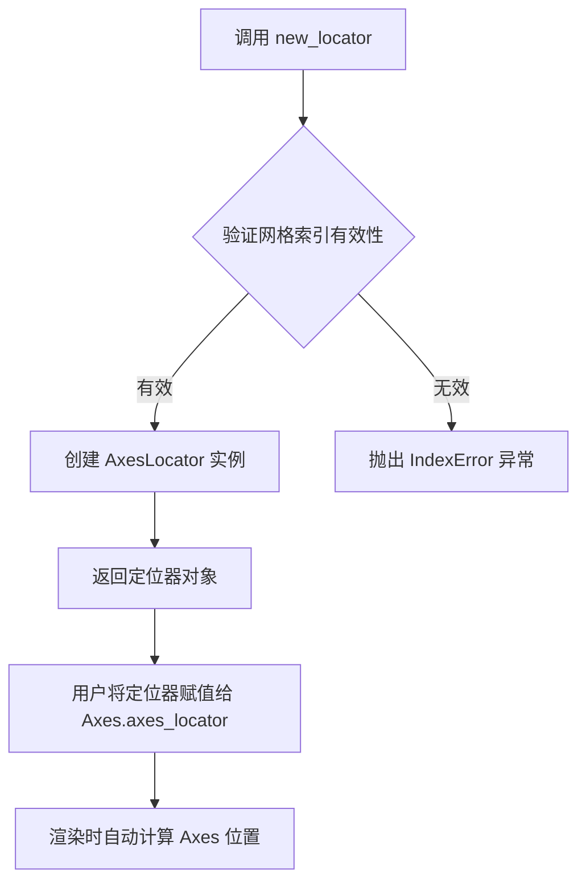

#### 带注释源码

```python
def new_locator(self, nx=0, ny=0, nx1=None, ny1=None):
    """
    Create a new locator for axes positioning within the divider's grid.

    This method generates an AxesLocator object that encapsulates the
    position information for a specific grid cell (or cell range) within
    the Divider's horizontal and vertical size specifications.

    Parameters
    ----------
    nx : int, optional
        The column index of the grid cell (starting from 0). This
        specifies the left edge of the axes in the grid.
    ny : int, optional
        The row index of the grid cell (starting from 0). This
        specifies the bottom edge of the axes in the grid.
    nx1 : int, optional
        The ending column index for spanning multiple cells. If None,
        the axes will span only the cell at nx.
    ny1 : int, optional
        The ending row index for spanning multiple cells. If None,
        the axes will span only the cell at ny.

    Returns
    -------
    AxesLocator
        A locator instance that can be passed to Axes.set_axes_locator
        to automatically position the axes according to the grid layout.
    """
    # Import here to avoid circular import issues
    from .axes_divider import AxesLocator

    # Create and return a new AxesLocator with the grid position parameters
    # The AxesLocator will internally use the divider's get_position method
    # to compute the actual bounding box when called during drawing
    return AxesLocator(self, nx, ny, nx1, ny1)
```

#### 备注

- 该方法依赖 `Divider` 实例已经初始化了水平尺寸列表 `horiz` 和垂直尺寸列表 `vert`，这些尺寸定义了网格的行列结构。
- 返回的 `AxesLocator` 在每次图形渲染时动态计算位置，因此如果 Figure 尺寸发生变化，Axes 的位置会自动相应调整（对于 `Size.Scaled` 类型的尺寸）。
- `nx1` 和 `ny1` 参数允许单个 Axes 跨越多个网格单元，这在创建跨列或跨行的子图时非常有用。
- 潜在的优化方向包括：添加参数验证以提供更友好的错误提示，以及支持回调机制以在布局变化时通知依赖方。


## 关键组件


### Size.Fixed

用于定义固定的轴尺寸，以英寸为单位，在整个图形生命周期内保持恒定大小，不随图形窗口缩放而改变。

### Size.Scaled

用于定义相对于图形尺寸缩放的轴尺寸，会根据图形当前的宽高比自动调整大小，实现响应式布局。

### Divider

轴分割器类，负责将给定的矩形区域按照水平（horiz）和垂直（vert）尺寸列表分割成网格，并提供定位器（Locator）来确定每个子区域的位置。

### label_axes

自定义辅助函数，接收轴对象和文本标签，在轴的中心位置放置文本，并关闭轴的刻度线显示，用于简化示例代码中的标签标注。

### div.new_locator

创建轴定位器的方法，返回一个可调用对象用于确定 Axes 的位置布局，支持指定网格索引参数（nx, ny, nx1, ny1）来定位具体的网格单元。


## 问题及建议


### 已知问题

- **代码重复**：两个主要的绘图逻辑块几乎完全相同，仅在`horiz`和`vert`参数上有所不同，存在明显的代码重复。
- **硬编码值**：所有尺寸值（如`1.`、`.5`、`1.5`）和位置坐标（如`rect = (0.1, 0.1, 0.8, 0.8)`）都是硬编码的，缺乏灵活性和可配置性。
- **缺乏错误处理**：代码没有对无效参数（如负数尺寸、无效的`nx`/`ny`索引）进行验证。
- **注释与实际行为不一致**：注释中提到"rect参数将被忽略并被axes_locator覆盖"，但仍然传递了rect参数，可能导致使用者的困惑。
- **函数设计不完善**：`label_axes`函数中硬编码了`bottom=False`等参数，缺乏灵活性。
- **无类型注解**：代码中没有任何类型提示（type hints），不利于代码的可维护性和IDE支持。
- **魔法数字**：代码中使用了多个魔法数字（如0.1, 0.8, 0.5）而没有解释其含义。

### 优化建议

- **提取公共函数**：将重复的图形创建逻辑封装成一个函数，接收尺寸列表作为参数，减少代码重复。
- **定义常量或配置**：将硬编码的尺寸值和位置参数定义为命名常量或配置变量，提高可读性和可维护性。
- **增加参数验证**：在`label_axes`函数和尺寸创建时添加参数验证，提供有意义的错误信息。
- **添加类型注解**：为函数参数和返回值添加类型提示，提升代码质量。
- **改进文档**：为关键代码块添加更详细的文档说明，解释各参数的含义和作用。
- **解耦配置与逻辑**：考虑创建一个配置字典或 dataclass 来管理布局参数，使代码更易于修改和扩展。


## 其它


### 设计目标与约束

本示例旨在展示如何使用 `mpl_toolkits.axes_grid1` 中的 `Divider` 和 `Size` 类来创建复杂的轴布局。设计目标包括：支持固定尺寸轴、可缩放轴、灵活的间距控制、以及多行多列的网格布局。约束方面，代码仅支持英寸为单位的长度定义，且 `aspect=False` 时不考虑宽高比。

### 错误处理与异常设计

代码主要依赖 matplotlib 内部异常处理。在使用 `fig.add_axes()` 时，如果 `rect` 参数与 `axes_locator` 冲突，以 `axes_locator` 为准。若 `Size` 参数为负数或 `Divider` 初始化参数不匹配，matplotlib 会抛出 `ValueError` 或 `RuntimeError`。

### 数据流与状态机

数据流：用户定义 `horiz` 和 `vert` 尺寸列表 → 创建 `Divider` 对象 → 调用 `div.new_locator()` 生成定位器 → 定位器绑定到 `axes_locator` → 渲染时根据定位器计算轴的位置和大小。状态机：Figure 创建 → Divider 初始化 → 定位器生成 → Axes 创建 → 渲染。

### 外部依赖与接口契约

主要依赖：`matplotlib`、`mpl_toolkits.axes_grid1`。核心接口：`Divider(fig, rect, horiz, vert, aspect)` 接受 Figure 对象、矩形区域、水平尺寸列表、垂直尺寸列表和宽高比标志；`Size.Fixed(value)` 创建固定尺寸；`Size.Scaled(value)` 创建相对尺寸；`div.new_locator(nx, ny, nx1, ny1)` 返回定位器。

### 使用示例与测试场景

代码包含两个主要测试场景：场景一展示全固定尺寸布局（1英寸、0.5英寸、1.5英寸、0.5英寸）；场景二展示混合布局（可缩放尺寸配合固定间距）。建议添加测试：验证不同 `aspect` 值的效果、测试嵌套布局、验证极端尺寸值的行为。

### 配置参数说明

`rect`：元组 (left, bottom, width, height)，定义初始矩形区域，但会被 `axes_locator` 覆盖；`horiz/vert`：Size 对象列表，定义网格行列尺寸；`aspect`：布尔值，控制是否强制保持宽高比；`nx, ny`：整数，指定网格单元索引；`nx1, ny1`：可选整数，指定网格单元范围结束索引。

### 性能考虑

本示例为静态布局，性能开销较小。主要性能点在于 `Divider` 初始化时的网格计算。大量轴时建议缓存定位器对象。对于实时调整尺寸的场景，应避免频繁重建 Divider。

### 兼容性考虑

代码兼容 matplotlib 3.5+ 版本。在更早版本中，部分 Size 子类（如 `Size.Scaled`）可能存在细微行为差异。代码在 PDF、PNG 等不同后端输出时保持一致。

### 术语表

**Divider**：将矩形区域分割为网格的布局管理器；**Size**：尺寸规格类，Fixed 表示固定值，Scaled 表示相对值；**axes_locator**：轴定位器接口，控制轴在图表中的位置；**rect**：矩形区域定义参数 (left, bottom, width, height)。

### 参考资料

matplotlib 官方文档：https://matplotlib.org/stable/api/axes_grid_api.html；axes_grid1 源码：mpl_toolkits/axes_grid1/axes_grid.py；相关示例：matplotlib examples - axes_grid


    