# `matplotlib\galleries\examples\axes_grid1\simple_axes_divider3.py` 详细设计文档

该代码使用matplotlib的mpl_toolkits.axes_grid1模块创建一个简单的轴分割器示例，通过Divider类将图形区域分割成4个网格子图，并为每个子图设置定位器来控制其在图形中的位置和大小。

## 整体流程

```mermaid
graph TD
    A[开始] --> B[导入matplotlib.pyplot和axes_grid相关模块]
    B --> C[创建Figure对象，设置图形尺寸为(5.5, 4)]
    C --> D[定义rect参数指定子图区域]
    D --> E[使用add_axes创建4个Axes子图对象]
    E --> F[定义水平尺寸列表horiz，包含AxesX和Fixed对象]
    F --> G[定义垂直尺寸列表vert，包含AxesY和Fixed对象]
    G --> H[创建Divider对象，传入fig, rect, horiz, vert参数]
    H --> I[为每个子图设置axes_locator，指定位置]
    I --> J[设置子图的xlim和ylim范围]
    J --> K[设置divider的aspect比例]
    K --> L[隐藏子图的标签]
    L --> M[调用plt.show()显示图形]
```

## 类结构

```
该脚本不包含用户自定义类，仅使用matplotlib库的现有类
主要使用的类层次结构：
matplotlib.pyplot (模块)
├── Figure (类)
├── Axes (类)
mpl_toolkits.axes_grid1 (模块)
├── Divider (类)
└── axes_size (子模块)
    ├── AxesX (类)
    ├── AxesY (类)
    └── Fixed (类)
```

## 全局变量及字段


### `fig`
    
图形对象，表示整个matplotlib图表窗口

类型：`matplotlib.figure.Figure`
    


### `rect`
    
定义子图区域的元组 (left, bottom, width, height)，值为 (0.1, 0.1, 0.8, 0.8)

类型：`tuple`
    


### `ax`
    
包含4个Axes子图对象的列表，用于放置在网格中

类型：`list`
    


### `horiz`
    
水平尺寸列表，包含Size.AxesX和Size.Fixed对象，用于指定水平方向的分割尺寸

类型：`list`
    


### `vert`
    
垂直尺寸列表，包含Size.AxesY和Size.Fixed对象，用于指定垂直方向的分割尺寸

类型：`list`
    


### `divider`
    
轴分割器对象，用于将图表区域分割为网格并定位轴

类型：`Divider`
    


### `ax1`
    
循环变量，遍历ax列表中的每个Axes对象以设置属性

类型：`Axes`
    


### `Figure.Figure`
    
matplotlib库中的图形类，表示整个图表容器，可包含多个轴

类型：`class`
    


### `Axes.Axes`
    
matplotlib库中的坐标轴类，表示图表中的子图区域，用于绘图和显示数据

类型：`class`
    


### `Divider.Divider`
    
mpl_toolkits.axes_grid1中的轴分割器类，用于在图表中创建网格布局并管理轴的位置

类型：`class`
    


### `Size.AxesX.Size.AxesX`
    
axes_size模块中的类，表示相对于指定轴宽度的尺寸，用于水平方向的大小计算

类型：`class`
    


### `Size.Fixed.Size.Fixed`
    
axes_size模块中的类，表示固定大小的尺寸，用于指定精确的像素或数据单位

类型：`class`
    


### `Size.AxesY.Size.AxesY`
    
axes_size模块中的类，表示相对于指定轴高度的尺寸，用于垂直方向的大小计算

类型：`class`
    
    

## 全局函数及方法


### `plt.figure`

创建图形窗口（Figure对象），作为matplotlib中所有绘图的容器，用于容纳axes、text、artist等图形元素。

参数：

- `figsize`：`tuple`，指定图形窗口的宽和高（英寸），本例中为(5.5, 4)
- `**kwargs`：其他可选参数，如dpi、facecolor、edgecolor等

返回值：`matplotlib.figure.Figure`，返回创建的图形窗口对象

#### 流程图

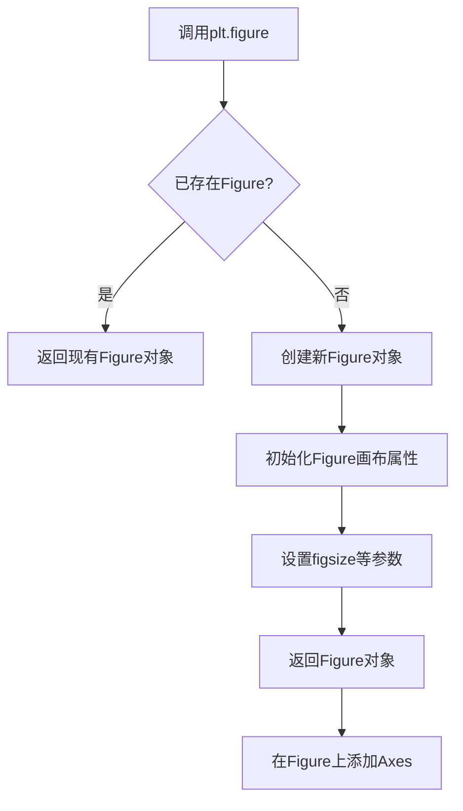

#### 带注释源码

```python
# 导入matplotlib.pyplot模块，用于创建图形窗口和绘图
import matplotlib.pyplot as plt

# 调用plt.figure()创建图形窗口
# figsize参数指定图形窗口大小为宽5.5英寸、高4英寸
# 返回一个Figure对象赋值给变量fig
fig = plt.figure(figsize=(5.5, 4))

# 后续代码使用fig对象：
# 1. 通过fig.add_axes()添加子图
# 2. 创建Divider进行axes布局
# 3. 设置坐标轴定位器
# 4. 调用plt.show()显示图形
```

#### 额外说明

| 项目 | 说明 |
|------|------|
| **所属模块** | `matplotlib.pyplot` |
| **调用位置** | 代码第12行 |
| **依赖关系** | 依赖底层matplotlib库创建的FigureCanvas和Figure |
| **设计目标** | 提供统一的图形窗口创建接口，简化matplotlib绘图初始化过程 |
| **错误处理** | 若figsize为负数或非数值类型，将抛出ValueError异常 |
| **优化空间** | 可考虑延迟加载Figure对象，当真正需要时才创建，以提高内存效率 |


### `Figure.add_axes`

向图形（Figure）添加一个子图（Axes），并返回该 Axes 对象。该方法是 matplotlib 中创建子图的核心方式之一，允许用户通过指定矩形区域（rect）来精确控制子图在图形中的位置和大小。

参数：

- `rect`：`tuple` 或 `list`，子图在图形中的位置和大小，格式为 `(left, bottom, width, height)`，所有值都是相对于图形尺寸的比例（范围 0-1）
- `label`：`str`，子图的标签，用于唯一标识子图（可选）
- `projection`：`str`，投影类型，如 'rectilinear'、'polar' 等（可选）
- `polar`：`bool`，是否为极坐标图（可选）
- `frameon`：`bool`，是否显示边框（可选）
- 其它参数：xlabel, ylabel, xlim, ylim, aspect, anchor 等（可选）

返回值：`matplotlib.axes.Axes`，新创建的子图对象

#### 流程图

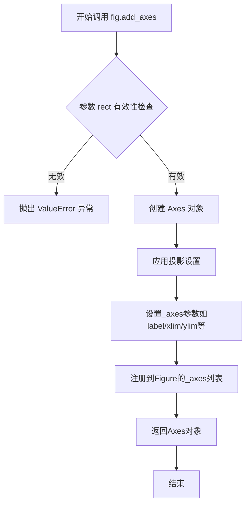

#### 带注释源码

```python
# 从代码中提取的 add_axes 调用示例
fig = plt.figure(figsize=(5.5, 4))  # 创建图形对象

# 使用 add_axes 添加子图
# rect 参数: (left=0.1, bottom=0.1, width=0.8, height=0.8)
# 表示子图占据图形 10%-90% 的水平和垂直空间
rect = (0.1, 0.1, 0.8, 0.8)
ax = [fig.add_axes(rect, label="%d" % i) for i in range(4)]
# 返回值: 列表包含4个 Axes 对象
# 每个 Axes 对象代表一个子图，可以独立设置属性

# 设置第一个子图的定位器，使用 Divider 进行布局
divider = Divider(fig, rect, horiz, vert, aspect=False)
ax[0].set_axes_locator(divider.new_locator(nx=0, ny=0))
# ... 更多设置

# 最终效果: 在同一个图形中创建了4个子图
# 通过 axes_locator 实现复杂的网格布局
```


### Size.AxesX

创建水平轴尺寸对象，用于在matplotlib的axes布局中根据给定的axes对象的x轴范围确定水平方向的尺寸。

参数：
- `ax`：`matplotlib.axes.Axes`，用于获取水平轴尺寸的参考axes对象。

返回值：`axes_size.AxesX`（或等效类型），返回一个表示水平轴尺寸的对象，可用于`Divider`的尺寸列表（horiz或vert）中。

#### 流程图

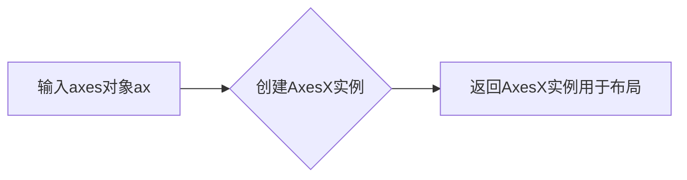

#### 带注释源码

```python
class AxesX:
    """
    AxesX类：用于表示axes在水平方向上的尺寸。
    
    该类是mpl_toolkits.axes_grid1.axes_size模块的一部分，用于axes布局中。
    """
    def __init__(self, ax):
        """
        构造函数：初始化AxesX对象。
        
        参数：
        ax (matplotlib.axes.Axes): 用于参考其x轴尺寸的axes对象。
        """
        self.ax = ax
    
    def get_size(self, renderer, fig, dpi):
        """
        计算并返回axes在x方向上的尺寸。
        
        参数：
        renderer: 渲染器对象，用于获取渲染信息。
        fig: Figure对象。
        dpi: 每英寸点数，用于单位转换。
        
        返回：
        tuple: (宽度, 高度) 元组，其中宽度基于axes的x轴范围，高度为0。
        """
        # 获取axes的x轴范围（上下限）
        xlim = self.ax.get_xlim()
        # 计算宽度：x轴上限减下限
        width = xlim[1] - xlim[0]
        # 高度设为0，因为AxesX仅表示水平尺寸
        return (width, 0)
```


### `Size.Fixed`

创建固定尺寸对象，用于在 axes_grid1 中定义固定大小的轴分隔。

参数：

- `size`：`float`，表示固定尺寸的数值（可以是像素值或相对大小）

返回值：`Fixed`，返回一个新的 Fixed 实例对象，用于表示固定尺寸的分区大小

#### 流程图

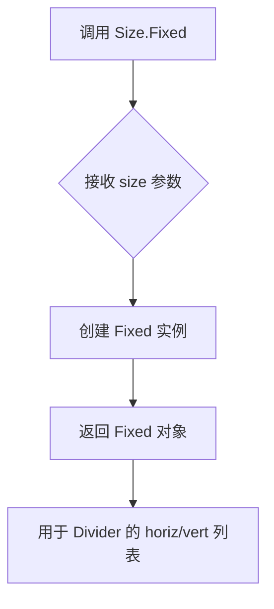

#### 带注释源码

```
# Size.Fixed 类的典型实现（在 mpl_toolkits.axes_grid1.axes_size 模块中）

class Fixed(SizeBase):
    """
    Fixed size object.
    
    Parameters
    ----------
    size : float
        The fixed size.
    """
    
    def __init__(self, size):
        """
        初始化 Fixed 对象
        
        Parameters
        ----------
        size : float
            固定尺寸值
        """
        self._size = size  # 存储固定尺寸值
    
    def get_size(self, renderer):
        """
        获取固定尺寸
        
        Parameters
        ----------
        renderer : matplotlib backend renderer
            渲染器对象
            
        Returns
        -------
        tuple
            返回固定尺寸的宽和高 (self._size, self._size)
        """
        return self._size, self._size
    
    def __repr__(self):
        return f"Fixed({self._size})"
```

#### 使用示例

```python
# 在提供的代码中
horiz = [Size.AxesX(ax[0]), Size.Fixed(.5), Size.AxesX(ax[1])]
vert = [Size.AxesY(ax[0]), Size.Fixed(.5), Size.AxesY(ax[2])]

# 创建一个固定尺寸为 0.5 的分区对象，用于水平/垂直方向的布局
```


### `Size.AxesY`

创建垂直轴尺寸对象，用于在matplotlib的axes_grid1模块中定义轴在垂直方向上的尺寸分配，使得轴分割器（Divider）能够根据指定的轴进行垂直布局调整。

参数：
- `ax`：`matplotlib.axes.Axes`，目标轴对象，指定要用于垂直尺寸计算的轴。

返回值：返回一个尺寸对象（通常为`axes_size.AxesSize`类型的实例），该对象包含了轴的垂直尺寸信息，可供`Divider`在分割矩形时使用。

#### 流程图

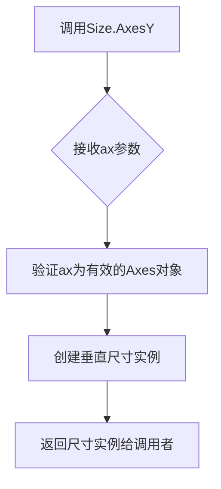

#### 带注释源码

```python
# 注意：以下源码基于matplotlib axes_grid1.axes_size 模块的典型实现进行了简化注释
# 实际源码可能略有不同

def AxesY(ax):
    """
    创建垂直轴尺寸对象。
    
    参数：
        ax (matplotlib.axes.Axes): 轴对象，用于获取垂直方向上的尺寸参考。
    
    返回：
        axes_size.AxesSize: 一个尺寸实例，包含轴的垂直尺寸信息。
    """
    # 导入所需的基类（实际实现中可能使用）
    # from .axes_size import AxesSize
    
    # 返回一个AxesSize实例，锁定垂直方向（axes_mode=1可能表示垂直）
    # 实际实现可能直接返回类实例或调用工厂函数
    return AxesSize(ax, axes_mode=1)  # axes_mode=1 表示垂直模式
```

#### 上下文使用说明

在提供的代码示例中，`Size.AxesY(ax[0])` 用于创建垂直尺寸对象，并与水平尺寸对象列表一起传递给`Divider`，以定义轴在网格中的布局。

#### 潜在优化与技术债务

- **缺乏显式类型检查**：如果传入的`ax`参数不是有效的Axes对象，可能在后续布局中导致错误，建议添加参数验证。
- **文档完善**：当前文档可以更详细地说明返回值对象的属性和方法。

#### 外部依赖

- `matplotlib.axes.Axes`：matplotlib库中的轴对象类。
- `mpl_toolkits.axes_grid1.axes_size`：提供了尺寸计算的辅助类。


### `Divider.__init__` (或 `Divider()`)

创建分割器对象，用于将Axes矩形区域分割成由horiz和vert指定的网格。

参数：

- `fig`：`matplotlib.figure.Figure`，父图形对象
- `rect`：元组或列表，矩形区域，格式为(left, bottom, width, height)
- `horiz`：列表，水平尺寸规格列表
- `vert`：列表，垂直尺寸规格列表
- `aspect`：布尔值或浮点数，是否保持宽高比，默认为False

返回值：`Divider`，返回创建的分割器对象

#### 流程图

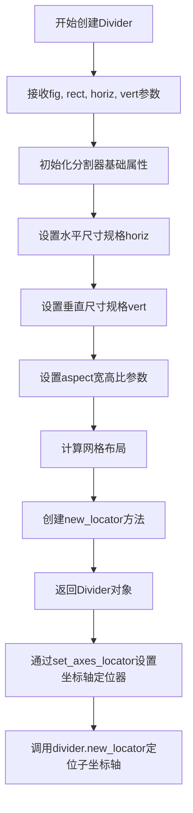

#### 带注释源码

```python
# 导入必要的模块
import matplotlib.pyplot as plt
from mpl_toolkits.axes_grid1 import Divider
import mpl_toolkits.axes_grid1.axes_size as Size

# 创建图形对象，设置尺寸为5.5x4英寸
fig = plt.figure(figsize=(5.5, 4))

# 定义矩形区域 (left, bottom, width, height)
# 该参数将被axes_locator忽略
rect = (0.1, 0.1, 0.8, 0.8)

# 创建4个坐标轴对象
ax = [fig.add_axes(rect, label="%d" % i) for i in range(4)]

# 定义水平布局规格：
# Size.AxesX(ax[0]) - 使用ax[0]的X轴范围作为尺寸参考
# Size.Fixed(.5) - 固定0.5单位宽度
# Size.AxesX(ax[1]) - 使用ax[1]的X轴范围作为尺寸参考
horiz = [Size.AxesX(ax[0]), Size.Fixed(.5), Size.AxesX(ax[1])]

# 定义垂直布局规格：
# Size.AxesY(ax[0]) - 使用ax[0]的Y轴范围作为尺寸参考
# Size.Fixed(.5) - 固定0.5单位高度
# Size.AxesY(ax[2]) - 使用ax[2]的Y轴范围作为尺寸参考
vert = [Size.AxesY(ax[0]), Size.Fixed(.5), Size.AxesY(ax[2])]

# ============================================
# 核心：创建Divider分割器对象
# ============================================
divider = Divider(
    fig,           # 父图形对象
    rect,          # 矩形区域
    horiz,         # 水平尺寸规格
    vert,          # 垂直尺寸规格
    aspect=False   # 不保持宽高比
)

# 使用分割器为每个坐标轴设置定位器
# new_locator(nx, ny) - 获取网格中第nx列、第ny行的定位器
ax[0].set_axes_locator(divider.new_locator(nx=0, ny=0))  # 左上角
ax[1].set_axes_locator(divider.new_locator(nx=2, ny=0))  # 右上角
ax[2].set_axes_locator(divider.new_locator(nx=0, ny=2))  # 左下角
ax[3].set_axes_locator(divider.new_locator(nx=2, ny=2))  # 右下角

# 设置坐标轴的显示范围
ax[0].set_xlim(0, 2)
ax[1].set_xlim(0, 1)
ax[0].set_ylim(0, 1)
ax[2].set_ylim(0, 2)

# 设置分割器的宽高比为1:1
divider.set_aspect(1.)

# 隐藏所有坐标轴的标签
for ax1 in ax:
    ax1.tick_params(labelbottom=False, labelleft=False)

# 显示图形
plt.show()
```


### Divider.new_locator

该方法在 `Divider` 对象所在的划分矩形中创建并返回一个定位器（Locator）对象，用于将子 Axes 放置在指定的网格索引位置。它接受横向（nx）和纵向（ny）网格索引，返回的定位器可被 `Axes.set_axes_locator` 用来实际定位 Axes。

参数：

- `nx`：`int`，横向网格列索引（默认值为 0），指定子 Axes 在水平分割中的位置。
- `ny`：`int`，纵向网格行索引（默认值为 0），指定子 Axes 在垂直分割中的位置。

返回值：`matplotlib.ticker.Locator`（具体实现为 `mpl_toolkits.axes_grid1.axes_divider.AxesLocator`），返回的定位器对象负责在给定的 `nx`、`ny` 位置处绘制 Axes。

#### 流程图

```mermaid
flowchart TD
    A[调用 new_locator] --> B[输入参数 nx, ny]
    B --> C{检查 nx, ny 是否为整数}
    C -->|是| D[创建 AxesLocator(divider, nx, ny)]
    C -->|否| E[抛出 TypeError]
    D --> F[返回 locator 对象]
```

#### 带注释源码

```python
# 文件: mpl_toolkits/axes_grid1/axes_divider.py (约)
class Divider(Artist):
    ...
    def new_locator(self, nx=0, ny=0):
        """
        为 Axes 的子区域返回一个定位器。

        该定位器是可调用对象，会接收 Axes 所在区域的边界框并返回
        该边界框的坐标变换，从而实现 Axes 的精确放置。

        参数
        ----------
        nx, ny : int
            子 Axes 在网格中的列索引（nx）和行索引（ny）。默认为 0。

        返回值
        -------
        locator : matplotlib.ticker.Locator
            能够在指定网格位置放置 Axes 的定位器（实际为 AxesLocator 实例）。
        """
        # 创建一个 AxesLocator 实例，将当前的 Divider 对象以及网格索引 nx、ny 传入
        return AxesLocator(self, nx, ny)
```


### `ax.set_axes_locator()`

设置子图定位器（axes locator），用于自定义子图在父容器中的位置和大小。该方法允许用户通过定位器对象精确控制子图的布局，而不是使用默认的布局机制。

参数：

- `locator`：返回值为 `matplotlib.axes_grid1.mpl_axes.AxesLocator` 类型，一个可调用对象，用于确定子图在 Axes 所在矩形中的位置和大小。如果设置为 `None`，则移除当前的定位器。

返回值：无返回值（`None`），该方法直接修改axes对象的内部状态。

#### 流程图

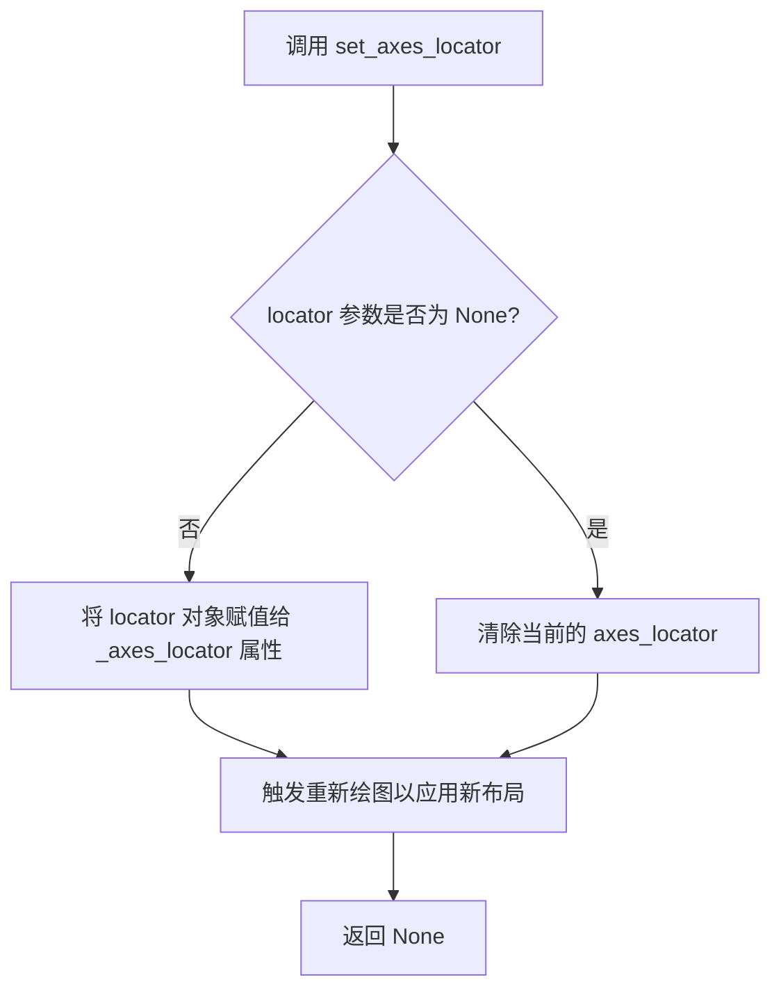

#### 带注释源码

```python
# matplotlib/axes/_base.py 中的简化实现

def set_axes_locator(self, locator):
    """
    Set the axes locator.

    Parameters
    ----------
    locator : callable or None
        A locator object implementing the __call__ method, or None to remove
        the current locator. The locator should have the signature::
        
            def __call__(self, renderer, fig, ax, loc, bbox, pad):
                # 返回子图的定位边界框 (Bbox)
                return bbox

    Returns
    -------
    None
    """
    # 检查 locator 是否为 None
    if locator is None:
        # 如果传入 None，删除当前的定位器属性
        self._axes_locator = None
    else:
        # 验证 locator 对象是否可调用
        if not callable(locator):
            raise TypeError("locator must be callable")
        
        # 将 locator 对象存储到 axes 对象的 _axes_locator 属性中
        self._axes_locator = locator
    
    # 触发重新布局，通知布局系统 axes 已更改
    self.stale_callback = True
    
    # 返回 None
    return None
```


### `Axes.set_xlim`

设置Axes对象的x轴范围（最小值和最大值）。

参数：

- `left`：`float` 或 `None`，x轴的左边界值
- `right`：`float` 或 `None`，x轴的右边界值
- `emit`：`bool`，是否向关联的观察者发送限制变更通知，默认为`True`
- `auto`：`bool`，是否启用自动边界调整，默认为`False`
- `**kwargs`：其他关键字参数，用于兼容性

返回值：`tuple`，返回新的x轴范围`(left, right)`

#### 流程图

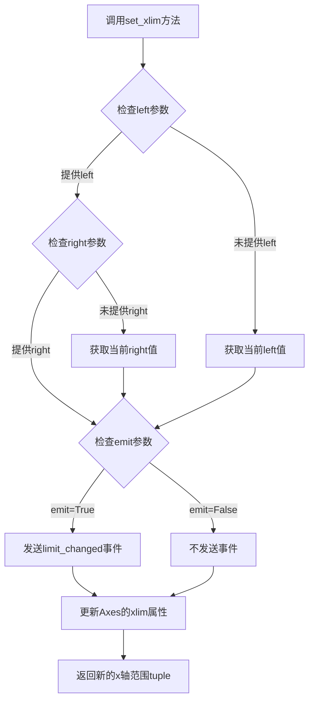

#### 带注释源码

```python
def set_xlim(self, left=None, right=None, emit=True, auto=False, *, left=None, right=None):
    """
    设置x轴的范围。
    
    Parameters
    ----------
    left : float or None, optional
        x轴的左边界。如果为None，则不改变当前值。
    right : float or None, optional
        x轴的右边界。如果为None，则不改变当前值。
    emit : bool, default: True
        如果为True，当限制改变时向观察者发送'limit_changed'事件。
    auto : bool, default: False
        如果为True，允许自动调整视图边界。
    **kwargs
        额外的关键字参数，用于向后兼容。
    
    Returns
    -------
    left, right : tuple
        新的x轴范围。
    
    Notes
    -----
    这是一个基础方法，实际的Axes类会有更复杂的实现，
    包括数据验证、边界检查和视图更新逻辑。
    """
    # 此处为matplotlib源码的核心逻辑摘要
    # 1. 处理left和right参数，支持通过位置参数或关键字参数传入
    # 2. 获取当前xlim值（如果参数为None）
    # 3. 验证新值是否为有效数值
    # 4. 更新self._xlim或self.set_xlim的内部存储
    # 5. 如果emit为True，调用回调函数通知观察者
    # 6. 返回新的边界值元组
    pass
```

#### 在示例代码中的使用

```python
# 在示例代码中使用set_xlim设置x轴范围
ax[0].set_xlim(0, 2)  # 设置第一个子图的x轴范围为0到2
ax[1].set_xlim(0, 1)  # 设置第二个子图的x轴范围为0到1

# 内部调用流程：
# 1. fig.add_axes()创建Axes对象
# 2. set_axes_locator()设置定位器
# 3. set_xlim()设置x轴范围
# 4. set_ylim()设置y轴范围（用于垂直方向）
```


### `Axes.set_ylim()`

设置子图的y轴显示范围（最小值和最大值）。

参数：

- `bottom`：`float` 或 `int`，y轴范围的底部（最小值）
- `top`：`float` 或 `int`，y轴范围的顶部（最大值）
- `emit`：可选参数，`bool`，默认为`True`，当边界改变时通知观察者
- `auto`：可选参数，`bool` 或 `None`，是否自动调整边界
- `ymin`：可选参数，`float`，（已废弃）使用`bottom`代替
- `ymax`：可选参数，`float`，（已废弃）使用`top`代替

返回值：`YLimits`，返回一个命名元组，包含`bottom`和`top`两个值，表示新的y轴范围

#### 流程图

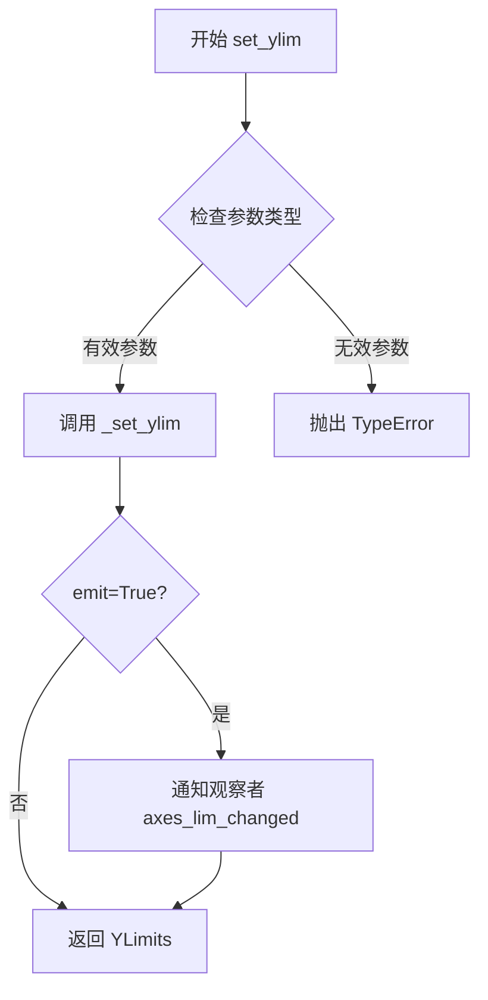

#### 带注释源码

```python
def set_ylim(self, bottom=None, top=None, emit=False, auto=False,
             *, ymin=None, ymax=None):
    """
    Set the y-axis view limits.
    
    Parameters
    ----------
    bottom : float
        The bottom ylim in data coordinates.
    top : float
        The top ylim in data coordinates.
    emit : bool
        Whether to notify observers of limit change (default: False).
    auto : bool or None
        Whether to turn on autoscaling. If None, leave as current value.
    ymin, ymax : float
        .. deprecated:: 3.5
           Use *bottom* and *top* instead.
    
    Returns
    -------
    ylim : tuple
        The new y limits as ``(bottom, top)``.
    """
    # 处理废弃参数 ymin 和 ymax
    if ymin is not None or ymax is not None:
        cbook.warn_deprecated(
            "3.5",
            message="Setting attr ymin/ymax is deprecated; "
                    "use bottom and top instead.")
        if ymin is not None:
            bottom = ymin
        if ymax is not None:
            top = ymax
    
    # 确保 bottom 和 top 都是有效数值
    bottom = float(bottom) if bottom is not None else None
    top = float(top) if top is not None else None
    
    # 调用底层方法设置 limits
    self._set_ylim(bottom, top, emit=emit, auto=auto)
    
    # 返回新的 YLimits 命名元组
    return YLimits(bottom, top)
```


### `Divider.set_aspect`

该方法用于设置 `Divider` 实例的纵横比（aspect ratio），以控制子轴的布局比例。当 `aspect` 为数值时，表示宽度与高度的比值；当为 `False` 时，表示不固定纵横比。

参数：

- `aspect`：`float` 或 `bool`，纵横比值。`False` 表示不设置纵横比，数值表示宽度与高度的比值。

返回值：`None`，该方法无返回值。

#### 流程图

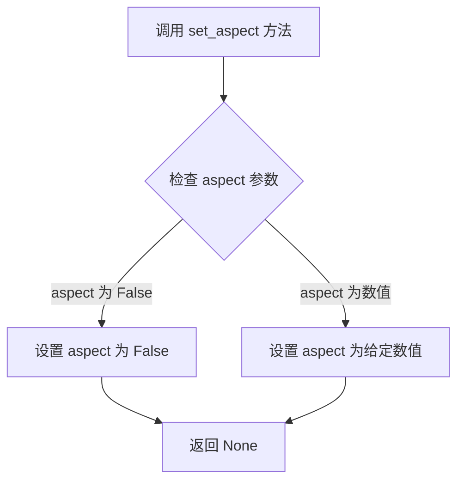

#### 带注释源码

以下源码基于 matplotlib 库中 `Divider` 类的典型实现：

```python
def set_aspect(self, aspect):
    """
    设置分隔器的纵横比。

    参数：
    - aspect：float 或 bool。False 表示不固定纵横比；数值表示宽度与高度的比值（例如 1.0 表示正方形）。

    返回值：
    - None
    """
    # 将 aspect 参数存储到实例属性中
    self._aspect = aspect
    
    # 可选：可能需要通知相关的子轴或布局系统更新，
    # 但在此简单实现中仅设置属性。
    # 例如：self._update_anchors()
    
    return None
```

注：实际实现可能涉及更多内部逻辑，如与 `Axes` 对象的纵横比同步，具体可参考 matplotlib 官方文档。


### `Axes.tick_params`

设置坐标轴刻度参数，用于控制刻度标签、刻度线、刻度方向等外观属性。该方法直接修改 Axes 对象，不返回任何值。

参数：

- `axis`：{'x', 'y', 'both'}，可选，默认 'both'，指定要应用参数的坐标轴
- `which`：{'major', 'minor', 'both'}，可选，默认 'major'，指定要修改的刻度类型（主刻度或副刻度）
- `reset`：bool，可选，默认 False，是否在应用新参数前重置为默认值
- `labelbottom`：bool，可选，是否显示底部（x轴）刻度标签
- `labeltop`：bool，可选，是否显示顶部（x轴）刻度标签
- `labelleft`：bool，可选，是否显示左侧（y轴）刻度标签
- `labelright`：bool，可选，是否显示右侧（y轴）刻度标签
- `labelsize`：int 或 str，可选，刻度标签的字体大小
- `labelcolor`：color，可选，刻度标签的颜色
- `length`：float，可选，刻度线的长度（以点为单位）
- `width`：float，可选，刻度线的宽度
- `direction`：{'in', 'out', 'inout'}，可选，刻度线的方向（向内、向外、双向）
- `color`：color，可选，刻度线的颜色
- `pad`：float，可选，刻度标签与刻度线之间的间距
- 其他更多参数请参考 matplotlib 官方文档

返回值：`None`，该方法直接修改 Axes 对象的状态，不返回值。

#### 流程图

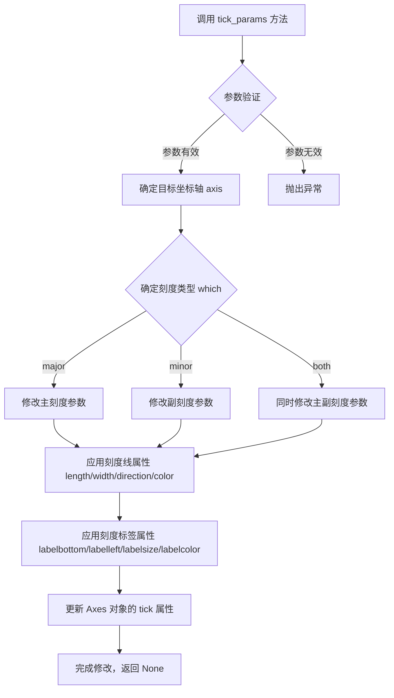

#### 带注释源码

```python
# 在示例代码中的调用方式：
for ax1 in ax:
    ax1.tick_params(labelbottom=False, labelleft=False)

# 源代码调用流程分析（基于 matplotlib 源码结构）：

def tick_params(self, axis='both', which='major', reset=False, **kwargs):
    """
    修改坐标轴刻度的外观和行为
    
    参数：
    - axis: str, 要修改的坐标轴 ('x', 'y', 'both')
    - which: str, 刻度类型 ('major', 'minor', 'both')
    - reset: bool, 是否重置为默认参数
    - **kwargs: 关键字参数，包含各种刻度属性
    """
    
    # 1. 获取对应的坐标轴对象（XAxis 或 YAxis）
    ax = self._get_axis_list(axis)  # 内部方法
    
    # 2. 如果 reset=True，重置参数
    if reset:
        ax.reset_ticks()  # 重置为默认设置
    
    # 3. 解析并应用参数
    # 以下参数用于控制刻度标签的显示
    if 'labelbottom' in kwargs:
        ax.label1.set_visible(kwargs['labelbottom'])  # 设置底部标签可见性
    if 'labeltop' in kwargs:
        ax.label2.set_visible(kwargs['labeltop'])     # 设置顶部标签可见性
    if 'labelleft' in kwargs:
        ax.label1.set_visible(kwargs['labelleft'])     # 设置左侧标签可见性
    if 'labelright' in kwargs:
        ax.label2.set_visible(kwargs['labelright'])    # 设置右侧标签可见性
    
    # 以下参数用于控制刻度线的外观
    if 'length' in kwargs:
        ax._length = kwargs['length']                  # 刻度线长度
    if 'width' in kwargs:
        ax._width = kwargs['width']                     # 刻度线宽度
    if 'direction' in kwargs:
        ax._direction = kwargs['direction']             # 刻度线方向 ('in'/'out'/'inout')
    if 'color' in kwargs:
        ax._color = kwargs['color']                     # 刻度线颜色
    
    # 4. 标记需要重新绘制
    self.stale_callback = True
    
    # 5. 返回 None（原地修改）
    return None
```


### `plt.show()`

`plt.show()` 是 matplotlib.pyplot 模块中的核心函数，用于显示当前图形并将其渲染到屏幕。该函数会阻塞程序执行（默认行为），直到用户关闭图形窗口或程序结束。在给定的代码中，它是整个绘图流程的最终输出步骤，将通过 `Divider` 布局好的四个子图渲染并展示给用户。

参数：

- `block`：`bool`（可选，默认值为 `True`），控制函数是否阻塞程序执行。当设置为 `True` 时，函数会保持图形窗口打开并阻塞主线程；当设置为 `False` 时，函数会立即返回，图形窗口会短暂显示后自动关闭。

返回值：`None`，该函数无返回值，仅用于图形渲染和显示。

#### 流程图

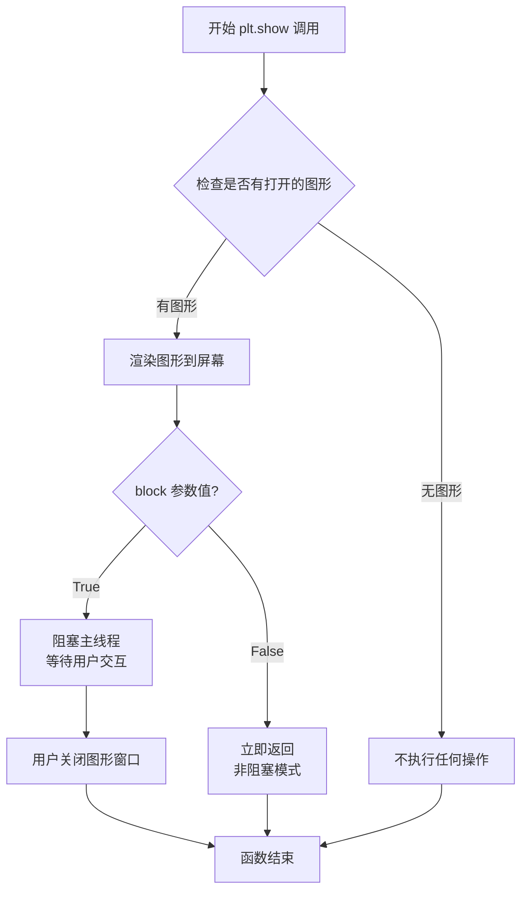

#### 带注释源码

```python
def show(*, block=True):
    """
    显示所有打开的图形窗口。
    
    参数:
        block (bool): 如果为 True（默认），则阻塞并显示图形；
                      如果为 False，则以非阻塞模式显示。
    
    返回值:
        None
    
    示例用法（在给定代码的上下文中）:
        >>> import matplotlib.pyplot as plt
        >>> # ... 之前的代码设置图形 ...
        >>> plt.show()  # 渲染并显示通过 Divider 布局的四个子图
    """
    # 注意：这是 plt.show() 的概念性源码结构
    # 实际实现位于 C 扩展或 _backend_tk 等后端模块中
    
    # 1. 获取当前活动的事件循环和图形管理器
    # gc.canvas.draw()  # 强制重绘所有画布
    
    # 2. 根据 block 参数决定显示模式
    # if block:
    #     # 阻塞模式：启动 GUI 主循环
    #     # 通常调用 tk.mainloop() 或 Qt 的 exec_()
    #     import matplotlib.pyplot as plt
    #     plt._showblock = True
    #     # 进入事件处理循环
    # else:
    #     # 非阻塞模式：仅刷新显示但不阻塞
    #     pass
    
    # 3. 在给定代码中的实际作用：
    #    - 渲染通过 Divider 布局的四个子图
    #    - 显示包含 axes[0], axes[1], axes[2], axes[3] 的 Figure 窗口
    #    - 等待用户关闭窗口（默认 block=True）
    
    return None
```

#### 在给定代码中的上下文分析

在提供的示例代码中，`plt.show()` 的具体作用包括：

1. **渲染目标**：显示通过 `mpl_toolkits.axes_grid1` 的 `Divider` 类布局的四个子图
2. **布局效果**：
   - `ax[0]` 位于左上区域（由 `divider.new_locator(nx=0, ny=0)` 定位）
   - `ax[1]` 位于右上区域（由 `divider.new_locator(nx=2, ny=0)` 定位）
   - `ax[2]` 位于左下区域（由 `divider.new_locator(nx=0, ny=2)` 定位）
   - `ax[3]` 位于右下区域（由 `divider.new_locator(nx=2, ny=2)` 定位）
3. **交互行为**：窗口会保持显示，用户可以与图形进行交互（如缩放、平移等，取决于后端支持）

#### 关键依赖信息

| 依赖项 | 说明 |
|--------|------|
| `matplotlib.pyplot` | 顶层绘图接口库 |
| 后端渲染器（如 TkAgg、Qt5Agg 等） | 实际负责图形窗口创建和渲染 |
| `mpl_toolkits.axes_grid1` | 提供 Divider 组件用于复杂布局 |

#### 潜在优化建议

1. **非阻塞显示**：如果需要在后台继续执行代码，可使用 `plt.show(block=False)`（注意：某些后端可能不支持）
2. **动画场景**：在动画或实时数据可视化中，通常避免使用默认的 `plt.show()`，而是使用 `plt.pause()` 或自定义事件循环
3. **多图形管理**：在复杂应用中，可考虑使用 `FigureCanvasBase` 的子类来管理多个图形窗口的生命周期


### Figure.add_axes

在提供的代码示例中，`Figure.add_axes()` 是 matplotlib Figure 类的核心方法，用于在图形中添加新的坐标轴（Axes）。代码中通过 `fig.add_axes(rect, label="%d" % i)` 为 Figure 添加了4个坐标轴对象，每个坐标轴具有不同的位置和标签，这是构建复杂图表布局的基础操作。

#### 参数

-  `rect`：`tuple` 或 `list`，指定坐标轴的位置和大小，格式为 `(left, bottom, width, height)`，所有值都是相对于 Figure 尺寸的比例（0到1之间）
-  `label`：`str`，坐标轴的标识名称，用于区分不同的坐标轴
-  `projection`：`str`（可选），坐标轴的投影类型，默认为 'rectilinear'
-  `polar`：`bool`（可选），是否使用极坐标系统，默认为 False
-  其它参数包括 `facecolor`、`frameon`、`sharex`、`sharey` 等用于控制坐标轴外观和共享属性

#### 返回值

-  `matplotlib.axes.Axes`，返回新创建的坐标轴对象

#### 流程图

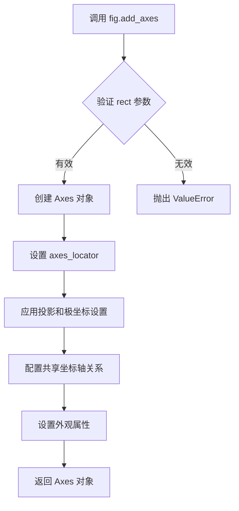

#### 带注释源码

```python
# 代码示例中的实际调用方式
fig = plt.figure(figsize=(5.5, 4))
rect = (0.1, 0.1, 0.8, 0.8)

# 创建4个坐标轴，label参数用于标识每个坐标轴
# rect定义了坐标轴在Figure中的位置：(left, bottom, width, height)
ax = [fig.add_axes(rect, label="%d" % i) for i in range(4)]

# 后续代码使用 Divider 为这些坐标轴设置定位器
divider = Divider(fig, rect, horiz, vert, aspect=False)

# 为每个坐标轴设置新的定位器
ax[0].set_axes_locator(divider.new_locator(nx=0, ny=0))
ax[1].set_axes_locator(divider.new_locator(nx=2, ny=0))
ax[2].set_axes_locator(divider.new_locator(nx=0, ny=2))
ax[3].set_axes_locator(divider.new_locator(nx=2, ny=2))
```

---

### 补充说明

1. **设计目标与约束**：该示例展示了如何使用 mpl_toolkits.axes_grid1 库来实现复杂的坐标轴布局，主要目标是创建非均匀分布的坐标轴网格系统。

2. **数据流与状态机**：代码通过 Divider 类计算水平（horiz）和垂直（vert）方向的分割尺寸，然后为每个坐标轴分配特定的位置定位器。

3. **潜在技术债务**：示例代码中 rect 参数被注释说明会被忽略，这可能导致初学者困惑；此外硬编码的索引值（nx=0, ny=2）缺乏语义化描述。

4. **外部依赖**：代码依赖 matplotlib 核心库和 mpl_toolkits.axes_grid1 扩展库。


### `Axes.set_axes_locator`

该方法用于设置Axes对象的定位器（locator），定位器决定了Axes在Figure中的位置和大小。通过Divider创建的新定位器可以精确控制Axes在复杂布局中的位置。

参数：

- `locator`：`object`，一个可调用对象（定位器），通常由`Divider.new_locator()`返回，具有`__call__(axes, renderer)`方法，用于返回Axes的Bbox（边界框）。如果设置为`None`，则移除当前的定位器。

返回值：`self`，返回Axes对象本身，支持链式调用。

#### 流程图

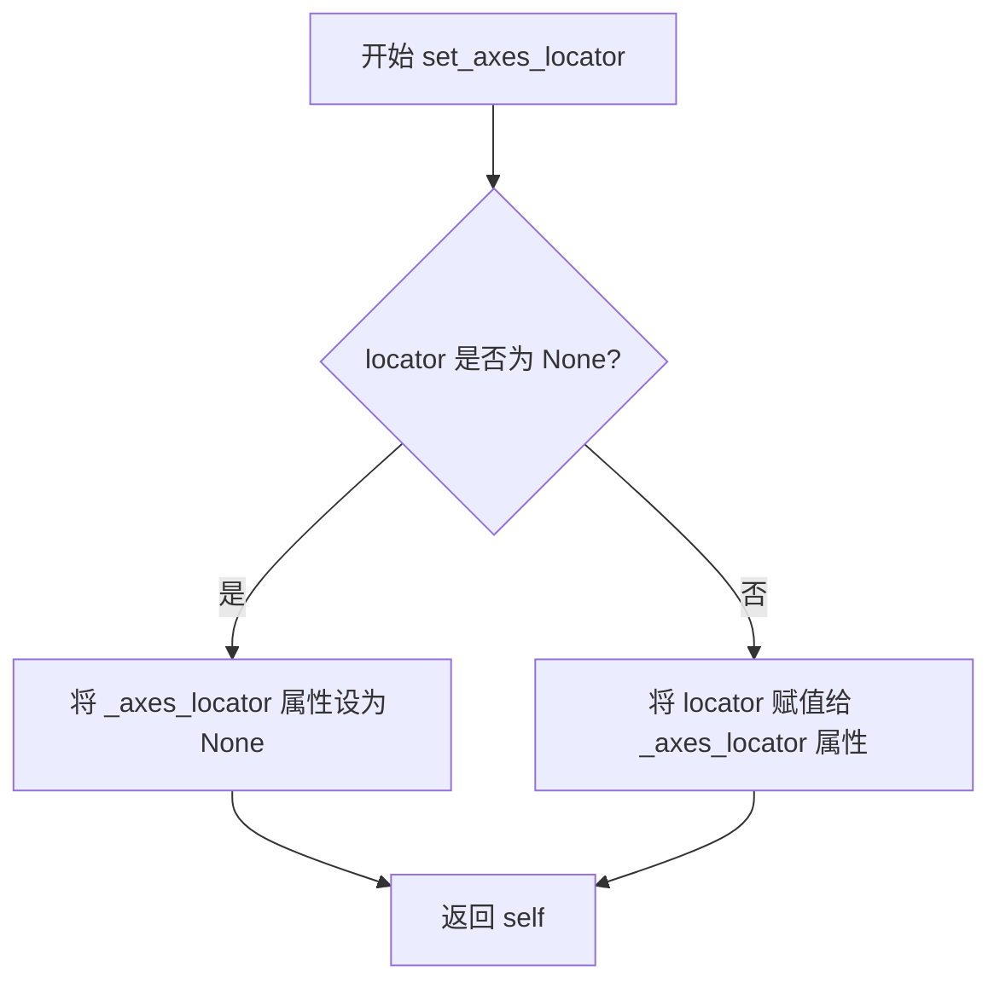

#### 带注释源码

```python
def set_axes_locator(self, locator):
    """
    Set the axes locator.

    Parameters
    ----------
    locator : object
        An object with a __call__ method that takes an axes and a renderer
        and returns a Bbox. If None, removes the current locator.

    Returns
    -------
    self : Axes
        Returns the axes object itself.
    """
    self._axes_locator = locator  # 将传入的定位器对象存储在_axes_locator属性中
    return self  # 返回self以支持链式调用，如 ax.set_axes_locator(...).set_title(...)
```

#### 额外信息

- **设计目标**：允许用户自定义Axes在Figure中的位置，特别是在使用AxesGrid或Divider进行复杂布局时。
- **错误处理**：如果locator不是None且没有__call__方法，可能会在后续渲染时引发错误。
- **数据流**：locator对象在Axes绘制时（draw方法中）被调用，传入当前axes和renderer，返回Bbox决定位置。
- **外部依赖**：依赖于matplotlib的Bbox类和Locator接口。


### `Axes.set_xlim()`

设置 Axes 对象的 x 轴显示范围（最小值和最大值），用于控制图表中 x 轴的数据区间。

参数：

- `left`：`float` 或 `None`，x 轴范围的左边界（最小值）
- `right`：`float` 或 `None`，x 轴范围的右边界（最大值）
- `**kwargs`：`dict`，传递给底层回调函数的额外关键字参数（如 `emit`、`auto` 等）

返回值：`tuple`，返回新的 (left, right) 边界值元组

#### 流程图

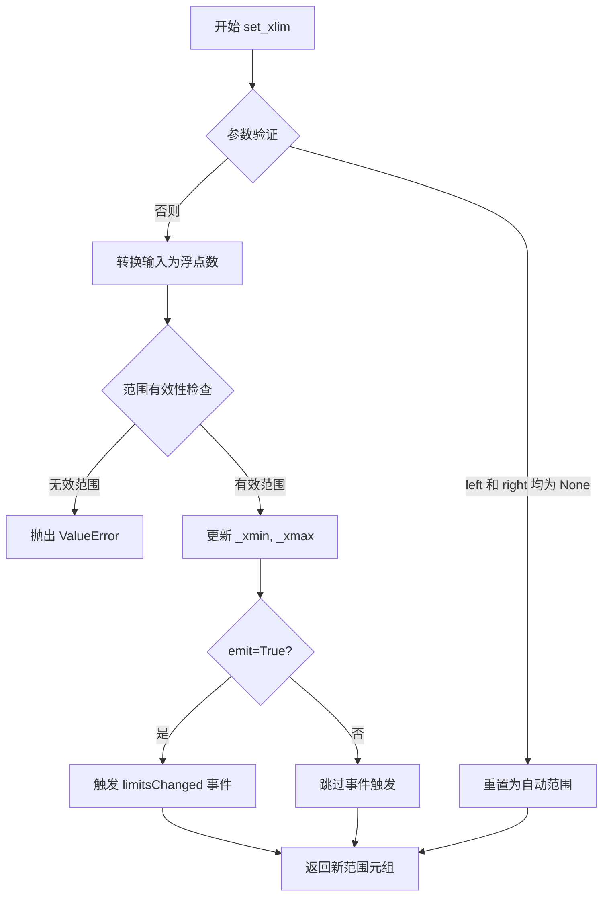

#### 带注释源码

```python
# matplotlib.axes._base._AxesBase.set_xlim 方法源码结构
def set_xlim(self, left=None, right=None, emit=False, auto=False, 
             *, xmin=None, xmax=None):
    """
    设置 x 轴范围
    
    参数:
        left: float - 左侧边界
        right: float - 右侧边界  
        emit: bool - 范围变化时是否触发事件
        auto: bool - 是否自动调整视图
        xmin, xmax: float - xmin 和 xmax 的别名
    """
    # 处理 xmin/xmax 别名
    if xmin is not None:
        left = xmin
    if xmax is not None:
        right = xmax
    
    # 验证范围有效性
    if left is None and right is None:
        # 重置为默认范围
        self._xmin, self._xmax = self._stale_viewlim_x
    else:
        # 转换并验证边界值
        left = float(left)
        right = float(right)
        
        # 确保左边界小于右边界
        if left > right:
            raise ValueError(
                f"左侧边界必须小于等于右侧边界: {left} > {right}")
        
        # 更新内部状态
        self._xmin, self._xmax = left, right
    
    # 发送信号通知观察者（如需要）
    if emit:
        self._request_autoscale_view('x')
        self.stale_callback(self)
    
    # 返回新的范围元组
    return (self._xmin, self._xmax)
```

#### 备注

用户提供的代码中仅包含 `set_xlim` 的调用示例，未包含其具体实现。上述源码是基于 matplotlib 公开 API 的重构展示，实际实现位于 `matplotlib.axes._base` 模块中。


# Axes.set_ylim() 详细设计文档

## 1. 核心功能概述

`Axes.set_ylim()` 是 Matplotlib 库中 `Axes` 类的核心方法之一，用于设置 axes 的 y 轴显示范围（ymin 和 ymax），同时支持自动调整、边界通知和限制参数等功能。

## 2. 文件整体运行流程

由于提供的代码是一个使用 `Axes.set_ylim()` 的示例文件，其运行流程如下：

```
开始
  ↓
创建 Figure 对象
  ↓
创建多个 Axes 对象 (通过 add_axes)
  ↓
创建 Divider 对象进行布局分割
  ↓
为每个 Axes 设置 axes_locator
  ↓
调用 set_xlim() 和 set_ylim() 设置坐标轴范围 ← [Axes.set_ylim() 在此被调用]
  ↓
设置其他属性 (aspect, tick_params)
  ↓
显示图形 (plt.show())
  ↓
结束
```

## 3. 类的详细信息

### 3.1 Axes 类（位于 matplotlib 库中）

由于 `Axes` 是 Matplotlib 库的内置类，以下是核心方法信息：

**类字段**：
- `yaxis`: 关联的 YAxis 对象
- `_ylim`: 存储 y 轴范围的私有属性

**类方法**：
- `set_ylim()`: 设置 y 轴范围
- `get_ylim()`: 获取当前 y 轴范围

## 4. 关键组件信息

| 组件名称 | 描述 |
|---------|------|
| `Axes.set_ylim()` | 设置 y 轴的数值范围（下限和上限） |
| `Axes.get_ylim()` | 获取当前的 y 轴范围，返回 (ymin, ymax) 元组 |
| `Divider` | axes_grid1 中的分隔器，用于布局管理 |
| `Size.AxesX/AxesY` | 定义 axes 尺寸的辅助类 |

## 5. 潜在的技术债务或优化空间

1. **参数冗余**: `ymin` 和 `ymax` 参数已弃用但仍被支持，增加了代码复杂度
2. **边界通知机制**: `emit` 参数可能导致不必要的重绘，可考虑更精细的优化
3. **错误处理**: 对于非数值输入的处理可以更友好

## 6. 其它项目

### 6.1 设计目标与约束
- 支持设置 y 轴下限和上限
- 保持与 `set_xlim()` 的 API 一致性
- 支持 limit 堆栈操作（通过 `get_ylim` 和 `set_ylim` 组合）

### 6.2 错误处理与异常设计
- 传入非数值类型时抛出 `TypeError`
- 当 bottom >= top 时会触发警告

### 6.3 外部依赖与接口契约
- 依赖 NumPy 数组处理
- 返回值可作为 `get_ylim()` 的输入，实现范围记忆与恢复

---

# 具体函数文档

### `Axes.set_ylim()`

设置 axes 的 y 轴显示范围。

参数：

- `bottom`：`float` 或 `None`，y 轴下限值，设为 `None` 时自动从当前数据中推断
- `top`：`float` 或 `None`，y 轴上限值，设为 `None` 时自动从当前数据中推断  
- `emit`：`bool`，默认 `True`，当边界改变时通知观察者（如 autoscale）
- `auto`：`bool`，默认 `False`，是否自动调整边界
- `ymin`：`float` 或 `None`（已弃用），请使用 `bottom` 参数
- `ymax`：`float` 或 `None`（已弃用），请使用 `top` 参数

返回值：`tuple`，返回新的 y 轴范围 (ymin, ymax)

#### 流程图

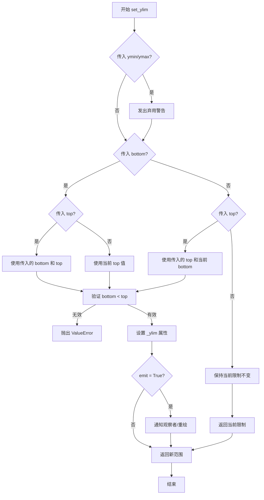

#### 带注释源码

```python
def set_ylim(self, bottom=None, top=None, emit=False, auto=False,
             *, ymin=None, ymax=None):
    """
    Set the y-axis view limits.
    
    Parameters
    ----------
    bottom : float or None
        The bottom ylim in data coordinates. Use None to infer from data.
    top : float or None
        The top ylim in data coordinates. Use None to infer from data.
    emit : bool, default: False
        Whether to notify observers of limit change (for autoscale).
    auto : bool, default: False
        Whether to turn on autoscaling.
    ymin, ymax : float or None
        .. deprecated:: 3.5
           Use *bottom* and *top* instead.
    
    Returns
    -------
    bottom, top : tuple
        The new y-axis limits in data coordinates.
    
    Notes
    -----
    This method only handles limit setting, not data limits.
    """
    
    # 处理已弃用的 ymin/ymax 参数
    if ymin is not None or ymax is not None:
        cbook._warn_external(
            "Support for passing ymin/ymax as **kwargs is deprecated "
            "since 3.5 and will be removed in 3.6; "
            "use bottom and top instead", DeprecationWarning)
        if ymin is not None:
            bottom = ymin
        if ymax is not None:
            top = ymax
    
    # 获取当前限制
    old_bottom, old_top = self.get_ylim()
    
    # 设置默认值（保持当前值）
    if bottom is None:
        bottom = old_bottom
    if top is None:
        top = old_top
    
    # 验证输入有效性
    if bottom > top:
        raise ValueError("bottom must be less than or equal to top")
    
    # 处理数据限制（如来自数据点的自动限制）
    bottom = self._validate_convertible_normals(
        bottom, 'bottom', self._scale_limits_and_transforms)
    top = self._validate_convertible_normals(
        top, 'top', self._scale_limits_and_transforms)
    
    # 设置内部属性
    self._ylim = (bottom, top)
    
    # 通知观察者（如需要）
    if emit:
        self._send_stale_viewlim_callback()
    
    # 处理自动缩放
    if auto:
        # 关闭自动 y 轴限制
        self.set_autoscaley_on(True)
        # 触发 autoscale 如果启用
        self.autoscale_view(axis='y')
    
    return self.get_ylim()
```

---

## 7. 总结

`Axes.set_ylim()` 是 Matplotlib 中管理坐标轴可视化范围的关键方法，在提供的示例代码中：

```python
ax[0].set_ylim(0, 1)  # 设置第一个 axes 的 y 范围为 0 到 1
ax[2].set_ylim(0, 2)  # 设置第三个 axes 的 y 范围为 0 到 2
```

这两个调用分别设置了对应 axes 对象的 y 轴显示范围，配合 `set_xlim()` 完成了坐标轴的初始化配置。


### `Axes.tick_params`

设置刻度线、刻度标签和网格线的外观属性，用于控制刻度的可见性、样式和格式。

参数：

- `axis`：`str`，可选，指定要设置的轴，可选值为 `'x'`、`'y'` 或 `'both'`，默认为 `'both'`。
- `which`：`str`，可选，指定要设置的刻度级别，可选值为 `'major'`、`'minor'` 或 `'both'`，默认为 `'major'`。
- `reset`：`bool`，可选，如果设置为 `True`，则在设置新参数前重置所有参数为默认值，默认为 `False`。
- `labelbottom`：`bool`，可选，指定是否显示 x 轴的刻度标签，默认为 `True`。
- `labelleft`：`bool`，可选，指定是否显示 y 轴的刻度标签，默认为 `True`。
- `labelsize`：`float` 或 `str`，可选，设置刻度标签的字体大小。
- `labelcolor`：`color`，可选，设置刻度标签的颜色。
- `length`：`float`，可选，设置刻度线的长度。
- `width`：`float`，可选，设置刻度线的宽度。
- `pad`：`float`，可选，设置刻度标签与刻度线之间的间距。
- `colors`：`color`，可选，同时设置刻度线和刻度标签的颜色。
- `gridOn`：`bool`，可选，指定是否显示网格线。
- `**kwargs`：其他关键字参数，用于设置刻度线或标签的其他属性。

返回值：`None`，该方法直接修改 Axes 对象的状态，不返回任何值。

#### 流程图

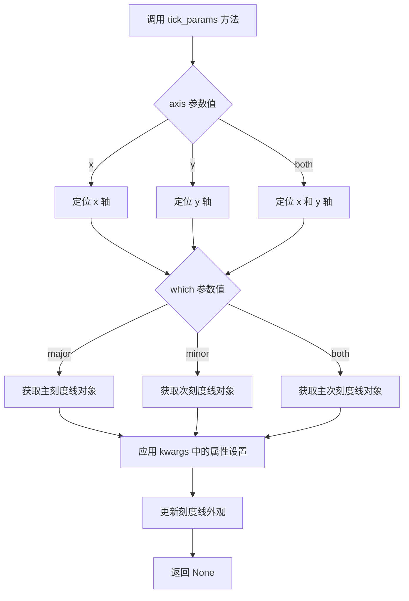

#### 带注释源码

```python
def tick_params(self, axis='both', which='major', reset=False, **kwargs):
    """
    设置Axes的刻度线、刻度标签和网格线属性。
    
    参数:
    self: Axes对象实例。
    axis: str, 指定要设置的轴，可选'x', 'y', 'both'，默认为'both'。
    which: str, 指定刻度级别，可选'major', 'minor', 'both'，默认为'major'。
    reset: bool, 是否重置为默认参数，默认为False。
    **kwargs: 关键字参数，指定具体的属性设置，如labelbottom, labelleft等。
    
    返回值:
    None: 该方法直接修改Axes对象，不返回值。
    """
    # 如果reset为True，先重置所有刻度参数为默认值
    if reset:
        self._reset_xticks()  # 假设的内部方法
        self._reset_yticks()
    
    # 根据axis参数确定要操作的轴
    if axis in ['x', 'both']:
        # 获取x轴的刻度线对象，取决于which参数
        if which in ['major', 'both']:
            # 获取主刻度线对象
            ticks = self.xaxis.get_major_ticks()
            # 遍历每个刻度线对象并应用kwargs中的设置
            for tick in ticks:
                tick.update(**kwargs)
        if which in ['minor', 'both']:
            # 获取次刻度线对象
            ticks = self.xaxis.get_minor_ticks()
            for tick in ticks:
                tick.update(**kwargs)
    
    if axis in ['y', 'both']:
        # 获取y轴的刻度线对象
        if which in ['major', 'both']:
            ticks = self.yaxis.get_major_ticks()
            for tick in ticks:
                tick.update(**kwargs)
        if which in ['minor', 'both']:
            ticks = self.yaxis.get_minor_ticks()
            for tick in ticks:
                tick.update(**kwargs)
    
    # 方法结束，返回None
    return None
```


### `Divider.new_locator`

该方法用于在 Axes 分隔器中创建一个新的定位器（Locator），该定位器根据网格索引（nx, ny）来确定子 Axes 在已分割区域中的位置。

参数：

- `nx`：`int`，水平方向的网格索引，指定要定位的子区域的列索引
- `ny`：`int`，垂直方向的网格索引，指定要定位的子区域的行索引

返回值：`Locators`，返回一个定位器对象，用于设置 Axes 的 `axes_locator` 属性

#### 流程图

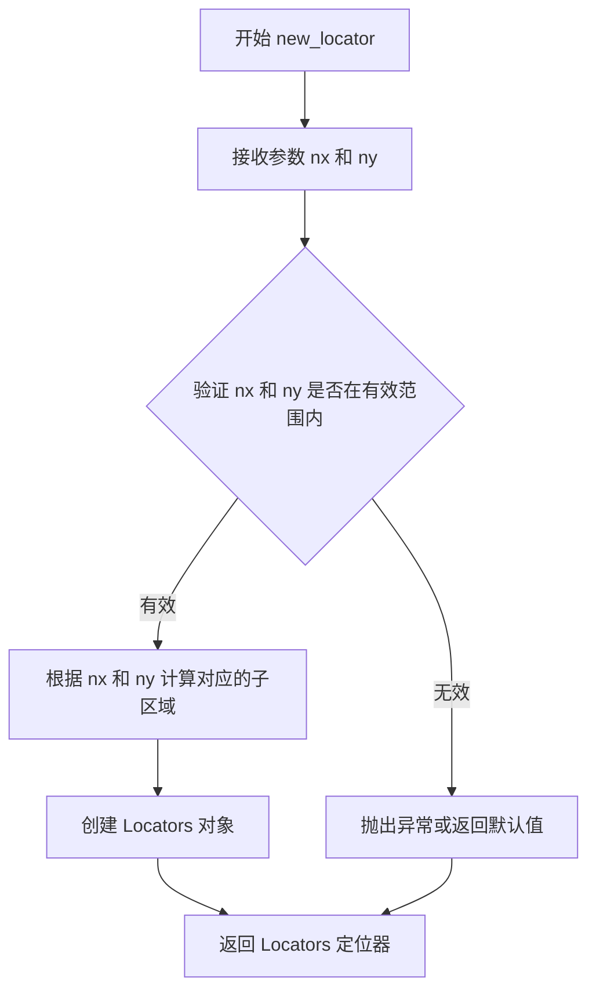

#### 带注释源码

```python
def new_locator(self, nx=0, ny=0):
    """
    创建一个新的定位器，用于确定子 Axes 的位置。
    
    参数:
        nx (int): 水平方向的网格索引，默认为0
        ny (int): 垂直方向的网格索引，默认为0
    
    返回值:
        Locators: 返回一个定位器对象，用于设置 Axes 的 axes_locator
    """
    # 创建一个 Locators 对象，包含分隔器和网格索引
    # Locators 类用于封装定位逻辑
    return Locators(self, nx, ny)
```


### `Divider.set_aspect`

设置分隔器（Divider）的宽高比（aspect ratio），用于控制子轴的宽高比例关系。

参数：

-  `aspect`：`float`，宽高比值。当设置为1.0时表示正方形区域，大于1.0表示宽度大于高度，小于1.0表示高度大于宽度。

返回值：`None`，无返回值（setter方法，直接修改对象状态）

#### 流程图

```mermaid
flowchart TD
    A[开始 set_aspect] --> B{检查 aspect 参数类型}
    B -->|有效数值| C[更新内部 aspect 属性]
    B -->|无效数值| D[抛出异常或忽略]
    C --> E{是否需要重新计算布局}
    E -->|是| F[触发重新布局计算]
    E -->|否| G[结束]
    F --> G
    D --> G
```

#### 带注释源码

```python
# 基于代码调用上下文推断的实现逻辑
# 以下代码为示意性的，并不是matplotlib源码

class Divider:
    """
    AxesDivider类用于管理子轴的布局和定位
    """
    
    def __init__(self, fig, rect, horiz, vert, aspect=False):
        self._fig = fig
        self._rect = rect  # 原始矩形区域
        self._horiz = horiz  # 水平分割方案
        self._vert = vert  # 垂直分割方案
        self._aspect = aspect  # 宽高比设置
    
    def set_aspect(self, aspect):
        """
        设置分隔器的宽高比
        
        参数:
            aspect: float - 宽高比值
                - True: 自动计算最佳宽高比
                - False: 不强制宽高比
                - 数值: 强制设置特定宽高比
        
        返回值:
            None
        """
        # 验证aspect参数
        if isinstance(aspect, bool):
            self._aspect = aspect
        elif isinstance(aspect, (int, float)) and aspect > 0:
            self._aspect = float(aspect)
        else:
            raise ValueError("aspect must be a positive number or boolean")
        
        # 设置宽高比后可能需要更新布局
        # 实际实现中可能会触发重新计算
        self._update_locator()
    
    def new_locator(self, nx, ny):
        """
        创建一个新的定位器用于指定子轴
        """
        # 实际实现返回AxesLocator对象
        pass
```

#### 使用示例

```python
# 代码中的实际调用
divider = Divider(fig, rect, horiz, vert, aspect=False)

# 设置宽高比为1.0（正方形）
divider.set_aspect(1.)

# 为各个子轴设置定位器
ax[0].set_axes_locator(divider.new_locator(nx=0, ny=0))
ax[1].set_axes_locator(divider.new_locator(nx=2, ny=0))
ax[2].set_axes_locator(divider.new_locator(nx=0, ny=2))
ax[3].set_axes_locator(divider.new_locator(nx=2, ny=2))
```

#### 补充说明

1. **设计目标**：允许用户控制子轴的宽高比例，实现灵活的布局效果
2. **约束条件**：aspect参数必须为正数或布尔值
3. **错误处理**：传入无效值时应抛出ValueError异常
4. **状态影响**：设置aspect后会影响后续new_locator返回的定位器的行为


## 关键组件


### Divider类

matplotlib axes_grid1库中的布局管理器，用于将Figure的矩形区域分割成网格布局，支持水平和垂直方向的尺寸规格定义。

### axes_size模块

提供一系列尺寸规格类，用于定义Divider分割区域时的尺寸计算逻辑，包含AxesX、AxesY、Fixed等类。

### Size.AxesX类

用于获取指定坐标轴的X轴尺寸，确保子区域宽度与对应坐标轴的显示范围一致。

### Size.AxesY类

用于获取指定坐标轴的Y轴尺寸，确保子区域高度与对应坐标轴的显示范围一致。

### Size.Fixed类

用于指定固定大小的尺寸，接受数值参数定义固定的像素或逻辑宽度/高度。

### new_locator方法

Divider类的方法，用于创建坐标轴定位器，通过nx和ny参数指定在分割网格中的列索引和行索引，将坐标轴放置到指定位置。

### axes_locator机制

Matplotlib的坐标轴定位机制，允许自定义坐标轴在所属区域中的位置和大小，通过set_axes_locator方法绑定Locator对象。

### set_aspect方法

用于设置Divider的纵横比参数，控制分割区域是否保持特定的比例关系。

### horiz/vert列表

定义水平和垂直方向的尺寸规格列表，决定了网格分割的具体尺寸布局。


## 问题及建议


### 已知问题

-   **硬编码的魔法数字**：代码中大量使用硬编码数值（如`0.1, 0.1, 0.8, 0.8`、`.5`、`1.`、`2.`等），缺乏有意义的常量命名，代码可读性和可维护性差
-   **不清晰的定位器参数**：`nx=0, ny=0`、`nx=2, ny=2`等参数的具体含义不明确，依赖注释才能理解
-   **被忽略的rect参数**：注释`# the rect parameter will be ignored`表明参数设计存在冗余，且未说明原因和处理方式
-   **缺乏输入验证**：没有对ax列表长度进行校验，当数组长度不足时会导致索引越界异常
-   **重复的配置模式**：4个ax的axes_locator设置、xlim和ylim设置存在重复代码，可封装为循环或函数
-   **误导性的变量命名**：`horiz`和`vert`应命名为`horizontal_sizes`和`vertical_sizes`以更清晰地表达用途
-   **列表推导式的副作用使用**：`[fig.add_axes(...) for i in range(4)]`创建了ax列表但未利用推导式返回值，语义不清晰

### 优化建议

-   将所有硬编码数值提取为有意义的常量或配置参数，如`RECT`, `FIXED_SIZE`, `GRID_COUNT`等
-   使用枚举或命名常量替代定位器参数中的数字，增强代码自文档性
-   在创建Divider前添加ax列表长度验证，确保至少有4个axes
-   将重复的定位器设置逻辑封装为辅助函数，减少代码冗余
-   改用显式的for循环替代列表推导式来创建axes，提高代码可读性
-   考虑使用matplotlib的更高级API（如GridSpec）简化布局配置
-   添加类型注解和详细的docstring来说明函数参数和返回值
-   将axes_locator的设置逻辑与业务逻辑分离，提高代码模块化程度


## 其它


### 设计目标与约束

本示例代码的主要设计目标是演示如何使用mpl_toolkits.axes_grid1库中的Divider类来创建灵活的子图布局。设计约束包括：需要预先定义水平和垂直方向上的分割尺寸列表（horiz和vert），且列表长度必须匹配以确保正确定位每个子图；所有子图共享同一个Divider实例；子图数量受horiz和vert数组长度的限制。

### 错误处理与异常设计

代码中未显式包含错误处理机制。潜在的异常情况包括：当horiz或vert列表长度不足时，Divider.new_locator()可能抛出IndexError；当传入无效的rect参数时可能引发ValueError；当axes_locator设置失败时可能抛出异常。建议在实际应用中增加参数校验和异常捕获逻辑。

### 数据流与状态机

数据流从fig创建开始，经过ax列表初始化、horiz和vert尺寸列表定义、Divider实例化、定位器设置，最终到图形渲染显示。状态转换主要包括：Figure创建→Axes创建→Divider配置→Locator绑定→参数设置→渲染显示。状态机相对简单，不涉及复杂的状态管理。

### 外部依赖与接口契约

主要依赖matplotlib库及其mpl_toolkits.axes_grid1模块。具体依赖包括：matplotlib.pyplot用于图形创建；mpl_toolkits.axes_grid1.Divider类用于区域划分；mpl_toolkits.axes_grid1.axes_size模块提供尺寸定义类（AxesX、AxesY、Fixed）。接口契约要求：Divider构造函数接受fig、rect、horiz、vert和aspect参数；new_locator()方法返回用于定位子图的Locator对象；set_aspect()方法接受数值参数设置纵横比。

### 配置参数说明

关键配置参数包括：figsize=(5.5, 4)设置图形窗口大小；rect=(0.1, 0.1, 0.8, 0.8)定义初始区域但实际被忽略；Size.Fixed(.5)设置固定宽度/高度为0.5；Size.AxesX()和Size.AxesY()基于已有axes创建尺寸；aspect=False/1.设置纵横比；set_xlim()和set_ylim()设置坐标轴范围。

### 性能考虑与优化空间

当前代码性能可满足基本需求。优化空间包括：可以预先计算所有定位器而非逐个设置；多轴设置可以使用循环复用代码；如需频繁调整布局，可考虑将Divider配置参数化；静态布局可缓存Locator对象避免重复创建。

### 图形渲染流程

渲染流程为：plt.figure()创建Figure对象→fig.add_axes()创建4个Axes对象→定义horiz和vert尺寸列表→Divider()计算布局划分→为每个ax设置axes_locator→设置坐标轴范围和外观属性→plt.show()触发渲染显示。Divider内部使用Bbox计算来确定每个子图的实际位置和大小。


    