# `matplotlib\galleries\examples\axes_grid1\simple_axesgrid.py` 详细设计文档

This code creates a simple image grid using matplotlib's ImageGrid to display four images aligned in a 2x2 grid.

## 整体流程

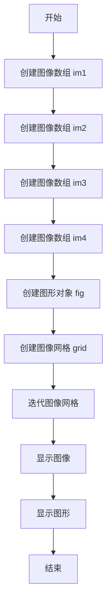

## 类结构

```
ImageGrid (matplotlib toolkit)
```

## 全局变量及字段


### `im1`
    
A 10x10 numpy array representing the first image.

类型：`numpy.ndarray`
    


### `im2`
    
A 10x10 numpy array representing the second image, which is the transpose of the first image.

类型：`numpy.ndarray`
    


### `im3`
    
A 10x10 numpy array representing the third image, which is the flipped upside down version of the first image.

类型：`numpy.ndarray`
    


### `im4`
    
A 10x10 numpy array representing the fourth image, which is the flipped left to right version of the second image.

类型：`numpy.ndarray`
    


### `fig`
    
A matplotlib figure object that contains the image grid.

类型：`matplotlib.figure.Figure`
    


### `grid`
    
An ImageGrid object that manages the layout of the subplots in the figure.

类型：`mpl_toolkits.axes_grid1.axes_grid.ImageGrid`
    


### `ImageGrid.fig`
    
The figure object that the ImageGrid is associated with.

类型：`matplotlib.figure.Figure`
    


### `ImageGrid.nrows_ncols`
    
The number of rows and columns of the grid.

类型：`tuple`
    


### `ImageGrid.axes_pad`
    
The padding between the axes in inches.

类型：`float`
    


### `ImageGrid.axes`
    
An array of axes objects that make up the grid.

类型：`numpy.ndarray`
    
    

## 全局函数及方法


### np.arange

`np.arange` 是 NumPy 库中的一个函数，用于生成一个沿指定轴的数组。

参数：

- `start`：`int`，数组的起始值。
- `stop`：`int`，数组的结束值（不包括此值）。
- `step`：`int`，步长，默认为 1。

返回值：`numpy.ndarray`，一个沿指定轴的数组。

#### 流程图

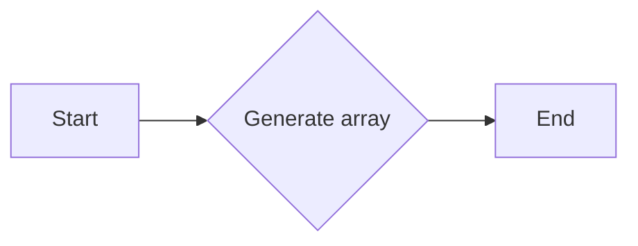

#### 带注释源码

```python
import numpy as np

# 生成一个从0到99的数组，步长为1
im1 = np.arange(100).reshape((10, 10))
```


### np.reshape

`np.reshape` 是 NumPy 库中的一个函数，用于改变数组的形状。

参数：

- `a`：`numpy.ndarray`，要重塑的数组。
- `newshape`：`tuple` 或 `int`，新形状的尺寸。

返回值：`numpy.ndarray`，重塑后的数组。

#### 流程图

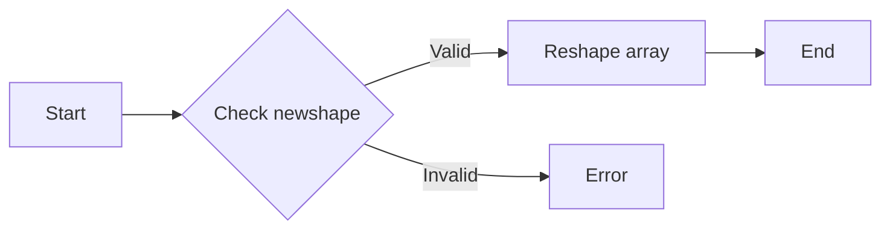

#### 带注释源码

```python
# 将数组重塑为10x10的形状
im1 = np.arange(100).reshape((10, 10))
```


### np.transpose

`np.transpose` 是 NumPy 库中的一个函数，用于转置数组。

参数：

- `a`：`numpy.ndarray`，要转置的数组。

返回值：`numpy.ndarray`，转置后的数组。

#### 流程图

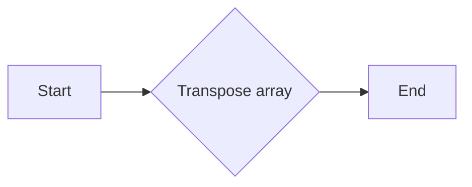

#### 带注释源码

```python
# 转置数组
im2 = im1.T
```


### np.flipud

`np.flipud` 是 NumPy 库中的一个函数，用于上下翻转数组。

参数：

- `a`：`numpy.ndarray`，要翻转的数组。

返回值：`numpy.ndarray`，翻转后的数组。

#### 流程图

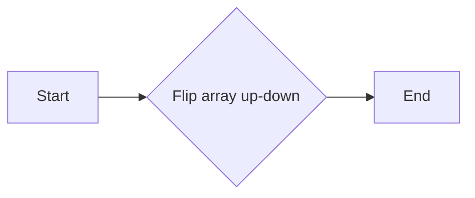

#### 带注释源码

```python
# 上下翻转数组
im3 = np.flipud(im1)
```


### np.fliplr

`np.fliplr` 是 NumPy 库中的一个函数，用于左右翻转数组。

参数：

- `a`：`numpy.ndarray`，要翻转的数组。

返回值：`numpy.ndarray`，翻转后的数组。

#### 流程图

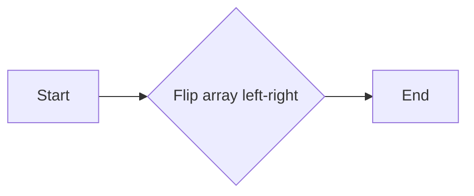

#### 带注释源码

```python
# 左右翻转数组
im4 = np.fliplr(im2)
```


### plt.figure

`plt.figure` 是 Matplotlib 库中的一个函数，用于创建一个新的图形。

参数：

- `figsize`：`tuple`，图形的大小（宽度和高度）。

返回值：`matplotlib.figure.Figure`，创建的图形对象。

#### 流程图

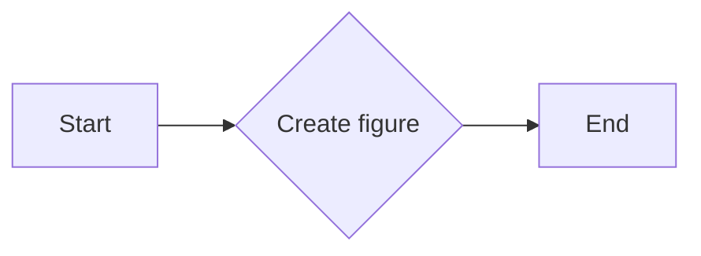

#### 带注释源码

```python
import matplotlib.pyplot as plt

# 创建一个大小为4x4英寸的图形
fig = plt.figure(figsize=(4., 4.))
```


### ImageGrid

`ImageGrid` 是 `mpl_toolkits.axes_grid1` 模块中的一个类，用于创建一个网格状的图像布局。

参数：

- `fig`：`matplotlib.figure.Figure`，图形对象。
- `nrows_ncols`：`tuple`，网格的行数和列数。
- `axes_pad`：`float`，轴之间的间距。

返回值：`ImageGrid`，图像网格对象。

#### 流程图

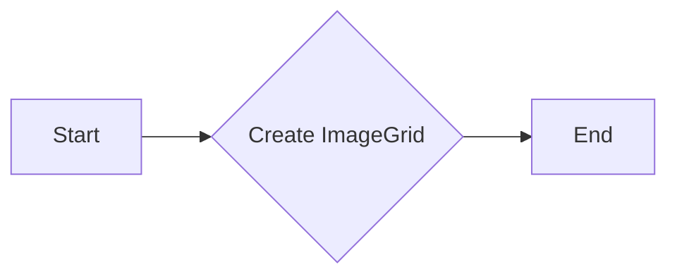

#### 带注释源码

```python
from mpl_toolkits.axes_grid1 import ImageGrid

# 创建一个2x2的图像网格
grid = ImageGrid(fig, 111, nrows_ncols=(2, 2), axes_pad=0.1)
```


### ax.imshow

`ax.imshow` 是 Matplotlib 库中的一个函数，用于在轴上显示图像。

参数：

- `im`：`numpy.ndarray`，要显示的图像。

返回值：`matplotlib.image.AxesImage`，图像对象。

#### 流程图

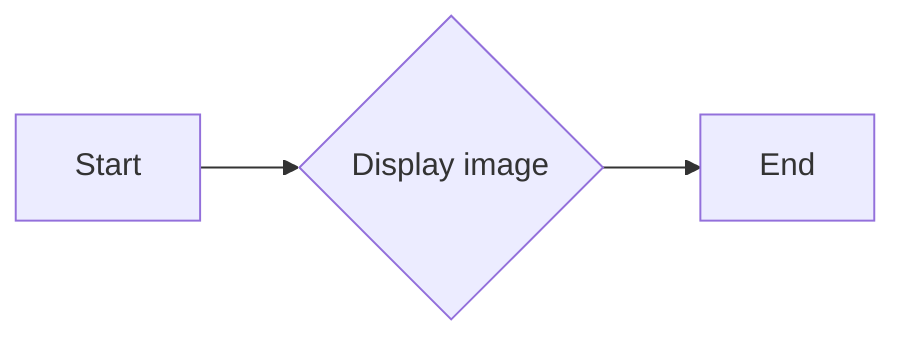

#### 带注释源码

```python
for ax, im in zip(grid, [im1, im2, im3, im4]):
    # 在轴上显示图像
    ax.imshow(im)
```


### plt.show

`plt.show` 是 Matplotlib 库中的一个函数，用于显示图形。

#### 流程图

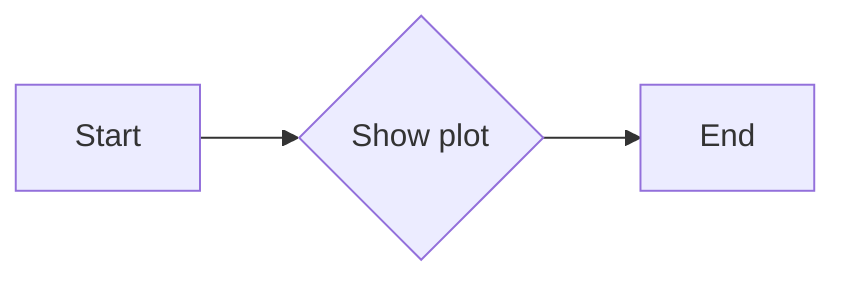

#### 带注释源码

```python
# 显示图形
plt.show()
```


### 关键组件信息

- `np.arange`：生成数组。
- `np.reshape`：重塑数组形状。
- `np.transpose`：转置数组。
- `np.flipud`：上下翻转数组。
- `np.fliplr`：左右翻转数组。
- `plt.figure`：创建图形。
- `ImageGrid`：创建图像网格。
- `ax.imshow`：显示图像。
- `plt.show`：显示图形。


### 潜在的技术债务或优化空间

- 数组操作可以进一步优化，例如使用更高效的 NumPy 函数。
- 图形显示可以优化，例如使用更高级的图像处理技术。
- 代码可以重构，以提高可读性和可维护性。


### 设计目标与约束

- 设计目标是创建一个简单的图像网格显示。
- 约束包括使用 NumPy 和 Matplotlib 库。


### 错误处理与异常设计

- 代码中没有显式的错误处理。
- 应该添加异常处理来确保代码的健壮性。


### 数据流与状态机

- 数据流从生成数组开始，然后进行一系列的数组操作，最后显示图像。
- 状态机不适用，因为代码没有明显的状态转换。


### 外部依赖与接口契约

- 代码依赖于 NumPy 和 Matplotlib 库。
- 接口契约由这些库提供。
```


### np.reshape

`np.reshape` 是 NumPy 库中的一个函数，用于重塑 NumPy 数组的形状。

参数：

- `a`：`numpy.ndarray`，需要重塑的数组。
- `newshape`：`int` 或 `tuple`，新形状的尺寸。

参数描述：

- `a`：输入数组，可以是任意维度的。
- `newshape`：指定数组的新形状，如果 `newshape` 的长度小于 `a` 的维度，则省略的维度将被折叠。

返回值类型：`numpy.ndarray`

返回值描述：返回一个新的数组，其形状由 `newshape` 指定，内容与原数组相同。

#### 流程图

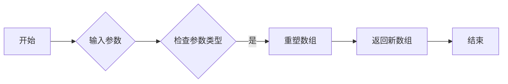

#### 带注释源码

```python
import numpy as np

# 创建一个 10x10 的数组
a = np.arange(100).reshape((10, 10))

# 使用 reshape 函数重塑数组形状
b = np.reshape(a, (10, 10))

# 打印原数组和重塑后的数组
print("Original array:")
print(a)
print("Reshaped array:")
print(b)
```


```python
import numpy as np

# 创建一个 10x10 的数组
a = np.arange(100).reshape((10, 10))

# 使用 reshape 函数重塑数组形状
b = np.reshape(a, (10, 10))

# 打印原数组和重塑后的数组
print("Original array:")
print(a)
print("Reshaped array:")
print(b)
```


### np.transpose

`np.transpose` 是 NumPy 库中的一个函数，用于转置一个数组的维度。

参数：

- `a`：`numpy.ndarray`，要转置的数组。

返回值：`numpy.ndarray`，转置后的数组。

#### 流程图

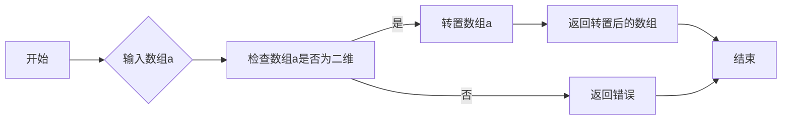

#### 带注释源码

```python
import numpy as np

def np_transpose(a):
    """
    转置一个数组的维度。

    参数：
    - a: numpy.ndarray，要转置的数组。

    返回值：
    - numpy.ndarray，转置后的数组。
    """
    return np.transpose(a)
```


### np.flipud

`np.flipud` 是 NumPy 库中的一个函数，用于翻转数组上下方向。

参数：

- `a`：`numpy.ndarray`，要翻转的数组。

返回值：`numpy.ndarray`，翻转后的数组。

#### 流程图

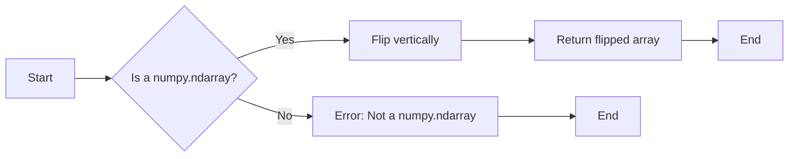

#### 带注释源码

```python
import numpy as np

def np_flipud(a):
    """
    Flip the input array up-down.

    Parameters:
    a : numpy.ndarray
        The array to be flipped.

    Returns:
    numpy.ndarray
        The flipped array.
    """
    return np.flip(a, axis=0)
```


### np.fliplr

`np.fliplr` 是 NumPy 库中的一个函数，用于水平翻转数组。

参数：

- `a`：`numpy.ndarray`，要翻转的数组。

返回值：`numpy.ndarray`，水平翻转后的数组。

#### 流程图

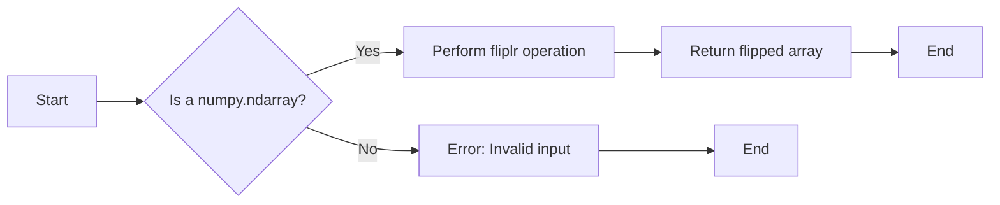

#### 带注释源码

```
import numpy as np

def fliplr(a):
    """
    Flip the array in the left-right direction.
    
    Parameters
    ----------
    a : numpy.ndarray
        The array to be flipped.
    
    Returns
    -------
    numpy.ndarray
        The flipped array.
    """
    return np.flipud(a[::-1])
```

请注意，上面的源码是 `np.fliplr` 函数的一个简化版本，实际实现可能有所不同。在给定的代码片段中，`np.fliplr` 被用于翻转一个二维数组 `im2`，如下所示：

```
im4 = np.fliplr(im2)
```

这段代码将 `im2` 水平翻转，并将结果存储在 `im4` 中。


### plt.figure

`plt.figure` is a function from the Matplotlib library that creates a new figure for plotting.

参数：

- `figsize`：`tuple`，指定图形的大小，例如 `(4., 4.)` 表示图形的宽度和高度分别为 4 英寸和 4 英寸。

返回值：`Figure`，返回创建的图形对象。

#### 流程图

```mermaid
graph LR
A[Start] --> B{Create figure with size}
B --> C[Set figure size to (4., 4.)]
C --> D[Return Figure object]
D --> E[End]
```

#### 带注释源码

```python
fig = plt.figure(figsize=(4., 4.))
```


### ImageGrid

该函数使用 `mpl_toolkits.axes_grid1.axes_grid.ImageGrid` 对象来排列和显示多个图像。

参数：

- `fig`：`matplotlib.figure.Figure`，当前图像的父图。
- `nrows_ncols`：`tuple`，网格的行数和列数。
- `axes_pad`：`float`，轴之间的填充。

返回值：`mpl_toolkits.axes_grid1.axes_grid.ImageGrid`，图像网格对象。

#### 流程图

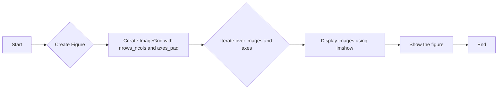

#### 带注释源码

```python
import matplotlib.pyplot as plt
import numpy as np
from mpl_toolkits.axes_grid1 import ImageGrid

# Create a figure
fig = plt.figure(figsize=(4., 4.))

# Create an ImageGrid with 2 rows and 2 columns, and 0.1 inch padding between axes
grid = ImageGrid(fig, 111, nrows_ncols=(2, 2), axes_pad=0.1)

# Iterate over the grid and images
for ax, im in zip(grid, [im1, im2, im3, im4]):
    # Display the image using imshow
    ax.imshow(im)
```


### zip

`zip` 函数用于将可迭代的对象组合成一个新的迭代器，其中每个元素是来自每个可迭代对象中相同位置的元素组成的一个元组。

参数：

- `grid`：`ImageGrid` 对象，图像网格的实例。
- `[im1, im2, im3, im4]`：列表，包含要显示的图像数组。

参数描述：

- `grid`：指定了图像网格的实例，用于在图中排列图像。
- `[im1, im2, im3, im4]`：指定了要显示的图像数组列表。

返回值：`zip` 返回一个迭代器，其中每个元素是一个包含来自 `grid` 和 `[im1, im2, im3, im4]` 中相同位置的元素的元组。

返回值描述：迭代器中的每个元组包含一个 `Axes` 对象和一个图像数组，用于在图像网格中显示图像。

#### 流程图

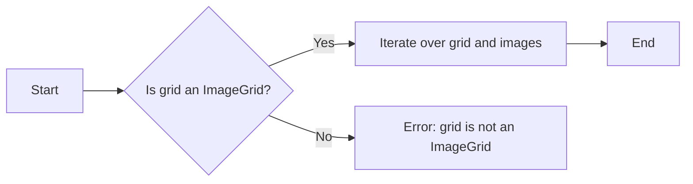

#### 带注释源码

```
for ax, im in zip(grid, [im1, im2, im3, im4]):
    # Iterating over the grid returns the Axes.
    ax.imshow(im)
```


### ImageGrid

`ImageGrid` 类用于创建一个图像网格，它是一个轴网格，用于在图中排列图像。

参数：

- `fig`：`Figure` 对象，图像网格所属的图形。
- `nrows_ncols`：元组，指定网格的行数和列数。
- `axes_pad`：浮点数，指定轴之间的间距。

参数描述：

- `fig`：指定了图像网格所属的图形。
- `nrows_ncols`：指定了网格的行数和列数。
- `axes_pad`：指定了轴之间的间距。

返回值：`ImageGrid` 对象。

返回值描述：返回一个图像网格对象，用于在图中排列图像。

#### 流程图

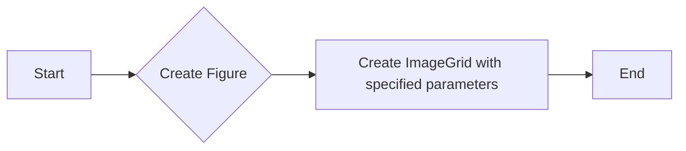

#### 带注释源码

```
grid = ImageGrid(fig, 111,  # similar to subplot(111)
                 nrows_ncols=(2, 2),  # creates 2x2 grid of Axes
                 axes_pad=0.1,  # pad between Axes in inch.
                 )
```


### imshow

`imshow` 函数用于显示图像。

参数：

- `ax`：`Axes` 对象，图像要显示的轴。
- `im`：图像数组。

参数描述：

- `ax`：指定了图像要显示的轴。
- `im`：指定了要显示的图像数组。

返回值：无。

返回值描述：无。

#### 流程图

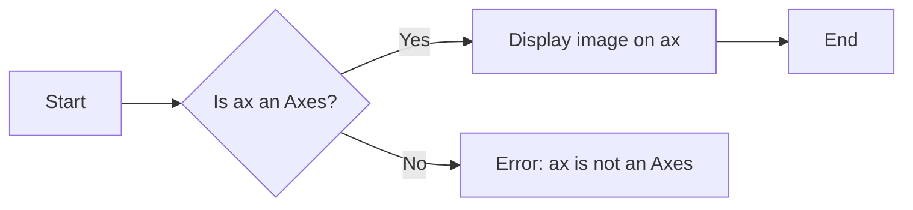

#### 带注释源码

```
ax.imshow(im)
```


### matplotlib.pyplot.figure

`figure` 函数用于创建一个新的图形。

参数：

- `figsize`：元组，指定图形的大小。

参数描述：

- `figsize`：指定了图形的大小。

返回值：`Figure` 对象。

返回值描述：返回一个图形对象，用于绘制图像。

#### 流程图

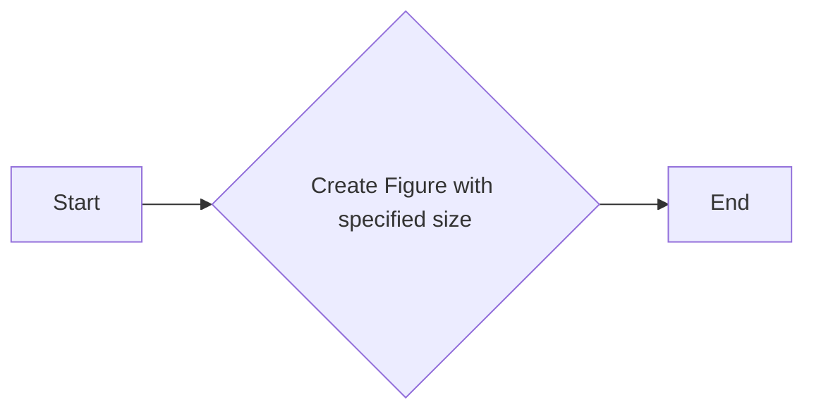

#### 带注释源码

```
fig = plt.figure(figsize=(4., 4.))
```


### matplotlib.pyplot.show

`show` 函数用于显示图形。

参数：无。

参数描述：无。

返回值：无。

返回值描述：无。

#### 流程图

```mermaid
graph LR
A[Start] --> B{Display the figure}
B --> C[End]
```

#### 带注释源码

```
plt.show()
```


### 关键组件信息

- `ImageGrid`：用于创建图像网格，排列图像。
- `imshow`：用于显示图像。
- `Figure`：用于创建图形，包含轴和图像。
- `plt`：matplotlib.pyplot模块，用于绘图和显示图形。


### 潜在的技术债务或优化空间

- 代码中使用了硬编码的图像数组，可以考虑使用函数或类来生成这些图像，以提高代码的可重用性和可维护性。
- 可以考虑添加错误处理，以处理图像加载失败或显示错误的情况。
- 可以优化图像显示的布局，例如通过调整轴间距和图像大小。


### 设计目标与约束

- 设计目标：创建一个简单的图像网格，用于展示多个图像。
- 约束：使用matplotlib库进行图像显示。


### 错误处理与异常设计

- 代码中没有显式的错误处理机制。
- 可以考虑添加异常处理，以捕获和处理可能发生的错误，例如图像加载失败或显示错误。


### 数据流与状态机

- 数据流：图像数组通过`zip`函数与轴网格相关联，然后通过`imshow`函数显示在图形中。
- 状态机：代码中没有使用状态机。


### 外部依赖与接口契约

- 外部依赖：matplotlib库。
- 接口契约：`ImageGrid`、`imshow`、`Figure`和`plt`等函数和类遵循matplotlib库的接口契约。


### plt.show()

显示当前图形。

参数：

- 无

返回值：无

#### 流程图

```mermaid
graph LR
A[开始] --> B{调用plt.show()}
B --> C[结束]
```

#### 带注释源码

```python
plt.show()  # 显示当前图形
```


### ImageGrid.imshow

该函数用于在matplotlib图像网格中显示图像。

参数：

- `im`：`numpy.ndarray`，要显示的图像数据。

返回值：无

#### 流程图

```mermaid
graph LR
A[Start] --> B[Create figure]
B --> C[Create ImageGrid]
C --> D[Iterate over grid]
D --> E[Display image]
E --> F[Show figure]
F --> G[End]
```

#### 带注释源码

```python
for ax, im in zip(grid, [im1, im2, im3, im4]):
    # Iterating over the grid returns the Axes.
    ax.imshow(im)
```


### ImageGrid.show

该函数用于显示图像网格。

参数：

- `fig`：`matplotlib.figure.Figure`，图像网格所属的Figure对象。
- `grid`：`mpl_toolkits.axes_grid1.axes_grid.ImageGrid`，图像网格对象。

返回值：无

#### 流程图

```mermaid
graph LR
A[Start] --> B[Create Figure]
B --> C[Create ImageGrid]
C --> D[Iterate over grid]
D --> E[Display image in each axis]
E --> F[Show the figure]
F --> G[End]
```

#### 带注释源码

```python
import matplotlib.pyplot as plt
import numpy as np
from mpl_toolkits.axes_grid1 import ImageGrid

# 创建图像数据
im1 = np.arange(100).reshape((10, 10))
im2 = im1.T
im3 = np.flipud(im1)
im4 = np.fliplr(im2)

# 创建Figure对象
fig = plt.figure(figsize=(4., 4.))

# 创建ImageGrid对象
grid = ImageGrid(fig, 111, nrows_ncols=(2, 2), axes_pad=0.1)

# 遍历网格，显示图像
for ax, im in zip(grid, [im1, im2, im3, im4]):
    ax.imshow(im)

# 显示图像网格
plt.show()
```


## 关键组件


### 张量索引

张量索引用于访问和操作多维数组（张量）中的元素。

### 惰性加载

惰性加载是一种延迟计算或资源分配的策略，直到实际需要时才进行。

### 反量化支持

反量化支持允许在量化过程中对数据进行逆量化，以便在量化后能够恢复原始数据。

### 量化策略

量化策略定义了如何将浮点数数据转换为固定点数表示，通常用于减少模型大小和加速计算。


## 问题及建议


### 已知问题

-   {问题1}：代码中使用了硬编码的图像尺寸和数量，这限制了代码的灵活性和可重用性。如果需要展示不同数量的图像或不同尺寸的图像，需要修改代码中的硬编码值。
-   {问题2}：代码没有提供任何错误处理机制，如果图像数据有问题或者matplotlib库无法正常工作，程序可能会崩溃。
-   {问题3}：代码没有提供任何日志记录或调试信息，这会使得在出现问题时难以追踪和解决问题。

### 优化建议

-   {建议1}：引入参数化，允许用户指定图像的数量和尺寸，从而提高代码的灵活性和可重用性。
-   {建议2}：添加异常处理，确保在出现错误时程序能够优雅地处理异常，并提供有用的错误信息。
-   {建议3}：引入日志记录，记录程序的运行状态和潜在的错误，以便于调试和问题追踪。
-   {建议4}：考虑使用更高级的图像处理库，如PIL或OpenCV，来处理图像，这些库提供了更丰富的图像处理功能。
-   {建议5}：如果图像数据来自外部源，考虑实现数据验证和清洗机制，以确保图像数据的质量。


## 其它


### 设计目标与约束

- 设计目标：实现一个简单的图像网格展示工具，能够展示四张图像，并使用matplotlib库进行图像的展示。
- 约束条件：仅使用matplotlib和numpy库，不引入额外的依赖。

### 错误处理与异常设计

- 错误处理：在代码中没有明显的错误处理机制，但应确保输入的图像数据是有效的，避免numpy操作时出现异常。
- 异常设计：未定义特定的异常处理机制，但应考虑在图像数据无效时抛出异常。

### 数据流与状态机

- 数据流：代码中首先创建四个图像数组，然后通过循环将它们传递给matplotlib的imshow函数进行展示。
- 状态机：代码中没有状态机的概念，它是一个简单的线性流程。

### 外部依赖与接口契约

- 外部依赖：代码依赖于matplotlib和numpy库。
- 接口契约：matplotlib的ImageGrid和imshow函数提供了展示图像的接口。


    