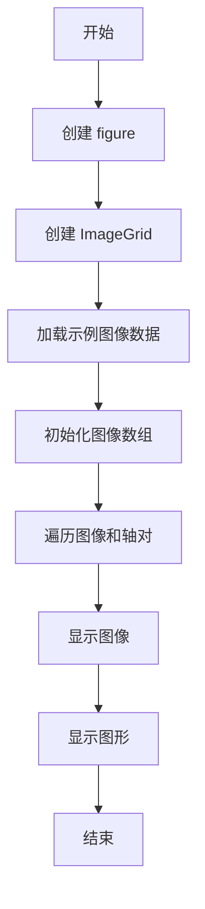
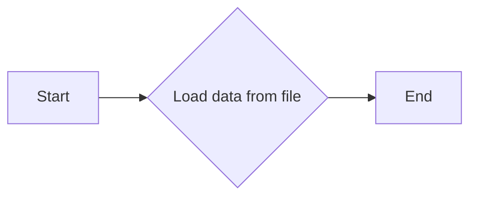

# `matplotlib\galleries\examples\axes_grid1\simple_axesgrid2.py` 详细设计文档

This code creates a simple image grid using matplotlib's ImageGrid to display multiple images of different sizes aligned together.

## 整体流程



## 类结构

```
ImageGrid (matplotlib's ImageGrid)
```

## 全局变量及字段


### `fig`
    
The main figure object where the images will be displayed.

类型：`matplotlib.figure.Figure`
    


### `grid`
    
The ImageGrid object that manages the layout of the subplots.

类型：`mpl_toolkits.axes_grid1.axes_grid.ImageGrid`
    


### `Z`
    
The sample data array used for the images.

类型：`numpy.ndarray`
    


### `im1`
    
The first image to be displayed in the grid.

类型：`numpy.ndarray`
    


### `im2`
    
The second image to be displayed in the grid, a subset of Z.

类型：`numpy.ndarray`
    


### `im3`
    
The third image to be displayed in the grid, a subset of Z.

类型：`numpy.ndarray`
    


### `vmin`
    
The minimum value for the colormap.

类型：`float`
    


### `vmax`
    
The maximum value for the colormap.

类型：`float`
    


### `ImageGrid.fig`
    
The figure object to which the ImageGrid is attached.

类型：`matplotlib.figure.Figure`
    


### `ImageGrid.nrows_ncols`
    
The number of rows and columns of the grid.

类型：`tuple`
    


### `ImageGrid.axes_pad`
    
The padding between axes in the grid.

类型：`float`
    


### `ImageGrid.label_mode`
    
The mode for labeling the axes in the grid.

类型：`str`
    


### `ImageGrid.imshow`
    
The method to display an image on an axis.

类型：`function`
    
    

## 全局函数及方法


### get_sample_data

获取示例数据，用于图像展示。

参数：

-  `filename`：`str`，示例数据的文件名。

返回值：`numpy.ndarray`，示例数据的numpy数组。

#### 流程图



#### 带注释源码

```python
def get_sample_data(filename):
    """
    Load sample data from a file.

    Parameters
    ----------
    filename : str
        The name of the file containing the sample data.

    Returns
    -------
    numpy.ndarray
        The loaded sample data as a numpy array.
    """
    return cbook.get_sample_data(filename)
```


### ImageGrid.imshow

该函数用于在matplotlib图像网格中显示图像。

参数：

- `im`：`numpy.ndarray`，图像数据，用于在网格中显示。
- `origin`：`str`，图像的起始位置，默认为"lower"。
- `vmin`：`float`，图像显示的最小值，默认为图像数据的最小值。
- `vmax`：`float`，图像显示的最大值，默认为图像数据的最大值。

返回值：`None`，无返回值。

#### 流程图

```mermaid
graph LR
A[开始] --> B{调用imshow()}
B --> C[结束]
```

#### 带注释源码

```python
for ax, im in zip(grid, [im1, im2, im3]):
    ax.imshow(im, origin="lower", vmin=vmin, vmax=vmax)
```


## 关键组件


### 张量索引与惰性加载

用于从大型数据集中索引和加载子集，以减少内存消耗和提高效率。

### 反量化支持

提供对图像数据反量化的支持，以便在图像处理过程中进行更精确的操作。

### 量化策略

定义了图像数据量化的策略，确保图像在显示和处理时保持一致性和准确性。


## 问题及建议


### 已知问题

-   **代码复用性低**：代码中直接使用硬编码的图像数据，没有提供灵活的方式来加载或生成不同的图像数据。
-   **可配置性差**：图像的尺寸、布局和样式都是硬编码的，没有提供参数来调整这些设置。
-   **异常处理缺失**：代码中没有异常处理机制，如果图像数据加载失败或绘图过程中出现错误，程序可能会崩溃。
-   **全局变量使用**：使用全局变量 `fig` 和 `grid` 可能导致代码难以维护和理解。

### 优化建议

-   **增加代码复用性**：通过将图像加载和绘图逻辑封装成函数，可以更容易地重用代码。
-   **提高可配置性**：提供参数来允许用户自定义图像的尺寸、布局和样式。
-   **添加异常处理**：在图像加载和绘图过程中添加异常处理，确保程序在遇到错误时能够优雅地处理。
-   **避免全局变量**：将全局变量替换为局部变量或参数传递，以提高代码的可读性和可维护性。
-   **文档和注释**：为代码添加详细的文档和注释，以便其他开发者能够理解代码的功能和结构。
-   **单元测试**：编写单元测试来验证代码的功能，确保代码的稳定性和可靠性。
-   **性能优化**：如果图像数据很大，可以考虑使用更高效的数据处理和绘图方法来提高性能。

## 其它


### 设计目标与约束

- 设计目标：实现一个简单的图像网格展示工具，能够展示不同大小的图像。
- 约束条件：使用matplotlib库中的ImageGrid功能，不使用额外的图像处理库。

### 错误处理与异常设计

- 错误处理：在图像加载或显示过程中，如果发生异常，应捕获异常并给出友好的错误信息。
- 异常设计：确保代码能够处理matplotlib库可能抛出的异常，如文件读取错误、图像显示错误等。

### 数据流与状态机

- 数据流：从样本数据中获取图像数据，通过ImageGrid进行布局和显示。
- 状态机：程序从初始化图像网格开始，到显示图像结束，没有复杂的状态转换。

### 外部依赖与接口契约

- 外部依赖：依赖于matplotlib库的ImageGrid功能。
- 接口契约：确保代码与matplotlib库的接口兼容，遵循matplotlib的API规范。

### 测试与验证

- 测试策略：编写单元测试，验证图像网格的布局和显示功能。
- 验证方法：通过比较实际显示的图像网格与预期结果，确保功能正确。

### 性能考量

- 性能指标：确保图像加载和显示过程快速，用户体验良好。
- 性能优化：考虑图像数据的大小和复杂度，优化图像处理和显示过程。

### 安全性考量

- 安全风险：确保代码不会因为外部输入而导致安全漏洞。
- 安全措施：对输入数据进行验证，防止恶意数据注入。

### 维护与扩展性

- 维护策略：保持代码简洁，易于理解和维护。
- 扩展性：设计时考虑未来可能的功能扩展，如支持更多图像格式、自定义布局等。


    