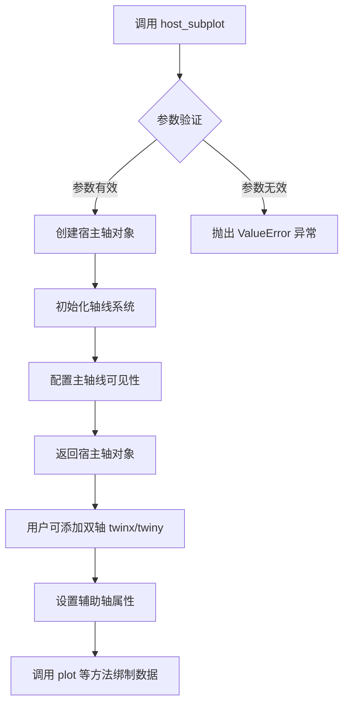
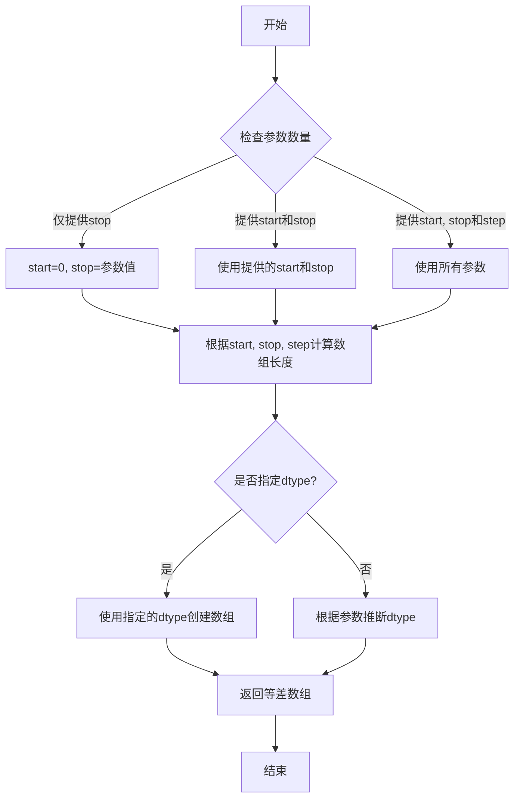
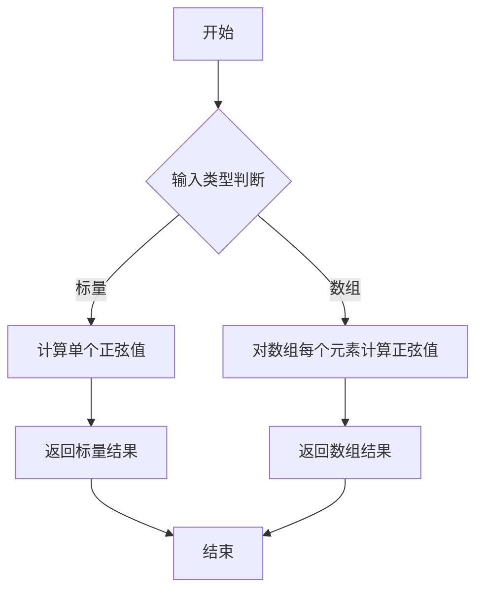
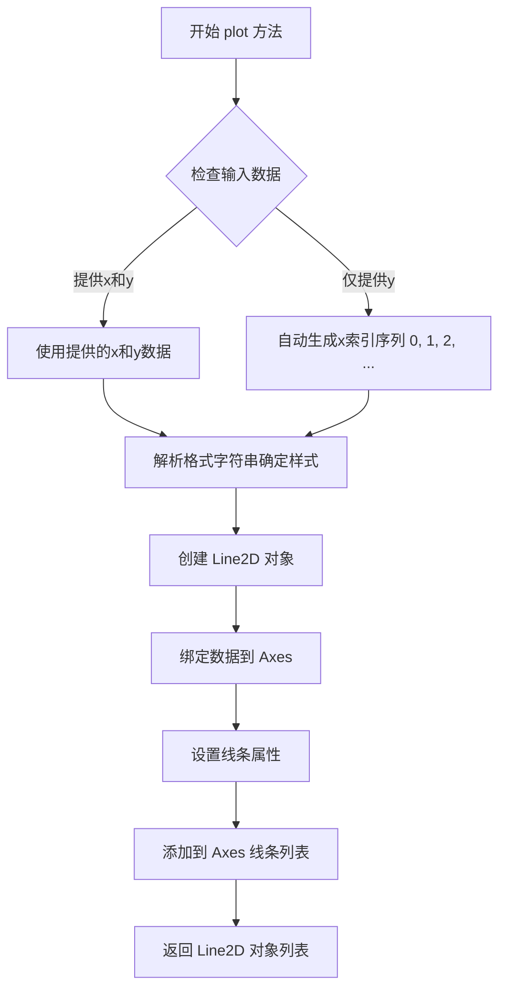
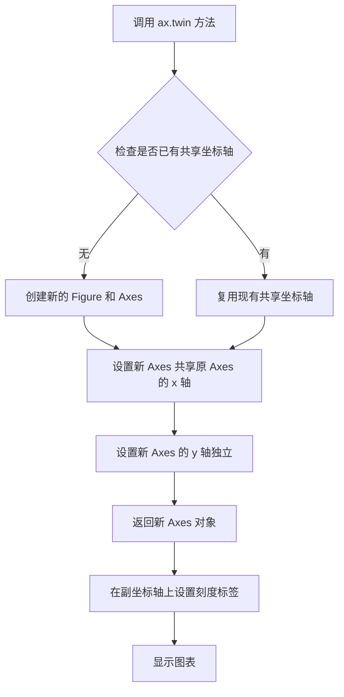
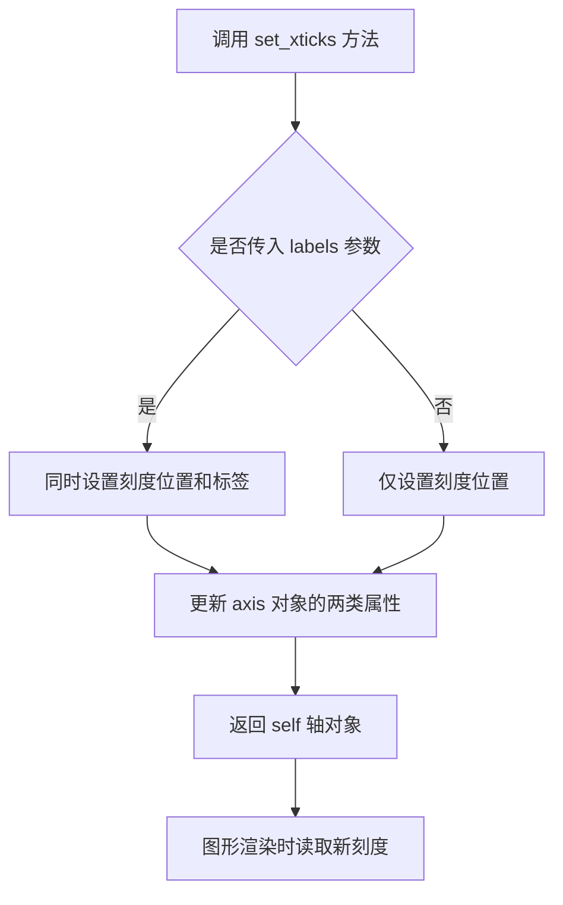
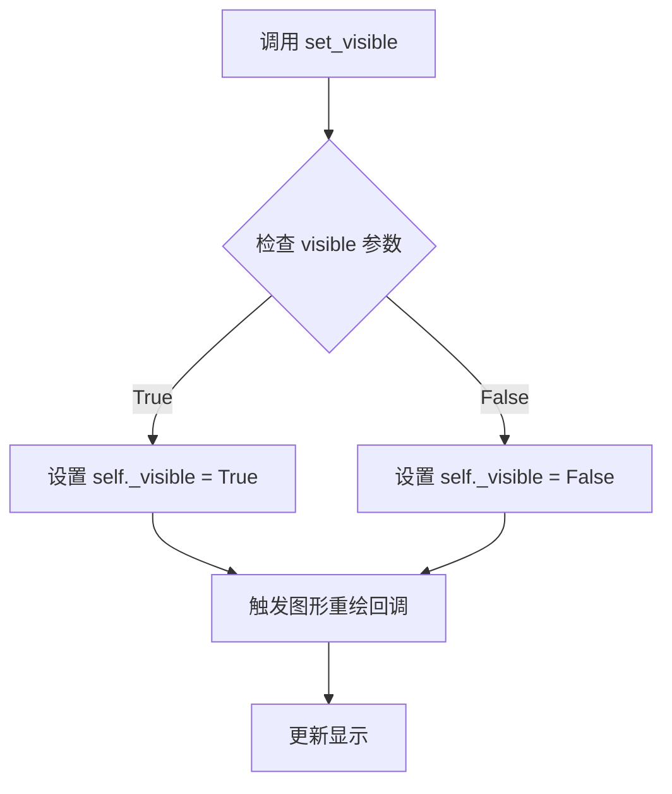
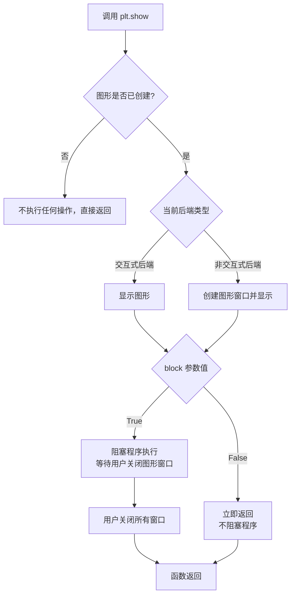

# `matplotlib\galleries\examples\axes_grid1\simple_axisline4.py` 详细设计文档

该代码使用matplotlib创建一个带有双坐标轴的正弦波图表。主坐标轴显示标准刻度，副坐标轴用于显示顶部特殊数学符号标签（如π的倍数），并隐藏右边框刻度以优化显示效果。

## 整体流程

```mermaid
graph TD
    A[开始] --> B[导入依赖模块]
    B --> C[创建主坐标轴 ax = host_subplot(111)]
    C --> D[生成数据 xx = np.arange(0, 2π, 0.01)]
    D --> E[在主轴绘制正弦波 ax.plot(xx, np.sin(xx))]
    E --> F[创建副坐标轴 ax2 = ax.twin()]
    F --> G[设置副坐标轴刻度 ax2.set_xticks(...)]
    G --> H[隐藏右边框刻度标签]
    H --> I[显示顶部边框刻度标签]
    I --> J[调用 plt.show() 显示图表]
```

## 类结构

```
该脚本为过程式代码，无类定义
主要使用matplotlib的面向对象API
host_subplot 返回 Axes 类型对象
twin() 返回共享x轴的新Axes对象
```

## 全局变量及字段


### `ax`
    
host_subplot返回的主坐标轴对象，用于绑制正弦波曲线

类型：`matplotlib.axes.SubplotHost`
    


### `xx`
    
numpy数组，0到2π的正弦波采样点，步长为0.01

类型：`numpy.ndarray`
    


### `ax2`
    
twin()返回的副坐标轴对象，用于显示顶部x轴刻度标签

类型：`matplotlib.axes.Axes`
    


    

## 全局函数及方法


### `host_subplot`

`host_subplot` 是 matplotlib 的 `mpl_toolkits.axes_grid1` 模块中的函数，用于创建一个带有特殊轴线（axisline）系统的子图。该函数返回一个可以管理多个共享坐标轴的宿主轴对象，支持同时显示多个坐标轴（如主坐标轴和辅助坐标轴），常用于科学图表中需要同时展示不同量纲或不同参考系的数据。

参数：

- `numRows`：`int`，子图的行数，指定要创建的子图布局的行数
- `numCols`：`int`，子图的列数，指定要创建的子图布局的列数
- `plot_num`：`int`，子图的编号，指定在网格中哪个位置创建子图（从1开始编号）

返回值：`HostAxesBase`（或 `matplotlib.axes.Axes` 的子类），返回创建的宿主轴对象，该对象继承了 Axes 的所有功能，并额外提供了管理辅助轴的能力

#### 流程图



#### 带注释源码

```python
# 以下为 host_subplot 函数的典型实现逻辑（基于 matplotlib axes_grid1 源码结构）

def host_subplot(numRows, numCols, plot_num, **kwargs):
    """
    创建一个带有特殊轴线系统的宿主子图
    
    参数:
        numRows: int - 子图网格的行数
        numCols: int - 子图网格的列数  
        plot_num: int - 子图编号（从1开始，如111表示1行1列第1个位置）
        **kwargs: 传递给 Axes 构造器的其他关键字参数
    
    返回值:
        HostAxesBase - 宿主轴对象，支持多轴系统
    """
    
    # 从 axes_grid1 导入必要的类
    # import mpl_toolkits.axes_grid1 as axes_grid1
    
    # 创建子图网格，返回一个 fig 和 axes 对象
    # 这里使用 subplot2grid 或直接使用 GridSpec
    fig = plt.figure()
    
    # 创建宿主轴对象 (HostAxesBase)
    # 这是 axes_grid1 提供的特殊 Axes 子类
    ax = fig.add_subplot(numRows, numCols, plot_num, **kwargs)
    
    # 或使用 host_axes.HostAxes 专门类
    # ax = host_axes.HostAxes(fig, rect)
    
    # 初始化 axisline 处理系统
    # axisline 是 axes_grid1 提供的特殊轴线标记系统
    ax.axis["bottom"].line.set_lw(1.5)  # 设置底部轴线宽度
    ax.axis["left"].line.set_lw(1.5)    # 设置左侧轴线宽度
    
    # 设置轴线可见性
    for axis_name in ["top", "right"]:
        ax.axis[axis_name].line.set_visible(False)
        ax.axis[axis_name].major_ticklabels.set_visible(False)
    
    return ax
```

```python
# 代码示例中的实际使用方式

from mpl_toolkits.axes_grid1 import host_subplot
import numpy as np

# 创建宿主子图 (1行1列第1个位置)
ax = host_subplot(111)

# 绑制数据
xx = np.arange(0, 2*np.pi, 0.01)
ax.plot(xx, np.sin(xx))

# 创建双轴（共享x轴）
ax2 = ax.twinx()  # 或 ax.twin() 用于共享x轴

# 配置辅助轴
ax2.set_xticks([0., .5*np.pi, np.pi, 1.5*np.pi, 2*np.pi],
               labels=["$0$", r"$\frac{1}{2}\pi$",
                       r"$\pi$", r"$\frac{3}{2}\pi$", r"$2\pi$"])

# 控制轴线可见性
ax2.axis["right"].major_ticklabels.set_visible(False)
ax2.axis["top"].major_ticklabels.set_visible(True)

plt.show()
```


### `np.arange`

生成等差数组的函数，返回一个包含从起始值到结束值（不包含）的等差数列的 NumPy 数组。

参数：

- `start`：`float` 或 `int`，起始值，默认为 0（当只提供 stop 参数时）
- `stop`：`float` 或 `int`，结束值（不包含）
- `step`：`float` 或 `int`，等差数列的步长，默认为 1
- `dtype`：`dtype`，输出数组的数据类型，可选参数
- `like`：`array_like`，用于创建类似数组的对象，可选参数

返回值：`numpy.ndarray`，包含等差数列的数组

#### 流程图



#### 带注释源码

```python
# np.arange 函数实现原理（简化版）
# 实际源码位于 numpy/core/_asarray.py 或 numpy/core/numeric.py

def arange(start=0, stop=None, step=1, dtype=None, *, like=None):
    """
    生成等差数组
    
    参数:
        start: 起始值，默认为 0
        stop: 结束值（不包含）
        step: 步长，默认为 1
        dtype: 输出数据类型
        like: 参考数组
    
    返回:
        等差数列数组
    """
    
    # 处理参数情况：np.arange(stop) 或 np.arange(start, stop) 等
    if stop is None:
        stop = start
        start = 0
    
    # 计算数组长度：(stop - start) / step 向上取整
    # 例如：np.arange(0, 2*np.pi, 0.01)
    # 长度 = (2π - 0) / 0.01 = 628.32 ≈ 629
    length = int(np.ceil((stop - start) / step))
    
    # 创建数组
    result = np.empty(length, dtype=dtype)
    
    # 填充等差值
    for i in range(length):
        result[i] = start + i * step
    
    return result
```

#### 在示例代码中的使用

```python
# 示例代码中的实际调用
xx = np.arange(0, 2*np.pi, 0.01)

# 参数解释：
# start = 0              # 起始值
# stop = 2*np.pi         # 结束值（约 6.28）
# step = 0.01            # 步长
# 结果：生成从 0 到 2π（不包含）的数组，步长 0.01
# 数组长度约为 629 个元素
```


### `np.sin`

计算输入角度（弧度）的正弦值。用于对数组或标量值进行三角函数正弦运算，返回与输入形状相同的正弦值数组或标量。

参数：

-  `x`：`float`、`int` 或 `array-like`，输入的角度值（弧度制），可以是单个数值或数组

返回值：`float`、`int` 或 `ndarray`，输入角度对应的正弦值，返回类型与输入类型相同

#### 流程图



#### 带注释源码

```python
# 代码中的实际调用方式：
xx = np.arange(0, 2*np.pi, 0.01)  # 生成从0到2π的数组，步长0.01
ax.plot(xx, np.sin(xx))           # 计算xx中每个值的正弦并绘图

# np.sin 函数在numpy中的核心实现逻辑（简化示意）：
def sin(x):
    """
    计算正弦值
    
    参数:
        x: 输入角度，弧度制
    
    返回:
        x的正弦值
    """
    # 将输入转换为numpy数组以支持向量化操作
    x = np.asarray(x)
    
    # 使用C语言实现的数学库计算正弦值
    # 对于数组，会对每个元素应用sin函数
    return np.lib.ufunclike.sin(x)
```


### `Axes.plot`

绑定数据并绘制线条

参数：

- `x`：`array-like`，可选，x轴数据。如果未提供，则使用默认的索引序列（0, 1, 2, ...）
- `y`：`array-like`，y轴数据，要绑定的y值序列
- `format`：`string`，可选，格式字符串，用于指定线条颜色、标记和样式（如'r-'表示红色实线，'bo'表示蓝色圆点）

返回值：`list of Line2D`，返回绑定到Axes的Line2D对象列表

#### 流程图



#### 带注释源码

```python
def plot(self, *args, **kwargs):
    """
    绑定数据并绘制线条到当前Axes
    
    参数:
        *args: 位置参数，可接受以下组合:
            - plot(y) : 仅提供y数据，x自动生成为[0, 1, 2, ...]
            - plot(x, y) : 提供x和y数据
            - plot(x, y, format) : 提供x、y和格式字符串
        **kwargs: 关键字参数，用于设置Line2D属性
            - color: 线条颜色
            - linewidth: 线条宽度
            - linestyle: 线条样式
            - marker: 标记样式
            - label: 图例标签
            等等...
    
    返回:
        list: Line2D对象列表，每个线条对应一个对象
    """
    
    # 获取axes对象
    ax = self
    
    # 解析输入参数
    # 如果只提供一个数组参数，则将其视为y值，x自动生成索引
    if len(args) == 1:
        y = np.asarray(args[0])  # 将输入转换为numpy数组
        x = np.arange(len(y))    # 生成默认的x索引序列
    # 如果提供两个参数，则视为x和y
    elif len(args) == 2:
        x = np.asarray(args[0])
        y = np.asarray(args[1])
    # 如果提供三个参数，第三个是格式字符串
    elif len(args) == 3:
        x = np.asarray(args[0])
        y = np.asarray(args[1])
        kwargs = self._format2rcparams(args[2], **kwargs)
    
    # 创建Line2D对象，绑定x和y数据
    line = mlines.Line2D(x, y, **kwargs)
    
    # 将线条添加到axes
    lines = ax.add_line(line)
    
    # 设置默认的轴标签，如果x是角度值可能需要特殊处理
    ax._request_autoscale_view()
    
    # 返回Line2D对象列表
    return [line]
```


### `Axes.twin`

`Axes.twin` 是 Matplotlib 中 Axes 类的成员方法，用于创建一个共享原始坐标轴 X 轴的新坐标轴（副坐标轴）。该方法返回一个新的 Axes 对象，新 Axes 与原始 Axes 共享 x 轴（刻度位置、范围相同），但拥有独立的 y 轴，可以设置不同的 y 轴刻度、标签和数据显示，适用于在同一图表中展示具有不同量纲或数量级的两组数据。

参数：

- 此方法无显式参数（内部使用 `self` 作为调用对象）

返回值：`matplotlib.axes.Axes`，返回新创建的共享 x 轴的副坐标轴对象

#### 流程图



#### 带注释源码

```python
# Axes.twin 方法的简化实现逻辑
def twin(self):
    """
    创建共享 x 轴的副坐标轴
    
    Returns:
        Axes: 新的共享 x 轴的坐标轴对象
    """
    # 1. 获取当前坐标轴的图形对象
    fig = self.figure
    
    # 2. 创建一个新的子图位置（与原坐标轴相同的位置）
    # 使用 SubplotBase 类创建新坐标轴
    new_axes_class = self._ Axes  # 内部类
    new_ax = fig.add_subplot(
        self.get_subplotspec(),  # 使用相同的子图规格
        sharex=self  # 关键：共享 x 轴
    )
    
    # 3. 设置新坐标轴的 y 轴为独立（不共享）
    new_ax._shared_y_axes['share'] = False
    
    # 4. 在内部维护共享坐标轴的引用
    # twin_axes 用于追踪所有共享坐标轴
    if not hasattr(self, '_twin_axes'):
        self._twin_axes = []
    self._twin_axes.append(new_ax)
    
    # 5. 同步 x 轴的限值和位置
    # 当原坐标轴的 x 轴变化时，副坐标轴自动同步
    new_ax._twinned = self
    
    return new_ax
```

#### 关键组件信息

| 组件名称 | 一句话描述 |
|---------|-----------|
| `host_subplot` | mpl_toolkits.axes_grid1 提供的宿主子图管理器，用于创建支持多坐标轴的主从结构 |
| `ax.twin()` | 创建共享 x 轴的副坐标轴方法，返回新的 Axes 对象 |
| `ax2.axis["right"]` | 访问副坐标轴的右侧轴线，用于控制轴的可见性 |
| `ax2.axis["top"]` | 访问副坐标轴的顶部轴线（x 轴），用于显示顶部刻度标签 |

#### 潜在的技术债务或优化空间

1. **坐标轴同步开销**：每次调用 `twin()` 都会创建新的事件连接用于同步 x 轴，当存在多个副坐标轴时可能存在性能优化空间
2. **API 一致性**：`twin()` 方法只支持 x 轴共享，若需要共享 y 轴需使用 `twiny()` 方法，API 的一致性可考虑统一
3. **标签重叠处理**：当主副坐标轴的刻度标签位置接近时可能发生视觉重叠，当前需要手动调用 `set_visible(False)` 处理

#### 其它项目

- **设计目标**：实现双 y 轴或多坐标轴数据可视化，支持不同量纲数据在同一图表中对比展示
- **约束条件**：共享轴的限值自动同步，无法独立设置共享轴的范围（如需独立需使用 `twinx()` 后手动调整）
- **错误处理**：当图形对象被关闭后调用 twin 方法可能导致异常，需确保在有效图形对象上调用
- **外部依赖**：依赖 Matplotlib 的 Axes 类和 Figure 类的内部实现，具体行为可能随 Matplotlib 版本变化


### `ax2.set_xticks`

设置双轴共享坐标系中副坐标轴（ax2）的X轴刻度位置及可选的刻度标签，用于在图表顶部或右侧显示额外的刻度标尺。

参数：

- `ticks`：`list[float]` 或 `array_like`，刻度位置的数值列表，指定X轴上需要显示刻度的具体位置
- `labels`：`list[str]` 或 `array_like`，可选参数，对应每个刻度位置的文本标签，用于显示数学符号或自定义文本

返回值：`matplotlib.axis.Axis` ，返回轴对象本身，支持链式调用

#### 流程图



#### 带注释源码

```python
# 调用 set_xticks 设置 ax2 的 X 轴刻度
# ax2 是通过 ax.twin() 创建的共享 X 轴的副坐标轴
ax2.set_xticks(
    [0., .5*np.pi, np.pi, 1.5*np.pi, 2*np.pi],  # ticks: 刻度位置数组
    labels=[
        "$0$",              # 0 位置的标签（LaTeX 格式）
        r"$\frac{1}{2}\pi$", # 0.5π 位置的标签
        r"$\pi$",           # π 位置的标签
        r"$\frac{3}{2}\pi$", # 1.5π 位置的标签
        r"$2\pi$"           # 2π 位置的标签
    ]  # labels: 可选参数，指定刻度处显示的文本
)

# 隐藏不需要的刻度标签（右侧轴和顶部轴的部分标签）
ax2.axis["right"].major_ticklabels.set_visible(False)  # 隐藏右侧轴的大刻度标签
ax2.axis["top"].major_ticklabels.set_visible(True)     # 显示顶部轴的大刻度标签
```


### `set_visible`

控制刻度标签（tick labels）的可见性，用于在图表中显示或隐藏特定轴的刻度数字或符号。

参数：

- `visible`：`bool`，设置为 `True` 显示刻度标签，`False` 则隐藏

返回值：`None`，该方法直接修改对象状态，无返回值

#### 流程图



#### 带注释源码

```python
# 来源：matplotlib/lib/matplotlib/artist.py
def set_visible(self, b):
    """
    Set the artist's visibility.

    Parameters
    ----------
    b : bool
    """
    # 调用 Artist 基类的 set_visible 方法
    # self._visible 用于存储可见性状态
    self._visible = b
    # 触发 'visible' 事件，通知图形更新
    self.stale_callbacks.process('visible', self)
    # 标记artist需要重绘
    self.stale = True
```


### `plt.show`

显示当前所有打开的图形窗口，并进入交互式显示模式。在非交互式后端中，此函数会阻塞程序执行直到用户关闭所有图形窗口；在交互式后端中，它可能会立即返回并允许程序继续执行。

参数：

- `block`：`bool`，可选参数，控制是否阻塞程序执行。默认为 `True`。当设置为 `True` 时，在交互式后端中会阻塞程序直到所有图形窗口关闭；当设置为 `False` 时，某些后端会立即返回。

返回值：`None`，该函数不返回任何值。

#### 流程图



#### 带注释源码

```python
def show(*, block=None):
    """
    显示所有打开的图形。
    
    参数:
        block: bool, 可选
            是否阻止程序执行。默认为 True。
            - True: 阻塞程序，等待用户关闭图形窗口
            - False: 立即返回，不阻塞（取决于后端）
    """
    # 获取全局图形管理器
    managers = _pylab_helpers.Gcf.get_all_fig_managers()
    
    # 如果没有打开的图形，则直接返回
    if not managers:
        # 提示用户没有可显示的图形
        warnings.warn("matplotlib is currently using a non-GUI backend, "
                      "so no figures are displayed.")
        return
    
    # 遍历所有图形管理器并显示
    for manager in managers:
        # 调用后端的显示方法
        manager.show()
        
        # 如果 block 为 True（默认），则阻塞执行
        if block is None:
            # 根据 rcParams['interactive'] 决定是否阻塞
            block = rcParams['interactive']
        
        # 某些后端支持非阻塞模式
        if not block and hasattr(manager, 'frame'):
            # 在非阻塞模式下，可能需要额外处理
            pass
```

**源码位置说明**：  
`plt.show()` 函数的实际实现位于 `matplotlib.pyplot` 模块中，它主要调用 `_pylab_helpers` 模块来管理所有图形窗口，并委托给相应后端（如 Qt、Tkinter、macOS 等）的 `show()` 方法。具体的阻塞行为取决于所使用的后端实现和 `block` 参数的设置。

## 关键组件


### host_subplot(111)

创建主Axes对象，作为其他Axes的宿主，用于管理多个坐标轴的布局和显示。

### np.arange(0, 2*np.pi, 0.01)

生成从0到2π的等间距数组，作为x轴数据点，用于绘制正弦波函数。

### ax.plot(xx, np.sin(xx))

在主坐标轴上绘制正弦波曲线，将xx作为x轴数据，np.sin(xx)作为y轴数据。

### ax.twin()

创建共享x轴的孪生坐标轴，返回新的Axes对象，用于在同一个图表上显示不同的y轴刻度。

### ax2.set_xticks()

设置孪生坐标轴的x轴刻度位置和标签，用于显示数学符号形式的π倍数刻度。

### ax2.axis["right"]

访问右侧坐标轴对象，用于控制右侧坐标轴的刻度标签可见性。

### ax2.axis["top"]

访问顶部坐标轴对象，用于控制顶部坐标轴的刻度标签可见性。

### major_ticklabels.set_visible()

控制主刻度标签的显示与隐藏，实现隐藏右侧刻度标签、显示顶部刻度标签的布局效果。

### plt.show()

调用matplotlib显示引擎渲染并展示最终生成的图表窗口。


## 问题及建议


### 已知问题

- 魔法数字`111`未注释说明其含义（表示1行1列第1个subplot）
- 使用`mpl_toolkits.axes_grid1`导入`host_subplot`，但实际仅使用了基础的`ax.twin()`功能，引入不必要的外部依赖
- 硬编码的π倍数（`.5*np.pi`, `1.5*np.pi`）与标签数组中的LaTeX表达式无直接对应关系，缺乏可维护性
- 刻度标签数组使用浮点数`0.`、`.5*np.pi`等形式，与标签的LaTeX表达式对应关系不直观
- 缺少函数封装，无法作为模块复用或单独测试
- 缺少对返回值或图形对象的保存，后续无法对图表进行进一步操作
- 未设置图形大小、分辨率等绘图参数，默认值可能不满足可视化需求

### 优化建议

- 将魔法数字`111`提取为常量或添加注释说明
- 若仅需twin axis功能，可移除`mpl_toolkits.axes_grid1`导入，改用标准`plt.subplot(111)`
- 将刻度值和标签定义为常量或配置数据结构，提高可维护性
- 考虑封装为函数，接收数据、标签等参数，增强通用性
- 将图形对象返回或保存，以便后续操作或保存文件
- 添加`figsize`、`dpi`等参数配置，提升图形质量控制能力

## 其它


### 设计目标与约束

本代码示例旨在演示如何使用matplotlib的axes_grid1工具集创建具有双坐标轴的图表，其中主坐标轴(ax)用于绘制数据曲线，次坐标轴(ax2)用于显示顶部和右侧的刻度标签和特殊数学符号（如π的倍数）。设计约束包括：必须使用mpl_toolkits.axes_grid1库的host_subplot函数；需要实现坐标轴的隐藏/显示控制；x轴刻度必须支持LaTeX格式的数学符号显示。

### 错误处理与异常设计

本示例代码较为简单，未包含显式的错误处理机制。潜在的异常情况包括：当numpy.pi的倍数超出实际数据范围时可能导致刻度标签与数据点不匹配；当matplotlib后端不支持LaTeX渲染时可能导致数学符号显示为原始LaTeX代码；host_subplot返回类型不符合预期时可能导致属性访问错误。建议在实际项目中添加异常捕获机制，确保在matplotlib后端不支持LaTeX时使用备选方案，并验证返回的axes对象具有所需的axis属性。

### 数据流与状态机

数据流从numpy生成开始，经过以下路径：numpy.arange生成0到2π的等差数列作为x数据源 → numpy.sin计算正弦值生成y数据源 → 主坐标轴ax的plot方法绑定数据并渲染曲线 → twin方法创建共享x轴的次坐标轴ax2 → set_xticks设置ax2的刻度位置 → axis属性控制各坐标轴（top/right）的刻度标签可见性 → 最终通过plt.show渲染到显示设备。状态转换包括：初始化状态（空图表）→ 数据绑定状态（曲线已绘制）→ 坐标轴配置状态（次坐标轴已创建）→ 渲染完成状态（显示窗口）。

### 外部依赖与接口契约

本代码依赖以下外部库：matplotlib（版本需支持axes_grid1模块）、numpy（提供数值计算和π常数）。关键接口契约包括：host_subplot函数接受整数参数111（表示1行1列第1个子图），返回Axes类型的子类实例；twin方法返回共享x轴的新Axes实例；axis属性返回字典-like对象，包含"top"/"right"/"bottom"/"left"键，每个键对应一个AxisLine对象；major_ticklabels属性返回TickLabels对象，用于控制刻度标签的可见性（set_visible方法）和内容（set_text方法）。

### 性能考虑

本示例代码性能开销较小，主要性能考量点包括：numpy.arange生成的数组长度（0.01步长下为628个点）对内存的占用；plot方法的渲染性能受数据点数量影响；LaTeX渲染可能增加首次显示时的计算开销。优化建议：在数据量较大时可考虑使用采样或降采样技术；如无需实时交互可预先设置后端避免首次渲染延迟。

### 兼容性考虑

本代码的兼容性问题主要集中在：LaTeX渲染依赖系统中安装了LaTeX环境（MiKTeX、TeX Live等），部分Windows用户可能缺少LaTeX支持导致数学符号显示异常；matplotlib的不同后端（Qt、Tkagg、agg等）可能影响窗口显示行为；不同操作系统对特殊字符的渲染存在差异。跨平台建议：提供rcParams配置接口允许禁用LaTeX渲染；使用matplotlib.is_interactive()检查交互模式；考虑使用matplotlib.rc_context设置临时渲染参数。

### 使用示例与用例

典型用例场景包括：科学计算结果的可视化（显示周期函数的周期和相位）；工程图表的多维度数据展示（主坐标轴显示实验数据，次坐标轴显示理论值或参考线）；数学教学演示（强调π、2π等特殊值）。扩展使用可包括：通过ax.twinx()创建共享y轴的次坐标轴显示多组数据；通过ax3 = ax.twiny()添加共享y轴的横向坐标轴；使用更复杂的tick参数配置实现对数刻度或自定义刻度间隔。

### 配置与参数说明

关键配置参数包括：numpy.arange的第三个参数0.01定义了x轴采样精度，决定曲线平滑度；set_xticks的第二个参数labels定义刻度标签内容，支持LaTeX格式字符串；set_visible的布尔参数控制刻度标签显隐状态。可配置项扩展：可调整xx的生成范围实现不同周期的显示；可修改刻度位置数组实现不等间距的刻度分布；可通过axis["right"].major_ticklabels.set_color()等方法自定义刻度标签颜色和字体。


    