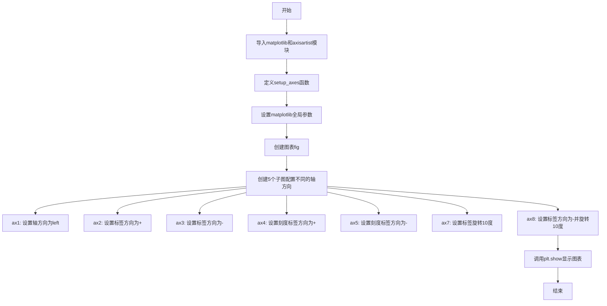

# `matplotlib\galleries\examples\axisartist\axis_direction.py` 详细设计文档

该代码是一个matplotlib可视化示例，演示了如何使用axisartist工具包自定义坐标轴的方向，包括轴标签方向、刻度标签方向以及标签旋转等设置。

## 整体流程



## 类结构

```
无自定义类，仅包含模块级函数和全局变量
```

## 全局变量及字段


### `plt`
    
全局matplotlib.pyplot模块，用于创建图形和设置参数。

类型：`module`
    


### `axisartist`
    
全局mpl_toolkits.axisartist模块，提供轴的增强绘制功能。

类型：`module`
    


### `fig`
    
matplotlib.figure.Figure对象，表示整个图形窗口。

类型：`matplotlib.figure.Figure`
    


### `ax1`
    
子图1的轴对象，展示轴方向设置为左侧。

类型：`matplotlib.axes`
    


### `ax2`
    
子图2的轴对象，展示标签方向为正。

类型：`matplotlib.axes`
    


### `ax3`
    
子图3的轴对象，展示标签方向为负。

类型：`matplotlib.axes`
    


### `ax4`
    
子图4的轴对象，展示刻度标签方向为正。

类型：`matplotlib.axes`
    


### `ax5`
    
子图5的轴对象，展示刻度标签方向为负。

类型：`matplotlib.axes`
    


### `ax7`
    
子图7的轴对象，展示标签旋转10度。

类型：`matplotlib.axes`
    


### `ax8`
    
子图8的轴对象，展示标签方向为负且旋转10度。

类型：`matplotlib.axes`
    


### `ax`
    
setup_axes函数内的局部变量，表示当前创建的轴对象。

类型：`axisartist.Axes`
    


    

## 全局函数及方法


### `setup_axes(fig, pos)`

该函数用于在matplotlib图表中创建并配置一个使用axisartist工具包的子图，设置了自定义的浮动坐标轴，返回配置完成的Axes对象供后续图形绘制和标签设置使用。

参数：

- `fig`：`matplotlib.figure.Figure`，Matplotlib的图形对象，作为子图的容器
- `pos`：`int` 或 `tuple`，子图的位置参数，传递给`add_subplot`方法（如251表示2行5列第1个位置）

返回值：`mpl_toolkits.axisartist.axislines.Axes`，配置好的axisartist Axes对象，包含自定义的浮动坐标轴

#### 流程图

```mermaid
flowchart TD
    A[开始 setup_axes] --> B[接收fig和pos参数]
    B --> C[使用fig.add_subplot创建子图<br/>axes_class=axisartist.Axes]
    C --> D[设置y轴范围: -0.1 到 1.5]
    D --> E[设置y轴刻度: 0, 1]
    E --> F[隐藏所有默认坐标轴<br/>ax.axis[:].set_visible(False)]
    F --> G[创建新的浮动x轴<br/>ax.new_floating_axis]
    G --> H[设置轴线样式为箭头<br/>set_axisline_style]
    I[返回配置好的ax对象]
    H --> I
```

#### 带注释源码

```python
def setup_axes(fig, pos):
    """
    创建并配置一个使用axisartist的子图Axes对象
    
    Parameters:
        fig: matplotlib.figure.Figure对象，图表容器
        pos: int或tuple，子图位置参数
    
    Returns:
        axisartist.Axes: 配置好的Axes对象
    """
    
    # 使用fig的add_subplot方法创建子图，指定axes_class为axisartist.Axes
    # 这会创建一个支持axisartist功能的坐标轴对象
    ax = fig.add_subplot(pos, axes_class=axisartist.Axes)

    # 设置y轴的显示范围，从-0.1到1.5
    # y轴范围设置得比刻度值稍大，以便留出空白区域
    ax.set_ylim(-0.1, 1.5)
    
    # 设置y轴的主要刻度位置为0和1
    ax.set_yticks([0, 1])

    # 隐藏所有默认的坐标轴（x轴、y轴、主坐标轴、边框等）
    # axis[:]是一个切片操作，指向所有坐标轴
    ax.axis[:].set_visible(False)

    # 创建一个新的浮动x轴（floating axis）
    # 参数1表示水平方向（0为垂直，1为水平）
    # 参数0.5表示轴在y=0.5的位置穿过
    ax.axis["x"] = ax.new_floating_axis(1, 0.5)
    
    # 设置x轴的线条样式：箭头("->")，线宽1.5
    # axisline_style定义坐标轴末端的箭头样式
    ax.axis["x"].set_axisline_style("->", size=1.5)

    # 返回配置好的axisartist Axes对象
    return ax
```

## 关键组件


### matplotlib.figure.Figure

用于创建整个图形容器，包含多个子图的位置管理和布局调整。

### mpl_toolkits.axisartist.Axes

继承自matplotlib Axes的特殊坐标轴类，提供更灵活的坐标轴定制功能，支持浮动轴（floating axis）和轴方向控制。

### setup_axes 函数

创建并配置axisartist坐标轴，设置基础样式和浮动轴。

### axisartist 浮动轴 (Floating Axis)

通过 `ax.new_floating_axis(1, 0.5)` 创建的浮动坐标轴，支持独立的方向和标签设置。

### 坐标轴方向控制组件

包含轴标签方向（axislabel_direction）和刻度标签方向（ticklabel_direction）的控制机制。


## 问题及建议


### 已知问题

- **魔法数字和硬编码值**：子图位置（251, 252, 253, 254, 255, 257, 258）、坐标轴范围（-0.1, 1.5）、刻度值（[0, 1]）等均以硬编码形式存在，缺乏配置常量统一管理，未来调整成本高
- **代码重复**：多个子图（如ax2、ax3、ax7、ax8）设置标签文本和切换刻度标签的代码完全重复，未进行函数抽象
- **无错误处理机制**：`setup_axes`函数未对输入参数（fig, pos）进行有效性校验，若传入None或非法pos值可能导致运行时异常
- **全局状态污染**：直接修改`plt.rcParams`全局配置，可能影响其他图表的渲染行为，缺乏隔离机制
- **资源管理缺失**：使用`plt.show()`阻塞式显示图形，未提供显式的图形关闭或资源释放逻辑，在某些环境可能导致内存泄漏
- **缺乏文档注释**：代码缺少对`setup_axes`函数参数、返回值及整体逻辑的说明，可读性和可维护性不足
- **子图编号不连续**：使用257和258作为子图位置，但中间跳过256，破坏了子图编号的逻辑一致性

### 优化建议

- 将硬编码的配置值（如子图位置、坐标轴范围、样式参数）提取为模块级常量或配置字典
- 对重复的子图设置逻辑进行函数封装，例如创建`configure_axis_label(axis, label_text, direction, rotation)`函数
- 在`setup_axes`函数入口添加参数校验，捕获并处理可能的异常情况
- 使用`with plt.rc_context()`上下文管理器替代全局修改，或在函数结束时恢复原始配置
- 考虑使用面向对象方式封装图形创建逻辑，将子图配置抽象为类方法
- 为关键函数和复杂逻辑添加docstring文档说明
- 调整子图编号为连续序列（256, 257, 258），或明确注释说明跳过的原因
- 添加类型注解提升代码可读性和IDE支持
</think>

## 其它


### 设计目标与约束

- **设计目标**：演示matplotlib中axisartist模块的轴方向（axis direction）、标签方向（label direction）和刻度标签方向（ticklabel direction）的设置方法，提供可视化示例。
- **约束**：仅作为教学演示代码，不适用于生产环境；依赖matplotlib和mpl_toolkits.axisartist库；无跨平台特殊处理。

### 错误处理与异常设计

- **当前状态**：代码缺乏错误处理机制。
- **潜在异常**：
  - `setup_axes`函数假设输入参数`fig`为有效的Figure对象，`pos`为有效的子图位置（如251），若传入无效参数可能抛出matplotlib异常。
  - `plt.show()`可能因图形后端问题（如无显示设备）而阻塞或失败。
- **改进建议**：为`setup_axes`添加参数类型检查和异常捕获，确保`fig`为Figure实例，`pos`为整数；在主流程中捕获`plt.show()`的异常并给出友好提示。

### 数据流与状态机

- **数据流**：
  1. 初始化：设置全局matplotlib参数（`plt.rcParams`）和图形（`plt.figure`）。
  2. 子图创建：通过`setup_axes`为每个子图位置创建Axes对象（使用axisartist.Axes）。
  3. 轴配置：使用`set_axis_direction`、`set_axislabel_direction`、`set_ticklabel_direction`等方法配置x轴方向。
  4. 标签设置：设置轴标签文本、旋转角度等。
  5. 显示：调用`plt.show()`渲染图形。
- **状态机**：不适用；该代码为静态演示，无状态变化，所有操作均为一次性配置。

### 外部依赖与接口契约

- **外部依赖**：
  - `matplotlib`：主图形库，要求版本>=3.0（因为使用了axisartist）。
  - `mpl_toolkits.axisartist`：提供自定义轴类`axisartist.Axes`，通常随matplotlib安装。
- **接口契约**：
  - `setup_axes(fig, pos)`：
    - 输入：`fig` (matplotlib.figure.Figure对象)，`pos` (整数，表示子图位置，如251)。
    - 输出：`ax` (axisartist.Axes对象)。
    - 职责：创建子图，配置y轴范围，隐藏默认轴，创建浮动x轴并返回。
  - 全局函数：`plt.figure`, `plt.show`等来自matplotlib.pyplot。

### 性能考虑

- **当前性能**：代码简单，创建5个子图，执行时间主要由matplotlib渲染决定，无明显性能瓶颈。
- **优化建议**：若扩展为动态生成大量子图，可考虑缓存轴对象或使用`fig.subplots`批量创建；在`setup_axes`中避免重复设置y轴和刻度。

### 兼容性

- **Python版本**：支持Python 3.6+（matplotlib要求）。
- **matplotlib版本**：>=3.0，推荐3.5+以获得完整axisartist功能。
- **后端兼容**：`plt.show()`依赖图形后端（如Qt5Agg, Agg, SVG），在不同后端下可能行为一致，但无显示设备时需使用非交互后端（如Agg）保存图像。
- **操作系统**：跨平台（Windows, Linux, macOS），但图形显示依赖系统GUI库。

### 配置管理

- **全局配置**：通过`plt.rcParams`设置axes.titlesize和axes.titley，影响所有子图标题样式。
- **局部配置**：每个子图的轴方向、标签等硬编码在脚本中，缺乏灵活性。
- **改进建议**：将轴方向、标签文本等参数提取为配置字典或命令行参数，便于自定义；考虑使用matplotlib样式表（style）管理外观。

    