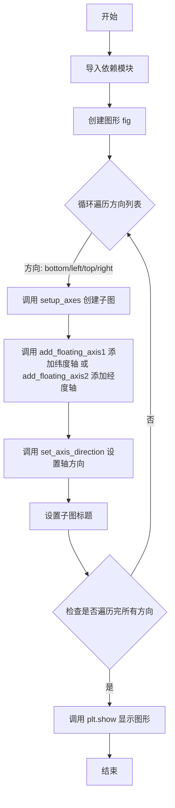

# `matplotlib\galleries\examples\axisartist\demo_axis_direction.py` 详细设计文档

该代码是 matplotlib axisartist 工具包的演示程序，展示了如何在极坐标投影的矩形框中创建浮动轴（floating axis），并演示了四种不同的轴方向（bottom, left, top, right）的显示效果，用于帮助开发者理解 axis_direction 的功能。

## 整体流程



## 类结构

```
注: 本文件为脚本式代码，未定义自定义类
使用的外部类 (通过导入实例化使用):
├── matplotlib.pyplot (plt)
├── numpy (np)
├── matplotlib.projections.PolarAxes
├── matplotlib.transforms.Affine2D
├── mpl_toolkits.axisartist
│   ├── axisartist.Axes
│   ├── angle_helper.ExtremeFinderCycle
│   ├── angle_helper.LocatorDMS
│   ├── angle_helper.FormatterDMS
│   ├── grid_finder.MaxNLocator
│   └── grid_helper_curvelinear.GridHelperCurveLinear
```

## 全局变量及字段


### `fig`
    
matplotlib Figure 对象，图形容器

类型：`matplotlib.figure.Figure`
    


### `ax`
    
matplotlib Axes 对象，子图/坐标轴对象，使用 axisartist 扩展

类型：`axisartist.Axes`
    


### `axis`
    
浮动轴对象，表示添加的可自定义方向的坐标轴

类型：`mpl_toolkits.axisartist.floating_axis.FloatingAxis`
    


### `i`
    
循环计数器整数，用于遍历子图位置

类型：`int`
    


### `d`
    
方向字符串，取值为 'bottom', 'left', 'top', 'right' 之一

类型：`str`
    


### `grid_helper`
    
GridHelperCurveLinear 实例，网格辅助对象，用于定义曲线坐标网格

类型：`GridHelperCurveLinear`
    


### `rect`
    
子图位置参数，用于指定 add_subplot 的位置编号

类型：`int`
    


    

## 全局函数及方法


### `setup_axes`

创建带有曲线性网格的极坐标子图。该函数通过结合仿射变换和极坐标变换，创建一个在矩形框中显示的极坐标投影，配置网格定位器、刻度格式化器和坐标轴属性，并返回自定义的axisartist Axes对象。

参数：

- `fig`：`matplotlib.figure.Figure`，要添加子图的图形对象
- `rect`：整数或元组，子图的位置参数（如241、242等，表示在图形网格中的位置）

返回值：`axisartist.Axes`，配置好的带有曲线性网格的极坐标轴对象

#### 流程图

```mermaid
flowchart TD
    A[开始 setup_axes] --> B[创建 GridHelperCurveLinear]
    B --> C[配置极端值查找器 ExtremeFinderCycle]
    C --> D[设置网格定位器 LocatorDMS 和 MaxNLocator]
    D --> E[设置刻度格式化器 FormatterDMS]
    E --> F[使用 fig.add_subplot 创建子图]
    F --> G[配置 axes_class 为 axisartist.Axes]
    G --> H[设置网格辅助器 grid_helper]
    H --> I[设置 aspect=1, xlim=(-5,12), ylim=(-5,10)]
    I --> J[关闭所有坐标轴的刻度标签显示]
    J --> K[设置网格颜色为淡灰色 .9]
    K --> L[返回配置好的 ax 对象]
```

#### 带注释源码

```python
def setup_axes(fig, rect):
    """Polar projection, but in a rectangular box."""
    # 创建一个曲线网格辅助器，结合了仿射变换和极坐标变换
    # Affine2D().scale(np.pi/180., 1.) 将角度转换为弧度
    # PolarAxes.PolarTransform() 提供极坐标到笛卡尔坐标的转换
    grid_helper = GridHelperCurveLinear(
        Affine2D().scale(np.pi/180., 1.) + PolarAxes.PolarTransform(),
        
        # extreme_finder 定义坐标轴的极值范围
        # 20, 20 表示经度和纬度方向的分段数
        # lon_cycle=360 表示经度循环360度
        # lat_minmax=(0, np.inf) 限制纬度范围从0到无穷大
        extreme_finder=angle_helper.ExtremeFinderCycle(
            20, 20,
            lon_cycle=360, lat_cycle=None,
            lon_minmax=None, lat_minmax=(0, np.inf),
        ),
        
        # grid_locator1 控制经度方向的网格线位置，LocatorDMS(12)表示12度间隔
        grid_locator1=angle_helper.LocatorDMS(12),
        
        # grid_locator2 控制纬度方向的网格线数量，MaxNLocator(5)最多5条
        grid_locator2=grid_finder.MaxNLocator(5),
        
        # tick_formatter1 设置刻度标签格式为度分秒格式
        tick_formatter1=angle_helper.FormatterDMS(),
    )
    
    # 向图形添加子图，使用axisartist.Axes作为坐标轴类
    # rect指定子图位置，grid_helper处理坐标转换
    # aspect=1保持等比例，xlim和ylim设置坐标轴范围
    ax = fig.add_subplot(
        rect, axes_class=axisartist.Axes, grid_helper=grid_helper,
        aspect=1, xlim=(-5, 12), ylim=(-5, 10))
    
    # 关闭所有坐标轴的刻度标签显示
    ax.axis[:].toggle(ticklabels=False)
    
    # 设置网格颜色为浅灰色（.9表示接近白色的灰色）
    ax.grid(color=".9")
    
    # 返回配置好的坐标轴对象
    return ax
```


### `add_floating_axis1`

该函数用于在极坐标投影图中添加一条纬度方向（30°）的浮动坐标轴，设置轴标签为数学表达式并使其可见，最终返回创建的浮动轴对象以便后续操作。

参数：

-  `ax`：`matplotlib.axes.Axes`，matplotlib的坐标轴对象，用于承载浮动轴的绘制

返回值：`mpl_toolkits.axisartist.axislines.Axis`，返回新创建的浮动轴对象，可用于进一步设置轴方向等操作

#### 流程图

```mermaid
flowchart TD
    A[开始 add_floating_axis1] --> B[接收坐标轴对象 ax]
    B --> C[调用 ax.new_floating_axis 创建浮动轴<br/>参数: 0 表示纬度方向, 30 表示30度]
    C --> D[将创建的轴赋值给 ax.axis['lat'] 键]
    D --> E[设置轴标签文本为 θ = 30°]
    E --> F[设置轴标签可见]
    F --> G[返回创建的浮动轴对象]
    G --> H[结束]
```

#### 带注释源码

```python
def add_floating_axis1(ax):
    """
    添加纬度方向(30°)的浮动轴
    
    Parameters
    ----------
    ax : matplotlib.axes.Axes
        matplotlib的坐标轴对象，用于承载浮动轴的绘制
    
    Returns
    -------
    mpl_toolkits.axisartist.axislines.Axis
        新创建的浮动轴对象
    """
    # 创建新的浮动轴：第一个参数0表示纬度方向，第二个参数30表示30度
    # new_floating_axis 方法是 axisartist 扩展库提供的方法
    # 用于在曲坐标网格中创建浮动轴（不与主坐标网格对齐的轴）
    ax.axis["lat"] = axis = ax.new_floating_axis(0, 30)
    
    # 设置轴标签的文本内容，使用LaTeX数学表达式表示θ = 30°
    axis.label.set_text(r"$\theta = 30^{\circ}$")
    
    # 设置轴标签可见（默认可能不可见）
    axis.label.set_visible(True)
    
    # 返回创建的浮动轴对象，允许调用者进一步自定义
    return axis
```


### `add_floating_axis2`

添加经度方向(r=6)的浮动轴，用于在极坐标投影中添加一条固定半径为6的经度线（圆环），并设置其标签可见。

参数：

-  `ax`：`matplotlib.axes.Axes`，matplotlib的坐标轴对象，用于承载浮动轴

返回值：`mpl_toolkits.axisartist.axis_artist.FloatingAxis`，创建的浮动轴对象，用于后续可能的方向设置或样式调整

#### 流程图

```mermaid
graph TD
    A[开始 add_floating_axis2] --> B[调用 ax.new_floating_axis 创建一个新的浮动轴]
    B --> C[设置浮动轴方向为经度方向 direction=1]
    C --> D[设置浮动轴的值为 r=6]
    D --> E[将新创建的浮动轴赋值给 ax.axis['lon']]
    E --> F[调用 axis.label.set_text 设置标签文本为 $r = 6$]
    F --> G[调用 axis.label.set_visible 设置标签可见]
    G --> H[返回创建的 axis 对象]
    H --> I[结束]
```

#### 带注释源码

```python
def add_floating_axis2(ax):
    """
    添加经度方向(r=6)的浮动轴
    
    该函数在给定的matplotlib坐标轴上创建一个新的浮动轴，
    用于表示极坐标中的固定半径线（r=6的圆环）。
    
    参数:
        ax: matplotlib坐标轴对象
        
    返回值:
        axis: 新创建的浮动轴对象
    """
    # 创建新的浮动轴，参数1表示经度方向，参数6表示半径值为6
    # ax.new_floating_axis(direction, value) 方法创建一个浮动轴
    # direction=1 对应经度（lon）方向
    ax.axis["lon"] = axis = ax.new_floating_axis(1, 6)
    
    # 设置浮动轴的标签文本，r"$r = 6$" 表示渲染为数学公式 r = 6
    axis.label.set_text(r"$r = 6$")
    
    # 设置标签可见
    axis.label.set_visible(True)
    
    # 返回创建的浮动轴对象，以便调用者可以进行进一步的自定义设置
    return axis
```

## 关键组件


### setup_axes 函数

该函数用于创建一个极坐标投影的图表，但将其显示在矩形框中。它配置了网格助手、极坐标变换、坐标轴查找器、网格定位器和刻度格式化器，并返回一个配置好的坐标轴对象。

### add_floating_axis1 函数

该函数用于添加一条纬度方向的浮动轴，设置轴方向为30度，并显示标签θ = 30°，用于演示不同方向的坐标轴效果。

### add_floating_axis2 函数

该函数用于添加一条经度方向的浮动轴，设置轴方向为6，并显示标签r = 6，用于演示不同方向的坐标轴效果。

### GridHelperCurveLinear 类

曲线网格助手类，用于支持曲线坐标系统（如极坐标在矩形框中的显示），负责计算网格线和坐标变换。

### PolarAxes.PolarTransform

极坐标变换，将极坐标（r, θ）转换为笛卡尔坐标（x, y），是实现极坐标投影的核心变换器。

### axisartist 模块

轴艺术家模块，提供了自定义坐标轴外观和行为的工具，包括浮动轴、轴方向设置等功能。

### ExtremeFinderCycle 类

极端值查找器类，用于确定坐标轴的显示范围，支持经纬度的循环处理和范围限制。

### angle_helper 和 grid_finder 模块

角度辅助模块提供了定位器（如LocatorDMS）和格式化器（如FormatterDMS），用于处理角度坐标的刻度位置和标签格式。网格查找器模块提供了MaxNLocator等定位器用于控制网格线的数量。


## 问题及建议


### 已知问题

-   **魔法数字和硬编码值泛滥**：代码中存在大量硬编码的数值（如`20, 20`、`np.pi/180., 1.`、`12`、`5`、`30`、`6`、`241+i`、`245+i`等），缺乏常量定义，降低了代码可读性和可维护性
-   **代码重复**：两个循环（`for i, d in enumerate(["bottom", "left", "top", "right"])`）结构几乎完全相同，仅在调用函数上有差异，违反了DRY原则
-   **缺乏参数验证**：所有函数均无参数类型检查和边界验证，无法防止无效输入
-   **函数职责不单一**：`setup_axes`函数承担了过多职责（创建GridHelper、设置坐标轴、配置属性），难以复用和测试
-   **缺少类型注解**：无任何类型提示，影响代码可读性和IDE支持
-   **全局函数无封装**：所有函数都是模块级全局函数，缺乏类封装，限制了代码组织
-   **重复调用setup_axes**：对同一配置重复调用`setup_axes`，可考虑缓存或复用机制

### 优化建议

-   **提取配置常量**：将所有硬编码值定义为模块级常量或配置类，如`DEFAULT_LON_LAT_N=20`、`DEFAULT_ANGLE=30`、`DEFAULT_R=6`等
-   **抽象公共逻辑**：将两个相似的循环合并为一个通用函数，传入配置项列表和轴类型参数
-   **添加类型注解**：为所有函数参数和返回值添加类型提示
-   **增强函数文档**：为每个函数添加完整的docstring，描述参数、返回值和异常
-   **考虑面向对象封装**：将相关功能封装到类中，如`PolarAxisDemo`类，提供配置、构建和渲染方法
-   **添加参数校验**：在函数入口添加参数类型和范围检查，提供有意义的错误信息

## 其它


### 设计目标与约束

本代码演示了在matplotlib中使用GridHelperCurveLinear实现曲 linear 网格（极坐标投影到矩形框）的功能，并展示如何为浮动轴设置不同的方向（bottom、left、top、right）。设计目标是为用户提供一个清晰的可视化示例，帮助理解axisartist中轴方向的概念。约束条件包括：依赖mpl_toolkits.axisartist、matplotlib 3.x版本、numpy和PolarAxes支持。

### 错误处理与异常设计

本代码主要使用matplotlib的API进行绘图，未显式实现复杂的错误处理机制。可能的异常包括：GridHelperCurveLinear参数不合法导致的几何计算错误、add_subplot超出范围异常、以及matplotlib后端不支持导致的显示错误。建议在实际应用中增加参数校验和异常捕获逻辑。

### 数据流与状态机

数据流主要分为三个阶段：初始化阶段创建Figure和子图；配置阶段通过GridHelperCurveLinear定义坐标变换（极坐标->笛卡尔坐标），并设置极端值查找器、网格定位器和刻度格式化器；渲染阶段添加浮动轴并设置方向，最后调用plt.show()渲染图形。状态机较为简单，主要包含"创建->配置->渲染"三个状态转换。

### 外部依赖与接口契约

主要依赖包括：matplotlib.pyplot（绘图）、numpy（数值计算）、matplotlib.projections.PolarAxes（极坐标轴）、matplotlib.transforms.Affine2D（仿射变换）、mpl_toolkits.axisartist（轴艺术工具）、grid_finder和angle_helper（网格与角度辅助函数）。接口契约方面，setup_axes函数接受fig和rect参数，返回配置好的Axes对象；add_floating_axis1/2函数接受ax参数，返回Axis对象。

### 性能考虑与优化空间

当前实现对于演示目的性能足够。潜在优化包括：GridHelperCurveLinear的extreme_finder和grid_locator参数可根据实际数据范围调整以减少计算开销；多个子图重复创建grid_helper可以提取为共享配置；对于大数据集可考虑预先计算变换矩阵。

### 可扩展性设计

代码设计具有良好的可扩展性：可通过修改angle_helper.ExtremeFinderCycle参数支持不同的经纬度范围；可通过替换grid_locator实现自定义刻度间隔；可添加更多浮动轴实现复杂可视化；可通过继承GridHelperCurveLinear实现自定义网格变换逻辑。

### 图形输出与可视化规范

输出为8x4英寸的图形窗口，包含两行四列共8个子图。上排展示θ=30°的径向轴（纬度轴）四个方向设置，下排展示r=6的同心轴（经度轴）四个方向设置。图形使用constrained布局模式，网格颜色为淡灰色(.9)，所有轴的刻度标签默认关闭。

    