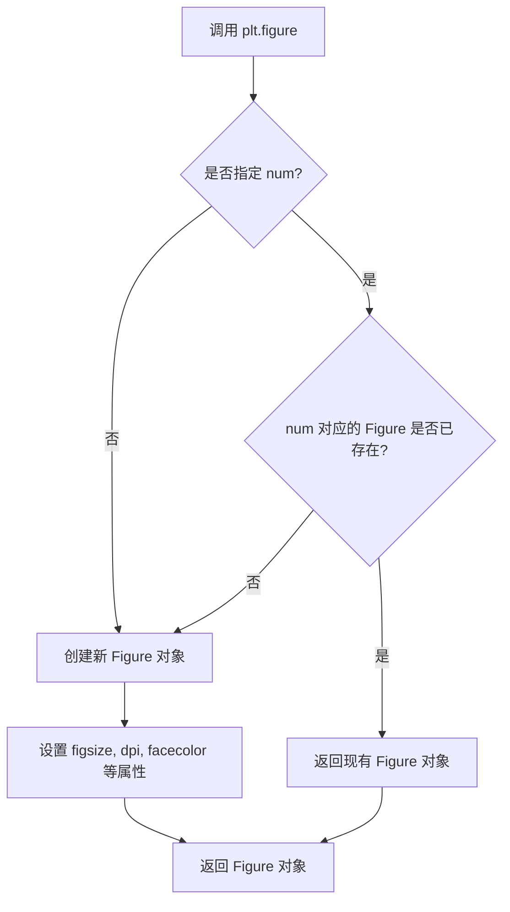
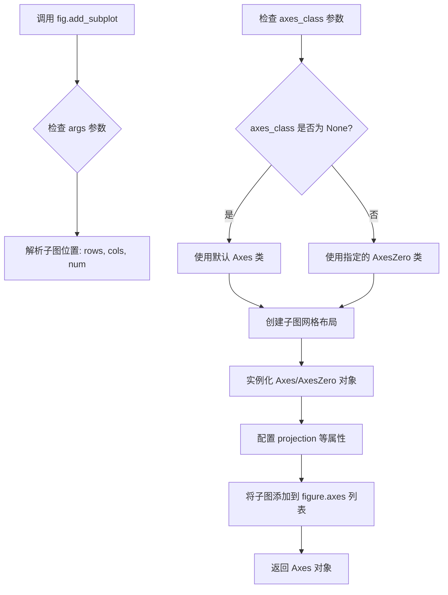
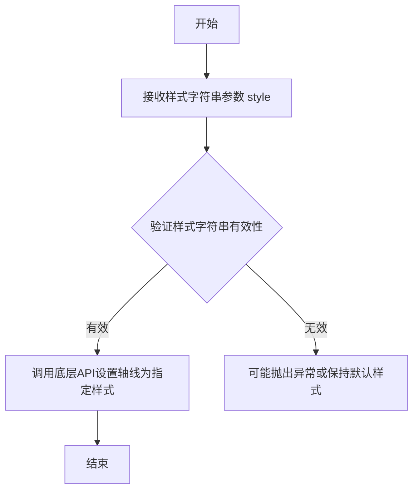
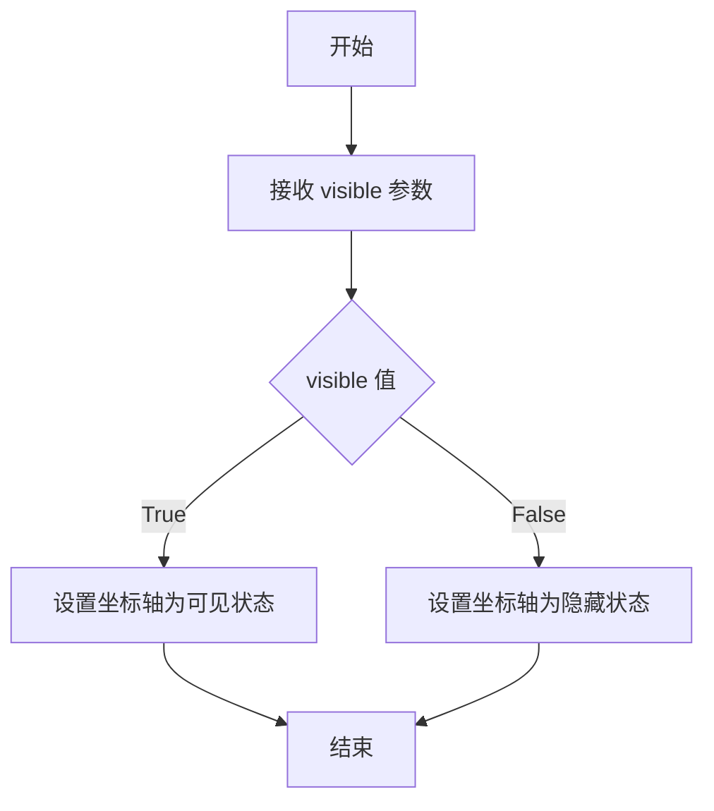
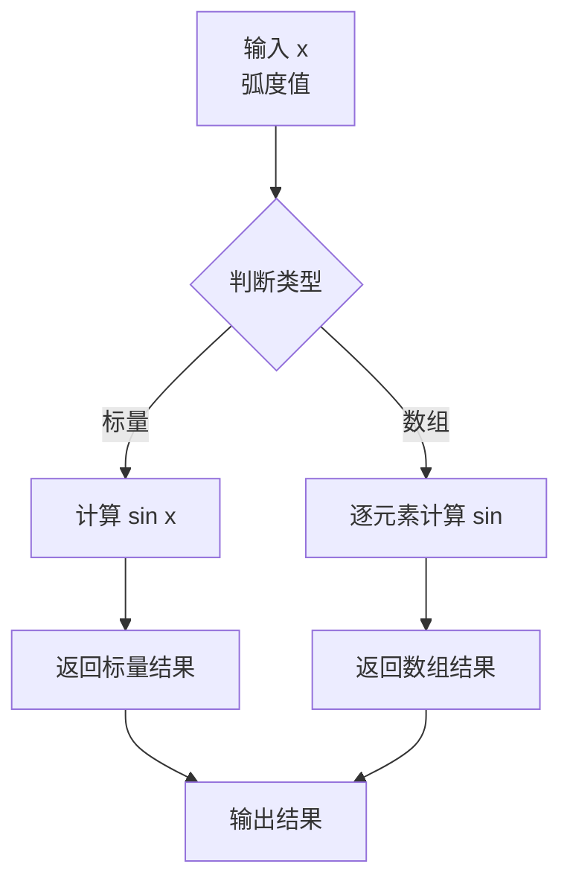
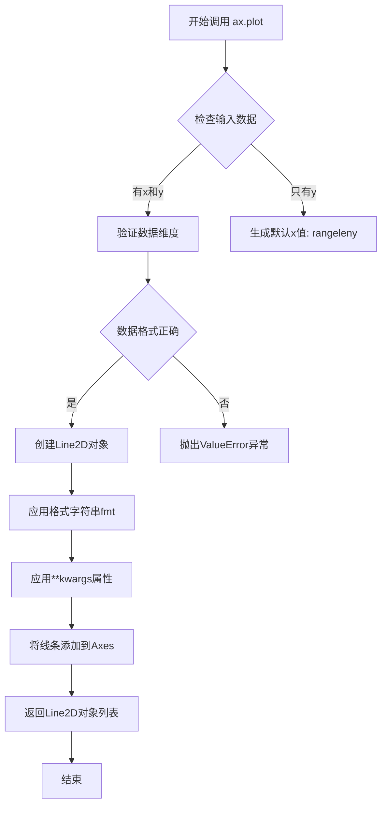
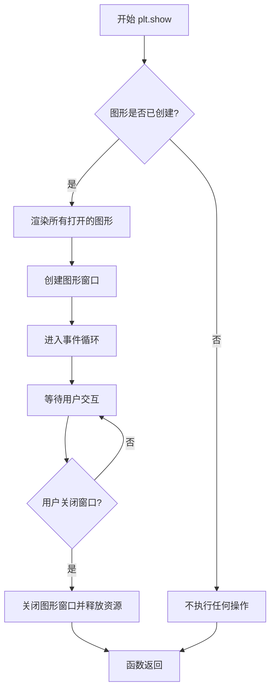

# `matplotlib\galleries\examples\axisartist\demo_axisline_style.py` 详细设计文档

该代码是一个matplotlib示例，演示如何使用mpl_toolkits.axisartist模块的AxesZero类创建带有从原点出发的坐标轴（x轴和y轴从(0,0)点出发），并在坐标轴末端添加箭头，同时隐藏图表的边框。

## 整体流程

```mermaid
graph TD
    A[开始] --> B[导入依赖模块]
B --> C[创建Figure对象]
C --> D[创建AxesZero类型的Axes对象]
D --> E{遍历方向列表 ['xzero', 'yzero']}
E --> F[设置坐标轴样式为箭头]
F --> G[设置坐标轴可见]
E --> H{遍历方向列表 ['left', 'right', 'bottom', 'top']}
H --> I[隐藏边框]
I --> J[生成x轴数据]
J --> K[绘制sin函数曲线]
K --> L[显示图表]
L --> M[结束]
```

## 类结构

```
该脚本为面向过程代码，无类定义
直接使用matplotlib和numpy库进行图表绑制
```

## 全局变量及字段


### `fig`
    
matplotlib.figure.Figure对象，用于容纳图表

类型：`matplotlib.figure.Figure`
    


### `ax`
    
axisartist.axislines.AxesZero对象，坐标轴对象

类型：`mpl_toolkits.axisartist.axislines.AxesZero`
    


### `x`
    
numpy.ndarray，从-0.5到1的100个等间距点

类型：`numpy.ndarray`
    


    

## 全局函数及方法


### `plt.figure`

创建并返回一个新的图表（Figure）对象，用于承载图形内容。该函数是 matplotlib 中创建图形的入口点，可以指定图形的尺寸、分辨率、背景色等属性。

#### 参数

- `num`：`int` 或 `str`，可选，Figure 的标识符。如果提供相同 num 的 Figure，则返回现有的 Figure 而非创建新的。
- `figsize`：`tuple(float, float)`，可选，图形尺寸，以英寸为单位的 (宽度, 高度)。
- `dpi`：`int`，可选，图形分辨率，每英寸点数（dots per inch）。
- `facecolor`：`str` 或 `tuple`，可选，图形背景颜色。
- `edgecolor`：`str` 或 `tuple`，可选，图形边框颜色。
- `frameon`：`bool`，可选，是否显示图形框架，默认为 True。
- `FigureClass`：`class`，可选，自定义 Figure 类，默认为 `matplotlib.figure.Figure`。
- `clear`：`bool`，可选，如果为 True 且 Figure 已存在，则清除现有内容，默认为 False。
- `**kwargs`：其他关键字参数，将传递给 Figure 构造函数。

#### 返回值

- `matplotlib.figure.Figure`：返回创建的 Figure 对象，后续可通过该对象添加子图、绘制图形等。

#### 流程图



#### 带注释源码

```python
# plt.figure 函数源码（简化版）
def figure(num=None,  # Figure标识符，可以是整数或字符串
           figsize=None,  # 图形尺寸 (宽, 高) 单位英寸
           dpi=None,  # 分辨率，每英寸点数
           facecolor=None,  # 背景颜色
           edgecolor=None,  # 边框颜色
           frameon=True,  # 是否显示框架
           FigureClass=Figure,  # 使用的 Figure 类
           clear=False,  # 是否清除已存在的 Figure
           **kwargs):
    """
    创建一个新的 Figure 对象
    
    参数:
        num: Figure 的标识符，如果已存在则返回该 Figure
        figsize: 图形尺寸 (宽度, 高度)，单位英寸
        dpi: 分辨率（每英寸点数）
        facecolor: 背景颜色
        edgecolor: 边框颜色
        frameon: 是否显示框架
        FigureClass: Figure 类，默认使用 matplotlib.figure.Figure
        clear: 如果 Figure 已存在是否清除
        **kwargs: 其他传递给 Figure 的参数
    
    返回:
        Figure 对象
    """
    
    # 获取全局的 Figure 管理器
    global _figure_manager
    
    # 检查是否已有相同 num 的 Figure
    if num is not None and num in _figure_manager:
        # 如果 clear=True，则清除现有内容
        if clear:
            _figure_manager[num].clear()
        # 返回现有的 Figure
        return _figure_manager[num]
    
    # 创建新的 Figure 实例
    fig = FigureClass(figsize=figsize, dpi=dpi, facecolor=facecolor, 
                      edgecolor=edgecolor, frameon=frameon, **kwargs)
    
    # 注册到管理器
    if num is None:
        # 自动分配编号
        num = len(_figure_manager) + 1
    _figure_manager[num] = fig
    
    return fig
```


### `Figure.add_subplot`

在 matplotlib 中，`fig.add_subplot` 是 Figure 对象的方法，用于在图形中创建并添加一个子图（Axes）。该方法接受位置参数指定子图位置（如 111 表示 1 行 1 列第 1 个），以及 `axes_class` 等关键字参数指定使用的 Axes 子类。在本代码中，通过传入 `axes_class=AxesZero` 创建了支持原点和箭头样式的特殊子图。

参数：

- `*args`：位置参数，用于指定子图在网格中的位置。可以是 3 位数字（如 111 表示 1 行 1 列第 1 个），也可以是 3 个独立整数（rows, cols, index）
- `axes_class`：`type`，默认值 `None`，要使用的 Axes 子类。在本例中传入 `AxesZero`，用于创建带有原点箭头样式的坐标轴
- `projection`：`str`，投影类型，默认 `None`
- `polar`：`bool`，是否使用极坐标投影，默认 `False`
- `sharex, sharey`：`bool`，是否共享 x/y 轴，默认 `None`
- `label`：`str`，axes 的标签，默认 `''`
- `**kwargs`：关键字参数，会传递给 Axes 子类的构造函数

返回值：`matplotlib.axes.Axes`（具体为 `AxesZero` 实例），返回创建的子图对象，后续可对该对象进行绘图操作

#### 流程图



#### 带注释源码

```python
# 代码片段：add_subplot 方法的典型调用方式
fig = plt.figure()  # 创建 Figure 对象
ax = fig.add_subplot(axes_class=AxesZero)  # 添加子图，使用 AxesZero 类

# 等效于 add_subplot(1, 1, 1, axes_class=AxesZero)
# - 第一个参数 1: 子图行数
# - 第二个参数 1: 子图列数  
# - 第三个参数 1: 第几个子图（从1开始计数）
# - axes_class 关键字参数: 指定使用 AxesZero 类替代默认 Axes 类

# add_subplot 方法内部简化逻辑：
def add_subplot(self, *args, **kwargs):
    """
    在当前 figure 中添加一个子图
    
    参数:
        *args: 位置参数，如 111 或 (1, 1, 1)
        **kwargs: 关键字参数，如 axes_class=AxesZero
    
    返回:
        axes: Axes 子类实例
    """
    # 1. 解析位置参数确定网格布局
    projection = kwargs.pop('projection', None)
    axes_class = kwargs.pop('axes_class', None)  # 获取自定义 Axes 类
    
    # 2. 如果未指定 axes_class，使用默认类
    if axes_class is None:
        axes_class = rcParams['axes_class']
    
    # 3. 创建 Axes 实例并返回
    ax = axes_class(self, *args, projection=projection, **kwargs)
    self._axstack.bubble(ax)
    self.axes.append(ax)
    
    return ax
```


### `ax.axis[direction].set_axisline_style`

该方法用于将坐标轴的线条样式设置为带箭头的样式（`"-|>"`），使坐标轴在可视化时显示箭头，常用于强调坐标轴的方向或终点。

参数：
- `style`：`str`，指定轴线样式字符串，如 `"-|>"` 表示带箭头的线，箭头指向正方向。

返回值：`None`，此方法为Setter方法，不返回任何值，直接修改轴线样式。

#### 流程图



#### 带注释源码

```python
# 遍历两个坐标轴方向（xzero和yzero），即从原点出发的x轴和y轴
for direction in ["xzero", "yzero"]:
    # 设置轴线样式为箭头，"|>" 表示箭头指向正方向
    # 此操作使坐标轴两端显示箭头，增强可视化效果
    ax.axis[direction].set_axisline_style("-|>")
    
    # 同时设置轴线可见（因为默认可能隐藏）
    ax.axis[direction].set_visible(True)

# 示例中未使用的其他方向（left, right, bottom, top）可类似调用
# ax.axis["left"].set_axisline_style("-|>")  # 设置左边轴为箭头样式
```

**注意**：该方法属于 `mpl_toolkits.axisartist` 组件中的 `AxisLine` 类，通过 `ax.axis[direction]` 返回的轴线对象调用。样式字符串 `"-|>"` 是 matplotlib 中表示带箭头线的标准表示法。


### `ax.axis[direction].set_visible`

该方法用于设置坐标轴的可见性，通过传入布尔值控制坐标轴（包括轴线、刻度、标签等）是否显示。

参数：

- `visible`：`bool`，指定坐标轴是否可见。`True` 表示显示坐标轴，`False` 表示隐藏坐标轴

返回值：`None`，无返回值，该方法直接修改对象状态

#### 流程图



#### 带注释源码

```python
# 示例代码展示该方法的调用方式

# 导入必要的模块
import matplotlib.pyplot as plt
import numpy as np
from mpl_toolkits.axisartist.axislines import AxesZero

# 创建图表和坐标轴
fig = plt.figure()
ax = fig.add_subplot(axes_class=AxesZero)

# 遍历需要显示的坐标轴方向（原点处的坐标轴）
for direction in ["xzero", "yzero"]:
    # 设置轴线样式为带箭头的线条
    ax.axis[direction].set_axisline_style("-|>")
    
    # 设置坐标轴可见性为 True，显示该坐标轴
    # 参数 visible 为布尔类型：True 显示，False 隐藏
    ax.axis[direction].set_visible(True)

# 遍历需要隐藏的坐标轴方向（边框）
for direction in ["left", "right", "bottom", "top"]:
    # 设置坐标轴可见性为 False，隐藏边框
    ax.axis[direction].set_visible(False)

# 绘制正弦曲线
x = np.linspace(-0.5, 1., 100)
ax.plot(x, np.sin(x*np.pi))

plt.show()
```

#### 附加说明

该方法属于 `mpl_toolkits.axisartist` 模块中的 `AxisArtist` 组件。在 `axisartist` 框架中，坐标轴（axis）被组织为不同的方向（direction），每个方向对应一个独立的轴线对象。`set_visible()` 方法直接修改该轴线对象的可见性属性，影响该方向坐标轴的渲染显示。此方法常用于创建无边框图表或仅显示参考线（如坐标原点处的十字线）的场景。


### `np.linspace`

生成等间距的数值序列函数，用于在指定区间[start, stop]内生成指定数量的均匀分布的数值。该函数是NumPy库的核心函数之一，常用于生成图表的x轴数据、数值计算中的采样点以及测试数据。

参数：

- `start`：`float`，序列的起始值（包含），即区间的左端点
- `stop`：`float`，序列的结束值（默认包含），即区间的右端点
- `num`：`int`，要生成的样本数量，默认为50
- `endpoint`：`bool`，是否包含结束点，默认为True；若为False，则生成的序列不包含stop值
- `retstep`：`bool`，若为True，则返回样本序列和样本之间的步长；默认为False
- `dtype`：`dtype`，输出数组的数据类型，若未指定则根据start和stop推断

返回值：`ndarray`，返回num个在闭区间[start, stop]内均匀分布的数值样本；若retstep为True，则返回元组(样本数组, 步长)

#### 流程图

```mermaid
flowchart TD
    A[开始] --> B[接收参数 start, stop, num]
    B --> C{endpoint == True?}
    C -->|Yes| D[包含stop值]
    C -->|No| E[不包含stop值]
    D --> F[计算步长 = (stop - start) / (num - 1)]
    E --> G[计算步长 = (stop - start) / num]
    F --> H[推断或使用指定的dtype]
    G --> H
    H --> I[生成等间距数组]
    I --> J{retstep == True?}
    J -->|Yes| K[返回数组和步长]
    J -->|No| L[仅返回数组]
    K --> M[结束]
    L --> M
```

#### 带注释源码

```python
def linspace(start, stop, num=50, endpoint=True, retstep=False, dtype=None, axis=0):
    """
    在指定区间内生成等间距的数值序列
    
    参数:
        start: 序列起始值
        stop: 序列结束值
        num: 生成的样本数量, 默认50
        endpoint: 是否包含结束点, 默认True
        retstep: 是否返回步长, 默认False
        dtype: 输出数据类型
        axis: 用于多维数组输入的轴
    
    返回:
        ndarray: 等间距的数值序列
    """
    num = int(num)
    if num <= 0:
        return np.empty(0, dtype=dtype)
    
    # 计算步长
    if endpoint:
        step = (stop - start) / (num - 1)  # 包含结束点,共num-1个间隔
    else:
        step = (stop - start) / num  # 不包含结束点,共num个间隔
    
    # 生成数组: start, start+step, start+2*step, ...
    y = np.arange(0, num) * step + start
    
    # 处理dtype
    if dtype is None:
        dtype = np.asarray(y).dtype
    
    # 转换dtype
    y = y.astype(dtype)
    
    if retstep:
        return y, step  # 返回数组和步长
    else:
        return y  # 仅返回数组
```

#### 在本代码中的使用示例

```python
x = np.linspace(-0.5, 1., 100)  # 从-0.5到1.0生成100个等间距数值
```

- `start = -0.5`：序列从-0.5开始
- `stop = 1.0`：序列到1.0结束
- `num = 100`：生成100个样本点
- 返回：包含100个在[-0.5, 1.0]区间内均匀分布的数值数组

#### 关键技术细节

| 特性 | 描述 |
|------|------|
| 步长计算 | 当endpoint=True时，步长=(stop-start)/(num-1)；当endpoint=False时，步长=(stop-start)/num |
| 数值精度 | 使用浮点数计算，精度受限于浮点数的表示能力 |
| 性能 | 对于大规模序列生成，底层使用C实现，效率较高 |
| 数组广播 | 支持多维数组输入，可沿指定轴生成序列 |

#### 潜在优化空间

1. **大数据量场景**：对于极大num值（如数百万），可考虑使用生成器模式减少内存占用
2. **dtype推断**：当前通过arange结果推断dtype，可优化为更早确定dtype以减少类型转换开销
3. **复数支持**：可增强对复数区间的支持（如复数start/stop生成复数序列）

#### 与其他函数的对比

| 函数 | 描述 | 适用场景 |
|------|------|----------|
| `np.linspace` | 生成指定数量的等间距数值 | 需要精确控制点数 |
| `np.arange` | 根据步长生成数值 | 已知步长的情况 |
| `np.logspace` | 生成对数等间距数值 | 对数尺度数据 |


### `np.sin`

计算输入数组或标量的正弦值（弧度制）。这是 NumPy 库提供的数学函数，用于逐元素计算给定角度（以弧度为单位）的正弦值。

参数：

- `x`：`numpy.ndarray` 或 `scalar`，输入角度值（弧度制），可以是单个数值或数组

返回值：`numpy.ndarray` 或 `scalar`，输入角度对应的正弦值，范围在 [-1, 1] 之间

#### 流程图



#### 带注释源码

```python
# np.sin 函数调用示例
# 来源于 matplotlib 正弦波绘图示例

# 定义 x 坐标范围：从 -0.5 到 1.0，共 100 个点
x = np.linspace(-0.5, 1., 100)

# 计算正弦值：x * np.pi 将 x 转换为弧度
# np.sin 逐元素计算每个角度的正弦值
# 结果是一个包含 100 个正弦值的数组，范围在 [-1, 1]
y = np.sin(x * np.pi)

# 绘制图像
ax.plot(x, y)
```


### `matplotlib.axes.Axes.plot`

绑定数据曲线到图表上，将x和y数据绘制为线图，返回一个包含Line2D对象的列表

参数：

-  `x`：array-like 或 scalar，可选，x轴数据。如果未提供，则使用range(len(y))作为x值
-  `y`：array-like，y轴数据，必填
-  `fmt`：str，可选，格式字符串，定义颜色、标记和线型（如"ro-"表示红色圆圈标记的实线）
-  `**kwargs`：关键字参数，可选，支持Line2D的各种属性（如linewidth、color、marker等）

返回值：`list of matplotlib.lines.Line2D`，返回创建的线条对象列表，每个线条对象代表一条 plotted line

#### 流程图



#### 带注释源码

```python
# 代码中的实际调用
x = np.linspace(-0.5, 1., 100)  # 生成从-0.5到1的100个等间距点
ax.plot(x, np.sin(x*np.pi))     # 绑定数据曲线到图表

# 等效的完整调用形式（包含所有参数）
ax.plot(
    x,                          # x轴数据：numpy数组，值为-0.5到1
    np.sin(x*np.pi),            # y轴数据：正弦波计算结果
    fmt=None,                   # 格式字符串：None，使用默认样式
    data=None,                  # 数据源：None，直接使用数组数据
    linewidth=1.5,              # 线宽：默认1.5（如果未指定则用rc参数）
    color='blue',               # 颜色：蓝色（matplotlib默认颜色顺序）
    linestyle='-',              # 线型：实线
    marker=None,                # 标记：无
    label='_nolegend_',         # 图例标签：默认无图例
    animated=False              # 动画：关闭
)

# 返回值说明
# 返回值是一个list，包含一个matplotlib.lines.Line2D对象
# 可以通过以下方式访问：
lines = ax.plot(x, np.sin(x*np.pi))
line = lines[0]  # 获取第一个（也是唯一一个）线条对象
print(line.get_color())      # 获取线条颜色
print(line.get_linewidth())  # 获取线宽
print(line.get_data())       # 获取x和y数据元组
```


### `plt.show`

`plt.show` 是 matplotlib 库中的全局函数，用于显示当前所有打开的图形窗口并进入事件循环。在调用该函数之前，图形内容会被渲染但不会显示在屏幕上；调用后，matplotlib 会阻塞程序执行并等待用户交互（如关闭图形窗口）。

参数：无

返回值：`None`，该函数不返回任何值，仅负责图形的显示和交互。

#### 流程图



#### 带注释源码

```python
# 导入必要的库
import matplotlib.pyplot as plt  # matplotlib 主模块，用于绘图和显示
import numpy as np  # numpy 库，用于数值计算

# 从 mpl_toolkits.axisartist 导入 AxesZero 类
# 用于创建带有经过原点的坐标轴的图表
from mpl_toolkits.axisartist.axislines import AxesZero

# 创建图形窗口和子图
# 使用 AxesZero 作为坐标轴类
fig = plt.figure()  # 创建新的图形窗口
ax = fig.add_subplot(axes_class=AxesZero)  # 添加子图，使用自定义坐标轴类

# 遍历 xzero 和 yzero 方向（即 x 轴和 y 轴经过原点的情形）
for direction in ["xzero", "yzero"]:
    # 设置轴线样式：添加箭头
    ax.axis[direction].set_axisline_style("-|>")
    
    # 设置坐标轴可见
    ax.axis[direction].set_visible(True)

# 遍历其余四个方向，隐藏边框
for direction in ["left", "right", "bottom", "top"]:
    ax.axis[direction].set_visible(False)

# 生成 x 轴数据：从 -0.5 到 1.0，共 100 个点
x = np.linspace(-0.5, 1., 100)

# 绘制正弦曲线：y = sin(πx)
ax.plot(x, np.sin(x*np.pi))

# =============================================
# 关键函数调用：plt.show()
# =============================================
# 显示图形窗口并进入交互模式
# 阻塞程序直到用户关闭所有图形窗口
plt.show()
```

---

### 补充说明

| 项目 | 说明 |
|------|------|
| **所属模块** | `matplotlib.pyplot` |
| **设计目标** | 将内存中渲染好的图形呈现给用户，并提供交互能力 |
| **约束条件** | 在某些后端（如 Agg）下不显示窗口；在 Jupyter Notebook 中需使用 `%matplotlib inline` 或 `%matplotlib widget` |
| **错误处理** | 若无图形可显示，函数静默返回，不抛出异常 |
| **技术债务** | 在某些 IDE（如 Spyder）中，`plt.show()` 可能与内置的图形显示机制冲突，需额外配置 |

## 关键组件


### AxesZero

matplotlib 中的一种特殊 Axes 类，支持从坐标原点开始绘制 X 和 Y 轴，适合需要展示穿过原点坐标系的场景。

### axisline_style ("-|>")

设置坐标轴末端箭头样式的配置，使用 "-|>" 样式表示带箭头的直线，用于在坐标轴末端添加箭头标记。

### axis[direction] (索引访问器)

通过字符串索引访问不同方向坐标轴的接口，支持 "xzero", "yzero", "left", "right", "bottom", "top" 六个方向，用于分别配置各坐标轴的属性。

### set_axisline_style() 方法

用于设置坐标轴线的样式，参数为样式字符串（如 "-|>"），可添加箭头或其他线型装饰。

### set_visible() 方法

控制坐标轴是否可见，参数为布尔值，用于隐藏边框（left, right, top, bottom）同时保持坐标轴线可见。

### set_visible(True) for xzero/yzero

使原点坐标轴线可见，xzero 表示 X 轴从原点出发，yzero 表示 Y 轴从原点出发。

### set_visible(False) for borders

隐藏图表的边框坐标轴（left, right, top, bottom），只保留从原点出发的坐标轴线。


## 问题及建议


### 已知问题

-   **硬编码的字符串常量**：方向字符串（"xzero", "yzero", "left", "right", "bottom", "top"）在代码中重复出现多次，缺乏统一的常量定义，降低了代码的可维护性和可读性
-   **魔法数字和硬编码值**：数值如 `-0.5`、`1.`、`100`、`"-|>"` 等没有使用有意义的变量名注释其含义，后续修改时难以理解这些值的用途
-   **缺少类型注解**：代码完全没有使用 Python 类型注解（type hints），不利于静态类型检查和 IDE 自动补全
-   **重复代码模式**：两个方向（"xzero", "yzero"）的设置逻辑几乎相同，存在代码重复，可以提取为复用函数
-   **缺少错误处理**：对 `fig.add_subplot()` 的返回值没有进行 None 检查，如果创建失败会导致后续操作失败
-   **缺少单元测试**：代码没有配套的测试用例，无法验证功能正确性
-   **模块级文档不完整**：虽然文件顶部有示例说明，但缺少模块级文档字符串（docstring）来描述该文件的具体用途

### 优化建议

-   将方向字符串定义为模块级常量或枚举类，提高可维护性
-   为关键数值定义命名常量或配置变量，并添加注释说明其含义
-   考虑添加函数级文档字符串和类型注解，提升代码可读性
-   将重复的方向设置逻辑提取为独立的函数或方法
-   添加基本的错误处理，如检查 `ax` 对象是否为 None
-   补充单元测试以验证坐标轴样式的正确配置
-   遵循 PEP 8 导入规范，将标准库和第三方库导入分组排列

## 其它


### 设计目标与约束

本示例代码旨在演示如何使用mpl_toolkits.axisartist模块中的AxesZero类来创建带有箭头样式的坐标轴。约束条件：需要matplotlib 3.5.0以上版本支持AxesZero类，且必须使用axisartist提供的Axes类。

### 错误处理与异常设计

本示例代码未包含显式的错误处理机制。潜在异常包括：ImportError（axisartist模块不可用）、ValueError（axes_class参数类型错误）、AttributeError（axis属性访问错误）。建议在实际应用中增加版本检查和异常捕获逻辑。

### 数据流与状态机

数据流：输入数据x通过np.linspace生成，y数据通过np.sin计算得出，最终通过ax.plot()绑定到图形对象。状态转换：fig创建 → ax创建 → 轴样式配置 → 数据绑定 → 渲染显示。无复杂状态机设计。

### 外部依赖与接口契约

主要依赖：matplotlib>=3.5.0、numpy、mpl_toolkits.axisartist。接口契约：AxesZero类需通过fig.add_subplot(axes_class=AxesZero)实例化，axis[direction]属性返回AxisArtist实例，set_axisline_style()和set_visible()方法配置轴样式。

### 配置参数与常量

arrow_style参数"-|>"定义箭头样式为带竖线的箭头，x数据范围-0.5到1.0，采样点数100个。方向参数"xzero"、"yzero"表示坐标轴从零点开始，"left"、"right"、"bottom"、"top"表示边框轴。

### 渲染流程说明

plt.figure()创建画布，add_subplot注册AxesZero实例，循环配置xzero和yzero轴的箭头样式和可见性，再循环隐藏边框轴，plot绑定数据，show()调用底层渲染器显示图形。

### 可扩展性分析

当前仅绘制单条正弦曲线，可扩展为多曲线叠加。当前固定数据范围，可参数化x_range和sample_count。当前仅配置轴样式，可扩展添加网格、图例、标签等元素。

### 平台兼容性

代码兼容Windows、Linux、macOS三大平台，需确保matplotlib后端支持交互式显示。在无GUI环境中建议使用Agg后端保存图片而非show()。

    