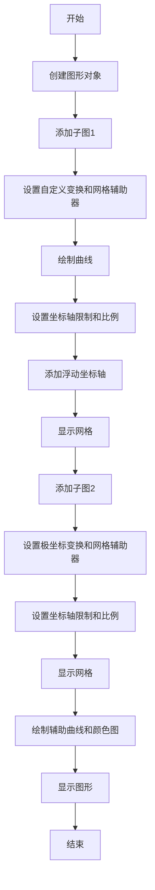
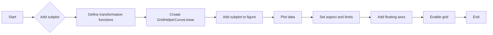
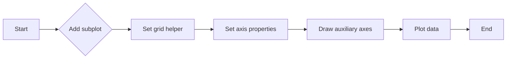
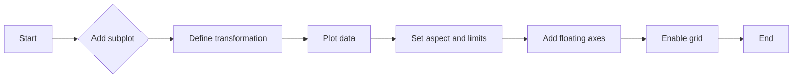
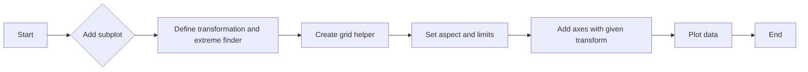
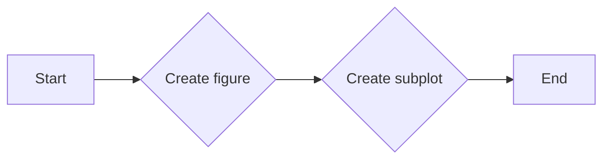
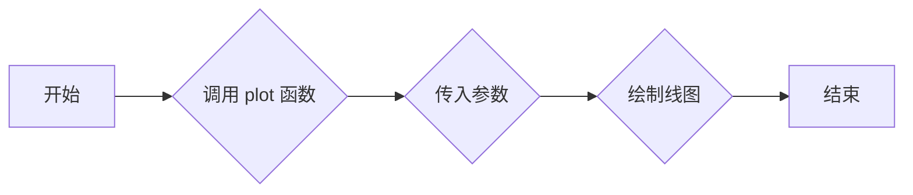
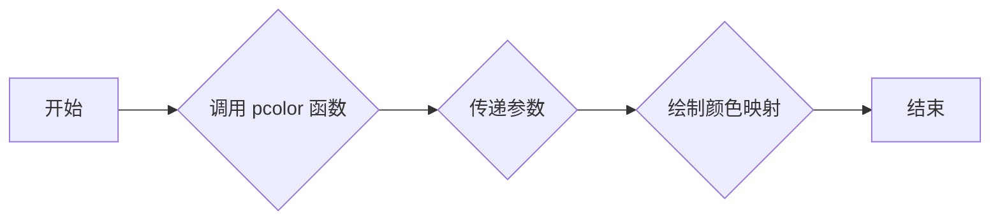

# `matplotlib\galleries\examples\axisartist\demo_curvelinear_grid.py` 详细设计文档

This code demonstrates the use of custom grids and ticklines in matplotlib plots, specifically showing how to apply transformations to create non-standard grid layouts, such as polar projections in a rectangular box.

## 整体流程



## 类结构

```
matplotlib.pyplot (matplotlib模块)
├── fig (图形对象)
│   ├── ax1 (子图1)
│   │   ├── grid_helper (网格辅助器)
│   │   ├── axis (坐标轴)
│   │   └── plot (绘制曲线)
│   └── ax2 (子图2)
│       ├── grid_helper (网格辅助器)
│       ├── axis (坐标轴)
│       └── pcolor (颜色图)
└── plt (matplotlib.pyplot模块)
```

## 全局变量及字段


### `fig`
    
The main figure object where all subplots are added.

类型：`matplotlib.figure.Figure`
    


### `ax1`
    
The first subplot where the custom grid is applied.

类型：`matplotlib.axes.Axes`
    


### `ax2`
    
The second subplot where the polar projection is displayed.

类型：`matplotlib.axes.Axes`
    


### `plt`
    
The main module for plotting in Matplotlib.

类型：`matplotlib.pyplot`
    


### `tr`
    
The transformation used for the polar projection.

类型：`matplotlib.transforms.Affine2D`
    


### `extreme_finder`
    
The object used to find the extremes of the coordinate system for the polar projection.

类型：`mpl_toolkits.axisartist.angle_helper.ExtremeFinderCycle`
    


### `grid_locator1`
    
The locator used to find grid values for the coordinate system in degrees.

类型：`mpl_toolkits.axisartist.angle_helper.LocatorDMS`
    


### `tick_formatter1`
    
The formatter used to format the tick labels for the coordinate system in degrees.

类型：`mpl_toolkits.axisartist.angle_helper.FormatterDMS`
    


### `matplotlib.pyplot.fig`
    
The main figure object where all subplots are added.

类型：`matplotlib.figure.Figure`
    


### `matplotlib.pyplot.ax1`
    
The first subplot where the custom grid is applied.

类型：`matplotlib.axes.Axes`
    


### `matplotlib.pyplot.ax2`
    
The second subplot where the polar projection is displayed.

类型：`matplotlib.axes.Axes`
    


### `matplotlib.pyplot.plt`
    
The main module for plotting in Matplotlib.

类型：`matplotlib.pyplot`
    


### `matplotlib.transforms.tr`
    
The transformation used for the polar projection.

类型：`matplotlib.transforms.Affine2D`
    


### `mpl_toolkits.axisartist.angle_helper.extreme_finder`
    
The object used to find the extremes of the coordinate system for the polar projection.

类型：`mpl_toolkits.axisartist.angle_helper.ExtremeFinderCycle`
    


### `mpl_toolkits.axisartist.angle_helper.grid_locator1`
    
The locator used to find grid values for the coordinate system in degrees.

类型：`mpl_toolkits.axisartist.angle_helper.LocatorDMS`
    


### `mpl_toolkits.axisartist.angle_helper.tick_formatter1`
    
The formatter used to format the tick labels for the coordinate system in degrees.

类型：`mpl_toolkits.axisartist.angle_helper.FormatterDMS`
    
    

## 全局函数及方法


### curvelinear_test1(fig)

This function creates a custom grid and ticklines for a plot using a curvilinear transformation.

参数：

- `fig`：`matplotlib.figure.Figure`，The figure object to which the subplot will be added.

返回值：无

#### 流程图



#### 带注释源码

```python
def curvelinear_test1(fig):
    """
    Grid for custom transform.
    """

    def tr(x, y): return x, y - x
    def inv_tr(x, y): return x, y + x

    grid_helper = GridHelperCurveLinear((tr, inv_tr))

    ax1 = fig.add_subplot(1, 2, 1, axes_class=Axes, grid_helper=grid_helper)
    # ax1 will have ticks and gridlines defined by the given transform (+
    # transData of the Axes).  Note that the transform of the Axes itself
    # (i.e., transData) is not affected by the given transform.
    xx, yy = tr(np.array([3, 6]), np.array([5, 10]))
    ax1.plot(xx, yy)

    ax1.set_aspect(1)
    ax1.set_xlim(0, 10)
    ax1.set_ylim(0, 10)

    ax1.axis["t"] = ax1.new_floating_axis(0, 3)
    ax1.axis["t2"] = ax1.new_floating_axis(1, 7)
    ax1.grid(True, zorder=0)
```


### curvelinear_test2(fig)

This function creates a polar projection within a rectangular box using custom grid and ticklines.

参数：

- `fig`：`matplotlib.figure.Figure`，The figure object to which the subplot will be added.

返回值：无

#### 流程图



#### 带注释源码

```python
def curvelinear_test2(fig):
    """
    Polar projection, but in a rectangular box.
    """

    # PolarAxes.PolarTransform takes radian. However, we want our coordinate
    # system in degree
    tr = Affine2D().scale(np.pi/180, 1) + PolarAxes.PolarTransform()
    # Polar projection, which involves cycle, and also has limits in
    # its coordinates, needs a special method to find the extremes
    # (min, max of the coordinate within the view).
    extreme_finder = angle_helper.ExtremeFinderCycle(
        nx=20, ny=20,  # Number of sampling points in each direction.
        lon_cycle=360, lat_cycle=None,
        lon_minmax=None, lat_minmax=(0, np.inf),
    )
    # Find grid values appropriate for the coordinate (degree, minute, second).
    grid_locator1 = angle_helper.LocatorDMS(12)
    # Use an appropriate formatter.  Note that the acceptable Locator and
    # Formatter classes are a bit different than that of Matplotlib, which
    # cannot directly be used here (this may be possible in the future).
    tick_formatter1 = angle_helper.FormatterDMS()

    grid_helper = GridHelperCurveLinear(
        tr, extreme_finder=extreme_finder,
        grid_locator1=grid_locator1, tick_formatter1=tick_formatter1)
    ax1 = fig.add_subplot(
        1, 2, 2, axes_class=HostAxes, grid_helper=grid_helper)

    # make ticklabels of right and top axis visible.
    ax1.axis["right"].major_ticklabels.set_visible(True)
    ax1.axis["top"].major_ticklabels.set_visible(True)
    # let right axis shows ticklabels for 1st coordinate (angle)
    ax1.axis["right"].get_helper().nth_coord_ticks = 0
    # let bottom axis shows ticklabels for 2nd coordinate (radius)
    ax1.axis["bottom"].get_helper().nth_coord_ticks = 1

    ax1.set_aspect(1)
    ax1.set_xlim(-5, 12)
    ax1.set_ylim(-5, 10)

    ax1.grid(True, zorder=0)

    # A parasite Axes with given transform
    ax2 = ax1.get_aux_axes(tr)
    # note that ax2.transData == tr + ax1.transData
    # Anything you draw in ax2 will match the ticks and grids of ax1.
    ax2.plot(np.linspace(0, 30, 51), np.linspace(10, 10, 51), linewidth=2)

    ax2.pcolor(np.linspace(0, 90, 4), np.linspace(0, 10, 4),
               np.arange(9).reshape((3, 3)))
    ax2.contour(np.linspace(0, 90, 4), np.linspace(0, 10, 4),
                np.arange(16).reshape((4, 4)), colors="k")
```


### curvelinear_test1(fig)

This function creates a custom grid and ticklines for a plot using a curvilinear transformation.

参数：

- `fig`：`matplotlib.figure.Figure`，The figure object to which the subplot will be added.

返回值：无

#### 流程图



#### 带注释源码

```python
def curvelinear_test1(fig):
    """
    Grid for custom transform.
    """

    def tr(x, y): return x, y - x
    def inv_tr(x, y): return x, y + x

    grid_helper = GridHelperCurveLinear((tr, inv_tr))

    ax1 = fig.add_subplot(1, 2, 1, axes_class=Axes, grid_helper=grid_helper)
    # ax1 will have ticks and gridlines defined by the given transform (+
    # transData of the Axes).  Note that the transform of the Axes itself
    # (i.e., transData) is not affected by the given transform.
    xx, yy = tr(np.array([3, 6]), np.array([5, 10]))
    ax1.plot(xx, yy)

    ax1.set_aspect(1)
    ax1.set_xlim(0, 10)
    ax1.set_ylim(0, 10)

    ax1.axis["t"] = ax1.new_floating_axis(0, 3)
    ax1.axis["t2"] = ax1.new_floating_axis(1, 7)
    ax1.grid(True, zorder=0)
```


### curvelinear_test2(fig)

This function creates a polar projection in a rectangular box using a curvilinear transformation.

参数：

- `fig`：`matplotlib.figure.Figure`，The figure object to which the subplot will be added.

返回值：无

#### 流程图



#### 带注释源码

```python
def curvelinear_test2(fig):
    """
    Polar projection, but in a rectangular box.
    """

    tr = Affine2D().scale(np.pi/180, 1) + PolarAxes.PolarTransform()
    extreme_finder = angle_helper.ExtremeFinderCycle(
        nx=20, ny=20,  # Number of sampling points in each direction.
        lon_cycle=360, lat_cycle=None,
        lon_minmax=None, lat_minmax=(0, np.inf),
    )
    grid_locator1 = angle_helper.LocatorDMS(12)
    tick_formatter1 = angle_helper.FormatterDMS()

    grid_helper = GridHelperCurveLinear(
        tr, extreme_finder=extreme_finder,
        grid_locator1=grid_locator1, tick_formatter1=tick_formatter1)
    ax1 = fig.add_subplot(
        1, 2, 2, axes_class=HostAxes, grid_helper=grid_helper)

    ax1.axis["right"].major_ticklabels.set_visible(True)
    ax1.axis["top"].major_ticklabels.set_visible(True)
    ax1.axis["right"].get_helper().nth_coord_ticks = 0
    ax1.axis["bottom"].get_helper().nth_coord_ticks = 1

    ax1.set_aspect(1)
    ax1.set_xlim(-5, 12)
    ax1.set_ylim(-5, 10)

    ax1.grid(True, zorder=0)

    ax2 = ax1.get_aux_axes(tr)
    ax2.plot(np.linspace(0, 30, 51), np.linspace(10, 10, 51), linewidth=2)
    ax2.pcolor(np.linspace(0, 90, 4), np.linspace(0, 10, 4),
               np.arange(9).reshape((3, 3)))
    ax2.contour(np.linspace(0, 90, 4), np.linspace(0, 10, 4),
                np.arange(16).reshape((4, 4)), colors="k")
```


### `matplotlib.pyplot.add_subplot`

`matplotlib.pyplot.add_subplot` 是一个用于创建子图的方法，它允许用户在同一个图形窗口中创建多个子图。

参数：

- `nrows`：整数，指定子图的行数。
- `ncols`：整数，指定子图的列数。
- `index`：整数，指定子图在行和列中的位置。
- `axes_class`：子图类，默认为 `Axes`，可以指定为 `HostAxes` 或其他自定义的子图类。
- `grid_helper`：网格辅助类，用于定义子图的网格样式。

返回值：`Axes` 或 `HostAxes` 对象，表示创建的子图。

#### 流程图



#### 带注释源码

```python
def curvelinear_test1(fig):
    """
    Grid for custom transform.
    """

    def tr(x, y): return x, y - x
    def inv_tr(x, y): return x, y + x

    grid_helper = GridHelperCurveLinear((tr, inv_tr))

    ax1 = fig.add_subplot(1, 2, 1, axes_class=Axes, grid_helper=grid_helper)
    # ax1 will have ticks and gridlines defined by the given transform (+
    # transData of the Axes).  Note that the transform of the Axes itself
    # (i.e., transData) is not affected by the given transform.
    xx, yy = tr(np.array([3, 6]), np.array([5, 10]))
    ax1.plot(xx, yy)

    ax1.set_aspect(1)
    ax1.set_xlim(0, 10)
    ax1.set_ylim(0, 10)

    ax1.axis["t"] = ax1.new_floating_axis(0, 3)
    ax1.axis["t2"] = ax1.new_floating_axis(1, 7)
    ax1.grid(True, zorder=0)
```


### `plot`

`matplotlib.pyplot.plot` 是一个用于绘制二维线图的函数。

参数：

- `x`：`array_like`，x轴的数据点。
- `y`：`array_like`，y轴的数据点。
- `fmt`：`str`，用于指定线型、标记和颜色。
- `**kwargs`：其他关键字参数，如 `label`、`color`、`linewidth` 等。

返回值：`Line2D` 对象，表示绘制的线。

#### 流程图



#### 带注释源码

```python
import matplotlib.pyplot as plt

def plot(x, y, fmt='-', **kwargs):
    """
    绘制二维线图。

    参数：
    - x: array_like，x轴的数据点。
    - y: array_like，y轴的数据点。
    - fmt: str，用于指定线型、标记和颜色。
    - **kwargs: 其他关键字参数，如 label、color、linewidth 等。

    返回值：Line2D 对象，表示绘制的线。
    """
    line = plt.plot(x, y, fmt, **kwargs)
    return line
```


### `pcolor`

`matplotlib.pyplot.pcolor` 是一个用于绘制二维颜色映射的函数，它将数据映射到颜色上，并显示在图表中。

参数：

- `C`：`numpy.ndarray`，数据数组，用于定义颜色映射。
- `X`：`numpy.ndarray`，可选，X轴的值。
- `Y`：`numpy.ndarray`，可选，Y轴的值。
- `Cmap`：`str` 或 `Colormap`，可选，颜色映射的名称或对象。
- `Vmin`：`float`，可选，颜色映射的最小值。
- `Vmax`：`float`，可选，颜色映射的最大值。
- `shading`：`str`，可选，阴影类型，可以是 'auto', 'flat', 'gouraud', 或 'nearest'。

返回值：`QuadMesh`，一个表示颜色映射的网格对象。

#### 流程图



#### 带注释源码

```python
# 假设以下代码在 curvelinear_test2 函数中
ax2.pcolor(np.linspace(0, 90, 4), np.linspace(0, 10, 4),
           np.arange(9).reshape((3, 3)), cmap='viridis')
```

在这个例子中，`pcolor` 函数被用来在 `ax2` 轴上绘制一个颜色映射。它使用了一个 3x3 的数组作为数据，`np.linspace` 函数用于生成 X 和 Y 轴的值，`cmap='viridis'` 指定了颜色映射的名称。


### plt.show()

显示matplotlib图形。

参数：

- 无

返回值：无

#### 流程图

```mermaid
graph LR
A[开始] --> B{调用plt.show()}
B --> C[结束]
```

#### 带注释源码

```python
if __name__ == "__main__":
    fig = plt.figure(figsize=(7, 4))

    curvelinear_test1(fig)
    curvelinear_test2(fig)

    plt.show()  # 显示图形
```


## 关键组件


### 张量索引与惰性加载

张量索引与惰性加载是代码中用于处理和访问数据结构的关键组件，它允许在需要时才计算或加载数据，从而提高效率。

### 反量化支持

反量化支持是代码中用于处理和转换数据的关键组件，它允许将量化后的数据转换回原始数据，以便进行进一步的处理和分析。

### 量化策略

量化策略是代码中用于优化数据表示和存储的关键组件，它通过减少数据精度来减少内存使用和计算时间，同时保持足够的精度以满足应用需求。


## 问题及建议


### 已知问题

-   **全局变量和函数依赖性**：代码中使用了全局变量和函数，如 `plt` 和 `np`，这可能导致代码的可移植性和可维护性降低。建议将全局变量和函数封装在类或模块中，以提高代码的模块化和可重用性。
-   **代码注释**：代码中缺少详细的注释，这可能会使得理解代码逻辑和功能变得困难。建议添加必要的注释来解释代码的每个部分。
-   **代码重复**：在 `curvelinear_test1` 和 `curvelinear_test2` 函数中，存在一些重复的代码，如设置轴的限制和网格。建议将这些重复的代码提取到单独的函数中，以减少代码冗余。
-   **异常处理**：代码中没有异常处理机制，这可能导致程序在遇到错误时崩溃。建议添加异常处理来提高代码的健壮性。

### 优化建议

-   **模块化**：将代码分解成更小的模块或函数，每个模块或函数负责一个特定的功能，以提高代码的可读性和可维护性。
-   **文档化**：为代码添加详细的文档，包括函数和类的说明、参数和返回值的描述等，以便其他开发者能够更容易地理解和使用代码。
-   **单元测试**：编写单元测试来验证代码的功能，确保代码在修改后仍然能够正常工作。
-   **性能优化**：分析代码的性能瓶颈，并对其进行优化，以提高代码的执行效率。
-   **代码风格**：遵循一致的代码风格指南，以提高代码的可读性和一致性。


## 其它


### 设计目标与约束

- 设计目标：
  - 实现自定义网格和刻度线，以支持曲线网格。
  - 创建极坐标投影，但限制在矩形框内。
  - 提供灵活的网格和刻度线定制选项。
- 约束：
  - 必须使用Matplotlib库进行绘图。
  - 需要处理极坐标转换和网格定位问题。

### 错误处理与异常设计

- 错误处理：
  - 捕获并处理可能的Matplotlib绘图错误。
  - 检查输入参数的有效性，并在无效时抛出异常。
- 异常设计：
  - 定义自定义异常类，以提供更具体的错误信息。
  - 使用try-except块来处理可能发生的异常。

### 数据流与状态机

- 数据流：
  - 输入：自定义网格和刻度线参数。
  - 处理：应用转换和定位算法。
  - 输出：绘制自定义网格和刻度线的图形。
- 状态机：
  - 无状态机，但存在流程控制，如函数调用和条件语句。

### 外部依赖与接口契约

- 外部依赖：
  - Matplotlib库：用于绘图和图形界面。
  - NumPy库：用于数值计算。
- 接口契约：
  - `GridHelperCurveLinear`类：提供自定义网格和刻度线的接口。
  - `Affine2D`和`PolarAxes.PolarTransform`：用于坐标转换。
  - `angle_helper`模块：用于极坐标处理。


    