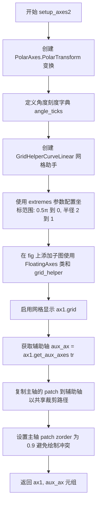
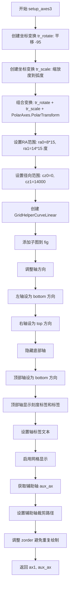

# `matplotlib\galleries\examples\axisartist\demo_floating_axes.py` 详细设计文档

这是一个matplotlib floating_axes模块的演示脚本，通过三个示例展示了如何使用GridHelperCurveLinear创建自定义坐标系的浮动轴，包括直角坐标、极坐标和天文学坐标（RA/Dec）系统的绑定与可视化。

## 整体流程

```mermaid
graph TD
    A[开始: 设置随机种子] --> B[创建Figure容器]
B --> C[调用setup_axes1创建第一个子图]
C --> D[在aux_ax1上绘制柱状图]
D --> E[调用setup_axes2创建第二个子图]
E --> F[生成随机极坐标数据]
F --> G[在aux_ax2上绘制散点图]
G --> H[调用setup_axes3创建第三个子图]
H --> I[生成随机天文学坐标数据]
I --> J[在aux_ax3上绘制散点图]
J --> K[调用plt.show显示图形]
K --> L[结束]

subgraph setup_axes1流程
    C1[创建仿射变换: scale(2,1).rotate_deg(30)] --> C2[创建GridHelperCurveLinear]
C2 --> C3[添加FloatingAxes子图]
C3 --> C4[获取辅助轴aux_ax]
end

subgraph setup_axes2流程
    E1[创建PolarAxes.PolarTransform] --> E2[定义角度刻度格式化器]
E2 --> E3[创建GridHelperCurveLinear（极坐标）]
E3 --> E4[添加FloatingAxes子图]
E4 --> E5[获取辅助轴并设置裁剪路径]
end

subgraph setup_axes3流程
    H1[创建复合变换: translate+scale+PolarTransform] --> H2[设置RA/Dec坐标范围]
H2 --> H3[创建GridHelperCurveLinear]
H3 --> H4[调整轴方向和可见性]
H4 --> H5[设置轴标签]
H5 --> H6[获取辅助轴并设置裁剪路径]
end
```

## 类结构

```
代码为脚本性质，无自定义类定义
主要使用matplotlib第三方库类：
├── matplotlib.pyplot.Figure
├── matplotlib.axes.Axes
├── matplotlib.transforms.Affine2D
├── mpl_toolkits.axisartist.floating_axes.FloatingAxes
├── mpl_toolkits.axisartist.floating_axes.GridHelperCurveLinear
├── matplotlib.projections.PolarAxes
└── mpl_toolkits.axisartist.grid_finder (FixedLocator, MaxNLocator, DictFormatter)
```

## 全局变量及字段


### `np`
    
numpy.random模块，用于生成随机数

类型：`numpy module`
    


### `pi`
    
numpy常量，代表圆周率π（setup_axes2函数内局部变量）

类型：`float`
    


### `angle_ticks`
    
角度刻度字典（setup_axes2函数内局部变量）

类型：`dict`
    


### `tr`
    
仿射变换对象（各setup_axes函数内局部变量）

类型：`Affine2D/PolarAxes.PolarTransform`
    


### `grid_helper`
    
GridHelperCurveLinear对象，用于管理网格线和刻度

类型：`GridHelperCurveLinear`
    


### `ax1`
    
FloatingAxes对象，表示具有自定义变换的主绘图区域

类型：`FloatingAxes`
    


### `aux_ax`
    
辅助坐标系轴对象，用于在变换后的坐标系中绘图

类型：`Axes`
    


### `theta`
    
角度数据数组，表示极坐标中的角度值

类型：`ndarray`
    


### `radius`
    
半径/径向数据数组，表示到中心的距离值

类型：`ndarray`
    


### `ra0`
    
赤经范围下限（setup_axes3函数内）

类型：`float`
    


### `ra1`
    
赤经范围上限（setup_axes3函数内）

类型：`float`
    


### `cz0`
    
径向坐标范围下限（setup_axes3函数内）

类型：`float`
    


### `cz1`
    
径向坐标范围上限（setup_axes3函数内）

类型：`float`
    


    

## 全局函数及方法


### `setup_axes1`

该函数用于在给定的Figure对象上创建一个带有倾斜缩放（Scaling 2,1, Rotation 30°）的直角坐标系浮动轴（Floating Axis），并配置网格辅助线，最终返回主轴对象和一个用于数据绑定的辅助轴对象。

参数：

- `fig`：`matplotlib.figure.Figure`，Matplotlib的图形对象，用于承载坐标轴。
- `rect`：`int` or `tuple`，子图位置参数，传递给`add_subplot`以确定轴的位置（如 131）。

返回值：`tuple`，返回一个包含两个Axes对象的元组。
- `ax1`：`mpl_toolkits.axisartist.floating_axes.FloatingAxes`，创建的主浮动坐标轴对象。
- `aux_ax`：`matplotlib.axes.Axes`，通过`get_aux_axes`获取的辅助轴对象，已应用了坐标变换。

#### 流程图

```mermaid
graph TD
    A([开始 setup_axes1]) --> B[创建变换对象 tr: Affine2D<br/>.scale(2, 1).rotate_deg(30)]
    B --> C[创建网格助手 GridHelperCurveLinear<br/>extremes=(-0.5, 3.5, 0, 4)<br/>grid_locator1/2=MaxNLocator]
    C --> D[添加子图 ax1: fig.add_subplot<br/>axes_class=FloatingAxes<br/>grid_helper=grid_helper]
    D --> E[ax1.grid<br/>开启网格显示]
    E --> F[获取辅助轴 aux_ax: ax1.get_aux_axes(tr)]
    F --> G([返回 ax1, aux_ax])
```

#### 带注释源码

```python
def setup_axes1(fig, rect):
    """
    A simple one.
    """
    # 1. 定义坐标变换：先缩放(宽2倍，高1倍)，再旋转30度
    tr = Affine2D().scale(2, 1).rotate_deg(30)

    # 2. 创建曲线网格辅助器，定义坐标轴的范围和网格定位器
    # extremes 定义了 x轴(-0.5到3.5) 和 y轴(0到4) 的范围
    grid_helper = floating_axes.GridHelperCurveLinear(
        tr, extremes=(-0.5, 3.5, 0, 4),
        grid_locator1=MaxNLocator(nbins=4),
        grid_locator2=MaxNLocator(nbins=4))

    # 3. 在Figure上添加子图，指定使用FloatingAxes类，并应用网格助手
    ax1 = fig.add_subplot(
        rect, axes_class=floating_axes.FloatingAxes, grid_helper=grid_helper)
    
    # 4. 显示网格线
    ax1.grid()

    # 5. 获取辅助轴，该轴会自动应用 tr 变换，常用于绑定数据点
    # 使得绘制的数据坐标自动转换为显示坐标
    aux_ax = ax1.get_aux_axes(tr)

    return ax1, aux_ax
```


### `setup_axes2(fig, rect)`

该函数用于创建一个基于极坐标系的浮动轴（Floating Axes），包含自定义的刻度定位器和格式化器，用于显示特殊角度值（如 0、π/4、π/2 等）。

参数：

- `fig`：`matplotlib.figure.Figure`，要在其中添加子图的图形对象
- `rect`：整数或元组，指定子图在图形中的位置（如 `132` 表示 1 行 3 列的第 2 个子图位置）

返回值：`(ax1, aux_ax)` 元组
- `ax1`：`floating_axes.FloatingAxes`，主浮动轴对象
- `aux_ax`：辅助轴（寄生轴），用于在变换后的坐标系中绘制数据

#### 流程图



#### 带注释源码

```python
def setup_axes2(fig, rect):
    """
    With custom locator and formatter.
    Note that the extreme values are swapped.
    """
    # 1. 创建极坐标变换对象，用于将数据坐标映射到极坐标系
    tr = PolarAxes.PolarTransform()

    # 2. 定义 pi 常量，用于角度刻度标签
    pi = np.pi
    
    # 3. 定义角度刻度标签字典：将弧度值映射到 LaTeX 格式的字符串
    #    这里定义了 0, π/4, π/2 三个角度的显示标签
    angle_ticks = {
        0: r"$0$",
        pi/4: r"$\frac{1}{4}\pi$",
        pi/2: r"$\frac{1}{2}\pi$",
    }
    
    # 4. 创建曲线线性网格助手，配置自定义刻度定位器和格式化器
    #    - tr: 极坐标变换
    #    - extremes: 坐标范围极值（注意：角度极值被 swapped：0.5π 到 0）
    #    - grid_locator1: 角度方向的网格定位器（使用 FixedLocator 固定位置）
    #    - tick_formatter1: 角度方向的刻度格式化器（使用 DictFormatter）
    #    - grid_locator2: 径向方向的网格定位器（MaxNLocator 最多2个刻度）
    #    - tick_formatter2: 径向方向的刻度格式化器（None 使用默认格式）
    grid_helper = floating_axes.GridHelperCurveLinear(
        tr, extremes=(.5*pi, 0, 2, 1),
        grid_locator1=FixedLocator([*angle_ticks]),
        tick_formatter1=DictFormatter(angle_ticks),
        grid_locator2=MaxNLocator(2),
        tick_formatter2=None,
    )
    
    # 5. 在图形上添加子图，使用 FloatingAxes 类和自定义网格助手
    ax1 = fig.add_subplot(
        rect, axes_class=floating_axes.FloatingAxes, grid_helper=grid_helper)
    
    # 6. 启用网格显示
    ax1.grid()

    # 7. 创建辅助轴（寄生轴），用于在变换后的坐标系中绘制数据
    #    这个辅助轴会自动应用 tr 变换
    aux_ax = ax1.get_aux_axes(tr)

    # 8. 将主轴的 patch 复制到辅助轴，使辅助轴具有与主轴相同的裁剪路径
    aux_ax.patch = ax1.patch  # for aux_ax to have a clip path as in ax
    
    # 9. 设置主轴 patch 的 zorder 为 0.9，避免 patch 被绘制两次
    #    副作用是可能会覆盖其他艺术家对象，因此降低 zorder
    ax1.patch.zorder = 0.9  # but this has a side effect that the patch is
    # drawn twice, and possibly over some other
    # artists. So, we decrease the zorder a bit to
    # prevent this.

    # 10. 返回主轴和辅助轴的元组
    return ax1, aux_ax
```


### `setup_axes3`

该函数创建第三个示例轴，演示如何使用 `floating_axes` 模块创建天文学RA/Dec坐标系的扇形浮动轴，通过调整坐标变换和轴方向来适应天文数据的可视化需求。

参数：

- `fig`：`matplotlib.figure.Figure`，matplotlib 图形对象，用于添加子图
- `rect`：`tuple` 或 `int`，子图位置参数，指定子图在图形中的位置（可以是 3 位数字如 131 表示 1 行 3 列的第 1 个位置）

返回值：`tuple`，返回两个元素：主轴对象（`floating_axes.FloatingAxes`）和辅助轴对象（用于绘制数据的寄生虫轴）

#### 流程图



#### 带注释源码

```python
def setup_axes3(fig, rect):
    """
    Sometimes, things like axis_direction need to be adjusted.
    """
    # 创建旋转变换：平移 -95 度以获得更好的方向
    tr_rotate = Affine2D().translate(-95, 0)
    
    # 创建缩放变换：将度转换为弧度
    tr_scale = Affine2D().scale(np.pi/180., 1.)
    
    # 组合变换：旋转 + 缩放 + 极坐标变换
    tr = tr_rotate + tr_scale + PolarAxes.PolarTransform()

    # 指定 theta 极限（RA 范围，单位：度）
    # 8 小时到 14 小时，每小时 15 度
    ra0, ra1 = 8.*15, 14.*15
    
    # 指定径向极限（红移/速度）
    cz0, cz1 = 0, 14000

    # 创建曲线网格辅助器
    grid_helper = floating_axes.GridHelperCurveLinear(
        tr, 
        extremes=(ra0, ra1, cz0, cz1),  # 设置 RA 和径向的范围
        grid_locator1=angle_helper.LocatorHMS(4),  # RA 轴：4 个 HMS 刻度
        tick_formatter1=angle_helper.FormatterHMS(),  # RA 刻度格式：HMS
        grid_locator2=MaxNLocator(3),  # 径向轴：最多 3 个刻度
        tick_formatter2=None,  # 径向刻度无特殊格式
    )
    
    # 添加子图，使用 floating_axes 作为轴类
    ax1 = fig.add_subplot(
        rect, 
        axes_class=floating_axes.FloatingAxes, 
        grid_helper=grid_helper
    )

    # 调整轴方向
    ax1.axis["left"].set_axis_direction("bottom")  # 左轴方向设为底部
    ax1.axis["right"].set_axis_direction("top")    # 右轴方向设为顶部

    ax1.axis["bottom"].set_visible(False)  # 隐藏底部轴
    ax1.axis["top"].set_axis_direction("bottom")  # 顶部轴方向设为底部
    ax1.axis["top"].toggle(ticklabels=True, label=True)  # 显示顶部轴标签
    ax1.axis["top"].major_ticklabels.set_axis_direction("top")  # 刻度标签方向
    ax1.axis["top"].label.set_axis_direction("top")  # 标签方向

    # 设置轴标签
    ax1.axis["left"].label.set_text(r"cz [km$^{-1}$]")  # 左轴标签：红移速度
    ax1.axis["top"].label.set_text(r"$\alpha_{1950}$")  # 顶轴标签：1950 年赤经
    
    ax1.grid()  # 显示网格

    # 创建寄生虫轴，用于在 RA-cz 坐标系中绘制数据
    aux_ax = ax1.get_aux_axes(tr)

    # 让辅助轴具有与主轴相同的裁剪路径
    aux_ax.patch = ax1.patch
    
    # 降低 zorder 以避免裁剪路径副作用导致的重复绘制
    ax1.patch.zorder = 0.9

    return ax1, aux_ax
```

## 关键组件


### floating_axes.GridHelperCurveLinear

用于创建曲线网格辅助线的关键类，支持自定义坐标变换和坐标边界

### floating_axes.FloatingAxes

浮动坐标轴类，支持任意仿射变换的坐标系统

### Affine2D

仿射变换类，用于实现坐标的缩放、旋转和平移操作

### PolarAxes.PolarTransform

极坐标变换，将数据坐标转换为极坐标（角度和半径）

### 辅助坐标轴系统 (aux_ax)

通过get_aux_axes获取的辅助坐标轴，用于在变换后的坐标系统中绘图

### grid_locator / tick_formatter

网格定位器和刻度格式化器，控制坐标轴刻度的位置和显示格式

### 坐标轴方向控制

通过set_axis_direction调整坐标轴标签和刻度的显示方向


## 问题及建议


### 已知问题

-   **重复代码（DRY原则违反）**：setup_axes2和setup_axes3中存在完全相同的代码块（`aux_ax.patch = ax1.patch` 和 `ax1.patch.zorder = 0.9`），且注释明确指出这会导致patch被绘制两次的副作用，但未提取为公共函数
-   **魔法数字和硬编码值**：代码中包含大量未解释的硬编码数值，如`19680801`（随机种子）、`131/132/133`（子图位置）、`8.*15`、`14.*15`、`14000`等，缺乏常量定义
-   **注释中已知问题未解决**：代码注释明确指出`ax1.patch.zorder = 0.9`会产生副作用（"patch is drawn twice, and possibly over some other artists"），但只是通过降低zorder来缓解，未从根本上解决
-   **文档字符串不完整**：部分函数文档过于简略，如setup_axes1仅用"A simple one."描述，缺少参数和返回值说明
-   **缺乏输入验证**：setup_axes系列函数未对参数（如fig、rect）进行类型检查或有效性验证
-   **可变状态共享**：aux_ax直接共享ax1的patch对象，可能导致意外的副作用和状态耦合

### 优化建议

-   **提取公共函数**：将setup_axes2和setup_axes3中共享的aux_ax创建逻辑提取为独立的辅助函数，接受transform和ax1参数
-   **定义常量**：将所有魔法数字提取为模块级常量或配置字典，如将子图布局参数、随机种子、阈值等定义为有意义的命名常量
-   **改进文档**：为所有函数添加完整的docstring，包含参数类型、返回值类型和详细的函数描述
-   **添加类型提示**：使用Python类型注解明确函数参数和返回值的类型
-   **封装配置**：将axes配置参数（如extremes、grid_locator、tick_formatter等）封装为配置类或字典，提高可维护性
-   **考虑使用dataclass**：对于复杂配置对象（如angle_ticks字典），可以使用dataclass或TypedDict提供更好的类型安全和代码提示
-   **添加错误处理**：为关键函数添加参数验证和异常处理逻辑


## 其它


### 设计目标与约束

本代码演示了 matplotlib floating_axes 模块的核心功能，旨在展示如何创建非标准坐标系的图表，包括旋转坐标轴、极坐标转换以及自定义坐标范围。设计目标包括：1）提供灵活的自定义坐标变换能力；2）支持复杂的坐标轴布局；3）与 matplotlib 标准图表类型（scatter、bar）无缝集成。约束条件包括：依赖 matplotlib axisartist 工具包，需要特定的坐标变换矩阵，且仅在支持 matplotlib 的 Python 环境中运行。

### 错误处理与异常设计

代码主要通过 matplotlib 内部的异常处理机制工作。在 `setup_axes` 系列函数中，参数验证由调用方负责。可能的异常场景包括：1）极端值设置不当导致坐标轴创建失败；2）网格定位器与坐标范围不匹配；3）仿射变换参数错误。对于这些情况，matplotlib 会抛出 ValueError 或 RuntimeError。代码本身未实现额外的错误捕获机制，依赖调用者确保参数有效性。

### 数据流与状态机

代码的数据流如下：首先通过 `Affine2D` 或 `PolarAxes.PolarTransform` 定义坐标变换；然后创建 `GridHelperCurveLinear` 对象并设置极端值和定位器；接着通过 `fig.add_subplot` 创建 FloatingAxes 子图；最后通过 `get_aux_axes` 获取辅助坐标系用于绑制数据。主状态机包含三个主要状态：坐标变换定义、网格助手配置、图表绑制与显示。

### 外部依赖与接口契约

主要依赖包括：1）matplotlib.pyplot 用于图表创建；2）numpy 用于数值计算和随机数生成；3）matplotlib.projections.PolarAxes 提供极坐标支持；4）matplotlib.transforms.Affine2D 提供仿射变换；5）mpl_toolkits.axisartist.angle_helper 提供角度定位器和格式化器；6）mpl_toolkits.axisartist.floating_axes 提供浮动坐标轴功能；7）mpl_toolkits.axisartist.grid_finder 提供网格定位和格式化工具。接口契约要求：传入的 fig 必须为有效的 matplotlib Figure 对象，rect 参数应为有效的子图位置元组（如 131 表示 1 行 3 列的第 1 个位置）。

### 性能考虑

当前实现对于演示目的性能足够。潜在的性能瓶颈包括：1）大量数据点时 scatter 和 bar 的渲染；2）复杂的坐标变换计算；3）网格线的密集计算。优化建议包括：1）对于大数据集，考虑使用 PathCollection 而非 scatter；2）预先计算坐标变换矩阵；3）减少网格线数量（通过调整 nbins 参数）。

### 安全性考虑

代码本身不涉及用户输入或网络通信，安全性风险较低。唯一的潜在风险是 `np.random.seed(19680801)` 使用固定随机种子，虽然这有助于重现性，但在某些场景下可能不符合安全最佳实践。代码不执行任何文件操作或命令执行，因此不存在注入风险。

### 测试策略

代码可从以下维度进行测试：1）单元测试验证各个 `setup_axes` 函数返回有效的 Axes 对象；2）集成测试验证完整图表创建流程；3）参数边界测试验证极端值设置的各种组合；4）回归测试确保修改后功能保持一致。测试应覆盖不同坐标变换类型、不同网格定位器组合以及不同的坐标极端值设置。

### 配置和参数说明

关键配置参数包括：1）tr（Transform）：坐标变换对象，支持 Affine2D 或 PolarTransform；2）extremes：元组形式 (min1, max1, min2, max2) 定义坐标范围；3）grid_locator1/2：控制网格线数量和位置；4）tick_formatter1/2：控制刻度标签格式。不同场景的配置示例：简单旋转使用 Affine2D().scale().rotate_deg()，极坐标使用 PolarAxes.PolarTransform()，天文学应用使用组合变换。

### 版本历史和变更记录

当前版本为初始演示版本，基于 matplotlib 3.x 系列。变更记录：初始版本包含三个演示场景，分别展示基础功能、自定义定位器/格式化器以及复杂的天文坐标应用。后续可能的增强包括：添加更多坐标变换类型、支持3D浮动坐标轴、提供更丰富的网格助手选项。

    