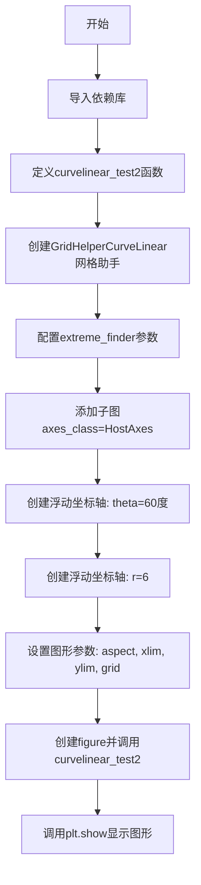
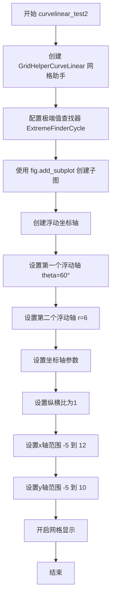

# `matplotlib\galleries\examples\axisartist\demo_floating_axis.py` 详细设计文档

这是一个matplotlib可视化演示代码，展示了如何在矩形框内创建浮动极坐标轴，实现极坐标曲线在直角坐标系中的可视化展示。

## 整体流程



## 类结构

```
无自定义类
主要使用matplotlib内置类:
├── plt (matplotlib.pyplot模块)
├── np (numpy模块)
├── PolarAxes (极坐标轴类)
├── Affine2D (仿射变换类)
├── GridHelperCurveLinear (曲线网格助手)
├── HostAxes (宿主坐标轴)
└── angle_helper (角度辅助模块)
    ├── ExtremeFinderCycle
    ├── LocatorDMS
    └── FormatterDMS
```

## 全局变量及字段


### `fig`
    
A matplotlib Figure object that serves as the container for the plot, initialized with a 5x5 inch size.

类型：`matplotlib.figure.Figure`
    


    

## 全局函数及方法


### `curvelinear_test2`

该函数用于在矩形框内创建极坐标投影的可视化图表，通过自定义网格助手和浮动轴实现极坐标曲线的展示，并设置坐标轴范围和网格样式。

参数：

- `fig`：`matplotlib.figure.Figure`，传入的 matplotlib 画布对象，用于添加子图

返回值：`None`，该函数直接在传入的画布对象上绘制图形，不返回任何值

#### 流程图



#### 带注释源码

```python
def curvelinear_test2(fig):
    """Polar projection, but in a rectangular box."""
    # 创建网格助手，用于将极坐标投影映射到矩形框中
    # Affine2D().scale(np.pi / 180., 1.) 将角度转换为弧度
    # PolarAxes.PolarTransform() 提供极坐标变换
    grid_helper = GridHelperCurveLinear(
        Affine2D().scale(np.pi / 180., 1.) + PolarAxes.PolarTransform(),
        # extreme_finder 定义坐标轴的显示范围
        # 20, 20 表示经纬度方向各取20个点
        # lon_cycle=360 表示经度周期为360度
        # lat_minmax=(0, np.inf) 限制纬度范围从0到无穷大
        extreme_finder=angle_helper.ExtremeFinderCycle(
            20, 20,
            lon_cycle=360, lat_cycle=None,
            lon_minmax=None, lat_minmax=(0, np.inf),
        ),
        # 设置经度网格定位器，每12度一个刻度
        grid_locator1=angle_helper.LocatorDMS(12),
        # 设置经度刻度格式化器
        tick_formatter1=angle_helper.FormatterDMS(),
    )
    # 在画布上添加子图，使用自定义的HostAxes和网格助手
    ax1 = fig.add_subplot(axes_class=HostAxes, grid_helper=grid_helper)

    # ==================== 创建浮动坐标轴 ====================
    # 浮动坐标轴是在主坐标框外部显示的辅助坐标轴

    # 创建第一个浮动轴，固定theta坐标为60度
    # 参数0表示第一个坐标（theta），60是固定值
    ax1.axis["lat"] = axis = ax1.new_floating_axis(0, 60)
    axis.label.set_text(r"$\theta = 60^{\circ}$")  # 设置标签文本
    axis.label.set_visible(True)  # 使标签可见

    # 创建第二个浮动轴，固定r坐标为6
    # 参数1表示第二个坐标（r），6是固定值
    ax1.axis["lon"] = axis = ax1.new_floating_axis(1, 6)
    axis.label.set_text(r"$r = 6$")

    # ==================== 设置坐标轴属性 ====================
    ax1.set_aspect(1.)  # 设置坐标轴纵横比为1，保持形状不变
    ax1.set_xlim(-5, 12)  # 设置x轴显示范围
    ax1.set_ylim(-5, 10)  # 设置y轴显示范围

    ax1.grid(True)  # 开启网格显示
```

## 关键组件


### 一段话描述

该代码是一个matplotlib可视化示例，演示了如何在矩形框内创建极坐标投影的浮动坐标轴，通过GridHelperCurveLinear将极坐标（θ, r）映射到笛卡尔坐标系，并设置特定角度（60°）和半径（6）的浮动轴标签。

### 文件的整体运行流程

1. 导入必要的matplotlib和numpy库
2. 定义curvelinear_test2函数，创建极坐标投影的浮动坐标轴
3. 在函数内部创建GridHelperCurveLinear网格辅助对象，配置坐标变换和极值查找
4. 使用fig.add_subplot创建HostAxes坐标轴
5. 通过new_floating_method创建两个浮动坐标轴（角度θ=60°和半径r=6）
6. 设置坐标轴标签、宽高比、坐标范围和网格
7. 在主程序中创建figure并调用curvelinear_test2函数
8. 调用plt.show()显示图形

### 类的详细信息

#### 全局函数

**curvelinear_test2(fig)**

- 参数：fig (matplotlib.figure.Figure) - matplotlib图形对象
- 返回值：None
- 描述：创建极坐标投影的浮动坐标轴演示

#### 关键类和方法

**GridHelperCurveLinear**

- 来源：mpl_toolkits.axisartist
- 用途：曲线网格辅助工具，将 curvilinear 坐标映射到笛卡尔坐标

**Affine2D**

- 来源：matplotlib.transforms
- 用途：二维仿射变换，用于坐标缩放（角度转弧度）

**PolarAxes.PolarTransform**

- 来源：matplotlib.projections
- 用途：极坐标变换，将极坐标转换为笛卡尔坐标

**ExtremeFinderCycle**

- 来源：mpl_toolkits.axisartist.angle_helper
- 用途：查找坐标轴的极值边界

**HostAxes**

- 来源：mpl_toolkits.axisartist
- 用途：支持浮动坐标轴的主机坐标轴类

### 关键组件信息

#### 组件1：GridHelperCurveLinear

用于管理曲线坐标系的网格辅助类，将极坐标系统一转换为矩形框中的笛卡尔坐标表示

#### 组件2：PolarAxes.PolarTransform

极坐标变换模块，将θ（角度）和r（半径）转换为x和y坐标

#### 组件3：Affine2D().scale(np.pi / 180., 1.)

仿射变换，将角度从度转换为弧度（π/180），同时保持半径比例不变

#### 组件4：new_floating_axis方法

动态创建浮动坐标轴，允许在固定坐标值处显示坐标轴线

#### 组件5：ExtremeFinderCycle

极值查找器，确定坐标轴的显示范围和边界

### 潜在的技术债务或优化空间

1. **硬编码参数**：角度值60和半径值6硬编码在代码中，可考虑参数化以提高复用性
2. **魔法数字**：np.pi/180等转换系数可提取为常量，提高代码可读性
3. **缺乏错误处理**：未对输入参数进行验证，grid_helper创建失败时缺乏异常捕获
4. **注释不足**：部分关键配置（如extreme_finder参数）缺乏详细说明

### 其它项目

#### 设计目标与约束

- 目标：在矩形框内展示极坐标曲线，提供更好的极坐标可视化效果
- 约束：依赖mpl_toolkits.axisartist模块，需要matplotlib 1.0+

#### 错误处理与异常设计

- 缺少输入验证，grid_helper参数错误可能导致难以调试的显示问题
- 未处理极端情况（如角度范围、坐标范围超出合理值）

#### 数据流与状态机

- 数据流：fig → grid_helper → HostAxes → floating_axis → 渲染显示
- 状态：初始化 → 坐标变换配置 → 坐标轴创建 → 标签设置 → 图形渲染

#### 外部依赖与接口契约

- 依赖：matplotlib, numpy, mpl_toolkits.axisartist
- 接口：fig.add_subplot()接受axes_class和grid_helper参数，new_floating_axis()接受坐标索引和值参数


## 问题及建议


### 已知问题

-   **硬编码配置值**：60度、6、半径范围(-5, 12)和(-5, 10)等数值直接写在代码中，缺乏可配置性
-   **魔法数字缺乏解释**：代码中存在多个数值如20、360、12等没有任何注释说明其含义
-   **缺少类型注解**：函数参数和返回值没有类型提示，影响代码可读性和IDE支持
-   **GridHelper配置过于复杂**：grid_helper的创建包含大量嵌套参数，可读性和可维护性差
-   **错误处理缺失**：没有对输入参数进行验证，extreme_finder、grid_locator等组件创建失败时缺乏相应异常处理
-   **资源管理不完善**：创建figure后没有显式的close操作，可能导致资源泄露（在某些使用场景下）
-   **可测试性差**：所有配置都内联在函数中，难以单独测试各个组件的行为

### 优化建议

-   **提取配置参数**：将角度、半径限制、figure大小等改为函数参数或配置文件，提供默认值的同事允许自定义
-   **添加类型注解**：为函数参数添加类型提示，如fig: plt.Figure -> plt.Axes
-   **分解复杂配置**：将GridHelper的创建逻辑提取为独立函数或类方法，增强可读性
-   **添加常量定义**：使用有意义的常量替代魔法数字，如`DEFAULT_THETA = 60`、`DEFAULT_R = 6`
-   **增强文档**：为函数添加完整的docstring，说明参数含义、返回值和可能的异常
-   **考虑上下文管理器**：使用`with plt.style.context(...):`来管理图表样式
-   **分离关注点**：将"创建浮动轴"的逻辑封装为独立函数，便于复用和单元测试
-   **添加输入验证**：检查极端值查找器参数、坐标限制等是否合法


## 其它


### 设计目标与约束

本代码演示了在matplotlib中实现浮动极坐标轴的功能，目标是在矩形坐标系框内展示极坐标曲线。设计约束包括：必须使用GridHelperCurveLinear进行坐标变换，仅支持2D极坐标系统，浮动轴仅支持theta（角度）和r（半径）两个维度的固定显示。

### 错误处理与异常设计

代码中未显式实现错误处理机制。潜在的异常情况包括：angle_helper.ExtremeFinderCycle参数无效导致坐标计算错误；GridHelperCurveLinear的transform方法失败；fig.add_subplot创建子图失败。改进建议：添加参数验证、异常捕获与日志记录。

### 数据流与状态机

数据流：fig对象 → GridHelperCurveLinear(grid_helper) → HostAxes(ax1) → new_floating_axis创建浮动轴 → set_aspect/set_xlim/set_ylim设置视图。无复杂状态机，仅有初始化→配置→渲染的简单流程。

### 外部依赖与接口契约

主要依赖：matplotlib.pyplot(Figure/plt)、numpy(np)、matplotlib.projections(PolarAxes)、matplotlib.transforms(Affine2D)、mpl_toolkits.axisartist(GridHelperCurveLinear/HostAxes/angle_helper)。接口契约：curvelinear_test2(fig)接收Figure对象，返回None，副作用是在fig上绘制极坐标子图。

### 性能考虑

当前实现为一次性演示代码，无性能优化需求。潜在优化点：grid_helper和transform对象可缓存复用；大量浮动轴时考虑批量创建。

### 安全性考虑

代码为纯可视化演示，无用户输入处理，无安全风险。

### 测试策略

建议添加单元测试验证：fig对象正确创建、ax1子图类型正确、浮动轴数量为2、坐标轴标签文本正确、set_aspect(1.)生效、xlim/ylim设置正确。

### 兼容性考虑

代码依赖matplotlib 3.x版本和mpl_toolkits.axisartist模块。angle_helper模块的API在不同matplotlib版本间可能有变化，需要版本兼容性检查。

    