# `matplotlib\galleries\examples\axisartist\demo_parasite_axes.py` 详细设计文档

This code demonstrates the creation and usage of a parasite Axes in Matplotlib, which shares the x-axis with a host Axes but has a separate y-axis scale. It creates a figure with a host Axes and two parasite Axes, each with a different y-axis scale, and plots data on them.

## 整体流程

```mermaid
graph TD
    A[开始] --> B[创建 figure]
    B --> C[添加 host Axes]
    C --> D[获取辅助 Axes (parasite Axes)]
    D --> E[设置 host Axes 的 y 轴不可见]
    D --> F[设置第一个 parasite Axes 的 y 轴可见]
    F --> G[创建第二个 parasite Axes]
    G --> H[绘制数据]
    H --> I[设置坐标轴限制和标签]
    I --> J[显示图例]
    J --> K[显示图形]
    K --> L[结束]
```

## 类结构

```
matplotlib.pyplot (主模块)
├── figure (创建图形)
│   ├── add_axes (添加轴)
│   ├── plot (绘制数据)
│   ├── set (设置属性)
│   └── show (显示图形)
└── mpl_toolkits.axisartist.parasite_axes (寄生虫轴模块)
    ├── HostAxes (主机轴)
    ├── ParasiteAxes (寄生虫轴)
    ├── get_aux_axes (获取辅助轴)
    └── new_fixed_axis (创建固定轴)
```

## 全局变量及字段


### `fig`
    
The main figure object where all axes are created.

类型：`matplotlib.figure.Figure`
    


### `host`
    
The host axes that shares the x scale with the parasite axes.

类型：`mpl_toolkits.axisartist.parasite_axes.ParasiteAxes`
    


### `par1`
    
The first parasite axes that shows a different scale in the y direction.

类型：`mpl_toolkits.axisartist.parasite_axes.ParasiteAxes`
    


### `par2`
    
The second parasite axes that shows a different scale in the y direction.

类型：`mpl_toolkits.axisartist.parasite_axes.ParasiteAxes`
    


### `p1`
    
The line plot object for the density data on the host axes.

类型：`matplotlib.lines.Line2D`
    


### `p2`
    
The line plot object for the temperature data on the parasite axes par1.

类型：`matplotlib.lines.Line2D`
    


### `p3`
    
The line plot object for the velocity data on the parasite axes par2.

类型：`matplotlib.lines.Line2D`
    


### `HostAxes.axes`
    
The main axes object of the host axes.

类型：`matplotlib.axes.Axes`
    


### `HostAxes.host_axes`
    
The host axes object that is shared with the parasite axes.

类型：`mpl_toolkits.axisartist.parasite_axes.ParasiteAxes`
    


### `HostAxes.parasite_axes`
    
The parasite axes object that is created as an auxiliary axes to the host axes.

类型：`mpl_toolkits.axisartist.parasite_axes.ParasiteAxes`
    


### `ParasiteAxes.axes`
    
The main axes object of the parasite axes.

类型：`matplotlib.axes.Axes`
    


### `ParasiteAxes.host_axes`
    
The host axes object that is shared with the parasite axes.

类型：`mpl_toolkits.axisartist.parasite_axes.ParasiteAxes`
    


### `ParasiteAxes.parasite_axes`
    
The parasite axes object that is created as an auxiliary axes to the host axes.

类型：`mpl_toolkits.axisartist.parasite_axes.ParasiteAxes`
    
    

## 全局函数及方法


### plot

The `plot` method is used to create a line plot on the specified axes.

参数：

- `x`：`list`，The x coordinates of the data points.
- `y`：`list`，The y coordinates of the data points.
- `label`：`str`，The label for the line plot.

返回值：`Line2D`，The line plot object.

#### 流程图

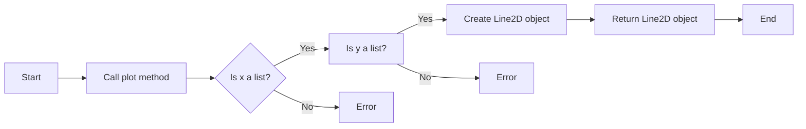

#### 带注释源码

```python
p1, = host.plot([0, 1, 2], [0, 1, 2], label="Density")
p2, = par1.plot([0, 1, 2], [0, 3, 2], label="Temperature")
p3, = par2.plot([0, 1, 2], [50, 30, 15], label="Velocity")
```


### host.set

设置主轴的x和y限制，以及x和y轴标签。

参数：

- `xlim`：`(0, 2)`，设置x轴的限制范围。
- `ylim`：`(0, 2)`，设置y轴的限制范围。
- `xlabel`：`"Distance"`，设置x轴的标签。
- `ylabel`：`"Density"`，设置y轴的标签。

返回值：无

#### 流程图

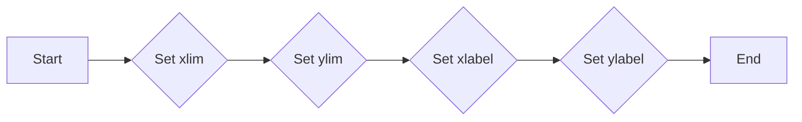

#### 带注释源码

```python
host.set(xlim=(0, 2), ylim=(0, 2), xlabel="Distance", ylabel="Density")
```


### show()

该函数用于显示一个包含多个子图的Matplotlib图形。

参数：

- 无

返回值：无

#### 流程图

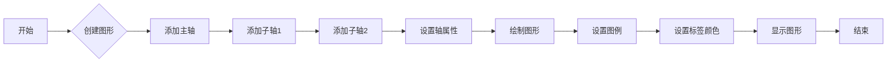

#### 带注释源码

```python
import matplotlib.pyplot as plt

# 创建图形
fig = plt.figure()

# 添加主轴
host = fig.add_axes((0.15, 0.1, 0.65, 0.8), axes_class=HostAxes)

# 添加子轴1
par1 = host.get_aux_axes(viewlim_mode=None, sharex=host)

# 添加子轴2
par2 = host.get_aux_axes(viewlim_mode=None, sharex=host)

# 设置轴属性
host.axis["right"].set_visible(False)
par1.axis["right"].set_visible(True)
par1.axis["right"].major_ticklabels.set_visible(True)
par1.axis["right"].label.set_visible(True)
par2.axis["right2"] = par2.new_fixed_axis(loc="right", offset=(60, 0))

# 绘制图形
p1, = host.plot([0, 1, 2], [0, 1, 2], label="Density")
p2, = par1.plot([0, 1, 2], [0, 3, 2], label="Temperature")
p3, = par2.plot([0, 1, 2], [50, 30, 15], label="Velocity")

# 设置图例
host.legend()

# 设置标签颜色
host.axis["left"].label.set_color(p1.get_color())
par1.axis["right"].label.set_color(p2.get_color())
par2.axis["right2"].label.set_color(p3.get_color())

# 显示图形
plt.show()
```


### `HostAxes`

`HostAxes` 是一个类，用于创建主轴，它将与其他轴共享 x 轴刻度，但在 y 方向上显示不同的刻度。

参数：

- `fig`：`matplotlib.figure.Figure`，表示包含轴的图形对象。
- `pos`：`tuple`，表示轴的位置和大小。
- `axes_class`：`matplotlib.axes.Axes`，指定要创建的轴类。

返回值：`HostAxes`，表示创建的主轴对象。

#### 流程图

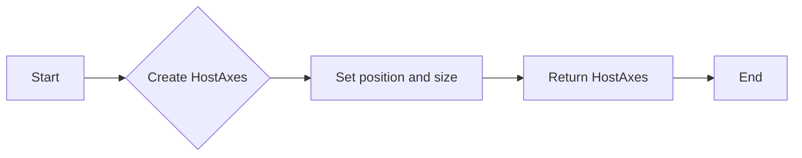

#### 带注释源码

```python
from mpl_toolkits.axisartist.parasite_axes import HostAxes

fig = plt.figure()

host = fig.add_axes((0.15, 0.1, 0.65, 0.8), axes_class=HostAxes)
```


### `get_aux_axes`

`get_aux_axes` 是一个方法，用于获取辅助轴。

参数：

- `viewlim_mode`：`str`，指定视图限制模式。
- `sharex`：`matplotlib.axes.Axes`，指定共享 x 轴的轴。

返回值：`AuxAxes`，表示创建的辅助轴对象。

#### 流程图

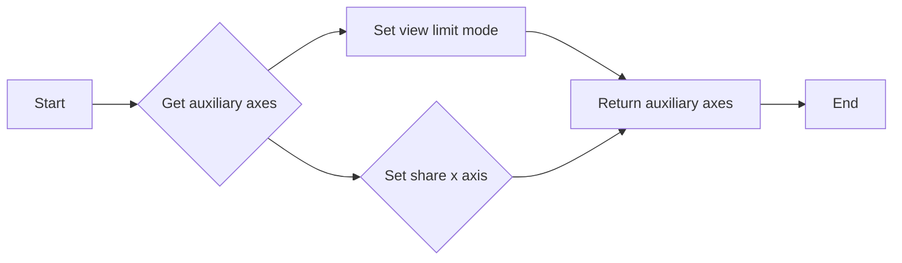

#### 带注释源码

```python
par1 = host.get_aux_axes(viewlim_mode=None, sharex=host)
par2 = host.get_aux_axes(viewlim_mode=None, sharex=host)
```


### `set_visible`

`set_visible` 是一个方法，用于设置轴的可见性。

参数：

- `visible`：`bool`，指定轴是否可见。

#### 流程图

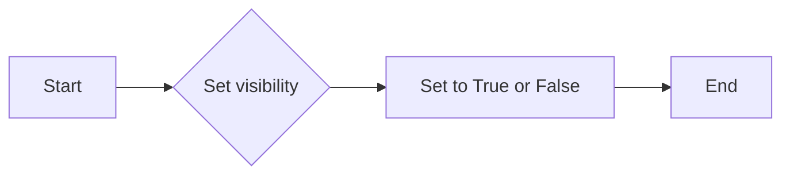

#### 带注释源码

```python
host.axis["right"].set_visible(False)
par1.axis["right"].set_visible(True)
```


### `new_fixed_axis`

`new_fixed_axis` 是一个方法，用于创建新的固定轴。

参数：

- `loc`：`str`，指定轴的位置。
- `offset`：`tuple`，指定轴的偏移量。

返回值：`AuxAxes`，表示创建的辅助轴对象。

#### 流程图

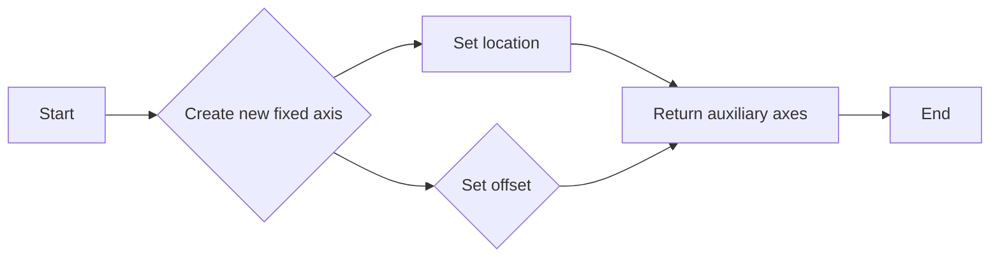

#### 带注释源码

```python
par2.axis["right2"] = par2.new_fixed_axis(loc="right", offset=(60, 0))
```


### `plot`

`plot` 是一个方法，用于在轴上绘制线图。

参数：

- `x`：`array_like`，表示 x 轴数据。
- `y`：`array_like`，表示 y 轴数据。

返回值：`Line2D`，表示绘制的线图对象。

#### 流程图

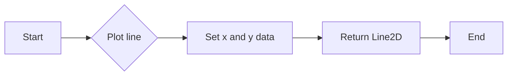

#### 带注释源码

```python
p1, = host.plot([0, 1, 2], [0, 1, 2], label="Density")
p2, = par1.plot([0, 1, 2], [0, 3, 2], label="Temperature")
p3, = par2.plot([0, 1, 2], [50, 30, 15], label="Velocity")
```


### `set`

`set` 是一个方法，用于设置轴的属性。

参数：

- `xlim`：`tuple`，表示 x 轴的限制。
- `ylim`：`tuple`，表示 y 轴的限制。
- `xlabel`：`str`，表示 x 轴标签。
- `ylabel`：`str`，表示 y 轴标签。

#### 流程图

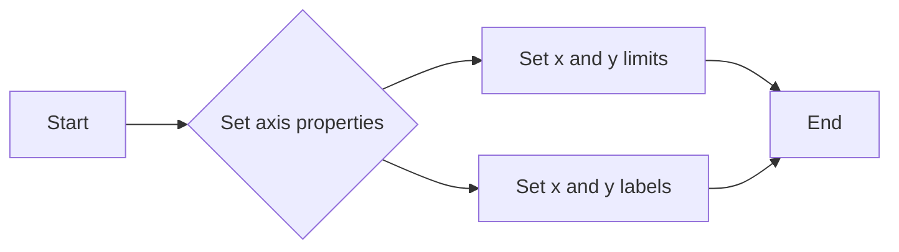

#### 带注释源码

```python
host.set(xlim=(0, 2), ylim=(0, 2), xlabel="Distance", ylabel="Density")
par1.set(ylim=(0, 4), ylabel="Temperature")
par2.set(ylim=(1, 65), ylabel="Velocity")
```


### `legend`

`legend` 是一个方法，用于添加图例。

#### 流程图

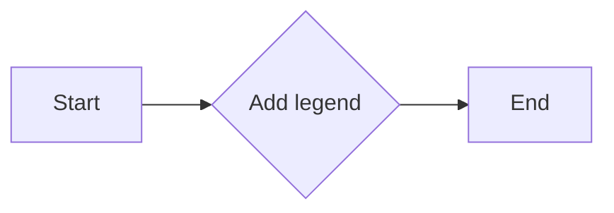

#### 带注释源码

```python
host.legend()
```


### `set_color`

`set_color` 是一个方法，用于设置轴标签的颜色。

参数：

- `color`：`color`，表示颜色。

#### 流程图

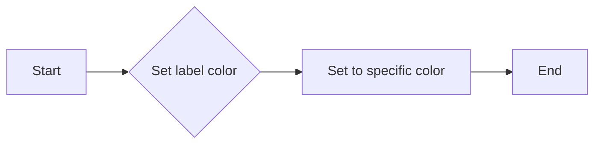

#### 带注释源码

```python
host.axis["left"].label.set_color(p1.get_color())
par1.axis["right"].label.set_color(p2.get_color())
par2.axis["right2"].label.set_color(p3.get_color())
```


### `show`

`show` 是一个方法，用于显示图形。

#### 流程图

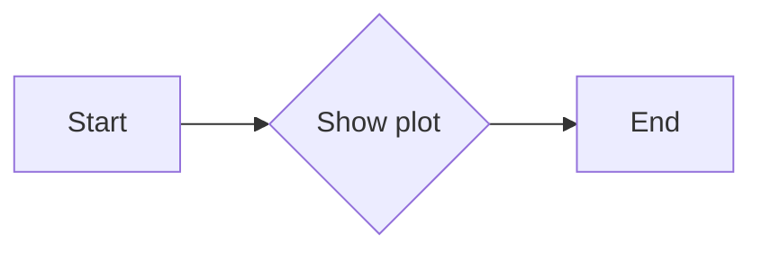

#### 带注释源码

```python
plt.show()
```


### 关键组件信息

- `HostAxes`：创建主轴，共享 x 轴刻度，但在 y 方向上显示不同的刻度。
- `AuxAxes`：创建辅助轴，用于显示不同的 y 轴刻度。
- `plot`：在轴上绘制线图。
- `set`：设置轴的属性。
- `legend`：添加图例。
- `set_color`：设置轴标签的颜色。
- `show`：显示图形。


### 潜在的技术债务或优化空间

- 代码中使用了多个 `get_aux_axes` 调用来创建辅助轴，可以考虑使用循环来简化代码。
- 代码中使用了多个 `set_color` 调用来设置轴标签的颜色，可以考虑使用字典来简化代码。
- 代码中使用了多个 `plot` 调用来绘制线图，可以考虑使用循环来简化代码。


### 设计目标与约束

- 设计目标是创建一个寄生虫轴，共享 x 轴刻度，但在 y 方向上显示不同的刻度。
- 约束是使用 `mpl_toolkits.axisartist.parasite_axes` 模块来实现。


### 错误处理与异常设计

- 代码中没有显式地处理错误或异常。
- 建议在代码中添加异常处理来提高代码的健壮性。


### 数据流与状态机

- 数据流：从主轴创建辅助轴，然后在辅助轴上绘制线图。
- 状态机：代码中没有使用状态机。


### 外部依赖与接口契约

- 外部依赖：`matplotlib` 和 `mpl_toolkits.axisartist.parasite_axes`。
- 接口契约：`HostAxes`、`AuxAxes`、`plot`、`set`、`legend`、`set_color` 和 `show`。


### `HostAxes.get_aux_axes`

获取与宿主轴共享x轴但具有不同y轴比例的辅助轴。

参数：

- `viewlim_mode`：`None`，指定视图限制模式，默认为None。
- `sharex`：`HostAxes`，指定与宿主轴共享x轴的轴。

返回值：`ParasiteAxes`，返回创建的辅助轴。

#### 流程图

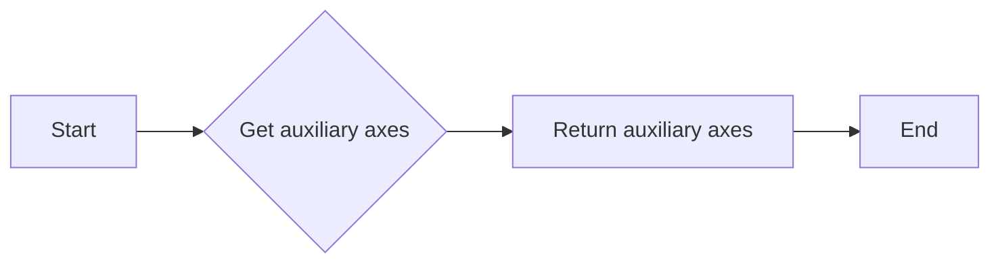

#### 带注释源码

```python
from mpl_toolkits.axisartist.parasite_axes import HostAxes

# 创建宿主轴
host = fig.add_axes((0.15, 0.1, 0.65, 0.8), axes_class=HostAxes)

# 获取辅助轴
par1 = host.get_aux_axes(viewlim_mode=None, sharex=host)
```


### `par2.new_fixed_axis`

`par2.new_fixed_axis` 是 `ParasiteAxes` 类的一个方法，用于创建一个新的固定轴。

参数：

- `loc`：`str`，指定新轴的位置，可以是 "left", "right", "top", "bottom" 或 "right2"。
- `offset`：`tuple`，指定新轴相对于父轴的位置偏移量，格式为 (x_offset, y_offset)。

返回值：`Axes`，返回创建的新轴对象。

#### 流程图

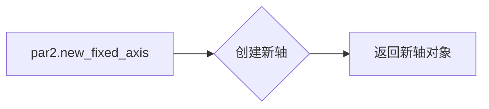

#### 带注释源码

```python
# 创建一个新的固定轴，位置在右侧，偏移量为(60, 0)
par2.axis["right2"] = par2.new_fixed_axis(loc="right", offset=(60, 0))
```


### `HostAxes`

`HostAxes` 是一个类，用于创建主轴，它将与其他轴共享 x 轴刻度，但在 y 轴方向上显示不同的刻度。

参数：

- `fig`：`matplotlib.figure.Figure`，表示包含轴的图形对象。
- `pos`：`tuple`，表示轴的位置和大小。
- `axes_class`：`callable`，用于创建轴的类。

返回值：`mpl_toolkits.axisartist.parasite_axes.HostAxes`，表示创建的主轴对象。

#### 流程图

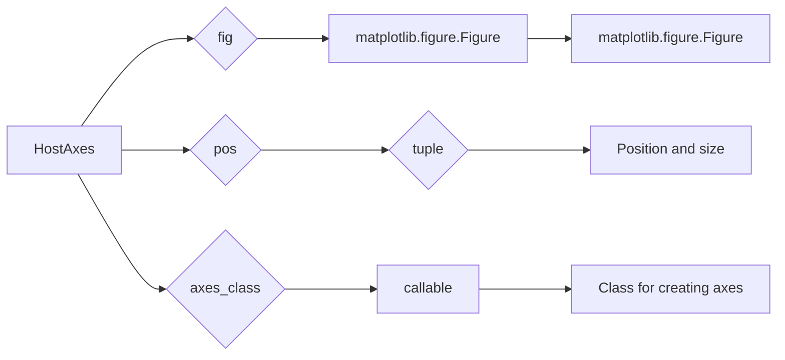

#### 带注释源码

```python
from mpl_toolkits.axisartist.parasite_axes import HostAxes

fig = plt.figure()
host = fig.add_axes((0.15, 0.1, 0.65, 0.8), axes_class=HostAxes)
```


### `get_aux_axes`

`get_aux_axes` 方法用于获取辅助轴。

参数：

- `viewlim_mode`：`str`，表示视图限制模式。
- `sharex`：`mpl_toolkits.axisartist.parasite_axes.HostAxes`，表示共享 x 轴的轴。

返回值：`mpl_toolkits.axisartist.parasite_axes.ParasiteAxes`，表示创建的辅助轴对象。

#### 流程图

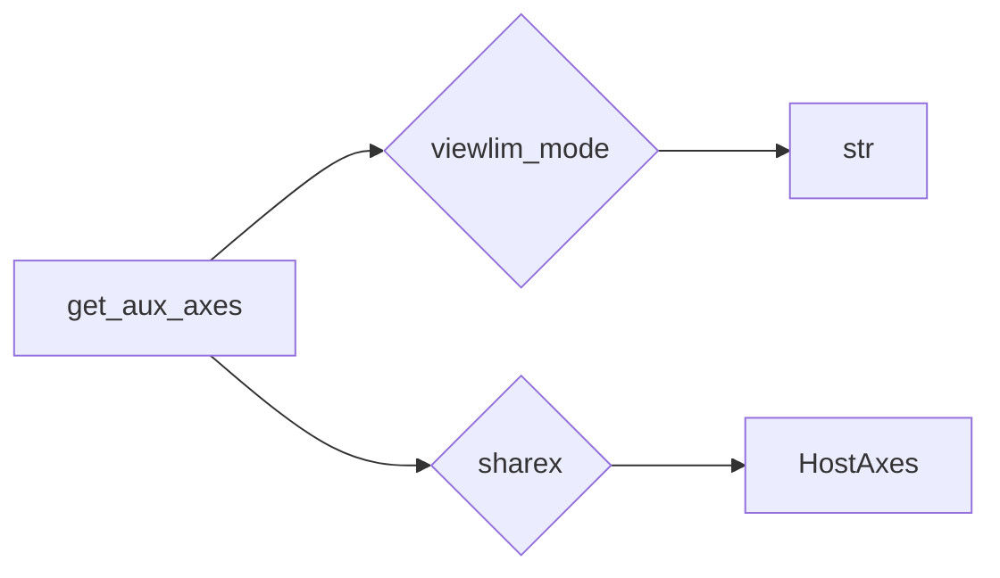

#### 带注释源码

```python
par1 = host.get_aux_axes(viewlim_mode=None, sharex=host)
par2 = host.get_aux_axes(viewlim_mode=None, sharex=host)
```


### `set`

`set` 方法用于设置轴的属性。

参数：

- `xlim`：`tuple`，表示 x 轴的限制。
- `ylim`：`tuple`，表示 y 轴的限制。
- `xlabel`：`str`，表示 x 轴标签。
- `ylabel`：`str`，表示 y 轴标签。

返回值：无。

#### 流程图

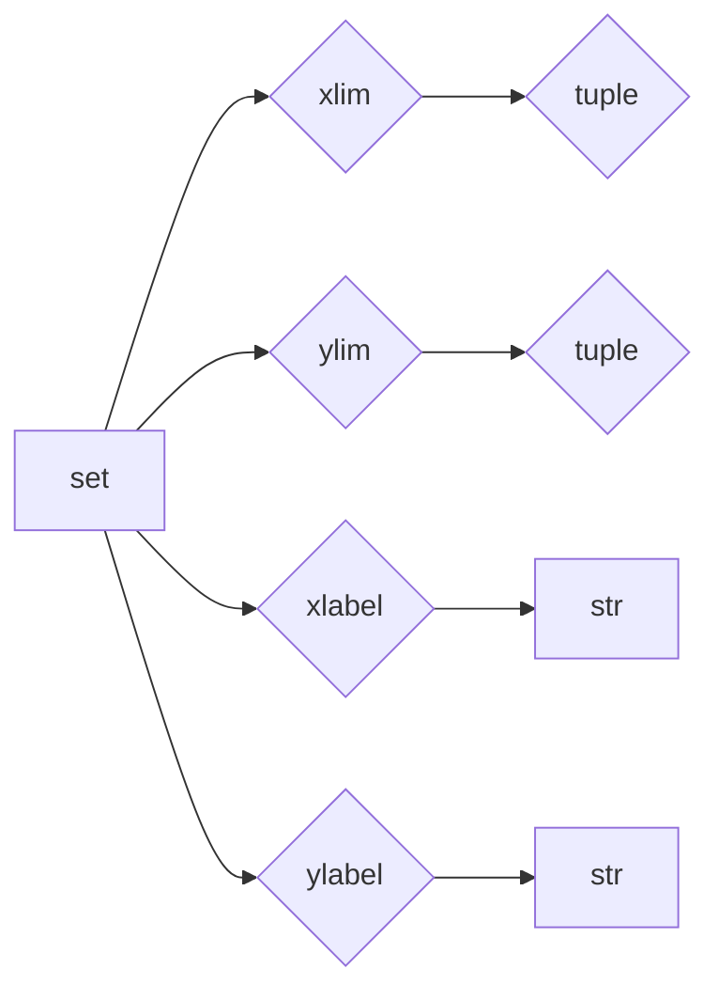

#### 带注释源码

```python
host.set(xlim=(0, 2), ylim=(0, 2), xlabel="Distance", ylabel="Density")
par1.set(ylim=(0, 4), ylabel="Temperature")
par2.set(ylim=(1, 65), ylabel="Velocity")
```


### `plot`

`plot` 方法用于在轴上绘制线图。

参数：

- `x`：`array_like`，表示 x 轴数据。
- `y`：`array_like`，表示 y 轴数据。
- `label`：`str`，表示图例标签。

返回值：`Line2D`，表示绘制的线图对象。

#### 流程图

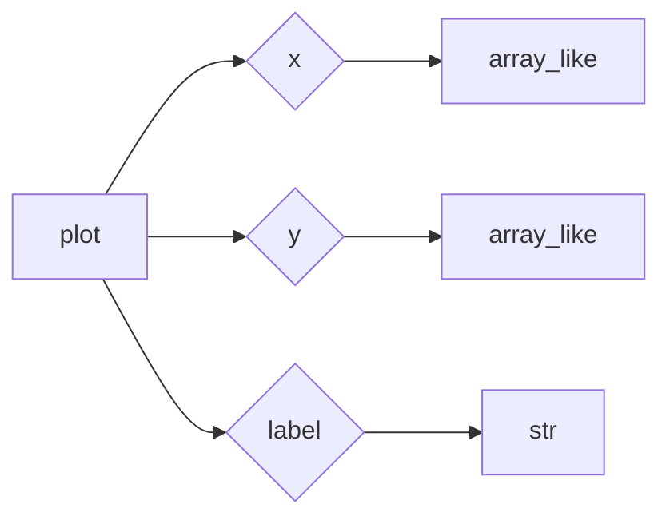

#### 带注释源码

```python
p1, = host.plot([0, 1, 2], [0, 1, 2], label="Density")
p2, = par1.plot([0, 1, 2], [0, 3, 2], label="Temperature")
p3, = par2.plot([0, 1, 2], [50, 30, 15], label="Velocity")
```


### `legend`

`legend` 方法用于添加图例。

参数：无。

返回值：`Legend`，表示添加的图例对象。

#### 流程图

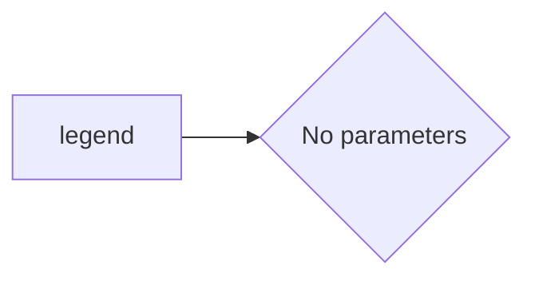

#### 带注释源码

```python
host.legend()
```


### `set_visible`

`set_visible` 方法用于设置轴的可见性。

参数：

- `visible`：`bool`，表示轴是否可见。

返回值：无。

#### 流程图

```mermaid
graph LR
A[set_visible] --> B{visible}
```

#### 带注释源码

```python
host.axis["right"].set_visible(False)
par1.axis["right"].set_visible(True)
par1.axis["right"].major_ticklabels.set_visible(True)
par1.axis["right"].label.set_visible(True)
par2.axis["right2"] = par2.new_fixed_axis(loc="right", offset=(60, 0))
```


### `new_fixed_axis`

`new_fixed_axis` 方法用于创建一个新的固定轴。

参数：

- `loc`：`str`，表示轴的位置。
- `offset`：`tuple`，表示轴的偏移量。

返回值：`Axes`，表示创建的固定轴对象。

#### 流程图

```mermaid
graph LR
A[new_fixed_axis] --> B{loc}
A --> C{offset}
B --> D[str]
C --> E{tuple}
```

#### 带注释源码

```python
par2.axis["right2"] = par2.new_fixed_axis(loc="right", offset=(60, 0))
```


### `set_color`

`set_color` 方法用于设置轴标签的颜色。

参数：

- `color`：`color`，表示颜色。

返回值：无。

#### 流程图

```mermaid
graph LR
A[set_color] --> B{color}
```

#### 带注释源码

```python
host.axis["left"].label.set_color(p1.get_color())
par1.axis["right"].label.set_color(p2.get_color())
par2.axis["right2"].label.set_color(p3.get_color())
```


### `show`

`show` 方法用于显示图形。

参数：无。

返回值：无。

#### 流程图

```mermaid
graph LR
A[show] --> B{No parameters}
```

#### 带注释源码

```python
plt.show()
```


### 关键组件信息

- `HostAxes`：创建主轴，共享 x 轴刻度，但在 y 轴方向上显示不同的刻度。
- `get_aux_axes`：获取辅助轴。
- `set`：设置轴的属性。
- `plot`：在轴上绘制线图。
- `legend`：添加图例。
- `set_visible`：设置轴的可见性。
- `new_fixed_axis`：创建一个新的固定轴。
- `set_color`：设置轴标签的颜色。
- `show`：显示图形。


### 潜在的技术债务或优化空间

- 代码中使用了 `mpl_toolkits.axisartist.parasite_axes` 和 `mpl_toolkits.axisartist`，这些是 Matplotlib 的扩展工具包，可能不是所有用户都安装了。
- 代码中使用了 `matplotlib.pyplot`，这是一个高级接口，可能不是所有用户都希望使用。
- 代码中没有进行错误处理，如果出现异常，可能会导致程序崩溃。
- 代码中没有进行性能优化，例如，可以使用 NumPy 进行数组操作，以提高性能。


### 设计目标与约束

- 设计目标是创建一个寄生虫轴，它共享 x 轴刻度，但在 y 轴方向上显示不同的刻度。
- 约束是使用 Matplotlib 库创建轴，并使用寄生虫轴的概念。


### 错误处理与异常设计

- 代码中没有进行错误处理，如果出现异常，可能会导致程序崩溃。
- 建议添加异常处理，以捕获和处理可能出现的错误。


### 数据流与状态机

- 数据流：用户输入数据，代码处理数据，并显示图形。
- 状态机：代码从创建图形对象开始，然后创建轴，绘制图形，添加图例，设置颜色，最后显示图形。


### 外部依赖与接口契约

- 外部依赖：Matplotlib 库。
- 接口契约：Matplotlib 库的 API。
```


### HostAxes.get_aux_axes

`HostAxes.get_aux_axes` 是 `HostAxes` 类的一个方法，用于创建一个新的 `ParasiteAxes` 实例，该实例与宿主 `HostAxes` 实例共享 x 轴，但在 y 轴上显示不同的尺度。

参数：

- `viewlim_mode`：`None` 或 `dict`，指定视图限制模式，默认为 `None`。
- `sharex`：`HostAxes` 实例，指定与宿主轴共享 x 轴的轴实例。

返回值：`ParasiteAxes` 实例，返回一个新的 `ParasiteAxes` 实例。

#### 流程图

```mermaid
graph LR
A[HostAxes.get_aux_axes] --> B[创建 ParasiteAxes 实例]
B --> C{设置共享 x 轴}
C --> D[返回 ParasiteAxes 实例]
```

#### 带注释源码

```python
from mpl_toolkits.axisartist.parasite_axes import HostAxes

# 创建 HostAxes 实例
host = fig.add_axes((0.15, 0.1, 0.65, 0.8), axes_class=HostAxes)

# 调用 get_aux_axes 方法创建新的 ParasiteAxes 实例
par1 = host.get_aux_axes(viewlim_mode=None, sharex=host)
```


### HostAxes.new_fixed_axis

创建一个新的固定轴。

参数：

- `loc`：`str`，指定新轴的位置，例如 "right"。
- `offset`：`tuple`，指定新轴相对于宿主轴的偏移量，格式为 (x_offset, y_offset)。

返回值：`Axes`，返回创建的新轴。

#### 流程图

```mermaid
graph LR
A[Start] --> B{Create new fixed axis}
B --> C[Return new axis]
C --> D[End]
```

#### 带注释源码

```python
# 在mpl_toolkits.axisartist.parasite_axes模块中
def new_fixed_axis(self, loc, offset=(0, 0), axes_class=None, **kwargs):
    """
    Create a new fixed axis.

    Parameters
    ----------
    loc : str
        The location of the new axis, e.g., "right".
    offset : tuple
        The offset of the new axis from the host axis, in the format (x_offset, y_offset).
    axes_class : class, optional
        The class of the new axis. Defaults to None.
    **kwargs : dict
        Additional keyword arguments to pass to the new axis constructor.

    Returns
    -------
    Axes
        The new axis.
    """
    # 创建新的轴实例
    ax = self._new_fixed_axis(loc, offset, axes_class, **kwargs)
    # 将新轴添加到宿主轴中
    self._add_fixed_axis(ax)
    return ax
```


### HostAxes.get_aux_axes()

该函数用于创建一个与宿主轴共享x轴但具有不同y轴的辅助轴。

参数：

- `viewlim_mode`: `None`，指定视图限制模式。
- `sharex`: `HostAxes`，指定与宿主轴共享x轴的轴。

返回值：`ParasiteAxes`，返回创建的辅助轴。

#### 流程图

```mermaid
graph LR
A[Start] --> B{Create HostAxes}
B --> C{Add axes to figure}
C --> D{Get aux_axes}
D --> E[End]
```

#### 带注释源码

```python
from mpl_toolkits.axisartist.parasite_axes import HostAxes

fig = plt.figure()

host = fig.add_axes((0.15, 0.1, 0.65, 0.8), axes_class=HostAxes)
par1 = host.get_aux_axes(viewlim_mode=None, sharex=host)
```


### ParasiteAxes.plot

This method is used to plot data on a ParasiteAxes object, which is an auxiliary axis that shares the x-axis with a HostAxes but has a separate y-axis scale.

参数：

- `x`：`list`，The x-coordinates of the data points to be plotted.
- `y`：`list`，The y-coordinates of the data points to be plotted.
- `label`：`str`，The label for the line plot. This is used in the legend.

返回值：`Line2D`，The Line2D object representing the line plot.

#### 流程图

```mermaid
graph LR
A[Start] --> B[Create ParasiteAxes]
B --> C[Plot data on ParasiteAxes]
C --> D[Set y-axis limits]
D --> E[Set labels]
E --> F[Show plot]
F --> G[End]
```

#### 带注释源码

```python
p2, = par1.plot([0, 1, 2], [0, 3, 2], label="Temperature")
```

In this example, the `plot` method is called on the `par1` object, which is an instance of `ParasiteAxes`. The method takes two lists, `[0, 1, 2]` and `[0, 3, 2]`, as the x and y coordinates of the data points, respectively. The label for the line plot is set to "Temperature". The result is assigned to the variable `p2`, which is a Line2D object representing the line plot on the `par1` axis.


### ParasiteAxes.set

`ParasiteAxes.set` 方法用于设置寄生虫轴（ParasiteAxes）的显示范围和标签。

参数：

- `xlim`：`tuple`，表示x轴的显示范围。
- `ylim`：`tuple`，表示y轴的显示范围。
- `xlabel`：`str`，x轴的标签。
- `ylabel`：`str`，y轴的标签。

返回值：无

#### 流程图

```mermaid
graph LR
A[开始] --> B{设置x轴显示范围}
B --> C{设置y轴显示范围}
C --> D{设置x轴标签}
D --> E{设置y轴标签}
E --> F[结束]
```

#### 带注释源码

```python
par2.set(ylim=(1, 65), ylabel="Velocity")
```

在这个例子中，`par2` 是一个寄生虫轴（ParasiteAxes），`set` 方法被用来设置其y轴的显示范围和标签。`ylim` 参数设置为 `(1, 65)`，表示y轴的显示范围从1到65。`ylabel` 参数设置为 `"Velocity"`，表示y轴的标签为 "Velocity"。


### `HostAxes`

`HostAxes` 是一个类，用于创建主轴，它将与其他轴共享 x 轴刻度，但在 y 轴方向上显示不同的刻度。

参数：

- `fig`：`matplotlib.figure.Figure`，表示包含轴的图形对象。
- `pos`：`tuple`，表示轴的位置和大小。
- `axes_class`：`matplotlib.axes.Axes`，指定用于创建轴的类。

返回值：`matplotlib.axes.Axes`，表示创建的主轴。

#### 流程图

```mermaid
graph LR
A[HostAxes] --> B[matplotlib.figure.Figure]
A --> C[tuple]
A --> D[matplotlib.axes.Axes]
```

#### 带注释源码

```python
from mpl_toolkits.axisartist.parasite_axes import HostAxes

fig = plt.figure()

host = fig.add_axes((0.15, 0.1, 0.65, 0.8), axes_class=HostAxes)
```


### `get_aux_axes`

`get_aux_axes` 方法用于获取辅助轴。

参数：

- `viewlim_mode`：`str`，指定视图限制模式。
- `sharex`：`matplotlib.axes.Axes`，指定共享 x 轴的轴。

返回值：`matplotlib.axes.Axes`，表示创建的辅助轴。

#### 流程图

```mermaid
graph LR
A[get_aux_axes] --> B[matplotlib.axes.Axes]
A --> C[str]
A --> D[matplotlib.axes.Axes]
```

#### 带注释源码

```python
par1 = host.get_aux_axes(viewlim_mode=None, sharex=host)
par2 = host.get_aux_axes(viewlim_mode=None, sharex=host)
```


### `set_visible`

`set_visible` 方法用于设置轴的可见性。

参数：

- `visible`：`bool`，指定轴是否可见。

#### 流程图

```mermaid
graph LR
A[set_visible] --> B[bool]
```

#### 带注释源码

```python
host.axis["right"].set_visible(False)
par1.axis["right"].set_visible(True)
```


### `plot`

`plot` 方法用于在轴上绘制线图。

参数：

- `x`：`array_like`，表示 x 轴数据。
- `y`：`array_like`，表示 y 轴数据。

返回值：`Line2D`，表示绘制的线图。

#### 流程图

```mermaid
graph LR
A[plot] --> B[Line2D]
A --> C[array_like]
A --> D[array_like]
```

#### 带注释源码

```python
p1, = host.plot([0, 1, 2], [0, 1, 2], label="Density")
p2, = par1.plot([0, 1, 2], [0, 3, 2], label="Temperature")
p3, = par2.plot([0, 1, 2], [50, 30, 15], label="Velocity")
```


### `set`

`set` 方法用于设置轴的属性。

参数：

- `xlim`：`tuple`，表示 x 轴的极限。
- `ylim`：`tuple`，表示 y 轴的极限。
- `xlabel`：`str`，表示 x 轴标签。
- `ylabel`：`str`，表示 y 轴标签。

#### 流程图

```mermaid
graph LR
A[set] --> B[tuple]
A --> C[tuple]
A --> D[str]
A --> E[str]
```

#### 带注释源码

```python
host.set(xlim=(0, 2), ylim=(0, 2), xlabel="Distance", ylabel="Density")
par1.set(ylim=(0, 4), ylabel="Temperature")
par2.set(ylim=(1, 65), ylabel="Velocity")
```


### `legend`

`legend` 方法用于添加图例。

#### 流程图

```mermaid
graph LR
A[legend]
```

#### 带注释源码

```python
host.legend()
```


### `set_color`

`set_color` 方法用于设置轴标签的颜色。

参数：

- `color`：`color`，表示颜色。

#### 流程图

```mermaid
graph LR
A[set_color] --> B[color]
```

#### 带注释源码

```python
host.axis["left"].label.set_color(p1.get_color())
par1.axis["right"].label.set_color(p2.get_color())
par2.axis["right2"].label.set_color(p3.get_color())
```


### `show`

`show` 方法用于显示图形。

#### 流程图

```mermaid
graph LR
A[show]
```

#### 带注释源码

```python
plt.show()
```

## 关键组件


### 张量索引与惰性加载

张量索引与惰性加载允许在绘图时仅计算和显示所需的张量部分，从而提高性能和减少内存消耗。

### 反量化支持

反量化支持使得代码能够处理不同量级的数值，适应不同的数据范围和精度需求。

### 量化策略

量化策略用于优化数值计算，通过减少数值的精度来降低计算复杂度和内存使用。


## 问题及建议


### 已知问题

-   **代码重复性**：`par1.axis["right"].set_visible(True)` 和 `par1.axis["right"].major_ticklabels.set_visible(True)` 以及 `par1.axis["right"].label.set_visible(True)` 这几行代码在 `par1` 和 `par2` 中重复出现，可以考虑将它们封装成一个函数来减少代码重复。
-   **全局变量**：代码中使用了全局变量 `fig` 和 `host`，这可能导致代码的可读性和可维护性降低，建议使用局部变量或参数传递来避免全局变量的使用。
-   **代码注释**：代码中缺少必要的注释，这不利于其他开发者理解代码的意图和功能。

### 优化建议

-   **封装重复代码**：创建一个函数来设置轴的可见性和标签可见性，减少代码重复。
-   **避免全局变量**：将 `fig` 和 `host` 作为参数传递给函数，或者使用局部变量来存储它们。
-   **添加注释**：在代码中添加必要的注释，解释代码的功能和意图。
-   **代码结构**：考虑将绘图逻辑封装到函数中，提高代码的可读性和可维护性。
-   **异常处理**：添加异常处理来捕获可能发生的错误，例如在绘图过程中可能出现的异常。
-   **代码风格**：遵循一致的代码风格指南，例如PEP 8，以提高代码的可读性。

## 其它


### 设计目标与约束

- 设计目标：实现一个寄生虫轴（Parasite Axes），该轴与主轴共享x轴刻度，但在y轴方向上显示不同的刻度。
- 约束：使用Matplotlib库中的`mpl_toolkits.axisartist.parasite_axes`模块。

### 错误处理与异常设计

- 错误处理：确保在创建轴和绘图过程中捕获并处理可能的异常，如轴创建失败或绘图错误。
- 异常设计：定义自定义异常类，以提供更具体的错误信息。

### 数据流与状态机

- 数据流：数据从主轴传递到寄生虫轴，并在寄生虫轴上进行绘制。
- 状态机：定义轴的状态，如可见性、刻度设置等。

### 外部依赖与接口契约

- 外部依赖：Matplotlib库，特别是`mpl_toolkits.axisartist.parasite_axes`模块。
- 接口契约：定义寄生虫轴与主轴之间的接口，确保它们可以正确交互。

### 测试与验证

- 测试：编写单元测试以验证寄生虫轴的功能和性能。
- 验证：通过实际使用场景验证寄生虫轴的稳定性和可靠性。

### 性能优化

- 性能优化：分析代码性能瓶颈，进行优化以提高效率。

### 安全性考虑

- 安全性考虑：确保代码不会引入安全漏洞，如注入攻击或数据泄露。

### 维护与扩展

- 维护：定期更新代码，修复已知问题，并添加新功能。
- 扩展：为寄生虫轴添加更多功能，如自定义刻度、颜色等。

### 文档与示例

- 文档：编写详细的设计文档和用户手册。
- 示例：提供示例代码和图表，展示寄生虫轴的使用方法。

### 用户反馈

- 用户反馈：收集用户反馈，以改进寄生虫轴的功能和用户体验。

### 版本控制

- 版本控制：使用版本控制系统（如Git）管理代码变更和版本。

### 发布与部署

- 发布：将寄生虫轴打包并发布到Python包索引（PyPI）。
- 部署：提供部署指南，帮助用户将寄生虫轴集成到他们的项目中。


    