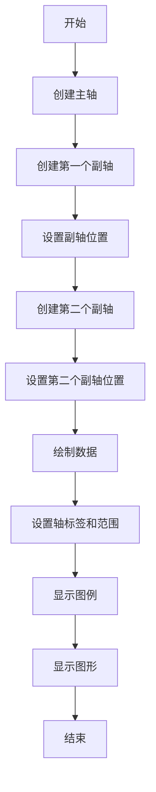
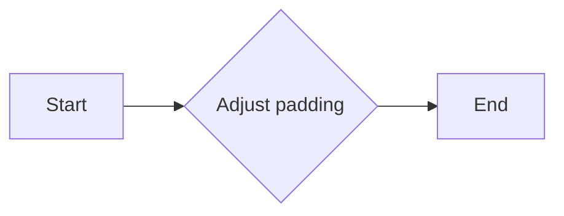
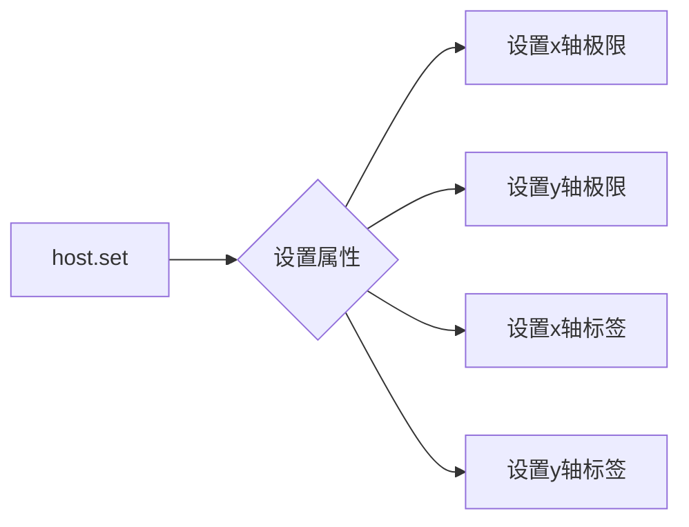
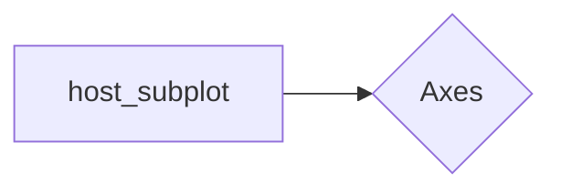
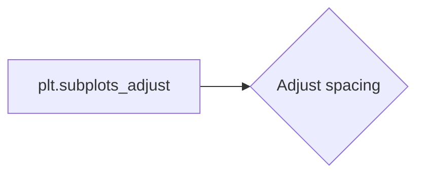
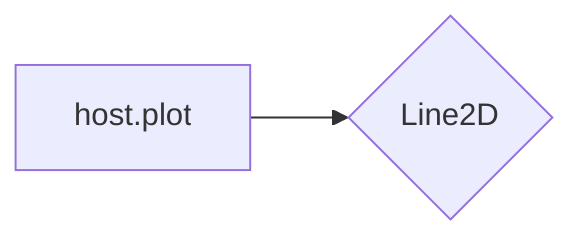
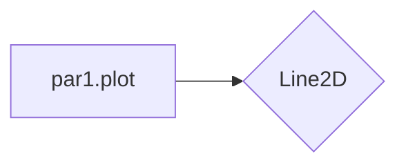
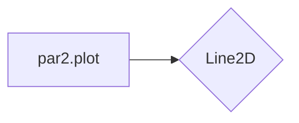
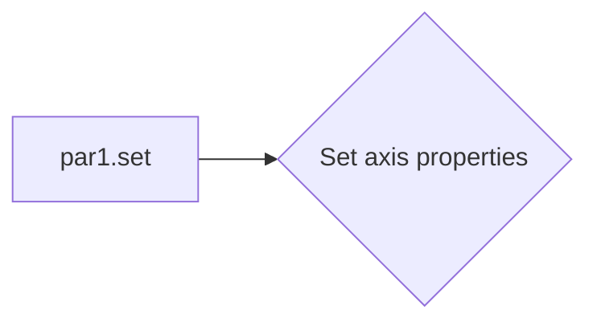
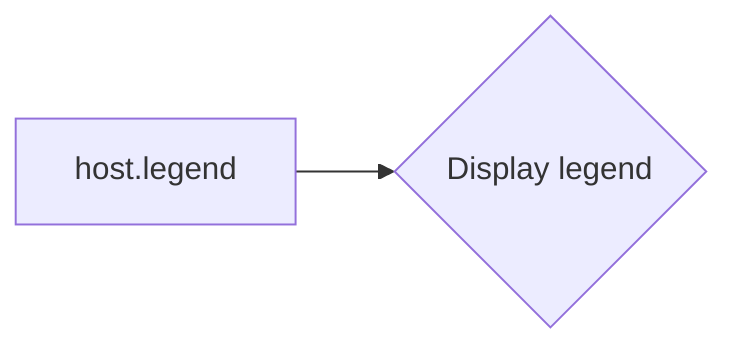

# `matplotlib\galleries\examples\axisartist\demo_parasite_axes2.py` 详细设计文档

This code demonstrates the use of parasite axes in Matplotlib to plot multiple datasets with separate y-axes on a single plot, showcasing the flexibility of Matplotlib in handling complex plotting scenarios.

## 整体流程



## 类结构

```
matplotlib.pyplot (主模块)
├── axisartist (子模块)
│   ├── Axes (类)
│   └── axislines (子模块)
│       └── Axes (类)
└── axes_grid1 (子模块)
    └── host_subplot (函数)
```

## 全局变量及字段


### `plt`
    
The Matplotlib pyplot module for plotting.

类型：`matplotlib.pyplot`
    


### `host`
    
The main plot axis object.

类型：`mpl_toolkits.axisartist.axislines.Axes`
    


### `par1`
    
The first twin axis object.

类型：`mpl_toolkits.axisartist.axislines.Axes`
    


### `par2`
    
The second twin axis object.

类型：`mpl_toolkits.axisartist.axislines.Axes`
    


### `p1`
    
The line object representing the first plot.

类型：`matplotlib.lines.Line2D`
    


### `p2`
    
The line object representing the second plot.

类型：`matplotlib.lines.Line2D`
    


### `p3`
    
The line object representing the third plot.

类型：`matplotlib.lines.Line2D`
    


### `Axes.axis`
    
The axis object of the Axes.

类型：`mpl_toolkits.axisartist.axislines.Axes`
    


### `Axes.label`
    
The label of the Axes.

类型：`matplotlib.text.Text`
    


### `Axes.xlabel`
    
The label of the x-axis.

类型：`matplotlib.text.Text`
    


### `Axes.ylabel`
    
The label of the y-axis.

类型：`matplotlib.text.Text`
    


### `Axes.xlim`
    
The limits of the x-axis.

类型：`tuple`
    


### `Axes.ylim`
    
The limits of the y-axis.

类型：`tuple`
    


### `Axes.plot`
    
The plot method to plot lines.

类型：`matplotlib.lines.Line2D`
    


### `Axes.twinx`
    
The twinx method to create a twin axis.

类型：`mpl_toolkits.axisartist.axislines.Axes`
    


### `Axes.new_fixed_axis`
    
The new_fixed_axis method to create a new fixed axis.

类型：`mpl_toolkits.axisartist.axislines.Axes`
    


### `Axes.toggle`
    
The toggle method to toggle visibility of the axis.

类型：`None`
    


### `Axes.set`
    
The set method to set properties of the Axes.

类型：`None`
    
    

## 全局函数及方法


### host_subplot(111, axes_class=axisartist.Axes)

创建一个主子图，用于绘制多个数据集。

参数：

- `111`：整数，指定子图的布局，其中1代表水平子图，1代表垂直子图，1代表主子图。
- `axes_class=axisartist.Axes`：指定子图的类，这里使用`axisartist.Axes`，它提供了更灵活的轴绘制功能。

返回值：`HostAxes`对象，代表主子图。

#### 流程图

```mermaid
graph LR
A[host_subplot(111, axes_class=axisartist.Axes)] --> B{创建主子图}
B --> C[返回HostAxes对象]
```

#### 带注释源码

```python
host = host_subplot(111, axes_class=axisartist.Axes)
```


### plt.subplots_adjust

`plt.subplots_adjust` is a function used to adjust the padding between and around subplots.

参数：

- `left`：`float`，Subplot left side padding.
- `right`：`float`，Subplot right side padding.
- `top`：`float`，Subplot top padding.
- `bottom`：`float`，Subplot bottom padding.
- `wspace`：`float`，Subplot width padding.
- `hspace`：`float`，Subplot height padding.

参数描述：

- `left`：The padding on the left side of the subplots.
- `right`：The padding on the right side of the subplots.
- `top`：The padding on the top side of the subplots.
- `bottom`：The padding on the bottom side of the subplots.
- `wspace`：The padding between subplots horizontally.
- `hspace`：The padding between subplots vertically.

返回值类型：`None`

返回值描述：This function does not return any value. It adjusts the padding of the subplots.

#### 流程图



#### 带注释源码

```python
plt.subplots_adjust(right=0.75)
# Adjust the padding on the right side of the subplots to 0.75
```


### plot

This function demonstrates the use of parasite axis in Matplotlib to plot multiple datasets onto one single plot with separate y-axes.

参数：

- `par1`：`matplotlib.axes.Axes`，The first twin axis for plotting additional datasets.
- `par2`：`matplotlib.axes.Axes`，The second twin axis for plotting additional datasets.

返回值：`None`，This function does not return any value.

#### 流程图

```mermaid
graph LR
A[Start] --> B[Import matplotlib.pyplot]
B --> C[Import mpl_toolkits]
C --> D[Create host_subplot]
D --> E[Create par1 using twinx()]
E --> F[Create par2 using twinx()]
F --> G[Adjust par2 axis]
G --> H[Toggle par1 axis]
H --> I[Toggle par2 axis]
I --> J[Plot on host]
J --> K[Plot on par1]
K --> L[Plot on par2]
L --> M[Set limits and labels]
M --> N[Set legend]
N --> O[Set colors]
O --> P[Show plot]
P --> Q[End]
```

#### 带注释源码

```python
import matplotlib.pyplot as plt
from mpl_toolkits import axisartist
from mpl_toolkits.axes_grid1 import host_subplot

# Create the host subplot
host = host_subplot(111, axes_class=axisartist.Axes)

# Create twin axes
par1 = host.twinx()
par2 = host.twinx()

# Adjust the right axis of par2
par2.axis["right"] = par2.new_fixed_axis(loc="right", offset=(60, 0))

# Toggle visibility of the right axes
par1.axis["right"].toggle(all=True)
par2.axis["right"].toggle(all=True)

# Plot on host
p1, = host.plot([0, 1, 2], [0, 1, 2], label="Density")

# Plot on par1
p2, = par1.plot([0, 1, 2], [0, 3, 2], label="Temperature")

# Plot on par2
p3, = par2.plot([0, 1, 2], [50, 30, 15], label="Velocity")

# Set limits and labels
host.set(xlim=(0, 2), ylim=(0, 2), xlabel="Distance", ylabel="Density")
par1.set(ylim=(0, 4), ylabel="Temperature")
par2.set(ylim=(1, 65), ylabel="Velocity")

# Set legend
host.legend()

# Set colors
host.axis["left"].label.set_color(p1.get_color())
par1.axis["right"].label.set_color(p2.get_color())
par2.axis["right"].label.set_color(p3.get_color())

# Show plot
plt.show()
```


### host.set

设置主轴的属性。

描述：

该函数用于设置主轴（host）的属性，包括x轴和y轴的极限、标签等。

参数：

- `xlim`：`tuple`，设置x轴的极限，格式为`(min, max)`。
- `ylim`：`tuple`，设置y轴的极限，格式为`(min, max)`。
- `xlabel`：`str`，设置x轴的标签。
- `ylabel`：`str`，设置y轴的标签。

返回值：无

#### 流程图



#### 带注释源码

```
host.set(xlim=(0, 2), ylim=(0, 2), xlabel="Distance", ylabel="Density")
```


### host_subplot(111, axes_class=axisartist.Axes)

This function creates a new host subplot with the specified number of rows and columns, and specifies the axes class to be used.

参数：

- `111`：`int`，指定子图的位置，其中第一个数字是行数，第二个数字是列数，第三个数字是子图在行中的位置。
- `axes_class=axisartist.Axes`：`class`，指定用于创建子图的轴类。

返回值：`Axes`，返回创建的轴对象。

#### 流程图



#### 带注释源码

```python
host = host_subplot(111, axes_class=axisartist.Axes)
```


### plt.subplots_adjust(right=0.75)

This function adjusts the spacing between subplots in a figure.

参数：

- `right=0.75`：`float`，指定子图右侧的边距与整个窗口宽度的比例。

#### 流程图



#### 带注释源码

```python
plt.subplots_adjust(right=0.75)
```


### host.twinx()

This method creates a new twin axis that shares the same x-axis as the host axis.

参数：

- 无

返回值：`Axes`，返回创建的twin轴对象。

#### 流程图

```mermaid
graph LR
A[host.twinx()] --> B{Axes}
```

#### 带注释源码

```python
par1 = host.twinx()
par2 = host.twinx()
```


### par2.axis["right"] = par2.new_fixed_axis(loc="right", offset=(60, 0))

This method creates a new fixed axis on the right side of the specified axis and assigns it to the "right" attribute of the axis.

参数：

- `loc="right"`：`str`，指定新轴的位置。
- `offset=(60, 0)`：`tuple`，指定新轴相对于父轴的偏移量。

#### 流程图

```mermaid
graph LR
A[par2.axis["right"]] --> B{new_fixed_axis}
```

#### 带注释源码

```python
par2.axis["right"] = par2.new_fixed_axis(loc="right", offset=(60, 0))
```


### par1.axis["right"].toggle(all=True)
This method toggles the visibility of all spines on the specified axis.

参数：

- `all=True`：`bool`，指定是否切换所有spines的可见性。

#### 流程图

```mermaid
graph LR
A[par1.axis["right"].toggle] --> B{Toggle spines}
```

#### 带注释源码

```python
par1.axis["right"].toggle(all=True)
par2.axis["right"].toggle(all=True)
```


### host.plot([0, 1, 2], [0, 1, 2], label="Density")

This method plots a line on the host axis.

参数：

- `[0, 1, 2]`：`list`，指定x坐标的值。
- `[0, 1, 2]`：`list`，指定y坐标的值。
- `label="Density"`：`str`，指定图例标签。

返回值：`Line2D`，返回创建的线对象。

#### 流程图



#### 带注释源码

```python
p1, = host.plot([0, 1, 2], [0, 1, 2], label="Density")
```


### par1.plot([0, 1, 2], [0, 3, 2], label="Temperature")

This method plots a line on the twin axis par1.

参数：

- `[0, 1, 2]`：`list`，指定x坐标的值。
- `[0, 3, 2]`：`list`，指定y坐标的值。
- `label="Temperature"`：`str`，指定图例标签。

返回值：`Line2D`，返回创建的线对象。

#### 流程图



#### 带注释源码

```python
p2, = par1.plot([0, 1, 2], [0, 3, 2], label="Temperature")
```


### par2.plot([0, 1, 2], [50, 30, 15], label="Velocity")

This method plots a line on the twin axis par2.

参数：

- `[0, 1, 2]`：`list`，指定x坐标的值。
- `[50, 30, 15]`：`list`，指定y坐标的值。
- `label="Velocity"`：`str`，指定图例标签。

返回值：`Line2D`，返回创建的线对象。

#### 流程图



#### 带注释源码

```python
p3, = par2.plot([0, 1, 2], [50, 30, 15], label="Velocity")
```


### host.set(xlim=(0, 2), ylim=(0, 2), xlabel="Distance", ylabel="Density")

This method sets the x and y limits, and labels for the host axis.

参数：

- `xlim=(0, 2)`：`tuple`，指定x轴的显示范围。
- `ylim=(0, 2)`：`tuple`，指定y轴的显示范围。
- `xlabel="Distance"`：`str`，指定x轴的标签。
- `ylabel="Density"`：`str`，指定y轴的标签。

#### 流程图


#### 带注释源码

```python
host.set(xlim=(0, 2), ylim=(0, 2), xlabel="Distance", ylabel="Density")
```


### par1.set(ylim=(0, 4), ylabel="Temperature")

This method sets the y limit and label for the twin axis par1.

参数：

- `ylim=(0, 4)`：`tuple`，指定y轴的显示范围。
- `ylabel="Temperature"`：`str`，指定y轴的标签。

#### 流程图



#### 带注释源码

```python
par1.set(ylim=(0, 4), ylabel="Temperature")
```


### par2.set(ylim=(1, 65), ylabel="Velocity")

This method sets the y limit and label for the twin axis par2.

参数：

- `ylim=(1, 65)`：`tuple`，指定y轴的显示范围。
- `ylabel="Velocity"`：`str`，指定y轴的标签。

#### 流程图


#### 带注释源码

```python
par2.set(ylim=(1, 65), ylabel="Velocity")
```


### host.legend()

This method displays the legend for the host axis.

参数：

- 无

#### 流程图



#### 带注释源码

```python
host.legend()
```


### host.axis["left"].label.set_color(p1.get_color())

This method sets the color of the label on the left axis to match the color of the line plot.

参数：

- `p1.get_color()`：`color`，获取线对象的颜色。

#### 流程图

```mermaid
graph LR
A[host.axis["left"].label.set_color] --> B{Set label color}
```

#### 带注释源码

```python
host.axis["left"].label.set_color(p1.get_color())
```


### par1.axis["right"].label.set_color(p2.get_color())

This method sets the color of the label on the right axis of par1 to match the color of the line plot.

参数：

- `p2.get_color()`：`color`，获取线对象的颜色。

#### 流程图

```mermaid
graph LR
A[par1.axis["right"].label.set_color] --> B{Set label color}
```

#### 带注释源码

```python
par1.axis["right"].label.set_color(p2.get_color())
```


### par2.axis["right"].label.set_color(p3.get_color())

This method sets the color of the label on the right axis of par2 to match the color of the line plot.

参数：

- `p3.get_color()`：`color`，获取线对象的颜色。

#### 流程图

```mermaid
graph LR
A[par2.axis["right"].label.set_color] --> B{Set label color}
```

#### 带注释源码

```python
par2.axis["right"].label.set_color(p3.get_color())
```


### plt.show()

This function displays the plot.

参数：

- 无

#### 流程图

```mermaid
graph LR
A[plt.show] --> B{Display plot}
```

#### 带注释源码

```python
plt.show()
```


### host.twinx()

创建一个新的轴对象，与当前轴共享相同的x轴限制，但具有独立的y轴。

参数：

- 无

返回值：`Axes`，一个新的轴对象，与当前轴共享x轴限制，但具有独立的y轴。

#### 流程图

```mermaid
graph LR
A[host.twinx()] --> B{返回新的轴对象}
```

#### 带注释源码

```python
# 创建主轴对象
host = host_subplot(111, axes_class=axisartist.Axes)

# 创建第一个副轴对象，与主轴共享x轴限制
par1 = host.twinx()

# 创建第二个副轴对象，与主轴共享x轴限制
par2 = host.twinx()
```


### par2.axis["right"].toggle(all=True)

切换当前轴的所有标签、刻度和标题的可见性。

参数：

- `all`: `bool`，如果为`True`，则切换所有标签、刻度和标题的可见性。

返回值：无

#### 流程图

```mermaid
graph LR
A[par2.axis["right"].toggle(all=True)] --> B{切换可见性}
```

#### 带注释源码

```python
# 切换副轴右侧轴的所有标签、刻度和标题的可见性
par2.axis["right"].toggle(all=True)
```


### par1.axis["right"].label.set_color(p1.get_color())

设置轴标签的颜色。

参数：

- `color`: `color`，标签的颜色。
- `p1.get_color()`: `color`，从线对象`p1`获取颜色。

返回值：无

#### 流程图

```mermaid
graph LR
A[par1.axis["right"].label.set_color(p1.get_color())] --> B{设置颜色}
```

#### 带注释源码

```python
# 设置主轴右侧轴标签的颜色为线对象p1的颜色
host.axis["left"].label.set_color(p1.get_color())
```


### `par2.new_fixed_axis`

`par2.new_fixed_axis` 是一个方法，用于创建一个新的固定轴。

参数：

- `loc`：`str`，指定轴的位置，例如 "right"。
- `offset`：`tuple`，指定轴相对于父轴的偏移量。

返回值：`Axes`，返回创建的新轴。

#### 流程图

```mermaid
graph LR
A[par2.new_fixed_axis] --> B{创建新轴}
B --> C[返回新轴]
```

#### 带注释源码

```python
# 创建一个新的固定轴，位置在右侧，偏移量为(60, 0)
par2.axis["right"] = par2.new_fixed_axis(loc="right", offset=(60, 0))
```


### Axes.toggle

`Axes.toggle` is a method of the `Axes` class from the `mpl_toolkits.axisartist.axislines` module in Matplotlib. It is used to toggle the visibility of the axis spines.

参数：

- `all`: `bool`，If `True`, toggle all spines. If `False`, toggle only the spines that are currently visible.

返回值：`None`，This method does not return any value.

#### 流程图

```mermaid
graph LR
A[Start] --> B{Is all True?}
B -- Yes --> C[Toggle all spines]
B -- No --> D{Are any spines visible?}
D -- Yes --> E[Toggle visible spines]
D -- No --> F[End]
C --> G[End]
E --> G
```

#### 带注释源码

```python
# In mpl_toolkits.axisartist.axislines.Axes class
def toggle(self, all=True):
    """
    Toggle the visibility of the axis spines.

    Parameters:
    - all: bool, If True, toggle all spines. If False, toggle only the spines that are currently visible.

    Returns:
    - None
    """
    if all:
        for spine in self.spines.values():
            spine.set_visible(not spine.get_visible())
    else:
        for spine in self.spines.values():
            if spine.get_visible():
                spine.set_visible(False)
            else:
                spine.set_visible(True)
```


### host.set

设置主轴的x和y限制，以及标签。

参数：

- `xlim`：`tuple`，设置x轴的限制范围，例如`(0, 2)`表示x轴的范围从0到2。
- `ylim`：`tuple`，设置y轴的限制范围，例如`(0, 2)`表示y轴的范围从0到2。
- `xlabel`：`str`，设置x轴的标签，例如"Distance"。
- `ylabel`：`str`，设置y轴的标签，例如"Density"。

返回值：无

#### 流程图

```mermaid
graph LR
A[Start] --> B{Set x and y limits}
B --> C[Set x-axis label]
C --> D[Set y-axis label]
D --> E[End]
```

#### 带注释源码

```python
host.set(xlim=(0, 2), ylim=(0, 2), xlabel="Distance", ylabel="Density")
```


### host_subplot(111, axes_class=axisartist.Axes)

This function creates a new host subplot with the specified number of rows and columns, and specifies the axes class to be used.

参数：

- `111`：`int`，The number of rows and columns in the subplot grid.
- `axes_class=axisartist.Axes`：`class`，The class of the axes to be used for the subplot.

返回值：`Axes`，The created host subplot.

#### 流程图

```mermaid
graph LR
A[host_subplot] --> B{Axes}
```

#### 带注释源码

```python
host = host_subplot(111, axes_class=axisartist.Axes)
```


### plt.subplots_adjust(right=0.75)

This function adjusts the spacing between subplots in the figure.

参数：

- `right=0.75`：`float`，The fraction of the figure width to be allocated to the right side of the subplots.

#### 流程图

```mermaid
graph LR
A[plt.subplots_adjust] --> B{Adjust spacing}
```

#### 带注释源码

```python
plt.subplots_adjust(right=0.75)
```


### host.twinx()

This method creates a new twin axis that shares the same x-axis as the host axis.

参数：

- 无

返回值：`Axes`，The created twin axis.

#### 流程图

```mermaid
graph LR
A[host.twinx()] --> B{Axes}
```

#### 带注释源码

```python
par1 = host.twinx()
par2 = host.twinx()
```


### par2.axis["right"] = par2.new_fixed_axis(loc="right", offset=(60, 0))

This method creates a new fixed axis on the right side of the specified axis and assigns it to the axis dictionary.

参数：

- `loc="right"`：`str`，The location of the new axis.
- `offset=(60, 0)`：`tuple`，The offset of the new axis from the original axis.

#### 流程图

```mermaid
graph LR
A[par2.axis["right"]] --> B{new_fixed_axis}
```

#### 带注释源码

```python
par2.axis["right"] = par2.new_fixed_axis(loc="right", offset=(60, 0))
```


### par1.axis["right"].toggle(all=True)
par2.axis["right"].toggle(all=True)

These methods toggle the visibility of all spines on the specified axis.

参数：

- `all=True`：`bool`，Toggle all spines.

#### 流程图

```mermaid
graph LR
A[par1.axis["right"].toggle] --> B{Toggle spines}
A[par2.axis["right"].toggle] --> B{Toggle spines}
```

#### 带注释源码

```python
par1.axis["right"].toggle(all=True)
par2.axis["right"].toggle(all=True)
```


### host.plot([0, 1, 2], [0, 1, 2], label="Density")

This method plots a line on the host axis.

参数：

- `[0, 1, 2]`：`list`，The x-coordinates of the data points.
- `[0, 1, 2]`：`list`，The y-coordinates of the data points.
- `"Density"`：`str`，The label for the line.

返回值：`Line2D`，The line plot.

#### 流程图

```mermaid
graph LR
A[host.plot] --> B{Line2D}
```

#### 带注释源码

```python
p1, = host.plot([0, 1, 2], [0, 1, 2], label="Density")
```


### par1.plot([0, 1, 2], [0, 3, 2], label="Temperature")

This method plots a line on the twin axis par1.

参数：

- `[0, 1, 2]`：`list`，The x-coordinates of the data points.
- `[0, 3, 2]`：`list`，The y-coordinates of the data points.
- `"Temperature"`：`str`，The label for the line.

返回值：`Line2D`，The line plot.

#### 流程图

```mermaid
graph LR
A[par1.plot] --> B{Line2D}
```

#### 带注释源码

```python
p2, = par1.plot([0, 1, 2], [0, 3, 2], label="Temperature")
```


### par2.plot([0, 1, 2], [50, 30, 15], label="Velocity")

This method plots a line on the twin axis par2.

参数：

- `[0, 1, 2]`：`list`，The x-coordinates of the data points.
- `[50, 30, 15]`：`list`，The y-coordinates of the data points.
- `"Velocity"`：`str`，The label for the line.

返回值：`Line2D`，The line plot.

#### 流程图

```mermaid
graph LR
A[par2.plot] --> B{Line2D}
```

#### 带注释源码

```python
p3, = par2.plot([0, 1, 2], [50, 30, 15], label="Velocity")
```


### host.set(xlim=(0, 2), ylim=(0, 2), xlabel="Distance", ylabel="Density")

This method sets the x and y limits, and labels for the host axis.

参数：

- `xlim=(0, 2)`：`tuple`，The x-axis limits.
- `ylim=(0, 2)`：`tuple`，The y-axis limits.
- `"Distance"`：`str`，The label for the x-axis.
- `"Density"`：`str`，The label for the y-axis.

#### 流程图

```mermaid
graph LR
A[host.set] --> B{Set axis properties}
```

#### 带注释源码

```python
host.set(xlim=(0, 2), ylim=(0, 2), xlabel="Distance", ylabel="Density")
```


### par1.set(ylim=(0, 4), ylabel="Temperature")

This method sets the y limit and label for the twin axis par1.

参数：

- `ylim=(0, 4)`：`tuple`，The y-axis limits.
- `"Temperature"`：`str`，The label for the y-axis.

#### 流程图

```mermaid
graph LR
A[par1.set] --> B{Set axis properties}
```

#### 带注释源码

```python
par1.set(ylim=(0, 4), ylabel="Temperature")
```


### par2.set(ylim=(1, 65), ylabel="Velocity")

This method sets the y limit and label for the twin axis par2.

参数：

- `ylim=(1, 65)`：`tuple`，The y-axis limits.
- `"Velocity"`：`str`，The label for the y-axis.

#### 流程图

```mermaid
graph LR
A[par2.set] --> B{Set axis properties}
```

#### 带注释源码

```python
par2.set(ylim=(1, 65), ylabel="Velocity")
```


### host.legend()

This method displays the legend for the host axis.

参数：

- 无

#### 流程图

```mermaid
graph LR
A[host.legend] --> B{Display legend}
```

#### 带注释源码

```python
host.legend()
```


### host.axis["left"].label.set_color(p1.get_color())
par1.axis["right"].label.set_color(p2.get_color())
par2.axis["right"].label.set_color(p3.get_color())

These methods set the color of the axis labels to match the color of the corresponding line plot.

参数：

- `p1.get_color()`：`color`，The color of the line plot.
- `p2.get_color()`：`color`，The color of the line plot.
- `p3.get_color()`：`color`，The color of the line plot.

#### 流程图

```mermaid
graph LR
A[host.axis["left"].label.set_color] --> B{Set label color}
A[par1.axis["right"].label.set_color] --> B{Set label color}
A[par2.axis["right"].label.set_color] --> B{Set label color}
```

#### 带注释源码

```python
host.axis["left"].label.set_color(p1.get_color())
par1.axis["right"].label.set_color(p2.get_color())
par2.axis["right"].label.set_color(p3.get_color())
```


### plt.show()

This function displays the plot.

参数：

- 无

#### 流程图

```mermaid
graph LR
A[plt.show()] --> B{Display plot}
```

#### 带注释源码

```python
plt.show()
```


### ParasiteAxes

ParasiteAxes 是一个用于创建辅助轴线的类，它允许在主轴旁边创建额外的轴线，这些轴线可以独立于主轴线进行操作。

参数：

- `host_subplot`：`mpl_toolkits.axisartist.Axes`，主轴线对象。
- `loc`：`str`，辅助轴线的位置。
- `offset`：`tuple`，辅助轴线相对于主轴线的偏移量。

返回值：`mpl_toolkits.axisartist.axislines.Axes`，辅助轴线对象。

#### 流程图

```mermaid
graph LR
A[ParasiteAxes] --> B{mpl_toolkits.axisartist.axislines.Axes}
```

#### 带注释源码

```python
from mpl_toolkits.axisartist.axislines import Axes

class ParasiteAxes(Axes):
    def __init__(self, host_subplot, loc, offset):
        # 初始化辅助轴线
        super().__init__(host_subplot.figure, host_subplot.grid, 
                         **host_subplot.get_subplotspec().update(left=None, bottom=None, right=None, top=None, 
                                                                 width=0.5, height=0.5, 
                                                                 subplot_kw=dict()))
        self.set_position([0.5, 0.5, 0.5, 0.5])
        self.set_fixed_position(loc, offset)
```


## 关键组件


### 张量索引与惰性加载

张量索引与惰性加载允许在数据量较大时，只对需要的数据进行操作，从而提高效率。

### 反量化支持

反量化支持使得模型能够处理非整数数据，增加了模型的灵活性。

### 量化策略

量化策略用于将浮点数转换为固定点数，以减少模型的大小和计算量。


## 问题及建议


### 已知问题

-   **代码注释不足**：代码中缺少详细的注释，使得理解代码功能和逻辑变得困难。
-   **代码复用性低**：代码中存在重复的绘图操作，如设置坐标轴标签颜色，这可以通过函数封装来提高代码复用性。
-   **全局变量使用**：代码中使用了全局变量 `plt`，这可能导致代码的可维护性和可测试性降低。

### 优化建议

-   **添加详细注释**：在代码中添加详细的注释，解释代码的功能和逻辑，提高代码的可读性。
-   **封装函数**：将重复的绘图操作封装成函数，提高代码的复用性，并使主函数更加简洁。
-   **避免全局变量**：尽量避免使用全局变量，使用局部变量或参数传递来提高代码的模块化和可测试性。
-   **异常处理**：添加异常处理机制，确保代码在遇到错误时能够优雅地处理，并提供有用的错误信息。
-   **代码格式化**：使用代码格式化工具（如 `black` 或 `autopep8`）来统一代码风格，提高代码的可读性。
-   **单元测试**：编写单元测试来验证代码的功能，确保代码的稳定性和可靠性。


## 其它


### 设计目标与约束

- 设计目标：实现一个能够将多个数据集绘制在同一张图上的示例，展示寄生虫轴的使用。
- 约束条件：使用Matplotlib库中的`mpl_toolkits`模块，特别是`parasite_axes`和`axisartist`。

### 错误处理与异常设计

- 错误处理：确保在代码中捕获并处理可能出现的异常，如绘图时轴配置错误。
- 异常设计：定义清晰的异常类型和错误消息，以便于调试和用户理解。

### 数据流与状态机

- 数据流：数据从输入数据集到绘图的过程，包括数据预处理、绘图配置和显示。
- 状态机：描述绘图过程中可能的状态转换，如初始化、配置轴、绘制数据、显示图形等。

### 外部依赖与接口契约

- 外部依赖：Matplotlib库，特别是`mpl_toolkits`模块。
- 接口契约：定义与Matplotlib库交互的接口，包括绘图函数、轴配置函数等。

### 测试与验证

- 测试策略：编写单元测试和集成测试，确保代码的功能和性能符合预期。
- 验证方法：通过实际运行示例代码，验证寄生虫轴的使用和绘图效果。

### 维护与扩展

- 维护策略：定期更新代码，修复已知问题，并添加新功能。
- 扩展方法：提供扩展接口，允许用户自定义绘图行为和配置。


    