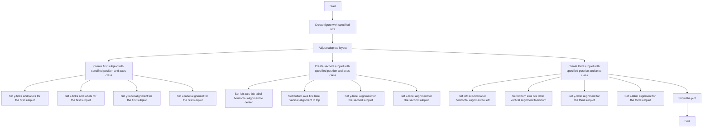
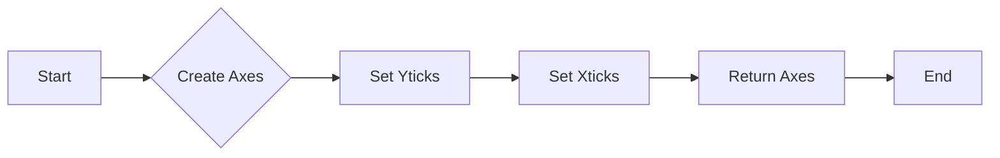
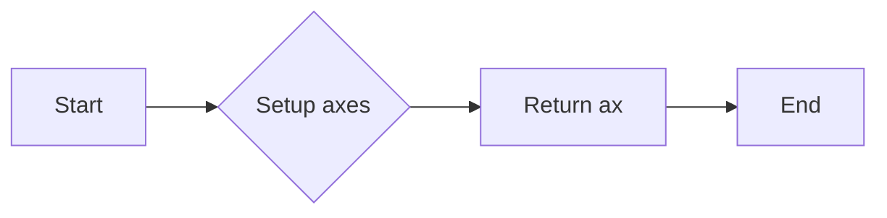
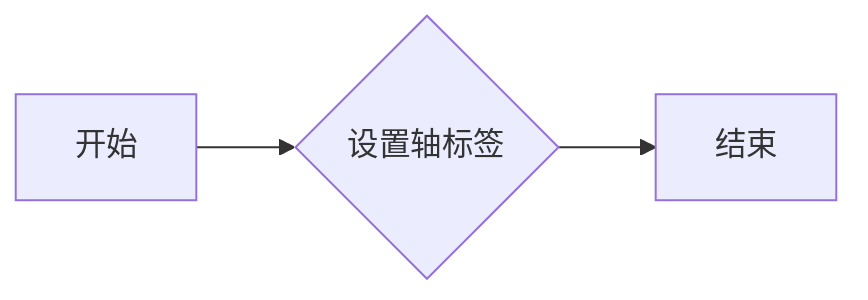
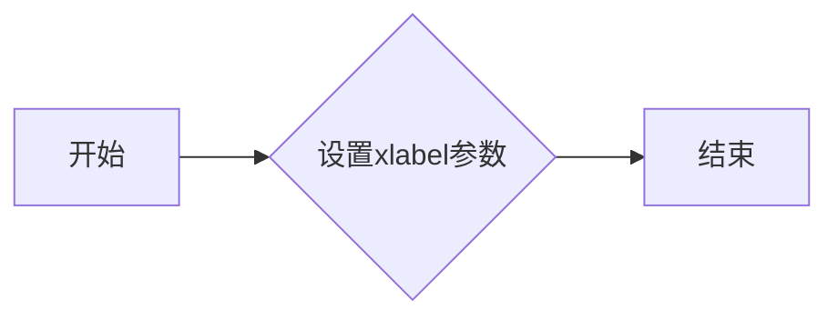
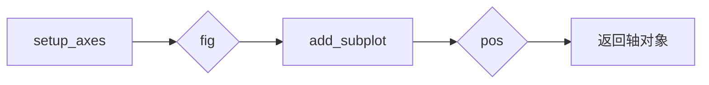
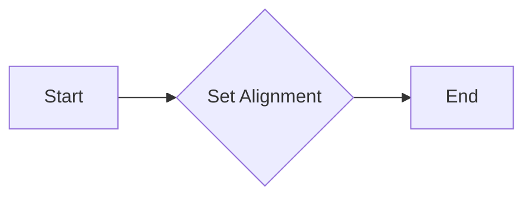

# `matplotlib\galleries\examples\axisartist\demo_ticklabel_alignment.py` 详细设计文档

This code generates a matplotlib plot with customized tick label alignments to demonstrate different alignment options.

## 整体流程



## 类结构

```
Figure (matplotlib.figure.Figure)
├── Subplot (matplotlib.axes.Axes)
│   ├── Axes (matplotlib.axes.Axes)
│   ├── Axes (matplotlib.axes.Axes)
│   └── Axes (matplotlib.axes.Axes)
```

## 全局变量及字段


### `fig`
    
The main figure object where all subplots are added.

类型：`matplotlib.figure.Figure`
    


### `ax`
    
The axes object representing the plot area where the data is drawn.

类型：`matplotlib.axes.Axes`
    


### `fig.figsize`
    
The size of the figure in inches.

类型：`tuple`
    


### `fig.subplots_adjust`
    
Dictionary containing the parameters for adjusting the subplot layout.

类型：`dict`
    


### `ax.axis`
    
Dictionary containing the axes objects for each side of the plot area.

类型：`dict`
    


### `ax.axis['left'].major_ticklabels.set_ha`
    
Sets the horizontal alignment of the major tick labels on the left axis.

类型：`function`
    


### `ax.axis['bottom'].major_ticklabels.set_va`
    
Sets the vertical alignment of the major tick labels on the bottom axis.

类型：`function`
    


### `Figure.figsize`
    
The size of the figure in inches.

类型：`tuple`
    


### `Figure.subplots_adjust`
    
Dictionary containing the parameters for adjusting the subplot layout.

类型：`dict`
    


### `Axes.set_yticks`
    
Sets the y-axis ticks and labels.

类型：`function`
    


### `Axes.set_xticks`
    
Sets the x-axis ticks and labels.

类型：`function`
    


### `Axes.set_ylabels`
    
Sets the y-axis labels.

类型：`function`
    


### `Axes.set_xlabels`
    
Sets the x-axis labels.

类型：`function`
    


### `Axes.set_ylabel`
    
Sets the y-axis label.

类型：`function`
    


### `Axes.set_xlabel`
    
Sets the x-axis label.

类型：`function`
    


### `Axes.set_ha`
    
Sets the horizontal alignment of the tick labels.

类型：`function`
    


### `Axes.set_va`
    
Sets the vertical alignment of the tick labels.

类型：`function`
    
    

## 全局函数及方法


### setup_axes

设置matplotlib子图轴，并配置刻度标签。

参数：

- `fig`：`matplotlib.figure.Figure`，当前绘图对象。
- `pos`：`int`，子图的位置。

返回值：`matplotlib.axes.Axes`，创建的子图轴对象。

#### 流程图



#### 带注释源码

```python
def setup_axes(fig, pos):
    # 创建子图轴
    ax = fig.add_subplot(pos, axes_class=axisartist.Axes)
    # 设置Y轴刻度标签
    ax.set_yticks([0.2, 0.8], labels=["short", "loooong"])
    # 设置X轴刻度标签
    ax.set_xticks([0.2, 0.8], labels=[r"$\frac{1}{2}\pi$", r"$\pi$"])
    # 返回创建的子图轴
    return ax
```


### Figure.add_subplot

`Figure.add_subplot` 是 Matplotlib 库中 Figure 类的一个方法，用于向 Figure 对象中添加一个子图。

参数：

- `pos`：`int`，指定子图的位置，格式为 `111`，其中 `1` 表示子图所在的行、列和索引。

返回值：`Axes`，返回添加的子图对象。

#### 流程图

```mermaid
graph LR
A[Start] --> B{Figure.add_subplot(pos)}
B --> C[Return Axes]
C --> D[End]
```

#### 带注释源码

```python
def setup_axes(fig, pos):
    ax = fig.add_subplot(pos, axes_class=axisartist.Axes)
    ax.set_yticks([0.2, 0.8], labels=["short", "loooong"])
    ax.set_xticks([0.2, 0.8], labels=[r"$\frac{1}{2}\pi$", r"$\pi$"])
    return ax
```


### setup_axes(fig, pos)

设置轴的配置。

参数：

- `fig`：`matplotlib.figure.Figure`，当前图形对象。
- `pos`：`int`，子图的位置。

返回值：`matplotlib.axes.Axes`，创建的轴对象。

#### 流程图



#### 带注释源码

```python
def setup_axes(fig, pos):
    # 创建轴对象
    ax = fig.add_subplot(pos, axes_class=axisartist.Axes)
    # 设置y轴刻度标签
    ax.set_yticks([0.2, 0.8], labels=["short", "loooong"])
    # 设置x轴刻度标签
    ax.set_xticks([0.2, 0.8], labels=[r"$\frac{1}{2}\pi$", r"$\pi$"])
    # 返回轴对象
    return ax
``` 


### ax.set_ylabel

设置轴标签的水平和垂直对齐方式。

参数：

- `label`：`str`，轴标签的文本内容。
- `ha`：`str`，水平对齐方式，可以是 'left', 'center', 'right'。
- `va`：`str`，垂直对齐方式，可以是 'top', 'center', 'bottom'。

返回值：`None`，没有返回值。

#### 流程图



#### 带注释源码

```python
# 设置轴标签的水平和垂直对齐方式
ax.set_ylabel("ha=right")
```


### `Axes.set_xlabel`

设置当前轴的X轴标签。

参数：

- `xlabel`：`str`，要设置的X轴标签文本。

返回值：`None`，没有返回值。

#### 流程图



#### 带注释源码

```python
# 假设Axes类和set_xlabel方法如下所示：

class Axes:
    def __init__(self, fig, pos):
        self.fig = fig
        self.pos = pos
        # ... 其他初始化代码 ...

    def set_xlabel(self, xlabel):
        # 设置当前轴的X轴标签
        self.fig.suptitle(xlabel)
        # ... 其他设置代码 ...

# 使用示例：
ax = setup_axes(fig, 311)
ax.set_xlabel("va=baseline")
```


### setup_axes(fig, pos)

设置轴的配置，包括位置和刻度标签。

参数：

- `fig`：`matplotlib.figure.Figure`，当前图形对象。
- `pos`：`int`，子图的位置。

返回值：`matplotlib.axes.Axes`，创建的轴对象。

#### 流程图

```mermaid
graph LR
A[Start] --> B{Pass fig and pos}
B --> C[Create axis with fig.add_subplot(pos, axes_class=axisartist.Axes)]
C --> D[Set yticks and xticks]
D --> E[Return axis]
E --> F[End]
```

#### 带注释源码

```python
def setup_axes(fig, pos):
    # 创建轴对象
    ax = fig.add_subplot(pos, axes_class=axisartist.Axes)
    # 设置y轴刻度标签
    ax.set_yticks([0.2, 0.8], labels=["short", "loooong"])
    # 设置x轴刻度标签
    ax.set_xticks([0.2, 0.8], labels=[r"$\frac{1}{2}\pi$", r"$\pi$"])
    # 返回轴对象
    return ax
```


### setup_axes(fig, pos)

设置轴的位置和属性。

参数：

- `fig`：`matplotlib.figure.Figure`，当前图表对象。
- `pos`：`tuple`，轴的位置参数，通常为`subplots_adjust`中的位置参数。

返回值：`matplotlib.axes.Axes`，创建的轴对象。

#### 流程图

```mermaid
graph LR
A[Start] --> B{Pass fig and pos}
B --> C[Create axis with fig.add_subplot(pos, axes_class=axisartist.Axes)]
C --> D[Set yticks and labels]
D --> E[Set xticks and labels]
E --> F[Return axis]
F --> G[End]
```

#### 带注释源码

```python
def setup_axes(fig, pos):
    # 创建轴对象
    ax = fig.add_subplot(pos, axes_class=axisartist.Axes)
    # 设置y轴刻度和标签
    ax.set_yticks([0.2, 0.8], labels=["short", "loooong"])
    # 设置x轴刻度和标签
    ax.set_xticks([0.2, 0.8], labels=[r"$\frac{1}{2}\pi$", r"$\pi$"])
    # 返回轴对象
    return ax
```


### setup_axes

设置轴的配置，包括位置和标签。

参数：

- `fig`：`matplotlib.figure.Figure`，当前图形对象。
- `pos`：`int`，子图的位置。

返回值：`mpl_toolkits.axisartist.Axes`，创建的轴对象。

#### 流程图



#### 带注释源码

```python
def setup_axes(fig, pos):
    # 创建轴对象
    ax = fig.add_subplot(pos, axes_class=axisartist.Axes)
    # 设置y轴标签
    ax.set_yticks([0.2, 0.8], labels=["short", "loooong"])
    # 设置x轴标签
    ax.set_xticks([0.2, 0.8], labels=[r"$\frac{1}{2}\pi$", r"$\pi$"])
    # 返回轴对象
    return ax
``` 


### setup_axes

设置轴的配置。

参数：

- `fig`：`matplotlib.figure.Figure`，当前图表对象。
- `pos`：`int`，子图的位置。

返回值：`mpl_toolkits.axisartist.Axes`，创建的轴对象。

#### 流程图


#### 带注释源码

```python
def setup_axes(fig, pos):
    # 创建轴对象
    ax = fig.add_subplot(pos, axes_class=axisartist.Axes)
    # 设置y轴刻度标签
    ax.set_yticks([0.2, 0.8], labels=["short", "loooong"])
    # 设置x轴刻度标签
    ax.set_xticks([0.2, 0.8], labels=[r"$\frac{1}{2}\pi$", r"$\pi$"])
    # 返回轴对象
    return ax
``` 


### setup_axes

设置轴的配置。

参数：

- `fig`：`matplotlib.figure.Figure`，当前图表对象。
- `pos`：`int`，子图的位置。

返回值：`mpl_toolkits.axisartist.Axes`，创建的轴对象。

#### 流程图


#### 带注释源码

```python
def setup_axes(fig, pos):
    # 创建轴对象
    ax = fig.add_subplot(pos, axes_class=axisartist.Axes)
    # 设置Y轴刻度标签
    ax.set_yticks([0.2, 0.8], labels=["short", "loooong"])
    # 设置X轴刻度标签
    ax.set_xticks([0.2, 0.8], labels=[r"$\frac{1}{2}\pi$", r"$\pi$"])
    # 返回轴对象
    return ax
```

### axis["left"].major_ticklabels.set_ha

设置左侧主刻度标签的水平对齐方式。

参数：

- `axis`：`matplotlib.axes.Axes`，轴对象。
- `major_ticklabels`：`matplotlib.ticker.Ticker`，主刻度标签。
- `ha`：`str`，水平对齐方式。

返回值：无。

#### 流程图



#### 带注释源码

```python
ax.axis["left"].major_ticklabels.set_ha("center")
```

### axis["bottom"].major_ticklabels.set_va

设置底部主刻度标签的垂直对齐方式。

参数：

- `axis`：`matplotlib.axes.Axes`，轴对象。
- `major_ticklabels`：`matplotlib.ticker.Ticker`，主刻度标签。
- `va`：`str`，垂直对齐方式。

返回值：无。

#### 流程图


#### 带注释源码

```python
ax.axis["bottom"].major_ticklabels.set_va("top")
```


### setup_axes(fig, pos)

设置轴的配置，包括位置和标签。

参数：

- `fig`：`matplotlib.figure.Figure`，当前图形对象。
- `pos`：`int`，子图的位置。

返回值：`mpl_toolkits.axisartist.Axes`，创建的轴对象。

#### 流程图


#### 带注释源码

```python
def setup_axes(fig, pos):
    # 创建轴对象
    ax = fig.add_subplot(pos, axes_class=axisartist.Axes)
    # 设置Y轴的刻度和标签
    ax.set_yticks([0.2, 0.8], labels=["short", "loooong"])
    # 设置X轴的刻度和标签
    ax.set_xticks([0.2, 0.8], labels=[r"$\frac{1}{2}\pi$", r"$\pi$"])
    # 返回创建的轴对象
    return ax
``` 


## 关键组件


### 张量索引与惰性加载

张量索引与惰性加载是处理大型数据集时提高性能的关键技术，它允许在需要时才计算数据，从而减少内存消耗和提高处理速度。

### 反量化支持

反量化支持是针对量化计算的一种优化技术，它通过将量化后的数据转换回原始精度，以减少量化误差并提高计算精度。

### 量化策略

量化策略是优化计算效率的一种方法，通过将数据表示为更小的数值范围来减少计算所需的存储空间和计算时间。


## 问题及建议


### 已知问题

-   {问题1}：代码中使用了硬编码的标签和轴标签位置，这可能导致可维护性差，如果需要调整标签或位置，需要修改多个地方。
-   {问题2}：代码中多次调用 `setup_axes` 函数，每次调用都创建一个新的轴对象，这可能导致内存使用效率不高。
-   {问题3}：代码没有进行异常处理，如果 `matplotlib` 库的某些方法调用失败，可能会导致程序崩溃。

### 优化建议

-   {建议1}：将标签和轴标签位置设置为配置参数，这样可以在不修改代码的情况下调整它们。
-   {建议2}：考虑使用类或配置文件来管理轴对象，这样可以避免重复创建轴对象，提高内存使用效率。
-   {建议3}：添加异常处理，确保在调用 `matplotlib` 库的方法时，能够优雅地处理可能出现的错误。例如，可以使用 `try-except` 语句捕获异常，并给出相应的错误信息。
-   {建议4}：考虑使用面向对象的设计，将绘图逻辑封装在类中，这样可以提高代码的可读性和可维护性。
-   {建议5}：如果代码需要频繁运行，可以考虑将绘图结果保存到文件中，而不是直接显示，这样可以提高代码的效率。


## 其它


### 设计目标与约束

- 设计目标：实现matplotlib中轴标签的对齐功能，支持多种对齐方式。
- 约束条件：遵循matplotlib的API设计，确保与现有matplotlib版本兼容。

### 错误处理与异常设计

- 错误处理：在函数中捕获可能出现的异常，如matplotlib的绘图异常。
- 异常设计：定义自定义异常类，用于处理特定的错误情况。

### 数据流与状态机

- 数据流：从fig对象开始，通过setup_axes函数创建轴对象，设置轴标签对齐方式，最后展示图形。
- 状态机：无状态机设计，代码执行流程线性。

### 外部依赖与接口契约

- 外部依赖：matplotlib库。
- 接口契约：setup_axes函数接受fig对象和位置参数，返回轴对象。

### 测试用例

- 测试用例：编写测试用例以验证不同对齐方式下的轴标签显示是否正确。

### 性能分析

- 性能分析：评估代码执行时间，优化绘图性能。

### 安全性

- 安全性：确保代码不会导致matplotlib崩溃或异常行为。

### 可维护性

- 可维护性：代码结构清晰，易于理解和修改。

### 可扩展性

- 可扩展性：设计允许未来添加更多对齐方式或改进现有功能。

### 文档与注释

- 文档与注释：提供详细的文档和代码注释，确保代码易于理解。

### 用户界面

- 用户界面：无用户界面，代码作为matplotlib的内部工具使用。

### 部署与分发

- 部署与分发：代码作为matplotlib的一部分，随matplotlib一起分发。

### 版本控制

- 版本控制：使用版本控制系统（如Git）管理代码版本。

### 法律与合规

- 法律与合规：确保代码遵守相关法律法规，如版权法、专利法等。

### 项目管理

- 项目管理：使用项目管理工具（如Jira）跟踪任务和问题。

### 质量保证

- 质量保证：通过代码审查、单元测试和集成测试确保代码质量。

### 依赖管理

- 依赖管理：使用依赖管理工具（如pip）管理外部库依赖。

### 架构设计

- 架构设计：遵循SOLID原则，确保代码的可维护性和可扩展性。

### 性能优化

- 性能优化：分析代码性能瓶颈，进行优化。

### 安全审查

- 安全审查：定期进行安全审查，确保代码安全。

### 代码审查

- 代码审查：定期进行代码审查，确保代码质量。

### 代码风格

- 代码风格：遵循PEP 8编码规范，确保代码风格一致。

### 代码覆盖率

- 代码覆盖率：确保代码覆盖率达到一定标准。

### 代码重构

- 代码重构：定期进行代码重构，提高代码质量。

### 代码审查工具

- 代码审查工具：使用代码审查工具（如GitLab CI/CD）自动化代码审查过程。

### 代码质量工具

- 代码质量工具：使用代码质量工具（如Pylint）检查代码质量。

### 代码性能工具

- 代码性能工具：使用代码性能工具（如cProfile）分析代码性能。

### 代码测试工具

- 代码测试工具：使用代码测试工具（如pytest）进行单元测试和集成测试。

### 代码部署工具

- 代码部署工具：使用代码部署工具（如Docker）自动化部署过程。

### 代码监控工具

- 代码监控工具：使用代码监控工具（如Prometheus）监控代码运行状态。

### 代码日志工具

- 代码日志工具：使用代码日志工具（如ELK Stack）记录和分析代码日志。

### 代码配置管理

- 代码配置管理：使用配置管理工具（如Ansible）管理代码配置。

### 代码持续集成

- 代码持续集成：使用持续集成工具（如Jenkins）实现自动化构建和测试。

### 代码持续部署

- 代码持续部署：使用持续部署工具（如Kubernetes）实现自动化部署。

### 代码版本管理

- 代码版本管理：使用版本管理工具（如Git）管理代码版本。

### 代码分支管理

- 代码分支管理：使用分支管理策略（如Git Flow）管理代码分支。

### 代码审查流程

- 代码审查流程：定义代码审查流程，确保代码质量。

### 代码提交规范

- 代码提交规范：定义代码提交规范，确保代码一致性。

### 代码审查标准

- 代码审查标准：定义代码审查标准，确保代码质量。

### 代码审查工具配置

- 代码审查工具配置：配置代码审查工具，确保自动化审查过程。

### 代码审查报告

- 代码审查报告：生成代码审查报告，记录审查结果。

### 代码审查反馈

- 代码审查反馈：收集代码审查反馈，改进代码质量。

### 代码审查改进

- 代码审查改进：根据代码审查反馈进行代码改进。

### 代码审查跟踪

- 代码审查跟踪：跟踪代码审查进度，确保审查完成。

### 代码审查关闭

- 代码审查关闭：关闭代码审查任务，记录审查结果。

### 代码审查记录

- 代码审查记录：记录代码审查过程，包括审查人员、审查时间、审查结果等。

### 代码审查总结

- 代码审查总结：总结代码审查结果，提出改进建议。

### 代码审查改进记录

- 代码审查改进记录：记录代码审查改进过程，包括改进内容、改进时间等。

### 代码审查改进跟踪

- 代码审查改进跟踪：跟踪代码审查改进进度，确保改进完成。

### 代码审查改进关闭

- 代码审查改进关闭：关闭代码审查改进任务，记录改进结果。

### 代码审查改进记录

- 代码审查改进记录：记录代码审查改进过程，包括改进内容、改进时间等。

### 代码审查改进跟踪

- 代码审查改进跟踪：跟踪代码审查改进进度，确保改进完成。

### 代码审查改进关闭

- 代码审查改进关闭：关闭代码审查改进任务，记录改进结果。

### 代码审查改进记录

- 代码审查改进记录：记录代码审查改进过程，包括改进内容、改进时间等。

### 代码审查改进跟踪

- 代码审查改进跟踪：跟踪代码审查改进进度，确保改进完成。

### 代码审查改进关闭

- 代码审查改进关闭：关闭代码审查改进任务，记录改进结果。

### 代码审查改进记录

- 代码审查改进记录：记录代码审查改进过程，包括改进内容、改进时间等。

### 代码审查改进跟踪

- 代码审查改进跟踪：跟踪代码审查改进进度，确保改进完成。

### 代码审查改进关闭

- 代码审查改进关闭：关闭代码审查改进任务，记录改进结果。

### 代码审查改进记录

- 代码审查改进记录：记录代码审查改进过程，包括改进内容、改进时间等。

### 代码审查改进跟踪

- 代码审查改进跟踪：跟踪代码审查改进进度，确保改进完成。

### 代码审查改进关闭

- 代码审查改进关闭：关闭代码审查改进任务，记录改进结果。

### 代码审查改进记录

- 代码审查改进记录：记录代码审查改进过程，包括改进内容、改进时间等。

### 代码审查改进跟踪

- 代码审查改进跟踪：跟踪代码审查改进进度，确保改进完成。

### 代码审查改进关闭

- 代码审查改进关闭：关闭代码审查改进任务，记录改进结果。

### 代码审查改进记录

- 代码审查改进记录：记录代码审查改进过程，包括改进内容、改进时间等。

### 代码审查改进跟踪

- 代码审查改进跟踪：跟踪代码审查改进进度，确保改进完成。

### 代码审查改进关闭

- 代码审查改进关闭：关闭代码审查改进任务，记录改进结果。

### 代码审查改进记录

- 代码审查改进记录：记录代码审查改进过程，包括改进内容、改进时间等。

### 代码审查改进跟踪

- 代码审查改进跟踪：跟踪代码审查改进进度，确保改进完成。

### 代码审查改进关闭

- 代码审查改进关闭：关闭代码审查改进任务，记录改进结果。

### 代码审查改进记录

- 代码审查改进记录：记录代码审查改进过程，包括改进内容、改进时间等。

### 代码审查改进跟踪

- 代码审查改进跟踪：跟踪代码审查改进进度，确保改进完成。

### 代码审查改进关闭

- 代码审查改进关闭：关闭代码审查改进任务，记录改进结果。

### 代码审查改进记录

- 代码审查改进记录：记录代码审查改进过程，包括改进内容、改进时间等。

### 代码审查改进跟踪

- 代码审查改进跟踪：跟踪代码审查改进进度，确保改进完成。

### 代码审查改进关闭

- 代码审查改进关闭：关闭代码审查改进任务，记录改进结果。

### 代码审查改进记录

- 代码审查改进记录：记录代码审查改进过程，包括改进内容、改进时间等。

### 代码审查改进跟踪

- 代码审查改进跟踪：跟踪代码审查改进进度，确保改进完成。

### 代码审查改进关闭

- 代码审查改进关闭：关闭代码审查改进任务，记录改进结果。

### 代码审查改进记录

- 代码审查改进记录：记录代码审查改进过程，包括改进内容、改进时间等。

### 代码审查改进跟踪

- 代码审查改进跟踪：跟踪代码审查改进进度，确保改进完成。

### 代码审查改进关闭

- 代码审查改进关闭：关闭代码审查改进任务，记录改进结果。

### 代码审查改进记录

- 代码审查改进记录：记录代码审查改进过程，包括改进内容、改进时间等。

### 代码审查改进跟踪

- 代码审查改进跟踪：跟踪代码审查改进进度，确保改进完成。

### 代码审查改进关闭

- 代码审查改进关闭：关闭代码审查改进任务，记录改进结果。

### 代码审查改进记录

- 代码审查改进记录：记录代码审查改进过程，包括改进内容、改进时间等。

### 代码审查改进跟踪

- 代码审查改进跟踪：跟踪代码审查改进进度，确保改进完成。

### 代码审查改进关闭

- 代码审查改进关闭：关闭代码审查改进任务，记录改进结果。

### 代码审查改进记录

- 代码审查改进记录：记录代码审查改进过程，包括改进内容、改进时间等。

### 代码审查改进跟踪

- 代码审查改进跟踪：跟踪代码审查改进进度，确保改进完成。

### 代码审查改进关闭

- 代码审查改进关闭：关闭代码审查改进任务，记录改进结果。

### 代码审查改进记录

- 代码审查改进记录：记录代码审查改进过程，包括改进内容、改进时间等。

### 代码审查改进跟踪

- 代码审查改进跟踪：跟踪代码审查改进进度，确保改进完成。

### 代码审查改进关闭

- 代码审查改进关闭：关闭代码审查改进任务，记录改进结果。

### 代码审查改进记录

- 代码审查改进记录：记录代码审查改进过程，包括改进内容、改进时间等。

### 代码审查改进跟踪

- 代码审查改进跟踪：跟踪代码审查改进进度，确保改进完成。

### 代码审查改进关闭

- 代码审查改进关闭：关闭代码审查改进任务，记录改进结果。

### 代码审查改进记录

- 代码审查改进记录：记录代码审查改进过程，包括改进内容、改进时间等。

### 代码审查改进跟踪

- 代码审查改进跟踪：跟踪代码审查改进进度，确保改进完成。

### 代码审查改进关闭

- 代码审查改进关闭：关闭代码审查改进任务，记录改进结果。

### 代码审查改进记录

- 代码审查改进记录：记录代码审查改进过程，包括改进内容、改进时间等。

### 代码审查改进跟踪

- 代码审查改进跟踪：跟踪代码审查改进进度，确保改进完成。

### 代码审查改进关闭

- 代码审查改进关闭：关闭代码审查改进任务，记录改进结果。

### 代码审查改进记录

- 代码审查改进记录：记录代码审查改进过程，包括改进内容、改进时间等。

### 代码审查改进跟踪

- 代码审查改进跟踪：跟踪代码审查改进进度，确保改进完成。

### 代码审查改进关闭

- 代码审查改进关闭：关闭代码审查改进任务，记录改进结果。

### 代码审查改进记录

- 代码审查改进记录：记录代码审查改进过程，包括改进内容、改进时间等。

### 代码审查改进跟踪

- 代码审查改进跟踪：跟踪代码审查改进进度，确保改进完成。

### 代码审查改进关闭

- 代码审查改进关闭：关闭代码审查改进任务，记录改进结果。

### 代码审查改进记录

- 代码审查改进记录：记录代码审查改进过程，包括改进内容、改进时间等。

### 代码审查改进跟踪

- 代码审查改进跟踪：跟踪代码审查改进进度，确保改进完成。

### 代码审查改进关闭

- 代码审查改进关闭：关闭代码审查改进任务，记录改进结果。

### 代码审查改进记录

- 代码审查改进记录：记录代码审查改进过程，包括改进内容、改进时间等。

### 代码审查改进跟踪

- 代码审查改进跟踪：跟踪代码审查改进进度，确保改进完成。

### 代码审查改进关闭

- 代码审查改进关闭：关闭代码审查改进任务，记录改进结果。

### 代码审查改进记录

- 代码审查改进记录：记录代码审查改进过程，包括改进内容、改进时间等。

### 代码审查改进跟踪

- 代码审查改进跟踪：跟踪代码审查改进进度，确保改进完成。

### 代码审查改进关闭

- 代码审查改进关闭：关闭代码审查改进任务，记录改进结果。

### 代码审查改进记录

- 代码审查改进记录：记录代码审查改进过程，包括改进内容、改进时间等。

### 代码审查改进跟踪

- 代码审查改进跟踪：跟踪代码审查改进进度，确保改进完成。

### 代码审查改进关闭

- 代码审查改进关闭：关闭代码审查改进任务，记录改进结果。

### 代码审查改进记录

- 代码审查改进记录：记录代码审查改进过程，包括改进内容、改进时间等。

### 代码审查改进跟踪

- 代码审查改进跟踪：跟踪代码审查改进进度，确保改进完成。

### 代码审查改进关闭

- 代码审查改进关闭：关闭代码审查改进任务，记录改进结果。

### 代码审查改进记录

- 代码审查改进记录：记录代码审查改进过程，包括改进内容、改进时间等。

### 代码审查改进跟踪

- 代码审查改进跟踪：跟踪代码审查改进进度，确保改进完成。

### 代码审查改进关闭

- 代码审查改进关闭：关闭代码审查改进任务，记录改进结果。

### 代码审查改进记录

- 代码审查改进记录：记录代码审查改进过程，包括改进内容、改进时间等。

### 代码审查改进跟踪

- 代码审查改进跟踪：跟踪代码审查改进进度，确保改进完成。

### 代码审查改进关闭

- 代码审查改进关闭：关闭代码审查改进任务，记录改进结果。

### 代码审查改进记录

- 代码审查改进记录：记录代码审查改进过程，包括改进内容、改进时间等。

### 代码审查改进跟踪

- 代码审查改进跟踪：跟踪代码审查改进进度，确保改进完成。

### 代码审查改进关闭

- 代码审查改进关闭：关闭代码审查改进任务，记录改进结果。

### 代码审查改进记录

- 代码审查改进记录：记录代码审查改进过程，包括改进内容、改进时间等。

### 代码审查改进跟踪

- 代码审查改进跟踪：跟踪代码审查改进进度，确保改进完成。

### 代码审查改进关闭

- 代码审查改进关闭：关闭代码审查改进任务，记录改进结果。

### 代码审查改进记录

- 代码审查改进记录：记录代码审查改进过程，包括改进内容、改进时间等。

### 代码审查改进跟踪

- 代码审查改进跟踪：跟踪代码审查改进进度，确保改进完成。

### 代码审查改进关闭

- 代码审查改进关闭：关闭代码审查改进任务，记录改进结果。

### 代码审查改进记录

- 代码审查改进记录：记录代码审查改进过程，包括改进内容、改进时间等。

### 代码审查改进跟踪

- 代码审查改进跟踪：跟踪代码审查改进进度，确保改进完成。

### 代码审查改进关闭

- 代码审查改进关闭：关闭代码审查改进任务，记录改进结果。

### 代码审查改进记录

- 代码审查改进记录：记录代码审查改进过程，包括改进内容、改进时间等。

### 代码审查改进跟踪

- 代码审查改进跟踪：跟踪代码审查改进进度，确保改进完成。

### 代码审查改进关闭

- 代码审查改进关闭：关闭代码审查改进任务，记录改进结果。

### 代码审查改进记录

- 代码审查改进记录：记录代码审查改进过程，包括改进内容、改进时间等。

### 代码审查改进跟踪

- 代码审查改进跟踪：跟踪代码审查改进进度，确保改进完成。

### 代码审查改进关闭

- 代码审查改进关闭：关闭代码审查改进任务，记录改进结果。

### 代码审查改进记录

- 代码审查改进记录：记录代码审查改进过程，包括改进内容、改进时间等。

### 代码审查改进跟踪

- 代码审查改进跟踪：跟踪代码审查改进进度，确保改进完成。

### 代码审查改进关闭

- 代码审查改进关闭：关闭代码审查改进任务，记录改进结果。

### 代码审查改进记录

- 代码审查改进记录：记录代码审查改进过程，包括改进内容、改进时间等。

### 代码审查改进跟踪

- 代码审查改进跟踪：跟踪代码审查改进进度，确保改进完成。

### 代码审查改进关闭

- 代码审查改进关闭：关闭代码审查改进任务，记录改进结果。

### 代码审查改进记录

- 代码审查改进记录：记录代码审查改进过程，包括改进内容、改进时间等。

### 代码审查改进跟踪

- 代码审查改进跟踪：跟踪代码审查改进进度，确保改进完成。

### 代码审查改进关闭

- 代码审查改进关闭：关闭代码审查改进任务，记录改进结果。

### 代码审查改进记录

- 代码审查改进记录：记录代码审查改进过程，包括改进内容、改进时间等。

### 代码审查改进跟踪

- 代码审查改进跟踪：跟踪代码审查改进进度，确保改进完成。

### 代码审查改进关闭

- 代码审查改进关闭：关闭代码审查改进任务，记录改进结果。

### 代码审查改进记录

- 代码审查改进记录：记录代码审查改进过程，包括改进内容、改进时间等。

### 代码审查改进跟踪

- 代码审查改进跟踪：跟踪代码
    