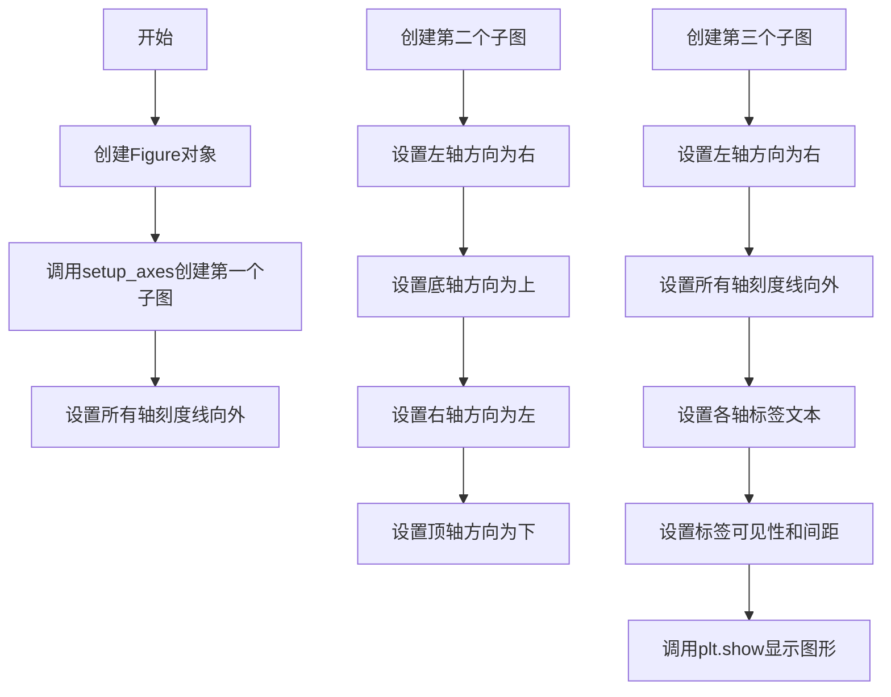

# `matplotlib\galleries\examples\axisartist\demo_ticklabel_direction.py` 详细设计文档

该代码演示了如何使用mpl_toolkits.axisartist库控制matplotlib图中坐标轴刻度标签的方向，包括设置刻度线朝向（向内/向外）、调整四个坐标轴的显示方向（左/右/上/下）、以及设置标签文本和间距。

## 整体流程



## 类结构

```
Figure (matplotlib.figure.Figure)
└── Axes (mpl_toolkits.axisartist.axislines.Axes)
    └── AxisArtist (axisartist.axis_artist)
        ├── AxisArtist (left/right/top/bottom)
        ├── TickHero (major_ticks/minor_ticks)
        └── Label (标签文本)
```

## 全局变量及字段


### `fig`
    
Matplotlib图形对象，用于承载和显示 plots

类型：`matplotlib.figure.Figure`
    


### `ax`
    
AxisArtist扩展的坐标轴对象，用于自定义坐标轴外观和方向

类型：`mpl_toolkits.axisartist.axislines.Axes`
    


### `pos`
    
子图位置参数，指定在图形网格中的位置（1-3位数字，如131表示第1行第3列第1个）

类型：`int`
    


    

## 全局函数及方法


### `setup_axes`

该函数用于在matplotlib图表中创建一个使用axisartist扩展的坐标轴对象，并预设x轴和y轴的刻度位置。它通过指定axes_class为axislines.Axes来启用axisartist的特殊坐标轴功能，支持自定义刻度方向和标签位置。

参数：

- `fig`：`matplotlib.figure.Figure`，图表容器对象，用于添加子图
- `pos`：整数或字符串，子图位置参数，指定网格位置（如131表示1行3列的第1个位置）

返回值：`axislines.Axes`，创建的坐标轴对象，返回后可进一步配置刻度方向、标签等属性

#### 流程图

```mermaid
flowchart TD
    A[开始 setup_axes] --> B[接收参数 fig 和 pos]
    B --> C[调用 fig.add_subplot 创建子图]
    C --> D[指定 axes_class=axislines.Axes]
    D --> E[设置 Y 轴刻度为 [0.2, 0.8]]
    E --> F[设置 X 轴刻度为 [0.2, 0.8]]
    F --> G[返回坐标轴对象 ax]
    G --> H[结束]
```

#### 带注释源码

```python
def setup_axes(fig, pos):
    """
    在图表中创建使用axisartist的坐标轴并设置刻度
    
    参数:
        fig: matplotlib.figure.Figure 对象，图表容器
        pos: 整数或字符串，子图位置参数（如131, '111'等）
    
    返回:
        axislines.Axes: 配置好的坐标轴对象
    """
    # 使用fig.add_subplot创建子图，指定axes_class为axisartist的Axes类
    # 这样创建的是支持axisartist特性的坐标轴，可自定义刻度方向
    ax = fig.add_subplot(pos, axes_class=axislines.Axes)
    
    # 设置y轴（左侧坐标轴）的刻度位置为0.2和0.8
    ax.set_yticks([0.2, 0.8])
    
    # 设置x轴（底部坐标轴）的刻度位置为0.2和0.8
    ax.set_xticks([0.2, 0.8])
    
    # 返回创建的坐标轴对象，供调用者进一步配置
    return ax
```


## 关键组件


### setup_axes 函数

创建并配置使用 axislines.Axes 的子图，设置刻度位置

### axisartist.axislines.Axes

matplotlib 的扩展轴类，支持高级轴方向和刻度控制

### ax.axis.values() 迭代器

获取所有轴方向（left, right, top, bottom）的迭代器接口

### major_ticks.set_tick_out(True)

配置刻度线朝向图表外侧显示的组件

### set_axis_direction 方法

设置轴的绘制方向，支持 right/left/top/bottom 四种方向配置

### label 文本设置组件

包含 set_text、set_visible、set_pad 方法的标签配置对象

### fig.subplots_adjust(bottom=0.2)

图表布局调整组件，控制底部边距空间

### ax.set_xticks/set_yticks

设置主刻度位置的坐标轴配置方法


## 问题及建议


### 已知问题

-   **硬编码配置值过多**：刻度值 `[0.2, 0.8]`、子图位置 `131/132/133`、图形尺寸 `(6, 3)`、标签间距 `0` 和 `10` 等均为硬编码，缺乏可配置性
-   **代码重复**：三个子图的设置逻辑存在明显重复，如 `axis[:].major_ticks.set_tick_out(True)` 在多处出现
-   **魔法数字缺乏解释**：`0.2`、`0.8`、`131`、`132`、`133` 等数值未以常量或枚举形式定义，降低了代码可读性和可维护性
-   **缺少函数文档**：`setup_axes` 函数没有文档字符串，参数和返回值含义不明确
-   **资源管理不完善**：使用 `plt.show()` 但未显式调用 `fig.clf()` 或 `plt.close()`，可能导致图形对象资源未及时释放
-   **注释冗余**：如 `# or you can simply do "ax.axis[:].major_ticks.set_tick_out(True)"` 这类注释对理解代码逻辑帮助有限

### 优化建议

-   **提取配置常量**：将所有硬编码值定义为模块级常量或配置字典，提高可维护性
-   **减少代码重复**：将共性的 axis 配置逻辑抽取为独立函数或使用循环遍历子图
-   **添加文档字符串**：为 `setup_axes` 函数添加完整的文档说明，包括参数类型、返回值和功能描述
-   **改进资源管理**：在 `plt.show()` 后添加 `plt.close(fig)` 或使用上下文管理器管理图形生命周期
-   **消除魔法数字**：将位置参数改为使用变量或枚举，如 `subplot_pos = [131, 132, 133]`
-   **精简注释**：移除冗余注释，保留关键业务逻辑说明


## 其它


### 设计目标与约束

本代码示例旨在演示matplotlib中坐标轴刻度标签方向的各种配置方式，帮助开发者理解如何在二维图表中灵活控制刻度线和标签的朝向。设计目标包括：1）支持刻度标签朝内/朝外设置；2）支持四个坐标轴方向的自定义设置；3）支持标签文本和间距的调整。技术约束方面，代码依赖于matplotlib 3.x版本和mpl_toolkits.axisartist模块，仅在支持axisartist的图表类型中有效。

### 错误处理与异常设计

代码未显式实现错误处理机制。在实际应用中应注意：1）当axes_class参数使用不支持的类时可能抛出AttributeError；2）set_axis_direction()方法仅接受特定字符串参数（"top", "bottom", "left", "right"），传入非法值可能导致意外行为；3）访问不存在的axis键（如ax.axis["nonexistent"]）会抛出KeyError。建议添加try-except块捕获KeyError和ValueError，并提供友好的错误提示信息。

### 数据流与状态机

代码的数据流较为简单：setup_axes函数创建带axisartist支持的子图对象，返回ax句柄；主流程依次配置三个子图，每个子图通过ax.axis字典访问各个坐标轴对象，然后调用set_tick_out()、set_axis_direction()、set_text()、set_pad()等方法修改坐标轴状态。状态转换主要体现在坐标轴方向的改变：无方向配置→配置为right/top/left/bottom，以及刻度朝向的改变：默认朝内→set_tick_out(True)改为朝外。

### 外部依赖与接口契约

核心依赖包括：matplotlib.pyplot（图表创建与显示）、mpl_toolkits.axisartist.axislines.Axes（支持axisartist的坐标轴类）。关键接口契约：setup_axes(fig, pos)接收figure对象和子图位置参数，返回Axes对象；ax.axis.values()返回所有坐标轴的迭代器；axis.major_ticks.set_tick_out(True/False)控制主刻度朝向；axis.set_axis_direction(direction)设置坐标轴方向，direction可选"top"/"bottom"/"left"/"right"；axis.label.set_text()/set_visible()/set_pad()分别设置标签文本、可见性和间距。

### 性能考虑

当前代码性能开销极低，主要涉及对象方法调用和属性设置。对于大规模图表渲染，建议：1）避免在循环中重复调用ax.axis[:]，应缓存axis对象；2）批量设置属性时可考虑使用set()方法；3）对于大量子图场景，可考虑预先创建Axes对象池。内存方面，每个子图会创建独立的axisartist对象，但示例代码规模较小可忽略。

### 安全性考虑

代码为纯前端可视化示例，不涉及用户输入处理、网络请求或敏感数据操作，安全性风险较低。但需注意：1）当从外部源动态获取标签文本时需进行输入验证，防止XSS类攻击（虽然matplotlib渲染为静态图像风险较低）；2）set_pad()等数值参数应做范围检查，避免负值或过大值导致渲染异常。

### 兼容性考虑

版本兼容性：代码需要matplotlib 1.1+版本（axisartist模块），推荐matplotlib 3.x以获得完整功能。Python版本兼容性：支持Python 3.6+。平台兼容性：matplotlib自动处理跨平台渲染，axisartist在Windows、Linux、macOS上均可正常工作。向后兼容性：matplotlib API相对稳定，但axisartist的部分高级特性可能在版本升级时有细微变化。

### 测试策略

建议测试用例包括：1）单元测试验证setup_axes函数返回正确的Axes类型；2）集成测试验证三种配置模式的渲染结果；3）边界测试传入非法axis方向字符串、访问不存在的axis键等场景；4）视觉回归测试对比不同matplotlib版本的渲染输出。测试框架推荐使用pytest，配合matplotlib的pytest插件进行图形比对。

### 配置管理

当前代码无外部配置文件，所有参数硬编码。在实际项目中可提取以下配置项：刻度位置列表yticks/xticks、子图布局参数（figsize、subplots_adjust）、标签文本内容、刻度间距数值pad。建议使用配置文件（YAML/JSON）或环境变量管理这些参数，便于不同部署环境的差异化配置。

### 监控与日志

代码运行时无日志输出。在生产环境中建议添加：1）初始化日志记录配置成功；2）参数异常时记录警告日志；3）关键方法调用（如set_axis_direction）可记录debug级别日志便于问题排查。日志格式推荐包含时间戳、日志级别、模块名、具体操作信息。

### 版本演进建议

当前代码为演示性质，未来可演进方向包括：1）封装为可复用的AxisStyleManager类，统一管理多个坐标轴的配置；2）支持从配置文件或JSON加载预定义的坐标轴样式；3）增加动画支持，展示坐标轴方向切换的动态效果；4）添加响应式布局支持，自动适应窗口大小变化。


    