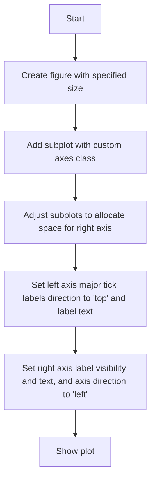
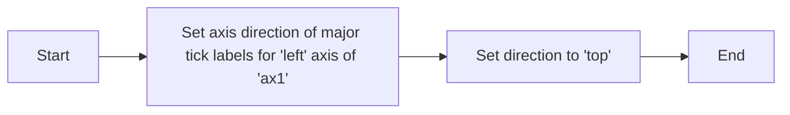
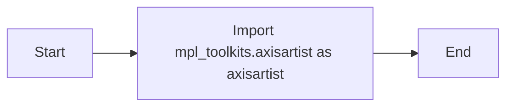

# `matplotlib\galleries\examples\axisartist\simple_axis_direction01.py` 详细设计文档

This code creates a simple plot with custom axis directions using matplotlib and axisartist.

## 整体流程



## 类结构

```
matplotlib.pyplot (module)
├── figure (function)
│   ├── figsize (parameter)
│   └── ...
├── add_subplot (function)
│   ├── axes_class (parameter)
│   └── ...
└── subplots_adjust (function)
    └── right (parameter)
```

## 全局变量及字段


### `fig`
    
The main figure object where all subplots are drawn.

类型：`matplotlib.figure.Figure`
    


### `ax1`
    
The main axes object where the plot is drawn.

类型：`mpl_toolkits.axisartist.Axes`
    


### `Axes.axis`
    
The axis object that contains the plot.

类型：`matplotlib.axes.Axes`
    


### `Axes.label`
    
The label text of the axis.

类型：`str`
    


### `Axes.major_ticklabels`
    
The ticker object that manages the major tick labels.

类型：`matplotlib.ticker.Ticker`
    


### `Axes.visible`
    
Whether the axis label is visible.

类型：`bool`
    


### `Axes.text`
    
The text of the axis label.

类型：`str`
    


### `Axes.axis_direction`
    
The direction of the axis label.

类型：`str`
    


### `Axes.set_axis_direction`
    
Sets the direction of the axis label.

类型：`None`
    


### `Axes.set_label`
    
Sets the label text of the axis.

类型：`None`
    


### `Axes.set_major_ticklabels`
    
Sets the major tick labels of the axis.

类型：`None`
    


### `Axes.set_visible`
    
Sets the visibility of the axis label.

类型：`None`
    
    

## 全局函数及方法


### `plt.show()`

`plt.show()` 是 Matplotlib 库中的一个全局函数，用于显示当前图形。

参数：

- 无

返回值：无

#### 流程图

```mermaid
graph LR
A[Start] --> B[Call plt.show()]
B --> C[End]
```

#### 带注释源码

```
plt.show()  # 显示当前图形
```


### `fig = plt.figure(figsize=(4, 2.5))`

`fig = plt.figure(figsize=(4, 2.5))` 是 Matplotlib 库中的一个全局函数，用于创建一个新的图形窗口，并设置其大小。

参数：

- `figsize`：`tuple`，图形的大小，单位为英寸。

返回值：`Figure` 对象

#### 流程图

```mermaid
graph LR
A[Start] --> B[Create new figure with size (4, 2.5)]
B --> C[Assign figure to variable 'fig']
C --> D[End]
```

#### 带注释源码

```
fig = plt.figure(figsize=(4, 2.5))  # 创建一个新的图形窗口，大小为4x2.5英寸
```


### `ax1 = fig.add_subplot(axes_class=axisartist.Axes)`

`ax1 = fig.add_subplot(axes_class=axisartist.Axes)` 是 Matplotlib 库中的一个全局函数，用于在图形窗口中添加一个子图。

参数：

- `axes_class`：`Axes` 类的子类，用于创建子图。

返回值：`Axes` 对象

#### 流程图


#### 带注释源码

```
ax1 = fig.add_subplot(axes_class=axisartist.Axes)  # 在图形窗口 'fig' 中添加一个子图，并赋值给 'ax1'
```


### `fig.subplots_adjust(right=0.8)`

`fig.subplots_adjust(right=0.8)` 是 Matplotlib 库中的一个全局函数，用于调整子图的位置和大小。

参数：

- `right`：`float`，子图区域右侧的边界，以图形宽度的比例表示。

返回值：无

#### 流程图


#### 带注释源码

```
fig.subplots_adjust(right=0.8)  # 调整图形窗口 'fig' 中子图的位置和大小，将右侧边界设置为图形宽度的0.8
```


### `ax1.axis["left"].major_ticklabels.set_axis_direction("top")`

`ax1.axis["left"].major_ticklabels.set_axis_direction("top")` 是 Matplotlib 库中的一个方法，用于设置轴标签的方向。

参数：

- `axis`：`str`，指定要设置的轴，例如 "left"、"right"、"top"、"bottom"。
- `major_ticklabels`：`TickLabel` 对象，表示主刻度标签。
- `axis_direction`：`str`，指定轴标签的方向，例如 "top"、"bottom"、"left"、"right"。

返回值：无

#### 流程图



#### 带注释源码

```
ax1.axis["left"].major_ticklabels.set_axis_direction("top")  # 设置 'ax1' 的 'left' 轴的主刻度标签方向为 'top'
```


### `ax1.axis["left"].label.set_text("Left label")`

`ax1.axis["left"].label.set_text("Left label")` 是 Matplotlib 库中的一个方法，用于设置轴标签的文本。

参数：

- `axis`：`str`，指定要设置的轴，例如 "left"、"right"、"top"、"bottom"。
- `label`：`str`，要设置的轴标签文本。

返回值：无

#### 流程图


#### 带注释源码

```
ax1.axis["left"].label.set_text("Left label")  # 设置 'ax1' 的 'left' 轴标签的文本为 'Left label'
```


### `ax1.axis["right"].label.set_visible(True)`

`ax1.axis["right"].label.set_visible(True)` 是 Matplotlib 库中的一个方法，用于设置轴标签的可见性。

参数：

- `axis`：`str`，指定要设置的轴，例如 "left"、"right"、"top"、"bottom"。
- `label`：`Label` 对象，表示轴标签。
- `visible`：`bool`，指定轴标签的可见性。

返回值：无

#### 流程图


#### 带注释源码

```
ax1.axis["right"].label.set_visible(True)  # 设置 'ax1' 的 'right' 轴标签的可见性为 True
```


### `ax1.axis["right"].label.set_text("Right label")`

`ax1.axis["right"].label.set_text("Right label")` 是 Matplotlib 库中的一个方法，用于设置轴标签的文本。

参数：

- `axis`：`str`，指定要设置的轴，例如 "left"、"right"、"top"、"bottom"。
- `label`：`str`，要设置的轴标签文本。

返回值：无

#### 流程图


#### 带注释源码

```
ax1.axis["right"].label.set_text("Right label")  # 设置 'ax1' 的 'right' 轴标签的文本为 'Right label'
```


### `ax1.axis["right"].label.set_axis_direction("left")`

`ax1.axis["right"].label.set_axis_direction("left")` 是 Matplotlib 库中的一个方法，用于设置轴标签的方向。

参数：

- `axis`：`str`，指定要设置的轴，例如 "left"、"right"、"top"、"bottom"。
- `label`：`Label` 对象，表示轴标签。
- `axis_direction`：`str`，指定轴标签的方向，例如 "top"、"bottom"、"left"、"right"。

返回值：无

#### 流程图


#### 带注释源码

```
ax1.axis["right"].label.set_axis_direction("left")  # 设置 'ax1' 的 'right' 轴标签的方向为 'left'
```


### `import matplotlib.pyplot as plt`

`import matplotlib.pyplot as plt` 是 Python 中的一个导入语句，用于导入 Matplotlib 库的 `pyplot` 模块，并给它一个别名 `plt`。

参数：

- 无

返回值：无

#### 流程图


#### 带注释源码

```
import matplotlib.pyplot as plt  # 导入 matplotlib.pyplot 模块，并给它一个别名 plt
```


### `import mpl_toolkits.axisartist as axisartist`

`import mpl_toolkits.axisartist as axisartist` 是 Python 中的一个导入语句，用于导入 Matplotlib 库的 `mpl_toolkits.axisartist` 模块，并给它一个别名 `axisartist`。

参数：

- 无

返回值：无

#### 流程图



#### 带注释源码

```
import mpl_toolkits.axisartist as axisartist  # 导入 mpl_toolkits.axisartist 模块，并给它一个别名 axisartist
```


### `fig = plt.figure(figsize=(4, 2.5))`

`fig = plt.figure(figsize=(4, 2.5))` 是 Matplotlib 库中的一个全局函数，用于创建一个新的图形窗口，并设置其大小。

参数：

- `figsize`：`tuple`，图形的大小，单位为英寸。

返回值：`Figure` 对象

#### 流程图

```mermaid
graph LR
A[Start] --> B[Create new figure with size (4, 2.5)]
B --> C[Assign figure to variable 'fig']
C --> D[End]
```

#### 带注释源码

```
fig = plt.figure(figsize=(4, 2.5))  # 创建一个新的图形窗口，大小为4x2.5英寸
```


### `ax1 = fig.add_subplot(axes_class=axisartist.Axes)`

`ax1 = fig.add_subplot(axes_class=axisartist.Axes)` 是 Matplotlib 库中的一个全局函数，用于在图形窗口中添加一个子图。

参数：

- `axes_class`：`Axes` 类的子类，用于创建子图。

返回值：`Axes` 对象

#### 流程图


#### 带注释源码

```
ax1 = fig.add_subplot(axes_class=axisartist.Axes)  # 在图形窗口 'fig' 中添加一个子图，并赋值给 'ax1'
```


### `fig.subplots_adjust(right=0.8)`

`fig.subplots_adjust(right=0.8)` 是 Matplotlib 库中的一个全局函数，用于调整子图的位置和大小。

参数：

- `right`：`float`，子图区域右侧的边界，以图形宽度的比例表示。

返回值：无

#### 流程图


#### 带注释源码

```
fig.subplots_adjust(right=0.8)  # 调整图形窗口 'fig' 中子图的位置和大小，将右侧边界设置为图形宽度的0.8
```


### `ax1.axis["left"].major_ticklabels.set_axis_direction("top")`

`ax1.axis["left"].major_ticklabels.set_axis_direction("top")` 是 Matplotlib 库中的一个方法，用于设置轴标签的方向。

参数：

- `axis`：`str`，指定要设置的轴，例如 "left"、"right"、"top"、"bottom"。
- `major_ticklabels`：`TickLabel` 对象，表示主刻度标签。
- `axis_direction`：`str`，指定轴标签的方向，例如 "top"、"bottom"、"left"、"right"。

返回值：无

#### 流程图


#### 带注释源码

```
ax1.axis["left"].major_ticklabels.set_axis_direction("top")  # 设置 'ax1' 的 'left' 轴的主刻度标签方向为 'top'
```


### `ax1.axis["left"].label.set_text("Left label")`

`ax1.axis["left"].label.set_text("Left label")` 是 Matplotlib 库中的一个方法，用于设置轴标签的文本。

参数：

- `axis`：`str`，指定要设置的轴，例如 "left"、"right"、"top"、"bottom"。
- `label`：`str`，要设置的轴标签文本。

返回值：无

#### 流程图


#### 带注释源码

```
ax1.axis["left"].label.set_text("Left label")  # 设置 'ax1' 的 'left' 轴标签的文本为 'Left label'
```


### `ax1.axis["right"].label.set_visible(True)`

`ax1.axis["right"].label.set_visible(True)` 是 Matplotlib 库中的一个方法，用于设置轴标签的可见性。

参数：

- `axis`：`str`，指定要设置的轴，例如 "left"、"right"、"top"、"bottom"。
- `label`：`Label` 对象，表示轴标签。
- `visible`：`bool`，指定轴标签的可见性。

返回值：无

#### 流程图


#### 带注释源码

```
ax1.axis["right"].label.set_visible(True)  # 设置 'ax1' 的 'right' 轴标签的可见性为 True
```


### `ax1.axis["right"].label.set_text("Right label")`

`ax1.axis["right"].label.set_text("Right label")` 是 Matplotlib 库中的一个方法，用于设置轴标签的文本。

参数：

- `axis`：`str`，指定要设置的轴，例如 "left"、"right"、"top"、"bottom"。
- `label`：`str`，要设置的轴标签文本。

返回值：无

#### 流程图


#### 带注释源码

```
ax1.axis["right"].label.set_text("Right label")  # 设置 'ax1' 的 'right' 轴标签的文本为 'Right label'
```


### `ax1.axis["right"].label.set_axis_direction("left")`

`ax1.axis["right"].label.set_axis_direction("left")` 是 Matplotlib 库中的一个方法，用于设置轴标签的方向。

参数：

- `axis`：`str`，指定要设置的轴，例如 "left"、"right"、"top"、"bottom"。
- `label`：`Label` 对象，表示轴标签。
- `axis_direction`：`str`，指定轴标签的方向，例如 "top"、"bottom"、"left"、"right"。

返回值：无

#### 流程图


#### 带注释源码

```
ax1.axis["right"].label.set_axis_direction("left")  # 设置 'ax1' 的 'right' 轴标签的方向为 'left'
```


### `plt.show()`

`plt.show()` 是 Matplotlib 库中的一个全局函数，用于显示当前图形。

参数：

- 无

返回值：无

#### 流程图

```mermaid
graph LR
A[Start] --> B[Call plt.show()]
B --> C[End]
```

#### 带注释源码

```
plt.show()  # 显示当前图形
```


### plt.figure

`plt.figure` 是 Matplotlib 库中的一个函数，用于创建一个新的图形窗口。

参数：

- `figsize`：`tuple`，图形的宽度和高度，默认为 (6.4, 4.8)。

返回值：`Figure`，表示创建的图形对象。

#### 流程图

```mermaid
graph LR
A[Start] --> B{Create figure with figsize}
B --> C[Add subplot]
C --> D[Adjust subplot layout]
D --> E[Set axis labels and directions]
E --> F[Show the figure]
F --> G[End]
```

#### 带注释源码

```python
"""
=====================
Simple axis direction
=====================

"""
import matplotlib.pyplot as plt

fig = plt.figure(figsize=(4, 2.5))  # Create a new figure with specified size
ax1 = fig.add_subplot(axes_class=axisartist.Axes)  # Add a subplot to the figure
fig.subplots_adjust(right=0.8)  # Adjust the layout of the subplots

ax1.axis["left"].major_ticklabels.set_axis_direction("top")  # Set the axis direction for left axis
ax1.axis["left"].label.set_text("Left label")  # Set the label for left axis

ax1.axis["right"].label.set_visible(True)  # Make the right axis label visible
ax1.axis["right"].label.set_text("Right label")  # Set the label for right axis
ax1.axis["right"].label.set_axis_direction("left")  # Set the axis direction for right axis

plt.show()  # Display the figure
```


### fig.subplots_adjust

调整子图参数。

参数：

- `right`：`float`，子图右侧边界与图边界之间的距离（以小数表示的分数）。

返回值：无

#### 流程图

```mermaid
graph LR
A[fig.subplots_adjust] --> B{设置参数}
B --> C[无返回值]
```

#### 带注释源码

```python
fig.subplots_adjust(right=0.8)
# 调用subplots_adjust方法，设置子图右侧边界与图边界之间的距离为0.8
```


### ax1.axis["left"].major_ticklabels.set_axis_direction("top")

该函数设置轴标签的方向。

参数：

- `ax1.axis["left"]`：`Axes`，代表左侧轴对象。
- `"top"`：`str`，设置标签方向为顶部。

返回值：无，该函数直接修改轴标签的方向。

#### 流程图

```mermaid
graph LR
A[Set axis direction] --> B{Is direction "top"?}
B -- Yes --> C[Set direction to "top"]
B -- No --> D[Set direction to "default"]
```

#### 带注释源码

```
# 设置左侧轴标签方向为顶部
ax1.axis["left"].major_ticklabels.set_axis_direction("top")
```


### ax1.axis['left'].major_ticklabels.set_axis_direction

该函数用于设置matplotlib中轴标签的方向。

参数：

- `direction`：`str`，指定轴标签的方向，可以是"top"、"bottom"、"left"、"right"等。

返回值：无

#### 流程图

```mermaid
graph LR
A[开始] --> B{设置方向}
B --> C[结束]
```

#### 带注释源码

```python
# 设置轴标签方向
ax1.axis['left'].major_ticklabels.set_axis_direction("top")
```


### ax1.axis['left'].label.set_text

该函数用于设置matplotlib中轴标签的文本内容。

参数：

- `text`：`str`，要设置的标签文本。

返回值：无

#### 流程图

```mermaid
graph LR
A[Start] --> B{Set text}
B --> C[End]
```

#### 带注释源码

```python
# 设置轴标签的文本内容
ax1.axis['left'].label.set_text("Left label")
```


### ax1.axis['right'].label.set_visible

该函数用于设置matplotlib中轴标签的可见性。

参数：

- `True`：`布尔类型`，设置标签为可见
- `False`：`布尔类型`，设置标签为不可见

返回值：`无`，该函数不返回任何值

#### 流程图

```mermaid
graph LR
A[Set visibility] --> B{Is visible?}
B -- Yes --> C[No action]
B -- No --> D[Set invisible]
```

#### 带注释源码

```python
# 设置轴标签的可见性
ax1.axis['right'].label.set_visible(True)
```


### ax1.axis['right'].label.set_text

该函数用于设置matplotlib中轴标签的文本内容。

参数：

- `ax1.axis['right'].label`：`matplotlib.text.Text`，轴标签对象，表示右侧轴的标签。
- `text`：`str`，要设置的文本内容。

返回值：无

#### 流程图

```mermaid
graph LR
A[Start] --> B{Set text}
B --> C[End]
```

#### 带注释源码

```python
# 设置右侧轴标签的文本内容
ax1.axis["right"].label.set_text("Right label")
```


### ax1.axis['right'].label.set_axis_direction

该函数用于设置matplotlib中轴标签的方向。

参数：

- `direction`：`str`，指定轴标签的方向，可以是"top"、"bottom"、"left"、"right"等。

返回值：无

#### 流程图

```mermaid
graph LR
A[开始] --> B{设置方向}
B --> C[结束]
```

#### 带注释源码

```python
# 设置轴标签方向
ax1.axis['right'].label.set_axis_direction("left")
```


### plt.show()

`plt.show()` 是 Matplotlib 库中的一个全局函数，用于显示当前图形。

参数：

- 无

返回值：无

#### 流程图

```mermaid
graph LR
A[Start] --> B[Call plt.show()]
B --> C[End]
```

#### 带注释源码

```
import matplotlib.pyplot as plt

# ... (其他代码)

plt.show()  # 显示当前图形
```


### SimpleAxisDirection

`SimpleAxisDirection` 类用于设置轴的方向和标签。

类字段：

- `fig`: `Figure`，表示当前图形的实例。
- `ax1`: `Axes`，表示当前图形的轴实例。

类方法：

- `__init__(self, fig, ax1)`: 构造函数，初始化类实例。

#### 流程图

```mermaid
graph LR
A[Start] --> B[Create fig]
B --> C[Create ax1]
C --> D[Set axis direction and labels]
D --> E[End]
```

#### 带注释源码

```
import matplotlib.pyplot as plt
import mpl_toolkits.axisartist as axisartist

class SimpleAxisDirection:
    def __init__(self, fig, ax1):
        self.fig = fig
        self.ax1 = ax1

    # ... (其他方法)
```


### axisartist.Axes

`Axes` 类是 Matplotlib 库中的一个类，用于创建轴。

类字段：

- `axis`: `Axes`，表示轴的实例。

类方法：

- `add_subplot(self, axes_class=Axes)`: 添加子图。

#### 流程图

```mermaid
graph LR
A[Start] --> B[Create Axes instance]
B --> C[Add subplot]
C --> D[End]
```

#### 带注释源码

```
import matplotlib.pyplot as plt
import mpl_toolkits.axisartist as axisartist

class Axes:
    def __init__(self):
        self.axis = None

    def add_subplot(self, axes_class=Axes):
        self.axis = axes_class()
        return self.axis
```


### matplotlib.pyplot.figure

`Figure` 类是 Matplotlib 库中的一个类，用于创建图形。

类字段：

- `figsize`: `tuple`，表示图形的大小。

类方法：

- `add_subplot(self, axes_class=Axes)`: 添加子图。

#### 流程图

```mermaid
graph LR
A[Start] --> B[Create Figure instance]
B --> C[Set figsize]
C --> D[Add subplot]
D --> E[End]
```

#### 带注释源码

```
import matplotlib.pyplot as plt

class Figure:
    def __init__(self, figsize=(5, 4)):
        self.figsize = figsize

    def add_subplot(self, axes_class=Axes):
        return axes_class()
```


### 关键组件信息

- `matplotlib.pyplot`: Matplotlib 库的顶层模块，用于创建和显示图形。
- `mpl_toolkits.axisartist`: Matplotlib 的一个工具包，用于创建自定义轴。
- `Figure`: Matplotlib 中的图形类。
- `Axes`: Matplotlib 中的轴类。


### 潜在的技术债务或优化空间

- 代码中使用了硬编码的图形大小和轴标签，这可能会限制代码的灵活性。
- 可以考虑使用配置文件或参数化输入来允许用户自定义图形和轴的属性。
- 代码中没有进行错误处理，如果出现异常，可能会导致程序崩溃。


### 设计目标与约束

- 设计目标是创建一个简单的轴方向设置示例。
- 约束包括使用 Matplotlib 库和 mpl_toolkits.axisartist 工具包。


### 错误处理与异常设计

- 代码中没有进行错误处理，应该添加异常处理来捕获和处理可能出现的错误。


### 数据流与状态机

- 数据流从创建图形和轴开始，然后设置轴的方向和标签，最后显示图形。
- 状态机不适用，因为代码没有涉及状态转换。


### 外部依赖与接口契约

- 代码依赖于 Matplotlib 库和 mpl_toolkits.axisartist 工具包。
- 接口契约包括 Matplotlib 库提供的 API 和 mpl_toolkits.axisartist 工具包的功能。


### `Axes.set_axis_direction`

`Axes.set_axis_direction` 是一个设置轴标签方向的方法，用于matplotlib库中的Axes类。

参数：

- `axis_direction`：`str`，指定轴标签的方向，可以是"top"、"bottom"、"left"、"right"等。

返回值：`None`，该方法不返回任何值。

#### 流程图

```mermaid
graph LR
A[开始] --> B{设置轴标签方向}
B --> C[结束]
```

#### 带注释源码

```python
# 设置轴标签方向
ax1.axis["left"].major_ticklabels.set_axis_direction("top")
# ax1.axis["left"].label.set_text("Left label")  # 设置左侧轴标签文本
ax1.axis["right"].label.set_visible(True)
ax1.axis["right"].label.set_text("Right label")  # 设置右侧轴标签文本
ax1.axis["right"].label.set_axis_direction("left")  # 设置右侧轴标签方向为左侧
```


### `Axes.set_label`

`Axes.set_label` 方法用于设置轴标签的文本和方向。

参数：

- `label`：`str`，轴标签的文本内容。
- `axis_direction`：`str`，轴标签的方向，可以是 "top", "left", "right", "bottom"。

返回值：`None`，该方法不返回任何值。

#### 流程图

```mermaid
graph LR
A[开始] --> B{设置参数}
B --> C[执行设置]
C --> D[结束]
```

#### 带注释源码

```python
# 设置轴标签的文本和方向
ax1.axis["right"].label.set_text("Right label")
ax1.axis["right"].label.set_axis_direction("left")
```


### `Axes.set_major_ticklabels`

`Axes.set_major_ticklabels` 方法用于设置轴的主刻度标签的方向。

参数：

- `axis_direction`：`str`，指定刻度标签的方向，例如 "top"、"left"、"right"、"bottom"。

返回值：无

#### 流程图

```mermaid
graph LR
A[开始] --> B{设置参数}
B --> C[执行设置]
C --> D[结束]
```

#### 带注释源码

```python
# 设置轴的主刻度标签的方向
ax1.axis["left"].major_ticklabels.set_axis_direction("top")
```


### `Axes.set_visible`

`Axes.set_visible` 是一个用于设置轴标签可见性的方法。

参数：

- `visible`：`bool`，表示轴标签是否可见。

返回值：`None`，该方法不返回任何值。

#### 流程图

```mermaid
graph LR
A[开始] --> B{设置可见性}
B --> C[结束]
```

#### 带注释源码

```
# 设置轴标签可见性
ax1.axis["right"].label.set_visible(True)
```

在这段代码中，`ax1.axis["right"].label.set_visible(True)` 调用了 `set_visible` 方法，将右侧轴标签的可见性设置为 `True`，即可见。


### `add_subplot`

`fig.add_subplot(axes_class=axisartist.Axes)`

参数：

- `axes_class`：`axisartist.Axes`，指定用于创建子图的对象类
- `fig`：`matplotlib.figure.Figure`，当前图实例

参数描述：`axes_class`参数用于指定创建子图时使用的类，这里指定为`axisartist.Axes`，这是一个特殊的轴类，提供了更灵活的轴配置选项。

返回值类型：`matplotlib.axes.Axes`

返回值描述：返回创建的子图轴对象。

#### 流程图

```mermaid
graph LR
A[Start] --> B{Create figure}
B --> C[Add subplot with axisartist.Axes]
C --> D[Configure axis labels]
D --> E[Show plot]
E --> F[End]
```

#### 带注释源码

```
fig = plt.figure(figsize=(4, 2.5))  # Create a figure with specified size
ax1 = fig.add_subplot(axes_class=axisartist.Axes)  # Add a subplot using axisartist.Axes
fig.subplots_adjust(right=0.8)  # Adjust the subplots layout
ax1.axis["left"].major_ticklabels.set_axis_direction("top")  # Set the axis direction for left axis
ax1.axis["left"].label.set_text("Left label")  # Set the label text for left axis
ax1.axis["right"].label.set_visible(True)  # Make the right axis label visible
ax1.axis["right"].label.set_text("Right label")  # Set the label text for right axis
ax1.axis["right"].label.set_axis_direction("left")  # Set the axis direction for right axis
plt.show()  # Display the plot
```

### `set_axis_direction`

`ax1.axis["left"].major_ticklabels.set_axis_direction("top")`

参数：

- `ax1.axis["left"]`：`matplotlib.axes.Axes`，左轴对象
- `major_ticklabels`：`matplotlib.ticker.Ticker`，主刻度标签对象
- `"top"`：`str`，指定轴方向为顶部

参数描述：`set_axis_direction`方法用于设置轴标签的方向。

返回值类型：无

返回值描述：无

#### 流程图

```mermaid
graph LR
A[Start] --> B{Set axis direction}
B --> C[End]
```

#### 带注释源码

```
ax1.axis["left"].major_ticklabels.set_axis_direction("top")  # Set the axis direction for left axis
```

### `set_text`

`ax1.axis["left"].label.set_text("Left label")`

参数：

- `ax1.axis["left"]`：`matplotlib.axes.Axes`，左轴对象
- `"Left label"`：`str`，指定标签文本

参数描述：`set_text`方法用于设置轴标签的文本。

返回值类型：无

返回值描述：无

#### 流程图

```mermaid
graph LR
A[Start] --> B{Set label text}
B --> C[End]
```

#### 带注释源码

```
ax1.axis["left"].label.set_text("Left label")  # Set the label text for left axis
```

### `set_visible`

`ax1.axis["right"].label.set_visible(True)`

参数：

- `ax1.axis["right"]`：`matplotlib.axes.Axes`，右轴对象
- `True`：`bool`，指定标签是否可见

参数描述：`set_visible`方法用于设置轴标签的可见性。

返回值类型：无

返回值描述：无

#### 流程图

```mermaid
graph LR
A[Start] --> B{Set label visibility}
B --> C[End]
```

#### 带注释源码

```
ax1.axis["right"].label.set_visible(True)  # Make the right axis label visible
```

### `set_axis_direction`

`ax1.axis["right"].label.set_axis_direction("left")`

参数：

- `ax1.axis["right"]`：`matplotlib.axes.Axes`，右轴对象
- `"left"`：`str`，指定轴方向为左侧

参数描述：`set_axis_direction`方法用于设置轴标签的方向。

返回值类型：无

返回值描述：无

#### 流程图

```mermaid
graph LR
A[Start] --> B{Set axis direction}
B --> C[End]
```

#### 带注释源码

```
ax1.axis["right"].label.set_axis_direction("left")  # Set the axis direction for right axis
```

### `show`

`plt.show()`

参数：无

参数描述：`show`方法用于显示当前图形。

返回值类型：无

返回值描述：无

#### 流程图

```mermaid
graph LR
A[Start] --> B{Show plot}
B --> C[End]
```

#### 带注释源码

```
plt.show()  # Display the plot
```


## 关键组件


### 张量索引与惰性加载

张量索引与惰性加载是深度学习框架中用于高效处理大型数据集的关键技术，它允许在需要时才计算数据，从而减少内存消耗和提高计算效率。

### 反量化支持

反量化支持是深度学习模型优化中的一个重要特性，它允许模型在量化过程中保持较高的精度，从而在降低模型大小和计算量的同时，保持模型性能。

### 量化策略

量化策略是深度学习模型压缩技术的一部分，它通过将模型中的浮点数参数转换为低精度整数来减少模型大小和计算量，同时保持模型性能。


## 问题及建议


### 已知问题

-   {问题1}：代码中使用了全局变量 `fig` 和 `ax1`，这可能导致代码的可重用性和可维护性较差，因为全局变量容易在代码的不同部分产生意外的副作用。
-   {问题2}：代码中使用了 `matplotlib.pyplot` 和 `mpl_toolkits.axisartist`，这些库的依赖性可能会增加项目的复杂性和维护成本。
-   {问题3}：代码没有进行任何错误处理或异常设计，如果出现异常情况（如库函数调用失败），程序可能会崩溃。

### 优化建议

-   {建议1}：将全局变量封装在类中，以提高代码的可重用性和可维护性。
-   {建议2}：考虑使用更轻量级的绘图库，如 `matplotlib` 的基础模块，以减少依赖性。
-   {建议3}：添加异常处理机制，确保程序在遇到错误时能够优雅地处理异常情况，并提供有用的错误信息。
-   {建议4}：添加日志记录，以便于跟踪程序的执行过程和潜在的问题。
-   {建议5}：考虑使用面向对象的设计模式，如工厂模式或单例模式，以进一步改善代码的结构和可维护性。


## 其它


### 设计目标与约束

- 设计目标：实现一个简单的轴方向调整功能，用于matplotlib图形中调整左右轴标签的方向。
- 约束条件：代码应简洁，易于理解和维护，且不依赖于额外的库。

### 错误处理与异常设计

- 错误处理：代码中未包含异常处理机制，但应考虑在图形创建或显示过程中可能出现的异常，如matplotlib版本不兼容等。
- 异常设计：建议在关键操作前添加异常捕获和处理逻辑，确保程序的健壮性。

### 数据流与状态机

- 数据流：代码中主要涉及matplotlib图形对象的创建和配置，数据流相对简单。
- 状态机：代码中无状态机设计，主要执行顺序为：创建图形 -> 添加轴 -> 配置轴标签 -> 显示图形。

### 外部依赖与接口契约

- 外部依赖：代码依赖于matplotlib库，特别是mpl_toolkits.axisartist模块。
- 接口契约：matplotlib库的接口契约应遵循官方文档，确保代码的兼容性和稳定性。

### 测试与验证

- 测试策略：编写单元测试，验证代码在不同配置下的正确性和稳定性。
- 验证方法：使用matplotlib图形显示功能，观察左右轴标签方向是否正确调整。

### 性能分析

- 性能指标：代码执行时间、内存占用等。
- 性能优化：分析代码执行瓶颈，如循环、递归等，进行优化。

### 安全性

- 安全风险：代码中无明显的安全风险。
- 安全措施：确保代码遵循最佳实践，避免潜在的安全漏洞。

### 维护与扩展

- 维护策略：定期更新依赖库，修复已知问题。
- 扩展性：代码结构清晰，易于添加新的功能或调整现有功能。


    