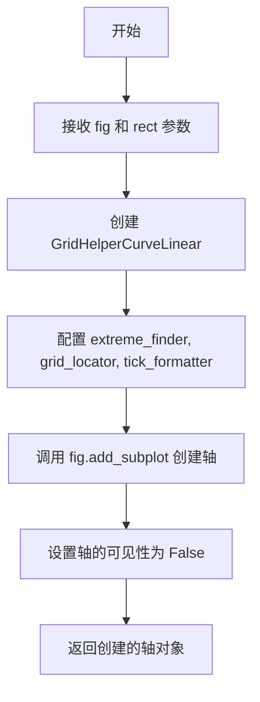

# `matplotlib\galleries\examples\axisartist\simple_axis_pad.py` 详细设计文档

这是一个matplotlib示例代码，展示了如何使用axisartist库在矩形框中创建极坐标投影，并演示了如何通过设置浮动轴的pad属性来调整标签、刻度标签和刻度的位置。

## 整体流程

```mermaid
graph TD
    A[开始] --> B[导入必要的库]
    B --> C[定义setup_axes函数]
    C --> D[定义add_floating_axis1函数]
    D --> E[定义add_floating_axis2函数]
    E --> F[创建图形窗口]
    F --> G[设置子图布局]
    G --> H[定义ann函数用于添加注释]
    H --> I[创建第一个子图: 默认配置]
    I --> J[创建第二个子图: 设置ticklabels.set_pad(10)]
    J --> K[创建第三个子图: 设置label.set_pad(20)]
    K --> L[创建第四个子图: 设置ticks.set_tick_out(True)]
    L --> M[调用plt.show显示图形]
```

## 类结构

```
无自定义类层次结构
仅使用matplotlib库中的类:
- Figure (matplotlib.figure)
- Axes (mpl_toolkits.axisartist)
- GridHelperCurveLinear
- PolarAxes
- Affine2D
```

## 全局变量及字段


### `fig`
    
图形窗口，用于放置图表和坐标轴的容器

类型：`matplotlib.figure.Figure`
    


    

## 全局函数及方法


### `setup_axes(fig, rect)`

该函数用于在给定的图表容器中创建一个带有极坐标投影的轴（Axes），通过 Curvelinear 网格助手实现极坐标到直角坐标的转换，支持自定义的经纬度查找器、网格定位器和刻度格式化器。

参数：

- `fig`：`matplotlib.figure.Figure`，图表容器对象，表示整个图形窗口
- `rect`：整数或元组，子图位置参数，用于指定子图在网格中的位置（如 141 表示 1 行 4 列的第 1 个位置）

返回值：`axisartist.Axes`，创建的自定义轴对象，支持极坐标投影和曲线网格

#### 流程图



#### 带注释源码

```python
def setup_axes(fig, rect):
    """Polar projection, but in a rectangular box."""
    # see demo_curvelinear_grid.py for details
    # 创建曲线网格助手，定义极坐标转换和网格参数
    grid_helper = GridHelperCurveLinear(
        Affine2D().scale(np.pi/180., 1.) + PolarAxes.PolarTransform(),  # 变换：角度转弧度 + 极坐标变换
        extreme_finder=angle_helper.ExtremeFinderCycle(  # 极值查找器
            20, 20,  # 经纬度方向采样数
            lon_cycle=360, lat_cycle=None,  # 经度360度周期，纬度无周期
            lon_minmax=None, lat_minmax=(0, np.inf),  # 纬度范围限制
        ),
        grid_locator1=angle_helper.LocatorDMS(12),  # 经度网格定位器：12度间隔
        grid_locator2=grid_finder.MaxNLocator(5),  # 纬度网格定位器：最多5条线
        tick_formatter1=angle_helper.FormatterDMS(),  # 经度刻度格式化器
    )
    # 添加子图，使用 axisartist.Axes 类和自定义网格助手
    ax = fig.add_subplot(
        rect, axes_class=axisartist.Axes, grid_helper=grid_helper,
        aspect=1, xlim=(-5, 12), ylim=(-5, 10))
    ax.axis[:].set_visible(False)  # 隐藏默认轴线
    return ax
```


### `add_floating_axis1`

添加纬度浮动轴函数，用于在极坐标投影图中创建一个角度为30度的浮动轴，并设置其标签文本和可见性。

参数：

-  `ax1`：`matplotlib.axes.Axes`，极坐标投影的Axes对象，用于添加浮动轴

返回值：`mpl_toolkits.axisartist.axis_artist.FloatingAxis`，创建的浮动轴对象，用于后续对轴的样式和属性进行进一步配置

#### 流程图

```mermaid
flowchart TD
    A[开始 add_floating_axis1] --> B[调用 ax1.new_floating_axis 创建浮动轴]
    B --> C[设置 axis['lat'] 关联到浮动轴]
    C --> D[设置标签文本为 theta = 30度]
    D --> E[设置标签可见]
    E --> F[返回浮动轴对象]
```

#### 带注释源码

```python
def add_floating_axis1(ax1):
    """
    添加纬度浮动轴到极坐标投影图中
    
    参数:
        ax1: 极坐标投影的Axes对象
        
    返回:
        创建的浮动轴对象
    """
    # 使用 new_floating_axis 方法创建浮动轴
    # 第一个参数 0 表示纬度轴（经度为1）
    # 第二个参数 30 表示角度值为30度
    ax1.axis["lat"] = axis = ax1.new_floating_axis(0, 30)
    
    # 设置浮动轴的标签文本，使用LaTeX格式显示数学符号
    axis.label.set_text(r"$\theta = 30^{\circ}$")
    
    # 确保标签可见
    axis.label.set_visible(True)

    # 返回创建的浮动轴对象，供调用者进行进一步定制
    return axis
```


### `add_floating_axis2`

该函数用于在给定的matplotlib坐标轴上添加一条经度（lon）浮动轴，设置其标签文本为 "$r = 6$" 并使标签可见，最后返回创建的浮动轴对象。

参数：

-  `ax1`：`matplotlib.axes.Axes`，需要进行操作的matplotlib坐标轴对象

返回值：`matplotlib.axis`，创建的浮动轴对象，用于进一步自定义（如设置刻度、标签样式等）

#### 流程图

```mermaid
flowchart TD
    A[开始 add_floating_axis2] --> B[调用 ax1.new_floating_axis<br/>参数: direction=1, value=6]
    B --> C[创建浮动轴对象]
    C --> D[将浮动轴赋值给 ax1.axis['lon']]
    D --> E[调用 axis.label.set_text<br/>设置标签文本为 r=6]
    E --> F[调用 axis.label.set_visible<br/>设置标签可见]
    F --> G[返回 axis 浮动轴对象]
    G --> H[结束]
```

#### 带注释源码

```python
def add_floating_axis2(ax1):
    """
    添加经度浮动轴
    
    参数:
        ax1: matplotlib坐标轴对象
        
    返回:
        创建的浮动轴对象
    """
    # 使用坐标轴的new_floating_axis方法创建浮动轴
    # 参数1表示方向为经度(longitude)，参数6表示值为6
    # 返回的axis对象代表新创建的浮动轴
    ax1.axis["lon"] = axis = ax1.new_floating_axis(1, 6)
    
    # 设置浮动轴的标签文本为 r = 6
    # r 通常表示半径或径向距离
    axis.label.set_text(r"$r = 6$")
    
    # 使浮动轴的标签可见
    axis.label.set_visible(True)
    
    # 返回创建的浮动轴对象，供调用者进一步自定义
    return axis
```


### `ann`

该函数用于在matplotlib图表的坐标轴上添加注释文本。通过调用ax1.annotate()方法，在指定的axes fraction坐标系位置（0.5, 1）添加文本内容，并使用offset points方式偏移（5, -5）点，支持垂直顶部对齐和水平居中对齐。

参数：

-  `ax1`：`matplotlib.axes.Axes`，matplotlib的坐标轴对象，表示要在其上添加注释的目标轴
-  `d`：`str`，注释文本的内容，将显示在坐标轴上

返回值：`None`，该函数直接操作坐标轴对象添加注释，不返回任何值

#### 流程图

```mermaid
flowchart TD
    A[开始 ann 函数] --> B[调用 ax1.annotate 方法]
    B --> C[设置注释文本内容为参数 d]
    C --> D[设置注释位置: xycoords=axes fraction, 坐标点 (0.5, 1)]
    D --> E[设置文本偏移: textcoords=offset points, 偏移量 (5, -5)]
    E --> F[设置垂直对齐: va=top]
    F --> G[设置水平对齐: ha=center]
    G --> H[执行注释绘制]
    H --> I[结束函数, 返回 None]
```

#### 带注释源码

```python
def ann(ax1, d):
    """
    在matplotlib坐标轴上添加注释文本的函数
    
    参数:
        ax1: matplotlib坐标轴对象
        d: 要显示的注释文本内容
    """
    # 使用annotate方法添加注释
    # 参数说明:
    # - d: 注释的文本内容
    # - (0.5, 1): 注释在axes fraction坐标系中的位置（x=0.5, y=1）
    # - (5, -5): 文本位置的偏移量（x方向偏移5点，y方向偏移-5点）
    # - xycoords="axes fraction": 位置坐标使用axes fraction坐标系
    # - textcoords="offset points": 文本偏移使用points单位
    # - va="top": 垂直对齐方式为顶部对齐
    # - ha="center": 水平对齐方式为居中对齐
    ax1.annotate(d, (0.5, 1), (5, -5),
                 xycoords="axes fraction", textcoords="offset points",
                 va="top", ha="center")
```


## 关键组件


### setup_axes 函数

负责创建极坐标投影的坐标系，并将其放置在矩形盒子中。通过GridHelperCurveLinear配置网格定位器和刻度格式化器，设置坐标轴的显示范围和纵横比。

### add_floating_axis1 函数

创建浮动的纬度轴（theta轴），设置角度为30度，并显示相应的标签。这是演示不同padding设置的核心组件之一。

### add_floating_axis2 函数

创建浮动的经度轴（r轴），设置半径值为6，并显示相应的标签。用于展示径向坐标轴的浮动标签配置。

### ann 函数

用于在子图上添加注释文本的辅助函数，通过指定坐标转换方式将文本放置在指定位置。

### GridHelperCurveLinear 组件

曲线性网格辅助器，负责处理极坐标到直角坐标的变换映射，管理网格线的定位和刻度格式化。

### axisartist.Axes 组件

来自axisartist工具包的专用坐标轴类，支持浮动轴和自定义坐标轴样式的绘制。

### 四个演示子图

分别展示默认设置、ticklabels.set_pad(10)、label.set_pad(20)和set_tick_out(True)四种不同的padding和刻度方向配置效果。

### 潜在优化空间

代码中add_floating_axis2函数被定义但未在主流程中调用，可考虑补充使用或移除。重复的ax1设置代码可提取为循环结构以提高可维护性。


## 问题及建议


### 已知问题

-   **硬编码的魔法数字**：代码中存在大量硬编码的参数值（如`20, 20`、`360, None`、`12`、`5`、`(-5, 12), (-5, 10)`等），缺乏常量定义，降低了代码可维护性和可读性
-   **重复代码模式**：四个子图的创建流程高度相似（`setup_axes` → `add_floating_axis1` → `ann`），存在明显的代码重复
-   **缺少错误处理**：没有对输入参数的有效性检查，缺乏异常捕获机制
-   **全局变量污染**：`ax1`、`axis`、`fig`等变量定义在全局作用域，可能导致命名空间污染
-   **函数设计问题**：`ann`函数定义在全局但仅使用一次，且缺少类型注解和详细的docstring
-   **未充分使用变量**：`axis`变量被赋值但在不同位置未被充分利用，返回值使用不一致

### 优化建议

-   **提取配置常量**：将所有魔法数字提取为模块级常量或配置类，提高可维护性
-   **封装重复逻辑**：使用循环或封装函数来创建子图，减少代码重复
-   **添加类型注解**：为函数参数和返回值添加类型提示，提升代码可读性
-   **完善文档**：为每个函数添加详细的docstring，描述参数、返回值和功能
-   **错误处理**：添加参数验证和异常处理逻辑
-   **代码重构**：将相关功能封装到类中，或将`ann`函数移到使用位置附近
-   **布局参数化**：将`figsize`、`subplots_adjust`等布局参数提取为可配置参数


## 其它


### 设计目标与约束

本代码旨在演示matplotlib axisartist模块中浮动轴（floating axis）的不同配置效果，包括坐标轴标签位置（label pad）、刻度标签位置（ticklabels pad）和刻度方向（tick_out）的调整。约束条件：依赖matplotlib 3.x版本和mpl_toolkits.axisartist模块，需在支持图形显示的环境中运行。

### 错误处理与异常设计

代码中未包含显式的异常处理机制。潜在错误场景包括：1) matplotlib后端不支持导致show()失败；2) 传入无效的rect参数导致子图创建失败；3) 极端finder参数配置不当导致坐标计算异常。当前采用"快速失败"策略，依赖matplotlib内部错误抛出。

### 数据流与状态机

数据流：plt.figure() → fig.add_subplot() → GridHelperCurveLinear配置 → 坐标轴创建 → 浮动轴添加 → 标签/刻度属性设置 → plt.show()渲染。状态机转换：图形初始化状态 → 子图配置状态 → 坐标轴定制状态 → 渲染完成状态。

### 外部依赖与接口契约

核心依赖：matplotlib.pyplot、numpy、mpl_toolkits.axisartist。关键接口：GridHelperCurveLinear(_transform, extreme_finder, grid_locator1, grid_locator2, tick_formatter1)用于创建曲线网格；ax.new_floating_axis(direction, value)用于添加浮动坐标轴；axis.major_ticklabels.set_pad()、axis.label.set_pad()、axis.major_ticks.set_tick_out()分别用于设置标签和刻度属性。所有接口返回值均为Axis实例或Label/Tick对象，支持链式调用。

### 性能考量与资源消耗

代码运行时创建4个子图，每个子图包含完整的极坐标转换网格。性能开销主要来自：GridHelperCurveLinear的网格计算、PolarAxes的坐标变换、Affine2D的矩阵运算。建议在静态图表生成场景使用，避免频繁重绘。

### 兼容性说明

代码兼容matplotlib 2.0+版本。PolarAxes.PolarTransform()在matplotlib 3.5+中API保持稳定。grid_finder.MaxNLocator和angle_helper.ExtremeFinderCycle为axisartist模块核心组件，在各版本中接口一致。


    