# `matplotlib\galleries\examples\axisartist\simple_axisartist1.py` 详细设计文档

This code demonstrates the use of the axisartist module in matplotlib to create custom spines at specific positions on a plot.

## 整体流程

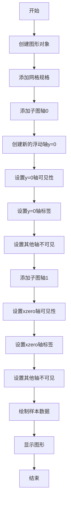

## 类结构

```
matplotlib.pyplot (matplotlib模块)
├── figure (创建图形对象)
│   ├── add_gridspec (添加网格规格)
│   ├── add_subplot (添加子图轴)
│   └── show (显示图形)
└── axisartist (matplotlib工具包)
    ├── Axes (轴类)
    │   ├── new_floating_axis (创建新的浮动轴)
    │   └── toggle (切换轴可见性)
    └── AxesZero (轴零类)
```

## 全局变量及字段


### `fig`
    
The main figure object where all subplots are drawn.

类型：`matplotlib.pyplot.figure`
    


### `gs`
    
GridSpec object that defines the layout of the subplots.

类型：`matplotlib.gridspec.GridSpec`
    


### `ax0`
    
The first subplot where the custom spine is drawn.

类型：`matplotlib.pyplot.Axes`
    


### `ax1`
    
The second subplot where the AxesZero spine is drawn.

类型：`matplotlib.pyplot.Axes`
    


### `x`
    
The x-axis data for the plot.

类型：`numpy.ndarray`
    


### `{'name': 'matplotlib.pyplot.figure', 'fields': ['figsize', 'layout'], 'methods': ['add_gridspec', 'add_subplot', 'show']}.figsize`
    
The size of the figure in inches.

类型：`tuple`
    


### `{'name': 'matplotlib.pyplot.figure', 'fields': ['figsize', 'layout'], 'methods': ['add_gridspec', 'add_subplot', 'show']}.layout`
    
The layout of the figure.

类型：`str`
    


### `{'name': 'matplotlib.pyplot.Axes', 'fields': ['axes_class'], 'methods': ['new_floating_axis', 'toggle', 'set_visible', 'label.set_text']}.axes_class`
    
The class used to create the axes object in the figure.

类型：`matplotlib.axisartist.axislines.Axes`
    


### `np`
    
The NumPy module, providing support for large, multi-dimensional arrays and matrices, along with a large library of high-level mathematical functions to operate on these arrays.

类型：`numpy`
    


### `matplotlib.pyplot.figure.figsize`
    
The size of the figure in inches.

类型：`tuple`
    


### `matplotlib.pyplot.figure.layout`
    
The layout of the figure.

类型：`str`
    


### `matplotlib.pyplot.Axes.axes_class`
    
The class used to create the axes object in the figure.

类型：`matplotlib.axisartist.axislines.Axes`
    
    

## 全局函数及方法


### plt.figure

创建一个新的图形窗口。

参数：

- `figsize`：`tuple`，图形的宽度和高度。
- `layout`：`str`，图形的布局方式。

返回值：`Figure`，图形对象。

#### 流程图

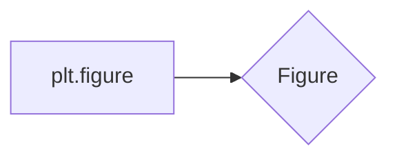

#### 带注释源码

```python
fig = plt.figure(figsize=(6, 3), layout="constrained")
```

### fig.add_gridspec

添加一个网格规格。

参数：

- `fig`：`Figure`，图形对象。
- `ncols`：`int`，列数。
- `nrows`：`int`，行数。

返回值：`GridSpec`，网格规格对象。

#### 流程图

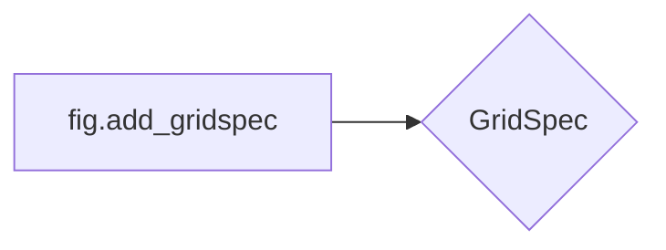

#### 带注释源码

```python
gs = fig.add_gridspec(1, 2)
```

### fig.add_subplot

添加一个子图。

参数：

- `fig`：`Figure`，图形对象。
- `gridspec`：`GridSpec`，网格规格对象。
- `axes_class`：`class`，子图类。

返回值：`Axes`，子图对象。

#### 流程图

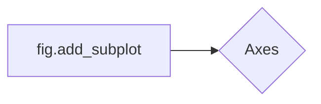

#### 带注释源码

```python
ax0 = fig.add_subplot(gs[0, 0], axes_class=axisartist.Axes)
```

### ax0.axis["y=0"]

创建一个新的浮动轴。

参数：

- `ax0`：`Axes`，子图对象。
- `"y=0"`：`str`，轴的名称。

返回值：`Axis`，轴对象。

#### 流程图

```mermaid
graph LR
A[ax0.axis["y=0"]] --> B{Axis}
```

#### 带注释源码

```python
ax0.axis["y=0"] = ax0.new_floating_axis(nth_coord=0, value=0,
                                        axis_direction="bottom")
```

### ax0.axis["y=0"].toggle

切换轴的可见性。

参数：

- `ax0.axis["y=0"]`：`Axis`，轴对象。

#### 流程图

```mermaid
graph LR
A[ax0.axis["y=0"].toggle] --> B{可见性}
```

#### 带注释源码

```python
ax0.axis["y=0"].toggle(all=True)
```

### ax0.axis["y=0"].label.set_text

设置轴标签的文本。

参数：

- `ax0.axis["y=0"]`：`Axis`，轴对象。
- `text`：`str`，标签文本。

#### 流程图

```mermaid
graph LR
A[ax0.axis["y=0"].label.set_text] --> B{标签文本}
```

#### 带注释源码

```python
ax0.axis["y=0"].label.set_text("y = 0")
```

### ax0.axis["bottom", "top", "right"].set_visible

设置轴的可见性。

参数：

- `ax0.axis["bottom", "top", "right"]`：`Axis`，轴对象。
- `False`：`bool`，可见性。

#### 流程图

```mermaid
graph LR
A[ax0.axis["bottom", "top", "right"].set_visible] --> B{可见性}
```

#### 带注释源码

```python
ax0.axis["bottom", "top", "right"].set_visible(False)
```

### ax1.axis["xzero"].set_visible

设置轴的可见性。

参数：

- `ax1.axis["xzero"]`：`Axis`，轴对象。
- `True`：`bool`，可见性。

#### 流程图

```mermaid
graph LR
A[ax1.axis["xzero"].set_visible] --> B{可见性}
```

#### 带注释源码

```python
ax1.axis["xzero"].set_visible(True)
```

### ax1.axis["xzero"].label.set_text

设置轴标签的文本。

参数：

- `ax1.axis["xzero"]`：`Axis`，轴对象。
- `text`：`str`，标签文本。

#### 流程图

```mermaid
graph LR
A[ax1.axis["xzero"].label.set_text] --> B{标签文本}
```

#### 带注释源码

```python
ax1.axis["xzero"].label.set_text("Axis Zero")
```

### ax1.axis["bottom", "top", "right"].set_visible

设置轴的可见性。

参数：

- `ax1.axis["bottom", "top", "right"]`：`Axis`，轴对象。
- `False`：`bool`，可见性。

#### 流程图

```mermaid
graph LR
A[ax1.axis["bottom", "top", "right"].set_visible] --> B{可见性}
```

#### 带注释源码

```python
ax1.axis["bottom", "top", "right"].set_visible(False)
```

### np.arange

生成一个数组。

参数：

- `start`：`float`，起始值。
- `stop`：`float`，结束值。
- `step`：`float`，步长。

返回值：`ndarray`，数组。

#### 流程图

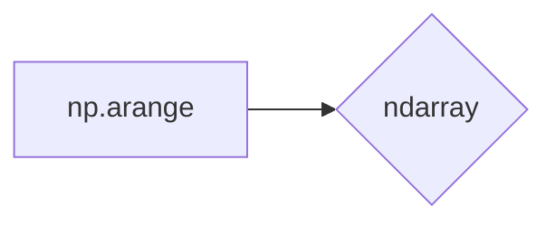

#### 带注释源码

```python
x = np.arange(0, 2*np.pi, 0.01)
```

### ax0.plot

绘制曲线。

参数：

- `ax0`：`Axes`，子图对象。
- `x`：`ndarray`，x坐标。
- `np.sin(x)`：`ndarray`，y坐标。

#### 流程图

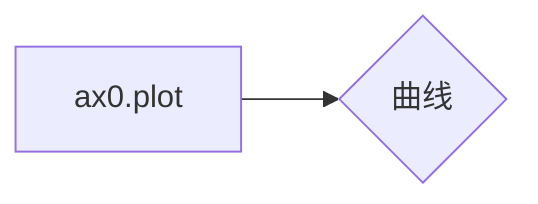

#### 带注释源码

```python
ax0.plot(x, np.sin(x))
```

### ax1.plot

绘制曲线。

参数：

- `ax1`：`Axes`，子图对象。
- `x`：`ndarray`，x坐标。
- `np.sin(x)`：`ndarray`，y坐标。

#### 流程图


#### 带注释源码

```python
ax1.plot(x, np.sin(x))
```

### plt.show

显示图形。

参数：

- `plt`：`module`，matplotlib模块。

#### 流程图

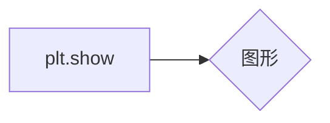

#### 带注释源码

```python
plt.show()
```


### plt.figure

`plt.figure` 是 Matplotlib 库中的一个函数，用于创建一个新的图形窗口。

参数：

- `figsize`：`tuple`，图形的宽度和高度，单位为英寸。
- `layout`：`str`，图形的布局方式，默认为 "constrained"。

返回值：`Figure`，表示创建的图形对象。

#### 流程图

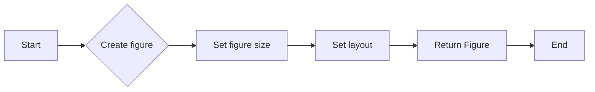

#### 带注释源码

```python
fig = plt.figure(figsize=(6, 3), layout="constrained")
```


### fig.add_gridspec

`fig.add_gridspec` 是一个用于创建网格规格（GridSpec）的函数，它允许用户在matplotlib中创建复杂的布局。

参数：

- `ncols`：`int`，指定列数。
- `nrows`：`int`，指定行数。
- `width_ratios`：`list`，指定每列的宽度比例。
- `height_ratios`：`list`，指定每行的宽度比例。
- `wspace`：`float`，指定列之间的空白比例。
- `hspace`：`float`，指定行之间的空白比例。

返回值：`GridSpec` 对象，用于创建子图。

#### 流程图

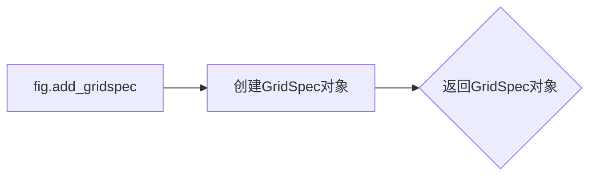

#### 带注释源码

```python
gs = fig.add_gridspec(1, 2)
# 创建一个1行2列的GridSpec对象
```


### fig.add_subplot

`fig.add_subplot` 是一个用于创建子图的方法，它允许用户指定子图的位置和布局。

参数：

- `gs`：`GridSpec` 对象，指定子图的位置和布局。
- `axes_class`：`Axes` 类的子类，用于创建子图。

返回值：`Axes` 对象，表示创建的子图。

#### 流程图

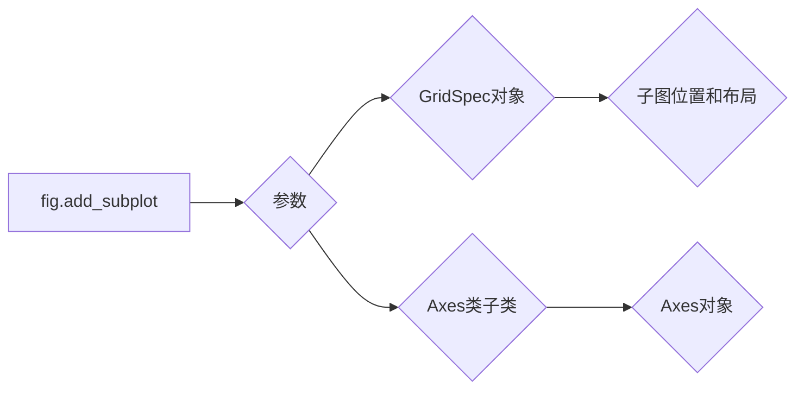

#### 带注释源码

```python
fig = plt.figure(figsize=(6, 3), layout="constrained")
gs = fig.add_gridspec(1, 2)

ax0 = fig.add_subplot(gs[0, 0], axes_class=axisartist.Axes)
# Make a new axis along the first (x) axis which passes through y=0.
ax0.axis["y=0"] = ax0.new_floating_axis(nth_coord=0, value=0,
                                        axis_direction="bottom")
ax0.axis["y=0"].toggle(all=True)
ax0.axis["y=0"].label.set_text("y = 0")
# Make other axis invisible.
ax0.axis["bottom", "top", "right"].set_visible(False)
```


### GridSpec

`GridSpec` 是一个用于定义子图布局的对象。

参数：

- `fig`：`Figure` 对象，表示当前图。
- `ncols`：列数。
- `nrows`：行数。

返回值：`GridSpec` 对象。

#### 流程图

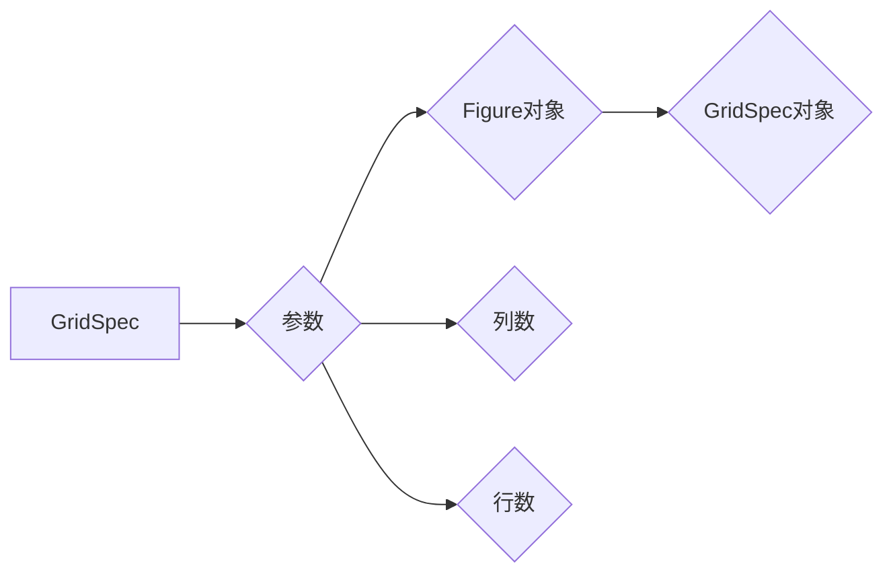

#### 带注释源码

```python
gs = fig.add_gridspec(1, 2)
```


### Axes

`Axes` 是一个用于绘制图形的对象。

参数：

- `fig`：`Figure` 对象，表示当前图。
- `spec`：`GridSpec` 对象或位置元组，指定子图的位置。

返回值：`Axes` 对象。

#### 流程图

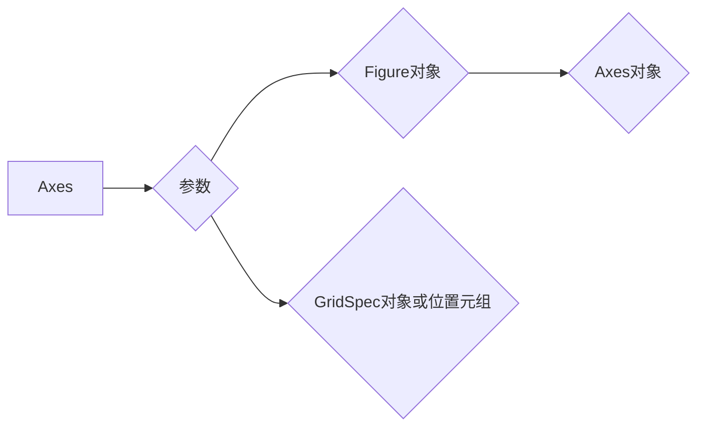

#### 带注释源码

```python
ax0 = fig.add_subplot(gs[0, 0], axes_class=axisartist.Axes)
```


### axisartist.Axes

`axisartist.Axes` 是 `Axes` 的一个子类，它提供了更高级的轴绘制功能。

参数：

- `fig`：`Figure` 对象，表示当前图。
- `spec`：`GridSpec` 对象或位置元组，指定子图的位置。

返回值：`Axes` 对象。

#### 流程图

```mermaid
graph LR
A[axisartist.Axes] --> B{参数}
B --> C{Figure对象}
B --> D{GridSpec对象或位置元组}
C --> E{Axes对象}
```

#### 带注释源码

```python
ax0 = fig.add_subplot(gs[0, 0], axes_class=axisartist.Axes)
```


### axisartist.axislines.AxesZero

`axisartist.axislines.AxesZero` 是 `Axes` 的一个子类，它提供了自动设置零轴的功能。

参数：

- `fig`：`Figure` 对象，表示当前图。
- `spec`：`GridSpec` 对象或位置元组，指定子图的位置。

返回值：`Axes` 对象。

#### 流程图

```mermaid
graph LR
A[axisartist.axislines.AxesZero] --> B{参数}
B --> C{Figure对象}
B --> D{GridSpec对象或位置元组}
C --> E{Axes对象}
```

#### 带注释源码

```python
ax1 = fig.add_subplot(gs[0, 1], axes_class=axisartist.axislines.AxesZero)
```


### new_floating_axis

`new_floating_axis` 是 `Axes` 类的一个方法，用于创建一个浮动轴。

参数：

- `nth_coord`：整数，指定轴的坐标。
- `value`：浮点数，指定轴的值。
- `axis_direction`：字符串，指定轴的方向。

返回值：`Spine` 对象。

#### 流程图

```mermaid
graph LR
A[new_floating_axis] --> B{参数}
B --> C{整数}
B --> D{浮点数}
B --> E{字符串}
C --> F{Spine对象}
```

#### 带注释源码

```python
ax0.axis["y=0"] = ax0.new_floating_axis(nth_coord=0, value=0,
                                        axis_direction="bottom")
```


### toggle

`toggle` 是 `Spine` 类的一个方法，用于切换轴的可见性。

参数：

- `all`：布尔值，指定是否切换所有轴的可见性。

#### 流程图

```mermaid
graph LR
A[toggle] --> B{参数}
B --> C{布尔值}
```

#### 带注释源码

```python
ax0.axis["y=0"].toggle(all=True)
```


### set_visible

`set_visible` 是 `Spine` 类的一个方法，用于设置轴的可见性。

参数：

- `visible`：布尔值，指定轴的可见性。

#### 流程图

```mermaid
graph LR
A[set_visible] --> B{参数}
B --> C{布尔值}
```

#### 带注释源码

```python
ax0.axis["bottom", "top", "right"].set_visible(False)
```


### label.set_text

`set_text` 是 `Label` 类的一个方法，用于设置标签的文本。

参数：

- `text`：字符串，指定标签的文本。

#### 流程图

```mermaid
graph LR
A[label.set_text] --> B{参数}
B --> C{字符串}
```

#### 带注释源码

```python
ax0.axis["y=0"].label.set_text("y = 0")
```


### plot

`plot` 是 `Axes` 类的一个方法，用于绘制图形。

参数：

- `x`：数组，表示 x 轴的数据。
- `y`：数组，表示 y 轴的数据。

#### 流程图

```mermaid
graph LR
A[plot] --> B{参数}
B --> C{数组}
B --> D{数组}
```

#### 带注释源码

```python
ax0.plot(x, np.sin(x))
ax1.plot(x, np.sin(x))
```


### show

`show` 是 `Figure` 类的一个方法，用于显示图形。

#### 流程图

```mermaid
graph LR
A[show] --> B{无参数}
```

#### 带注释源码

```python
plt.show()
```


### 关键组件信息

- `fig`：`Figure` 对象，表示当前图。
- `gs`：`GridSpec` 对象，用于定义子图布局。
- `ax0`：`Axes` 对象，表示第一个子图。
- `ax1`：`Axes` 对象，表示第二个子图。
- `x`：数组，表示 x 轴的数据。
- `y`：数组，表示 y 轴的数据。


### 潜在的技术债务或优化空间

- 代码中使用了 `axisartist` 库，该库可能不是所有用户都熟悉，可以考虑使用更通用的库。
- 代码中使用了 `np.arange` 来生成 x 轴数据，可以考虑使用更简洁的方法，例如 `np.linspace`。
- 代码中使用了 `np.sin` 来生成 y 轴数据，可以考虑使用更简洁的方法，例如 `np.sin(np.linspace(0, 2*np.pi, 100))`。


### 设计目标与约束

- 设计目标是创建一个包含两个子图的图形，其中一个子图具有特殊的 y 轴。
- 约束是使用 `matplotlib` 库来创建图形。


### 错误处理与异常设计

- 代码中没有显式的错误处理和异常设计，因为 `matplotlib` 库通常能够处理大多数常见的错误情况。


### 数据流与状态机

- 数据流：用户输入数据，代码生成图形。
- 状态机：代码从创建图开始，然后创建子图，最后显示图形。


### 外部依赖与接口契约

- 外部依赖：`matplotlib` 和 `numpy` 库。
- 接口契约：`matplotlib` 提供了创建图形和子图的方法，`numpy` 提供了数值计算的方法。
```


### ax0.axis["y=0"]

该函数创建并配置了一个新的浮动轴，该轴位于y=0的位置。

参数：

- `nth_coord`：`int`，指定轴的坐标位置。
- `value`：`float`，指定轴的值，这里为0。
- `axis_direction`：`str`，指定轴的方向，这里为"bottom"。

返回值：`None`，该函数不返回任何值。

#### 流程图

```mermaid
graph LR
A[Start] --> B{Create floating axis}
B --> C[Set axis position and direction]
C --> D[Set visibility and label]
D --> E[End]
```

#### 带注释源码

```python
ax0.axis["y=0"] = ax0.new_floating_axis(nth_coord=0, value=0,
                                        axis_direction="bottom")
ax0.axis["y=0"].toggle(all=True)
ax0.axis["y=0"].label.set_text("y = 0")
```


### ax1.axis["xzero"].set_visible(True)

该函数用于设置轴线的可见性。

参数：

- `True`：布尔类型，表示设置轴线可见。

返回值：无

#### 流程图

```mermaid
graph LR
A[Set Visibility] --> B{Is Visible?}
B -- Yes --> C[End]
B -- No --> D[Set Visible]
D --> C
```

#### 带注释源码

```python
# Set the visibility of the xzero axis to True
ax1.axis["xzero"].set_visible(True)
```


### np.arange

`np.arange` 是 NumPy 库中的一个函数，用于生成一个沿指定范围的数组。

参数：

- `start`：`int`，数组的起始值。
- `stop`：`int`，数组的结束值（不包括此值）。
- `step`：`int`，步长，默认为 1。

返回值：`numpy.ndarray`，一个沿指定范围生成的数组。

#### 流程图

```mermaid
graph LR
A[Start] --> B{Is step positive?}
B -- Yes --> C[Calculate next value]
B -- No --> D[Calculate next value]
C --> E[Is stop reached?]
D --> E
E -- Yes --> F[End]
E -- No --> C
```

#### 带注释源码

```python
import numpy as np

def np_arange(start, stop=None, step=1):
    """
    Generate an array of numbers.

    Parameters:
    - start: The starting value of the array.
    - stop: The ending value of the array (exclusive).
    - step: The step between each number in the array.

    Returns:
    - numpy.ndarray: An array of numbers.
    """
    if stop is None:
        stop = start
    if step == 0:
        raise ValueError("Step cannot be zero.")
    if step < 0:
        start, stop, step = stop, start, -step
    return np.arange(start, stop, step)
```


### plt.show()

显示当前图形。

参数：

- 无

返回值：无

#### 流程图

```mermaid
graph LR
A[开始] --> B{调用plt.show()}
B --> C[结束]
```

#### 带注释源码

```python
plt.show()
```


### 关键组件信息

- `plt.show()`：显示当前图形的函数。


### 潜在的技术债务或优化空间

- 代码中没有明显的技术债务或优化空间，因为`plt.show()`是Matplotlib库中用于显示图形的标准函数。


### 设计目标与约束

- 设计目标是使用Matplotlib库显示图形。
- 约束是必须使用Matplotlib库，并且图形需要正确显示。


### 错误处理与异常设计

- 代码中没有显示的错误处理或异常设计，因为`plt.show()`是一个简单的函数调用，通常不会引发异常。


### 数据流与状态机

- 数据流：代码中首先创建图形和轴，然后绘制数据，最后调用`plt.show()`显示图形。
- 状态机：代码中没有状态机，因为它是线性执行的。


### 外部依赖与接口契约

- 外部依赖：Matplotlib库。
- 接口契约：`plt.show()`函数的接口契约是显示当前图形。


```mermaid
graph LR
A[开始] --> B{调用plt.show()}
B --> C[结束]
```
```python
plt.show()
```


### `add_gridspec`

`add_gridspec` 方法用于在 `matplotlib.pyplot.figure` 对象中添加一个 `GridSpec` 对象，该对象用于定义子图的位置和大小。

参数：

- `ncols`：`int`，指定列数。
- `nrows`：`int`，指定行数。
- `width_ratios`：`sequence`，指定列宽比例。
- `height_ratios`：`sequence`，指定行高比例。
- `wspace`：`float`，指定列之间的空白比例。
- `hspace`：`float`，指定行之间的空白比例。

返回值：`GridSpec` 对象，用于定义子图的位置和大小。

#### 流程图

```mermaid
graph LR
A[Start] --> B{Add GridSpec}
B --> C[Create GridSpec Object]
C --> D[Return GridSpec Object]
D --> E[End]
```

#### 带注释源码

```python
fig = plt.figure(figsize=(6, 3), layout="constrained")
gs = fig.add_gridspec(1, 2)
```

在这个例子中，`add_gridspec` 方法被调用来创建一个 `GridSpec` 对象，指定了1行2列的布局，并存储在 `gs` 变量中。


### `add_subplot`

`add_subplot` 方法用于向 `Figure` 对象中添加一个 `Axes` 对象。

参数：

- `gridspec`：`GridSpec` 对象，定义了子图的位置和大小。
- `axes_class`：`Axes` 类的子类，用于创建子图。默认为 `matplotlib.axes.Axes`。

返回值：`Axes` 对象，表示添加的子图。

#### 流程图

```mermaid
graph LR
A[Start] --> B{Pass parameters}
B --> C{Create Axes}
C --> D[Return Axes]
D --> E[End]
```

#### 带注释源码

```python
# 创建 Figure 对象
fig = plt.figure(figsize=(6, 3), layout="constrained")

# 创建 GridSpec 对象
gs = fig.add_gridspec(1, 2)

# 使用 add_subplot 方法添加子图
ax0 = fig.add_subplot(gs[0, 0], axes_class=axisartist.Axes)
```


### plt.show()

显示matplotlib图形。

参数：

- 无

返回值：无

#### 流程图

```mermaid
graph LR
A[开始] --> B{调用plt.show()}
B --> C[结束]
```

#### 带注释源码

```python
plt.show()
```


### matplotlib.pyplot.Axes.new_floating_axis

This method creates a new floating axis on a matplotlib Axes object.

参数：

- `nth_coord`：`int`，The index of the coordinate to create the axis for. For example, 0 for the x-axis, 1 for the y-axis, etc.
- `value`：`float`，The value of the coordinate where the axis will be placed.
- `axis_direction`：`str`，The direction of the axis, which can be "top", "bottom", "left", "right", "in", or "out".

返回值：`matplotlib.spines.Spine`，The created floating axis as a Spine object.

#### 流程图

```mermaid
graph LR
A[Start] --> B[Create new floating axis]
B --> C[Set nth_coord]
C --> D[Set value]
D --> E[Set axis_direction]
E --> F[Return Spine]
F --> G[End]
```

#### 带注释源码

```python
ax0.axis["y=0"] = ax0.new_floating_axis(nth_coord=0, value=0,
                                        axis_direction="bottom")
```

In this line of code, a new floating axis is created for the y-coordinate with `nth_coord=0` (y-axis), `value=0` (y=0), and `axis_direction="bottom"`. The resulting Spine object is then assigned to `ax0.axis["y=0"]`.


### matplotlib.pyplot.Axes.toggle

`toggle` is a method of the `Axes` class in `matplotlib.pyplot` that toggles the visibility of the axis spines.

参数：

- `all`：`bool`，If `True`, toggle visibility of all spines. If `False`, toggle visibility of the spines specified by the `spine_names` parameter.

返回值：`None`，This method does not return any value.

#### 流程图

```mermaid
graph LR
A[Start] --> B{Is all True?}
B -- Yes --> C[Toggle all spines]
B -- No --> D{Are spine names specified?}
D -- Yes --> E[Toggle specified spines]
D -- No --> F[Toggle default spines]
F --> G[End]
```

#### 带注释源码

```python
# Toggle visibility of the spine at y=0
ax0.axis["y=0"].toggle(all=True)
```

In this code snippet, the `toggle` method is called on the spine at `y=0` with `all=True`, which means that all spines will be toggled to their opposite visibility state. The spine at `y=0` will become visible if it was previously invisible, and vice versa.


### matplotlib.pyplot.Axes.set_visible

`set_visible` 方法用于设置轴线的可见性。

参数：

- `visible`：`bool`，表示轴线的可见性。如果为 `True`，则轴线可见；如果为 `False`，则轴线不可见。

返回值：无

#### 流程图

```mermaid
graph LR
A[开始] --> B{设置可见性参数}
B --> C{参数为True?}
C -- 是 --> D[轴线可见]
C -- 否 --> E[轴线不可见]
E --> F[结束]
D --> F
```

#### 带注释源码

```python
# 假设 ax 是一个 Axes 对象
ax.axis["y=0"].set_visible(False)  # 将 y=0 轴线设置为不可见
```


### matplotlib.pyplot.Axes.label.set_text

设置轴标签的文本。

参数：

- `text`：`str`，要设置的标签文本。
- `**kwargs`：`dict`，传递给 `set_text` 方法的其他关键字参数。

返回值：无

#### 流程图

```mermaid
graph LR
A[Start] --> B{Set text}
B --> C[End]
```

#### 带注释源码

```python
# 设置轴标签的文本
ax0.axis["y=0"].label.set_text("y = 0")
```

在这段代码中，`ax0.axis["y=0"].label.set_text("y = 0")` 调用了 `set_text` 方法，将 `y=0` 轴的标签设置为 "y = 0"。这里没有使用到 `**kwargs` 参数，因此它被省略了。


### `AxesZero.set_visible`

`AxesZero.set_visible` 方法用于设置轴线的可见性。

参数：

- `visible`：`bool`，设置轴线的可见性。

返回值：无

#### 流程图

```mermaid
graph LR
A[开始] --> B{设置可见性}
B --> C[结束]
```

#### 带注释源码

```python
# "xzero" and "yzero" default to invisible; make xzero axis visible.
ax1.axis["xzero"].set_visible(True)
```

在这段代码中，`set_visible(True)` 方法被调用来将 `xzero` 轴线的可见性设置为 `True`，使其可见。


### `AxesZero.label.set_text`

设置轴标签的文本。

参数：

- `text`：`str`，要设置的标签文本。

返回值：无

#### 流程图

```mermaid
graph LR
A[调用 .label.set_text] --> B{设置文本}
B --> C[完成]
```

#### 带注释源码

```python
# Make a new axis along the first (x) axis which passes through y=0.
ax0.axis["y=0"] = ax0.new_floating_axis(nth_coord=0, value=0,
                                        axis_direction="bottom")
# ...
# Set the label text for the custom spine.
ax0.axis["y=0"].label.set_text("y = 0")
```


## 关键组件


### 张量索引与惰性加载

张量索引与惰性加载是用于高效处理大型数据集的关键组件，它允许在需要时才计算数据，从而节省内存和提高性能。

### 反量化支持

反量化支持是用于将量化后的数据转换回原始数据类型的功能，这对于在量化模型中恢复精确度至关重要。

### 量化策略

量化策略是用于确定如何将浮点数数据转换为固定点数表示的方法，这对于减少模型大小和提高推理速度至关重要。


## 问题及建议


### 已知问题

-   **代码重复性**：在 `ax0` 和 `ax1` 中，存在重复的代码用于设置轴的可见性和标签。这可以通过将设置逻辑提取到一个函数中或使用继承来减少。
-   **代码可读性**：代码中使用了大量的魔术字符串（如 `"y=0"` 和 `"xzero"`），这可能会降低代码的可读性。使用更具描述性的变量名可以提高代码的可理解性。
-   **全局变量**：代码中使用了全局变量 `fig` 和 `gs`，这可能会在大型项目中导致命名冲突和难以维护的问题。

### 优化建议

-   **减少代码重复性**：创建一个函数来设置轴的可见性和标签，然后在需要的地方调用这个函数。
-   **提高代码可读性**：使用更具描述性的变量名来代替魔术字符串。
-   **避免全局变量**：将 `fig` 和 `gs` 作为参数传递给函数，而不是使用全局变量。
-   **代码注释**：添加注释来解释代码中复杂的逻辑，以提高代码的可读性和可维护性。
-   **代码测试**：编写单元测试来验证代码的功能，确保代码的稳定性和可靠性。
-   **性能优化**：检查代码中是否有性能瓶颈，例如不必要的计算或重复的绘图操作，并进行优化。


## 其它


### 设计目标与约束

- 设计目标：实现一个使用matplotlib和axisartist库绘制自定义spines的示例。
- 约束条件：代码应简洁，易于理解，并遵循matplotlib和axisartist库的使用规范。

### 错误处理与异常设计

- 错误处理：代码中未包含显式的错误处理机制，但应确保所有外部库调用都遵循其错误处理规范。
- 异常设计：未预期到异常情况，但应确保在调用外部库时捕获并处理可能的异常。

### 数据流与状态机

- 数据流：代码中数据流简单，从numpy生成数据，通过matplotlib进行绘图。
- 状态机：代码中无状态机设计，整个流程为线性执行。

### 外部依赖与接口契约

- 外部依赖：代码依赖于matplotlib和numpy库。
- 接口契约：matplotlib和numpy库的API遵循其官方文档中的接口契约。


    