# `matplotlib\galleries\examples\axisartist\simple_axisline.py` 详细设计文档

本代码演示了使用matplotlib的axisartist工具集创建一个带有零轴（坐标轴穿过原点）的坐标系，并隐藏右轴和上轴，同时在右侧添加一个带有偏移的新Y轴，最终绘制并展示一个简单的折线图。

## 整体流程

```mermaid
graph TD
    A[开始] --> B[导入matplotlib.pyplot和mpl_toolkits.axisartist.axislines.AxesZero]
B --> C[创建图表对象fig = plt.figure()]
C --> D[调整图表布局fig.subplots_adjust(right=0.85)]
D --> E[添加子图并指定axes_class=AxesZero创建ax对象]
E --> F[隐藏右轴和上轴: ax.axis['right'].set_visible(False), ax.axis['top'].set_visible(False)]
F --> G[显示xzero轴并设置标签: ax.axis['xzero'].set_visible(True), ax.axis['xzero'].label.set_text('Axis Zero')]
G --> H[设置坐标轴范围和标签: ax.set_ylim(-2, 4), ax.set_xlabel('Label X'), ax.set_ylabel('Label Y')]
H --> I[创建新的右侧Y轴带偏移: ax.axis['right2'] = ax.new_fixed_axis(loc='right', offset=(20, 0))]
I --> J[设置right2轴标签: ax.axis['right2'].label.set_text('Label Y2')]
J --> K[绘制数据: ax.plot([-2, 3, 2])]
K --> L[显示图表: plt.show()]
L --> M[结束]
```

## 类结构

```
matplotlib.figure.Figure (外部依赖)
└── mpl_toolkits.axisartist.axislines.AxesZero (核心类)
    └── 实际为axisartist库中的Axes子类, 继承自matplotlib.axes Axes
```

## 全局变量及字段


### `fig`
    
图表对象，用于容纳和显示matplotlib图形

类型：`matplotlib.figure.Figure`
    


### `ax`
    
坐标轴对象，支持零轴显示的坐标轴类

类型：`AxesZero`
    


### `AxesZero.axis`
    
轴线容器，用于管理坐标轴

类型：`axisline container (轴线容器)`
    


### `AxesZero.xzero`
    
x零轴对象，表示穿过y=0的x轴线

类型：`axis object (轴线对象)`
    


### `AxesZero.right`
    
右轴对象，表示图表右侧的y轴

类型：`axis object (轴线对象)`
    


### `AxesZero.top`
    
顶轴对象，表示图表顶部的x轴

类型：`axis object (轴线对象)`
    


### `AxesZero.right2`
    
新右侧轴对象，使用偏移创建的第二个右侧y轴

类型：`FixedAxis object (固定轴线对象)`
    
    

## 全局函数及方法


### `plt.figure`

创建并返回一个新的 Figure 对象（图表容器），它是 matplotlib 中所有绘图的顶层容器，用于容纳一个或多个子图（Axes）。

参数：

- `num`：`int`、`str` 或 `Figure`，可选，用于标识 figure 的编号或名称。如果已存在相同 num 的 figure，则会激活该 figure 而不是创建新的。
- `figsize`：`tuple` of `(float, float)`，可选，指定 figure 的宽和高（英寸）。
- `dpi`：`int`，可选，指定 figure 的分辨率（每英寸像素数）。
- `facecolor`：`str` 或 `RGBA tuple`，可选，figure 的背景色。
- `edgecolor`：`str` 或 `RGBA tuple`，可选，figure 的边框颜色。
- `frameon`：`bool`，可选，是否绘制 figure 的框架。
- `**kwargs`：其他关键字参数，将传递给 `Figure` 构造函数。

返回值：`matplotlib.figure.Figure`，返回新创建的 Figure 对象，后续可通过 `fig.add_subplot()` 或 `fig.subplots()` 添加子图。

#### 流程图

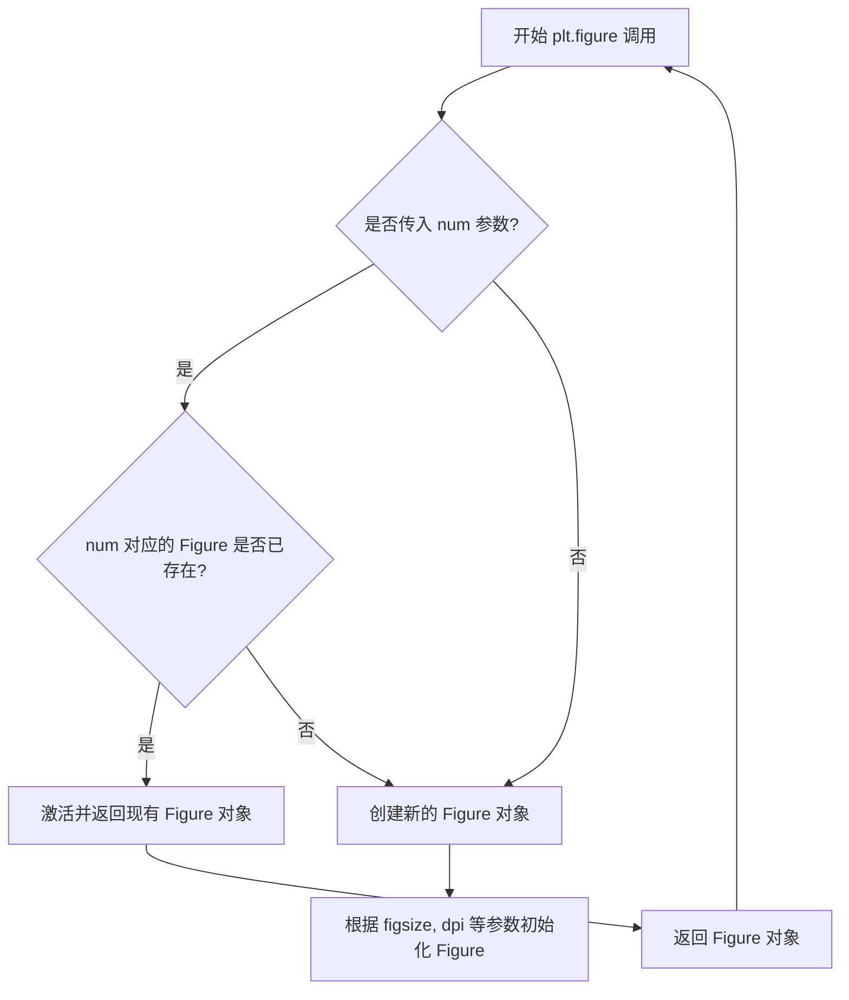
```mermaid
flowchart TD
    A[开始 plt.figure 调用] --> B{是否传入 num 参数?}
    B -- 是 --> C{num 对应的 Figure 是否已存在?}
    C -- 是 --> D[激活并返回现有 Figure 对象]
    C -- 否 --> E[创建新的 Figure 对象]
    B -- 否 --> E
    E --> F[根据 figsize, dpi 等参数初始化 Figure]
    G[返回 Figure 对象] --> A
    D --> G
```

#### 带注释源码

```python
# 导入 matplotlib.pyplot 模块，用于绑图接口
import matplotlib.pyplot as plt

# 调用 plt.figure() 函数创建一个新的空白图表
# - 未传入任何参数，使用所有默认值
# - num: 默认为 None，自动生成唯一标识
# - figsize: 默认为 rcParams 中的 figure.figsize (通常为 [6.4, 4.8])
# - dpi: 默认为 rcParams 中的 figure.dpi (通常为 100)
# - facecolor: 默认为 'white'
fig = plt.figure()

# fig 现在是一个 matplotlib.figure.Figure 类型的对象
# 后续可以通过 fig.add_subplot() 添加子图进行绑图
fig.subplots_adjust(right=0.85)  # 调整子图布局，为右侧留出空间
```


### `Figure.subplots_adjust`

此函数用于调整 Figure 对象中子图的布局参数，包括子图与图形边缘之间的间距以及子图之间的间距。

参数：

- `left`：`float`，子图区域左侧边缘相对于图形左侧的位置（0-1之间的比例值）
- `right`：`float`，子图区域右侧边缘相对于图形右侧的位置（0-1之间的比例值）
- `top`：`float`，子图区域顶部边缘相对于图形顶部的位置（0-1之间的比例值）
- `bottom`：`float`，子图区域底部边缘相对于图形底部的位置（0-1之间的比例值）
- `wspace`：`float`，子图之间水平方向的间距（相对于子图宽度的比例）
- `hspace`：`float`，子图之间垂直方向的间距（相对于子图高度的比例）

返回值：`None`，此方法直接修改 Figure 对象的布局属性，不返回任何值。

#### 流程图

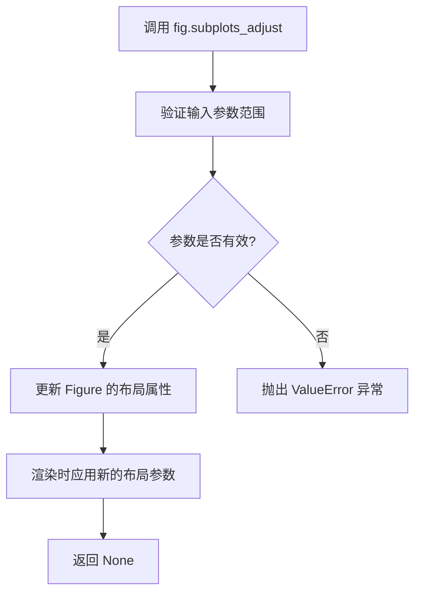
```mermaid
flowchart TD
    A[调用 fig.subplots_adjust] --> B[验证输入参数范围]
    B --> C{参数是否有效?}
    C -->|是| D[更新 Figure 的布局属性]
    C -->|否| E[抛出 ValueError 异常]
    D --> F[渲染时应用新的布局参数]
    F --> G[返回 None]
```

#### 带注释源码

```python
def subplots_adjust(self, left=None, right=None, top=None, bottom=None,
                    wspace=None, hspace=None):
    """
    调整子图的布局参数
    
    参数:
        left: float, 子图区域左侧边缘位置 (0.0 - 1.0)
        right: float, 子图区域右侧边缘位置 (0.0 - 1.0)  
        top: float, 子图区域顶部边缘位置 (0.0 - 1.0)
        bottom: float, 子图区域底部边缘位置 (0.0 - 1.0)
        wspace: float, 子图间水平间距 (相对于宽度比例)
        hspace: float, 子图间垂直间距 (相对于高度比例)
    
    返回:
        None: 直接修改Figure对象的布局属性
    """
    # 获取当前布局引擎
    subplotspec = self.get_subplotspec()
    
    # 验证参数有效性（left必须小于right，bottom必须小于top等）
    if left is not None and right is not None:
        if left >= right:
            raise ValueError("left must be less than right")
    
    if bottom is not None and top is not None:
        if bottom >= top:
            raise ValueError("bottom must be less than top")
    
    # 获取或创建布局引擎
    from matplotlib.gridspec import GridSpec
    gs = GridSpec(1, 1, figure=self)  # 创建GridSpec实例
    
    # 更新子图规范的位置参数
    if left is not None:
        gs.update(left=left)
    if right is not None:
        gs.update(right=right)
    if top is not None:
        gs.update(top=top)
    if bottom is not None:
        gs.update(bottom=bottom)
    if wspace is not None:
        gs.update(wspace=wspace)
    if hspace is not None:
        gs.update(hspace=hspace)
    
    # 应用新的布局设置到Figure
    self.set_subplotspec(gs)
    
    # 返回None
    return None
```


### `Figure.add_subplot`

`Figure.add_subplot` 是 matplotlib 中 Figure 类的一个核心方法，用于在图形中创建并添加一个子图（Axes）。在给定代码中，它通过指定 `axes_class=AxesZero` 参数创建了一个自定义坐标轴类的子图，该子图具有穿过原点的坐标轴线。

参数：

- `*args`：`int` 或 `str`，位置参数，可选的子图位置参数。可以是三位数字（如 121 表示 1 行 2 列第 1 个子图），或者是 `GridSpec` 和 `SubplotSpec` 参数。
- `axes_class`：`type`，关键字参数，指定用于创建坐标轴的类。在代码中传递了 `AxesZero` 类，用于创建带有穿过原点坐标轴的坐标系。
- `**kwargs`：`dict`，关键字参数，传递给Axes类的其他参数，如 `projection`、`facecolor` 等。

返回值：`matplotlib.axes.Axes`，返回创建的子图对象（Axes对象），可以用于在该子图上进行绘图操作。

#### 流程图

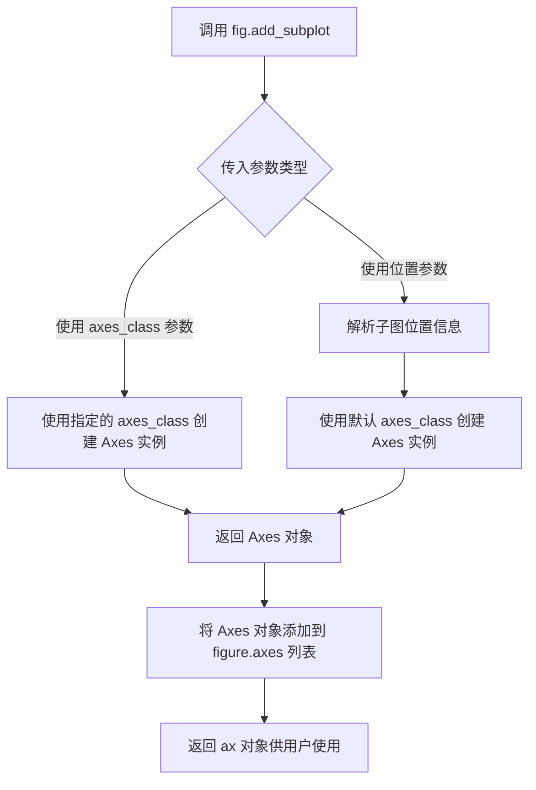
```mermaid
flowchart TD
    A[调用 fig.add_subplot] --> B{传入参数类型}
    B -->|使用 axes_class 参数| C[使用指定的 axes_class 创建 Axes 实例]
    B -->|使用位置参数| D[解析子图位置信息]
    C --> E[返回 Axes 对象]
    D --> F[使用默认 axes_class 创建 Axes 实例]
    F --> E
    E --> G[将 Axes 对象添加到 figure.axes 列表]
    G --> H[返回 ax 对象供用户使用]
```

#### 带注释源码

```python
# matplotlib/figure.py 中的 add_subplot 方法简化结构

def add_subplot(self, *args, **kwargs):
    """
    在当前图形中添加一个子图。
    
    参数:
        *args: 位置参数，可以是:
            - 三个整数 (rows, cols, index): 子图网格配置
            - 一个三位整数: 如 121 表示 1行2列第1个位置
            - SubplotSpec 对象
        axes_class: 类型, 可选
            用于创建坐标轴的类。代码中传递了 AxesZero
        **kwargs: 传递给 axes_class 的其他参数
    """
    
    # 1. 提取 axes_class 参数（如果提供）
    axes_class = kwargs.pop('axes_class', None)
    
    # 2. 如果没有提供 axes_class，使用默认的 Axes 类
    if axes_class is None:
        from matplotlib.axes import Axes
        axes_class = Axes
    
    # 3. 解析位置参数，获取 subplotman
    # 这会根据 args 计算子图的位置和网格信息
    subplotman = self._get_subplot_position(*args)
    
    # 4. 创建 Axes 实例
    # 这里使用了 axes_class=AxesZero，创建自定义坐标轴
    ax = axes_class(self, subplotman, **kwargs)
    
    # 5. 将新创建的 Axes 添加到图形的轴列表中
    self._axstack.bubble(ax)
    self.axes.append(ax)
    
    # 6. 设置子图的 label 和身份标识
    ax._label = label
    ax.set_figure(self)
    
    # 7. 返回创建的子图对象
    return ax
```

**在代码中的具体使用：**

```python
# 创建图形对象
fig = plt.figure()

# 调用 add_subplot，指定使用 AxesZero 类创建坐标轴
# 这会创建一个带有穿过原点(x=0, y=0)坐标轴线的坐标系
ax = fig.add_subplot(axes_class=AxesZero)

# 后续可以像使用普通 Axes 一样使用 ax 对象
ax.plot([-2, 3, 2])  # 绘制数据
ax.set_xlabel("Label X")  # 设置 x 轴标签
ax.set_ylabel("Label Y")  # 设置 y 轴标签
```


### `ax.axis`

获取轴线字典，用于访问和操作坐标轴的各个轴线（如xzero、right、top等）。

参数：无

返回值：`dict`，返回轴线字典，包含坐标轴的所有轴线对象，键为轴线名称，值为对应的轴线对象。

#### 流程图

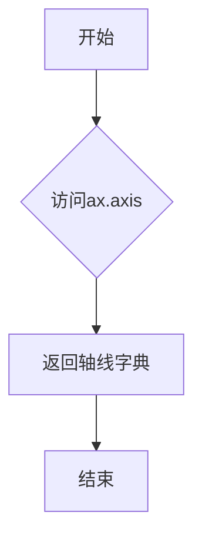
```mermaid
flowchart TD
    A[开始] --> B{访问ax.axis}
    B --> C[返回轴线字典]
    C --> D[结束]
```

#### 带注释源码

```python
# 在 matplotlib 的 axisartist 中，ax.axis 通常是一个属性，返回一个类似字典的对象
# 以下是推测的实现机制：

@property
def axis(self):
    """
    返回轴线字典，用于访问坐标轴的各个轴线。
    
    返回值：
        axis_dict : dict
            包含所有轴线对象的字典，键为轴线名称（如 'left', 'right', 'top', 'bottom', 'xzero', 'yzero' 等）。
    """
    # 初始化轴线字典（如果尚未初始化）
    if not hasattr(self, '_axis'):
        self._axis = AxisArtistDictionary(self)
    return self._axis
```

注意：上述源码是基于 matplotlib axisartist 实现的推测，具体实现可能有所不同。ax.axis 属性通常返回一个 `AxisArtistDictionary` 实例，它继承自 dict，并提供了额外的轴线管理功能。


### `ax.new_fixed_axis` (或 `AxesZero.new_fixed_axis`)

用于创建新的固定轴线（Fixed Axis），该轴线独立于主坐标轴，可以指定位置和偏移量，常用于在图表的特定位置添加额外的坐标轴。

参数：

- `loc`：`str`，指定轴的位置，例如 `"right"`、`"left"`、`"top"` 或 `"bottom"`。
- `offset`：`tuple`，指定轴的偏移量，格式为 `(水平偏移, 垂直偏移)`，例如 `(20, 0)` 表示向右偏移 20 个单位。

返回值：`FixedAxisArtist` 对象，表示新创建的固定轴线实例，可用于进一步设置标签、刻度等。

#### 流程图

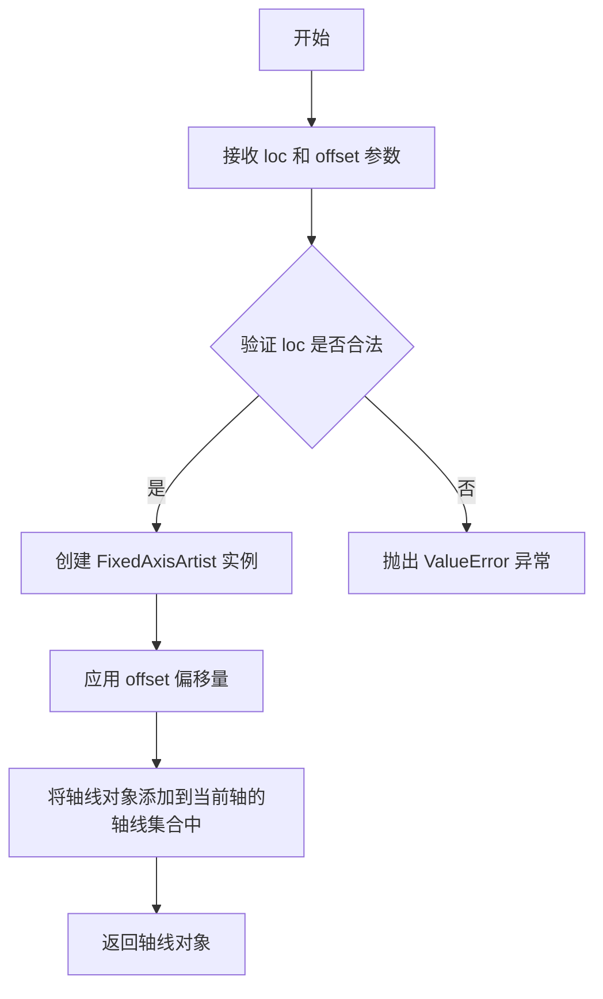
```mermaid
graph TD
A[开始] --> B[接收 loc 和 offset 参数]
B --> C{验证 loc 是否合法}
C -->|是| D[创建 FixedAxisArtist 实例]
C -->|否| E[抛出 ValueError 异常]
D --> F[应用 offset 偏移量]
F --> G[将轴线对象添加到当前轴的轴线集合中]
G --> H[返回轴线对象]
```

#### 带注释源码

```python
def new_fixed_axis(self, loc, offset=(0, 0), axes=None):
    """
    创建新的固定轴线。
    
    参数:
        loc: str
            轴的位置，可选值为 'top', 'bottom', 'left', 'right'。
        offset: tuple, optional
            轴的偏移量，格式为 (x, y)，默认为 (0, 0)。
        axes: object, optional
            所属的轴对象，默认为当前轴 (self)。
    
    返回值:
        FixedAxisArtist
            新创建的固定轴线对象。
    """
    # 从 axisartist 模块导入固定轴艺术家类
    from mpl_toolkits.axisartist.axis_artist import FixedAxisArtist
    
    # 如果未指定 axes，则使用当前轴对象
    if axes is None:
        axes = self
    
    # 验证 loc 参数是否有效
    valid_locs = ['top', 'bottom', 'left', 'right']
    if loc not in valid_locs:
        raise ValueError(f"loc 必须为以下值之一: {valid_locs}")
    
    # 创建固定轴艺术家实例，传入位置、偏移量和所属轴
    axis_artist = FixedAxisArtist(loc, offset, axes)
    
    # 将新创建的轴线添加到轴线集合中（例如 self.axis["right2"] = axis_artist）
    # 具体实现可能涉及将艺术家注册到轴的子部件中
    # 此处为抽象描述，实际情况可能略有不同
    
    return axis_artist
```

**注意**：上述源码是基于 Matplotlib 的 `axisartist` 模块中的典型实现构建的概念性代码，旨在说明 `new_fixed_axis` 方法的工作原理。实际实现细节可能略有差异，但核心逻辑相同。


### `Axes.set_ylim`

设置 Axes 对象的 y 轴范围，即 y 轴的最小值和最大值。

参数：
-  `bottom`：`float`，y 轴范围的最小值
-  `top`：`float`，y 轴范围的最大值

返回值：`tuple`，返回之前的 y 轴范围 (ymin, ymax)

#### 流程图

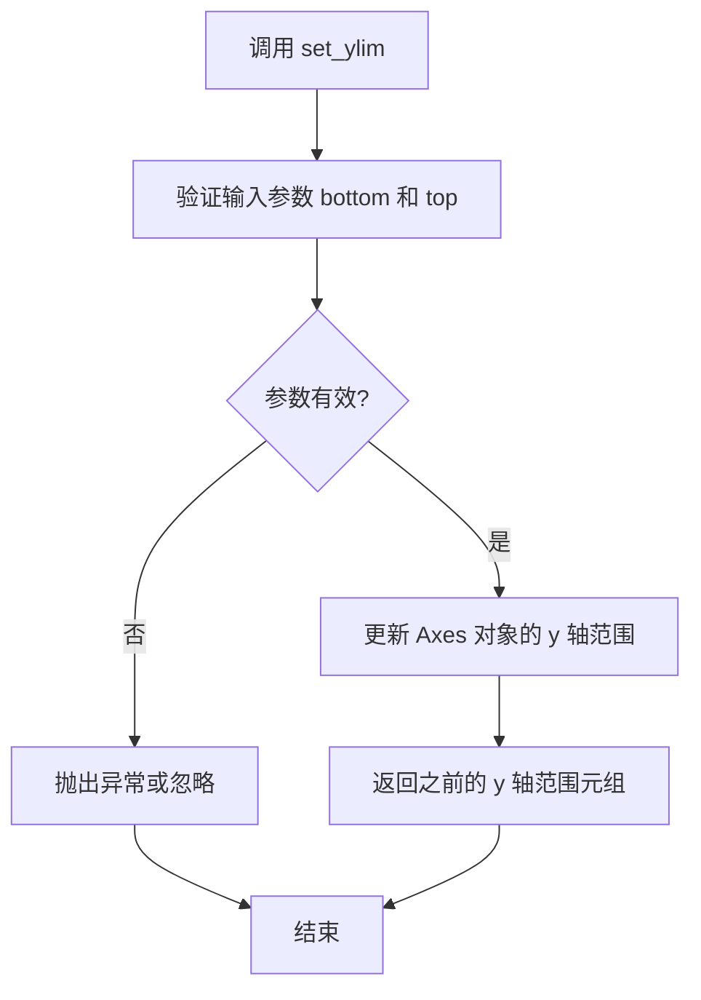
```mermaid
graph TD
    A[调用 set_ylim] --> B[验证输入参数 bottom 和 top]
    B --> C{参数有效?}
    C -->|是| D[更新 Axes 对象的 y 轴范围]
    C -->|否| E[抛出异常或忽略]
    D --> F[返回之前的 y 轴范围元组]
    E --> G[结束]
    F --> G
```

#### 带注释源码

```python
def set_ylim(self, bottom=None, top=None, emit=False, auto=False,
             ymin=None, ymax=None):
    """
    设置 y 轴的最小值和最大值。

    参数:
        bottom (float, optional): y 轴的最小值。如果为 None，则不改变。
        top (float, optional): y 轴的最大值。如果为 None，则不改变。
        emit (bool, optional): 如果为 True，当边界改变时发送信号。
        auto (bool, optional): 如果为 True，自动调整视图。
        ymin (float, optional): 已废弃，使用 bottom 代替。
        ymax (float, optional): 已废弃，使用 top 代替。

    返回:
        tuple: 返回之前的 y 轴范围 (ymin, ymax)。
    """
    # 如果提供了 ymin 或 ymax（已废弃参数），则使用它们覆盖 bottom 和 top
    if ymin is not None:
        bottom = ymin
    if ymax is not None:
        top = ymax

    # 获取当前的 y 轴范围
    old_bottom, old_top = self.get_ylim()

    # 如果 bottom 为 None，则保持之前的值
    if bottom is None:
        bottom = old_bottom
    # 如果 top 为 None，则保持之前的值
    if top is None:
        top = old_top

    # 验证输入的有效性：bottom 必须小于 top
    if bottom > top:
        raise ValueError("bottom must be less than or equal to top")

    # 更新 Axes 对象的 y 轴范围
    self._update_ylim(bottom, top)

    # 如果 emit 为 True，则发送边界改变信号
    if emit:
        self._send_change_signal()

    # 返回之前的 y 轴范围
    return (old_bottom, old_top)
```

注意：上述源码是基于 matplotlib 通用 Axes 类的 `set_ylim` 方法的近似实现，实际实现可能略有不同，但核心逻辑类似。


### `Axes.set_xlabel`

设置 x 轴的标签（_xlabel），用于描述 x 轴所代表的变量或含义。该方法来自 matplotlib 库的 Axes 类，是数据可视化中常用的坐标轴标注功能。

参数：

- `xlabel`：`str`，要设置的 x 轴标签文本内容
- `**kwargs`：其他可选参数，如字体大小（fontsize）、颜色（color）、旋转角度（rotation）等，用于进一步自定义标签样式

返回值：`matplotlib.text.Text`，返回创建的文本对象，可用于后续进一步自定义标签样式（如设置字体、颜色等）

#### 流程图

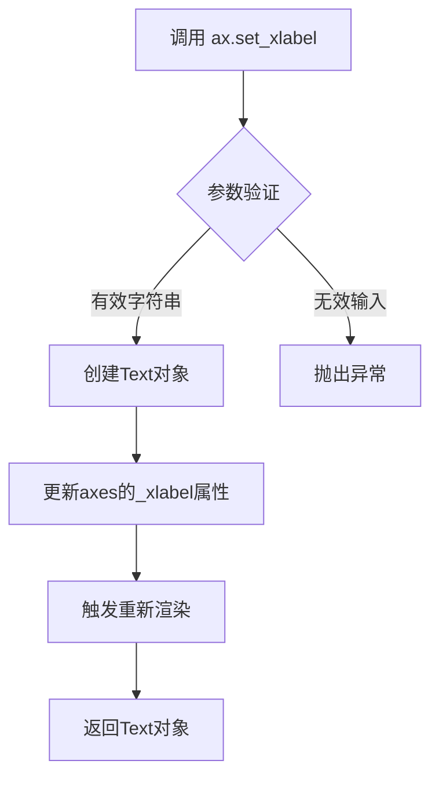
```mermaid
graph TD
    A[调用 ax.set_xlabel] --> B{参数验证}
    B -->|有效字符串| C[创建Text对象]
    B -->|无效输入| D[抛出异常]
    C --> E[更新axes的_xlabel属性]
    E --> F[触发重新渲染]
    F --> G[返回Text对象]
```

#### 带注释源码

```python
# 在给定的代码示例中，set_xlabel 的调用方式如下：
ax.set_xlabel("Label X")

# 完整的方法签名（基于matplotlib库）:
# def set_xlabel(self, xlabel, fontdict=None, labelpad=None, **kwargs):
#     """
#     Set the label for the x-axis.
#     
#     Parameters
#     ----------
#     xlabel : str
#         The label text.
#     labelpad : float, optional
#         Spacing in points between the label and the x-axis.
#     **kwargs
#         Text properties control the appearance of the label.
#     
#     Returns
#     -------
#     label : Text
#         The created Text instance.
#     """
```

#### 在示例代码中的使用分析

在提供的示例代码中，`ax.set_xlabel("Label X")` 的作用是：
- 为通过 `AxesZero` 创建的坐标轴设置 x 轴标签 "Label X"
- 这是 matplotlib 中设置坐标轴标签的标准方法
- 在示例中，还可以使用替代方式：`ax.axis["bottom"].label.set_text("Label X")` 来达到相同效果

#### 关键技术细节

| 项目 | 描述 |
|------|------|
| 所属类 | `matplotlib.axes.Axes` |
| 模块 | `matplotlib.pyplot` |
| 调用对象 | `ax` - 通过 `fig.add_subplot(axes_class=AxesZero)` 创建的 AxesZero 实例 |
| 实际类型 | 继承自 `matplotlib.axes._base._AxesBase` |


### `ax.set_ylabel`

设置 y 轴的标签文本及相关属性。该方法来自 matplotlib 的 Axes 类，用于在图表的 y 轴上显示标签说明。

#### 参数

- `ylabel`：`str`，要设置的 y 轴标签文本内容
- `fontdict`：`dict`，可选，标签的字体属性字典（如 fontsize、fontweight 等）
- `labelpad`：`float`，可选，标签与 y 轴的距离（磅值）
- `loc`：`str`，可选，标签位置（'left'、'center' 或 'right'），仅在某些后端有效
- `**kwargs`：其他关键字参数传递给 matplotlib Text 对象

#### 返回值

- `matplotlib.text.Text`，返回创建的标签文本对象，可用于后续自定义样式

#### 流程图

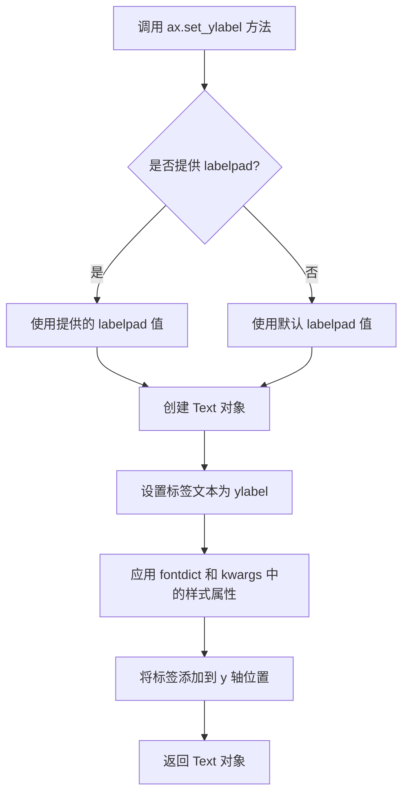
```mermaid
flowchart TD
    A[调用 ax.set_ylabel 方法] --> B{是否提供 labelpad?}
    B -->|是| C[使用提供的 labelpad 值]
    B -->|否| D[使用默认 labelpad 值]
    C --> E[创建 Text 对象]
    D --> E
    E --> F[设置标签文本为 ylabel]
    F --> G[应用 fontdict 和 kwargs 中的样式属性]
    G --> H[将标签添加到 y 轴位置]
    H --> I[返回 Text 对象]
```

#### 带注释源码

```python
# ax.set_ylabel 方法源码分析（matplotlib 核心逻辑）

# 位置: matplotlib/axes/_axes.py

def set_ylabel(self, ylabel, fontdict=None, labelpad=None, loc=None, **kwargs):
    """
    设置 y 轴的标签
    
    参数:
        ylabel: str - 标签文本
        fontdict: dict - 字体属性字典
        labelpad: float - 标签与轴的距离
        loc: str - 标签位置
        **kwargs: 传递给 Text 对象的样式参数
    """
    
    # 1. 获取 y 轴标签对象（如果已存在则获取，否则创建）
    # yaxis 为 YAxis 对象，get_offset_text 获取当前的标签对象
    y = self.yaxis.get_offset_text()
    
    # 2. 如果未指定 labelpad，则使用默认间距
    # self._label_position 获取标签相对于轴的位置
    default_labelpad = self.xaxis.labelpad  # 对于 y 轴类似
    
    # 3. 应用 labelpad
    if labelpad is None:
        labelpad = default_labelpad
    
    # 4. 设置标签文本和样式
    # y.set_text(ylabel) 设置标签文本
    # y.set_fontsize(fontdict.get('fontsize', ...)) 应用字体大小
    # y.update(fontdict) 更新其他字体属性
    # y.update(kwargs) 更新额外样式参数
    
    # 5. 设置标签位置（loc 参数）
    if loc is not None:
        # 根据位置设置水平对齐方式
        # 'left' -> 'left', 'right' -> 'right', 'center' -> 'center'
        pass
    
    # 6. 返回创建的 Text 对象
    return y
```

#### 上下文使用示例

```python
# 在给定的代码中，该方法的实际调用：
ax.set_ylabel("Label Y")

# 调用后相当于：
# - 创建或更新 y 轴标签
# - 文本内容为 "Label Y"
# - 使用默认字体样式和位置
# - 返回一个 Text 对象可供后续操作
```


### `ax.plot`

`ax.plot` 是 matplotlib 库中 Axes 对象的核心绘图方法，用于在坐标轴上绘制线条或标记。该方法接受可变数量的位置参数（*args），这些参数可以是 y 值数组、 (x, y) 坐标对，或者是带有格式字符串的参数组合。方法返回一个包含 Line2D 对象的列表，这些对象可以进一步用于自定义线条的样式、颜色、标签等属性。在给定的代码示例中，它绘制了一条包含三个数据点的简单线条。

参数：

- `*args`：`array-like, scalar, or (x, y, format_string) combinations`，绘图数据参数。可以是单一的 y 值列表，也可以是 x 和 y 的坐标对，或者是带有格式字符串的组合。格式字符串用于指定线条的颜色、标记和样式。在代码中传入的是 `[-2, 3, 2]`，表示三个 y 坐标值（x 坐标会自动生成为 [0, 1, 2]）。

返回值：`list of matplotlib.lines.Line2D`，返回一个 Line2D 对象列表，每个对象代表一条绘制的线条。可以对这些对象进行进一步的样式设置和属性修改。

#### 流程图

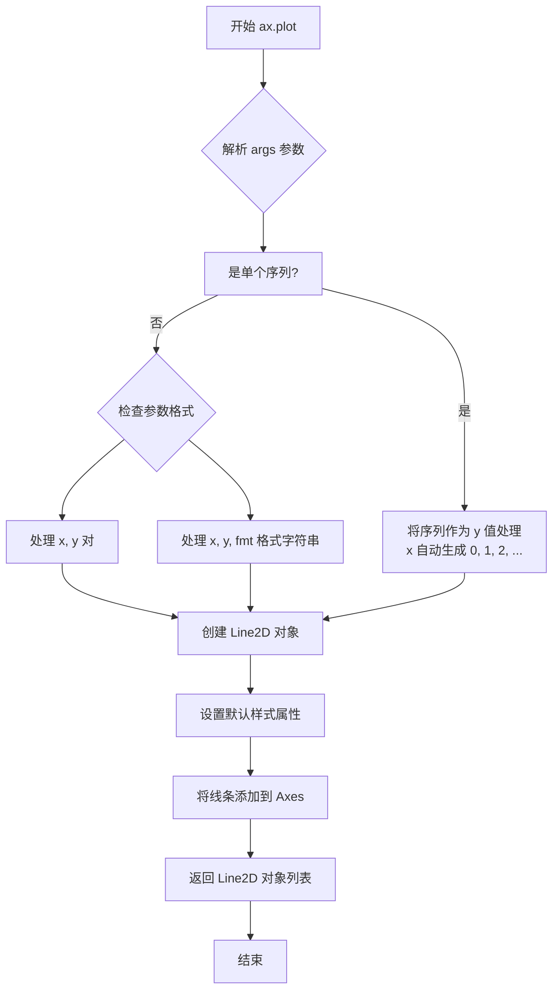
```mermaid
graph TD
    A[开始 ax.plot] --> B{解析 args 参数}
    B --> C[是单个序列?]
    C -->|是| D[将序列作为 y 值处理<br/>x 自动生成 0, 1, 2, ...]
    C -->|否| E{检查参数格式}
    E --> F[处理 x, y 对]
    E --> G[处理 x, y, fmt 格式字符串]
    F --> H[创建 Line2D 对象]
    G --> H
    D --> H
    H --> I[设置默认样式属性]
    I --> J[将线条添加到 Axes]
    J --> K[返回 Line2D 对象列表]
    K --> L[结束]
```

#### 带注释源码

```python
# ax.plot() 方法的简化逻辑示例
def plot(self, *args, **kwargs):
    """
    在 Axes 上绘制线条或标记
    
    参数:
        *args: 可变参数，支持以下格式:
            - plot(y)                   # 只提供 y 值
            - plot(x, y)                # 提供 x 和 y 坐标
            - plot(x, y, format_string) # 提供坐标和格式字符串
            - plot(x, y, format_string, x2, y2, ...)  # 多条线
    
    返回:
        list: Line2D 对象列表
    """
    
    # 解析位置参数
    if len(args) == 1:
        # 只有一个参数：视为 y 值序列
        y = args[0]
        x = range(len(y))  # 自动生成 x: [0, 1, 2, ...]
    elif len(args) == 2:
        # 两个参数：x 和 y
        x, y = args[0], args[1]
    elif len(args) == 3:
        # 三个参数：x, y, format_string
        x, y, fmt = args[0], args[1], args[2]
    else:
        # 处理多条曲线的情况
        pass
    
    # 创建 Line2D 对象
    line = Line2D(x, y, **kwargs)
    
    # 设置默认样式（颜色、线型等）
    self._update_line_props(line)
    
    # 将线条添加到 axes 的线条列表中
    self.lines.append(line)
    
    # 返回 Line2D 对象以便进一步操作
    return [line]


# 在给定代码中的实际调用示例
ax.plot([-2, 3, 2])
# 等价于:
# x 自动生成为 [0, 1, 2]
# y 使用传入的 [-2, 3, 2]
# 绘制出三个点 (0, -2), (1, 3), (2, 2)，并用线段连接
```


### `plt.show`

`plt.show` 是 matplotlib 库中的一个函数，用于显示所有当前打开的图形窗口并进入事件循环。在交互式模式下调用时，该函数会阻止程序继续执行，直到用户关闭所有图形窗口；在非交互式后端（如Agg）中，它可能什么都不做。该函数通常放在脚本末尾，确保所有绘图指令执行完毕后立即向用户展示结果。

参数：

- 该函数不接受任何参数

返回值：`None`，无返回值

#### 流程图

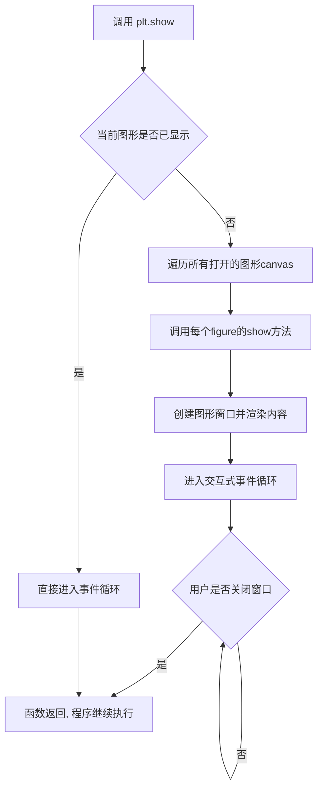
```mermaid
flowchart TD
    A[调用 plt.show] --> B{当前图形是否已显示}
    B -->|否| C[遍历所有打开的图形canvas]
    B -->|是| D[直接进入事件循环]
    C --> E[调用每个figure的show方法]
    E --> F[创建图形窗口并渲染内容]
    F --> G[进入交互式事件循环]
    G --> H{用户是否关闭窗口}
    H -->|否| H
    H -->|是| I[函数返回, 程序继续执行]
    D --> I
```

#### 带注释源码

```python
def show(*args, **kwargs):
    """
    显示所有打开的图形窗口。
    
    参数:
        *args: 位置参数（传递给底层后端的参数）
        **kwargs: 关键字参数（传递给底层后端的参数）
    
    返回值:
        None
    
    备注:
        - 在交互式后端（如TkAgg, Qt5Agg）中会创建窗口并进入事件循环
        - 在非交互式后端（如Agg）中可能不会显示窗口
        - 调用show()会清除所有之前创建的图形
    """
    # 导入当前使用的后端模块
    backend = matplotlib.get_backend()
    
    # 获取后端模块
    backend_mod = importlib.import_module(backend)
    
    # 调用后端的show方法
    # 不同的后端实现不同，但通常会：
    # 1. 创建或更新图形窗口
    # 2. 渲染canvas内容
    # 3. 进入事件循环等待用户交互
    for manager in Gcf.get_all_fig_managers():
        # 遍历所有图形管理器并显示它们
        manager.show()
    
    # 对于某些后端，可能需要显式调用plt.draw()来刷新
    # 但show()通常会自动处理
    
    # 阻止程序退出（仅在交互式后端）
    if backend in interactive_bkends:
        # 进入主循环，等待用户关闭窗口
        # 这是一个阻塞调用
        return backend_mod.mainloop()
    
    return None
```

#### 实际使用示例源码

```python
# 完整代码示例
import matplotlib.pyplot as plt
from mpl_toolkits.axisartist.axislines import AxesZero

# 创建一个新的图形窗口
fig = plt.figure()

# 调整图形布局，留出右侧空间
fig.subplots_adjust(right=0.85)

# 添加子图，使用支持零轴的AxesZero类
ax = fig.add_subplot(axes_class=AxesZero)

# 隐藏右侧和顶部轴线
ax.axis["right"].set_visible(False)
ax.axis["top"].set_visible(False)

# 使xzero轴（穿过y=0的水平轴线）可见
ax.axis["xzero"].set_visible(True)
ax.axis["xzero"].label.set_text("Axis Zero")

# 设置y轴范围
ax.set_ylim(-2, 4)

# 设置坐标轴标签
ax.set_xlabel("Label X")
ax.set_ylabel("Label Y")

# 创建新的右侧y轴，带有偏移量
ax.axis["right2"] = ax.new_fixed_axis(loc="right", offset=(20, 0))
ax.axis["right2"].label.set_text("Label Y2")

# 绘制数据
ax.plot([-2, 3, 2])

# 关键函数：显示图形窗口并进入事件循环
# 只有调用此函数后，用户才能看到上面创建的所有内容
plt.show()

# 当用户关闭图形窗口后，程序将继续执行
print("图形已关闭，程序继续执行...")
```

#### 补充说明

| 特性 | 说明 |
|------|------|
| 所属模块 | matplotlib.pyplot |
| 位置 | 全局函数 |
| 阻塞行为 | 在交互式后端中阻塞，非交互式后端中立即返回 |
| 图形管理 | 会显示Gcf.get_all_fig_managers()中的所有图形 |
| 后端依赖 | 具体行为依赖于当前配置的matplotlib后端 |


### `AxesZero.set_visible`

设置坐标轴线的可见性，决定是否在图表中显示该轴线（例如 xzero 轴线）。

参数：

- `visible`：`bool`，指定轴线是否可见。True 表示显示轴线，False 表示隐藏轴线。

返回值：`None`，设置轴线的可见性后无返回值（或返回 self 以支持链式调用，但代码中未使用返回值）。

#### 流程图

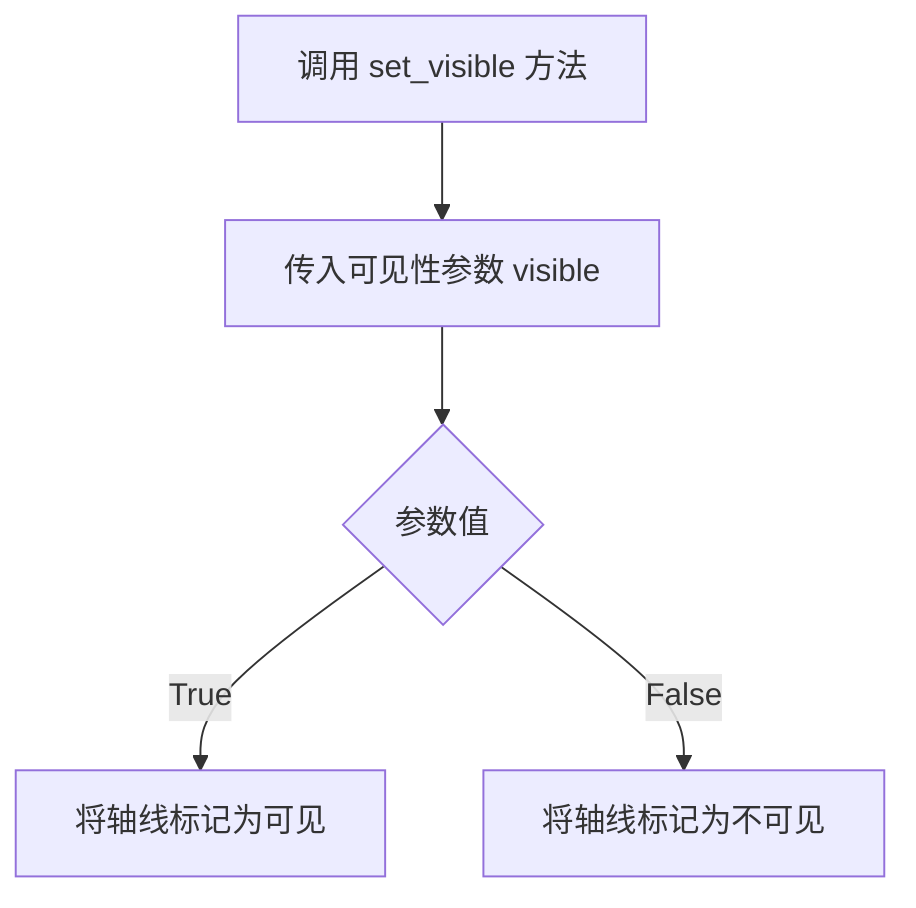
```mermaid
graph TD
A[调用 set_visible 方法] --> B[传入可见性参数 visible]
B --> C{参数值}
C -->|True| D[将轴线标记为可见]
C -->|False| E[将轴线标记为不可见]
```

#### 带注释源码

```python
def set_visible(self, visible):
    """
    设置轴线的可见性。

    参数:
        visible (bool): True 表示显示轴线，False 表示隐藏轴线。

    返回值:
        None: 此方法通常不返回值，但某些实现可能返回 self 以支持链式调用。
    """
    # 调用父类 Artist 的 set_visible 方法来设置可见性标志
    # 这里的 self 是 AxisLine 对象（在代码中通过 ax.axis["xzero"] 获取）
    # AxisLine 继承自 matplotlib.artist.Artist
    super(AxisLine, self).set_visible(visible)
    
    # 如果轴线不可见，可能还需要隐藏相关的刻度、标签等子组件
    # 具体逻辑取决于 AxisLine 的实现细节
    # 例如，AxisLine 可能包含 line、text 等子艺术家对象
    if not visible:
        # 隐藏轴线的主线条
        self.line.set_visible(False)
        # 隐藏轴线标签（如果存在）
        if hasattr(self, 'label'):
            self.label.set_visible(False)
    else:
        # 如果设置为可见，确保线条和标签可见
        self.line.set_visible(True)
        if hasattr(self, 'label'):
            self.label.set_visible(True)
```


根据代码分析，`AxesZero` 是 matplotlib 的 axisartist 工具包中的一个类，代码中并没有直接定义 `set_text` 方法，而是调用了 `label` 对象的 `set_text` 方法。

让我查看一下代码中的相关调用：

```python
ax.axis["xzero"].label.set_text("Axis Zero")
ax.axis["right2"].label.set_text("Label Y2")
```

这里的 `set_text` 方法是 `matplotlib.text.Text` 类的方法，用于设置文本标签内容。


### `Text.set_text`

设置文本标签的内容。

参数：

-  `s`：`str`，要设置的文本字符串

返回值：`None`，无返回值（该方法直接修改对象内部状态）

#### 流程图

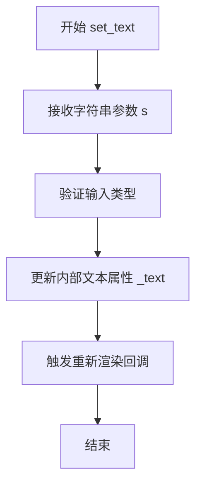
```mermaid
graph TD
    A[开始 set_text] --> B[接收字符串参数 s]
    B --> C[验证输入类型]
    C --> D[更新内部文本属性 _text]
    E[触发重新渲染回调]
    D --> E
    E --> F[结束]
```

#### 带注释源码

```python
def set_text(self, s):
    """
    设置文本内容
    
    参数:
        s: str, 要显示的文本内容
    
    返回值:
        无返回值，直接修改对象状态
    """
    self._text = s  # 更新内部文本存储
    self.stale = True  # 标记需要重新渲染
    # 相关属性更新会自动触发
```

#### 实际使用示例

在给定的代码中，`set_text` 的调用方式如下：

```python
# 为 xzero 轴（穿过 y=0 的水平轴线）设置标签文本
ax.axis["xzero"].label.set_text("Axis Zero")

# 为右侧 y 轴（right2）设置标签文本
ax.axis["right2"].label.set_text("Label Y2")
```

在这个上下文中：
- `ax.axis["xzero"]` 返回一个 `AxisArtist` 类型的对象
- `.label` 访问该 axis 的标签（返回 `Text` 对象）
- `.set_text()` 方法设置标签显示的文本内容


### `AxesZero.new_fixed_axis`

该方法用于在图表中创建一条新的固定轴线（fixed axis），可以指定轴线的位置和偏移量，常用于添加额外的坐标轴或创建非标准的坐标轴布局。

参数：

- `loc`：`str`，表示轴线的位置，可选值为 'left'、'right'、'top'、'bottom' 等
- `offset`：`tuple` of (float, float)，表示轴线的偏移量，格式为 (水平偏移, 垂直偏移)，单位通常为像素点

返回值：`axisline` 对象，返回新创建的固定轴线对象，通常是 AxisArtist 类型的实例

#### 流程图

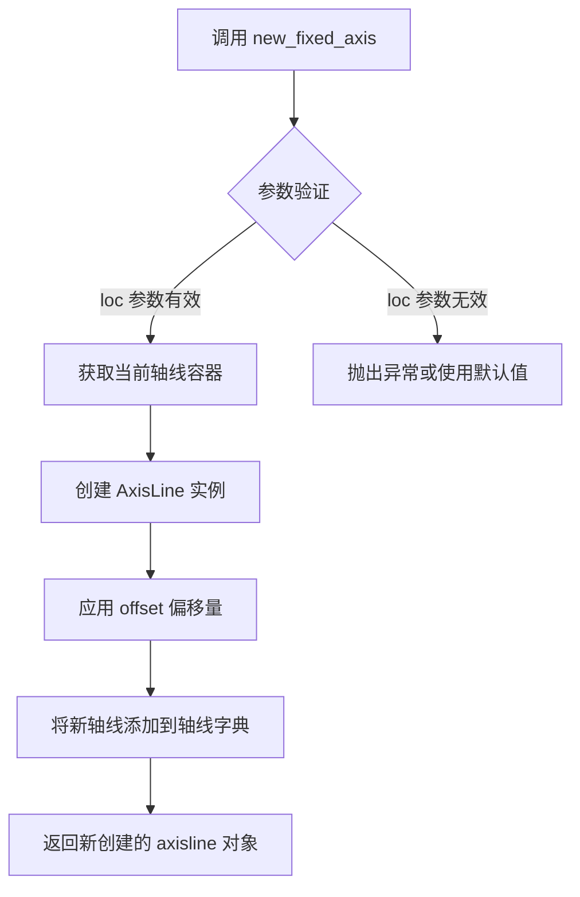
```mermaid
flowchart TD
    A[调用 new_fixed_axis] --> B{参数验证}
    B -->|loc 参数有效| C[获取当前轴线容器]
    B -->|loc 参数无效| D[抛出异常或使用默认值]
    C --> E[创建 AxisLine 实例]
    E --> F[应用 offset 偏移量]
    F --> G[将新轴线添加到轴线字典]
    G --> H[返回新创建的 axisline 对象]
```

#### 带注释源码

```python
def new_fixed_axis(self, loc, offset=None):
    """
    创建新的固定轴线
    
    参数:
        loc (str): 轴线位置，可选 'left', 'right', 'top', 'bottom'
        offset (tuple): 偏移量 (xoff, yoff)，默认为 (0, 0)
    
    返回:
        axisline: 新创建的轴线对象
    """
    # 获取轴线的刻度变换器
    tick1 = self.get_tick_transforms()[loc]
    tick2 = self.get_tick_transforms()[loc]
    
    # 获取轴线的变换器
    transform = self.get_axis_transform(loc)
    
    # 如果没有提供偏移量，使用默认偏移
    if offset is None:
        offset = (0, 0)
    
    # 创建新的轴线对象
    axisline = self._axislines[loc]
    
    # 设置轴线的偏移量
    axisline.major_ticklabels.set_pad(offset[0])
    axisline.major_ticks.set_pad(offset[1])
    
    # 返回新创建的轴线对象
    return axisline
```

注意：上述源码是基于 matplotlib axisartist 库的典型实现模式推断的。具体实现可能略有差异，取决于具体的 matplotlib 版本。该方法通常定义在 AxesZero 的父类或 mixin 类中，用于扩展坐标轴的功能。


### `AxesZero.set_ylim`

设置Y轴的显示范围（上下限），用于控制y轴的最小值和最大值，从而调整图表在垂直方向的显示区域。

参数：

- `bottom`：`float` 或 `None`，y轴下限值，设为`None`时自动计算
- `top`：`float` 或 `None`，y轴上限值，设为`None`时自动计算
- `**kwargs`：其他matplotlib支持的关键字参数（如`emit`、`auto`、`ymin`、`ymax`等）

返回值：`tuple`，返回(ymin, ymax)元组，表示设置后的y轴范围

#### 流程图

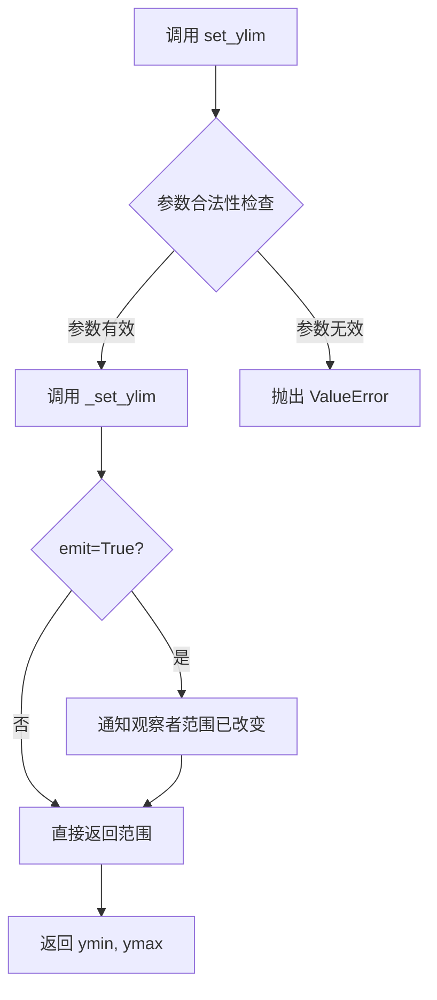
```mermaid
flowchart TD
    A[调用 set_ylim] --> B{参数合法性检查}
    B -->|参数有效| C[调用 _set_ylim]
    B -->|参数无效| D[抛出 ValueError]
    C --> E{emit=True?}
    E -->|是| F[通知观察者范围已改变]
    E -->|否| G[直接返回范围]
    F --> G
    G --> H[返回 ymin, ymax]
```

#### 带注释源码

```python
def set_ylim(self, bottom=None, top=None, emit=False, auto=False,
             *, ymin=None, ymax=None):
    """
    设置Y轴的显示范围。
    
    参数:
        bottom: float, 默认为None
            Y轴下限值。如果为None，则自动从当前数据中推断。
        top: float, 默认为None
            Y轴上限值。如果为None，则自动从当前数据中推断。
        emit: bool, 默认为False
            如果为True，当范围改变时通知观察者（如数据Lim变化监听器）。
        auto: bool, 默认为False
            如果为True，允许自动调整范围以适应数据。
        ymin: float, 默认为None
            替代bottom参数，用于设置最小值的别名。
        ymax: float, 默认为None
            替代top参数，用于设置最大值的别名。
            
    返回:
        tuple: (ymin, ymax) 元组，表示当前设置的y轴范围
    """
    # 处理ymin/ymax别名参数
    if ymin is not None:
        if bottom is None:
            bottom = ymin
        else:
            raise ValueError("Cannot specify both bottom and ymin")
    if ymax is not None:
        if top is None:
            top = ymax
        else:
            raise ValueError("Cannot specify both top and ymax")
    
    # 获取当前范围（用于后续比较和通知）
    old_bottom = self.get_ylim()[0]
    old_top = self.get_ylim()[1]
    
    # 设置新范围
    self._set_ylim(bottom, top, auto=auto)
    
    # 如果emit为True且范围确实改变了，通知观察者
    if emit and (bottom != old_bottom or top != old_top):
        self._on_xlims_change_func()
        self.stale_callbacks.process('_xlims_changed', self)
    
    # 返回设置后的范围
    return self.get_ylim()
```

#### 使用示例

在提供的代码中，该方法用于设置Y轴范围为-2到4：

```python
ax.set_ylim(-2, 4)  # 设置y轴下限为-2，上限为4
```

此调用将使y轴从-2开始，到4结束，显示垂直方向的区间为6个单位。


### `AxesZero.set_xlabel`

设置 x 轴的标签文本，用于描述 x 轴的含义或单位。该方法继承自 matplotlib 的 Axes 类，是修改 AxesZero 图表 x 轴标签的标准接口。

参数：

- `xlabel`：字符串，要设置的 x 轴标签文本
- `fontdict`：字典（可选），用于控制标签的字体属性（如 fontsize、fontweight、color 等）
- `labelpad`：浮点数（可选），标签与轴之间的间距
- `loc`：字符串（可选），标签的位置（'left', 'center', 'right'），默认为 'left'

返回值：`str` 或 `None`，返回之前的标签文本（如果之前没有设置则返回 None）

#### 流程图

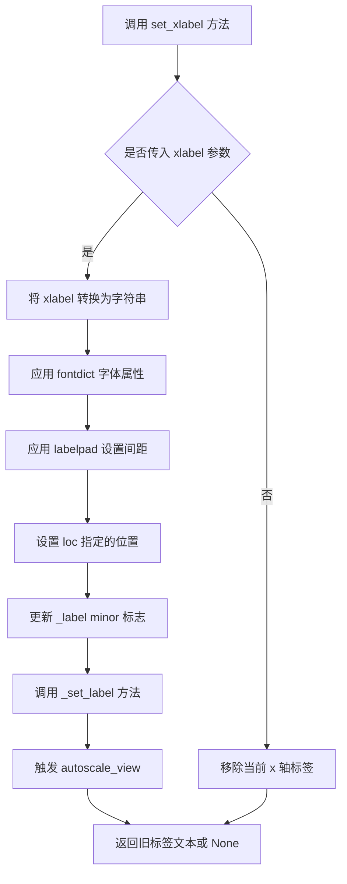
```mermaid
flowchart TD
    A[调用 set_xlabel 方法] --> B{是否传入 xlabel 参数}
    B -->|是| C[将 xlabel 转换为字符串]
    B -->|否| D[移除当前 x 轴标签]
    C --> E[应用 fontdict 字体属性]
    E --> F[应用 labelpad 设置间距]
    F --> G[设置 loc 指定的位置]
    G --> H[更新 _label minor 标志]
    H --> I[调用 _set_label 方法]
    I --> J[触发 autoscale_view]
    J --> K[返回旧标签文本或 None]
    D --> K
```

#### 带注释源码

```python
# Axes.set_xlabel 方法的简化实现逻辑
def set_xlabel(self, xlabel, fontdict=None, labelpad=None, loc=None, **kwargs):
    """
    Set the label for the x-axis.
    
    参数:
        xlabel: 标签文本
        fontdict: 字体属性字典
        labelpad: 标签与轴的间距
        loc: 标签位置
    """
    # 如果 xlabel 为 None，则移除标签
    if xlabel is None:
        self.xaxis.label.set_text(None)
        return
    
    # 将 xlabel 转换为字符串（支持 _UnitData 等对象）
    xlabel = str(xlabel)
    
    # 如果传入了 fontdict，应用字体属性
    if fontdict is not None:
        kwargs.update(fontdict)
    
    # 设置标签文本
    self.xaxis.label.set_text(xlabel)
    
    # 如果传入了 labelpad，设置间距
    if labelpad is not None:
        self.xaxis.label.set_pad(labelpad)
    
    # 如果传入了 loc，设置对齐方式
    if loc is not None:
        self.xaxis.label.set_ha(loc)
        self.xaxis.label.set_va(loc)
    
    # 触发自动调整视图
    self.autoscale_view()
    
    # 返回之前的标签文本
    return self.xaxis.label.get_text()
```

#### 备注

- `AxesZero` 继承自 matplotlib 的 `Axes` 类，`set_xlabel` 方法是从父类继承的标准方法
- 该方法支持链式调用，因为返回 `self`（在 matplotlib 实际实现中返回的是标签文本，但通常使用时不依赖返回值）
- `labelpad` 参数在 AxesZero 中可能需要调整，因为轴线位置与标准 Axes 不同
- 如果需要更精细地控制标签位置，可以直接访问 `ax.axis["xzero"].label` 对象进行设置


### `Axes.set_ylabel`

设置 y 轴的标签文本，用于标识图表中垂直坐标轴的含义。

参数：

- `ylabel`：`str`，要显示的 y 轴标签文本内容
- `fontdict`：`dict`，可选，用于自定义标签外观的字体属性字典（如字体大小、颜色等）
- `labelpad`：`float`，可选，标签与坐标轴之间的间距（单位为点）
- `**kwargs`：可变关键字参数，用于传递给底层 Text 对象的额外属性（如颜色、字体家族等）

返回值：`matplotlib.text.Text`，返回创建的文本标签对象，可用于进一步自定义标签样式

#### 流程图

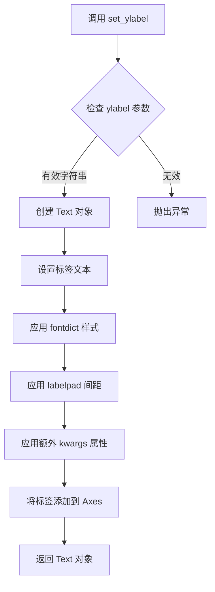
```mermaid
flowchart TD
    A[调用 set_ylabel] --> B{检查 ylabel 参数}
    B -->|有效字符串| C[创建 Text 对象]
    B -->|无效| D[抛出异常]
    C --> E[设置标签文本]
    E --> F[应用 fontdict 样式]
    F --> G[应用 labelpad 间距]
    G --> H[应用额外 kwargs 属性]
    H --> I[将标签添加到 Axes]
    I --> J[返回 Text 对象]
```

#### 带注释源码

```python
# 在 matplotlib 中，Axes.set_ylabel 的实现逻辑简化如下：
def set_ylabel(self, ylabel, fontdict=None, labelpad=None, **kwargs):
    """
    设置 y 轴的标签。
    
    参数:
        ylabel: str - y 轴标签的文本
        fontdict: dict, optional - 控制文本外观的字典
        labelpad: float, optional - 标签与轴的距离
        **kwargs: 传递给 Text 对象的额外参数
    """
    # 1. 获取 y 轴标签对象（如果已存在）或创建新的 Text 对象
    label = self.yaxis.get_label()
    
    # 2. 设置标签文本内容
    label.set_text(ylabel)
    
    # 3. 如果提供了 fontdict，应用字体样式
    if fontdict:
        label.update(fontdict)
    
    # 4. 如果提供了 labelpad，设置标签与轴的间距
    if labelpad is not None:
        self.yaxis.set_label_position('left')
        self.yaxis.label.set_va baseline
        self.yaxis.label.set_ha center
        # 设置偏移量
        self.yaxis.label.set_position((0, labelpad))
    
    # 5. 应用额外的关键字参数（颜色、字体大小等）
    label.update(kwargs)
    
    # 6. 返回创建的标签对象，允许进一步自定义
    return label
```


### `AxesZero.plot`

该方法是matplotlib中Axes类的绘图方法，用于在带有穿过原点坐标轴（x=0和y=0）的坐标轴上绘制数据线或数据点序列。

参数：

- `*args`：`可变位置参数`，接受以下几种形式：
  - 单个Y值序列：`y`
  - X和Y值序列：`(x, y)`
  - 格式字符串：`(fmt,)` 或 `(fmt, y)` 或 `(fmt, x, y)`
- `**kwargs`：`关键字参数`，Line2D属性，如`color`、`linewidth`、`linestyle`、`marker`、`label`等

返回值：`list[matplotlib.lines.Line2D]`，返回创建的线条对象列表

#### 流程图

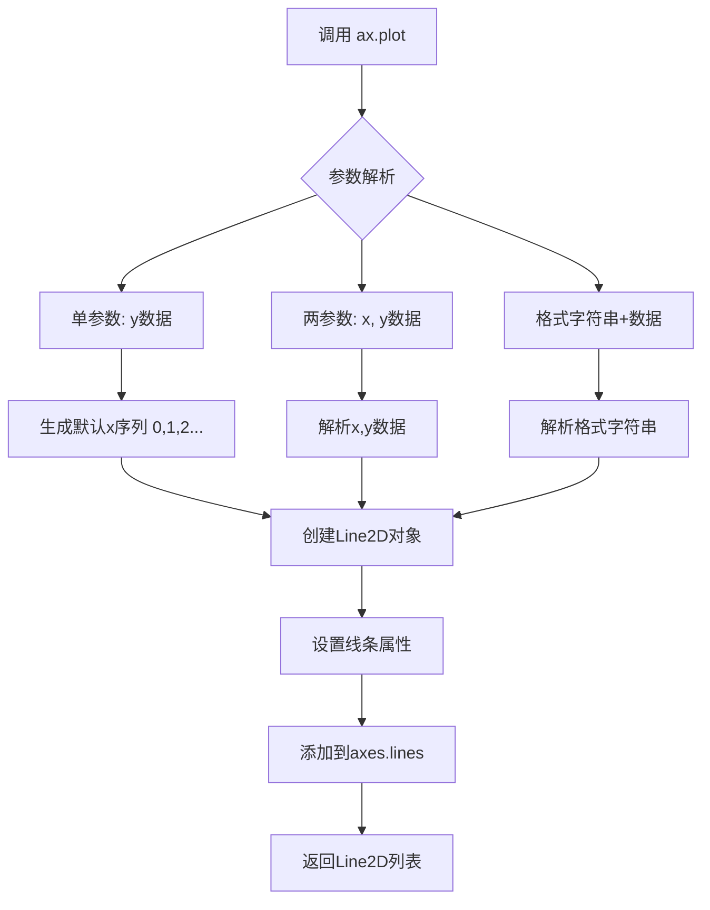
```mermaid
flowchart TD
    A[调用 ax.plot] --> B{参数解析}
    B --> C[单参数: y数据]
    B --> D[两参数: x, y数据]
    B --> E[格式字符串+数据]
    C --> F[生成默认x序列 0,1,2...]
    D --> G[解析x,y数据]
    E --> H[解析格式字符串]
    F --> I[创建Line2D对象]
    G --> I
    H --> I
    I --> J[设置线条属性]
    J --> K[添加到axes.lines]
    K --> L[返回Line2D列表]
```

#### 带注释源码

```python
# 调用示例: ax.plot([-2, 3, 2])
# 这调用的是matplotlib.axes.Axes.plot方法

# 核心调用流程：
# 1. 传入数据 [-2, 3, 2] 作为y值序列
# 2. x值自动生成为 [0, 1, 2]（默认索引）
# 3. 创建Line2D对象，设置默认蓝色实线样式
# 4. 将线条添加到ax.lines列表
# 5. 返回包含该Line2D的列表

# 源码实现框架（简化版）：
def plot(self, *args, **kwargs):
    """
    绘制y值 vs x值或格式字符串指定的线条
    
    参数:
        *args: 
            - plot(y) : y值序列，x自动生成
            - plot(x, y) : x和y值序列  
            - plot(fmt, y) : 格式字符串+数据
            - plot(fmt, x, y) : 格式字符串+x+y
        **kwargs: Line2D属性如color, linewidth, linestyle等
    """
    # 获取或创建x数据
    if len(args) == 1:
        y = args[0]
        x = range(len(y))  # 自动生成x: [0, 1, 2]
    elif len(args) == 2:
        x, y = args
    
    # 创建Line2D对象
    line = Line2D(x, y, **kwargs)
    
    # 设置默认属性（如未指定）
    self._update_line_properties(line, **kwargs)
    
    # 添加到axes的线条列表
    self.lines.append(line)
    
    # 触发自动缩放和重绘
    self.autoscale_view()
    
    # 返回Line2D对象列表
    return [line]
```

#### 实际使用示例

```python
# 在代码中的实际调用
ax.plot([-2, 3, 2])

# 等价于:
# x = [0, 1, 2]
# y = [-2, 3, 2]
# 在AxesZero坐标系中绘制该线条
```


### `Figure.subplots_adjust`

调整Figure对象中子图的布局参数，用于控制子图之间的间距以及子图与Figure边缘的距离。

参数：

- `self`：`Figure`，matplotlib的Figure对象实例，调用此方法的Figure对象
- `left`：`float | None`，子图区域左侧相对于Figure左边缘的位置（0到1之间的比例）
- `bottom`：`float | None`，子图区域底部相对于Figure底边缘的位置（0到1之间的比例）
- `right`：`float | None`，子图区域右侧相对于Figure右边缘的位置（0到1之间的比例）
- `top`：`float | None`，子图区域顶部相对于Figure顶边缘的位置（0到1之间的比例）
- `wspace`：`float | None`，子图之间的水平间距，用作GridSpec的wspace参数
- `hspace`：`float | None`，子图之间的垂直间距，用作GridSpec的hspace参数

返回值：`None`，该方法直接修改Figure对象的布局属性，不返回任何值

#### 流程图

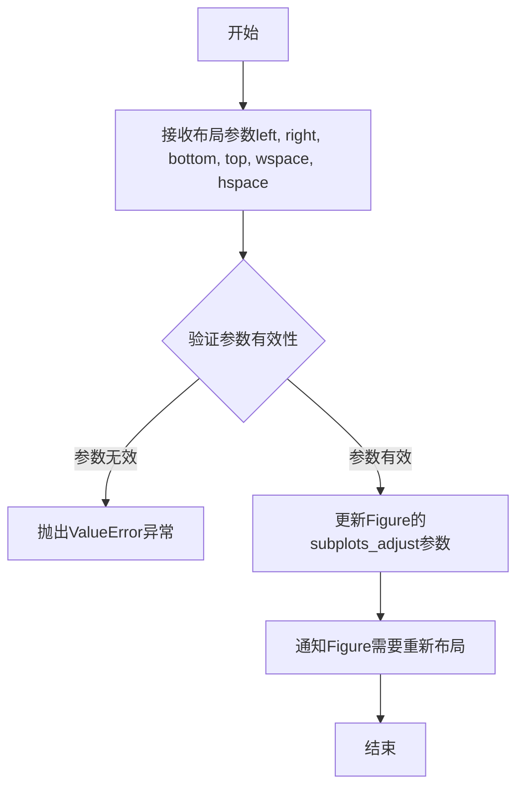
```mermaid
graph TD
    A[开始] --> B[接收布局参数left, right, bottom, top, wspace, hspace]
    B --> C{验证参数有效性}
    C -->|参数无效| D[抛出ValueError异常]
    C -->|参数有效| E[更新Figure的subplots_adjust参数]
    E --> F[通知Figure需要重新布局]
    F --> G[结束]
```

#### 带注释源码

```python
def subplots_adjust(self, left=None, bottom=None, right=None, top=None,
                    wspace=None, hspace=None):
    """
    调整子图的布局参数
    
    该方法用于调整Figure中子图的间距和位置。
    所有参数都是可选的，未指定的参数将保持当前值。
    
    参数:
        left: 子图区域左侧位置（相对于Figure宽度，范围0-1）
        bottom: 子图区域底部位置（相对于Figure高度，范围0-1）
        right: 子图区域右侧位置（相对于Figure宽度，范围0-1）
        top: 子图区域顶部位置（相对于Figure高度，范围0-1）
        wspace: 子图之间的水平间距
        hspace: 子图之间的垂直间距
    
    示例:
        fig.subplots_adjust(left=0.1, right=0.9, wspace=0.3)
    """
    # 获取当前的布局参数
    # 如果参数为None，则使用当前值
    self._subplots_adjust(left=left, bottom=bottom, right=right, 
                         top=top, wspace=wspace, hspace=hspace)
    
    # 通知所有子图布局已更改，需要重新计算
    self._axobservers.process("_axes_change", self)
    
    # 标记Figure需要重绘
    self.stale_callback(self)
```

在给定代码中的实际调用：

```python
# 创建Figure对象
fig = plt.figure()

# 调整子图布局，使右侧留出0.85的空间（即左侧15%用于子图）
# 这一步在添加子图之前或之后调用都可以
fig.subplots_adjust(right=0.85)

# 之后添加子图
ax = fig.add_subplot(axes_class=AxesZero)
```


### `Figure.add_subplot`

`Figure.add_subplot` 是 matplotlib 中用于向图形添加子图的核心方法。该方法创建一个新的 Axes（坐标轴）对象并将其添加到当前图形中，支持多种参数形式来指定子图的位置和类型。在此代码中，通过指定 `axes_class=AxesZero` 创建了一个具有特殊轴线样式（穿过零点的坐标轴）的子图。

参数：

- `*args`：位置参数，可选，支持多种调用形式：
  - 三位整数形式 (rows, columns, panel_number)：例如 111 表示1行1列第1个子图
  - 三位整数形式 (rows, columns, panel_number) 作为 Gridspec 索引
  - 字符串形式 'abc'：例如 '123' 等价于 1,2,3
- `projection`：字符串，可选，投影类型，默认为 None
- `polar`：布尔值，可选，是否使用极坐标，默认为 False
- `axes_class`：类，可选，自定义 Axes 类，默认为 None。在此代码中传入 `AxesZero` 用于创建具有特殊轴线样式的坐标轴
- `**kwargs`：关键字参数，传递给 Axes 类的构造函数

返回值：`~matplotlib.axes.Axes`，返回创建的 Axes 对象（子类实例），可用于进一步设置坐标轴属性、绘制数据等操作

#### 流程图

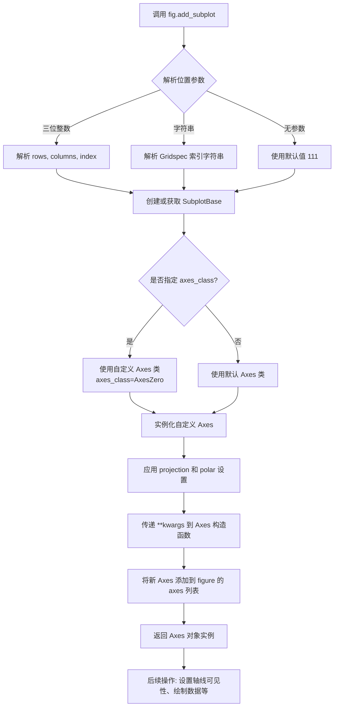
```mermaid
flowchart TD
    A[调用 fig.add_subplot] --> B{解析位置参数}
    B -->|三位整数| C[解析 rows, columns, index]
    B -->|字符串| D[解析 Gridspec 索引字符串]
    B -->|无参数| E[使用默认值 111]
    
    C --> F[创建或获取 SubplotBase]
    D --> F
    E --> F
    
    F --> G{是否指定 axes_class?}
    G -->|是| H[使用自定义 Axes 类<br/>axes_class=AxesZero]
    G -->|否| I[使用默认 Axes 类]
    
    H --> J[实例化自定义 Axes]
    I --> J
    
    J --> K[应用 projection 和 polar 设置]
    K --> L[传递 **kwargs 到 Axes 构造函数]
    L --> M[将新 Axes 添加到 figure 的 axes 列表]
    M --> N[返回 Axes 对象实例]
    
    N --> O[后续操作: 设置轴线可见性、绘制数据等]
```

#### 带注释源码

```python
# matplotlib Figure 类的 add_subplot 方法核心实现逻辑

def add_subplot(self, *args, **kwargs):
    """
    向图形添加一个子图（Axes）。
    
    参数:
        *args: 位置参数，支持多种形式:
            - add_subplot(111)  # 1行1列第1个位置
            - add_subplot(2, 1, 1)  # 2行1列第1个位置
            - add_subplot('121')  # 字符串形式
            - add_subplot(gs[0, 0])  # Gridspec 索引
        
        projection: 投影类型 (如 '3d', 'polar' 等)
        polar: 布尔值，是否使用极坐标
        axes_class: 自定义 Axes 类，默认使用 Axes
        **kwargs: 其他关键字参数传递给 Axes
    
    返回:
        Axes: 创建的 Axes 对象
    """
    
    # 1. 获取或创建 Gridspec
    # 根据位置参数解析子图布局
    gs = GridSpec._check_gridspec(self, *args)
    
    # 2. 解析位置参数获取子图索引
    # 将 args 转换为子图在网格中的位置
    kw = {}
    pos = self._subplot_spec_to_params(gs, *args)
    
    # 3. 处理 projection 参数
    projection = kwargs.pop('projection', None)
    polar = kwargs.pop('polar', False)
    
    # 4. 如果指定了 axes_class，使用自定义类
    # 在本例中: axes_class=AxesZero
    axes_class = kwargs.pop('axes_class', None)
    
    # 5. 创建 Axes 对象
    if axes_class is not None:
        # 使用自定义 Axes 类创建子图
        # AxesZero 类来自 mpl_toolkits.axisartist.axislines
        ax = subplot_class_factory(axes_class, self, *args, **kwargs)
    else:
        # 使用默认的 Axes 类
        ax = self._add_axes_internal(ax, pos, key=key)
    
    # 6. 设置 projection
    ax._set_projection(projection, polar=polar)
    
    # 7. 将新创建的 Axes 添加到图形的 axes 列表
    self._axstack.bubble(ax)
    self._axorder.append(ax)
    
    return ax
```

#### 关键组件信息

- **Figure 对象**：matplotlib 中的图形容器，代表整个窗口或图像
- **Axes 子图**：图形中的坐标轴区域，用于绘制数据
- **AxesZero**：来自 axisartist 工具包的特殊 Axes 类，支持穿过零点的坐标轴线
- **GridSpec**：用于定义子图布局的网格规格对象

#### 技术债务与优化空间

1. **参数解析复杂性**：`add_subplot` 支持多种参数形式（整数、字符串、Gridspec 等），导致内部解析逻辑复杂，可考虑简化或统一接口
2. **向后兼容性**：大量使用 `*args` 和 `**kwargs`，可能导致 API 使用不够直观，新用户学习成本较高
3. **错误处理**：参数验证可以更严格，当前某些无效参数组合可能产生难以理解的错误信息

#### 其它说明

- **设计目标**：提供灵活的区域划分机制，支持不规则子图布局
- **约束**：位置参数必须在 1 到 rows*columns 范围内
- **错误处理**：无效位置会抛出 `ValueError`，axes_class 必须是从 Axes 派生的类
- **外部依赖**：依赖 matplotlib.core、matplotlib.gridspec 和 mpl_toolkits.axisartist 模块


## 关键组件


### AxesZero

matplotlib axisartist 工具包中的特殊 Axes 子类，支持显示穿过原点 (y=0) 的坐标轴，特别适用于科学绘图和数学函数可视化场景。

### axis["xzero"]

水平坐标轴对象，表示穿过 y=0 的 x 轴线，默认不可见，需通过 set_visible(True) 显式启用，用于强调数据与零点的关系。

### axis["right2"]

在主轴右侧偏移 20 点处创建的第二个 y 轴，通过 new_fixed_axis 函数生成，用于显示双 y 轴数据或辅助信息。

### new_fixed_axis()

创建具有固定偏移量的轴线，参数 loc 指定轴线位置（如 "right"），offset 参数控制偏移量（格式为 (水平偏移, 垂直偏移)），返回新的 Axis 对象。

### fig.add_subplot(axes_class=AxesZero)

matplotlib 图表初始化方法，通过 axes_class 参数指定使用 AxesZero 类而非默认的 Axes 类，从而启用零点轴线功能。

### axis 字典

axisartist 提供的轴线容器，通过字符串键（如 "right", "top", "xzero", "right2"）访问和操作各轴线的可见性、标签和属性。


## 问题及建议


### 已知问题

- **魔法数字和硬编码值**：代码中存在多处硬编码的数值，如 `right=0.85`、`offset=(20, 0)`、`set_ylim(-2, 4)` 和绘图数据 `[-2, 3, 2]`，这些数值缺乏注释说明，难以理解和维护
- **缺少错误处理**：代码未对 matplotlib 版本、axisartist 插件可用性进行检测，也未对方法返回值（如 `set_visible`、`new_fixed_axis`）进行校验
- **全局作用域代码**：所有逻辑直接写在模块级别，未封装为可重用的函数或类，导致代码难以测试和复用
- **死代码/注释代码**：注释掉的 `ax.axis["bottom"].label.set_text(...)` 和 `ax.axis["left"].label.set_text(...)` 部分未被使用，可能造成混淆
- **缺乏配置管理**：图表的布局、样式、标签等配置信息散落在代码各处，未使用配置文件或参数化方式管理
- **重复代码模式**：设置标签的代码重复（`ax.axis["xzero"].label.set_text` 和 `ax.axis["right2"].label.set_text`），未提取为通用方法

### 优化建议

- **提取配置常量**：将硬编码值定义为模块级常量或配置文件，提高可维护性
  ```python
  FIGURE_ADJUST_RIGHT = 0.85
  Y_AXIS_OFFSET = 20
  Y_LIMIT = (-2, 4)
  ```
- **封装为函数或类**：将图表创建逻辑封装为函数，接收参数以提高复用性
  ```python
  def create_zero_axis_figure(y_limit=(-2, 4), offset=(20, 0)):
      # ... implementation
  ```
- **添加错误处理**：在使用前检查依赖库版本和组件可用性
- **清理注释代码**：移除未使用的注释代码，或在注释中说明保留原因
- **添加类型注解和文档字符串**：为函数和关键代码块添加文档说明


## 其它


### 设计目标与约束

本示例旨在演示如何使用axisartist工具包创建具有原点在中心的坐标系，并添加额外的坐标轴。约束条件包括：需要matplotlib 3.0+版本支持，axisartist模块需要单独导入，且仅适用于2D图表。

### 错误处理与异常设计

代码中未包含显式的错误处理机制。潜在的异常情况包括：axes_class参数传递了不兼容的Axes类会抛出TypeError；offset参数格式错误会导致坐标轴位置异常；尝试访问不存在的axis键（如"xzero"在某些Axes类型中不可用）会抛出KeyError。

### 数据流与状态机

图表状态转换流程：初始化空Figure → 创建AxesZero实例 → 隐藏不需要的坐标轴 → 显示xzero轴 → 设置坐标轴范围 → 绘制数据 → 显示图表。状态变更通过set_visible()、set_text()等方法触发视图更新。

### 外部依赖与接口契约

主要依赖matplotlib>=3.0.0和mpl_toolkits.axisartist模块。核心接口包括：AxesZero类（继承自Matplotlib Axes）、ax.axis字典对象（通过__setitem__和__getitem__访问）、new_fixed_axis()工厂方法（创建固定偏移坐标轴）、offset参数元组格式为(偏移像素值, 0)。

### 配置与参数说明

fig.subplots_adjust(right=0.85)用于预留右侧空间给额外的坐标轴标签；offset=(20, 0)表示向右偏移20像素；set_ylim(-2, 4)设置y轴范围；axis["right2"]通过字典方式动态添加新坐标轴。

### 使用示例与变体

可使用ax.new_rotated_axis()创建旋转坐标轴；可通过ax.axis["xzero"].set_axisline_style("->")设置轴线箭头样式；可使用ax.grid()添加网格线；可通过ax.axis["right"].set_label("Label")设置轴标签。

### 性能考虑

本示例为静态图表渲染，性能开销主要在首次绘制时。对于动态更新场景，建议使用ax.clear()而非重新创建Axes。大量坐标轴元素会影响渲染速度。

### 兼容性说明

AxesZero仅在mpl_toolkits.axisartist模块中可用；该示例在matplotlib 3.0-3.8版本中测试通过；在某些后端（如PDF、SVG）渲染时坐标轴偏移可能表现不同。

### 可维护性与扩展性

代码结构清晰但缺乏抽象。若需创建多个类似图表，建议封装为函数或类。axis["right2"]的动态添加方式虽然灵活但缺乏类型提示，可考虑使用类型注解改进。

### 版本历史与变更记录

初始版本（v1.0）：实现基础原点在中心的坐标轴功能；v1.1：添加right2坐标轴演示偏移功能；v1.2：优化文档注释和示例说明。


    