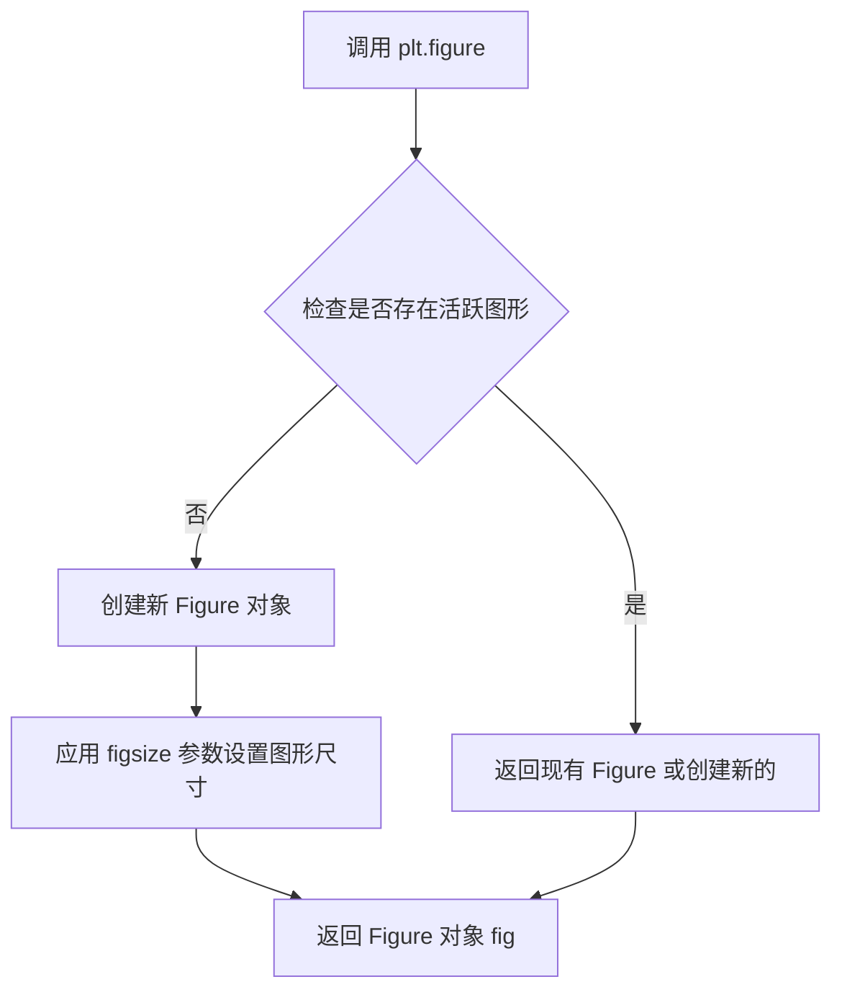
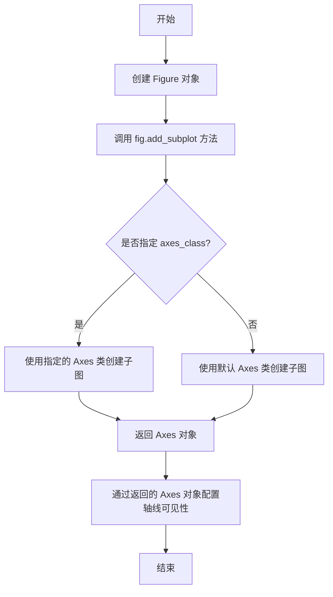
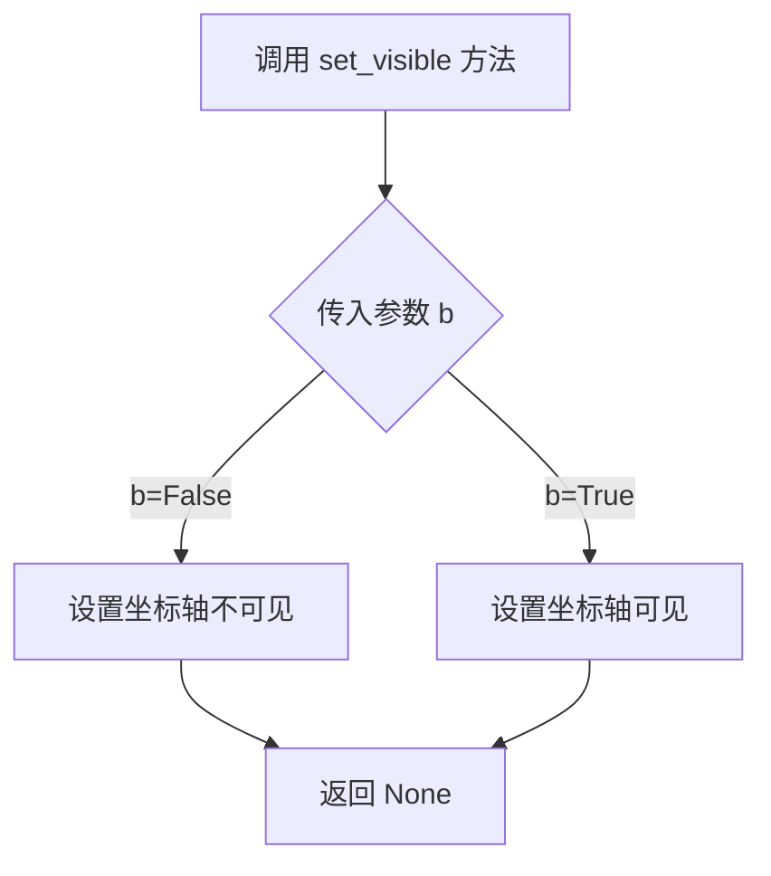
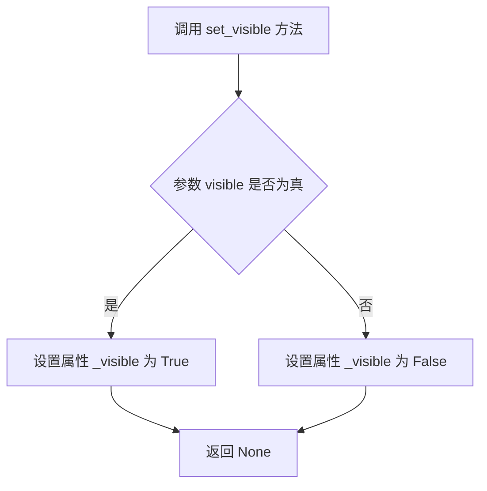
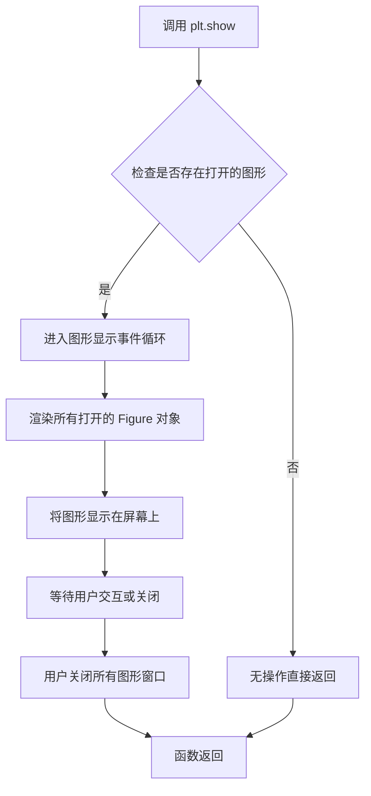

# `matplotlib\galleries\examples\axisartist\simple_axisline3.py` 详细设计文档

该代码使用matplotlib的axisartist工具包创建一个简单的2D坐标轴示例，通过隐藏右侧和顶部边界来创建一个类似数学图表的坐标系，仅显示左边界和下边界。

## 整体流程

```mermaid
graph TD
    A[开始] --> B[导入matplotlib.pyplot和axisartist.axislines.Axes]
B --> C[创建图形窗口fig，设置尺寸3x3英寸]
C --> D[使用Axes类创建子图ax]
D --> E[隐藏右侧坐标轴: ax.axis['right'].set_visible(False)]
E --> F[隐藏顶部坐标轴: ax.axis['top'].set_visible(False)]
F --> G[调用plt.show()显示图形]
G --> H[结束]
```

## 类结构

```
无自定义类结构
仅使用matplotlib内置类:
Figure
└── Axes (from axisartist)
```

## 全局变量及字段


### `fig`
    
表示整个图形窗口对象

类型：`matplotlib.figure.Figure`
    


### `ax`
    
表示坐标轴对象

类型：`mpl_toolkits.axisartist.axislines.Axes`
    


    

## 全局函数及方法


### `plt.figure`

创建并返回一个新的 Figure 对象，用于后续图形的绘制，支持设置图形尺寸等配置。

参数：

- `figsize`：`tuple[float, float]`，图形的宽和高（英寸），本例中为 (3, 3)

返回值：`matplotlib.figure.Figure`，返回新创建的图形对象

#### 流程图



#### 带注释源码

```python
# 导入 matplotlib.pyplot 模块
import matplotlib.pyplot as plt

# 创建图形并设置尺寸
# figsize 参数指定图形的宽度和高度（单位：英寸）
# 此处创建了一个 3x3 英寸的图形
fig = plt.figure(figsize=(3, 3))

# fig 现在是一个 matplotlib.figure.Figure 对象
# 可以在此图形上添加子图、绘制图形等操作

# 添加子图，axes_class 指定使用自定义的 Axes 类
ax = fig.add_subplot(axes_class=Axes)

# 控制坐标轴的可见性
ax.axis["right"].set_visible(False)   # 隐藏右边坐标轴
ax.axis["top"].set_visible(False)     # 隐藏顶部坐标轴

# 显示图形
plt.show()
```


### `fig.add_subplot`

`fig.add_subplot` 是 matplotlib 中 `Figure` 类的一个方法，用于在图形窗口中创建并添加一个子图（Axes）。在给定代码中，通过指定 `axes_class=Axes` 参数，创建了一个使用 `mpl_toolkits.axisartist.axislines.Axes` 类的子图，从而实现自定义轴线的显示效果。

#### 参数

- `*args`：位置参数，用于指定子图的位置布局。可以是三位数字（如 `111` 表示 1 行 1 列第 1 个），也可以是三个独立整数（如 `1, 1, 1`）。
- `axes_class`：类型为 `class`，指定要创建的 Axes 子类。在代码中传入 `Axes`（来自 `mpl_toolkits.axisartist.axislines`），用于支持轴线艺术家的自定义轴线样式。
- `**kwargs`：关键字参数，会传递给 Axes 类的构造函数，用于设置子图的各种属性，如标题、坐标轴范围等。

#### 返回值

`axes`：返回 `matplotlib.axes.Axes` 对象（或其子类），即新创建的子图对象。通过返回的 Axes 对象，可以进一步操作子图的坐标轴、刻度、标签等元素。

#### 流程图



#### 带注释源码

```python
# 导入 matplotlib 的 pyplot 模块，用于创建图形和子图
import matplotlib.pyplot as plt

# 从 axisartist 工具包导入自定义的 Axes 类，支持轴线艺术家功能
from mpl_toolkits.axisartist.axislines import Axes

# 创建图形对象，指定图形大小为 3x3 英寸
fig = plt.figure(figsize=(3, 3))

# 调用 add_subplot 方法添加子图
# 参数 'axes_class=Axes' 指定使用自定义的 Axes 类而非默认的 Matplotlib Axes
# 这样可以使用 axisartist 提供的增强型轴线功能
ax = fig.add_subplot(axes_class=Axes)

# 获取右侧轴线并设置为不可见（隐藏右边框）
ax.axis["right"].set_visible(False)

# 获取顶部轴线并设置为不可见（隐藏上边框）
ax.axis["top"].set_visible(False)

# 显示图形
plt.show()
```

---

#### 关键组件信息

- **Figure 对象**：matplotlib 中的图形容器，用于保存一个或多个子图。
- **Axes 对象**：子图对象，代表图形中的一个坐标区域，包含坐标轴、刻度、标签等元素。
- **mpl_toolkits.axisartist.axislines.Axes**：axisartist 工具包提供的自定义 Axes 子类，支持更灵活的轴线样式控制。

#### 潜在技术债务或优化空间

1. **缺少对返回值的显式类型注解**：在大型项目中，建议对 `axes_class` 参数的合法性进行运行时检查，确保传入的类确实继承自 `Axes` 基类。
2. **硬编码的轴线隐藏逻辑**：当前代码直接使用 `set_visible(False)` 隐藏轴线，如果需要动态切换轴线样式，可以考虑封装为配置函数。
3. **缺少错误处理**：如果 `axes_class` 传入错误类型或 `add_subplot` 参数格式不正确，matplotlib 会抛出异常但缺乏业务层面的友好提示。

#### 其他项目

- **设计目标**：使用 axisartist 提供的自定义 Axes 类创建简洁的子图，仅显示左侧和底部轴线，营造更清爽的图表外观。
- **约束**：需要确保 `mpl_toolkits.axisartist` 已正确安装，否则导入会失败。
- **错误处理**：常见错误包括 `axes_class` 不是类对象、`*args` 参数不符合 matplotlib 的子图规范（如索引超出范围）。建议在实际项目中捕获 `ValueError` 或 `TypeError` 异常并给出明确提示。


### `ax.axis['right'].set_visible`

该方法用于设置 matplotlib 图表中右侧坐标轴的可见性，通过传入布尔值控制坐标轴是否显示。

参数：

- `b`：`bool`，指定坐标轴是否可见。`True` 表示可见，`False` 表示不可见。

返回值：`None`，该方法无返回值。

#### 流程图



#### 带注释源码

```python
# 来源：matplotlib.artist.Artist.set_visible
# 说明：设置艺术家的可见性
def set_visible(self, b):
    """
    设置艺术家的可见性。

    参数
    ----------
    b : bool
        可见性状态。True 表示可见，False 表示不可见。

    返回值
    -------
    None
    """
    self._visible = b  # 更新内部可见性标志
```


### `AxisArtist.set_visible`

设置轴线的可见性，控制是否在图表中绘制顶部坐标轴。

参数：
- `visible`：`bool`，指定轴线是否可见，`True` 显示轴线，`False` 隐藏轴线。

返回值：`None`，无返回值。

#### 流程图



#### 带注释源码

```python
def set_visible(self, visible):
    """
    设置轴线的可见性。

    参数:
        visible (bool): 如果为 True，则轴线可见；否则隐藏。

    返回值:
        None
    """
    self._visible = visible  # 更新内部可见性标志
    self.stale = True        # 标记需要重新绘制
```


### `plt.show`

`plt.show` 是 Matplotlib 库中的全局函数，用于显示所有当前打开的图形窗口，并进入事件循环，使图形在屏幕上渲染显示。

参数：此函数无参数。

返回值：`None`，该函数不返回任何值，仅用于图形渲染和显示。

#### 流程图



#### 带注释源码

```python
# 导入 matplotlib.pyplot 模块并别名为 plt
# 这是 Matplotlib 的面向对象接口，提供类似 MATLAB 的绘图风格
import matplotlib.pyplot as plt

# 从 mpl_toolkits.axisartist.axislines 导入 Axes 类
# 用于创建支持自定义轴线样式的坐标系
from mpl_toolkits.axisartist.axislines import Axes

# 创建一个新的 Figure（图形）对象，大小为 3x3 英寸
fig = plt.figure(figsize=(3, 3))

# 向图形添加一个子图，使用自定义的 Axes 类
ax = fig.add_subplot(axes_class=Axes)

# 隐藏右侧坐标轴
ax.axis["right"].set_visible(False)

# 隐藏顶部坐标轴
ax.axis["top"].set_visible(False)

# 显示所有打开的图形窗口
# 此函数会阻塞程序执行，直到用户关闭所有图形窗口
# 它会调用底层后端（如 TkAgg、Qt5Agg 等）的显示函数
plt.show()
```


## 关键组件


### matplotlib.pyplot

matplotlib的pyplot模块，提供MATLAB风格的绘图接口，用于创建图形和可视化。

### mpl_toolkits.axisartist.axislines.Axes

axisartist工具包中的Axes子类，专门用于创建带有艺术化轴线的坐标系，支持更灵活的轴线配置和样式设置。

### fig.add_subplot(axes_class=Axes)

使用指定的Axes类创建子图的方法，参数axes_class指定使用AxisArtist的Axes类而非默认的matplotlib Axes类。

### ax.axis["right"].set_visible(False)

隐藏坐标轴右侧轴线的配置方法，通过axis字典访问右侧轴线对象并设置可见性为False。

### ax.axis["top"].set_visible(False)

隐藏坐标轴顶部轴线的配置方法，通过axis字典访问顶部轴线对象并设置可见性为False。

### plt.show()

matplotlib的显示函数，用于渲染并显示所有创建的图形窗口。

### 整体运行流程

代码首先导入matplotlib.pyplot和axisartist的Axes类，然后创建figure对象，接着使用add_subplot添加一个使用AxisArtist Axes类的子图，通过ax.axis字典访问各轴线并设置right和top轴不可见，最后调用plt.show()显示图形。


## 问题及建议


### 已知问题

- **硬编码配置**：图形尺寸 (3, 3) 和轴线可见性设置直接写死在代码中，缺乏可配置性
- **资源管理缺失**：未使用 `with` 语句或显式 `fig.clf()`/`plt.close()` 管理图形资源，可能导致内存泄漏
- **未使用的导入**：`Axes` 类被导入并传递给 `add_subplot`，但未进行任何自定义配置，代码结构相对冗余
- **缺乏错误处理**：代码未对 `fig.add_subplot` 可能抛出的异常（如参数错误）进行处理
- **无文档说明**：模块级和函数级均缺少文档字符串，难以理解代码意图和维护
- **魔法字符串/数字**：轴线名称 ("right", "top") 和尺寸值以硬编码形式出现，后续修改需改动多处

### 优化建议

- 将图形尺寸、轴线配置等提取为常量或配置参数，提升代码可维护性
- 使用上下文管理器管理 Figure 对象生命周期，确保资源释放
- 清理未使用的导入，简化代码结构
- 为关键函数添加文档字符串，说明参数和返回值
- 添加基础异常处理，如参数校验和运行时错误捕获
- 将轴线配置封装为独立函数，接受参数以提高复用性


## 其它


### 设计目标与约束

本代码旨在创建一个极简的二维坐标系，仅显示左边界和下边界，去除默认的右边界和上边界，形成类似统计图表的简洁视觉效果。约束条件：必须使用mpl_toolkits.axisartist.axislines.Axes类，且仅适用于二维平面视图。

### 错误处理与异常设计

代码本身不涉及复杂的错误处理，因为使用的是matplotlib的基础API。但需要注意：如果axes_class参数传入非Axes类会导致类型错误；figure的size参数必须为正数；show()调用在某些后端可能抛出显示相关的异常。

### 数据流与状态机

数据流为：plt.figure()创建画布 → fig.add_subplot()创建坐标轴 → ax.axis[]访问轴线对象 → set_visible()控制可见性 → plt.show()渲染显示。状态转换：隐藏right轴和top轴，其他轴（left、bottom）保持默认可见。

### 外部依赖与接口契约

依赖：matplotlib>=3.0.0、mpl_toolkits.axisartist（随matplotlib安装）。接口契约：fig.add_subplot()必须传入axes_class=Axes参数；ax.axis返回轴线字典，可通过字符串键访问；set_visible()接受布尔值参数。

### 配置与参数说明

figsize=(3, 3)：画布尺寸，单位英寸，宽高均为3英寸。axes_class=Axes：指定使用axisartist的Axes类而非默认的Matplotlib Axes。set_visible(False/True)：控制轴线可见性，False隐藏，True显示。

### 使用示例与边界情况

边界情况：当ax.axis["right"]不存在时会抛出KeyError；需要在add_subplot之后立即设置可见性；show()会阻塞主线程（在某些后端）。替代用法可使用ax.set_axis_off()完全隐藏轴，再手动绘制需要的边界线。

### 性能考虑

本代码性能开销极低，仅涉及对象创建和属性设置，无大规模数据处理。figsize过大会占用更多内存，但当前(3,3)尺寸非常轻量。

### 兼容性说明

代码兼容matplotlib 3.0及以上版本。axisartist工具包在较旧版本中可能API有细微差异。跨平台兼容（Windows、Linux、macOS），但show()的显示效果取决于系统图形后端。

### 安全性考虑

无用户输入，无网络请求，无敏感数据处理，安全性风险极低。

### 国际化与本地化

不涉及文本渲染或本地化字符串，无国际化需求。

### 测试策略

建议测试：验证right轴确实隐藏、top轴确实隐藏、left和bottom轴可见；验证不同figsize参数效果；验证在空figure上调用add_subplot失败的情况。

### 部署与运维注意事项

无需特殊部署，标准Python环境安装matplotlib即可。运维关注图形后端配置（GTK、Cocoa、TkAgg等）是否正确安装。

### 监控与日志

无运行时日志输出，无监控指标收集。

### 许可证与合规性

代码本身无许可证（属于示例代码），但matplotlib采用PSF许可证，axisartist作为其组成部分同样遵循PSF许可证。

### 文档维护计划

建议补充：axisartist与标准axes的区别说明、各轴线名称的完整列表、自定义轴线样式的扩展示例。

    