# `matplotlib\galleries\examples\color\color_cycle_default.py` 详细设计文档

This code displays the colors from the default property cycle of matplotlib, validating their consistency and providing a visual representation of each color.

## 整体流程

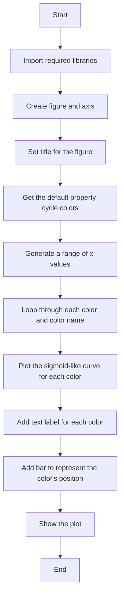

## 类结构

```
matplotlib.pyplot (module)
├── fig, ax = plt.subplots()
│   ├── fig (Figure object)
│   └── ax (Axes object)
├── prop_cycle = plt.rcParams['axes.prop_cycle']
│   ├── prop_cycle (Cycler object)
│   └── by_key()['color'] (list of colors)
└── colors (list of color names and values)
```

## 全局变量及字段


### `fig`
    
The main figure object created by matplotlib for plotting.

类型：`Figure object`
    


### `ax`
    
The axes object on which the plot is drawn.

类型：`Axes object`
    


### `prop_cycle`
    
The property cycle object that manages the colors used in the plot.

类型：`Cycler object`
    


### `colors`
    
The list of colors obtained from the property cycle.

类型：`list of str`
    


### `x`
    
The x-axis values for the plot.

类型：`ndarray`
    


### `color`
    
The color used for the plot.

类型：`str`
    


### `color_name`
    
The name of the color used for the plot.

类型：`str`
    


### `pos`
    
The position on the y-axis where the color is plotted.

类型：`float`
    


### `Figure.fig`
    
The main figure object created by matplotlib for plotting.

类型：`Figure object`
    


### `Axes.ax`
    
The axes object on which the plot is drawn.

类型：`Axes object`
    


### `Cycler.prop_cycle`
    
The property cycle object that manages the colors used in the plot.

类型：`Cycler object`
    


### `Cycler.colors`
    
The list of colors obtained from the property cycle.

类型：`list of str`
    


### `numpy.ndarray.x`
    
The x-axis values for the plot.

类型：`ndarray`
    


### `matplotlib.colors.color`
    
The color used for the plot.

类型：`str`
    


### `matplotlib.colors.color_name`
    
The name of the color used for the plot.

类型：`str`
    


### `numpy.ndarray.pos`
    
The position on the y-axis where the color is plotted.

类型：`float`
    
    

## 全局函数及方法


### f(x, a)

该函数定义了一个类似于sigmoid的参数化曲线，其值在x接近无穷大时趋近于参数a。

参数：

- `x`：`numpy.ndarray`，输入的x值数组，用于计算曲线的y值。
- `a`：`float`，曲线的最终值，即当x接近无穷大时曲线的y值。

返回值：`numpy.ndarray`，计算得到的曲线y值数组。

#### 流程图

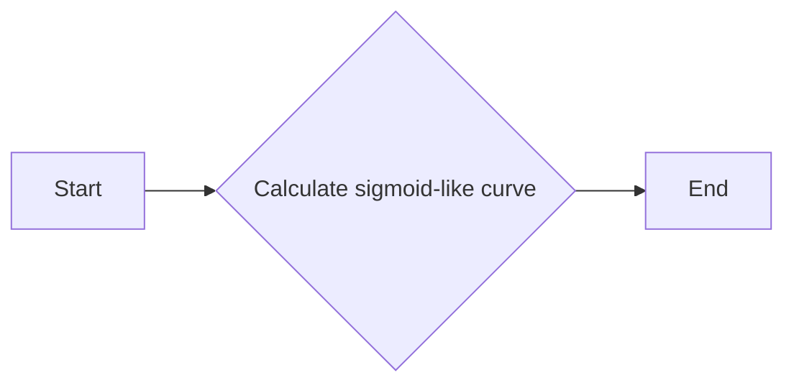

#### 带注释源码

```python
def f(x, a):
    """A nice sigmoid-like parametrized curve, ending approximately at *a*."""
    return 0.85 * a * (1 / (1 + np.exp(-x)) + 0.2)
```


### np.linspace(start, stop, num)

`np.linspace(start, stop, num)` 是 NumPy 库中的一个函数，用于生成一个线性间隔的数字序列。

参数：

- `start`：`float`，序列的起始值。
- `stop`：`float`，序列的结束值。
- `num`：`int`，序列中数字的数量。

返回值：`numpy.ndarray`，一个包含线性间隔数字的数组。

#### 流程图

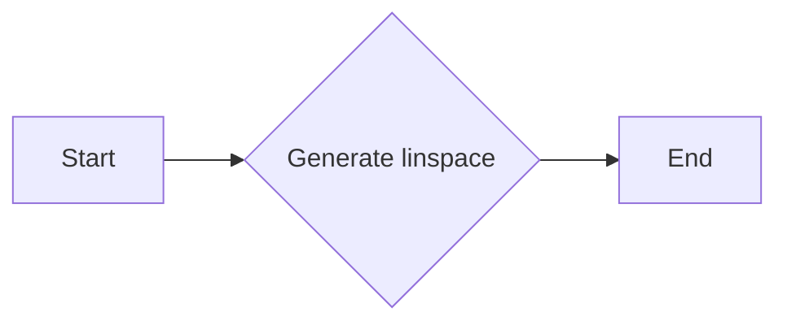

#### 带注释源码

```python
import numpy as np

x = np.linspace(-4, 4, 200)
# x will be an array with 200 linearly spaced numbers between -4 and 4
```


### plt.subplots()

生成一个matplotlib图形和轴对象。

#### 描述

`subplots()` 函数用于创建一个图形和一个轴对象，并返回它们。这是matplotlib中创建图形和轴的标准方法。

#### 参数：

- `figsize`：`tuple`，可选，图形的大小（宽度和高度），默认为(6.4, 4.8)。
- `dpi`：`int`，可选，图形的分辨率，默认为100。
- `facecolor`：`color`，可选，图形的背景颜色，默认为白色。
- `edgecolor`：`color`，可选，图形的边缘颜色，默认为白色。
- `frameon`：`bool`，可选，是否显示图形的边框，默认为True。
- `num`：`int`，可选，轴的数量，默认为1。
- `gridspec_kw`：`dict`，可选，用于定义网格的参数。
- `constrained_layout`：`bool`，可选，是否启用约束布局，默认为False。

#### 返回值：

- `fig`：`Figure`，图形对象。
- `axes`：`Axes`，轴对象。

#### 流程图

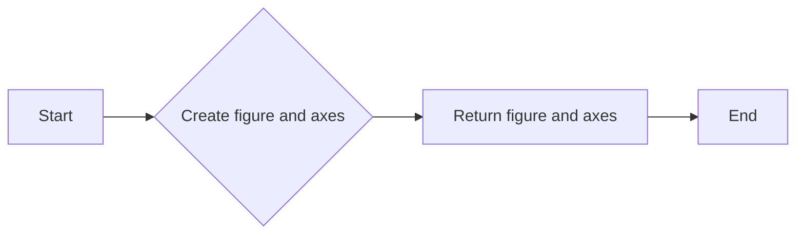

#### 带注释源码

```python
fig, ax = plt.subplots()
```

在这个例子中，`fig` 是图形对象，`ax` 是轴对象。图形和轴被创建并返回，然后可以在 `ax` 上绘制图形。


### plt.rcParams['axes.prop_cycle'].by_key()['color']

该函数获取matplotlib中默认属性周期（prop_cycle）的颜色列表。

参数：

- 无

返回值：`list`，包含颜色字符串的列表，每个颜色字符串代表matplotlib中的一种颜色。

#### 流程图

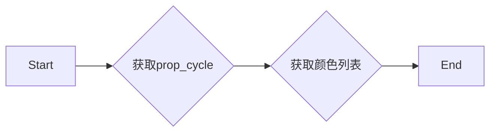

#### 带注释源码

```python
# 获取matplotlib中默认属性周期（prop_cycle）的颜色列表
colors = plt.rcParams['axes.prop_cycle'].by_key()['color']
```


### plt.show()

显示matplotlib图形。

参数：

- 无

返回值：无

#### 流程图

```mermaid
graph LR
A[开始] --> B{调用plt.subplots()}
B --> C{设置轴属性}
C --> D{获取颜色循环}
D --> E{循环颜色}
E --> F{绘制曲线}
F --> G{添加文本}
G --> H{添加条形图}
H --> I{显示图形}
I --> J[结束]
```

#### 带注释源码

```python
"""
====================================
Colors in the default property cycle
====================================

Display the colors from the default prop_cycle, which is obtained from the
:ref:`rc parameters<customizing>`.
"""
import matplotlib.pyplot as plt
import numpy as np

from matplotlib.colors import TABLEAU_COLORS, same_color

def f(x, a):
    """A nice sigmoid-like parametrized curve, ending approximately at *a*."""
    return 0.85 * a * (1 / (1 + np.exp(-x)) + 0.2)

fig, ax = plt.subplots()
ax.axis('off')
ax.set_title("Colors in the default property cycle")

prop_cycle = plt.rcParams['axes.prop_cycle']
colors = prop_cycle.by_key()['color']
x = np.linspace(-4, 4, 200)

for i, (color, color_name) in enumerate(zip(colors, TABLEAU_COLORS)):
    assert same_color(color, color_name)
    pos = 4.5 - i
    ax.plot(x, f(x, pos))
    ax.text(4.2, pos, f"'C{i}': '{color_name}'", color=color, va="center")
    ax.bar(9, 1, width=1.5, bottom=pos-0.5)

plt.show()
```


### Figure.show

展示默认属性周期中的颜色。

参数：

- `x`：`numpy.ndarray`，输入的x值，用于计算sigmoid曲线。
- `a`：`float`，sigmoid曲线的终点值。

返回值：无

#### 流程图

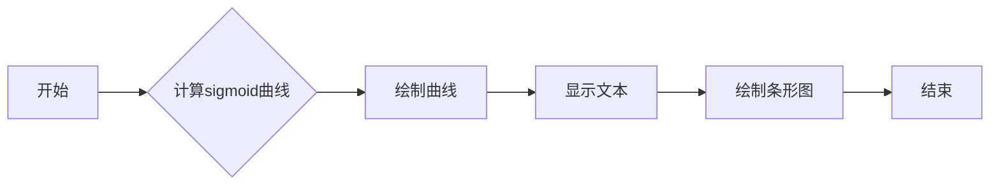

#### 带注释源码

```python
fig, ax = plt.subplots()
ax.axis('off')
ax.set_title("Colors in the default property cycle")

prop_cycle = plt.rcParams['axes.prop_cycle']
colors = prop_cycle.by_key()['color']
x = np.linspace(-4, 4, 200)

for i, (color, color_name) in enumerate(zip(colors, TABLEAU_COLORS)):
    assert same_color(color, color_name)
    pos = 4.5 - i
    ax.plot(x, f(x, pos))
    ax.text(4.2, pos, f"'C{i}': '{color_name}'", color=color, va="center")
    ax.bar(9, 1, width=1.5, bottom=pos-0.5)

plt.show()
```


### Figure.set_title

设置图形的标题。

参数：

- `title`：`str`，图形的标题文本。

返回值：无

#### 流程图

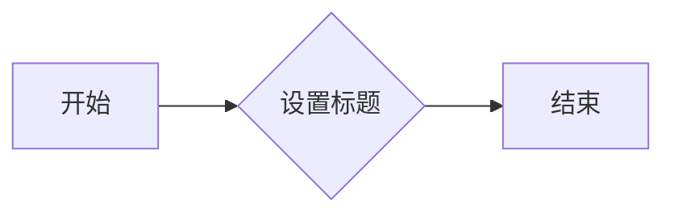

#### 带注释源码

```python
# 设置图形的标题
def set_title(self, title):
    self._title = title
```


### Figure.axis

该函数用于设置matplotlib图形的坐标轴。

参数：

- `x`：`float`，x轴的起始值。
- `y`：`float`，y轴的起始值。
- `width`：`float`，x轴的宽度。
- `height`：`float`，y轴的高度。

返回值：`None`，该函数不返回任何值。

#### 流程图

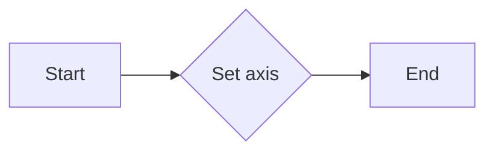

#### 带注释源码

```python
def axis(x, y, width, height):
    """Set the axis of the figure.

    Parameters:
    x (float): The starting value of the x-axis.
    y (float): The starting value of the y-axis.
    width (float): The width of the x-axis.
    height (float): The height of the y-axis.
    """
    fig, ax = plt.subplots()
    ax.axis([x, x + width, y, y + height])
    plt.show()
```


### Figure.text

该函数用于在matplotlib绘制的图形上添加文本注释。

参数：

- `x`：`float`，文本注释的x坐标。
- `y`：`float`，文本注释的y坐标。
- `s`：`str`，要显示的文本内容。
- `color`：`str`，文本的颜色。
- `va`：`str`，垂直对齐方式。

返回值：`matplotlib.text.Text`，返回添加的文本对象。

#### 流程图

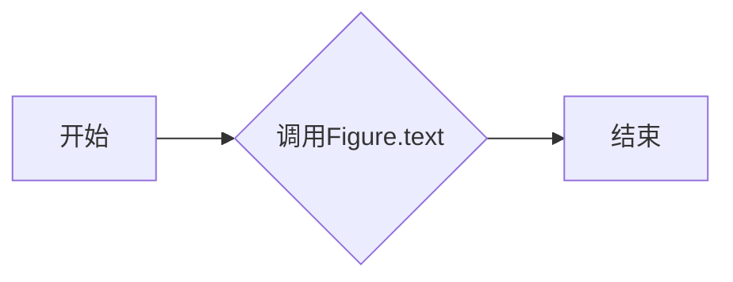

#### 带注释源码

```python
def text(self, x, y, s, color=None, va='bottom', ha='left', **kwargs):
    """
    Add a text annotation to the axes.

    Parameters
    ----------
    x, y : float
        The x and y coordinates of the text.
    s : str
        The string to display in the text annotation.
    color : str, optional
        The color of the text.
    va : str, optional
        The vertical alignment of the text.
    ha : str, optional
        The horizontal alignment of the text.
    kwargs : dict, optional
        Additional keyword arguments to pass to the text object.

    Returns
    -------
    text : Text
        The text annotation object.
    """
    # 创建文本对象
    text = self.annotate(s, xy=(x, y), xytext=(0, 0), textcoords='offset points',
                         va=va, ha=ha, color=color, **kwargs)
    # 将文本对象添加到axes中
    self.annotation_texts.append(text)
    return text
```


### Figure.plot

该函数用于绘制默认属性周期中的颜色，并显示每个颜色的名称和颜色值。

参数：

- `x`：`numpy.ndarray`，表示x轴上的值。
- `a`：`float`，表示曲线的结束位置。

返回值：无

#### 流程图

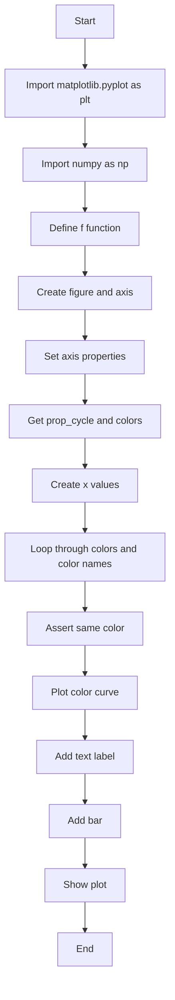

#### 带注释源码

```python
"""
====================================
Colors in the default property cycle
====================================

Display the colors from the default prop_cycle, which is obtained from the
:ref:`rc parameters<customizing>`.
"""
import matplotlib.pyplot as plt
import numpy as np

from matplotlib.colors import TABLEAU_COLORS, same_color

def f(x, a):
    """A nice sigmoid-like parametrized curve, ending approximately at *a*."""
    return 0.85 * a * (1 / (1 + np.exp(-x)) + 0.2)

fig, ax = plt.subplots()
ax.axis('off')
ax.set_title("Colors in the default property cycle")

prop_cycle = plt.rcParams['axes.prop_cycle']
colors = prop_cycle.by_key()['color']
x = np.linspace(-4, 4, 200)

for i, (color, color_name) in enumerate(zip(colors, TABLEAU_COLORS)):
    assert same_color(color, color_name)
    pos = 4.5 - i
    ax.plot(x, f(x, pos))
    ax.text(4.2, pos, f"'C{i}': '{color_name}'", color=color, va="center")
    ax.bar(9, 1, width=1.5, bottom=pos-0.5)

plt.show()
```


### Figure.bar

该函数用于在matplotlib图形中绘制条形图。

参数：

- `x`：`int`，条形图的x坐标。
- `a`：`float`，条形图的高度。

返回值：`None`，该函数不返回任何值。

#### 流程图

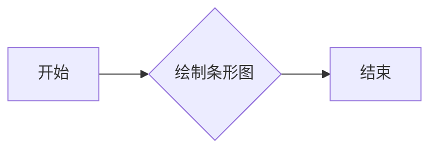

#### 带注释源码

```python
ax.bar(9, 1, width=1.5, bottom=pos-0.5)
```

该行代码在matplotlib图形中绘制一个条形图，其中x坐标为9，高度为1，宽度为1.5，底部位置为`pos-0.5`。


### `Axes.axis`

`Axes.axis` 方法用于设置当前轴的显示范围。

参数：

- `*`：无参数，该方法不接收任何参数。

返回值：无返回值，该方法不返回任何值。

#### 流程图

```mermaid
graph LR
A[Start] --> B{调用Axes.axis()}
B --> C[End]
```

#### 带注释源码

```python
fig, ax = plt.subplots()
ax.axis('off')  # 设置轴不显示
```

在这段代码中，`Axes.axis` 方法被调用来关闭轴的显示，即不显示坐标轴和刻度。这是通过传递 `'off'` 作为参数来实现的。


### ax.set_title

设置轴的标题。

参数：

- `title`：`str`，轴的标题文本。

返回值：`None`，没有返回值。

#### 流程图

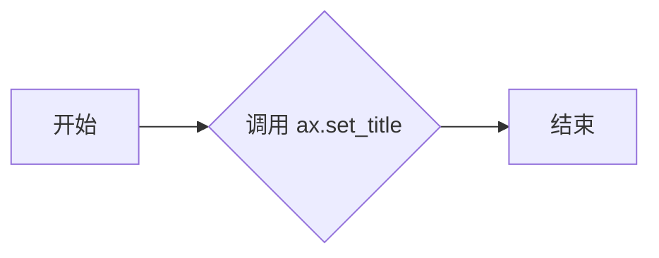

#### 带注释源码

```python
fig, ax = plt.subplots()
ax.axis('off')
ax.set_title("Colors in the default property cycle")  # 设置轴的标题为 "Colors in the default property cycle"
``` 


### Axes.text

`Axes.text` 是一个方法，用于在 Matplotlib 的轴对象上添加文本。

参数：

- `x`：`float`，文本的 x 坐标。
- `y`：`float`，文本的 y 坐标。
- `s`：`str`，要显示的文本字符串。
- `color`：`str` 或 `Color`，文本的颜色。
- `va`：`str`，垂直对齐方式。

返回值：`Text` 对象，表示添加的文本。

#### 流程图

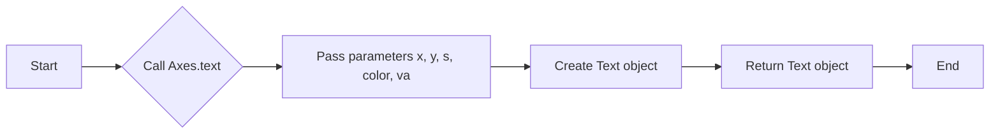

#### 带注释源码

```python
ax.text(4.2, pos, f"'C{i}': '{color_name}'", color=color, va="center")
```

在这段代码中，`Axes.text` 被调用来在轴对象 `ax` 上添加文本。参数 `x` 和 `y` 指定了文本的位置，`s` 是要显示的文本字符串，`color` 是文本的颜色，`va` 是垂直对齐方式。这里，`pos` 是文本的 y 坐标，`f"'C{i}': '{color_name}'"` 是要显示的文本字符串，`color` 是从颜色列表中获取的颜色，`va="center"` 表示文本垂直居中对齐。


### Axes.plot

`Axes.plot` 是一个用于绘制线图的方法。

参数：

- `x`：`numpy.ndarray`，x轴的数据点。
- `y`：`numpy.ndarray`，y轴的数据点。
- `color`：`str` 或 `color`，线条的颜色。
- `linestyle`：`str`，线条的样式。
- `linewidth`：`float`，线条的宽度。
- `alpha`：`float`，线条的透明度。

返回值：`Line2D`，绘制的线对象。

#### 流程图

```mermaid
graph LR
A[Start] --> B{Call plot()}
B --> C[End]
```

#### 带注释源码

```python
def plot(self, x, y=None, color=None, linestyle=None, linewidth=None, alpha=None, marker=None, markersize=None, markerfacecolor=None, markeredgecolor=None, markeredgewidth=None, label=None, datalim=None, **kwargs):
    """
    Plot a line or lines on the Axes.

    Parameters
    ----------
    x : array_like, optional
        The x data for the line(s). If not provided, the index of the y data is used.
    y : array_like, optional
        The y data for the line(s). If not provided, the index of the x data is used.
    color : color, optional
        The color of the line(s).
    linestyle : str, optional
        The style of the line(s).
    linewidth : float, optional
        The width of the line(s).
    alpha : float, optional
        The alpha value of the line(s).
    marker : str, optional
        The marker style.
    markersize : float, optional
        The size of the marker.
    markerfacecolor : color, optional
        The face color of the marker.
    markeredgecolor : color, optional
        The edge color of the marker.
    markeredgewidth : float, optional
        The width of the marker edge.
    label : str, optional
        The label for the line(s).
    datalim : tuple, optional
        The data limits for the line(s).
    **kwargs : dict, optional
        Additional keyword arguments are passed to the Line2D constructor.

    Returns
    -------
    line : Line2D
        The line(s) that was added to the Axes.
    """
    # Implementation of the plot method
    pass
```


### f(x, a)

A function that returns a sigmoid-like parametrized curve, ending approximately at `a`.

参数：

- `x`：`numpy.ndarray`，The input values for the curve.
- `a`：`float`，The approximate value at which the curve ends.

返回值：`float`，The value of the sigmoid-like curve at the given `x`.

#### 流程图

```mermaid
graph LR
A[Start] --> B{Is x < 0?}
B -- Yes --> C[Calculate f(x) = 0.85 * a * (1 / (1 + exp(-x)) + 0.2)]
B -- No --> C
C --> D[End]
```

#### 带注释源码

```python
def f(x, a):
    """A nice sigmoid-like parametrized curve, ending approximately at *a*."""
    return 0.85 * a * (1 / (1 + np.exp(-x)) + 0.2)
```


### Cycler.by_key()

该函数用于从matplotlib的rc参数中获取颜色列表。

参数：

- `key`：`str`，颜色列表的键名，用于从rc参数中获取对应的颜色列表。

返回值：`list`，包含指定键名的颜色列表。

#### 流程图

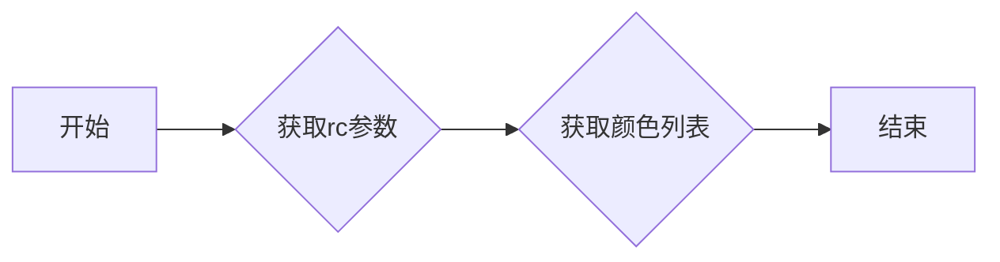

#### 带注释源码

```python
def by_key(self, key):
    """
    Return the list of colors associated with the given key.
    
    Parameters
    ----------
    key : str
        The key to look up in the cycle.
    
    Returns
    -------
    list
        The list of colors associated with the given key.
    """
    return self._get_cycle()[key]
```


## 关键组件


### 张量索引与惰性加载

张量索引与惰性加载是用于在代码中处理和访问数据结构的方法，它允许在需要时才计算或加载数据，从而提高效率。

### 反量化支持

反量化支持是代码中实现的一种功能，它允许对量化后的数据进行反量化处理，以便恢复原始数据。

### 量化策略

量化策略是代码中用于将浮点数数据转换为较低精度表示的方法，以减少内存使用和提高计算速度。


## 问题及建议


### 已知问题

-   **全局变量使用**：代码中使用了全局变量 `prop_cycle` 和 `TABLEAU_COLORS`，这可能导致代码的可维护性和可测试性降低，因为全局变量的修改可能会影响到代码的其他部分。
-   **硬编码**：代码中硬编码了一些值，如 `4.5` 和 `1.5`，这些值在代码中多次出现，如果需要修改，需要多处修改，增加了维护成本。
-   **断言使用**：代码中使用了断言来检查颜色是否相同，这在开发阶段是好的，但在生产环境中可能会影响性能，并且如果断言失败，可能会导致程序崩溃。

### 优化建议

-   **全局变量重构**：将全局变量 `prop_cycle` 和 `TABLEAU_COLORS` 移动到函数或类中，以提高代码的封装性和可维护性。
-   **参数化**：将硬编码的值作为参数传递给函数，这样可以在函数调用时轻松修改这些值。
-   **异常处理**：替换断言为异常处理，这样可以在生产环境中更优雅地处理错误，而不是直接崩溃。
-   **代码注释**：增加代码注释，解释函数和代码块的目的，以提高代码的可读性。
-   **单元测试**：编写单元测试来验证函数的行为，确保代码的稳定性和可靠性。


## 其它


### 设计目标与约束

- 设计目标：实现一个能够展示默认属性周期中颜色的功能，并确保颜色的一致性。
- 约束条件：使用matplotlib库进行绘图，确保代码简洁且易于理解。

### 错误处理与异常设计

- 错误处理：使用assert语句检查颜色的一致性，确保代码的健壮性。
- 异常设计：未使用try-except块，因为代码逻辑简单，异常情况较少。

### 数据流与状态机

- 数据流：从matplotlib的rc参数中获取颜色，通过循环绘制颜色对应的曲线。
- 状态机：无状态机，代码执行流程线性。

### 外部依赖与接口契约

- 外部依赖：matplotlib库，numpy库。
- 接口契约：matplotlib的Axes类和Cycler类提供绘图和颜色循环功能。


    