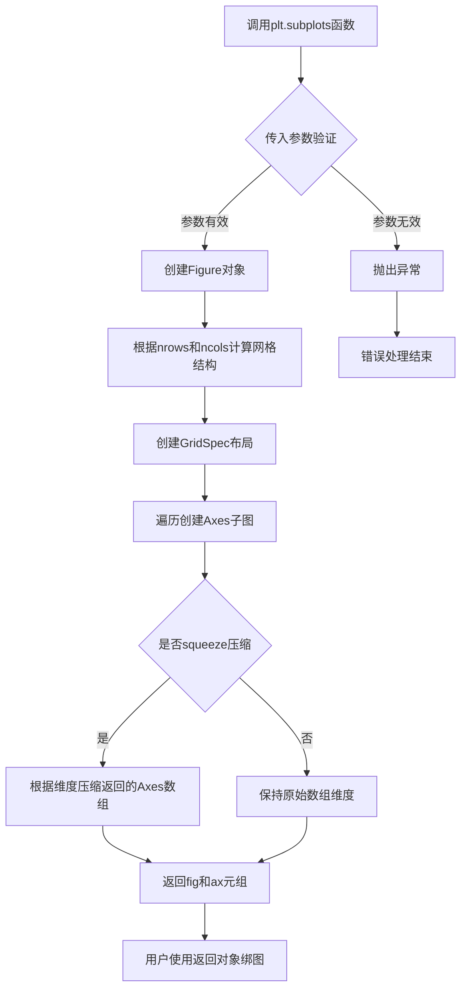
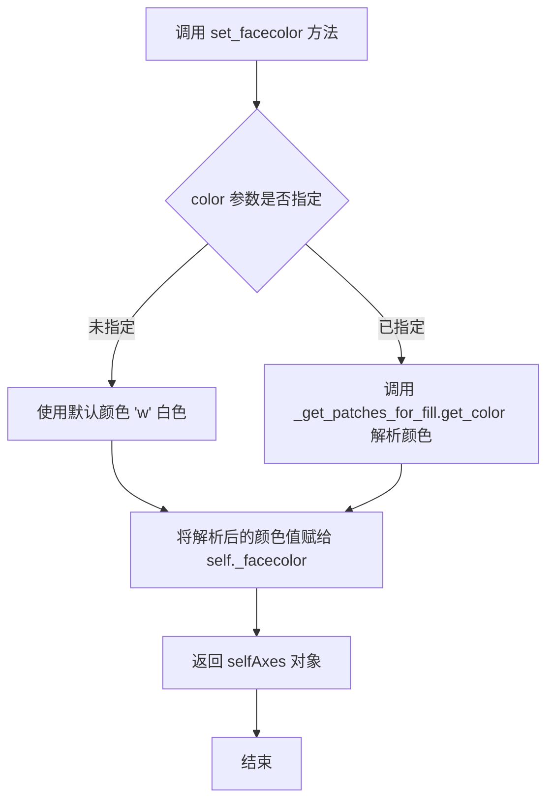
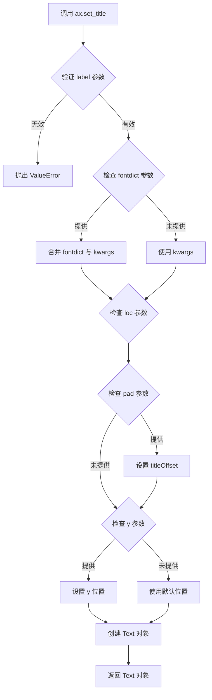
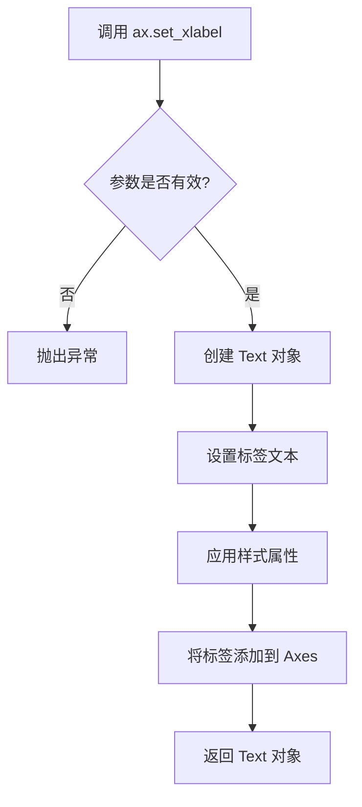
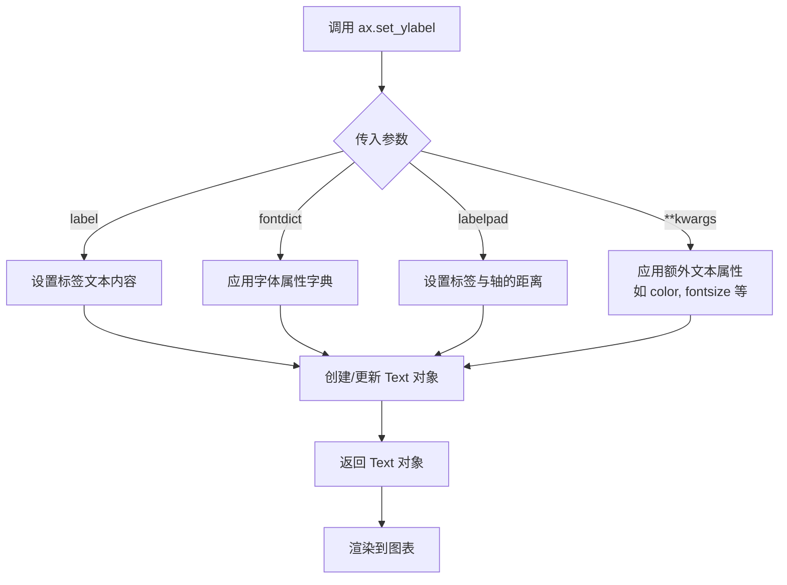
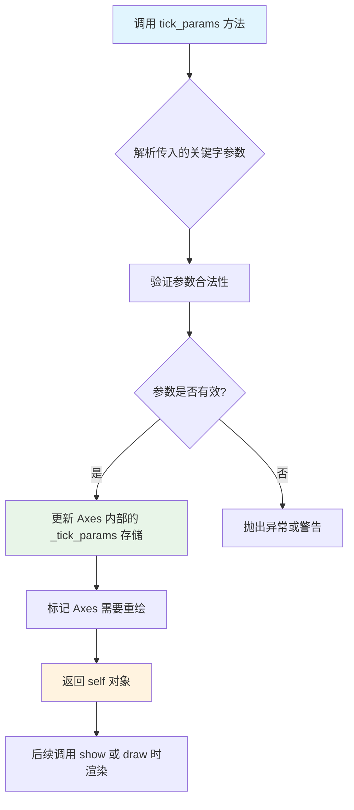
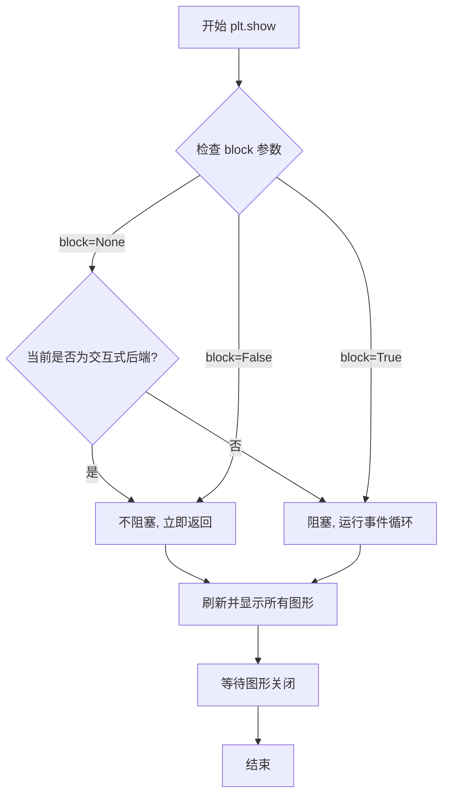

# `matplotlib\galleries\examples\color\color_demo.py` 详细设计文档

这是一个Matplotlib颜色演示脚本，展示了在matplotlib中指定颜色的多种方式，包括RGB/RGBA元组、十六进制字符串、灰度值、单字母颜色代码、命名颜色、xkcd颜色、Cn符号和Tableau颜色等，并绘制了一个简单的正弦波图表来演示这些颜色设置。

## 整体流程

```mermaid
graph TD
    A[开始] --> B[导入 matplotlib.pyplot 和 numpy]
    B --> C[创建时间序列数据 t 和正弦波数据 s]
    C --> D[创建图表和Axes对象]
    D --> E[使用RGB元组设置facecolor]
    E --> F[使用十六进制字符串设置facecolor]
    F --> G[使用灰度值设置标题颜色]
    G --> H[使用单字母颜色代码设置xlabel颜色]
    H --> I[使用命名颜色设置ylabel颜色]
    I --> J[使用xkcd颜色绘制第一条曲线]
    J --> K[使用Cn符号绘制第二条曲线]
    K --> L[使用Tableau颜色设置刻度标签颜色]
    L --> M[调用 plt.show() 显示图表]
    M --> N[结束]
```

## 类结构

```
此脚本为扁平结构，无类层次结构
└── 脚本级别代码 (无类定义)
```

## 全局变量及字段


### `t`
    
时间序列数据，从0.0到2.0的201个等间距点

类型：`numpy.ndarray`
    


### `s`
    
正弦波数据，由2*pi*t计算得到的正弦值

类型：`numpy.ndarray`
    


### `fig`
    
图表容器对象，用于承载整个图形

类型：`matplotlib.figure.Figure`
    


### `ax`
    
坐标轴对象，用于绘图和设置图表各种属性

类型：`matplotlib.axes.Axes`
    


    

## 全局函数及方法


### np.linspace

`np.linspace` 是 NumPy 库中的一个函数，用于创建在指定间隔内均匀分布的数值数组，常用于生成测试数据、坐标轴刻度或信号处理中的时间序列。

参数：

- `start`：`float` 或 `array_like`，序列的起始值
- `stop`：`float` 或 `array_like`，序列的结束值（当 `endpoint=True` 时包含该值）
- `num`：`int`，生成的样本数量，默认为 50
- `endpoint`：`bool`，如果为 True，stop 值作为最后一个样本；否则不包含，默认为 True
- `retstep`：`bool`，如果为 True，返回 (samples, step)，其中 step 是样本之间的间距；否则仅返回 samples，默认为 False
- `dtype`：`dtype`，输出数组的数据类型，若未指定则从 start 和 stop 推断
- `axis`：`int`，当 start 或 stop 是数组时，指定样本在输出数组中的轴

返回值：`ndarray`，返回 num 个在 [start, stop] 区间内均匀分布的样本

#### 流程图

```mermaid
flowchart TD
    A[开始 linspace] --> B{参数验证}
    B --> C[计算步长 step]
    C --> D{retstep 参数?}
    D -->|True| E[返回数组和步长]
    D -->|False| F[仅返回数组]
    E --> G[结束]
    F --> G
    
    B --> H[start 和 stop 类型推断]
    H --> C
    
    C --> I[num=201, start=0.0, stop=2.0]
    I --> J[step = (stop - start) / (num - 1)]
    J --> K[step = 2.0 / 200 = 0.01]
```

#### 带注释源码

```python
# 示例代码来自 matplotlib 颜色演示示例
# np.linspace 用于生成时间轴数据

# 参数说明：
#   start=0.0   -> 序列起始值
#   stop=2.0    -> 序列结束值
#   num=201     -> 生成 201 个样本点
t = np.linspace(0.0, 2.0, 201)

# 内部逻辑：
# 1. 计算步长: step = (stop - start) / (num - 1)
#            = (2.0 - 0.0) / (201 - 1) = 2.0 / 200 = 0.01
# 2. 生成数组: [0.0, 0.01, 0.02, ..., 1.99, 2.0]
# 3. 返回包含 201 个元素的等间距数组

# 后续用于生成正弦信号
s = np.sin(2 * np.pi * t)
```

#### 技术说明

| 属性 | 值 |
|------|-----|
| 函数名 | `numpy.linspace` |
| 所属模块 | `numpy` |
| 位置参数 | `start`, `stop` |
| 可选参数 | `num`, `endpoint`, `retstep`, `dtype`, `axis` |
| 返回类型 | `numpy.ndarray` |


### `np.sin`

计算输入数组或数值的正弦值（以弧度为单位），返回对应角度的正弦结果。

参数：

- `x`：`numpy.ndarray` 或 `float`，输入的角度值（以弧度为单位）

返回值：`numpy.ndarray` 或 `float`，输入角度的正弦值，范围在 `[-1, 1]` 之间

#### 流程图

```mermaid
flowchart TD
    A[Start] --> B[输入: 2 * np.pi * t]
    B --> C{t 检查输入类型}
    C -->|数组| D[对每个元素计算 sin]
    C -->|标量| E[计算标量 sin]
    D --> F[返回数组, 范围 [-1, 1]]
    E --> F
```

#### 带注释源码

```python
# t 是从 0.0 到 2.0 的 201 个等间距点
t = np.linspace(0.0, 2.0, 201)

# 计算 2πt 的正弦值
# 参数: 2 * np.pi * t (弧度值，生成完整周期的正弦波)
# 返回: s，包含 201 个正弦值，范围在 [-1, 1]
s = np.sin(2 * np.pi * t)
```


### `plt.subplots`

`plt.subplots`是Matplotlib库中的一个顶层函数，用于创建一个新的Figure（图形）对象和一个或多个Axes（坐标轴）对象，返回的Figure和Axes对象可以用于进一步定制和绑制图表。该函数是MATLAB风格的`plt.subplot`的面向对象接口的简化版本，支持创建单轴或多轴网格，并可配置图形尺寸、分辨率、背景色等属性。

参数：

- `nrows`：`int`，行数，指定要创建的Axes网格的行数，默认为1
- `ncols`：`int`，列数，指定要创建的Axes网格的列数，默认为1
- `sharex`：`bool`或`str`，如果为True，则所有子图共享x轴；如果为'row'，则每行共享x轴；如果为'col'，则每列共享x轴；默认为False
- `sharey`：`bool`或`str`，如果为True，则所有子图共享y轴；如果为'row'，则每行共享y轴；如果为'col'，则每列共享y轴；默认为False
- `squeeze`：`bool`，如果为True，则压缩返回的轴数组维度（对于单行或单列情况）；默认为True
- `width_ratios`：`array-like`，宽度比例，用于指定各列的相对宽度
- `height_ratios`：`array-like`，高度比例，用于指定各行的相对高度
- `figsize`：`tuple`，图形尺寸，指定Figure的宽度和高度，默认为`rcParams["figure.figsize"]`
- `dpi`：`int`，图形分辨率，默认为`rcParams["figure.dpi"]`
- `facecolor`：颜色值，Figure的背景颜色，可以是RGB/RGBA元组、十六进制字符串、灰度字符串、颜色名称等
- `edgecolor`：颜色值，Figure的边框颜色
- `linewidth`：`float`，边框线宽
- `frameon`：`bool`，是否绘制框架
- `subplot_kw`：`dict`，传递给`add_subplot`的关键字参数，用于配置每个Axes
- `gridspec_kw`：`dict`，传递给GridSpec构造函数的关键字参数，用于配置网格布局
- `**kwargs`：其他关键字参数，将传递给Figure构造函数

返回值：`tuple(Figure, Axes or array of Axes)`，返回一个元组，包含一个Figure对象和对应的Axes对象（或Axes对象的数组）。返回的Axes数量取决于`nrows`和`ncols`的值：当nrows=1且ncols=1时返回单个Axes对象；当nrows>1或ncols>1时返回Axes数组

#### 流程图



#### 带注释源码

```python
def subplots(nrows=1, ncols=1, sharex=False, sharey=False, squeeze=True,
             width_ratios=None, height_ratios=None,
             figsize=None, dpi=None, facecolor=None, edgecolor=None,
             linewidth=0.0, frameon=None, subplot_kw=None, gridspec_kw=None,
             **kwargs):
    """
    创建图形和子图/坐标轴。
    
    参数:
        nrows: 子图的行数
        ncols: 子图的列数
        sharex: 是否共享x轴
        sharey: 是否共享y轴
        squeeze: 是否压缩返回的轴数组
        width_ratios: 列宽度比例
        height_ratios: 行高度比例
        figsize: 图形尺寸 (宽, 高)
        dpi: 图形分辨率
        facecolor: 背景颜色
        edgecolor: 边框颜色
        linewidth: 边框线宽
        frameon: 是否显示框架
        subplot_kw: 传递给子图的关键字参数
        gridspec_kw: 传递给网格布局的关键字参数
        **kwargs: 传递给Figure的其他参数
        
    返回:
        fig: Figure对象
        ax: Axes对象或Axes数组
    """
    # 1. 创建Figure对象，传入尺寸、分辨率、背景色等参数
    fig = Figure(figsize=figsize, dpi=dpi, facecolor=facecolor, 
                 edgecolor=edgecolor, linewidth=linewidth, frameon=frameon,
                 **kwargs)
    
    # 2. 创建GridSpec网格布局对象
    gs = GridSpec(nrows, nrows, width_ratios=width_ratios, 
                  height_ratios=height_ratios, **gridspec_kw)
    
    # 3. 创建子图并返回
    ax = fig.subplots(gs, sharex=sharex, sharey=sharey, squeeze=squeeze,
                      subplot_kw=subplot_kw)
    
    return fig, ax
```

#### 关键组件信息

- **Figure对象**：Matplotlib中的顶层容器，代表整个图形窗口，可以包含一个或多个Axes
- **Axes对象**：坐标系对象，代表图表中的一个绘图区域，包含x轴、y轴、刻度、标签等元素
- **GridSpec**：网格布局规范，用于定义子图的网格结构
- **subplot_kw**：传递给每个子图创建的关键字参数字典

#### 潜在的技术债务或优化空间

1. **参数复杂性**：函数参数众多（超过15个），对于初学者来说学习曲线较陡，建议提供更高级的封装接口
2. **默认值依赖**：很多参数依赖`rcParams`中的全局配置，可能导致在不同环境下行为不一致
3. **错误处理**：对于无效的参数组合（如width_ratios长度与ncols不匹配），错误提示可以更清晰
4. **文档一致性**：不同版本的Matplotlib可能存在参数行为差异，需要确保文档与实现同步
5. **性能优化**：在创建大量子图时，可以考虑延迟渲染或批量创建

#### 其它项目

**设计目标与约束**：
- 提供简洁的面向对象接口，与MATLAB的subplot兼容
- 支持灵活的子图布局和共享轴配置
- 默认值遵循Matplotlib的全局样式配置

**错误处理与异常设计**：
- 当`nrows`或`ncols`为0或负数时抛出`ValueError`
- 当`width_ratios`或`height_ratios`长度不匹配时抛出`ValueError`
- 当`gridspec_kw`包含无效参数时抛出相应异常

**数据流与状态机**：
- 函数创建Figure对象，Figure对象创建子图
- 状态由Figure和Axes对象维护，包括图形属性和坐标轴状态
- 返回的Axes对象可以直接用于绑图、设置属性等操作

**外部依赖与接口契约**：
- 依赖`matplotlib.figure.Figure`类
- 依赖`matplotlib.gridspec.GridSpec`类
- 与`plt.figure()`和`fig.add_subplot()`的接口保持一致
- 颜色参数格式遵循matplotlib的颜色规范


### `matplotlib.axes.Axes.set_facecolor`

该方法是Matplotlib库中Axes类的成员函数，用于设置坐标轴（Axes）的背景色。它接受多种颜色格式作为参数，解析颜色值后将其应用到坐标轴的facecolor属性，并返回Axes对象本身以支持链式调用。

参数：

- `color`：可接受多种类型（str、tuple、list等），表示要设置的颜色。支持RGB/RGBA元组、十六进制字符串、灰度字符串、单字母颜色代码、X11/CSS4颜色名称、xkcd颜色（带'xkcd:'前缀）、"Cn"颜色规范以及Tableau颜色（如'tab:blue'）等格式。默认值为'w'（白色）。

返回值：`matplotlib.axes.Axes`，返回Axes对象本身，支持链式调用。

#### 流程图



#### 带注释源码

```python
def set_facecolor(self, color):
    """
    设置坐标轴的背景颜色。

    参数
    ----------
    color : 颜色规格
        可接受以下格式之一：
        - RGB 或 RGBA 元组 (例如 (0.1, 0.2, 0.5) 或 (0.1, 0.2, 0.5, 0.3))
        - 十六进制 RGB 或 RGBA 字符串 (例如 '#0F0F0F' 或 '#0F0F0F0F')
        - 灰度字符串 (例如 '0.5')
        - 单字母颜色代码 ('b', 'g', 'r', 'c', 'm', 'y', 'k', 'w')
        - X11/CSS4 颜色名称 (例如 'blue')
        - xkcd 颜色 (例如 'xkcd:sky blue')
        - 'Cn' 颜色规范 (例如 'C0', 'C1' 等)
        - Tableau 颜色 (例如 'tab:blue')

    返回值
    -------
    self : Axes
        返回 Axes 对象本身，支持链式调用。

    示例
    --------
    >>> ax.set_facecolor('red')
    >>> ax.set_facecolor((0.1, 0.2, 0.5))
    >>> ax.set_facecolor('#eafff5')
    """
    # 获取补丁填充对象（用于处理颜色解析）
    # self._get_patches_for_fill() 返回包含patches信息的字典
    # 其中'face'键对应facecolor patch对象
    if color is None:
        # 如果未指定颜色，使用默认值 'w'（白色）
        color = 'w'
    
    # 获取颜色解析器并解析颜色
    # _get_patches_for_fill.get_color 方法负责将各种颜色格式
    # 转换为统一的颜色表示（RGBA格式）
    self._get_patches_for_fill.get_color(
        self._facecolor,  # 存储facecolor的位置
        color             # 要解析的颜色值
    )
    
    # 颜色已通过 get_color 方法直接修改 self._facecolor
    # 无需显式赋值
    
    # 返回 self 以支持链式调用
    # 例如：ax.set_facecolor('red').set_xlabel('X')
    return self
```

**使用示例（来自代码）：**

```python
# 示例1：使用十六进制颜色字符串设置背景色
ax.set_facecolor('#eafff5')  # 浅绿色背景

# 示例2：使用RGB元组设置背景色（来自代码第24行）
fig, ax = plt.subplots(facecolor=(.18, .31, .31))  # 在创建时设置
```

**调用链分析：**

1. `set_facecolor(color)` 被调用
2. 如果 color 为 None，则默认为 'w'（白色）
3. 通过 `_get_patches_for_fill.get_color()` 方法解析颜色（支持多种格式）
4. 解析后的颜色存储到 `self._facecolor` 属性
5. 返回 `self`（Axes 对象），支持链式调用

**相关方法：**

- `get_facecolor()`：获取当前背景色
- `set_edgecolor()`：设置边框颜色
- `_get_patches_for_fill`：获取填充补丁的辅助方法


### `ax.set_title`

设置 Axes 对象的标题，支持自定义字体、对齐方式、位置和颜色等属性。

参数：

- `label`：`str`，要设置的标题文本内容
- `fontdict`：`dict`，可选，用于控制标题字体属性的字典（如 fontsize, fontweight, color 等）
- `loc`：`str`，可选，标题对齐方式，可选值为 'left'、'center'、'right'，默认为 'center'
- `pad`：`float`，可选，标题与 Axes 顶部的间距（以点为单位）
- `y`：`float`，可选，标题在 y 轴方向上的相对位置（0-1 之间）
- `**kwargs`：可变参数，其他传递给 `matplotlib.text.Text` 的关键字参数，如 `color`、`fontsize`、`fontweight` 等

返回值：`matplotlib.text.Text`，返回创建的 Text 标题对象，可用于后续修改

#### 流程图



#### 带注释源码

```python
# 示例代码：ax.set_title('Voltage vs. time chart', color='0.7')
# 该调用等价于以下完整形式：

import matplotlib.pyplot as plt
import numpy as np

# 创建数据
t = np.linspace(0.0, 2.0, 201)
s = np.sin(2 * np.pi * t)

# 创建图表和轴
fig, ax = plt.subplots()

# 绘制数据
ax.plot(t, s)

# 调用 set_title 方法设置标题
# 参数说明：
#   'Voltage vs. time chart' -> label: 标题文本
#   color='0.7' -> kwargs: 设置标题颜色为灰色 (0.7 在 [0,1] 范围内)
title_text_obj = ax.set_title(
    label='Voltage vs. time chart',  # 必需的标题文本
    # fontdict=None,  # 可选，字体属性字典
    # loc='center',   # 可选，对齐方式
    # pad=None,       # 可选，与顶部的间距
    # y=None,         # 可选，y轴位置
    color='0.7'      # 通过 kwargs 传递，设置标题颜色为灰色
)

# 返回值是一个 Text 对象，可以进一步自定义
title_text_obj.set_fontsize(12)  # 设置字体大小
title_text_obj.set_fontweight('bold')  # 设置字体粗细

plt.show()
```


### matplotlib.axes.Axes.set_xlabel

设置 x 轴的标签，用于为图表的 x 轴添加文本标签，描述 x 轴所代表的变量或含义。

参数：

- `xlabel`：`str`，x 轴标签的文本内容，如 'Time [s]'
- `fontdict`：可选参数，`dict`，控制文本外观的字典，如 {'fontsize': 12, 'color': 'red'}
- `labelpad`：可选参数，`float`，标签与轴之间的间距（磅）
- `kwargs`：可选参数，其他关键字参数传递给 `matplotlib.text.Text` 构造函数

返回值：`matplotlib.text.Text`，返回创建的文本对象，可用于进一步自定义标签样式

#### 流程图



#### 带注释源码

```python
# 代码中的调用示例
ax.set_xlabel('Time [s]', color='c')

# set_xlabel 的典型实现逻辑（基于 matplotlib 源码逻辑）
def set_xlabel(self, xlabel, fontdict=None, labelpad=None, **kwargs):
    """
    Set the label for the x-axis.
    
    Parameters:
    -----------
    xlabel : str
        The label text.
    fontdict : dict, optional
        A dictionary to control the appearance of the label.
    labelpad : float, optional
        The spacing in points between the label and the axis.
    **kwargs
        Additional parameters passed to the Text constructor.
    
    Returns:
    --------
    text : matplotlib.text.Text
        The created text label.
    """
    # 1. 获取 x 轴对象
    ax = self.xaxis
    
    # 2. 如果提供了 fontdict，将其合并到 kwargs
    if fontdict is not None:
        kwargs.update(fontdict)
    
    # 3. 创建文本标签对象
    label = ax.set_label_text(xlabel, **kwargs)
    
    # 4. 如果指定了 labelpad，设置标签与轴的间距
    if labelpad is not None:
        ax.labelpad = labelpad
    
    # 5. 返回创建的文本对象
    return label
```

> **说明**：由于 `set_xlabel` 是 matplotlib 库的内置方法，上述源码是基于 matplotlib 公开 API 的逻辑重构说明，并非实际源码。该方法在代码中用于设置 x 轴标签名称为 'Time [s]'，颜色为 'c'（青色）。


### matplotlib.axes.Axes.set_ylabel

设置 y 轴的标签（_ylabel）。该方法用于设置 Axes 对象的 y 轴标签文本，可以额外通过关键字参数配置标签的字体、颜色、大小、对齐方式等属性。

参数：

- `label`：`str`，y 轴标签的文本内容，例如 `'Voltage [mV]'`
- `fontdict`：`dict`，可选，用于控制标签外观的字体属性字典（如 fontsize、color、fontweight 等），默认为 None
- `labelpad`：`float`，可选，标签与 y 轴之间的距离（以点数为单位），默认为 None（使用 rcParams 中的 `axes.labelpad`）
- `**kwargs`：可选，关键字参数将传递给 `matplotlib.text.Text` 对象，常用参数包括：
  - `color`：`str` 或 tuple，标签文本颜色，例如 `'peachpuff'`、`'#eafff5'` 或 `(0.1, 0.2, 0.5)`
  - `fontsize`：`int` 或 str，字体大小
  - `fontweight`：`str` 或 int，字体粗细
  - `verticalalignment` / `va`：`str`，垂直对齐方式（`'center'`、`'top'`、`'bottom'` 等）
  - `horizontalalignment` / `ha`：`str`，水平对齐方式（`'center'`、`'left'`、`'right'` 等）
  - `rotation`：`float`，旋转角度
  - `labelrotation`：`float`，标签旋转角度（自动布局用）

返回值：`matplotlib.text.Text`，返回创建的 y 轴标签文本对象，可用于后续进一步修改标签样式。

#### 流程图



#### 带注释源码

```python
# 示例代码来源：matplotlib.axes.Axes.set_ylabel
# 以下为调用示例，演示如何设置 y 轴标签

# 导入必要的库
import matplotlib.pyplot as plt
import numpy as np

# 创建示例数据
t = np.linspace(0.0, 2.0, 201)
s = np.sin(2 * np.pi * t)

# 创建图表和坐标轴
fig, ax = plt.subplots()

# 绘制正弦曲线
ax.plot(t, s)

# 调用 set_ylabel 设置 y 轴标签
# 参数1: label - 标签文本内容
# 参数2: color - 通过关键字参数设置标签颜色为 'peachpuff' (桃色)
ax.set_ylabel('Voltage [mV]', color='peachpuff')

# 完整调用形式（包含常用参数）
# ax.set_ylabel(
#     label='Voltage [mV]',           # 标签文本
#     fontdict={'fontsize': 12},      # 字体属性（可选）
#     labelpad=10,                    # 标签与轴的距离（可选）
#     color='peachpuff',              # 文本颜色（通过 kwargs 传递）
#     fontsize=14,                    # 字体大小
#     fontweight='bold',              # 字体粗细
#     rotation=90,                   # 旋转角度（y 轴标签默认竖直）
#     verticalalignment='center',     # 垂直对齐
#     horizontalalignment='center'    # 水平对齐
# )

# 显示图表
plt.show()

# 返回值说明：
# set_ylabel 返回一个 matplotlib.text.Text 对象
# 可以保存返回值进行后续操作，例如：
# ylabel = ax.set_ylabel('Voltage [mV]', color='peachpuff')
# ylabel.set_fontsize(16)  # 后续修改字体大小
# ylabel.set_rotation(0)   # 后续修改旋转角度
```


### `matplotlib.axes.Axes.plot`

在给定的代码中，`ax.plot` 方法被调用两次，用于在 Axes 对象上绘制线条。该方法是 matplotlib 中最核心的绘图函数之一，用于绘制折线图、散点图等各种二维图形。

参数：

- `x`：`array-like`，X 轴数据
- `y`：`array-like`，Y 轴数据
- `fmt`：`str`，可选，格式字符串（例如 'ro' 表示红色圆圈）
- `**kwargs`：可选，关键字参数，用于指定线条属性（如 color、linestyle、linewidth、marker 等）

返回值：`list of matplotlib.lines.Line2D`，返回绘制的线条对象列表

#### 流程图

```mermaid
flowchart TD
    A[开始 plot 调用] --> B{参数验证}
    B -->|x, y 为空| C[抛出 ValueError]
    B -->|格式字符串存在| D[解析格式字符串]
    D --> E[创建或更新 Line2D 对象]
    B -->|无格式字符串| E
    E --> F[应用关键字参数]
    F --> G[将线条添加到 Axes]
    G --> H[返回 Line2D 对象列表]
    
    subgraph 第一次调用: ax.plot(t, s, 'xkcd:crimson')
    A1[输入: t, s, 'xkcd:crimson'] --> E1[创建红色线条]
    end
    
    subgraph 第二次调用: ax.plot(t, .7*s, color='C4', linestyle='--')
    A2[输入: t, .7*s, color='C4', linestyle='--'] --> E2[创建C4色虚线]
    end
```

#### 带注释源码

```python
# 代码中第一次调用 ax.plot
# 绘制正弦波，使用 xkcd 风格的红 crimson 色
ax.plot(t, s, 'xkcd:crimson')
# 参数说明：
#   t: 时间数组 (0.0 到 2.0)
#   s: 正弦波数值数组
#   'xkcd:crimson': 颜色参数，使用 xkcd 颜色系统的深红色

# 代码中第二次调用 ax.plot
# 绘制幅值为原来 0.7 倍的正弦波，使用 C4 颜色和虚线样式
ax.plot(t, .7*s, color='C4', linestyle='--')
# 参数说明：
#   t: 时间数组
#   .7*s: 振幅为原来 0.7 倍的正弦波数据
#   color='C4': 使用默认颜色循环中的第4个颜色 (索引从0开始)
#   linestyle='--': 使用虚线样式

# 在 matplotlib 内部，plot 方法的核心逻辑大致如下：
# def plot(self, *args, **kwargs):
#     """
#     绘制 y 与 x 的图，默认使用 index 作为 x 轴
#     """
#     # 1. 解析位置参数 (args) 和关键字参数 (kwargs)
#     #    支持的格式：
#     #    - plot(y)                # 仅 y 数据
#     #    - plot(x, y)             # x 和 y 数据
#     #    - plot(x, y, format)     # 带格式字符串
#     
#     # 2. 创建或获取 Line2D 对象
#     lines = self._get_lines(*args, **kwargs)
#     
#     # 3. 将线条添加到 Axes
#     for line in lines:
#         self.add_line(line)
#     
#     # 4. 返回线条对象列表
#     return lines
```


### `matplotlib.axes.Axes.tick_params`

该方法用于设置坐标轴刻度（tick）的各种属性，包括刻度线的大小、颜色、方向以及刻度标签的字体大小、颜色等。通过传入不同的关键字参数，可以一次性配置刻度的视觉外观和行为。

参数：

- `axis`：`{'x', 'y', 'both'}`，指定要设置参数的坐标轴，默认为 `'x'`
- `which`：`{'major', 'minor', 'both'}`，指定要修改的刻度类型，默认为 `'major'`
- `direction`：`{'in', 'out', 'inout'}`，设置刻度线的方向（向内、向外或双向）
- `length`：浮点数，设置刻度线的长度（以点为单位）
- `width`：浮点数，设置刻度线的宽度
- `color`：颜色值，设置刻度线的颜色
- `pad`：浮点数，设置刻度标签与刻度线之间的距离
- `labelsize`：浮点数或字符串，设置刻度标签的字体大小
- `labelcolor`：颜色值，设置刻度标签的文字颜色
- `colors`：元组，设置刻度线和刻度标签的颜色
- `bottom`、`top`、`left`、`right`：布尔值，控制是否在对应边显示刻度
- `labelbottom`、`labeltop`、`labelleft`、`labelright`：布尔值，控制是否在对应边显示刻度标签

返回值：`matplotlib.axes.Axes`，返回 Axes 对象本身，支持方法链式调用

#### 流程图



#### 带注释源码

```python
# matplotlib.axes.Axes.tick_params 方法简化版实现

def tick_params(self, axis='x', which='major', **kwargs):
    """
    设置刻度参数
    
    参数:
        axis: str, 要操作的坐标轴 ('x', 'y', 'both')
        which: str, 刻度类型 ('major', 'minor', 'both')
        **kwargs: 任意关键字参数, 包括:
            - direction: 刻度方向 ('in', 'out', 'inout')
            - length: 刻度线长度
            - width: 刻度线宽度
            - color: 刻度线颜色
            - pad: 刻度与标签间距
            - labelsize: 标签字体大小
            - labelcolor: 标签颜色
            - bottom/top/left/right: 是否显示刻度
            - labelbottom/labeltop/labelleft/labelright: 是否显示标签
    
    返回:
        self: 返回 Axes 对象以支持链式调用
    """
    
    # 步骤1: 获取对应的坐标轴对象
    # axis 属性存储了 xaxis 和 yaxis 的引用
    axislib = self.xaxis if axis in ('x', 'both') else None
    if axis in ('y', 'both'):
        axislib = axislib or self.yaxis
        if axis == 'both':
            # 如果是 'both', 需要同时处理两个轴
            axislib = [self.xaxis, self.yaxis]
    
    # 步骤2: 确定要修改的刻度类型
    # which 可以是 'major', 'minor', 或 'both'
    if which in ('major', 'both'):
        ticks = axislib.get_major_ticks()
    if which in ('minor', 'both'):
        ticks = axislib.get_minor_ticks()
    
    # 步骤3: 解析并应用 kwargs 中的参数
    # 以下展示部分参数的处理逻辑
    for tick in ticks:
        # 设置刻度线颜色
        if 'color' in kwargs:
            tick.tick1line.set_color(kwargs['color'])
        
        # 设置刻度线宽度
        if 'width' in kwargs:
            tick.tick1line.set_linewidth(kwargs['width'])
        
        # 设置刻度线长度
        if 'length' in kwargs:
            tick.tick1line.set_markersize(kwargs['length'])
        
        # 设置标签颜色
        if 'labelcolor' in kwargs:
            tick.label1.set_color(kwargs['labelcolor'])
        
        # 设置标签字体大小
        if 'labelsize' in kwargs:
            tick.label1.set_fontsize(kwargs['labelsize'])
    
    # 步骤4: 记录参数到 Axes 对象的 _tick_params 字典
    # 用于后续可能的参数恢复或查询
    if not hasattr(self, '_tick_params'):
        self._tick_params = {}
    self._tick_params.setdefault(axis, {}).setdefault(which, {}).update(kwargs)
    
    # 步骤5: 标记 Axes 需要重绘
    # 设置 redraw_in_progress 标志, 在下次 draw 时重新渲染
    self.stale = True
    
    # 步骤6: 返回 self 以支持链式调用
    # 例如: ax.tick_params(...).set_xlabel(...)
    return self
```

#### 使用示例（来自代码）

```python
# 在代码中的实际调用
ax.tick_params(labelcolor='tab:orange')

# 上述调用等同于:
# ax.tick_params(axis='x', which='major', labelcolor='tab:orange')
# 效果: 将 x 轴主刻度的标签颜色设置为 'tab:orange' (一种 Tableau 橙色)
```

#### 扩展说明

| 分类 | 说明 |
|------|------|
| **设计目标** | 提供统一的接口配置坐标轴刻度的视觉属性，支持链式调用 |
| **约束** | 某些参数组合可能无效（如同时设置冲突的颜色参数） |
| **错误处理** | 无效参数会抛出 `AttributeError` 或发出警告 |
| **数据流** | 参数存储在 `Axis._tick_params` 中，渲染时由 `Tick` 对象读取并应用 |
| **外部依赖** | 依赖 `matplotlib.axis.Axis` 和 `matplotlib.axis.Tick` 类 |
| **技术债务** | 方法签名较长，参数较多，建议使用配置对象或字典封装 |


### `plt.show`

显示所有打开的图形窗口。该函数是 matplotlib.pyplot 库中的核心函数，用于将当前所有的图形渲染并显示在屏幕上。在非交互式后端中，它会阻塞程序执行直到用户关闭所有图形窗口；在交互式后端中，它可能会立即返回。

#### 参数

- `block`：`bool`，可选参数，控制是否阻塞主线程。默认值为 `None`，表示在非交互式后端中阻塞，在交互式后端中不阻塞。

#### 返回值

- `None`，该函数没有返回值。

#### 流程图



#### 带注释源码

```python
def show(*, block=None):
    """
    显示所有打开的图形窗口。
    
    参数:
        block : bool, optional
            如果为 True，则阻塞程序直到所有图形窗口关闭。
            如果为 False，则不阻塞，立即返回。
            如果为 None（默认值），则在非交互式后端中阻塞，
            在交互式后端中不阻塞。
    """
    # 获取全局图形管理器
    global _showblock
    
    # 如果没有打开的图形，直接返回
    if not _get_all_figManagers():
        return
    
    # 处理 block 参数
    if block is None:
        # 根据后端类型决定是否阻塞
        block = is_not_interactive()
    
    # 如果需要阻塞，运行主循环
    if block:
        # 启动图形事件循环
        _tightbbox_cleanup_handles = []
        # 进入阻塞模式，等待用户关闭图形
        for manager in _get_all_figManagers():
            manager.show()
        # 等待所有窗口关闭
        _wait_for_windows_closing()
    else:
        # 非阻塞模式，只显示图形
        for manager in _get_all_figManagers():
            manager.show()
    
    # 刷新图形显示
    # 强制重绘所有打开的图形
    for fig in get_figregistry().values():
        fig.canvas.draw_idle()
    
    # 返回 None
    return None
```

## 关键组件


### RGB/RGBA 元组颜色指定

使用包含 0-1 范围内浮点数的元组指定颜色，支持 RGB 三通道或 RGBA 四通道（包含透明度）。

### Hex 十六进制颜色字符串

支持完整格式（如 '#0F0F0F'）和简写格式（如 '#abc'，自动扩展为 '#aabbcc'），同时支持 RGBA 变体。

### 灰度字符串颜色指定

使用 0-1 范围内的浮点数字符串表示灰度级别（如 '0.5' 表示 50% 灰色）。

### 单字母颜色缩写

matplotlib 提供的颜色简写符号：'b'(蓝色)、'g'(绿色)、'r'(红色)、'c'(青色)、'm'(洋红)、'y'(黄色)、'k'(黑色)、'w'(白色)。

### X11/CSS4 命名颜色

支持标准的 HTML 颜色名称，如 "blue"、"peachpuff" 等来自 CSS4 规范的颜色名称。

### XKCD 颜色Survey 颜色

以 'xkcd:' 为前缀的颜色名称，来源于 xkcd 颜色调查（如 'xkcd:crimson'）。

### Cn 颜色规范

使用 'C' 加上数字索引（如 'C4'）引用默认属性循环中的颜色，索引在渲染时计算。

### Tableau 色板颜色

使用 'tab:' 前缀的 Tableau 调色板颜色（如 'tab:blue'、'tab:orange' 等 'tab10' 分类调色板颜色）。

### Matplotlib 图形对象层次

代码展示了 Figure、Axes 对象的创建与配置，以及如何通过 set_facecolor、set_title、set_xlabel、set_ylabel、tick_params 等方法设置颜色属性。


## 问题及建议


### 已知问题

- 硬编码的颜色值（如 `.18, .31, .31`、`#eafff5`、`peachpuff` 等）分散在代码各处，缺乏统一的颜色配置管理
- 魔法数字（如 `2 * np.pi`、`.7*s`、201 个采样点）未提取为命名常量，可读性差
- 代码完全在全局作用域执行，无函数封装或类封装，缺乏可复用性
- 缺少类型提示（Type Hints），降低代码可维护性和 IDE 辅助能力
- 未对导入模块失败或绘图异常进行处理，缺乏健壮性
- 注释编号（1) 2) 3)...）与实际代码不对应，容易造成误导
- `plt.show()` 在某些后端环境下会阻塞，不适用于自动化脚本或无头环境
- 未指定图形尺寸（figsize），使用默认尺寸可能不符合实际需求

### 优化建议

- 将颜色值提取为配置文件或常量字典，统一管理配色方案
- 将采样参数（采样点数、频率、振幅等）定义为具名常量或配置参数
- 封装为可配置的函数或类，例如 `create_color_demo_plot(**kwargs)`，支持参数化定制
- 添加必要的类型注解和文档字符串
- 使用 `plt.savefig()` 替代或补充 `plt.show()`，或添加后端检测逻辑
- 补充异常处理（try-except）以提升脚本健壮性
- 统一颜色参数传递方式（关键字参数或位置参数），提高代码一致性

## 其它


### 设计目标与约束

本代码的核心设计目标是演示matplotlib库所支持的各种颜色规范格式，包括RGB/RGBA元组、十六进制字符串、灰度值、单字母字符串、X11/CSS4颜色名称、xkcd颜色、 Cn色彩规范以及Tableau调色板颜色。通过这一示例，帮助用户理解在matplotlib中灵活设置图形元素颜色的多种方式。约束条件方面，本代码需要matplotlib和numpy库支持，运行时需要图形显示环境（GUI后端）来展示图表。

### 错误处理与异常设计

本代码采用演示性质，未包含复杂的错误处理机制。潜在的异常情况包括：缺少GUI后端导致的显示失败（plt.show()可能抛出NoDisplayError）；numpy数组生成可能因内存限制失败；颜色字符串格式错误时matplotlib内部会抛出ValueError或KeyError。在生产环境中，应添加try-except块捕获图形渲染异常，并对颜色参数进行预验证。

### 外部依赖与接口契约

主要外部依赖包括：matplotlib（版本需支持所展示的所有颜色格式，推荐3.3.0+）用于绘图；numpy（推荐1.20+）用于数值计算和数组生成。接口契约方面，plt.subplots()返回(fig, ax)元组，ax.plot()接受颜色参数并返回Line2D对象列表，ax.set_*系列方法返回当前Axes对象以支持链式调用，tick_params()无返回值。

### 性能考虑与优化空间

当前代码性能表现良好，因其仅生成201个数据点的简单正弦曲线。优化空间包括：对于大规模数据集，可考虑使用np.sin而非np.pi计算以减少函数调用；静态背景色设置可移至初始化阶段避免重复渲染；可添加figure.dpi参数控制渲染精度以平衡质量与性能。

### 可测试性设计

测试策略应覆盖：颜色格式兼容性测试（验证各类颜色字符串解析正确性）；图形元素属性验证（通过ax.get_xlabel().get_color()等方法检查颜色是否正确应用）；回归测试（确保各颜色格式渲染无异常）。当前代码结构简单，适合编写单元测试验证不同颜色规范的解析结果。

### 配置管理与环境要求

运行时环境要求：Python 3.6+；matplotlib 3.3+；numpy 1.20+；需配置图形显示后端（如Qt5Agg、TkAgg或inline）。可通过matplotlib.rcParams全局配置默认颜色主题，通过plt.style.use()切换不同绘图风格。环境变量MPLBACKEND可用于指定后端。

### 版本兼容性与迁移考虑

本代码使用的颜色特性在matplotlib 1.5版已支持，但'tab:*'颜色和部分xkcd颜色需3.0+版本。建议在项目依赖中明确版本约束。若需兼容旧版本，可将'tab:orange'替换为等效的十六进制字符串'#FFA500'，将'C4'等Cn表示法替换为具体颜色值。

    