# `matplotlib\galleries\examples\color\color_sequences.py` 详细设计文档

This code generates a visual representation of built-in and user-defined color sequences from Matplotlib's ColorSequenceRegistry.

## 整体流程

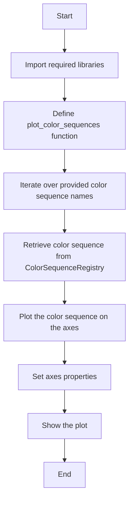

## 类结构

```
matplotlib.pyplot (module)
├── plot_color_sequences (function)
│   ├── names (parameter)
│   ├── ax (parameter)
│   └── ...
└── ... 
```

## 全局变量及字段


### `mpl`
    
Matplotlib module providing comprehensive data visualization and plotting tools.

类型：`module`
    


### `plt`
    
Matplotlib pyplot module providing a MATLAB-like interface for plotting.

类型：`module`
    


### `np`
    
NumPy module providing support for large, multi-dimensional arrays and matrices, along with a collection of mathematical functions to operate on these arrays.

类型：`module`
    


### `fig`
    
Matplotlib figure object representing a figure containing a set of axes.

类型：`matplotlib.figure.Figure`
    


### `ax`
    
Matplotlib axes object representing a single plot within a figure.

类型：`matplotlib.axes.Axes`
    


### `built_in_color_sequences`
    
List of built-in color sequence names that can be used in the plot_color_sequences function.

类型：`list`
    


### `matplotlib.pyplot.fig`
    
Figure object used for plotting.

类型：`matplotlib.figure.Figure`
    


### `matplotlib.pyplot.ax`
    
Axes object used for plotting.

类型：`matplotlib.axes.Axes`
    


### `matplotlib.axes.Axes.spines`
    
Container for spines of the axes.

类型：`matplotlib.spines.SpineContainer`
    


### `matplotlib.axes.Axes.tick_params`
    
Function to set the properties of the axes ticks.

类型：`function`
    


### `matplotlib.axes.Axes.grid`
    
Function to enable or disable the grid on the axes.

类型：`function`
    


### `matplotlib.axes.Axes.scatter`
    
Function to create a scatter plot.

类型：`function`
    


### `matplotlib.axes.Axes.set_yticks`
    
Function to set the y-axis ticks.

类型：`function`
    


### `matplotlib.axes.Axes.set_yticklabels`
    
Function to set the y-axis tick labels.

类型：`function`
    


### `matplotlib.axes.Axes.set_xaxis`
    
Function to set the x-axis properties.

类型：`function`
    


### `matplotlib.axes.Axes.set_spines`
    
Function to set the visibility of the spines.

类型：`function`
    


### `matplotlib.pyplot.set_title`
    
Function to set the title of the figure.

类型：`function`
    


### `matplotlib.pyplot.show`
    
Function to display the figure.

类型：`function`
    


### `matplotlib.color.color_sequences`
    
Dictionary containing registered color sequences by name.

类型：`dict`
    
    

## 全局函数及方法


### plot_color_sequences

Display each named color sequence horizontally on the supplied axes.

参数：

- `names`：`list`，A list of names of the color sequences to be plotted.
- `ax`：`matplotlib.axes.Axes`，The axes on which to display the color sequences.

返回值：`None`，This function does not return any value.

#### 流程图

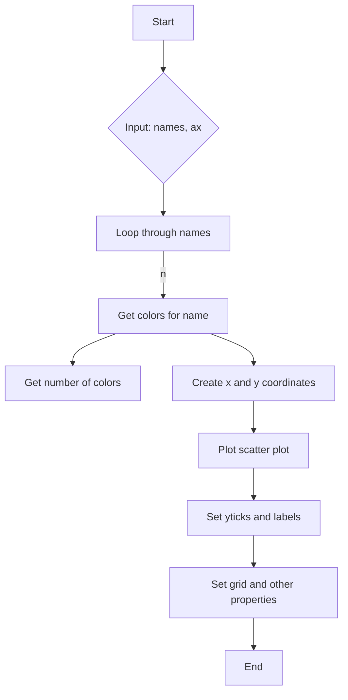

#### 带注释源码

```python
def plot_color_sequences(names, ax):
    # Display each named color sequence horizontally on the supplied axes.

    for n, name in enumerate(names):
        colors = mpl.color_sequences[name]
        n_colors = len(colors)
        x = np.arange(n_colors)
        y = np.full_like(x, n)

        ax.scatter(x, y, facecolor=colors, edgecolor='dimgray', s=200, zorder=2)

    ax.set_yticks(range(len(names)), labels=names)
    ax.grid(visible=True, axis='y')
    ax.yaxis.set_inverted(True)
    ax.xaxis.set_visible(False)
    ax.spines[:].set_visible(False)
    ax.tick_params(left=False)
```


### `subplots`

创建一个图形和一个轴。

参数：

- `figsize`：`tuple`，图形的大小（宽，高）。
- `layout`：`str`，图形布局的名称。

返回值：`fig`：`Figure`对象，图形对象。
`ax`：`AxesSubplot`对象，轴对象。

#### 流程图

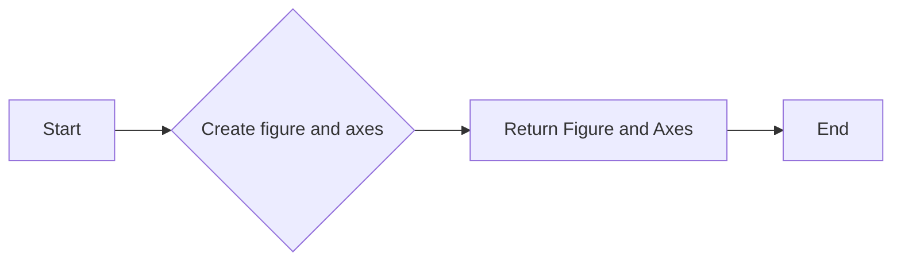

#### 带注释源码

```python
fig, ax = plt.subplots(figsize=(6.4, 9.6), layout='constrained')
```


### `plot_color_sequences`

绘制颜色序列。

参数：

- `names`：`list`，颜色序列名称列表。
- `ax`：`AxesSubplot`对象，轴对象。

返回值：无。

#### 流程图

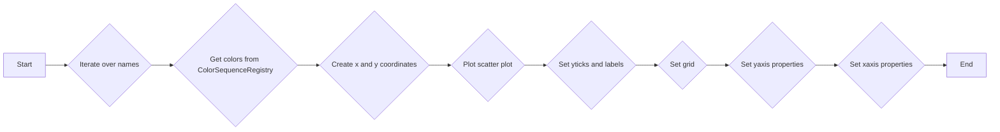

#### 带注释源码

```python
def plot_color_sequences(names, ax):
    for n, name in enumerate(names):
        colors = mpl.color_sequences[name]
        n_colors = len(colors)
        x = np.arange(n_colors)
        y = np.full_like(x, n)

        ax.scatter(x, y, facecolor=colors, edgecolor='dimgray', s=200, zorder=2)

    ax.set_yticks(range(len(names)), labels=names)
    ax.grid(visible=True, axis='y')
    ax.yaxis.set_inverted(True)
    ax.xaxis.set_visible(False)
    ax.spines[:].set_visible(False)
    ax.tick_params(left=False)
```


### matplotlib.pyplot.scatter

matplotlib.pyplot.scatter 是一个用于在二维坐标系中绘制散点图的函数。

参数：

- `x`：`array_like`，散点在 x 轴上的位置。
- `y`：`array_like`，散点在 y 轴上的位置。
- `s`：`float` 或 `array_like`，散点的大小。
- `c`：`color` 或 `sequence`，散点的颜色。
- `edgecolors`：`color` 或 `sequence`，散点边缘的颜色。
- `linewidths`：`float` 或 `array_like`，散点边缘的宽度。
- ` marker`：`str` 或 `path`，散点的标记形状。
- `alpha`：`float`，散点的透明度。
- `zorder`：`float`，散点的 z 轴顺序。

返回值：`Axes` 对象，包含绘制的散点图。

#### 流程图


#### 带注释源码

```python
import matplotlib.pyplot as plt
import numpy as np

def plot_color_sequences(names, ax):
    # Display each named color sequence horizontally on the supplied axes.

    for n, name in enumerate(names):
        colors = mpl.color_sequences[name]
        n_colors = len(colors)
        x = np.arange(n_colors)
        y = np.full_like(x, n)

        ax.scatter(x, y, facecolor=colors, edgecolor='dimgray', s=200, zorder=2)

    ax.set_yticks(range(len(names)), labels=names)
    ax.grid(visible=True, axis='y')
    ax.yaxis.set_inverted(True)
    ax.xaxis.set_visible(False)
    ax.spines[:].set_visible(False)
    ax.tick_params(left=False)
```


### `matplotlib.pyplot.set_title`

`matplotlib.pyplot.set_title` 是一个用于设置图表标题的函数。

参数：

- `s`：`str`，图表标题的文本内容。
- `fontdict`：`dict`，可选，用于设置标题的字体属性，如字体大小、颜色等。
- `loc`：`str`，可选，指定标题的位置，如 'left', 'right', 'center' 等。
- `pad`：`float`，可选，指定标题与图表边缘的距离。

返回值：`None`

#### 流程图

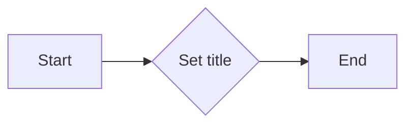

#### 带注释源码

```python
def set_title(self, s=None, fontdict=None, loc='center', pad=5, **kwargs):
    """
    Set the title of the axes.

    Parameters
    ----------
    s : str, optional
        The title of the axes. If None, the current title is removed.
    fontdict : dict, optional
        Dictionary with font properties like size, color, etc.
    loc : str, optional
        Position of the title. 'left', 'right', 'center', 'best', or 'default'.
    pad : float, optional
        Padding between the title and the axes border.

    Returns
    -------
    None
    """
    # Implementation details are omitted for brevity.
```


### plot_color_sequences

Display each named color sequence horizontally on the supplied axes.

参数：

- `names`：`list`，A list of names of the color sequences to be displayed.
- `ax`：`matplotlib.axes.Axes`，The axes on which to display the color sequences.

返回值：`None`，This function does not return any value.

#### 流程图

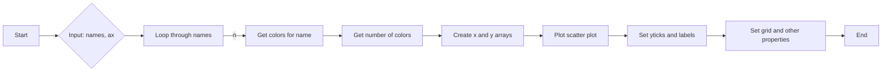

#### 带注释源码

```python
def plot_color_sequences(names, ax):
    # Display each named color sequence horizontally on the supplied axes.

    for n, name in enumerate(names):
        colors = mpl.color_sequences[name]
        n_colors = len(colors)
        x = np.arange(n_colors)
        y = np.full_like(x, n)

        ax.scatter(x, y, facecolor=colors, edgecolor='dimgray', s=200, zorder=2)

    ax.set_yticks(range(len(names)), labels=names)
    ax.grid(visible=True, axis='y')
    ax.yaxis.set_inverted(True)
    ax.xaxis.set_visible(False)
    ax.spines[:].set_visible(False)
    ax.tick_params(left=False)
```


### plot_color_sequences

This function plots all the colors from a named color sequence horizontally on the provided axes.

参数：

- `names`：`list`，A list of names of the color sequences to be plotted.
- `ax`：`matplotlib.axes.Axes`，The axes on which to plot the color sequences.

返回值：`None`，This function does not return any value.

#### 流程图


#### 带注释源码

```python
def plot_color_sequences(names, ax):
    # Display each named color sequence horizontally on the supplied axes.

    for n, name in enumerate(names):
        colors = mpl.color_sequences[name]
        n_colors = len(colors)
        x = np.arange(n_colors)
        y = np.full_like(x, n)

        ax.scatter(x, y, facecolor=colors, edgecolor='dimgray', s=200, zorder=2)

    ax.set_yticks(range(len(names)), labels=names)
    ax.grid(visible=True, axis='y')
    ax.yaxis.set_inverted(True)
    ax.xaxis.set_visible(False)
    ax.spines[:].set_visible(False)
    ax.tick_params(left=False)
```


### matplotlib.axes.Axes.scatter

`matplotlib.axes.Axes.scatter` 方法用于在二维笛卡尔坐标系中绘制散点图。

参数：

- `x`：`array_like`，散点在 x 轴上的位置。
- `y`：`array_like`，散点在 y 轴上的位置。
- `s`：`float` 或 `array_like`，散点的大小。
- `c`：`color` 或 `sequence`，散点的颜色。
- `edgecolors`：`color` 或 `sequence`，散点边缘的颜色。
- `linewidths`：`float` 或 `array_like`，散点边缘的宽度。
- ` marker`：`str` 或 `path`，散点的标记形状。
- `clip_on`：`bool`，是否将散点限制在轴的界限内。
- `zorder`：`float`，散点的 z 轴顺序。

返回值：`scatter` 对象。

#### 流程图

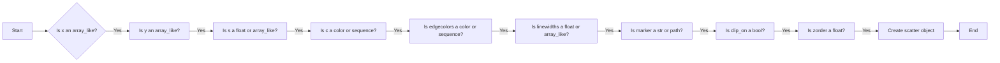

#### 带注释源码

```python
def scatter(self, x, y=None, s=None, c=None, edgecolors=None, linewidths=None, marker=None, clip_on=True, zorder=3, **kwargs):
    # Implementation details...
```


### matplotlib.axes.Axes.set_yticks

`matplotlib.axes.Axes.set_yticks` 方法用于设置 y 轴的刻度值和标签。

参数：

- `ticks`：`int` 或 `list`，指定 y 轴的刻度值。
- `labels`：`str` 或 `list`，指定与刻度值对应的标签。

返回值：无

#### 流程图

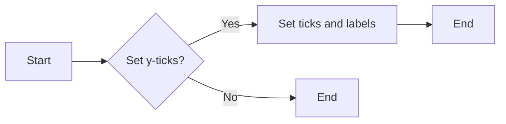

#### 带注释源码

```python
def set_yticks(self, ticks, labels=None):
    """
    Set the y-axis ticks and optionally the labels.

    Parameters
    ----------
    ticks : int or list of int
        The y-axis ticks to set. If an integer is given, it is interpreted as the
        number of ticks to generate between the minimum and maximum y-axis values.
        If a list is given, it is interpreted as the explicit tick locations.
    labels : list of str, optional
        The labels corresponding to the ticks. If not provided, the default labels
        are used.

    Returns
    -------
    None
    """
    # Implementation details are omitted for brevity.
```


### matplotlib.axes.Axes.set_yticklabels

`matplotlib.axes.Axes.set_yticklabels` 方法用于设置 y 轴的刻度标签。

参数：

- `labels`：`list` 或 `numpy.ndarray`，包含刻度标签的列表或数组。

返回值：无

#### 流程图

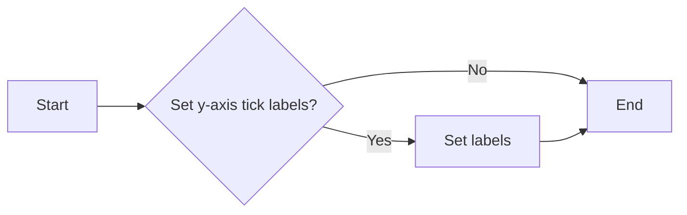

#### 带注释源码

```python
def set_yticklabels(self, labels):
    """
    Set the y-axis tick labels.

    Parameters
    ----------
    labels : list or numpy.ndarray
        The labels for the y-axis ticks.

    Returns
    -------
    None
    """
    # Set the y-axis tick labels
    self._set_ticklabels('y', labels)
``` 


### matplotlib.axes.Axes.set_xaxis

`matplotlib.axes.Axes.set_xaxis` 方法用于设置 x 轴的属性。

参数：

- `ticks`：`array_like`，可选。x 轴的刻度值。
- `labels`：`array_like`，可选。与 `ticks` 对应的标签。
- `tick_params`：`TickParams`，可选。用于设置 x 轴刻度参数的字典。
- `axis`：`str`，可选。指定哪个轴的属性被设置，默认为 `'both'`。

返回值：`AxesSubplot` 对象。

#### 流程图

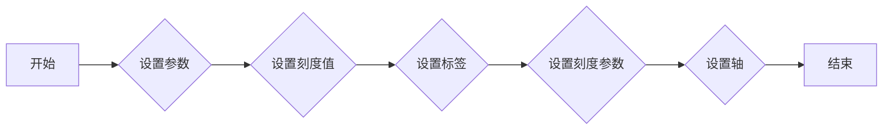

#### 带注释源码

```python
def set_xaxis(self, ticks=None, labels=None, tick_params=None, axis='both'):
    """
    Set the xaxis properties.

    Parameters
    ----------
    ticks : array_like, optional
        The xaxis tick locations.
    labels : array_like, optional
        The labels for the xaxis ticks.
    tick_params : TickParams, optional
        Dictionary of parameters to use for setting the xaxis tick parameters.
    axis : str, optional
        The axis to set the properties for. Default is 'both'.

    Returns
    -------
    AxesSubplot
        The AxesSubplot instance with the xaxis properties set.
    """
    # Implementation details...
    return self
```


### matplotlib.axes.Axes.set_spines

`set_spines` 方法用于设置轴的边框线（spines）的可见性。

参数：

- `visible`：`bool`，设置边框线的可见性。如果为 `True`，则边框线可见；如果为 `False`，则边框线不可见。

返回值：无

#### 流程图

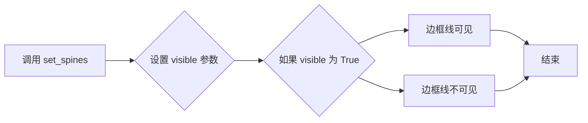

#### 带注释源码

```python
def set_spines(self, visible=True):
    """
    Set the visibility of the spines.

    Parameters
    ----------
    visible : bool, optional
        If True, the spines will be visible. If False, the spines will be invisible.

    Returns
    -------
    None
    """
    for spine in self.spines.values():
        spine.set_visible(visible)
```


### plot_color_sequences

This function plots all the named color sequences horizontally on the provided axes.

参数：

- `names`：`list`，A list of names of the color sequences to be plotted.
- `ax`：`matplotlib.axes.Axes`，The axes on which to plot the color sequences.

返回值：`None`，This function does not return any value.

#### 流程图

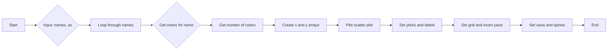

#### 带注释源码

```python
def plot_color_sequences(names, ax):
    # Display each named color sequence horizontally on the supplied axes.

    for n, name in enumerate(names):
        colors = mpl.color_sequences[name]
        n_colors = len(colors)
        x = np.arange(n_colors)
        y = np.full_like(x, n)

        ax.scatter(x, y, facecolor=colors, edgecolor='dimgray', s=200, zorder=2)

    ax.set_yticks(range(len(names)), labels=names)
    ax.grid(visible=True, axis='y')
    ax.yaxis.set_inverted(True)
    ax.xaxis.set_visible(False)
    ax.spines[:].set_visible(False)
    ax.tick_params(left=False)
```


## 关键组件


### 张量索引与惰性加载

张量索引与惰性加载允许对大型数据集进行高效访问，通过仅在需要时计算数据，减少内存消耗。

### 反量化支持

反量化支持使得模型可以在量化过程中保持精度，提高模型在资源受限环境下的性能。

### 量化策略

量化策略定义了如何将浮点数转换为固定点数，以减少模型大小和提高推理速度。


## 问题及建议


### 已知问题

-   **全局变量和函数的文档缺失**：代码中使用了全局变量和函数，但没有提供相应的文档说明，这可能导致其他开发者难以理解和使用。
-   **代码复用性低**：`plot_color_sequences` 函数在主程序中只被调用一次，且没有提供参数化输入，这限制了代码的复用性。
-   **错误处理不足**：代码中没有包含错误处理机制，例如，如果提供的颜色序列名称不存在，程序可能会抛出异常。

### 优化建议

-   **添加文档**：为全局变量和函数添加详细的文档注释，包括它们的用途、参数和返回值。
-   **提高代码复用性**：将 `plot_color_sequences` 函数设计为更通用的函数，允许传入不同的颜色序列名称和轴对象。
-   **添加错误处理**：在函数中添加错误处理逻辑，例如，检查颜色序列名称是否存在，并在不存在时提供友好的错误信息。
-   **代码风格一致性**：检查代码风格的一致性，例如，变量命名、缩进和注释格式。
-   **性能优化**：如果颜色序列数据量很大，可以考虑使用更高效的数据结构或算法来处理数据。


## 其它


### 设计目标与约束

- 设计目标：实现一个能够展示Matplotlib内置颜色序列的函数，并允许用户自定义颜色序列。
- 约束条件：必须使用Matplotlib库进行绘图，且颜色序列数据来源于Matplotlib的`ColorSequenceRegistry`。

### 错误处理与异常设计

- 错误处理：在函数`plot_color_sequences`中，如果传入的颜色序列名称不在`ColorSequenceRegistry`中注册，将抛出`KeyError`异常。
- 异常设计：通过捕获`KeyError`异常，向用户显示错误信息，并提示正确的颜色序列名称。

### 数据流与状态机

- 数据流：用户定义的颜色序列名称通过参数`names`传入函数`plot_color_sequences`，函数内部通过`ColorSequenceRegistry`获取颜色序列数据，并绘制到图表中。
- 状态机：该代码没有使用状态机，因为其功能相对简单，没有复杂的状态转换。

### 外部依赖与接口契约

- 外部依赖：Matplotlib库和NumPy库。
- 接口契约：`plot_color_sequences`函数的接口契约定义了输入参数`names`和输出参数`ax`，其中`names`是颜色序列名称列表，`ax`是Matplotlib的`Axes`对象。


    