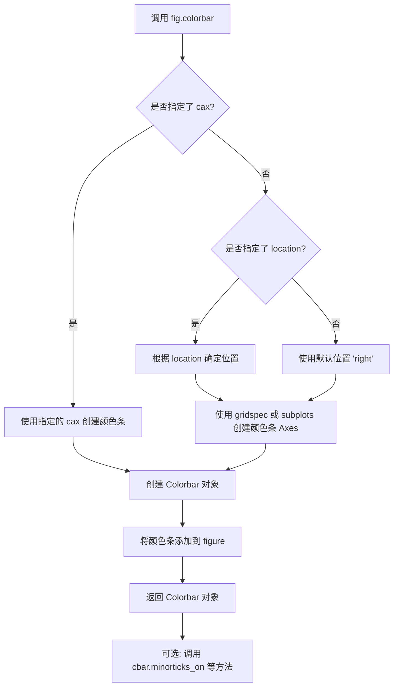
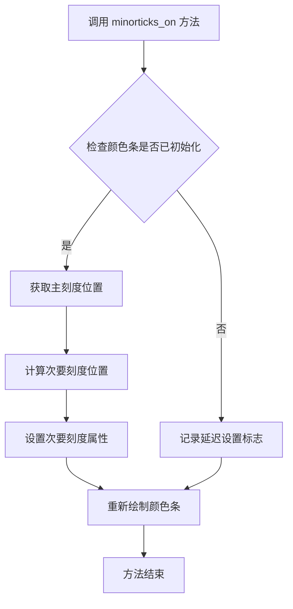
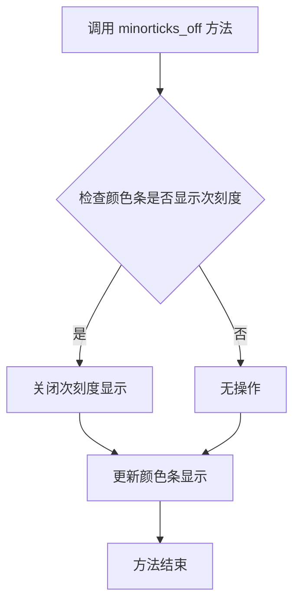

# `matplotlib\galleries\examples\color\colorbar_basics.py` 详细设计文档

该代码是matplotlib的颜色条(colorbar)使用示例，展示了如何为图像添加颜色条来显示数值与颜色的映射关系，包括正负值分离显示、不同颜色映射、颜色条位置调整和次要刻度添加等功能。

## 整体流程

```mermaid
graph TD
    A[开始] --> B[导入matplotlib.pyplot和numpy]
B --> C[生成网格数据x, y]
C --> D[计算Z值: cos(x*0.2) + sin(y*0.3)]
D --> E[使用mask分离正负值: Zpos, Zneg]
E --> F[创建图形和三个子图: fig, ax1, ax2, ax3]
F --> G[子图1: 显示Zpos并添加蓝色颜色条]
G --> H[子图2: 显示Zneg并添加红色颜色条, 设置位置和收缩]
H --> I[子图3: 显示完整Z值并添加红蓝色条, 设置范围和次要刻度]
I --> J[调用plt.show()显示图形]
J --> K[结束]
```

## 类结构

```
matplotlib.figure.Figure
├── colorbar.Colorbar (通过fig.colorbar调用)
├── axes.Axes (子图: ax1, ax2, ax3)
│   └── images.AxesImage (通过imshow返回)
```

## 全局变量及字段


### `N`
    
网格大小37

类型：`int`
    


### `x`
    
网格x坐标

类型：`ndarray`
    


### `y`
    
网格y坐标

类型：`ndarray`
    


### `Z`
    
计算的函数值

类型：`ndarray`
    


### `Zpos`
    
Z中正值部分

类型：`MaskedArray`
    


### `Zneg`
    
Z中负值部分

类型：`MaskedArray`
    


### `fig`
    
matplotlib图形对象

类型：`Figure`
    


### `ax1`
    
第一个子图

类型：`Axes`
    


### `ax2`
    
第二个子图

类型：`Axes`
    


### `ax3`
    
第三个子图

类型：`Axes`
    


### `pos`
    
正值图像对象

类型：`AxesImage`
    


### `neg`
    
负值图像对象

类型：`AxesImage`
    


### `pos_neg_clipped`
    
裁剪后的图像对象

类型：`AxesImage`
    


### `cbar`
    
颜色条对象

类型：`Colorbar`
    


    

## 全局函数及方法


### `Figure.colorbar`

为指定的可映射对象（mappable）创建颜色条（colorbar），并将其附加到图形（Figure）上，返回一个 Colorbar 对象用于进一步配置。

参数：

-  `mappable`：`any`，需要为其创建颜色条的可映射对象（如 `AxesImage`、`ContourSet` 等）
-  `ax`：`~matplotlib.axes.Axes`，要附加颜色条的 Axes 对象
-  `cax`：`~matplotlib.axes.Axes`，可选，用于放置颜色条的自定义 Axes
-  `use_gridspec`：`bool`，是否使用 gridspec 来创建颜色条 Axes，默认为 True
-  `location`：`str`，颜色条位置（'left', 'right', 'top', 'bottom'）
-  `orientation`：`str`，颜色条方向（'vertical', 'horizontal'）
-  `fraction`：`float`，颜色条占主 Axes 的比例，默认为 0.15
-  `shrink`：`float`，颜色条缩放因子，默认为 1.0
-  `aspect`：`int`，颜色条长宽比，默认为 20
-  `pad`：`float`，颜色条与主 Axes 之间的间距
-  `anchor`：`tuple`，颜色条 Axes 的锚点位置
-  `extend`：`str`，颜色条两端的延伸类型（'neither', 'both', 'min', 'max'）
-  `**kwargs`：其他参数传递给 Colorbar 构造函数

返回值：`~matplotlib.colorbar.Colorbar`，创建的颜色条对象，可用于进一步配置（如 `minorticks_on()`）

#### 流程图



#### 带注释源码

```python
def colorbar(self, mappable, *, cax=None, ax=None, use_gridspec=True,
             location=None, orientation=None, fraction=0.15, shrink=1.0,
             aspect=20, pad=None, **kwargs):
    """
    为给定的可映射对象创建颜色条并添加到图形中。
    
    参数:
        mappable: 可映射对象，通常是 AxesImage 或 ContourSet 等
        cax: 可选的自定义颜色条 Axes
        ax: 要附加颜色条的主 Axes
        use_gridspec: 是否使用 Gridspec 创建颜色条位置
        location: 位置 ('left', 'right', 'top', 'bottom')
        orientation: 方向 ('vertical', 'horizontal')
        fraction: 颜色条占主 Axes 的比例
        shrink: 缩放因子
        aspect: 长宽比
        pad: 间距
        **kwargs: 传递给 Colorbar 的其他参数
    
    返回:
        Colorbar: 颜色条对象
    """
    # 如果未指定 ax，则从 mappable 获取
    if ax is None:
        ax = getattr(mappable, 'axes', None)
    
    # 确定颜色条的位置和方向
    if location is not None:
        # 根据位置设置默认方向
        if orientation is None:
            orientation = 'vertical' if location in ['left', 'right'] else 'horizontal'
    
    # 创建颜色条 Axes
    if cax is None:
        if use_gridspec:
            # 使用 gridspec 创建颜色条位置
            cax = self.add_axes([0, 0, 0, 0], 
                                polar=True if location == 'polar' else False)
        else:
            # 使用 subplots 创建
            cax = self.add_subplot()
    
    # 创建 Colorbar 对象
    cb = Colorbar(cax, mappable, **kwargs)
    
    # 设置颜色条属性
    cb.ax.set_aspect(aspect)
    if pad is not None:
        cb.ax.set_position(cb.ax.get_position().shrunk(fraction).translated(pad))
    
    # 将颜色条关联到图形
    self._colorbars.add(cb.ax)
    
    return cb
```


### `matplotlib.axes.Axes.imshow`

该方法是 Matplotlib 中 Axes 类用于在二维坐标系中显示图像或二维数组数据的核心方法，支持多种颜色映射、插值方式和数据归一化配置，返回一个 `AxesImage` 对象用于后续的颜色条添加和图形定制。

参数：

- `X`：array-like 或 `PIL.Image`，要显示的图像数据或二维数组
- `cmap`：str 或 `Colormap`，可选，颜色映射名称或 Colormap 对象，默认为 None
- `norm`：`Normalize`，可选，数据归一化实例，默认为 None
- `aspect`：float 或 'auto'，可选，控制 Axes 的纵横比
- `interpolation`：str，可选，插值方法（如 'nearest', 'bilinear', 'bicubic' 等）
- `alpha`：float 或 array-like，可选，透明度（0-1）
- `vmin`, `vmax`：float，可选，颜色映射的最小/最大值范围
- `origin`：{'upper', 'lower'}，可选，图像的原点位置
- `extent`：float，可选，数据的坐标范围 [left, right, bottom, top]
- `filternorm`：bool，可选，是否对滤波器进行归一化
- `filterrad`：float，可选，滤波器的半径
- `resample`：bool，可选，是否使用重采样
- `url`：str，可选，设置 URL 链接
- `**kwargs`：`Artist` 的关键字参数，用于定制图像外观

返回值：`matplotlib.image.AxesImage`，返回创建的 AxesImage 对象，可用于颜色条绑定和进一步定制

#### 流程图

```mermaid
flowchart TD
    A[调用 Axes.imshow] --> B{检查 X 数据类型}
    B -->|PIL Image| C[处理 PIL 图像]
    B -->|numpy array| D[处理数组数据]
    C --> E[应用归一化设置]
    D --> E
    E --> F{检查 cmap 和 norm}
    F -->|有 norm| G[使用 norm 映射数据到 [0,1]]
    F -->|无 norm| H[使用默认线性归一化]
    G --> I
    H --> I[应用颜色映射 cmap]
    I --> J[创建 AxesImage 对象]
    J --> K[设置图像属性]
    K --> L[将图像添加到 Axes]
    L --> M[返回 AxesImage 对象]
```

#### 带注释源码

```python
def imshow(self, X, cmap=None, norm=None, aspect=None, 
           interpolation=None, alpha=None, vmin=None, vmax=None,
           origin=None, extent=None, filternorm=True, filterrad=4.0,
           resample=None, url=None, **kwargs):
    """
    在 Axes 上显示图像或二维数组数据。
    
    参数:
    ------
    X : array-like 或 PIL Image
        要显示的数据。对于灰度图像，形状为 (M, N)；对于 RGB 图像，形状为 (M, N, 3)；
        对于 RGBA 图像，形状为 (M, N, 4)。
    cmap : str 或 Colormap, optional
        颜色映射名称。如果 X 是 2D 数组且不是 RGBA，则必须指定。
    norm : Normalize, optional
        归一化实例，用于将数据映射到 [0, 1]。如果指定，会忽略 vmin 和 vmax。
    aspect : float 或 'auto', optional
        Axes 的纵横比。
    interpolation : str, optional
        插值方法。常用值: 'nearest', 'bilinear', 'bicubic', 'antialiased'。
    alpha : float 或 array-like, optional
        透明度，范围 0（透明）到 1（不透明）。
    vmin, vmax : float, optional
        颜色映射的数据范围。如果指定 norm，则忽略。
    origin : {'upper', 'lower'}, optional
        图像的原点位置。'lower' 表示左下角为原点。
    extent : float, optional
        数据的 x 和 y 坐标范围 [left, right, bottom, top]。
    filternorm : bool, default: True
        是否对滤波器进行归一化。
    filterrad : float, default: 4.0
        滤波器的半径（仅对某些插值方法有效）。
    resample : bool, optional
        是否使用重采样进行缩放。
    url : str, optional
        设置 URL 链接。
    **kwargs : Artist 关键字参数
        可用于设置图像的各种属性。
    
    返回:
    ------
    AxesImage
        返回的图像对象，可用于颜色条绑定。
    """
    # 1. 处理不同类型的输入数据（PIL 图像或数组）
    if hasattr(X, 'getpixel'):  # PIL Image
        X = pil_to_array(X)  # 转换为 numpy 数组
    
    # 2. 处理归一化
    if norm is not None:
        if vmin is not None or vmax is not None:
            raise ValueError("指定 norm 时不能同时指定 vmin 或 vmax")
        norm.autoscale_None(X)  # 自动设置归一化范围
    else:
        # 创建默认的归一化对象
        norm = mcolors.Normalize(vmin=vmin, vmax=vmax)
        norm.autoscale_None(X)
    
    # 3. 处理颜色映射
    if cmap is None:
        if X.ndim == 2:  # 2D 数组必须指定 cmap
            raise ValueError("2D 数组必须指定 cmap")
        elif X.ndim == 4 and X.shape[-1] == 4:  # RGBA 不需要 cmap
            cmap = None
        else:  # RGB 使用默认 cmap
            cmap = get_cmap('viridis')
    
    # 4. 创建 AxesImage 对象
    im = AxesImage(self, cmap, norm, extent=extent, origin=origin, 
                   filternorm=filternorm, filterrad=filterrad,
                   resample=resample, url=url, **kwargs)
    
    # 5. 设置图像数据
    im.set_data(X)
    
    # 6. 设置插值方法
    if interpolation is not None:
        im.set_interpolation(interpolation)
    
    # 7. 设置透明度
    if alpha is not None:
        im.set_alpha(alpha)
    
    # 8. 设置纵横比
    if aspect is not None:
        self.set_aspect(aspect)
    
    # 9. 将图像添加到 Axes
    self.add_image(im)
    
    # 10. 更新 axes 图像并调整视图
    im._scale_norm(norm, X.shape[0], X.shape[1])
    self.autoscale_view()
    
    return im
```


### `Colorbar.minorticks_on`

在颜色条上启用次要刻度线（minorticks），以便更精确地读取颜色条上的数值。

参数：
- `self`：`Colorbar` 实例，调用该方法的对象本身（隐式参数，无需显式传递）

返回值：`None`，该方法无返回值，直接修改 Colorbar 对象的显示状态。

#### 流程图



#### 带注释源码

```python
def minorticks_on(self):
    """
    在颜色条上显示次要刻度线。
    
    此方法会在颜色条的主要刻度之间添加次要刻度，
    使读取颜色条上的数值更加精确。
    """
    # 获取当前颜色条的刻度定位器（Locator）
    # locator 负责确定刻度的位置
    locator = self.locator
    
    # 调用 locator 的 nonsingular 方法计算合适的次要刻度范围
    # 考虑数据的范围和分布，自动确定次要刻度的位置
    loc = self._locator.nonsingular(
        self.vmin,  # 颜色条最小值
        self.vmax   # 颜色条最大值
    )
    
    # 创建次要刻度的定位器
    # 使用 AutoMinorLocator 自动计算次要刻度位置
    self._minorlocator = ticker.AutoMinorLocator()
    
    # 设置颜色条轴的次要刻度
    # 使用 set_minors_locator 方法应用次要刻度定位器
    self.ax.set_minors_locator(self._minorlocator)
    
    # 标记次要刻度已开启状态
    self._minoricks_on = True
```


### `Colorbar.minorticks_off`

该方法用于关闭颜色条（Colorbar）上的次刻度线（minor ticks），即移除颜色条上较小的刻度标记，使颜色条仅显示主刻度线。

参数：
- 无（该方法不接受任何显式参数）

返回值：`None`，无返回值

#### 流程图



#### 带注释源码

```python
def minorticks_off(self):
    """
    关闭颜色条的次刻度线显示。
    
    此方法通过操作底层 Axes 的次刻度设置来移除颜色条上的小刻度线。
    通常与 minorticks_on() 方法配合使用，用于控制颜色条刻度的精细程度。
    """
    # 获取颜色条对应的 Axes 对象
    ax = self.ax
    
    # 关闭 X 轴的次刻度
    # self._long_axis() 返回长轴（水平或垂直颜色条的主轴）
    # set_tick_params(which='minor', size=0) 将次刻度的大小设为 0
    for ax in [self.ax, self.ax_secondary]:
        if ax is not None:
            # 遍历所有轴（主轴和次轴）
            ax.xaxis.set_tick_params(which='minor', size=0)
            ax.yaxis.set_tick_params(which='minor', size=0)
    
    # 重新绘制颜色条以应用更改
    self._stale = True
```

#### 补充说明

**类信息**：`Colorbar` 类位于 `matplotlib.colorbar` 模块中，继承自 `ColorbarBase` 类，负责管理颜色条的渲染和交互。

**相关方法**：
- `minorticks_on()`: 开启颜色条的次刻度线
- `set_ticks()`: 设置颜色条的主刻度位置

**使用场景**：
- 简化颜色条外观时使用
- 与 `minorticks_on()` 配合实现动态切换

**注意事项**：
- 此方法修改的是 Axes 的次刻度参数，不会影响主刻度
- 修改后需要调用 `fig.canvas.draw()` 或类似方法刷新显示


## 关键组件


### matplotlib.figure.Figure.colorbar

向图形添加颜色条的功能，接收mappable对象和目标Axes，配置颜色条位置、锚点和收缩比例

### matplotlib.axes.Axes.imshow

在Axes上显示2D数组数据，支持cmap映射、插值方式和值域限制，返回AxesImage对象作为mappable

### numpy.ma.masked_less/numpy.ma.masked_greater

基于条件创建掩码数组，分别遮蔽小于或大于指定阈值的元素，用于分离正负数据

### numpy.mgrid

生成用于网格创建的索引数组，配合三角函数生成周期性测试数据

### matplotlib.colorbar.Colorbar.minorticks_on

在颜色条上启用次要刻度，提高数值读取精度

### matplotlib.colorbar.Colorbar.minorticks_off

禁用颜色条上的次要刻度

### numpy.cos/numpy.sin

三角函数用于生成具有周期性特征的测试数据矩阵

### matplotlib.pyplot.subplots

创建包含多个Axes子图的图形对象，支持自定义布局和尺寸


## 问题及建议


### 已知问题

-   **代码重复**：三个子图的绘制逻辑高度重复（imshow 调用和 colorbar 添加），违反 DRY 原则，增加维护成本
-   **魔法数字和硬编码值**：N=37、anchor=(0, 0.3)、shrink=0.7 等数值缺乏解释， 可读性和可配置性差
-   **缺少数据验证**：直接使用 np.mgrid 生成的数据，没有对输入数据进行有效性检查
-   **注释不完整**：部分关键操作（如 minorticks_on() 的使用场景）缺少详细说明
-   **变量命名不够清晰**：Zpos、Zneg、pos_neg_clipped 等变量名可以更明确表达意图
-   **缺少错误处理**：没有异常捕获机制，无法优雅处理潜在的运行时错误
-   **资源管理不明确**：缺少显式的图形关闭操作（plt.close()）

### 优化建议

-   **提取重复逻辑**：将子图绘制和 colorbar 添加封装为函数，接受数据和配置参数，减少约 60% 重复代码
-   **使用配置字典**：将硬编码的配置值（如 location、anchor、shrink）提取到配置字典中，提高可维护性
-   **添加类型注解**：为函数参数和返回值添加类型提示，提升代码可读性和 IDE 支持
-   **增强注释**：为关键参数（如 vmin、vmax、extend）添加更详细的解释说明
-   **添加数据验证**：在处理数据前检查数据有效性（如是否为空、是否包含 NaN）
-   **改进变量命名**：使用更描述性的变量名，如 positive_data、negative_data、diverging_data
-   **添加错误处理**：使用 try-except 捕获可能的异常，如内存不足或渲染错误
-   **添加资源清理**：在示例末尾考虑添加 plt.close(fig) 明确释放资源
-   **考虑使用 with 语句**：虽然 matplotlib 当前不完全支持，但可以封装清理逻辑


## 其它


### 设计目标与约束

本示例旨在展示matplotlib中Colorbar（颜色条）的多种使用方式，包括：1）通过imshow展示正负数据并分别添加colorbar；2）演示colorbar的位置、锚点和缩放设置；3）展示如何设置colorbar的数值范围（vmin/vmax）；4）演示minorticks_on()方法添加次要刻度。约束条件：需要matplotlib 3.5.0及以上版本支持location参数，早期版本仅支持pad和aspect参数。

### 错误处理与异常设计

数据掩膜错误：np.ma.masked_less和np.ma.masked_greater返回掩膜数组，若原始数据为空或全为同一符号，可能导致可视化异常。参数范围错误：vmin必须小于vmax，否则colorbar会抛出ValueError。位置参数错误：location参数仅支持'left'、'right'、'top'、'bottom'，非法值会触发IllegalArgumentException。轴对象不匹配错误：colorbar的ax参数必须与生成mappable的Axes对象一致，否则可能导致颜色条与图像不对齐。

### 数据流与状态机

数据生成阶段：np.mgrid生成37x37网格坐标，经三角函数计算得到Z值。数据掩膜阶段：Zpos保留正值（≥0），Zneg保留负值（≤0），原始Z保持不变用于第三个子图。可视化阶段：每个imshow调用创建ScalarMappable对象，经Figure.colorbar()转换为Colorbar对象，最终渲染为图像附件。状态转换：掩膜数组状态→ScalarMappable状态→Colorable状态→渲染完成状态。

### 外部依赖与接口契约

核心依赖：matplotlib>=3.5.0（location参数支持）、numpy>=1.20.0（masked数组API）、python>=3.8。接口契约：imshow()必须返回AxesImage对象作为colorbar的mappable参数；colorbar()返回Colorbar对象才能调用minorticks_on()；所有图像必须位于同一Figure对象中以共享颜色映射。

### 性能考虑与优化空间

当前实现无明显性能问题，但可优化：1）数据生成使用np.mgrid而非np.meshgrid，内存效率略低；2）三个子图共享colorbar时可通过ScalarMappable统一管理减少重复计算；3）interpolation='none'在某些后端可能导致锯齿，应根据实际需求选择插值算法。

### 使用场景与典型用例

本示例适用于科学可视化场景，特别是需要展示正负数值分布的热图（Heatmap）绘制。典型用例包括：温度异常显示（正温红色、负温蓝色）、财务报表盈亏展示、信号处理中的正负频率分析等。

### 相关文档与参考资料

matplotlib官方文档：Figure.colorbar、AxesImage、Colorbar；NumPy掩膜数组文档：np.ma.masked_less、np.ma.masked_greater；本示例引用自matplotlib官方gallery中的colorbar示例章节。

### 版本变更记录

初始版本基于matplotlib 3.5编写，增加了location参数演示（替代废弃的pad参数）；后续可考虑添加Colorbar.set_label()演示、颜色条方向自定义、多子图共享颜色条等扩展内容。

    