# `matplotlib\galleries\examples\color\colorbar_histogram.py` 详细设计文档

This code generates a colored histogram as an inset in a main plot, demonstrating the visualization of a distribution of values using a colormap.

## 整体流程

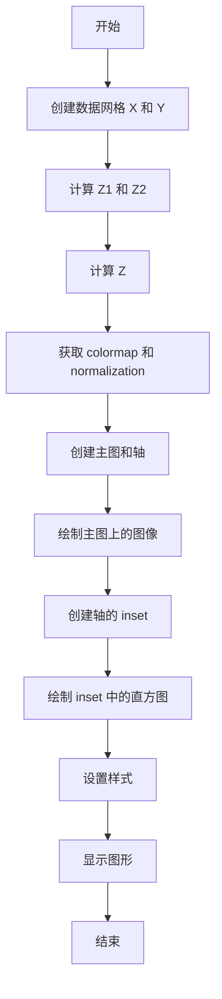

## 类结构

```
Histogram_as_colorbar (主模块)
```

## 全局变量及字段


### `delta`
    
The step size for the range of x and y values.

类型：`float`
    


### `x`
    
The x values for the meshgrid.

类型：`numpy.ndarray`
    


### `y`
    
The y values for the meshgrid.

类型：`numpy.ndarray`
    


### `X`
    
The x coordinates of the meshgrid.

类型：`numpy.ndarray`
    


### `Y`
    
The y coordinates of the meshgrid.

类型：`numpy.ndarray`
    


### `Z1`
    
The first surface data array.

类型：`numpy.ndarray`
    


### `Z2`
    
The second surface data array.

类型：`numpy.ndarray`
    


### `Z`
    
The combined surface data array.

类型：`numpy.ndarray`
    


### `bins`
    
The number of bins for the histogram.

类型：`int`
    


### `cmap`
    
The colormap to use for the histogram.

类型：`matplotlib.colors.Colormap`
    


### `bin_edges`
    
The bin edges for the histogram.

类型：`numpy.ndarray`
    


### `norm`
    
The normalization for the histogram.

类型：`matplotlib.colors.Normalize`
    


### `counts`
    
The counts for each bin in the histogram.

类型：`numpy.ndarray`
    


### `midpoints`
    
The midpoints of each bin in the histogram.

类型：`numpy.ndarray`
    


### `distance`
    
The distance between bin midpoints in the histogram.

类型：`float`
    


### `matplotlib.pyplot.Figure.fig`
    
The figure object.

类型：`matplotlib.figure.Figure`
    


### `matplotlib.pyplot.Axes.ax`
    
The axes object.

类型：`matplotlib.axes._subplots.AxesSubplot`
    


### `matplotlib.pyplot.Image.im`
    
The image object representing the surface plot.

类型：`matplotlib.images.Image`
    


### `matplotlib.pyplot.Axes.cax`
    
The axes object for the inset histogram.

类型：`matplotlib.axes._subplots.AxesSubplot`
    
    

## 全局函数及方法


### plt.imshow()

`plt.imshow()` 是一个用于绘制图像的函数，它可以将一个二维数组绘制为图像。

描述：

该函数用于将一个二维数组绘制为图像，通常用于显示图像或数据分布。

参数：

- `Z`：`numpy.ndarray`，要绘制的二维数组。
- `cmap`：`str` 或 `Colormap` 对象，颜色映射。
- `origin`：`str`，图像的起始位置，可以是 'upper' 或 'lower'。
- `extent`：`tuple`，图像的边界，格式为 (xmin, xmax, ymin, ymax)。
- `norm`：`Normalize` 对象，归一化对象。

返回值：`AxesImage` 对象，图像对象。

#### 流程图

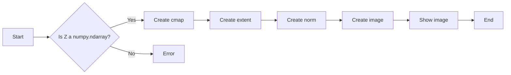

#### 带注释源码

```python
# main plot
fig, ax = plt.subplots(layout="constrained")
im = ax.imshow(Z, cmap=cmap, origin="lower", extent=[-3, 3, -3, 3], norm=norm)
```


### np.histogram

该函数用于计算数组中每个元素在给定范围内的直方图。

参数：

- `Z`：`numpy.ndarray`，输入数组，包含要计算直方图的值。
- `_`：`numpy.ndarray`，未使用，保留以匹配函数签名。

返回值：

- `counts`：`numpy.ndarray`，直方图的计数数组。
- `_`：`numpy.ndarray`，未使用，保留以匹配函数签名。

#### 流程图

```mermaid
graph LR
A[Start] --> B[Call np.histogram(Z)]
B --> C{Calculate histogram}
C --> D[Return counts and _]
D --> E[End]
```

#### 带注释源码

```python
counts, _ = np.histogram(Z, bins=bin_edges)
```


### matplotlib.colors.BoundaryNorm

`BoundaryNorm` is a normalization class used to map data values to colors in a colormap.

参数：

- `bins`：`int`，Number of bins for the histogram.
- `cmap`：`Colormap`，Colormap instance.

参数描述：

- `bins`：指定直方图的条形数。
- `cmap`：指定用于直方图的色彩映射。

返回值：`BoundaryNorm`，Boundary normalization instance.

返回值描述：

- 返回一个边界归一化实例，用于将数据值映射到颜色映射中的颜色。

#### 流程图

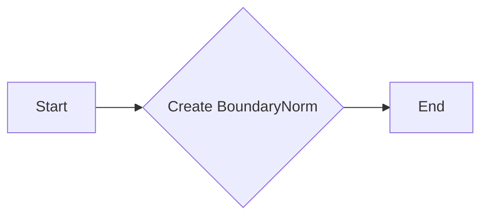

#### 带注释源码

```python
norm = mcolors.BoundaryNorm(bin_edges, cmap.N)
```


### plt.subplots

`plt.subplots` 是 Matplotlib 库中用于创建一个图形和轴对象的函数。

参数：

- `figsize`：`tuple`，图形的大小（宽度和高度），默认为 (6, 4)。
- `dpi`：`int`，图形的分辨率，默认为 100。
- `facecolor`：`color`，图形的背景颜色，默认为 'white'。
- `edgecolor`：`color`，图形的边缘颜色，默认为 'none'。
- `frameon`：`bool`，是否显示图形的边框，默认为 True。
- `num`：`int`，要创建的轴的数量，默认为 1。
- `gridspec_kw`：`dict`，用于定义网格规格的字典。
- `constrained_layout`：`bool`，是否启用约束布局，默认为 False。
- `sharex`：`bool` 或 `tuple`，是否共享 x 轴，默认为 False。
- `sharey`：`bool` 或 `tuple`，是否共享 y 轴，默认为 False。
- `subplot_kw`：`dict`，用于定义子图规格的字典。

返回值：`Figure` 对象，包含轴对象。

#### 流程图

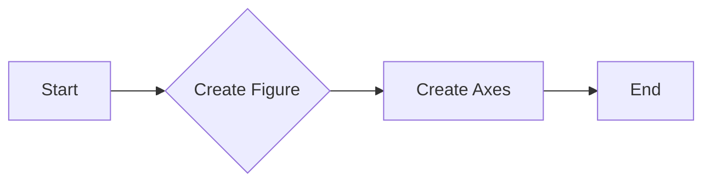

#### 带注释源码

```python
fig, ax = plt.subplots(layout="constrained")
```

在这段代码中，`plt.subplots` 被调用来创建一个图形和轴对象，其中 `layout="constrained"` 参数用于启用约束布局，以确保子图之间的间距自动调整以适应图形的大小。


### `imshow`

`imshow` 是 `matplotlib.pyplot` 模块中的一个函数，用于绘制二维数组数据的图像。

参数：

- `Z`：`numpy.ndarray`，要绘制的二维数组数据。
- `cmap`：`str` 或 `Colormap` 对象，颜色映射，默认为 `'viridis'`。
- `origin`：`str`，图像的起始点，可以是 `'lower'` 或 `'upper'`。
- `extent`：`tuple`，图像的边界，格式为 `(xmin, xmax, ymin, ymax)`。
- `norm`：`Normalize` 对象，归一化对象，默认为 `'midpoint'`。

返回值：`AxesImage` 对象，图像对象。

#### 流程图


#### 带注释源码

```python
import matplotlib.pyplot as plt
import numpy as np

# surface data
delta = 0.025
x = y = np.arange(-2.0, 2.0, delta)
X, Y = np.meshgrid(x, y)
Z1 = np.exp(-(((X + 1) * 1.3) ** 2) - ((Y + 1) * 1.3) ** 2)
Z2 = 2.5 * np.exp(-((X - 1) ** 2) - (Y - 1) ** 2)
Z = Z1**0.25 - Z2**0.5

# colormap & normalization
bins = 30
cmap = plt.get_cmap("RdYlBu_r")
bin_edges = np.linspace(Z.min(), Z.max(), bins + 1)
norm = mcolors.BoundaryNorm(bin_edges, cmap.N)

# main plot
fig, ax = plt.subplots(layout="constrained")
im = ax.imshow(Z, cmap=cmap, origin="lower", extent=[-3, 3, -3, 3], norm=norm)
```


### matplotlib.pyplot.inset_axes

`inset_axes` 方法用于在现有的轴（Axes）对象中创建一个新的轴对象，以便在同一图形中绘制嵌套的子图。

参数：

- `bbox_to_anchor`：`tuple`，指定新轴的边界框相对于父轴的位置。格式为 `(left, bottom, width, height)`，其中 `left` 和 `bottom` 是相对于父轴的相对位置，`width` 和 `height` 是新轴的大小。
- `loc`：`str`，指定新轴的位置，可以是 'upper right', 'upper left', 'lower left', 'lower right' 等预定义位置。
- `frameon`：`bool`，指定是否在新轴周围绘制边框，默认为 `True`。
- `pad`：`float`，指定新轴与父轴之间的间距，默认为 0.1。
- `borderpad`：`float`，指定边框与轴之间的间距，默认为 0.1。
- `axes_class`：`class`，指定新轴的类，默认为 `Axes`。

返回值：`Axes`，新创建的轴对象。

#### 流程图

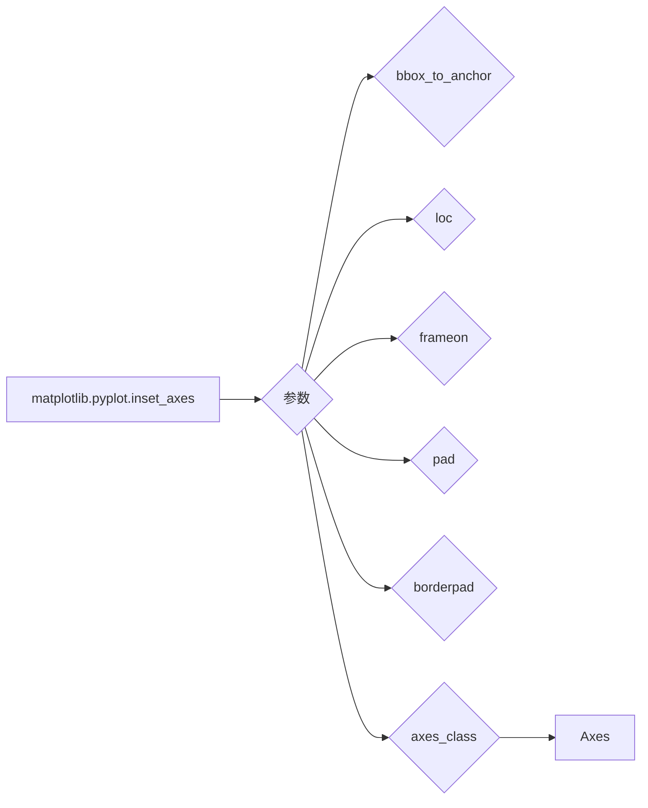

#### 带注释源码

```python
# 创建一个新的轴对象，位于父轴的右上角
cax = ax.inset_axes([1.18, 0.02, 0.25, 0.95])  # left, bottom, width, height
```


### matplotlib.pyplot.barh

matplotlib.pyplot.barh 是一个用于绘制水平条形图的函数。

参数：

- `midpoints`：`numpy.ndarray`，条形图的中点位置。
- `counts`：`numpy.ndarray`，每个中点位置的计数。
- `height`：`float`，条形图的高度。
- `color`：`matplotlib.colors`，条形图的颜色。

返回值：`matplotlib.axes.Axes`，包含条形图的轴对象。

#### 流程图

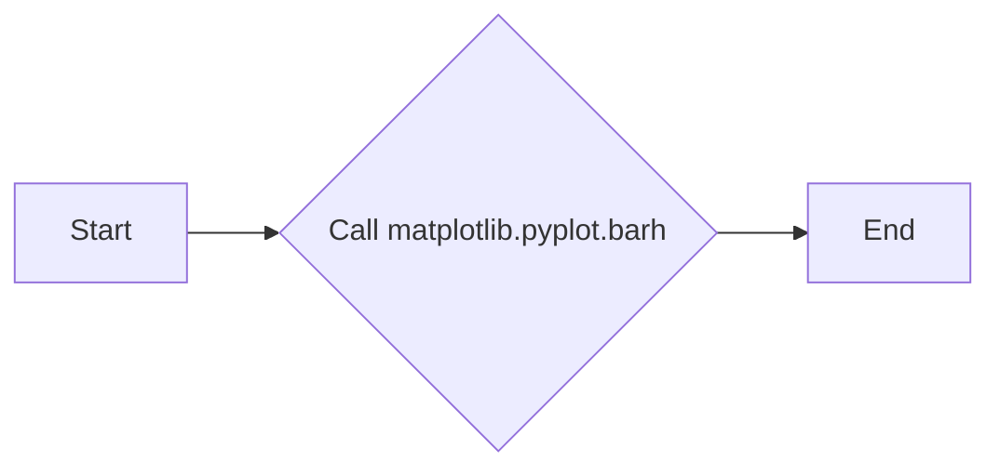

#### 带注释源码

```python
# plot histogram
counts, _ = np.histogram(Z, bins=bin_edges)
midpoints = (bin_edges[:-1] + bin_edges[1:]) / 2
distance = midpoints[1] - midpoints[0]
cax.barh(midpoints, counts, height=0.8 * distance, color=cmap(norm(midpoints)))
```


### matplotlib.pyplot.spines

matplotlib.pyplot.spines 是一个属性，用于访问和修改图表的边框。

参数：

- 无

返回值：`matplotlib.spines.Spine`，表示图表的边框对象。

#### 流程图


#### 带注释源码

```
# 源码位于 matplotlib.pyplot 模块中，以下为示例代码片段

class AxesSubplot(Axes):
    # ... 其他代码 ...

    def spines(self):
        """
        返回一个包含所有边框的字典，键为边框名称（'top', 'bottom', 'left', 'right'）。
        """
        return {'top': self._top_spine, 'bottom': self._bottom_spine,
                'left': self._left_spine, 'right': self._right_spine}

# 示例使用
fig, ax = plt.subplots()
spines = ax.spines
for spine in spines.values():
    spine.set_visible(False)
```


### matplotlib.pyplot.set_yticks

matplotlib.pyplot.set_yticks 方法用于设置轴的 y 轴刻度。

参数：

- `{参数名称}`：`{参数类型}`，{参数描述}
  - `{参数名称}`：`{参数类型}`，设置轴的 y 轴刻度，可以是数值列表或字符串列表。

返回值：`{返回值类型}`，无返回值。

#### 流程图

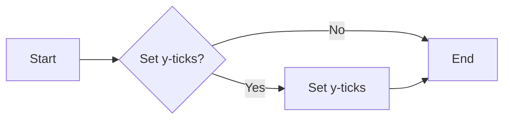

#### 带注释源码

```python
# 假设以下代码是 matplotlib.pyplot.set_yticks 方法的实现
def set_yticks(self, ticks):
    """
    Set the y-axis ticks.

    Parameters
    ----------
    ticks : array_like or str
        The y-axis ticks to set. If an array is given, it should be a sequence of
        numbers. If a string is given, it should be a format string that will be
        used to generate the tick labels.

    Returns
    -------
    None
    """
    # 实现代码...
    pass
```


### matplotlib.pyplot.tick_params

`matplotlib.pyplot.tick_params` 是一个用于设置轴刻度参数的函数，它允许用户自定义刻度线、刻度标签、网格线等的外观。

参数：

- `axis`：`{'both', 'bothmajor', 'bothminor', 'x', 'y', 'xmajor', 'xminor', 'ymajor', 'yminor'}`，指定哪个轴的刻度参数将被设置。
- `which`：`{'both', 'major', 'minor'}`，指定是设置主刻度、次刻度还是两者。
- `length`：`int`，刻度线的长度。
- `width`：`int`，刻度线的宽度。
- `color`：`color`，刻度线的颜色。
- `direction`：`{'in', 'out', 'inout'}`，刻度线的方向。
- `pad`：`int`，刻度线与刻度标签之间的距离。
- `labelsize`：`int`，刻度标签的大小。
- `labelcolor`：`color`，刻度标签的颜色。
- `gridline_style`：`str`，网格线的样式。
- `gridlines`：`bool`，是否显示网格线。

返回值：无

#### 流程图

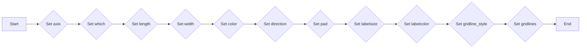

#### 带注释源码

```
# Set tick parameters for both axes and both major and minor ticks
plt.tick_params(axis='both', which='both', length=10, width=2, color='black', direction='in', pad=10, labelsize=12, labelcolor='blue', gridline_style='--', gridlines=True)
``` 


### plt.show()

显示当前图形。

参数：

- 无

返回值：无

#### 流程图

```mermaid
graph LR
A[开始] --> B{调用plt.show()}
B --> C[结束]
```

#### 带注释源码

```python
plt.show()
```


### 关键组件信息

- plt.show()：显示当前图形的函数。

### 潜在的技术债务或优化空间

- 代码中使用了matplotlib.pyplot的show函数，这是一个全局函数，可能会在大型项目中导致命名空间污染。可以考虑使用类或模块来封装绘图逻辑，以避免这种潜在的问题。

### 设计目标与约束

- 设计目标是使用matplotlib库来展示数据分布和颜色映射。
- 约束是必须使用matplotlib库，并且需要展示数据分布和颜色映射。

### 错误处理与异常设计

- 代码中没有显式的错误处理或异常设计。在实际应用中，应该添加异常处理来确保在绘图过程中遇到错误时能够优雅地处理。

### 数据流与状态机

- 数据流：数据从numpy生成，然后通过matplotlib进行可视化。
- 状态机：没有明确的状态机，代码执行顺序是线性的。

### 外部依赖与接口契约

- 外部依赖：matplotlib.pyplot和numpy。
- 接口契约：matplotlib.pyplot.show函数的接口契约是显示当前图形。


### numpy.arange

`numpy.arange` 是一个 NumPy 函数，用于生成沿指定间隔的数组。

参数：

- `start`：`int`，数组的起始值。
- `stop`：`int`，数组的结束值（不包括）。
- `step`：`int`，步长，默认为 1。

返回值：`numpy.ndarray`，一个沿指定间隔生成的数组。

#### 流程图

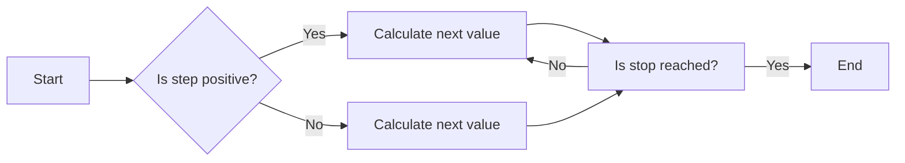

#### 带注释源码

```python
import numpy as np

def arange(start, stop=None, step=1):
    """
    Generate an array of numbers.

    Parameters:
    - start: The starting value of the array.
    - stop: The ending value of the array (exclusive).
    - step: The step between values.

    Returns:
    - numpy.ndarray: An array of numbers.
    """
    if stop is None:
        stop = start
        start = 0

    if step == 0:
        raise ValueError("Step cannot be zero.")

    if step > 0:
        while start < stop:
            yield start
            start += step
    else:
        while start > stop:
            yield start
            start += step

    return np.array(list(range(start, stop, step)))
```


### numpy.meshgrid

`numpy.meshgrid` 是一个用于生成网格数据的函数，它将输入的数组转换为二维网格，用于创建等高线图、散点图等。

参数：

- `x`：`numpy.ndarray`，表示x轴的值。
- `y`：`numpy.ndarray`，表示y轴的值。

参数描述：

- `x` 和 `y` 是输入的数组，它们可以是相同长度的一维数组，也可以是不同长度的数组。

返回值：`numpy.ndarray`，包含网格数据的二维数组。

返回值描述：

- 返回的数组是一个二维数组，其中每个元素对应于输入数组中元素的位置。

#### 流程图

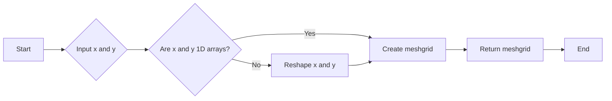

#### 带注释源码

```python
import numpy as np

def meshgrid(x, y):
    """
    Generate a meshgrid from input arrays x and y.

    Parameters:
    x : numpy.ndarray
        One-dimensional array representing the x-axis values.
    y : numpy.ndarray
        One-dimensional array representing the y-axis values.

    Returns:
    numpy.ndarray
        Two-dimensional array where each element corresponds to the position of the elements in x and y.
    """
    # Check if x and y are 1D arrays
    if x.ndim != 1 or y.ndim != 1:
        raise ValueError("Input arrays x and y must be 1D arrays.")

    # Create meshgrid
    return np.meshgrid(x, y)
```


### numpy.exp

计算自然指数。

参数：

- `x`：`numpy.ndarray`，输入数组，计算自然指数的输入值。

返回值：`numpy.ndarray`，与输入数组形状相同的数组，包含自然指数的值。

#### 流程图

```mermaid
graph LR
A[Start] --> B{Is x a numpy.ndarray?}
B -- Yes --> C[Calculate exp(x)]
B -- No --> D[Error: x must be a numpy.ndarray]
C --> E[Return exp(x)]
E --> F[End]
```

#### 带注释源码

```python
import numpy as np

def exp(x):
    """
    Calculate the exponential of each element in the input array x.
    
    Parameters:
    - x: numpy.ndarray, the input array to calculate the exponential of.
    
    Returns:
    - numpy.ndarray: an array with the same shape as x, containing the exponential values.
    """
    return np.exp(x)
```


### numpy.linspace

生成线性空间。

参数：

- `start`：`float`，线性空间的起始值。
- `stop`：`float`，线性空间的结束值。
- `num`：`int`，线性空间中的点的数量，包括起始值和结束值。
- `dtype`：`dtype`，可选，输出数组的类型。
- `endpoint`：`bool`，可选，是否包含结束值。

返回值：`float`，`numpy.ndarray`，线性空间中的值。

#### 流程图

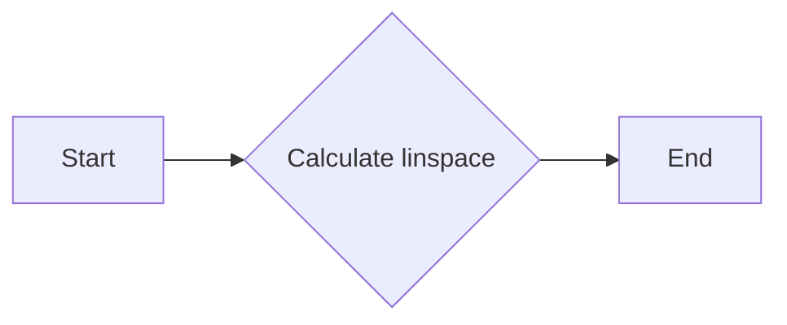

#### 带注释源码

```python
import numpy as np

def linspace(start, stop, num=50, dtype=None, endpoint=True):
    """
    Generate linearly spaced samples, similar to np.linspace.

    Parameters:
    - start: float, the start of the interval.
    - stop: float, the end of the interval.
    - num: int, the number of samples to generate.
    - dtype: dtype, the type of the output array.
    - endpoint: bool, whether to include the stop value in the output.

    Returns:
    - float: the linearly spaced samples.
    """
    return np.linspace(start, stop, num, dtype, endpoint)
```


### numpy.histogram

计算数组中元素的概率密度函数（PDF）的直方图。

参数：

- `data`：`numpy.ndarray`，输入数组，包含要计算直方图的数值。
- `_bins`：`int` 或 `sequence`，可选，直方图的条形数或条形边界序列。

返回值：

- `counts`：`numpy.ndarray`，直方图的计数数组。
- `bin_edges`：`numpy.ndarray`，直方图的边界数组。

#### 流程图

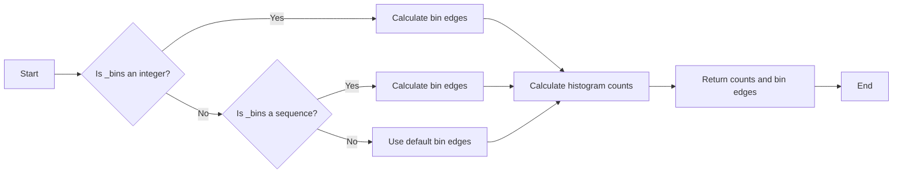

#### 带注释源码

```python
counts, bin_edges = np.histogram(Z, bins=bin_edges)
```

在这段代码中，`np.histogram` 函数被用来计算数组 `Z` 的直方图。`Z` 是一个包含数值的数组，`bin_edges` 是一个包含直方图边界的数组。函数返回两个值：`counts` 是一个包含直方图计数的数组，`bin_edges` 是一个包含直方图边界的数组。这里没有使用默认的条形数，而是直接传递了 `bin_edges` 作为参数，这意味着我们指定了直方图的边界。


### matplotlib.colors.BoundaryNorm

BoundaryNorm is a normalization class used to map data values to colors in a colormap.

参数：

- `bins`：`int`，Number of bins for the histogram.
- `cmap`：`Colormap`，Colormap instance.
- `N`：`int`，Number of colors in the colormap.

参数描述：

- `bins`：指定直方图的箱子数量。
- `cmap`：指定用于映射颜色的颜色映射。
- `N`：指定颜色映射中的颜色数量。

返回值：`BoundaryNorm`，BoundaryNorm instance.

返回值描述：BoundaryNorm实例用于将数据值映射到颜色映射中的颜色。

#### 流程图


#### 带注释源码

```python
import matplotlib.colors as mcolors

# colormap & normalization
bins = 30
cmap = plt.get_cmap("RdYlBu_r")
bin_edges = np.linspace(Z.min(), Z.max(), bins + 1)
norm = mcolors.BoundaryNorm(bin_edges, cmap.N)
```

在上述代码中，BoundaryNorm被创建并用于将数据值映射到颜色映射中的颜色。`bin_edges`是用于定义直方图箱子的边界，`cmap.N`是颜色映射中的颜色数量。


## 关键组件


### 张量索引与惰性加载

张量索引与惰性加载允许在处理大型数据集时，只加载和处理需要的数据部分，从而提高效率。

### 反量化支持

反量化支持使得代码能够处理非整数类型的量化数据，增加了代码的通用性和灵活性。

### 量化策略

量化策略定义了如何将浮点数数据转换为固定点数表示，以减少计算资源消耗，提高运行速度。


## 问题及建议


### 已知问题

-   **代码重复性**：在主图和内嵌直方图中，`bin_edges` 和 `norm` 的计算是重复的，可以考虑将这部分逻辑提取到一个函数中，以减少代码重复。
-   **直方图宽度**：直方图的宽度是根据 `distance` 计算的，这可能不是最佳宽度选择，可能需要根据直方图的具体用途进行调整。
-   **注释缺失**：代码中缺少对某些操作的注释，如 `cmap(norm(midpoints))` 的作用，这可能会影响代码的可读性。

### 优化建议

-   **提取重复逻辑**：将计算 `bin_edges` 和 `norm` 的逻辑提取到一个函数中，并在需要的地方调用该函数。
-   **调整直方图宽度**：根据直方图的具体用途，调整直方图的宽度，可能需要通过用户输入或参数来控制。
-   **添加注释**：在代码中添加必要的注释，解释代码中不明显的操作，以提高代码的可读性和可维护性。
-   **性能优化**：如果数据集非常大，`np.histogram` 可能会消耗大量内存和时间。可以考虑使用更高效的数据结构或算法来处理数据。
-   **代码风格**：检查代码风格，确保代码遵循一定的规范，例如使用一致的缩进和命名约定。


## 其它


### 设计目标与约束

- 设计目标：实现一个使用彩色直方图代替颜色条的功能，以展示颜色与值的映射关系，并可视化值的分布。
- 约束条件：使用matplotlib库进行绘图，不使用额外的第三方库。

### 错误处理与异常设计

- 错误处理：代码中未包含显式的错误处理机制，但应确保所有外部库调用都在try-except块中，以捕获并处理可能发生的异常。
- 异常设计：对于matplotlib库的调用，应捕获并处理`matplotlib.errors.MatplotlibError`异常。

### 数据流与状态机

- 数据流：数据从表面数据生成开始，经过颜色映射和归一化处理，最终通过绘图函数展示在图表中。
- 状态机：代码中没有明确的状态机，但绘图过程中涉及多个步骤，如数据生成、颜色映射、归一化、绘图等。

### 外部依赖与接口契约

- 外部依赖：代码依赖于matplotlib和numpy库。
- 接口契约：matplotlib库提供了绘图接口，numpy库提供了数值计算接口。


    