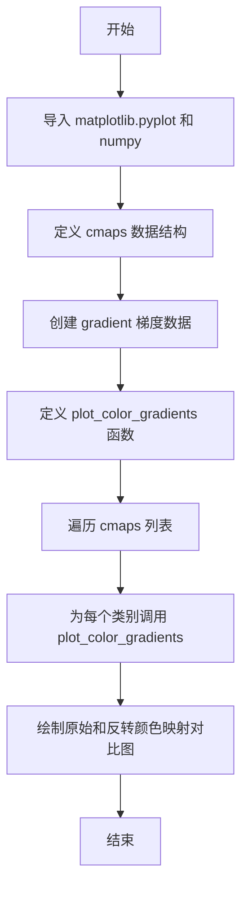
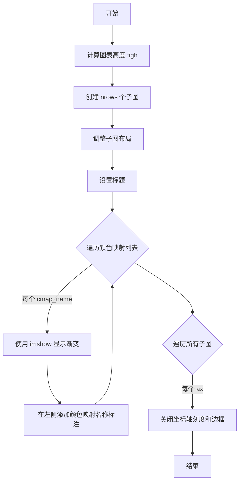

# `matplotlib\galleries\examples\color\colormap_reference.py` 详细设计文档

这是一个Matplotlib颜色映射参考文档脚本，用于可视化和展示Matplotlib内置的各种颜色映射（colormaps），包括感知均匀序列型、序列型、发散型、循环型、定性型和杂项类型，并提供原始与反转版本的对比展示。

## 整体流程



## 类结构

```
colormap_reference (脚本文件)
├── cmaps (全局变量)
├── gradient (全局变量)
└── plot_color_gradients (函数)
```

## 全局变量及字段


### `cmaps`
    
包含Matplotlib所有内置颜色映射的类别名称和对应颜色映射名称列表的嵌套列表

类型：`List[Tuple[str, List[str]]]`
    


### `gradient`
    
用于可视化颜色渐变的256x2的二维NumPy数组

类型：`numpy.ndarray`
    


    

## 全局函数及方法


### `plot_color_gradients`

该函数用于绘制一系列颜色渐变条，展示指定颜色映射类别的可视化效果，通过创建子图并使用 `imshow` 显示每个颜色映射的渐变，同时在左侧标注颜色映射名称。

参数：

- `cmap_category`：`str`，颜色映射的类别名称，用于图表标题显示
- `cmap_list`：`List[str]`，要绘制渐变效果的颜色映射名称列表

返回值：`None`，该函数直接绘制图表而不返回任何值

#### 流程图



#### 带注释源码

```python
def plot_color_gradients(cmap_category, cmap_list):
    """
    绘制一系列颜色渐变条，展示颜色映射效果
    
    参数:
        cmap_category: 颜色映射类别名称
        cmap_list: 要展示的颜色映射名称列表
    """
    # Create figure and adjust figure height to number of colormaps
    # 计算图表高度：基础高度0.35 + 0.15，加上每个颜色映射行的高度
    # 其中 (nrows-1)*0.1 是行间距
    nrows = len(cmap_list)
    figh = 0.35 + 0.15 + (nrows + (nrows-1)*0.1)*0.22
    # 创建子图，行数等于颜色映射数量
    fig, axs = plt.subplots(nrows=nrows, figsize=(6.4, figh))
    # 调整子图布局，设置顶部、底部、左侧、右侧边距
    fig.subplots_adjust(top=1-.35/figh, bottom=.15/figh, left=0.2, right=0.99)

    # 设置图表标题，显示颜色映射类别
    axs[0].set_title(f"{cmap_category} colormaps", fontsize=14)

    # 遍历每个颜色映射，绘制渐变条并添加标签
    for ax, cmap_name in zip(axs, cmap_list):
        # 使用 imshow 显示渐变图像，aspect='auto' 允许自动调整宽高比
        ax.imshow(gradient, aspect='auto', cmap=cmap_name)
        # 在左侧添加颜色映射名称文本
        ax.text(-.01, .5, cmap_name, va='center', ha='right', fontsize=10,
                transform=ax.transAxes)

    # Turn off *all* ticks & spines, not just the ones with colormaps.
    # 关闭所有子图的坐标轴刻度和边框
    for ax in axs:
        ax.set_axis_off()
```

## 关键组件


### 色板分类数据 (cmaps)

包含所有内置色板的分类列表，分为七个类别：Perceptually Uniform Sequential、Sequential、Sequential (2)、Diverging、Cyclic、Qualitative 和 Miscellaneous，共包含数十个色板名称。

### 渐变数据生成器 (gradient)

使用 NumPy 生成从 0 到 1 的线性渐变数组，形状为 (2, 256)，用于在图表中可视化展示色板的颜色变化效果。

### 色板绘制函数 (plot_color_gradients)

核心功能函数，接收色板类别名称和色板列表，动态计算图表高度并创建对应数量的子图，遍历每个色板使用 imshow 显示渐变效果，并在左侧标注色板名称。

### 主循环遍历

迭代遍历 cmaps 列表中的每个色板类别，调用 plot_color_gradients 函数绘制该类别下的所有色板。

### 逆向色板展示

额外绘制了原始色板和逆向色板的对比展示，通过传入 'viridis' 和 'viridis_r' 展示色板逆转效果。


## 问题及建议


### 已知问题

-   **硬编码的魔法数字**：图形尺寸计算公式`figh = 0.35 + 0.15 + (nrows + (nrows-1)*0.1)*0.22`以及布局参数`top=1-.35/figh, bottom=.15/figh, left=0.2, right=0.99`包含多个难以理解和维护的硬编码数值，缺乏配置化
-   **缺乏参数验证**：函数`plot_color_gradients`未对输入参数`cmap_category`和`cmap_list`进行类型检查或有效性验证，传入无效的色图名称会导致运行时错误
-   **色图数据与库不同步**：`cmaps`列表中的色图名称是硬编码的静态数据，未通过`matplotlib.cm`或`matplotlib.colors`动态获取，可能与实际库中的可用色图不同步
-   **缺乏文档和类型注解**：函数缺少参数类型注解和详细的文档字符串，降低了代码的可读性和可维护性
-   **错误处理缺失**：色图迭代过程中未处理可能的异常情况，如无效色图名称导致的警告或错误
-   **全局状态依赖**：模块级别的`gradient`变量和`cmaps`列表作为全局状态存在，增加了代码耦合度

### 优化建议

-   将魔法数字提取为具名常量或配置参数，例如定义`DEFAULT_FIG_WIDTH = 6.4`、`SUBPLOT_HEIGHT_FACTOR = 0.22`等常量
-   为函数添加类型注解和完整的docstring，说明参数类型、返回值以及可能抛出的异常
-   考虑通过`matplotlib.pyplot.colormaps()`或`matplotlib.cm._colormaps`动态获取可用色图列表，避免手动维护静态数据
-   添加参数验证逻辑，检查`cmap_list`是否为非空列表、`cmap_category`是否为字符串类型
-   使用try-except块包装色图渲染逻辑，捕获并记录可能的Matplotlib警告或错误
-   将全局变量封装到类或配置模块中，提高代码的模块化程度


## 其它


### 设计目标与约束

本代码的设计目标是生成Matplotlib内置colormap的可视化参考文档，帮助用户直观了解和应用各种颜色映射。约束条件包括：依赖Matplotlib和NumPy库，需要兼容Python 3.x版本，输出为静态图像展示。

### 错误处理与异常设计

代码主要处理两类异常情况：1) 导入异常，当matplotlib.pyplot或numpy未安装时应给出明确错误提示；2) 图像生成异常，当colormap名称不存在时应捕获并跳过该条目。当前代码未实现显式的异常处理机制，属于潜在改进点。

### 数据流与状态机

数据流主要分为三个阶段：初始阶段加载colormap列表数据；处理阶段为每个colormap类别创建对应的子图；渲染阶段将渐变可视化并添加标签。状态机流程为：加载数据 → 创建Figure → 遍历类别 → 绘制子图 → 展示结果。

### 外部依赖与接口契约

本代码依赖两个核心外部库：matplotlib.pyplot提供图形绑定和展示功能，numpy提供数值计算和数组操作能力。接口契约包括：plot_color_gradients函数接收colormap类别名称字符串和colormap名称列表，返回None（直接操作matplotlib figure对象）。

### 性能考虑

代码在性能方面存在以下特点：gradient数组预计算为256x2的固定尺寸，vstack操作创建对称渐变；对于大规模colormap列表，建议采用延迟加载或分批渲染策略。当前实现对于少量colormap性能可接受，但扩展至数千个colormap时可能需要优化。

### 可维护性分析

代码可维护性较好，体现在：模块化设计将plot_color_gradients函数独立出来便于复用；全局变量cmaps采用清晰的数据结构组织；注释文档完善。但可改进点包括：将硬编码的配置参数（如figh计算公式）抽取为配置文件。

### 可测试性分析

代码的可测试性受限于其主要作为文档生成脚本的特性。建议添加单元测试验证：plot_color_gradients函数对不同输入的处理逻辑，colormap列表数据结构的完整性，以及图像输出尺寸的合理性。

### 版本兼容性

代码需要Python 3.6+和Matplotlib 3.0+环境。部分colormap名称（如managua、vanimo、berlin）可能仅在较新版本中可用，建议添加版本检查或回退机制以保证向后兼容性。

### 配置管理

当前代码采用硬编码方式管理配置，主要包括：图像尺寸参数(6.4, figh)、子图间距参数(0.35, 0.15, 0.1, 0.22, 0.2, 0.99)、字体大小(14, 10)。建议将这些magic numbers提取为模块级常量或配置文件，以提高灵活性。

### 安全性考虑

代码不涉及用户输入处理或网络通信，安全性风险较低。但建议在生产环境中使用时验证colormap来源，避免加载未信任的自定义colormap可能导致的安全问题。

    