# `matplotlib\galleries\examples\color\custom_cmap.py` 详细设计文档

该代码是matplotlib的颜色映射(colormap)创建和操作示例，展示了如何从颜色列表创建离散化colormap以及如何通过字典定义自定义的LinearSegmentedColormap，实现RGB通道的线性分段控制，最后通过imshow可视化展示不同colormap的效果。

## 整体流程

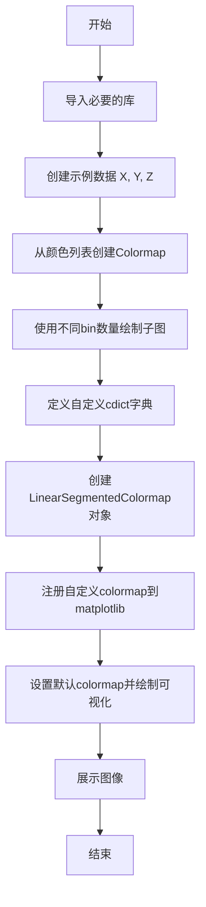

## 类结构

```
Python脚本 (主模块)
├── 数据创建模块
x
y (numpy数组)
X
Y (meshgrid网格)
Z (计算结果)
├── Colormap创建模块
LinearSegmentedColormap.from_list
自定义cdict字典 (cdict1-4)
LinearSegmentedColormap注册
└── 可视化模块
    ├── plt.subplots
    ├── ax.imshow
    └── fig.colorbar
```

## 全局变量及字段


### `x`
    
numpy数组，从0到pi，步长0.1

类型：`numpy.ndarray`
    


### `y`
    
numpy数组，从0到2*pi，步长0.1

类型：`numpy.ndarray`
    


### `X`
    
meshgrid创建的x坐标网格

类型：`numpy.ndarray`
    


### `Y`
    
meshgrid创建的y坐标网格

类型：`numpy.ndarray`
    


### `Z`
    
计算值：cos(X)*sin(Y)*10

类型：`numpy.ndarray`
    


### `colors`
    
RGB颜色元组列表 [(1,0,0), (0,1,0), (0,0,1)]

类型：`list`
    


### `n_bins`
    
离散化bin数量列表 [3, 6, 10, 100]

类型：`list`
    


### `cmap_name`
    
colormap名称 'my_list'

类型：`str`
    


### `cdict1`
    
自定义colormap字典(红色通道)

类型：`dict`
    


### `cdict2`
    
自定义colormap字典(蓝色通道)

类型：`dict`
    


### `cdict3`
    
自定义colormap字典(三通道完整)

类型：`dict`
    


### `cdict4`
    
带透明度的自定义colormap字典

类型：`dict`
    


### `blue_red1`
    
LinearSegmentedColormap实例

类型：`LinearSegmentedColormap`
    


### `fig`
    
matplotlib图形对象

类型：`Figure`
    


### `axs`
    
Axes数组，存放子图axes对象

类型：`numpy.ndarray`
    


### `ax`
    
单独的Axes子图对象

类型：`Axes`
    


### `im`
    
图像映射对象，用于显示和colorbar

类型：`ScalarMappable`
    


### `cmap`
    
创建的colormap对象

类型：`Colormap`
    


    

## 全局函数及方法


### np.arange

创建等差数组

参数：
- `start`：`数值`，序列的起始值，默认为0
- `stop`：`数值`，序列的终止值（不包括）
- `step`：`数值`，步长，默认为1

返回值：`ndarray`，等差数组

#### 流程图

```mermaid
graph TD
A[开始] --> B[输入 start, stop, step]
B --> C{验证参数有效性}
C --> D[计算数组长度: num = ceil((stop - start) / step)]
D --> E[创建数组]
E --> F[填充数组: start + i * step for i in range(num)]
F --> G[返回数组]
```

#### 带注释源码

```python
# 使用np.arange创建等差数组
# 参数：起始值0，终止值np.pi，步长0.1
x = np.arange(0, np.pi, 0.1)

# 参数：起始值0，终止值2*np.pi，步长0.1
y = np.arange(0, 2 * np.pi, 0.1)
```


### `np.meshgrid`

该函数用于从一维坐标向量创建二维坐标网格，常用于生成二维函数的输入坐标矩阵。

参数：

- `x`：`numpy.ndarray`（1-D），表示网格点的 x 坐标向量
- `y`：`numpy.ndarray`（1-D），表示网格点的 y 坐标向量

返回值：`tuple`，返回两个二维数组 (X, Y)，其中 X 包含每个点的 x 坐标，Y 包含每个点的 y 坐标

#### 流程图

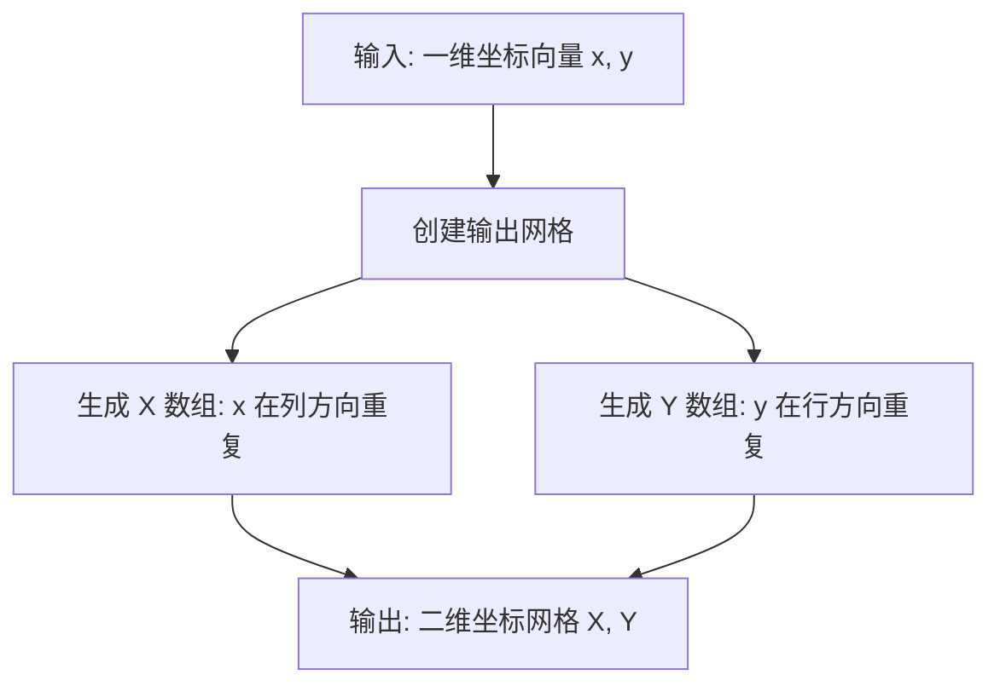

#### 带注释源码

```python
# 定义 x 坐标向量: 从 0 到 pi，步长 0.1
x = np.arange(0, np.pi, 0.1)

# 定义 y 坐标向量: 从 0 到 2*pi，步长 0.1
y = np.arange(0, 2 * np.pi, 0.1)

# 使用 meshgrid 创建二维坐标网格
# X 的每一行是 x 向量，Y 的每一列是 y 向量
# 这样 X[i,j] 和 Y[i,j] 就构成了网格上对应点的坐标
X, Y = np.meshgrid(x, y)

# 示例用途: 创建要绑定的数据 Z
# Z = cos(X) * sin(Y) * 10
# 这创建了一个基于网格的二维函数值矩阵
Z = np.cos(X) * np.sin(Y) * 10
```


### `plt.subplots`

创建图形和子图网格的函数，允许用户同时创建多个子图并返回图形和轴对象。

参数：

- `nrows`：`int`，默认值 1，子图网格的行数
- `ncols`：`int`，默认值 1，子图网格的列数
- `figsize`：`tuple`，可选，图形尺寸（宽度，高度），单位为英寸
- `squeeze`：`bool`，可选，如果为 True，则额外的维度会被压缩
- `subplot_kw`：`dict`，可选，用于创建子图的关键字参数
- `gridspec_kw`：`dict`，可选，用于 GridSpec 的关键字参数
- `**kwargs`：其他传递给 `Figure.add_subplot` 的参数

返回值：`tuple`，返回 (figure, axes) 元组，其中 figure 是 `Figure` 对象，axes 是 `Axes` 对象（当 squeeze=True 且 nrows 或 ncols 为 1 时可能为单个 Axes 对象，否则为 numpy 数组）

#### 流程图

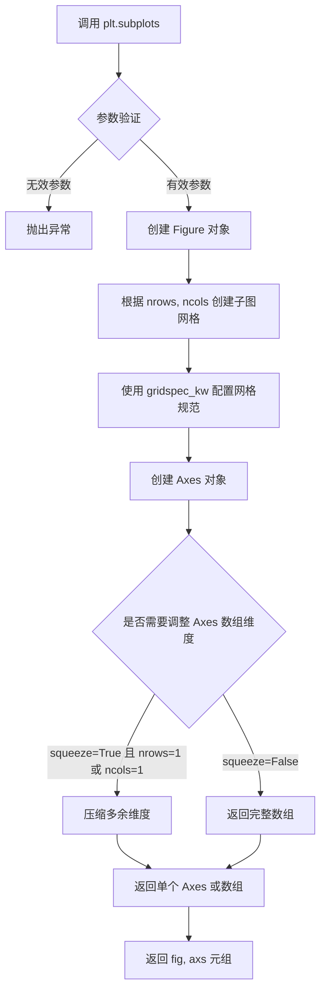

#### 带注释源码

```python
# 从代码中提取的 plt.subplots 调用示例
# 创建 2x2 的子图网格，图形尺寸为 6x9 英寸
fig, axs = plt.subplots(2, 2, figsize=(6, 9))

# 参数说明：
# 2, 2         -> nrows=2, ncols=2，创建 2 行 2 列的子图
# figsize=(6, 9) -> 图形宽度 6 英寸，高度 9 英寸

# fig  -> matplotlib.figure.Figure 对象，整个图形容器
# axs  -> numpy.ndarray 对象，包含 4 个 Axes 对象 (2x2 网格)
#        可以通过 axs[0, 0], axs[0, 1], axs[1, 0], axs[1, 1] 访问各个子图

# 调整子图布局
fig.subplots_adjust(left=0.02, bottom=0.06, right=0.95, top=0.94, wspace=0.05)

# 遍历每个子图
for n_bin, ax in zip(n_bins, axs.flat):
    # 创建颜色映射
    cmap = LinearSegmentedColormap.from_list(cmap_name, colors, N=n_bin)
    # 在子图上显示图像
    im = ax.imshow(Z, origin='lower', cmap=cmap)
    # 设置子图标题
    ax.set_title("N bins: %s" % n_bin)
    # 添加颜色条
    fig.colorbar(im, ax=ax)
```


### `Figure.subplots_adjust`

调整 Figure 中子图的布局参数，用于控制子图之间的间距和边距。

参数：

- `left`：`float`，子图区域左侧边界（0到1之间的比例值）
- `right`：`float`，子图区域右侧边界（0到1之间的比例值）
- `top`：`float`，子图区域顶部边界（0到1之间的比例值）
- `bottom`：`float`，子图区域底部边界（0到1之间的比例值）
- `wspace`：`float`，子图之间的水平间距（相对于子图宽度的比例）
- `hspace`：`float`，子图之间的垂直间距（相对于子图高度的比例）

返回值：`None`，该方法直接修改 Figure 对象的布局，不返回值。

#### 流程图

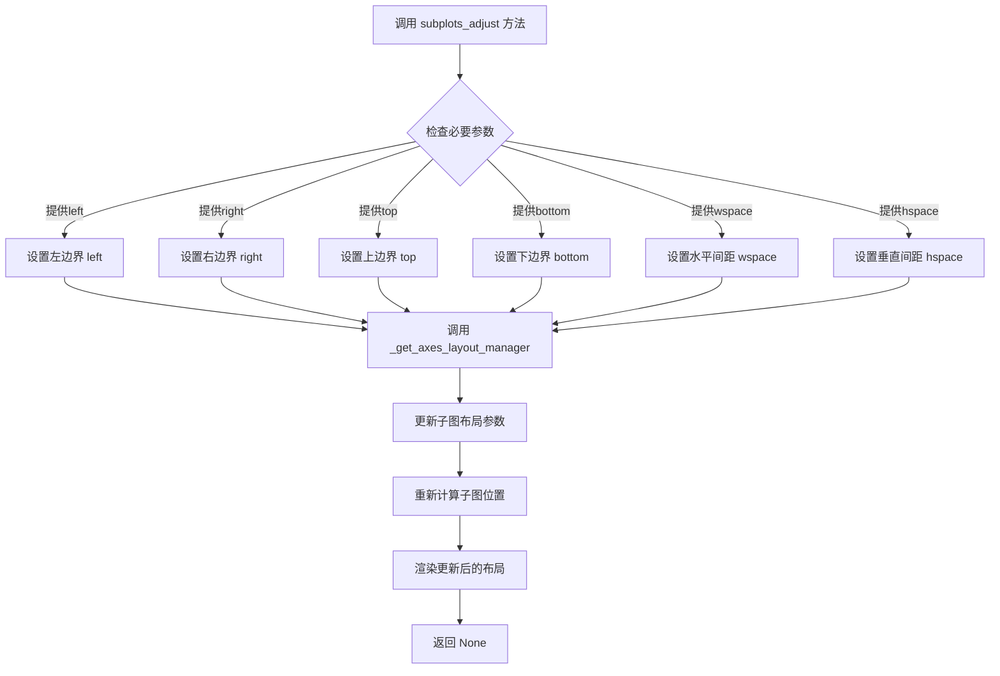

#### 带注释源码

```python
# 代码中的实际调用示例：

# 第一次调用：调整第一个子图布局
fig.subplots_adjust(left=0.02, bottom=0.06, right=0.95, top=0.94, wspace=0.05)
# left=0.02:   左侧边距为 Figure 宽度的 2%
# bottom=0.06: 底部边距为 Figure 高度的 6%
# right=0.95:  右侧边距为 Figure 宽度的 95%（即子图区域宽度为 93%）
# top=0.94:    顶部边距为 Figure 高度的 94%（即子图区域高度为 88%）
# wspace=0.05: 子图之间的水平间距为子图宽度的 5%

# 第二次调用：调整第二个子图布局（同样的参数）
fig.subplots_adjust(left=0.02, bottom=0.06, right=0.95, top=0.94, wspace=0.05)

# 第三次调用：仅调整顶部边距
fig.subplots_adjust(top=0.9)
# top=0.9: 顶部边距为 Figure 高度的 90%（即子图区域高度为 84%）

# ---------------------------------------------------------
# subplots_adjust 方法的签名（来自 matplotlib 源码）：
# def subplots_adjust(self, left=None, bottom=None, right=None, top=None,
#                     wspace=None, hspace=None):
#     """
#     Adjust the subplot layout parameters.
#     
#     Parameters
#     ----------
#     left : float, optional
#         The position of the left edge of the subplots, as a fraction of
#         the figure width.
#     right : float, optional
#         The position of the right edge of the subplots, as a fraction of
#         the figure width.
#     bottom : float, optional
#         The position of the bottom edge of the subplots, as a fraction of
#         the figure height.
#     top : float, optional
#         The position of the top edge of the subplots, as a fraction of
#         the figure height.
#     wspace : float, optional
#         The width of the padding between subplots, as a fraction of the
#         average axes width.
#     hspace : float, optional
#         The height of the padding between subplots, as a fraction of the
#         average axes height.
#     """
#     # This method is part of the Figure class and modifies the layout
#     # of subplots within the figure directly
```


### `LinearSegmentedColormap.from_list`

从颜色列表创建线性分段colormap的方法。通过接受一个颜色列表和离散化参数，生成一个可在数据可视化中使用的colormap对象。

参数：

- `name`：`str`，colormap的名称，用于标识和注册
- `colors`：`list`，颜色列表，可以是RGB元组、RGBA元组、十六进制颜色字符串或颜色名称的任意组合
- `N`：`int`，离散化的bin数量，即colormap中颜色值的离散级别，默认为256
- `gamma`：`float`，gamma校正值，控制颜色插值的非线性程度，默认为1.0（线性）

返回值：`LinearSegmentedColormap`，返回创建的线性分段colormap对象

#### 流程图

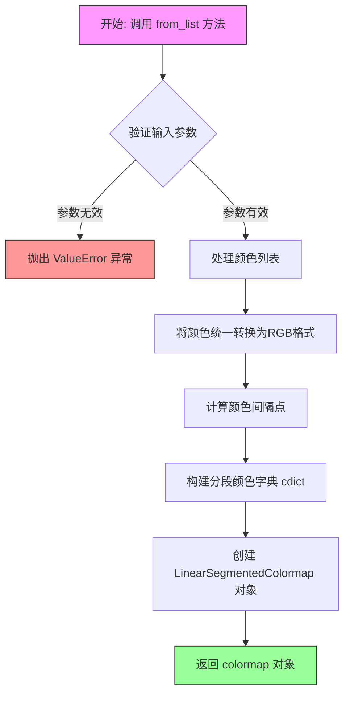

#### 带注释源码

```python
@staticmethod
def from_list(name, colors, N=256, gamma=1.0):
    """
    创建从颜色列表派生的线性分段colormap。
    
    参数:
        name: str
            colormap的名称，用于标识和注册到matplotlib
        colors: list
            颜色列表，可以是以下格式:
            - RGB/RGBA元组: (R, G, B) 或 (R, G, B, A)，值范围0-1
            - 十六进制字符串: '#FF0000'
            - 颜色名称: 'red', 'blue'
        N: int, optional
            离散化的bin数量，决定colormap的精细程度
            默认值为256
        gamma: float, optional
            gamma校正值，控制颜色插值的非线性响应
            默认值为1.0（线性）
    
    返回:
        LinearSegmentedColormap
            创建的线性分段colormap对象，可直接用于matplotlib绘图
    
    示例:
        # 简单三色渐变: 红 -> 绿 -> 蓝
        colors = [(1, 0, 0), (0, 1, 0), (0, 0, 1)]
        cmap = LinearSegmentedColormap.from_list('rgb', colors, N=256)
        
        # 使用十六进制颜色
        cmap = LinearSegmentedColormap.from_list(
            'my_cmap', 
            ['#FF0000', '#00FF00', '#0000FF'], 
            N=100
        )
    """
    # 将颜色数组转换为numpy数组以便处理
    # _resample方法内部会进行颜色格式验证和转换
    cmap = _resample(colors, N, gamma)
    
    # 设置colormap的元数据属性
    cmap.name = name
    
    return cmap
```


### `Axes.imshow`

在 matplotlib 中，`Axes.imshow()` 是 Axes 对象的方法，用于在二维坐标系中显示图像或二维数组数据。该方法将输入的数组数据映射为颜色，并通过颜色映射（colormap）进行可视化，是绘制热图、矩阵图像常用的核心方法。

参数：

- `X`：数组-like，输入数据，可以是 MxN（亮度）、MxN3（RGB）、MxN4（RGBA）数组
- `cmap`：str 或 `Colormap`，可选，颜色映射名称或 Colormap 对象，默认为 None
- `norm`：`Normalize`，可选，用于将数据值归一化到 [0, 1] 范围的 Normalize 实例
- `aspect`：{'equal', 'auto'} 或浮点数，可选，控制轴的纵横比
- `interpolation`：str，可选，插值方法，如 'nearest', 'bilinear', 'bicubic' 等
- `alpha`：浮点数或数组-like，可选，透明度，范围 0-1
- `vmin`, `vmax`：浮点数，可选，数据值的最小/最大阈值，用于颜色映射
- `origin`：{'upper', 'lower'}，可选，数组的第一个像素在图像的哪个角
- `extent`：4 元组，可选，数据坐标的范围 (left, right, bottom, top)
- `filternorm`：bool，可选，滤波器归一化
- `filterrad`：float，滤波器的半径
- `resample`：bool，可选，是否使用重采样
- `url`：str，可选，为图像元素设置 url

返回值：`AxesImage`，返回创建的 AxesImage 对象

#### 流程图

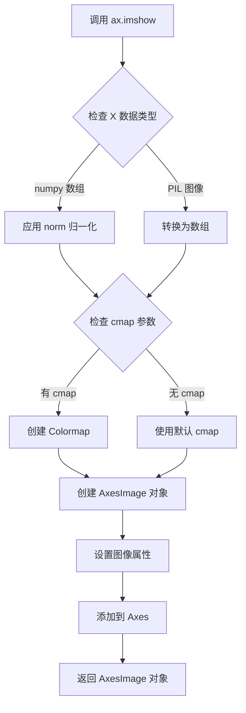

#### 带注释源码

```python
# 示例代码中 ax.imshow 的典型调用方式

# 1. 基本调用 - 使用默认设置显示数组数据
# ax: Axes 对象
# Z: 2D numpy 数组，包含 cos(X) * sin(Y) * 10 的计算结果
im = ax.imshow(Z, origin='lower', cmap=cmap)

# 参数说明：
# - Z: 输入的 2D 数组数据
# - origin='lower': 设置原点位置在左下角（数组的第一行对应 y=0）
# - cmap=cmap: 指定使用的颜色映射（LinearSegmentedColormap 对象）

# 2. 使用自定义注册的颜色映射
im2 = axs[1, 0].imshow(Z, cmap='BlueRed2')
# - cmap='BlueRed2': 使用通过 mpl.colormaps.register() 注册的自定义颜色映射

# 3. 使用全局默认颜色映射（通过 rcParams 设置）
im3 = axs[0, 1].imshow(Z)
# - 未指定 cmap，使用 plt.rcParams['image.cmap'] 指定的默认颜色映射

# 4. 显示图像后动态更改颜色映射
im4 = axs[1, 1].imshow(Z)  # 初始显示
im4.set_cmap('BlueRedAlpha')  # 之后通过返回的 AxesImage 对象更改颜色映射
# - set_cmap() 方法允许在绘制后更改颜色映射

# 相关的其他方法调用：
# fig.colorbar(im, ax=ax) - 为图像添加颜色条
# im.set_cmap('new_cmap') - 动态更改颜色映射
# im.get_cmap() - 获取当前使用的颜色映射对象
```


### `fig.colorbar`

在matplotlib中，`fig.colorbar` 是 `Figure` 类的一个方法，用于创建一个颜色条（colorbar）来显示图像的映射值与颜色的对应关系。该方法接收一个 `ScalarMappable` 对象（如 `imshow` 返回的图像对象）和一个可选的 `Axes` 对象作为参数，并在指定的坐标轴区域创建颜色条。

参数：

- `mappable`：`matplotlib.cm.ScalarMappable`，需要添加颜色条的图像映射对象（如 `imshow` 返回的 AxesImage 对象）
- `ax`：`matplotlib.axes.Axes`，可选参数，颜色条要放置的坐标轴对象
- `use_gridspec`：`bool`，可选，是否使用gridspec布局来放置颜色条，默认为 True
- `**kwargs`：其他可选参数，传递给 `Colorbar` 构造函数

返回值：`matplotlib.colorbar.Colorbar`，返回创建的 Colorbar 对象

#### 流程图

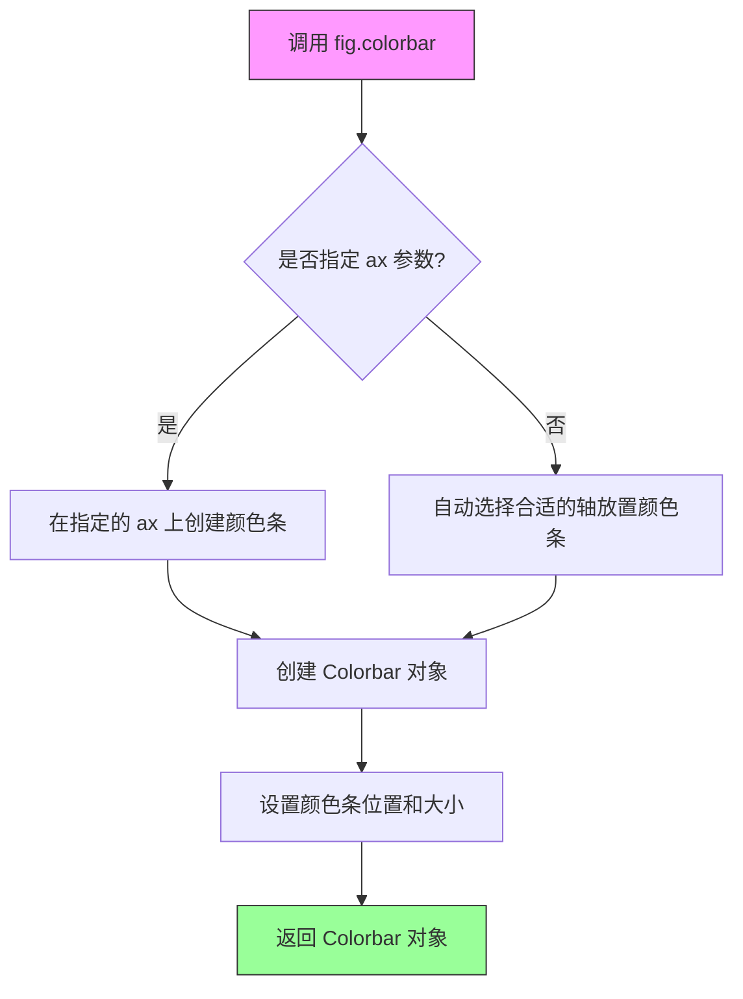

#### 带注释源码

```python
# 示例1：从列表创建colormap并添加颜色条
colors = [(1, 0, 0), (0, 1, 0), (0, 0, 1)]  # R -> G -> B
n_bins = [3, 6, 10, 100]  # Discretizes the interpolation into bins
cmap_name = 'my_list'
fig, axs = plt.subplots(2, 2, figsize=(6, 9))
fig.subplots_adjust(left=0.02, bottom=0.06, right=0.95, top=0.94, wspace=0.05)
for n_bin, ax in zip(n_bins, axs.flat):
    # Create the colormap
    cmap = LinearSegmentedColormap.from_list(cmap_name, colors, N=n_bin)
    # 使用imshow创建图像,返回AxesImage对象
    im = ax.imshow(Z, origin='lower', cmap=cmap)
    ax.set_title("N bins: %s" % n_bin)
    # 调用fig.colorbar为图像添加颜色条
    # 参数1: mappable - 图像对象 (AxesImage)
    # 参数2: ax - 在哪个坐标轴上创建颜色条
    fig.colorbar(im, ax=ax)


# 示例2：使用自定义colormap创建图像并添加颜色条
blue_red1 = LinearSegmentedColormap('BlueRed1', cdict1)
im1 = axs[0, 0].imshow(Z, cmap=blue_red1)
# 为第一个子图添加颜色条
fig.colorbar(im1, ax=axs[0, 0])


# 示例3：使用注册的自定义colormap
im2 = axs[1, 0].imshow(Z, cmap='BlueRed2')
fig.colorbar(im2, ax=axs[1, 0])


# 示例4：使用默认colormap
plt.rcParams['image.cmap'] = 'BlueRed3'
im3 = axs[0, 1].imshow(Z)
fig.colorbar(im3, ax=axs[0, 1])
axs[0, 1].set_title("Alpha = 1")


# 示例5：在图像后方绘制线条并添加颜色条
axs[1, 1].plot([0, 10 * np.pi], [0, 20 * np.pi], color='c', lw=20, zorder=-1)
im4 = axs[1, 1].imshow(Z)
fig.colorbar(im4, ax=axs[1, 1])

# 动态更改colormap
im4.set_cmap('BlueRedAlpha')
axs[1, 1].set_title("Varying alpha")
```


### `mpl.colormaps.register`

注册新的colormap到matplotlib的colormap注册表中，使其可以通过名称在绘图中使用。

参数：

-  `cmap`：`matplotlib.colors.Colormap`，要注册的colormap对象（如LinearSegmentedColormap实例）
-  `name`：`str`，可选，colormap的名称。如果colormap对象已有名称且未提供此参数，则使用对象原有的名称
-  `force`：`bool`，可选，默认值为`False`。如果为`True`，则允许覆盖已存在的同名colormap

返回值：`None`，无返回值

#### 流程图

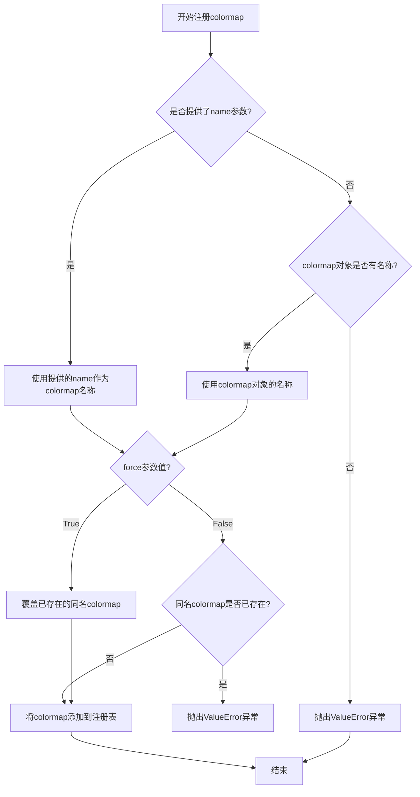

#### 带注释源码

```python
# 从示例代码中可以看到mpl.colormaps.register的典型用法：
# 1. 创建LinearSegmentedColormap对象
# 2. 调用mpl.colormaps.register注册到全局colormap注册表

# 示例1: 注册名为'BlueRed2'的colormap
cmap_blue_red2 = LinearSegmentedColormap('BlueRed2', cdict2)
mpl.colormaps.register(cmap_blue_red2)

# 示例2: 注册名为'BlueRed3'的colormap  
cmap_blue_red3 = LinearSegmentedColormap('BlueRed3', cdict3)
mpl.colormaps.register(cmap_blue_red3)

# 示例3: 注册带透明度的colormap
cmap_blue_red_alpha = LinearSegmentedColormap('BlueRedAlpha', cdict4)
mpl.colormaps.register(cmap_blue_red_alpha)

# 注册后可以通过名称在绘图时使用
im = ax.imshow(Z, cmap='BlueRed2')  # 使用注册的colormap名称
fig.colorbar(im, ax=ax)

# 或者设置为全局默认colormap
plt.rcParams['image.cmap'] = 'BlueRed3'

# 后续也可以动态更改colormap
im.set_cmap('BlueRedAlpha')
```


### `plt.rcParams['image.cmap']`

设置 matplotlib 的默认图像颜色映射，使得后续未指定颜色映射的图像自动使用指定的颜色映射。

参数：

- `key`：`str`，要设置的参数键名，例如 `'image.cmap'`
- `value`：`str`，要设置的参数值，例如 `'BlueRed3'`

返回值：`None`，无返回值，直接修改全局配置

#### 流程图

```mermaid
graph TD
    A[开始] --> B[执行 plt.rcParams['image.cmap'] = 'BlueRed3']
    B --> C{更新全局 rcParams}
    C --> D[后续图像自动使用 BlueRed3 颜色映射]
    D --> E[结束]
```

#### 带注释源码

```python
# 设置默认的颜色映射为 'BlueRed3'
# 这一行修改了 matplotlib 的全局配置，使后续使用 plt.imshow() 等函数绘制图像时，
# 如果未指定 cmap 参数，将自动使用 'BlueRed3' 颜色映射
plt.rcParams['image.cmap'] = 'BlueRed3'
```


### `im4.set_cmap`

动态修改已绘制图像的colormap，并自动更新关联的颜色条（colorbar）。该方法允许在图像绘制后更改配色方案，适用于需要根据用户交互或数据特征动态调整可视化效果的场景。

参数：

- `name`：`str`，要设置的colormap名称，可以是注册在matplotlib.colormaps中的任何colormap名称（如'BlueRedAlpha'、'viridis'、'jet'等），也可以是Colormap对象本身。

返回值：`None`，该方法直接修改当前对象的内部状态，不返回任何值。

#### 流程图

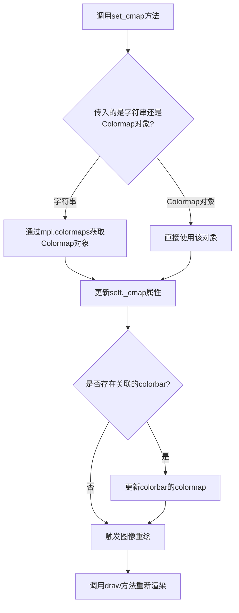

#### 带注释源码

```python
# 这是一个示例调用，展示了set_cmap的实际用法
# im4 是通过 imshow() 创建的 AxesImage 对象
im4 = axs[1, 1].imshow(Z)  # 创建图像对象

# set_cmap 方法定义在 matplotlib.cm.ScalarMappable 类中
# AxesImage 继承自 ScalarMappable
# 实际调用：
im4.set_cmap('BlueRedAlpha')  # 将colormap设置为自定义的BlueRedAlpha

# 内部实现逻辑（简化版）：
# def set_cmap(self, cmap):
#     """
#     Set the colormap for the image.
#     
#     Parameters
#     ----------
#     cmap : str or Colormap
#         The colormap to use. Either a registered name or a Colormap instance.
#     """
#     # 如果传入的是字符串，通过colormaps注册表查找
#     if isinstance(cmap, str):
#         cmap = mpl.colormaps[cmap]
#     
#     # 更新内部colormap引用
#     self._cmap = cmap
#     
#     # 如果有colorbar，更新colorbar的colormap
#     if self.colorbar is not None:
#         self.colorbar.set_cmap(cmap)
#     
#     # 标记需要重新绘制
#     self.stale = True
```


### `Figure.suptitle`

为图形（Figure）对象添加总标题，用于在图形顶部居中显示主标题文本。

参数：

- `s`：`str`，要显示的标题文本内容
- `x`：`float`，标题的 x 坐标位置（0.0-1.0之间），默认为 0.5（居中）
- `y`：`float`，标题的 y 坐标位置（0.0-1.0之间），默认为 0.98（顶部附近）
- `horizontalalignment` / `ha`：`str`，水平对齐方式，可选 'center'（默认）、'left'、'right'
- `verticalalignment` / `va`：`str`，垂直对齐方式，可选 'top'、'center'、'bottom'
- `fontsize`：`int` 或 `float`，标题字体大小，代码中传入 16
- `fontweight`：`str` 或 `int`，标题字体粗细程度
- `color`：`str`，标题文字颜色
- `backgroundcolor`：`str`，标题背景颜色
- `pad`：`float`，标题与图形顶部的距离（以 points 为单位）
- `**kwargs`：其他传递给 `matplotlib.text.Text` 的关键字参数

返回值：`matplotlib.text.Text`，返回创建的文本对象，可用于后续修改标题样式

#### 流程图

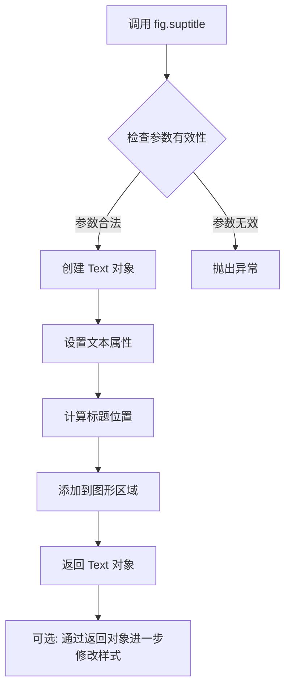

#### 带注释源码

```python
# 代码中的调用方式：
fig.suptitle('Custom Blue-Red colormaps', fontsize=16)

# 完整方法签名（参考 matplotlib 官方文档）：
# fig.suptitle(s, x=0.5, y=0.98, ha='center', va='top',
#              fontsize=None, fontweight=None, color=None,
#              backgroundcolor=None, pad=None, **kwargs)

# 参数说明：
# - s: 标题文本字符串，如 'Custom Blue-Red colormaps'
# - fontsize: 字体大小，代码中设置为 16
# - x, y: 标题位置坐标，默认在图形顶部居中
# - ha/va: 对齐方式控制
# - **kwargs: 可传递其他 Text 属性如 color, fontweight, fontfamily 等

# 返回值是 Text 对象，可以赋值后进行后续操作：
# title = fig.suptitle('Custom Blue-Red colormaps', fontsize=16)
# title.set_fontweight('bold')  # 进一步设置粗体
# title.set_color('red')       # 设置颜色

# 后续通常配合 fig.subplots_adjust(top=0.9) 调整布局，为标题留出空间
fig.subplots_adjust(top=0.9)
```


### `plt.show`

显示当前所有打开的图形窗口。在交互式使用中，该函数会阻塞程序执行直到用户关闭图形窗口；在非交互式后端（如Agg）中可能不起作用。

参数：

- `block`：`bool` 或 `None`，可选参数。控制是否阻塞程序执行以等待图形窗口关闭。默认为 `True`（在交互式后端中阻塞），设为 `False` 可实现非阻塞调用。

返回值：`None`，该函数不返回任何值。

#### 流程图

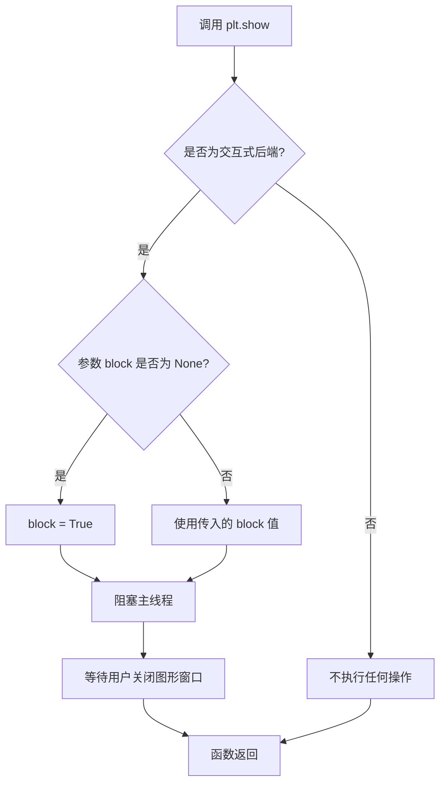

#### 带注释源码

```python
# plt.show() 位于 matplotlib/pyplot.py 中
# 以下为简化版实现逻辑：

def show(*, block=None):
    """
    显示所有打开的图形窗口。
    
    参数:
        block: bool, optional
            是否阻塞程序执行以等待用户关闭图形窗口。
            在交互式后端中默认为 True。
    """
    # 获取全局图形管理器
    global _showregistry
    
    # 遍历所有注册的显示函数并调用它们
    for func in _showregistry:
        # _showregistry 存储了各后端的显示函数
        func()
    
    # 如果 block 为 True 或 None（交互式后端），则阻塞
    if block:
        # 在交互式后端中，通常会启动事件循环
        # 并等待用户交互（如关闭窗口）
        import time
        while _is_figure_showing():
            time.sleep(0.1)  # 简易的事件循环模拟
            # 实际实现中会调用 GUI 框架的事件循环
            # 如 Qt 的 QApplication.exec_()
```

#### 实际使用示例

```python
# 在提供的代码中，plt.show() 的使用位置：
fig.suptitle('Custom Blue-Red colormaps', fontsize=16)
fig.subplots_adjust(top=0.9)

# 显示所有之前创建的子图
plt.show()  # <--- 提取的目标函数
```

#### 说明

| 属性 | 值 |
|------|-----|
| 所属模块 | `matplotlib.pyplot` |
| 函数签名 | `plt.show(*, block=None)` |
| 文档字符串 | "Display all open figures." |
| 实际行为 | 取决于所选用的后端（如 Qt, TkAgg, Agg 等） |


### `LinearSegmentedColormap.from_list`

从颜色列表创建线性分段色彩映射表的类方法。

参数：

- `name`：`str`，色彩映射表的名称，用于标识和注册该色彩映射表
- `colors`：`array-like`，颜色列表，可以是RGB元组、十六进制颜色代码或其他matplotlib支持的颜色格式
- `N`：`int`，可选参数，色彩映射表离散化的区间数量，默认值为`256`，表示创建平滑的渐变

返回值：`LinearSegmentedColormap`，返回新创建的线性分段色彩映射表对象

#### 流程图

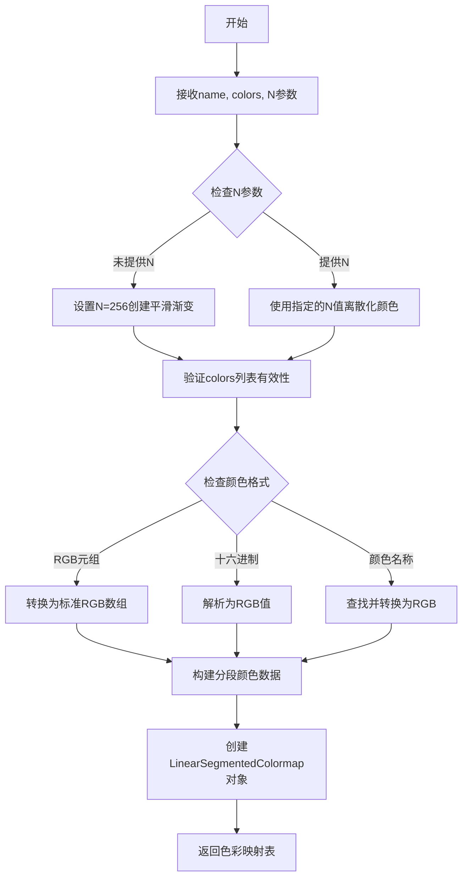

#### 带注释源码

```python
# 从代码中使用示例提取的调用方式
# 颜色列表：红色 -> 绿色 -> 蓝色
colors = [(1, 0, 0), (0, 1, 0), (0, 0, 1)]

# 不同的离散化级别
n_bins = [3, 6, 10, 100]

# 色彩映射表名称
cmap_name = 'my_list'

# 调用from_list方法创建色彩映射表
# 参数1: name - 色彩映射表名称
# 参数2: colors - 颜色列表
# 参数3: N - 离散化的区间数量（可选，默认256）
cmap = LinearSegmentedColormap.from_list(cmap_name, colors, N=n_bin)

# 使用创建的色彩映射表绘制数据
im = ax.imshow(Z, origin='lower', cmap=cmap)
```

#### 详细说明

该方法是`LinearSegmentedColormap`类的类方法（装饰器为`@classmethod`），用于从颜色列表快速创建线性分段的色彩映射表。颜色列表中的颜色将均匀分布在0到1的区间上，形成平滑的颜色渐变。

**关键特性：**

- **颜色插值**：在相邻颜色之间进行线性插值生成中间颜色
- **离散化支持**：通过N参数控制输出颜色的数量，用于创建离散的色彩映射表
- **格式灵活**：支持RGB元组、十六进制颜色代码、颜色名称等多种格式
- **色彩映射表注册**：创建的色彩映射表可自动注册到matplotlib的色彩映射表注册表中


### `mpl.colormaps.register` (ColormapRegistry.register)

描述：将自定义 colormap 注册到 matplotlib 的全局注册表中，使其可以通过名称（如 'BlueRed2'）在后续代码中通过 `plt.get_cmap('BlueRed2')` 或 `mpl.colormaps['BlueRed2']` 访问。

参数：

-  `cmap`：`Colormap` 类型，要注册的 colormap 对象（如 `LinearSegmentedColormap` 实例）。
-  `name`：`str` 类型，可选，colormap 的名称。如果未提供，则使用 colormap 对象的 name 属性。
-  `force`：`bool` 类型，可选，是否覆盖已存在的同名 colormap。默认为 False。

返回值：`None` 类型，无返回值。

#### 流程图

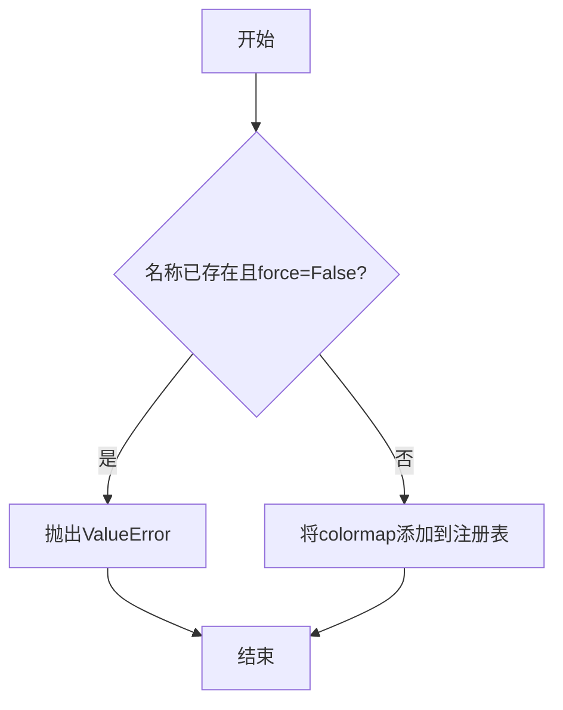

#### 带注释源码

```python
def register(self, cmap, name=None, force=False):
    """
    Register a colormap to make it available by name.

    Parameters
    ----------
    cmap : Colormap
        The colormap object to register (e.g., LinearSegmentedColormap).
    name : str, optional
        The name for the colormap. If not provided, uses cmap.name.
    force : bool, default: False
        If True, overwrite an existing colormap with the same name.

    Returns
    -------
    None

    Raises
    ------
    ValueError
        If a colormap with the same name already exists and force is False.
    """
    # 如果未提供名称，则使用 colormap 对象的 name 属性
    if name is None:
        name = cmap.name
    
    # 检查是否已存在同名 colormap（除非 force=True）
    if name in self._cmaps and not force:
        raise ValueError(f"A colormap named '{name}' already exists. Use force=True to overwrite.")
    
    # 将 colormap 添加到注册表字典中
    self._cmaps[name] = cmap
```


## 关键组件


### LinearSegmentedColormap.from_list
从颜色列表创建分段线性颜色映射的方法

### LinearSegmentedColormap
用于创建自定义分段线性颜色映射的类

### cdict 字典
定义自定义颜色映射中 RGB 通道变化规则的字典结构

### mpl.colormaps.register
注册自定义颜色映射到 matplotlib 的颜色映射注册表中

### imshow
在轴上显示图像数据的函数

### fig.colorbar
显示颜色条以展示颜色映射与数值的对应关系

### plt.rcParams
全局配置字典，用于设置 matplotlib 的默认参数

### set_cmap
动态更改图像颜色映射的方法


## 问题及建议


### 已知问题

- **魔法数字和硬编码值**：代码中多处使用硬编码数值（如 `0.1`、`2 * np.pi`、`6, 9`、`0.02` 等），缺乏解释和常量定义，降低了可读性和可维护性。
- **全局变量污染**：x、y、X、Y、Z 等变量以全局方式定义，没有封装到函数或类中，可能导致命名空间污染和意外的副作用。
- **重复代码**：子图创建、imshow 调用和 colorbar 添加的代码在多处重复，未进行抽象和复用。
- **缺少错误处理**：没有对输入数据（如 colors 列表、cdict 字典）进行验证，假设输入总是有效的。
- **缺少函数封装**：所有代码都直接在模块级别执行，缺乏函数封装降低了代码的可测试性和可重用性。
- **cdict4 字典解包风险**：使用 `**cdict3` 进行字典解包，如果 cdict3 被修改，会意外影响 cdict4。
- **rcParams 全局状态修改**：`plt.rcParams['image.cmap'] = 'BlueRed3'` 修改全局状态，可能影响后续代码行为且未恢复。
- **颜色映射定义分散**：cdict1、cdict2、cdict3、cdict4 四个颜色映射定义分散且格式相似，缺乏统一管理。

### 优化建议

- **提取配置常量**：将布局参数（ figsize、subplots_adjust 参数等）、数据生成参数（步长、范围等）提取为模块级常量或配置文件。
- **函数封装**：将数据生成、颜色映射创建、子图绘制逻辑分别封装为独立函数，提高模块化程度。
- **添加输入验证**：为颜色映射创建函数添加参数验证，检查 colors 列表格式、cdict 字典结构等。
- **使用类或命名空间管理**：将相关的颜色映射定义封装到类或字典中统一管理。
- **上下文管理器处理全局状态**：使用 matplotlib 的 rc_context 或手动恢复 rcParams，避免全局状态污染。
- **减少重复代码**：创建通用的子图绘制函数，接收 colormap 和参数进行绘制。
- **添加类型注解**：为函数参数和返回值添加类型注解，提高代码可读性和 IDE 支持。


## 其它


### 设计目标与约束

本代码示例旨在演示matplotlib中自定义colormap的创建和使用方法。核心设计目标包括：（1）提供从颜色列表创建离散化colormap的方法；（2）展示通过字典定义RGB通道分段线性映射的机制；（3）演示colormap的注册、调用和运行时切换。约束条件：需要matplotlib 3.5+版本支持，依赖numpy进行数值计算，colormap定义遵循0-1范围的x轴分段规则。

### 错误处理与异常设计

代码中未显式实现错误处理机制，但在实际使用中应注意：（1）颜色值必须为RGB tuple且范围在0-1之间，否则会抛出ValueError；（2）cdict中的x值必须严格递增且覆盖0-1范围；（3）N参数必须为正整数，否则会引发TypeError或ValueError；（4）注册colormap时若名称已存在会覆盖已有项，建议使用唯一名称。

### 数据流与状态机

代码执行流程为：导入依赖模块 → 定义颜色数据（colors列表或cdict字典）→ 创建LinearSegmentedColormap对象 → 通过from_list或直接构造函数初始化 → 可选注册到全局colormap注册表 → 创建figure和axes → 调用imshow绑定colormap → 通过colorbar显示图例 → 可通过set_cmap动态切换。状态转换：初始态 → colormap创建态 → 绑定态 → 渲染态 → 可选的动态切换态。

### 外部依赖与接口契约

核心依赖包括：matplotlib>=3.5.0、numpy>=1.20.0、matplotlib.colors.LinearSegmentedColormap类、matplotlib.cm.ColormapRegistry类。接口契约：LinearSegmentedColormap.from_list(name, colors, N)接受字符串名称、颜色列表和离散化数量，返回Colormap实例；mpl.colormaps.register(cmap)接受Colormap对象并注册到全局注册表；imshow的cmap参数接受colormap名称或对象；set_cmap()方法接受字符串名称并动态修改当前图像的colormap。

### 性能考虑

代码示例侧重于功能演示，生产环境中需注意：大N值（如100+）会增加内存占用和渲染时间；复杂的cdict定义（多段、透明度）会显著增加计算开销；动态切换colormap会触发重新渲染，建议预先定义所有需要的colormap。推荐做法：对于固定场景，在初始化阶段完成colormap创建和注册，避免运行时重复创建。

### 安全性考虑

本代码示例不涉及用户输入或网络交互，安全性风险较低。但需注意：（1）避免使用过长的颜色列表导致内存问题；（2）cdict中的数值应做边界检查（0-1范围）；（3）在多线程环境下，mpl.colormaps.register()操作应加锁保护。

### 测试策略

建议测试场景包括：（1）验证不同N值（1、2、3、10、256）下的colormap创建；（2）测试连续和带间断点的cdict定义；（3）验证colormap注册、查询和覆盖行为；（4）测试set_cmap动态切换功能；（5）验证colorbar与colormap的绑定一致性；（6）边界条件测试：空颜色列表、单色、完整0-1范围外的x值。

### 配置管理

代码使用plt.rcParams['image.cmap']全局设置默认colormap，影响后续所有imshow调用。局部优先级：imshow的cmap参数 > set_cmap()调用 > rcParams默认设置。建议在脚本开头集中配置，避免在多处分散设置导致难以追踪。

### 版本兼容性

代码使用了mpl.colormaps（新API）和plt.colormaps（兼容旧版），建议matplotlib 3.7+使用mpl.colormaps。LinearSegmentedColormap.from_list在matplotlib 3.5+中可用。alpha通道支持需要matplotlib 3.4+。向后兼容写法：可用matplotlib.cm.get_cmap()替代新API，但已标记为deprecated。

### 使用示例和最佳实践

最佳实践建议：（1）优先使用from_list创建简单colormap，代码更简洁；（2）复杂渐变使用cdict定义，便于精确控制各通道；（3）注册colormap时使用有意义的唯一名称；（4）避免在循环中重复创建colormap；（5）需要透明度时在cdict中添加alpha键；（6）使用colorbar时确保与对应的image axes正确绑定；（7）动态切换场景使用set_cmap()而非重新调用imshow。

    