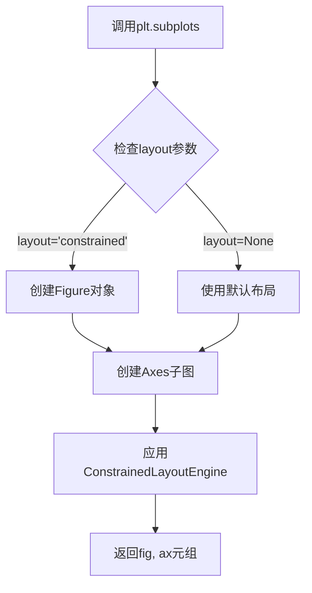
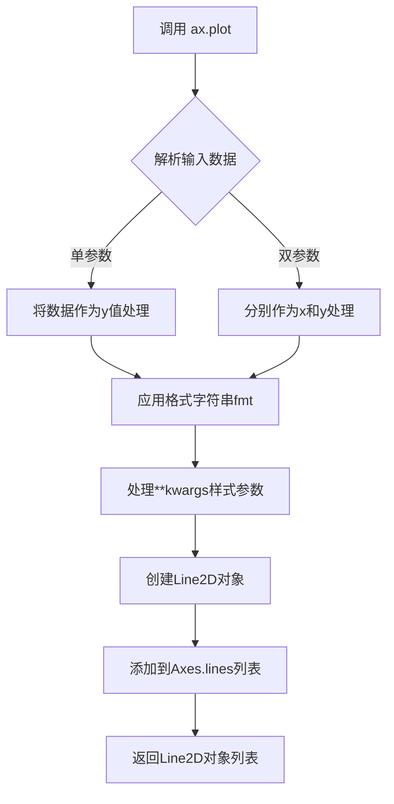
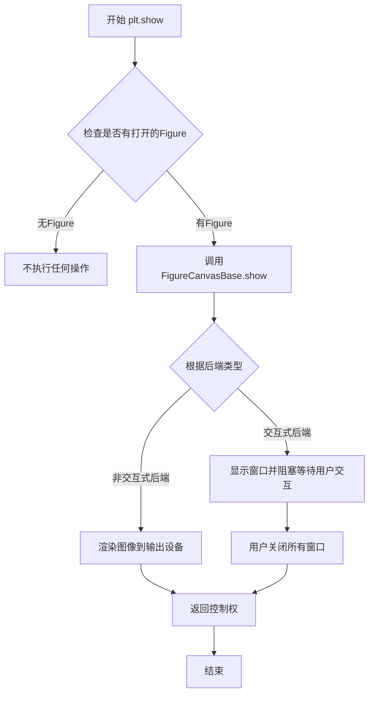
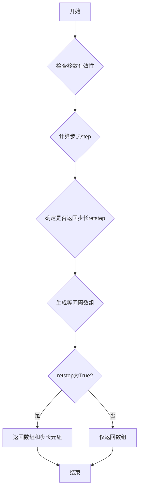

# `matplotlib\galleries\examples\color\individual_colors_from_cmap.py` 详细设计文档

本示例展示了如何从matplotlib的连续colormap（如plasma）和离散colormap（如Dark2）中提取单独的颜色，并使用这些颜色绘制多条线条，用于数据可视化中的色彩定制。

## 整体流程

```mermaid
graph TD
    A[开始] --> B[导入模块: matplotlib.pyplot, numpy, matplotlib]
B --> C[设置n_lines = 21]
C --> D[获取plasma连续colormap对象]
D --> E[使用np.linspace生成0到1的21个采样点]
E --> F[调用colormap获取21种渐变颜色]
F --> G[创建figure和axes布局]
G --> H[循环遍历颜色数组]
H --> I[使用当前颜色绘制线条 ax.plot([0, i], color=color)]
I --> J[plt.show()显示第一张图]
J --> K[获取Dark2离散colormap的colors属性]
K --> L[创建新的figure和axes]
L --> M[循环遍历离散颜色列表]
M --> N[使用当前颜色绘制线条]
N --> O[plt.show()显示第二张图]
```

## 类结构

```
脚本文件 (非面向对象)
└── 主要流程: 连续colormap颜色提取 -> 离散colormap颜色提取
```

## 全局变量及字段


### `n_lines`
    
要绘制的线条数量

类型：`int`
    


### `cmap`
    
plasma连续colormap对象

类型：`Colormap`
    


### `colors`
    
从colormap提取的颜色数组

类型：`ndarray`
    


### `fig`
    
matplotlib图形对象

类型：`Figure`
    


### `ax`
    
matplotlib坐标轴对象

类型：`Axes`
    


### `i`
    
循环索引变量

类型：`int`
    


### `color`
    
单个颜色值(RGB)

类型：`tuple`
    


    

## 全局函数及方法


### `plt.subplots`

创建图形和坐标轴（子图），返回Figure对象和Axes对象，支持约束布局引擎。

参数：

- `layout`：`str`，布局管理器类型，此处传入`'constrained'`表示使用约束布局引擎自动调整子图间距

返回值：`tuple(Figure, Axes)`，返回图形对象和坐标轴对象（或坐标轴数组）

#### 流程图



#### 带注释源码

```python
# 调用plt.subplots函数创建图形和子图
# layout='constrained' 使用约束布局引擎自动调整子图间距和边距
fig, ax = plt.subplots(layout='constrained')

# 参数说明：
# - fig: matplotlib.figure.Figure 对象，表示整个图形
# - ax: matplotlib.axes.Axes 对象，表示坐标轴/子图
# - layout='constrained': 启用约束布局，确保标签和图例不被裁剪

# 示例中用于绑定colors列表中的颜色绘制多条线条
for i, color in enumerate(colors):
    ax.plot([0, i], color=color)  # 绘制从(0,0)到(0,i)的线条，使用指定颜色

plt.show()  # 显示图形
```


### `matplotlib.axes.Axes.plot`

绘制线条是matplotlib中最基本也是最核心的操作之一。该方法用于在Axes对象上绘制折线图，可接受多种格式的数据输入，并支持丰富的样式定制选项，包括颜色、线型、标记等。

参数：

- `x`：`array-like` 或 标量，可选
  - X轴数据。如果只提供一个位置参数，则该参数被视为y值。
- `y`：`array-like` 或 标量，必填
  - Y轴数据。
- `fmt`：`str`，可选
  - 格式字符串，组合了线型和颜色标记的快捷方式（如 'ro' 表示红色圆圈）。
- `**kwargs`：`关键字参数`
  - 额外的绘图属性，包括但不限于：
    - `color`：`str` 或 颜色值，线条颜色
    - `linewidth`：`float`，线条宽度
    - `linestyle`：`str`，线型（如 '-'、'--'、':'）
    - `marker`：`str`，数据点标记样式
    - `markersize`：`float`，标记大小
    - `label`：`str`，图例标签

返回值：`list of~matplotlib.lines.Line2D`
  - 返回一个包含所有创建的Line2D对象的列表，每个对象代表一条绘制的线条。

#### 流程图



#### 带注释源码

```python
# 代码示例：从colormap中提取颜色并绘制多条线条

# 导入必要的库
import matplotlib.pyplot as plt
import numpy as np
import matplotlib as mpl

# 定义要绘制的线条数量
n_lines = 21
# 获取'plasma'colormap对象
cmap = mpl.colormaps['plasma']

# 从colormap中提取21个均匀分布的颜色
# np.linspace(0, 1, n_lines)生成0到1之间的21个等间距值
colors = cmap(np.linspace(0, 1, n_lines))

# 创建图形和坐标轴对象，layout='constrained'自动调整布局
fig, ax = plt.subplots(layout='constrained')

# 遍历每个颜色，绘制一条线条
for i, color in enumerate(colors):
    # ax.plot() 方法调用
    # 第一个参数 [0, i] 是y值数据（作为单个位置参数传入，相当于y值）
    # color=color 是关键字参数，指定线条颜色
    ax.plot([0, i], color=color)

# 显示图形
plt.show()

# 第二个示例：从离散colormap提取颜色
# 获取'Dark2'离散colormap的所有颜色
colors = mpl.colormaps['Dark2'].colors

fig, ax = plt.subplots(layout='constrained')

for i, color in enumerate(colors):
    # 同样的plot调用，只是使用不同的颜色
    ax.plot([0, i], color=color)

plt.show()
```


### `plt.show`

`plt.show()` 是 matplotlib.pyplot 模块中的核心显示函数，负责将当前所有打开的 Figure 对象渲染并显示在屏幕上。该函数会阻塞程序执行直到用户关闭显示窗口（在某些交互式后端中），是可视化流程中的最后一步。

参数：无需参数

返回值：`None`，无返回值

#### 流程图



#### 带注释源码

```python
# plt.show() 函数的简化实现逻辑
def show(block=None):
    """
    显示所有打开的Figure图形窗口。
    
    Parameters
    ----------
    block : bool, optional
        是否阻塞程序执行。默认值为None，
        在某些后端中等同于True。
    """
    
    # 获取当前的图形管理器
    managers = _pylab_helpers.Gcf.get_all_fig_managers()
    
    if not managers:
        # 如果没有打开的图形，直接返回
        return
    
    # 遍历所有Figure管理器并显示
    for manager in managers:
        # 调用底层Canvas的show方法
        # Canvas负责将图形渲染到显示设备
        manager.show()
        
        # 对于需要阻塞的后端（如Qt、Tkinter等）
        # 启动事件循环并等待用户交互
        if block is None:
            # 默认阻塞模式
            manager.show_block()
        elif block:
            manager.show_block()
```

#### 技术说明

| 属性 | 值 |
|------|-----|
| 所属模块 | `matplotlib.pyplot` |
| 底层实现 | `matplotlib.backend_bases.FigureCanvasBase.show` |
| 阻塞行为 | 取决于后端设置（默认在交互式后端中阻塞） |
| 多次调用 | 每次调用会刷新所有已存在的Figure |

#### 注意事项

1. **在脚本中使用**：在脚本中调用 `plt.show()` 后，程序会等待用户关闭图形窗口才继续执行（或直接结束，取决于后端）。
2. **在 Jupyter Notebook 中**：通常需要使用 `%matplotlib inline` 或 `%matplotlib widget` 以正确显示。
3. **与 `savefig` 配合**：在调用 `show()` 之前保存图像，否则显示后图形可能会被清除。
4. **后端依赖**：具体行为（如是否阻塞）完全取决于当前设置的 matplotlib 后端。


### `np.linspace()`

生成等间隔数值序列的函数，在指定区间[start, stop]内生成num个均匀分布的样本点，常用于创建图表的x轴坐标或颜色映射的归一化参数。

参数：

- `start`：`float`，序列的起始值
- `stop`：`float`，序列的结束值（当endpoint为True时包含该值）
- `num`：`int`，生成样本点的数量，默认值为50
- `endpoint`：`bool`，如果为True，则stop值是最后一个样本，否则不包含，默认True
- `retstep`：`bool`，如果为True，则返回样本之间的步长，默认False
- `dtype`：`dtype`，输出数组的数据类型，如果为None，则推断数据类型
- `axis`：`int`，当stop不是标量时，用于存储结果的轴，默认0

返回值：`ndarray`，包含num个等间隔样本的数组

#### 流程图



#### 带注释源码

```python
def linspace(start, stop, num=50, endpoint=True, retstep=False, dtype=None, axis=0):
    """
    返回指定间隔内的等间隔数字序列。
    
    参数:
        start: 序列的起始值
        stop: 序列的结束值
        num: 生成样本的数量，默认50
        endpoint: 是否包含stop值，默认True
        retstep: 是否返回步长，默认False
        dtype: 输出数组的数据类型
        axis: 存储结果的轴
    
    返回:
        ndarray: 等间隔的样本序列
    """
    # 确保num是整数且非负
    num = operator.index(num)
    if num < 0:
        raise ValueError("Number of samples, %d, must be non-negative." % num)
    
    # 步长计算
    if endpoint:
        step = (stop - start) / (num - 1) if num > 1 else nan
    else:
        step = (stop - start) / num if num > 0 else nan
    
    # 使用arange生成序列
    y = arange(0, num, dtype=dtype) * step + start
    
    # 如果endpoint为True，需要修正最后一个值
    if endpoint and num > 0:
        y[-1] = stop
    
    # 根据retstep决定返回值
    if retstep:
        return y, step
    return y
```


### `Colormap.__call__`

该方法是 Colormap 类的核心调用接口，通过传入 [0, 1] 范围内的浮点数（或浮点数列表）从调色板中检索对应的颜色值，支持返回 RGBA 或 RGB 格式，并可配置透明度与字节输出模式。

参数：

- `X`：`float` 或 `array-like`，数值或数值序列，范围应在 [0, 1] 之间，表示要获取的颜色在调色板中的位置（0 为起始颜色，1 为结束颜色）
- `alpha`：`float` 或 `array-like`，可选参数，设置返回颜色的透明度，范围 [0, 1]
- `bytes`：`bool`，默认值为 `False`，如果为 `False` 返回浮点数数组（0-1 范围），如果为 `True` 返回整数数组（0-255 范围）

返回值：`ndarray`，返回颜色数组，形状取决于输入：
- 单个浮点数输入：返回 RGBA 颜色数组，形状为 (4,)
- 浮点数数组输入：返回颜色数组，形状为 (N, 4) 或 (N, 3)，其中 N 为输入数组长度

#### 流程图

```mermaid
flowchart TD
    A[开始 __call__] --> B{检查输入 X 是否为标量}
    B -->|是| C[将 X 包装为数组]
    B -->|否| D[直接使用输入数组]
    C --> E[调用 _init_colormap]
    D --> E
    E --> F{检查 alpha 是否为 None}
    F -->|是| G[使用默认透明度 1.0]
    F -->|否| H[使用用户提供的 alpha 值]
    G --> I{检查 bytes 参数}
    H --> I
    I -->|bytes=False| J[返回浮点数格式 [0,1]]
    I -->|bytes=True| K[返回整数格式 [0,255]]
    J --> L[结束]
    K --> L
```

#### 带注释源码

```python
def __call__(self, X, alpha=None, bytes=False):
    """
    调用 colormap 获取颜色值
    
    Parameters
    ----------
    X : float or array-like
        输入值，范围 [0, 1], 0 表示 colormap 的起始颜色,
        1 表示 colormap 的结束颜色
    alpha : float or array-like, optional
        透明度值，范围 [0, 1], 1 为完全不透明
    bytes : bool, default: False
        如果为 False, 返回浮点数数组 (0-1 范围)
        如果为 True, 返回无符号字节数组 (0-255 范围)
    
    Returns
    -------
    ndarray
        颜色数组，如果 bytes=False 返回浮点数，
        如果 bytes=True 返回整数
    """
    # 将输入转换为 numpy 数组以便处理
    X = np.asarray(X)
    
    # 获取调色板的 RGBA 颜色值
    # _lut 是一个包含所有颜色查找表的数组
    rgba = self._lut[X, :]
    
    # 处理透明度
    if alpha is not None:
        # 如果提供了 alpha 值，将其应用到所有颜色
        if np.ndim(alpha) == 0:
            rgba[:, -1] = alpha
        else:
            rgba[:, -1] = alpha
    
    # 根据 bytes 参数决定输出格式
    if bytes:
        # 转换为 0-255 范围的整数
        return (rgba * 255).astype(np.uint8)
    else:
        # 返回 0-1 范围的浮点数
        return rgba
```


## 关键组件


### Colormap (matplotlib.colors.Colormap)

matplotlib的颜色映射基类，用于将[0,1]范围内的数值映射到颜色。通过调用cmap(value)可获取对应颜色。

### 连续型Colormap提取 (cmap(np.linspace(...)))

使用np.linspace(0, 1, n_lines)生成等间距的[0,1]区间数值，传入colormap获取对应的颜色数组。

### 离散型Colormap提取 (.colors属性)

ListedColormap的colors属性直接返回所有颜色的列表，无需调用colormap。

### 颜色序列注册表 (mpl.colormaps)

matplotlib 3.7+的新API，通过mpl.colormaps['name']访问colormap对象，替代旧的plt.cm.get_cmap()。

### np.linspace(0, 1, n_lines)

NumPy函数，在[0,1]区间生成n_lines个等间距的浮点数，用于从连续colormap中均匀采样颜色。

### 颜色应用 (ax.plot(..., color=color))

将提取的颜色应用到matplotlib图表的线条绘制中。


## 问题及建议


### 已知问题

- **硬编码值过多**：colormap名称（'plasma'、'Dark2'）、颜色数量（21）、绘图范围（[0,1]、[0,i]）均为硬编码，缺乏可配置性
- **代码重复**：两段绘图逻辑几乎完全相同，存在明显的代码重复（DRY原则违反）
- **缺乏错误处理**：未检查colormap是否存在、未验证n_lines参数有效性（如负数或零）
- **可测试性差**：代码直接执行plt.show()，没有返回值，难以进行单元测试
- **魔法数字**：数值0、1、21等缺乏有意义的常量定义
- **无函数封装**：所有代码都在顶层模块执行，缺少可复用的函数接口

### 优化建议

- 将绘图逻辑提取为可复用的函数，接收colormap名称、颜色数量等参数
- 使用配置文件或命令行参数替代硬编码值
- 添加参数验证和异常处理逻辑
- 定义常量类或枚举来管理颜色范围、默认值等
- 考虑返回figure对象而非直接show()，便于测试和集成
- 将重复的绘图逻辑抽象为通用函数，接受数据和颜色作为参数
- 为函数添加类型注解和文档字符串，提升可维护性


## 其它


### 设计目标与约束

本代码示例旨在演示如何从Matplotlib的colormap中提取单个颜色，包括连续colormap和离散colormap两种场景。设计目标包括：提供清晰的颜色提取示例代码，使开发者能够快速理解从colormap中获取颜色的方法；展示plasma连续colormap和Dark2离散colormap的不同使用方式；通过实际可视化结果验证颜色提取的正确性。约束条件方面，代码仅依赖Matplotlib和NumPy两个核心库，要求Python环境支持这些依赖；代码兼容Matplotlib 3.7+版本（colormaps注册表方式）；可视化结果受限于默认的绘图参数设置。

### 错误处理与异常设计

代码中主要的潜在错误包括：colormap名称不存在时会导致KeyError异常，例如mpl.colormaps['不存在的名称']会抛出KeyError；n_lines为0或负数时会导致np.linspace函数返回空数组，进而导致绘图数量为0；plt.show()在某些后端环境中可能失败。当前代码未实现显式的错误处理机制，属于概念验证性质的示例代码。在生产环境中使用颜色提取功能时，建议添加colormap名称验证、参数有效性检查、以及适当的异常捕获逻辑。

### 数据流与状态机

数据流主要分为两个独立分支：第一分支处理连续colormap（plasma），通过np.linspace生成0到1之间的等间距数组，然后调用colormap对象将浮点数数组转换为RGB颜色值数组；第二分支处理离散colormap（Dark2），直接访问.colors属性获取颜色列表。两个分支共享相同的绘图逻辑：创建figure和ax对象，遍历颜色列表绘制线条，最后调用plt.show()显示结果。状态机方面，代码流程为初始化阶段（导入库、设置参数）→ 数据准备阶段（颜色提取）→ 可视化阶段（绑定颜色和绘制）→ 显示阶段。

### 外部依赖与接口契约

主要外部依赖包括matplotlib库（版本3.7+推荐），其colormaps注册表接口返回Colormap对象，连续colormap支持__call__方法接收浮点数并返回RGBA颜色，离散colormap的colors属性返回颜色列表；numpy库用于生成等间距数组和数值计算。接口契约方面，mpl.colormaps是全局colormap注册表，支持通过colormap名称字符串访问；Colormap.__call__方法接受shape为(N,)或(N,4)的float数组，范围[0,1]，返回shape为(N,4)的RGBA数组；ListedColormap.colors属性返回numpy.ndarray对象，包含colormap定义的所有颜色。

### 性能考虑

当前代码在颜色提取阶段的性能表现良好，np.linspace对于21个采样点的处理速度很快，colormap的__call__方法底层经过高度优化。绘图阶段使用循环逐条绘制线条，当线条数量增加时（如n_lines很大），可以考虑使用向量化绘图方法替代循环以提升性能。内存占用方面，颜色数组的存储开销较小，对于一般使用场景无需特殊优化。实时应用场景中，若需要频繁创建figure和ax对象，可考虑复用图形对象以降低开销。

### 可测试性

代码的可测试性主要体现在以下几个方面：颜色提取逻辑可以独立进行单元测试，验证colormap调用返回值是否为有效的RGBA格式；np.linspace(0, 1, n_lines)的输出边界条件可测试，包括n_lines=1和n_lines=最大值的情况；绘图逻辑的测试相对复杂，需要mock plt.show()或使用agg后端进行无GUI测试。建议的测试策略包括验证colors数组的shape正确性、颜色值是否在[0,1]范围内、以及colors数组是否非空。

### 版本兼容性说明

代码使用了mpl.colormaps接口，这是Matplotlib 3.7引入的新API，用于替代旧的mpl.cm.get_cmap函数。在较旧的Matplotlib版本（<3.7）中，代码需要修改为使用mpl.cm.get_cmaps('plasma')和mpl.cm.get_cmaps('Dark2').colors。NumPy的np.linspace函数在所有主流版本中保持稳定兼容。代码在Python 3.8+环境中运行最佳，建议在项目依赖管理中明确Matplotlib>=3.7的版本要求。
    