# `matplotlib\galleries\examples\color\named_colors.py` 详细设计文档

这是一个Matplotlib示例脚本，用于可视化和展示Matplotlib支持的各种命名颜色，包括BASE_COLORS、TABLEAU_COLORS、CSS4_COLORS和XKCD_COLORS，通过绘制颜色表格的形式呈现颜色名称与对应颜色值。

## 整体流程

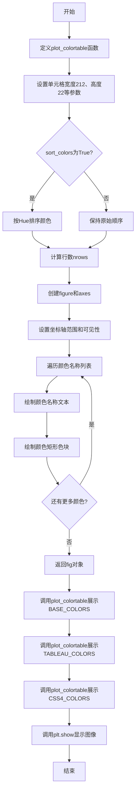

## 类结构

```
无类层次结构
└── 模块级函数 plot_colortable
```

## 全局变量及字段


### `cell_width`
    
颜色单元格宽度，值为212像素

类型：`int`
    


### `cell_height`
    
颜色单元格高度，值为22像素

类型：`int`
    


### `swatch_width`
    
颜色色块显示区域宽度，值为48像素

类型：`int`
    


### `margin`
    
图像四周边距，值为12像素

类型：`int`
    


### `names`
    
排序后的颜色名称列表

类型：`list`
    


### `n`
    
颜色总数

类型：`int`
    


### `nrows`
    
颜色表格行数，通过math.ceil计算

类型：`int`
    


### `width`
    
图像总宽度

类型：`int`
    


### `height`
    
图像总高度

类型：`int`
    


### `dpi`
    
图像分辨率，值为72

类型：`int`
    


### `fig`
    
Matplotlib图形对象

类型：`matplotlib.figure.Figure`
    


### `ax`
    
Matplotlib坐标轴对象

类型：`matplotlib.axes.Axes`
    


### `row`
    
当前颜色在表格中的行号

类型：`int`
    


### `col`
    
当前颜色在表格中的列号

类型：`int`
    


### `y`
    
文本和矩形区域的y坐标位置

类型：`int`
    


### `swatch_start_x`
    
颜色色块起始x坐标位置

类型：`int`
    


### `text_pos_x`
    
颜色名称文本起始x坐标位置

类型：`int`
    


    

## 全局函数及方法


### `plot_colortable`

该函数用于绘制一个颜色表，以可视化的方式展示给定颜色字典中的所有颜色，每个颜色以矩形色块和对应名称的形式呈现，支持按颜色排序和自定义列数。

参数：

- `colors`：`dict`，颜色字典，键为颜色名称，值为颜色值（如 hex 字符串或颜色元组）
- `ncols`：`int`，列数，默认为 4，控制颜色表的列布局
- `sort_colors`：`bool`，是否按颜色排序，默认为 True；若为 True，则按 hue（色相）、saturation（饱和度）、value（明度）和名称排序

返回值：`matplotlib.figure.Figure`，返回创建的 Matplotlib 图形对象

#### 流程图

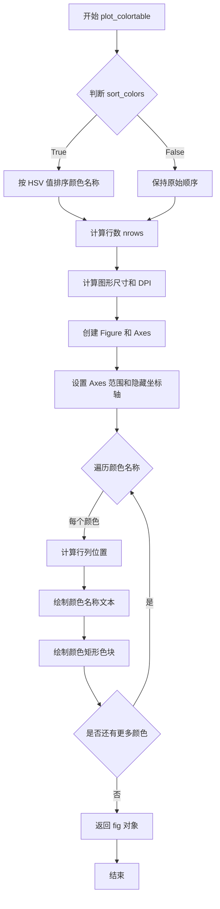

#### 带注释源码

```python
def plot_colortable(colors, *, ncols=4, sort_colors=True):
    """
    绘制颜色表的函数
    
    参数:
        colors: 颜色字典 {颜色名: 颜色值}
        ncols: 列数, 默认4
        sort_colors: 是否排序, 默认True
    
    返回:
        fig: Matplotlib图形对象
    """
    
    # 定义单元格尺寸和边距
    cell_width = 212      # 单元格宽度(像素)
    cell_height = 22      # 单元格高度(像素)
    swatch_width = 48     # 色块宽度(像素)
    margin = 12           # 边距(像素)

    # 根据 sort_colors 决定是否排序
    if sort_colors is True:
        # 将颜色转换为 RGB 后再转 HSV, 按 HSV 和名称排序
        names = sorted(
            colors, 
            key=lambda c: tuple(mcolors.rgb_to_hsv(mcolors.to_rgb(c)))
        )
    else:
        # 保持原始顺序
        names = list(colors)

    # 计算总颜色数和行数
    n = len(names)
    nrows = math.ceil(n / ncols)  # 向上取整计算行数

    # 计算图形尺寸: 宽度=列数*单元格宽+2*边距, 高度=行数*单元格高+2*边距
    width = cell_width * ncols + 2 * margin
    height = cell_height * nrows + 2 * margin
    dpi = 72  # DPI设置

    # 创建图形和坐标轴, 按计算尺寸设置
    fig, ax = plt.subplots(
        figsize=(width / dpi, height / dpi), 
        dpi=dpi
    )
    
    # 调整子图边距
    fig.subplots_adjust(
        margin/width, margin/height,  # left, bottom
        (width-margin)/width, (height-margin)/height  # right, top
    )
    
    # 设置坐标轴范围
    ax.set_xlim(0, cell_width * ncols)
    # y轴从顶部开始, 顶部是 (nrows-0.5)*cell_height, 底部是 -cell_height/2
    ax.set_ylim(cell_height * (nrows-0.5), -cell_height/2.)
    
    # 隐藏坐标轴刻度和标签
    ax.yaxis.set_visible(False)
    ax.xaxis.set_visible(False)
    ax.set_axis_off()

    # 遍历每个颜色名称绘制
    for i, name in enumerate(names):
        # 计算当前颜色所在的行列位置
        row = i % nrows      # 当前行号
        col = i // nrows     # 当前列号
        y = row * cell_height  # y坐标

        # 计算色块和文本的x坐标
        swatch_start_x = cell_width * col
        text_pos_x = cell_width * col + swatch_width + 7  # 文本位置偏移

        # 在指定位置绘制颜色名称文本
        ax.text(
            text_pos_x, y, name,
            fontsize=14,
            horizontalalignment='left',   # 左对齐
            verticalalignment='center'    # 垂直居中
        )

        # 绘制颜色矩形色块
        ax.add_patch(
            Rectangle(
                xy=(swatch_start_x, y-9),  # 矩形左下角坐标(居中偏移)
                width=swatch_width,         # 宽度
                height=18,                  # 高度
                facecolor=colors[name],     # 填充颜色
                edgecolor='0.7'             # 边框颜色(灰色)
            )
        )

    return fig
```


### math.ceil

`math.ceil` 是 Python 标准库中的数学函数，用于计算不小于给定数值的最小整数（向上取整）。在该代码中，它被用于计算颜色表格显示所需的行数。

参数：

-  `x`：`int` 或 `float`，需要向上取整的数值（在该代码中为 `n / ncols`，即颜色总数除以列数）

返回值：`int`，返回大于或等于 `x` 的最小整数

#### 流程图

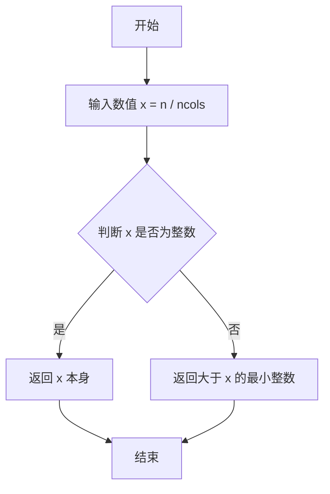

#### 带注释源码

```python
# math.ceil 函数是 Python 标准库 math 模块的一部分
# 在本代码中的具体使用场景：
n = len(names)          # 获取颜色名称的总数
ncols = 4               # 设置列数为 4
nrows = math.ceil(n / ncols)  # 计算所需行数，向上取整确保能显示所有颜色
```

**说明**：在该代码中，`math.ceil(n / ncols)` 用于计算显示所有颜色所需的最少行数。由于除法可能产生小数（如 10 个颜色分成 4 列时为 2.5 行），使用 `ceil` 向上取整确保有足够的行数来展示所有颜色，不会因为取整而丢失最后一行数据。


### `plot_colortable`

该函数用于将颜色字典可视化为一个颜色表格，支持按色调、饱和度和值（HSV）对颜色进行排序，并可在图表中展示颜色的名称和色块。

#### 参数

- `colors`：`dict`，颜色字典，键为颜色名称，值为颜色值（如十六进制字符串或颜色元组）
- `ncols`：`int`，列数，默认为 4
- `sort_colors`：`bool`，是否按色调/饱和度/值排序颜色，默认为 True

#### 返回值

- `fig`：`matplotlib.figure.Figure`，返回创建的图表对象

#### 流程图

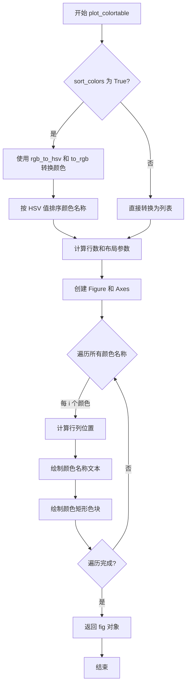

#### 带注释源码

```python
def plot_colortable(colors, *, ncols=4, sort_colors=True):
    """
    绘制颜色表格的可视化函数
    
    参数:
        colors: 颜色字典，键为颜色名，值为颜色值
        ncols: 列数，默认为4
        sort_colors: 是否排序，默认为True
    
    返回:
        fig: matplotlib图表对象
    """
    
    # 定义单元格尺寸和边距
    cell_width = 212      # 单元格宽度（像素）
    cell_height = 22     # 单元格高度（像素）
    swatch_width = 48    # 色块宽度（像素）
    margin = 12          # 边距（像素）

    # ----------------核心排序逻辑----------------
    # 根据色调(H)、饱和度(S)、值(V)和名称排序颜色
    if sort_colors is True:
        # 将颜色转换为RGB，再转换为HSV
        # 使用HSV值作为排序关键字，实现视觉上有意义的排序
        names = sorted(
            colors, key=lambda c: tuple(mcolors.rgb_to_hsv(mcolors.to_rgb(c))))
    else:
        # 不排序，直接转换为列表
        names = list(colors)
    # ---------------------------------------------

    # 计算行数和布局
    n = len(names)
    nrows = math.ceil(n / ncols)  # 向上取整计算行数

    # 计算图表尺寸（转换为英寸）
    width = cell_width * ncols + 2 * margin
    height = cell_height * nrows + 2 * margin
    dpi = 72

    # 创建图表和坐标轴
    fig, ax = plt.subplots(figsize=(width / dpi, height / dpi), dpi=dpi)
    
    # 调整子图边距
    fig.subplots_adjust(margin/width, margin/height,
                        (width-margin)/width, (height-margin)/height)
    
    # 设置坐标轴范围和可见性
    ax.set_xlim(0, cell_width * ncols)
    ax.set_ylim(cell_height * (nrows-0.5), -cell_height/2.)
    ax.yaxis.set_visible(False)
    ax.xaxis.set_visible(False)
    ax.set_axis_off()

    # 遍历每个颜色，绘制名称和色块
    for i, name in enumerate(names):
        row = i % nrows          # 计算当前行
        col = i // nrows         # 计算当前列
        y = row * cell_height    # 计算Y坐标

        # 计算文本和色块的X坐标
        swatch_start_x = cell_width * col
        text_pos_x = cell_width * col + swatch_width + 7

        # 绘制颜色名称文本
        ax.text(text_pos_x, y, name, fontsize=14,
                horizontalalignment='left',
                verticalalignment='center')

        # 绘制颜色矩形色块
        ax.add_patch(
            Rectangle(xy=(swatch_start_x, y-9), width=swatch_width,
                      height=18, facecolor=colors[name], edgecolor='0.7')
        )

    return fig
```


### `mcolors.rgb_to_hsv`

RGB转HSV颜色空间函数，用于将RGB颜色值（红、绿、蓝）转换为HSV颜色值（色相、饱和度、明度），支持标量和数组输入。

参数：

-  `rgb`：`ndarray`，RGB颜色值，形状为 `(..., 3)` 或 `(N, 3)`，值域为 [0, 1] 的浮点数

返回值：`ndarray`，HSV颜色值，形状与输入相同，值域为 [0, 1] 的浮点数

#### 流程图

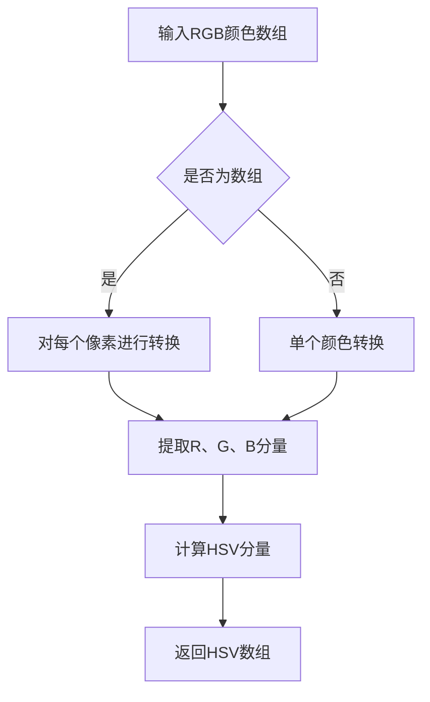

#### 带注释源码

```python
def rgb_to_hsv(rgb):
    """
    将RGB颜色转换为HSV颜色。
    
    参数
    ----------
    rgb : array_like
        RGB颜色值，形状为 (..., 3)，值域 [0, 1]
    
    返回值
    -------
    ndarray
        HSV颜色值，形状与输入相同，值域 [0, 1]
    """
    # 将输入转换为numpy数组，确保类型为浮点数
    rgb = np.asarray(rgb, dtype=float)
    
    # 提取RGB三个通道
    # red: 红色通道, green: 绿色通道, blue: 蓝色通道
    red, green, blue = rgb[..., 0], rgb[..., 1], rgb[..., 2]
    
    # 计算最大值和最小值
    # max_rgb: RGB通道中的最大值，用于计算饱和度和明度
    # min_rgb: RGB通道中的最小值，用于计算色相
    max_rgb = np.maximum(red, np.maximum(green, blue))
    min_rgb = np.minimum(red, np.minimum(green, blue))
    
    # 计算明度（Value）
    # value: 颜色的明度，取RGB最大值
    v = max_rgb
    
    # 计算饱和度（Saturation）
    # delta: RGB通道的差值
    # s: 饱和度，如果明度为0则饱和度为0，否则为差值除以明度
    delta = max_rgb - min_rgb
    s = np.where(max_rgb == 0, 0, delta / max_rgb)
    
    # 计算色相（Hue）
    # h: 色相值，范围 [0, 1]
    # 接下来根据哪个通道是最大值来确定色相的计算方式
    h = np.zeros_like(max_rgb)
    
    # 当红色是最大值时
    # 色相 = (绿色 - 蓝色) / 差值（模6）
    mask = (max_rgb == red) & (delta != 0)
    h = np.where(mask, ((green - blue) / delta) % 6, h)
    
    # 当绿色是最大值时
    # 色相 = (蓝色 - 红色) / 差值 + 2
    mask = (max_rgb == green) & (delta != 0)
    h = np.where(mask, ((blue - red) / delta) + 2, h)
    
    # 当蓝色是最大值时
    # 色相 = (红色 - 绿色) / 差值 + 4
    mask = (max_rgb == blue) & (delta != 0)
    h = np.where(mask, ((red - green) / delta) + 4, h)
    
    # 将色相归一化到 [0, 1] 范围
    # 除以6将角度转换为比例
    h = h / 6
    
    # 组合HSV结果
    hsv = np.stack([h, s, v], axis=-1)
    
    return hsv
```


### `mcolors.to_rgb`

将颜色规范转换为 RGB 元组（归一化到 [0, 1] 范围）。该函数是 matplotlib.colors 模块的核心函数，用于处理各种颜色输入（如颜色名称、十六进制字符串、RGB/RGBA 元组等）并统一输出为标准 RGB 格式。

参数：
- `c`：`str` 或 `tuple`，要转换的颜色规范。可以是颜色名称（如 `'red'`）、十六进制字符串（如 `'#ff0000'`）、RGB 元组（如 `(1, 0, 0)`）或 RGBA 元组。

返回值：`tuple`，RGB 颜色元组，包含三个浮点数，范围在 0 到 1 之间。

#### 流程图

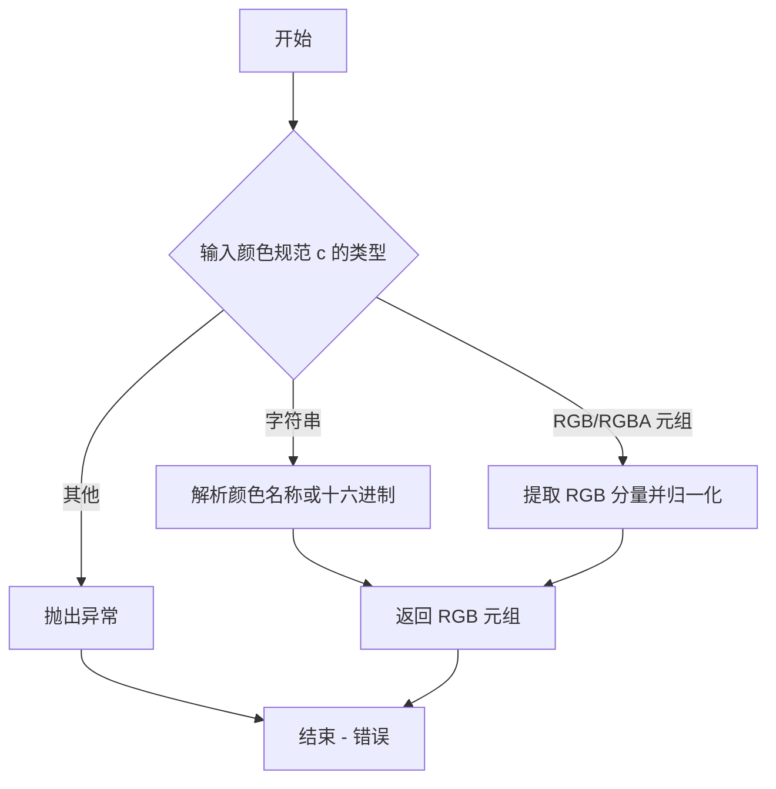

#### 带注释源码

```python
def to_rgb(c):
    """
    将颜色规范转换为 RGB。

    参数:
        c: 颜色规范，可以是:
            - 字符串: 颜色名称如 'red' 或十六进制如 '#ff0000'
            - RGB 元组: (r, g, b) 每个值在 0-1 之间
            - RGBA 元组: (r, g, b, a) 忽略 alpha 通道

    返回:
        RGB 元组: (r, g, b) 归一化到 [0, 1]
    """
    # 尝试将输入转换为 RGBA 元组
    rgba = to_rgba(c)
    # 返回 RGB 部分（取前三个分量）
    return rgba[:3]
```


### `plt.subplots`

`plt.subplots` 是 Matplotlib 库中的一个函数，用于创建一个新的图形窗口和一组子图（坐标轴）。它是最常用的创建图形和坐标轴的方法之一，可以一次性创建多个子图并返回图形对象和坐标轴对象。

参数：

- `nrows`：`int`，可选，默认为1，子图的行数
- `ncols`：`int`，可选，默认为1，子图的列数
- `sharex`：`bool`，可选，默认为False，是否共享x轴
- `sharey`：`bool`，可选，默认为False，是否共享y轴
- `squeeze`：`bool`，可选，默认为True，是否压缩返回的坐标轴数组维度
- `subplot_kw`：`dict`，可选，用于创建子图的关键字参数
- `gridspec_kw`：`dict`，可选，用于指定网格布局的关键字参数
- `figsize`：`tuple`，可选，图形窗口的宽和高（英寸）
- `dpi`：`int`，可选，图形分辨率（每英寸点数）
- `facecolor`：颜色，可选，图形背景色
- `edgecolor`：颜色，可选，图形边框颜色
- `frameon`：bool，可选，是否绘制框架

返回值：`tuple`，返回一个包含两个元素的元组
- `fig`：`matplotlib.figure.Figure` 对象，图形对象，表示整个图形窗口
- `ax`：`matplotlib.axes.Axes` 对象或 Axes 数组，表示一个或多个坐标轴

#### 流程图

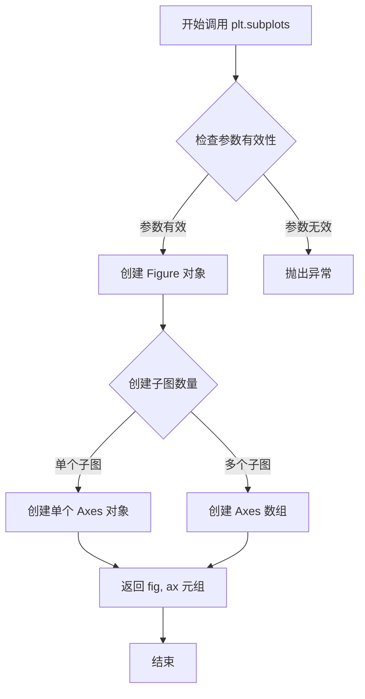

#### 带注释源码

```python
# 在本代码中的实际调用示例
fig, ax = plt.subplots(figsize=(width / dpi, height / dpi), dpi=dpi)

# 参数说明：
# figsize=(width / dpi, height / dpi)  # tuple，图形尺寸，宽度和高度（英寸）
# dpi=dpi  # int，图形的分辨率，每英寸像素数

# 返回值：
# fig  # matplotlib.figure.Figure 对象，表示整个图形
# ax   # matplotlib.axes.Axes 对象，表示坐标轴

# 调用解释：
# 1. 根据 width 和 dpi 计算宽度英寸数
# 2. 根据 height 和 dpi 计算高度英寸数
# 3. 创建一个新的图形窗口，设置指定的尺寸和分辨率
# 4. 返回图形对象和坐标轴对象，用于后续绘图操作

# 后续操作：
# fig.subplots_adjust(margin/width, margin/height,
#                     (width-margin)/width, (height-margin)/height)
# ax.set_xlim(0, cell_width * ncols)
# ax.set_ylim(cell_height * (nrows-0.5), -cell_height/2.)
# ax.yaxis.set_visible(False)
# ax.xaxis.set_visible(False)
# ax.set_axis_off()
```

#### 使用场景说明

在 `plot_colortable` 函数中，`plt.subplots` 用于创建一个新的图形窗口，以便后续在该图形上绘制颜色表格。具体步骤如下：

1. 根据颜色数量计算所需的图形尺寸
2. 创建具有适当尺寸和分辨率的图形
3. 调整图形边距
4. 设置坐标轴范围和可见性
5. 在坐标轴上绘制颜色样本和名称


### Figure.subplots_adjust

调整 Figure 中子图的布局参数，包括子图区域的左、右、上、下边界以及子图之间的宽度和高度间距。

参数：

- `left`：`float`，子图区域左侧边界（0.0 到 1.0 之间的比例）。
- `bottom`：`float`，子图区域底部边界（0.0 到 1.0 之间的比例）。
- `right`：`float`，子图区域右侧边界（0.0 到 1.0 之间的比例）。
- `top`：`float`，子图区域顶部边界（0.0 到 1.0 之间的比例）。
- `wspace`：`float`，可选，子图之间宽度方向的间距（比例）。
- `hspace`：`float`，可选，子图之间高度方向的间距（比例）。

返回值：`None`，该方法直接修改 Figure 的布局，不返回任何值。

#### 流程图

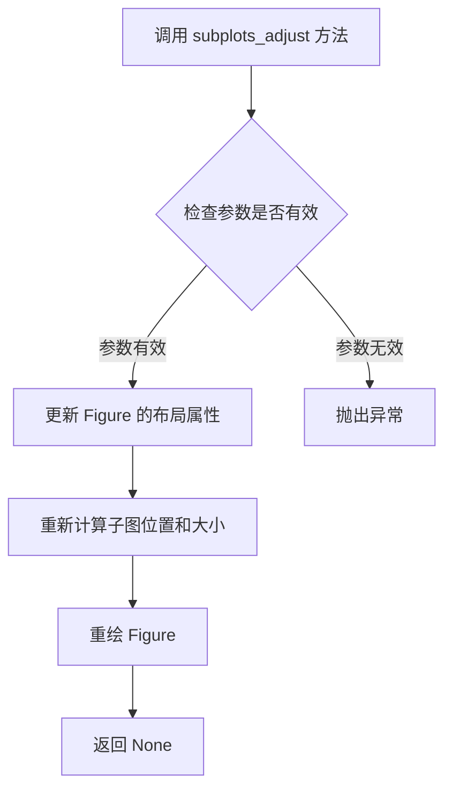

#### 带注释源码

```python
def subplots_adjust(self, left=None, bottom=None, right=None, top=None,
                    wspace=None, hspace=None):
    """
    Adjust the subplot layout parameters.

    Parameters
    ----------
    left : float, optional
        The position of the left edge of the subplots, as a fraction of
        the figure width.
    bottom : float, optional
        The position of the bottom edge of the subplots, as a fraction of
        the figure height.
    right : float, optional
        The position of the right edge of the subplots, as a fraction of
        the figure width.
    top : float, optional
        The position of the top edge of the subplots, as a fraction of
        the figure height.
    wspace : float, optional
        The width of the space between subplots, as a fraction of the
        average axes width.
    hspace : float, optional
        The height of the space between subplots, as a fraction of the
        average axes height.
    """
    # 调用内部方法 _subplots_adjust 进行实际的布局更新
    self._subplots_adjust(left=left, bottom=bottom, right=right,
                          top=top, wspace=wspace, hspace=hspace)
    # 触发重新绘制以应用新的布局参数
    self.canvas.draw_idle()
```


### 代码概述

该代码定义了一个用于可视化 Matplotlib 支持的命名颜色的表格的辅助函数 `plot_colortable`。该函数首先计算必要的绘图区域尺寸，创建 Figure 和 Axes 对象，并使用 `set_xlim` 和 `set_ylim` 明确设定坐标轴的显示范围，随后在坐标轴上绘制颜色样本的名称和色块。

### 文件运行流程

1.  **参数计算**：根据颜色数量计算所需的单元格宽度、高度、行数和列数，进而计算 Figure 的总尺寸（英寸和 DPI）。
2.  **对象创建**：使用 `plt.subplots` 创建高分辨率的 Figure 和 Axes 对象。
3.  **坐标轴初始化**：调用 `ax.set_xlim` 和 `ax.set_ylim` 设定坐标系的边界（X轴从 0 到 右边界，Y轴从 上边界到 负半屏），并隐藏坐标轴刻度及边框。
4.  **内容绘制**：遍历颜色名称列表，在计算出的坐标位置绘制文本标签和矩形色块。
5.  **展示**：调用 `plt.show()`（或在脚本中返回 fig）显示图像。

---

### 类：matplotlib.axes.Axes

#### 类字段与属性

- **名称**：Axles (Axes 实例)
- **类型**：Matplotlib Axes 对象
- **描述**：包含图表数据可视化所有信息的核心对象，负责管理坐标轴、图形元素（Artists）以及坐标变换。

#### 关键方法详情

以下是从代码中提取的关于坐标轴范围设置的方法详细信息。

---

#### `Axes.set_xlim`

设置 Axes 的 X 轴数据范围（水平显示区间）。

参数：

- `left`：`float`，X 轴的最小值（左侧边界）。代码中传入 `0`。
- `right`：`float`，X 轴的最大值（右侧边界）。代码中传入 `cell_width * ncols` (计算后的总列宽)。

返回值：`tuple[float, float]`，返回设置前的旧边界值 `(old_min, old_max)`。

##### 流程图

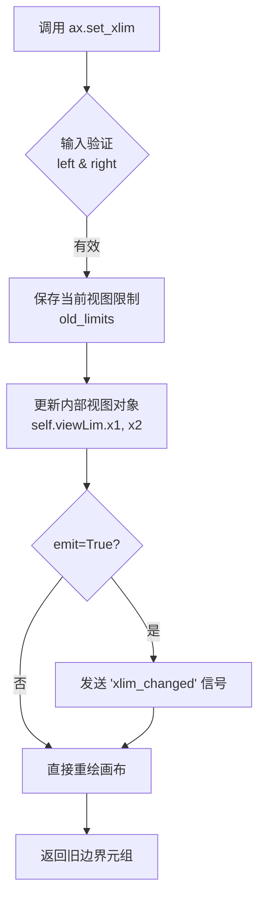

##### 带注释源码

```python
# 在 plot_colortable 函数中，ax 是一个 matplotlib.axes.Axes 对象
# 设置 X 轴的显示范围，从 0 到 列数乘以单元格宽度
ax.set_xlim(0, cell_width * ncols) 
# 解释：限定了绘图区域横向的物理像素范围，确保后续绘图不会超出计算出的画布宽度
```

---

#### `Axes.set_ylim`

设置 Axes 的 Y 轴数据范围（垂直显示区间）。

参数：

- `bottom`：`float`，Y 轴的最小值（底部边界）。代码中传入 `cell_height * (nrows-0.5)` (顶部位置)。
- `top`：`float`，Y 轴的最大值（顶部边界）。代码中传入 `-cell_height/2.` (略低于底部)。

返回值：`tuple[float, float]`，返回设置前的旧边界值 `(old_min, old_max)`。

##### 流程图

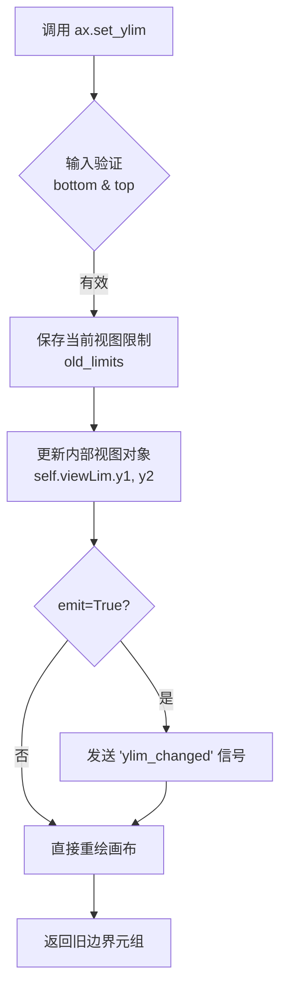

##### 带注释源码

```python
# 在 plot_colortable 函数中
# 设置 Y 轴的范围：
# 顶部边界为 cell_height * (nrows - 0.5)
# 底部边界为 -cell_height / 2
# 注意：Matplotlib Y 轴通常向上为正，但坐标计算时 row=0 在顶部，
# 因此这里将上方设为大值，下方设为小值（甚至负值），确保坐标原点对齐
ax.set_ylim(cell_height * (nrows-0.5), -cell_height/2.)
# 解释：翻转了传统的坐标思维，确保第 0 行绘制在视觉顶部，最后一行在底部
```

### 关键技术点与优化空间

1.  **坐标系统设计**：代码手动计算了 `xlim` 和 `ylim`，这在生成静态图片（如 Sphinxx Gallery 缩略图）时非常有用，可以精确控制留白和布局。但在交互式图表中，固定限值可能会阻止用户使用鼠标缩放查看细节（虽然这里禁用了坐标轴可见性，可能仅用于生成图像）。
2.  **负坐标的使用**：Y轴下限设置为 `-cell_height/2` 是一个技巧性的设计，用于在不使用坐标轴刻度的情况下，让第一个元素（row 0）的垂直中心大概位于 Y=0 附近（取决于具体的绘图逻辑），确保视觉居中。
3.  **技术债务**：如果颜色数量极大，预先计算所有像素坐标（`ax.text` 的 x, y）而非使用 Matplotlib 的布局引擎（GridSpec 或 Table），可能在自适应窗口大小方面缺乏灵活性。


### `matplotlib.axis.Axis.set_visible`

设置坐标轴的可见性，控制坐标轴是否在图表中显示。当参数为 `True` 时，坐标轴可见；为 `False` 时，坐标轴隐藏。

参数：
- `b`：`bool`，指定坐标轴是否可见。`True` 表示可见，`False` 表示不可见。

返回值：`None`，无返回值。

#### 流程图

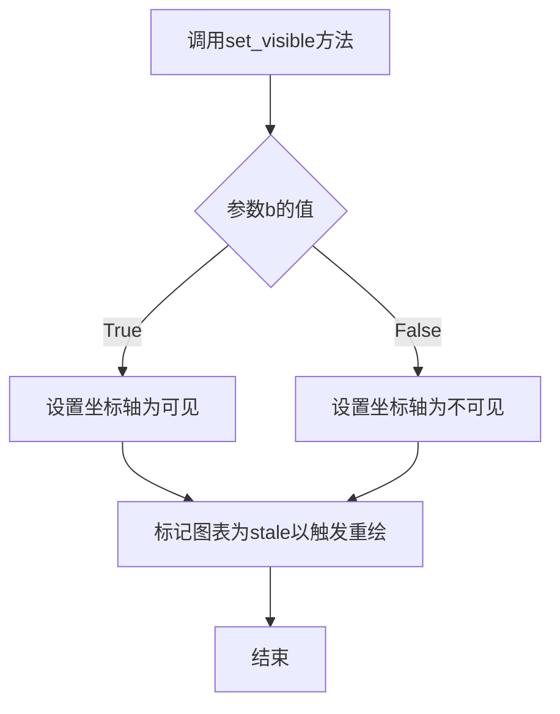

#### 带注释源码

以下是 Matplotlib 中 `Axis.set_visible` 方法的典型实现（基于 matplotlib 源码）：

```python
def set_visible(self, b):
    """
    Set the visibility of the axis.

    Parameters
    ----------
    b : bool
        True if the axis should be visible, False otherwise.
    """
    self._visible = b  # 设置内部可见性标志
    self.stale_callbacks.process('stale', self)  # 触发重绘回调，更新图表显示
```

在代码中的调用示例：

```python
# 隐藏Y轴坐标轴
ax.yaxis.set_visible(False)
# 隐藏X轴坐标轴
ax.xaxis.set_visible(False)
```


### `ax.set_axis_off` / `matplotlib.axes.Axes.set_axis_off`

该函数是 Matplotlib 中 Axes 对象的成员方法，用于关闭（隐藏）坐标轴的显示，但不删除坐标轴的数据。在绘制颜色表等场景中用于隐藏坐标轴框架，提供纯净的绘图区域。

#### 参数

- **self**：`matplotlib.axes.Axes` 对象，调用该方法的 Axes 实例（隐式参数，无需显式传递）

#### 返回值

- `None`，该方法无返回值，仅修改 Axes 对象的状态

#### 流程图

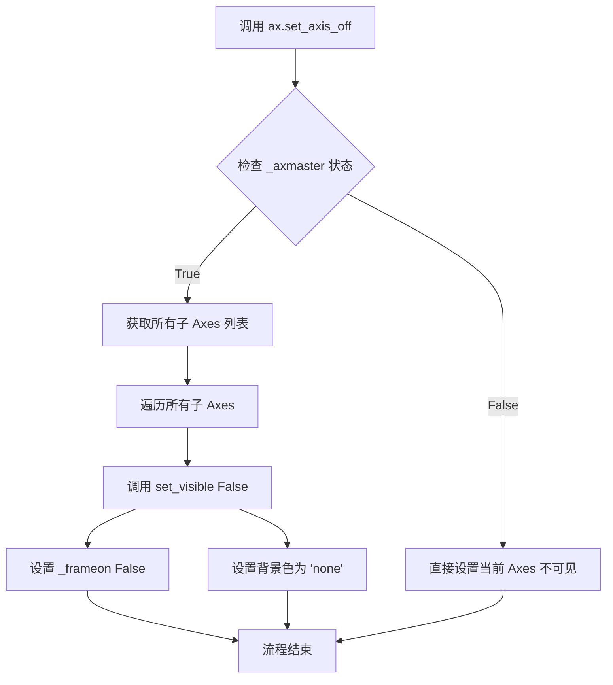

#### 带注释源码

```python
def set_axis_off(self, b=None):
    """
    Turn off the axis.

    Parameters
    ----------
    b : bool, default: True
    """
    # 设置背景色为透明（无色）
    self._axisbg = 'none'
    
    # 关闭框架显示
    self._frameon = False
    
    # 检查是否存在主坐标轴（用于双坐标轴等情况）
    if self._axmaster:
        # 获取所有关联的 Axes 列表（包括主坐标轴和副坐标轴）
        for ax in self._get_axes_list():
            # 将每个子 Axes 设置为不可见
            ax.set_visible(False)
```

---

### 关联代码上下文

在示例代码中的调用方式：

```python
# ... 前置代码创建 figure 和 axes ...
ax.set_xlim(0, cell_width * ncols)
ax.set_ylim(cell_height * (nrows-0.5), -cell_height/2.)
ax.yaxis.set_visible(False)
ax.xaxis.set_visible(False)
ax.set_axis_off()  # <-- 关闭坐标轴
```

---

### 技术说明

| 属性 | 说明 |
|------|------|
| **方法类型** | Matplotlib Axes 类成员方法 |
| **作用对象** | 坐标轴（Axis）可见性控制 |
| **与 `set_visible(False)` 的区别** | `set_axis_off` 会额外设置 `_frameon=False` 和 `_axisbg='none'`，更彻底地隐藏坐标轴元素 |
| **常用场景** | 图例绘制、颜色条、颜色表、logo 嵌入等不需要坐标轴的场景 |


### `matplotlib.axes.Axes.text`

在给定的代码中，`ax.text` 是 Matplotlib 中 `Axes` 对象的方法，用于在图表的指定位置添加文本标签。在此代码中，该方法用于在颜色样例表格中显示每个颜色的名称。

参数：

- `x`：`float`，文本的 x 坐标位置。在代码中为 `text_pos_x`（即 `cell_width * col + swatch_width + 7`），表示颜色样例方块右侧的位置。
- `y`：`float`，文本的 y 坐标位置。在代码中为 `y`（即 `row * cell_height`），表示当前行的垂直位置。
- `s`：`str`，要显示的文本内容。在代码中为 `name`，即颜色的名称。
- `fontsize`：`int` 或 `float`（可选），文本的字体大小。在代码中设置为 `14`。
- `horizontalalignment` 或 `ha`：`str`（可选），水平对齐方式。在代码中设置为 `'left'`，表示文本左对齐。
- `verticalalignment` 或 `va`：`str`（可选），垂直对齐方式。在代码中设置为 `'center'`，表示文本垂直居中对齐。

返回值：`matplotlib.text.Text`，返回创建的文本对象，可以对其进行进一步样式设置或属性修改。

#### 流程图

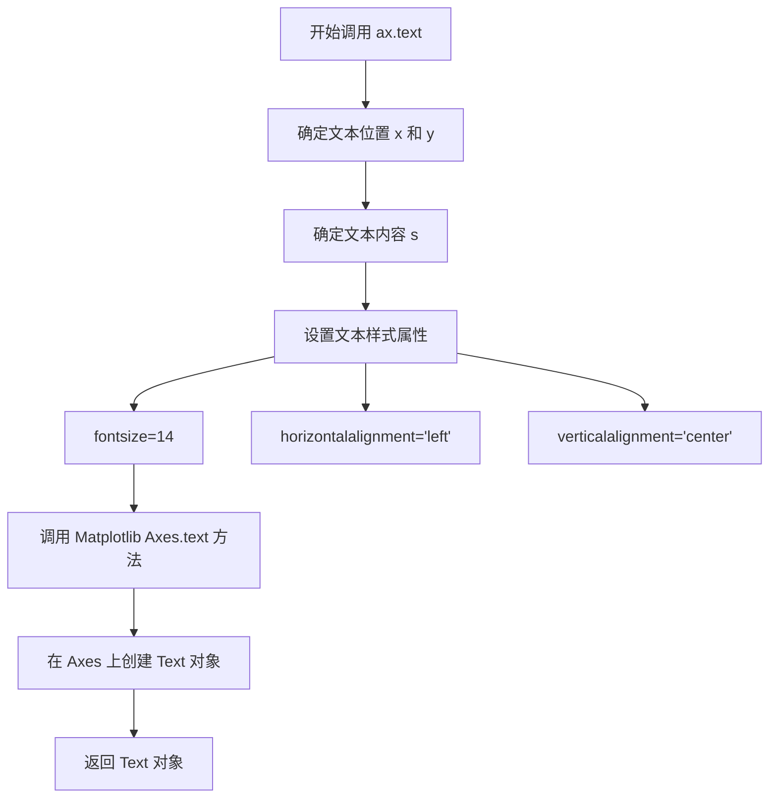

#### 带注释源码

```python
# 调用 ax.text 方法添加颜色名称文本
# 参数说明：
# - text_pos_x: 文本的 x 坐标 = cell_width * col + swatch_width + 7
#               (单元格宽度 * 列号 + 样例宽度 + 偏移量)
# - y: 文本的 y 坐标 = row * cell_height (行号 * 单元格高度)
# - name: 文本内容，即颜色名称
# - fontsize=14: 字体大小设为 14 磅
# - horizontalalignment='left': 文本左对齐于指定坐标点
# - verticalalignment='center': 文本垂直居中对齐于指定坐标点
ax.text(text_pos_x, y, name, fontsize=14,
        horizontalalignment='left',
        verticalalignment='center')
```


### `ax.add_patch`

添加图形元素（Patch）到 Axes 坐标轴区域。该方法接受一个 Patch 对象（如 Rectangle、Circle、Polygon 等），将其渲染到坐标轴中，并返回添加的 Patch 对象。

#### 参数

- `patch`：`matplotlib.patches.Patch`，要添加的图形元素对象，必须是 `matplotlib.patches.Patch` 的实例（如 `Rectangle`、`Circle`、`Polygon` 等）

#### 返回值

`matplotlib.patches.Patch`，返回添加的图形元素对象，通常与输入的 patch 参数相同，可用于后续操作或修改。

#### 流程图

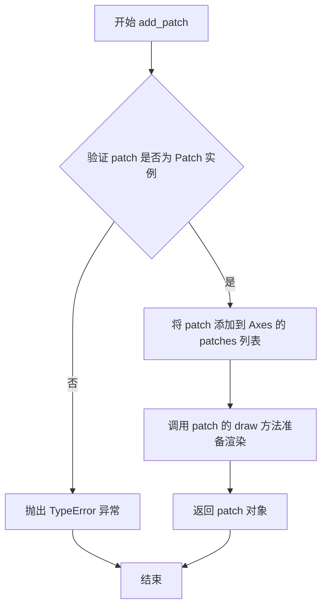

#### 带注释源码

```python
# matplotlib/axes/_base.py 中的 add_patch 方法实现

def add_patch(self, p):
    """
    Add a :class:`Patch` to the axes.

    Parameters
    ----------
    p : `.Patch`

    Returns
    -------
    `.Patch`
    """
    # 验证输入对象是否为 Patch 类型
    self._patches_append(p)
    # 设置 patch 的 axes 属性，关联到当前 Axes 对象
    p.set_axes(self)
    # 设置 patch 的 figure 属性，关联到当前 Figure 对象
    p.set_figure(self.figure)
    # 标记 Axes 需要重新绘制
    self.stale_callback(p._stale_callback)
    # 返回添加的 Patch 对象
    return p
```

> **注**：在实际代码中，`add_patch` 内部调用 `_patches_append` 方法将 Patch 对象添加到 Axes 的 `patches` 列表中，并自动关联 Figure 和 Axes 属性，确保图形元素能够正确渲染。


### Rectangle（在 plot_colortable 函数中创建矩形色块）

在 `plot_colortable` 函数中，`Rectangle` 类被用于在图表上创建颜色样本的矩形色块显示。该类来自 `matplotlib.patches` 模块，通过指定位置、尺寸、填充颜色和边框颜色来绘制矩形图形。

参数：

- `xy`：`tuple`，表示矩形左下角的坐标 (x, y)
- `width`：`float`，矩形的宽度
- `height`：`float`，矩形的高度
- `facecolor`：矩形的填充颜色，可以是颜色名称或十六进制颜色值
- `edgecolor`：矩形的边框颜色

返回值：`matplotlib.patches.Rectangle` 对象，表示创建的矩形色块

#### 流程图

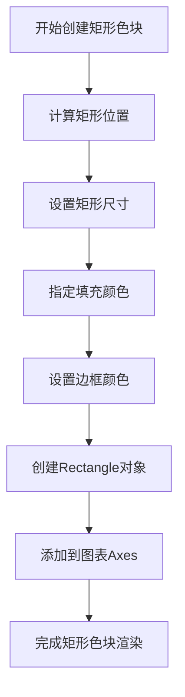

#### 带注释源码

```python
# 在 plot_colortable 函数中创建矩形色块的代码

# 遍历颜色名称列表
for i, name in enumerate(names):
    row = i % nrows          # 计算当前颜色所在的行
    col = i // nrows         # 计算当前颜色所在的列
    y = row * cell_height   # 计算y坐标
    
    # 计算色块起始x坐标（基于列）
    swatch_start_x = cell_width * col
    # 计算文本位置x坐标（色块宽度 + 偏移）
    text_pos_x = cell_width * col + swatch_width + 7
    
    # 在图表上添加文本（颜色名称）
    ax.text(text_pos_x, y, name, fontsize=14,
            horizontalalignment='left',
            verticalalignment='center')
    
    # 创建矩形色块
    # xy: 矩形左下角坐标 (x坐标, y坐标 - 9是为了垂直居中)
    # width: 矩形宽度 (swatch_width = 48)
    # height: 矩形高度 (18)
    # facecolor: 填充颜色 (使用colors字典中对应的颜色值)
    # edgecolor: 边框颜色 ('0.7' 表示浅灰色)
    ax.add_patch(
        Rectangle(
            xy=(swatch_start_x, y-9),    # 矩形左下角坐标
            width=swatch_width,          # 矩形宽度
            height=18,                   # 矩形高度
            facecolor=colors[name],      # 填充颜色（颜色名称对应的颜色）
            edgecolor='0.7'              # 边框颜色（浅灰色）
        )
    )
```

#### 关键组件信息

| 组件名称 | 一句话描述 |
|---------|-----------|
| `matplotlib.patches.Rectangle` | 用于创建矩形图块的类，支持填充色和边框样式设置 |
| `ax.add_patch()` | 将矩形图块添加到坐标轴的方法 |

#### 技术债务与优化空间

1. **硬编码数值**：色块的尺寸和位置计算中存在硬编码数值（如 `y-9`、`height=18`），建议提取为可配置参数
2. **定位计算逻辑**：垂直居中的计算 `y-9` 不够直观，可以考虑使用更明确的中心点计算方式


### plt.show

显示当前Figure对象对应的图形窗口，将所有已创建的图形渲染并展示给用户。

参数：

- 该函数不接受任何参数

返回值：`None`，无返回值，仅用于图形显示

#### 流程图

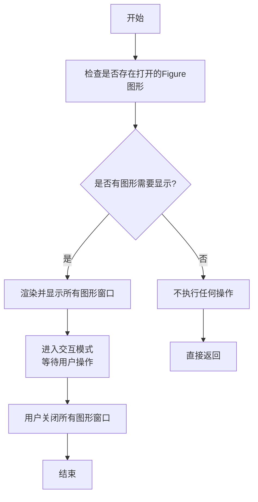

#### 带注释源码

```python
# 显示图形
# 在代码的最后调用plt.show()来显示前面创建的图形窗口
plt.show()
```

#### 补充说明

| 项目 | 说明 |
|------|------|
| **调用位置** | 代码最后，3次调用`plot_colortable()`创建不同颜色表的图形后调用 |
| **作用** | 阻止程序继续执行，保持图形窗口打开直到用户关闭 |
| **与交互后端的关系** | 在非交互式后端（如Agg）下可能不显示窗口 |
| **设计目标** | 提供图形可视化展示，便于用户查看颜色示例 |
| **错误处理** | 如果没有图形，函数会静默返回，不抛异常 |

## 关键组件


### plot_colortable 函数

用于绘制颜色表的辅助函数，接受颜色字典、列数和排序选项，生成展示所有命名颜色的可视化表格

### mcolors.BASE_COLORS

Matplotlib的基础颜色集合，包含最常用的基本颜色（如'red', 'blue', 'green'等）

### mcolors.TABLEAU_COLORS

Tableau调色板颜色集合，提供一组设计友好的表格颜色

### mcolors.CSS4_COLORS

CSS4标准中定义的颜色集合，包含140多个标准Web颜色

### mcolors.XKCD_COLORS

XKCD颜色调查中的颜色集合，包含近1000个众包颜色

### mcolors.rgb_to_hsv 函数

将RGB颜色值转换为HSV（色调、饱和度、亮度）颜色空间的函数，用于颜色排序

### mcolors.to_rgb / mcolors.to_rgba 函数

将各种颜色格式转换为RGB或RGBA元组的颜色转换函数

### Rectangle 组件

用于绘制颜色样本块的矩形patch对象，显示每个命名颜色的实际视觉效果


## 问题及建议


### 已知问题

-   **硬编码的布局参数**：cell_width=212、cell_height=22、swatch_width=48、margin=12、dpi=72 等尺寸参数被硬编码，缺乏灵活性和可配置性，导致在不同场景下难以复用。
-   **魔法数字缺乏解释**：代码中存在多个未解释的数值（如 7、9、18、0.5），难以理解和维护。
-   **缺乏输入验证**：未检查 colors 字典是否为空、ncols 是否为有效值（0 或负数）、颜色名是否有效等边界情况。
-   **函数职责过重**：plot_colortable 函数同时负责布局计算、图形创建、元素绘制等多个职责，违反单一职责原则。
-   **无返回值利用**：三次调用 plot_colortable 仅第一次使用了返回值（赋值给 xkcd_fig），其他调用未利用返回值。
-   **缺少类型注解**：函数参数和返回值均无类型提示，降低了代码的可读性和 IDE 支持。
-   **文本溢出风险**：当颜色名称较长时，可能超出单元格宽度（cell_width - swatch_width - 7），导致文本溢出或显示不完整。
-   **缺乏完整文档**：函数没有 docstring，无法通过 help() 或 IDE 获取使用说明。

### 优化建议

-   **参数化布局配置**：将布局相关参数提取为函数默认参数或配置对象，支持自定义尺寸和样式。
-   **添加类型注解**：为函数添加类型提示，如 `plot_colortable(colors: dict, *, ncols: int = 4, sort_colors: bool = True) -> plt.Figure`。
-   **完善输入验证**：添加参数校验逻辑，处理空字典、非法 ncols、无效颜色名等情况并给出明确错误信息。
-   **拆分函数职责**：将布局计算、图形创建、元素绘制分离为独立函数，提高可测试性和可维护性。
-   **添加文档字符串**：使用 Google/NumPy 风格文档，完整描述函数功能、参数、返回值和使用示例。
-   **处理文本溢出**：添加文本宽度检测逻辑，超长时进行截断或缩放处理。
-   **使用枚举或常量类**：将魔法数字定义为具名常量，提升代码可读性。


## 其它


### 设计目标与约束

设计目标：提供一个可视化工具，将Matplotlib支持的所有命名颜色以表格形式展示，便于用户查阅和选择颜色。约束：颜色按HSV值排序，表格布局自适应列数，图形尺寸根据颜色数量动态计算。

### 错误处理与异常设计

代码主要依赖Matplotlib的内部异常机制。当传入的colors字典为空或格式不正确时，Matplotlib的图形渲染会自然失败。无自定义异常处理，符合Python的"显式更好"原则。建议调用方在传入colors前验证字典有效性。

### 数据流与状态机

输入：颜色字典（colors）、列数（ncols）、排序标志（sort_colors）→ 处理：排序、计算布局参数、创建图形 → 输出：Figure对象。状态机为线性流程：无状态 → 初始化 → 渲染 → 返回。

### 外部依赖与接口契约

主要依赖：matplotlib.pyplot（图形绘制）、matplotlib.colors（颜色处理）、math（数学运算）、matplotlib.patches（矩形绘制）。接口契约：plot_colortable函数接受colors字典参数，返回matplotlib.figure.Figure对象。

### 性能考虑

对于近1000个XKCD颜色，渲染性能取决于Matplotlib底层效率。当前实现使用单一Figure对象，符合示例代码的轻量级定位。如需优化，可考虑分页渲染或使用更高效的后端。

### 可扩展性设计

函数设计支持任意颜色字典输入，易于扩展新颜色系列。参数化设计允许控制列数和排序行为，便于适应不同展示需求。

### 配置与参数说明

ncols参数控制每行显示的列数，默认4列；sort_colors参数控制是否按HSV排序，默认True。cell_width、cell_height、swatch_width、margin等布局参数可在函数内部调整。

### 使用示例与用例

基础用例：plot_colortable(mcolors.CSS4_COLORS)显示所有CSS4颜色；自定义列数：plot_colortable(colors, ncols=2)实现双列显示；禁用排序：plot_colortable(colors, sort_colors=False)保持原始顺序。

### 兼容性考虑

代码兼容Matplotlib 3.x系列。依赖的API（mcolors.BASE_COLORS等）为Matplotlib内置，在各版本中保持稳定。无Python版本特定语法，使用标准库和主流第三方库。

### 测试策略

可采用视觉回归测试验证图形输出正确性；单元测试可验证排序逻辑、布局计算参数的正确性；边界测试应覆盖空字典、单颜色、多颜色等场景。

    