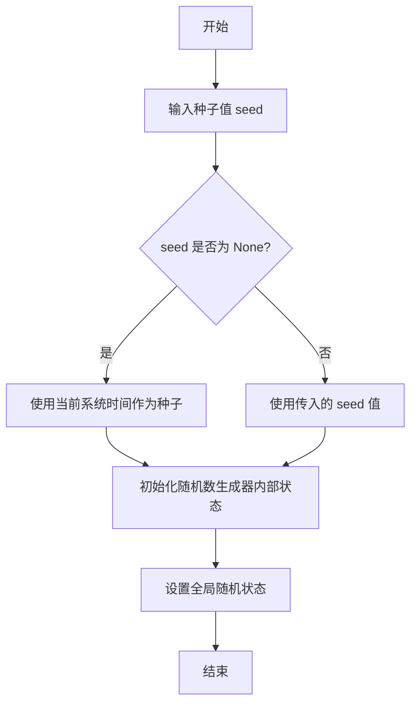
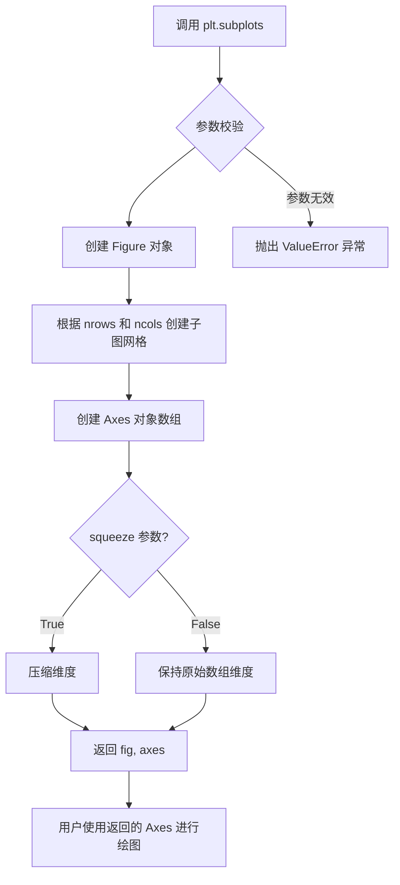
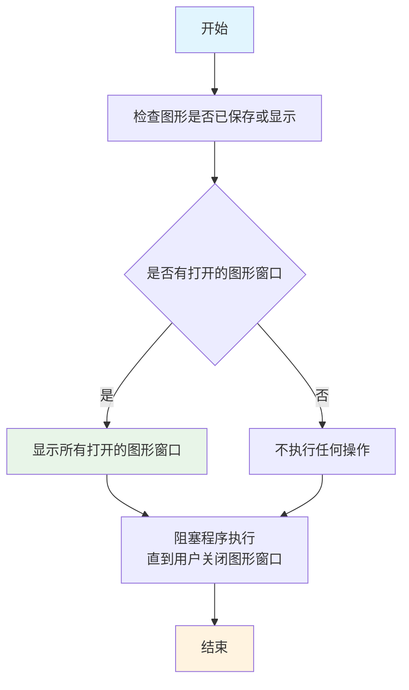
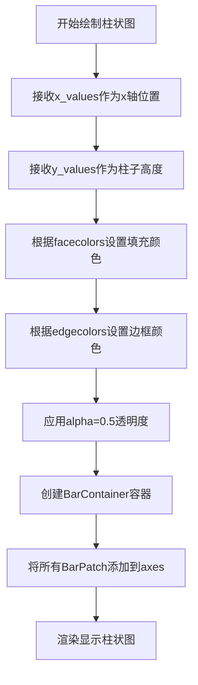
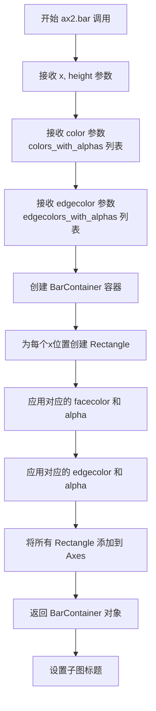
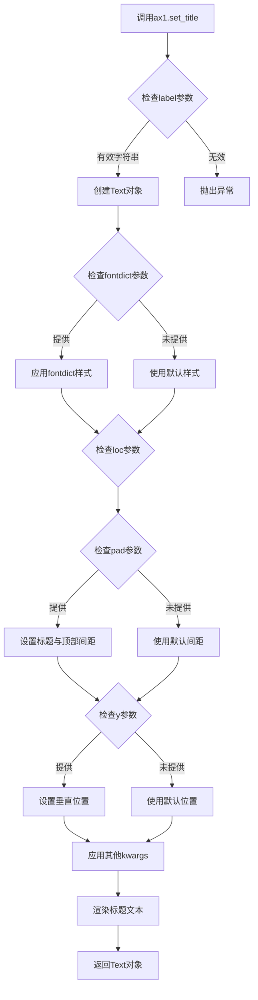
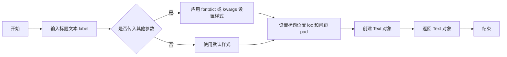

# `matplotlib\galleries\examples\color\set_alpha.py` 详细设计文档

这是一个matplotlib示例代码，演示了如何在柱状图中设置颜色的透明度（alpha值），展示了两种方法：使用alpha关键字参数统一设置透明度，以及使用(color, alpha)元组格式为每个柱子设置不同的透明度。

## 整体流程

```mermaid
graph TD
    A[开始] --> B[导入matplotlib.pyplot和numpy]
B --> C[设置随机种子确保可重复性]
C --> D[创建包含2个子图的画布]
D --> E[准备x轴数据0-19]
E --> F[生成20个随机y值]
F --> G[根据y值正负创建颜色列表green/red]
G --> H[子图1: 使用alpha=0.5统一设置透明度]
H --> I[计算归一化的alpha值]
I --> J[创建带透明度的颜色元组列表]
J --> K[子图2: 使用(color, alpha)格式设置每个柱子不同透明度]
K --> L[显示图表]
```

## 类结构

```
此代码为脚本文件，无自定义类结构
使用matplotlib.pyplot的Figure和Axes对象
```

## 全局变量及字段


### `fig`
    
整个图形对象

类型：`matplotlib.figure.Figure`
    


### `ax1`
    
左侧子图的坐标轴对象

类型：`matplotlib.axes.Axes`
    


### `ax2`
    
右侧子图的坐标轴对象

类型：`matplotlib.axes.Axes`
    


### `x_values`
    
x轴数值列表0-19

类型：`list`
    


### `y_values`
    
20个随机生成的y值

类型：`numpy.ndarray`
    


### `facecolors`
    
根据y值正负生成的绿色/红色列表

类型：`list`
    


### `edgecolors`
    
边缘颜色列表（与facecolors相同）

类型：`list`
    


### `abs_y`
    
y值绝对值列表

类型：`list`
    


### `face_alphas`
    
归一化的正面透明度值

类型：`list`
    


### `edge_alphas`
    
归一化的边缘透明度值（1减去face_alpha）

类型：`list`
    


### `colors_with_alphas`
    
颜色与透明度组合的元组列表

类型：`list`
    


### `edgecolors_with_alphas`
    
边缘颜色与透明度组合的元组列表

类型：`list`
    


    

## 全局函数及方法


### `np.random.seed`

设置随机数种子，确保随机数生成的可重复性。通过初始化随机数生成器的内部状态，使得每次使用相同种子调用随机函数时产生相同的随机数序列。

参数：

-  `seed`：`int` 或 `None`，随机数生成器的种子值。如果为 `None`，则使用系统时间作为种子。每次使用相同的整数值作为种子将产生相同的随机数序列。

返回值：`None`，该函数不返回值，仅修改随机数生成器的内部状态。

#### 流程图



#### 带注释源码

```python
# 设置随机数种子为固定值 19680801
# 19680801 是一个常用的固定值，源自 Matplotlib 库的创建日期（2018年6月8日）
# 这个特定的值确保每次运行代码时，np.random.randn(20) 生成的随机数序列完全相同
# 从而保证图表的可重复性和一致性
np.random.seed(19680801)

# 后续调用 np.random.randn(20) 时，生成的 20 个随机数将是确定的
# 例如：无论何时运行这段代码，生成的第一个随机数都将是相同的
y_values = np.random.randn(20)  # 生成 20 个服从标准正态分布的随机数
```

#### 实际使用上下文

```python
import numpy as np

# 修复随机状态以确保可重复性
# 这里的 19680801 是任意选择的大整数
# 使用固定种子可以确保：
# 1. 调试时结果可预测
# 2. 演示代码每次运行产生相同结果
# 3. 回归测试可以验证预期的随机行为
np.random.seed(19680801)

# 现在生成的随机数序列是确定的
random_numbers = np.random.randn(20)  # 每次运行都产生完全相同的 20 个数

# 如果需要恢复随机行为（使用时间作为种子）
# np.random.seed(None)  # 或者不调用 seed()
```


### `plt.subplots`

创建包含子图的画布（Figure）和坐标轴（Axes）对象，支持灵活的多子图布局配置。

参数：

- `nrows`：`int`，行数，指定子图的行数（默认值为1）
- `ncols`：`int`，列数，指定子图的列数（默认值为1）
- `figsize`：`tuple of (float, float)`，图形尺寸，指定Figure的宽度和高度（单位：英寸）
- `sharex`：`bool or str`，x轴共享策略，设置为True或'all'时所有子图共享x轴，'col'时每列共享
- `sharey`：`bool or str`，y轴共享策略，设置为True或'all'时所有子图共享y轴，'row'时每行共享
- `squeeze`：`bool`，是否压缩维度，设置为True时返回的axes数组维度会自动压缩（默认值为True）
- `gridspec_kw`：`dict`，网格规格参数，用于控制子图布局的高级选项（如width_ratios、height_ratios）
- `**fig_kw`：关键字参数，传递给Figure构造函数的其他参数（如dpi、facecolor等）

返回值：`tuple of (Figure, Axes or ndarray of Axes)`，返回图形对象和坐标轴对象或坐标轴数组。当squeeze=True且仅有一个子图时，axes为单一个Axes对象；否则为numpy数组。

#### 流程图



#### 带注释源码

```python
# 代码示例：plt.subplots 的调用方式
fig, (ax1, ax2) = plt.subplots(ncols=2, figsize=(8, 4))

# 参数说明：
# ncols=2: 创建2列的子图布局（共1行2列）
# figsize=(8, 4): Figure宽度8英寸，高度4英寸

# 返回值说明：
# fig: matplotlib.figure.Figure 对象，整个图形容器
# ax1: 第一个子图的坐标轴对象（左侧子图）
# ax2: 第二个子图的坐标轴对象（右侧子图）

# 使用返回的 axes 对象进行绑图
x_values = [n for n in range(20)]
y_values = np.random.randn(20)

facecolors = ['green' if y > 0 else 'red' for y in y_values]
edgecolors = facecolors

# 使用 ax1 绑制第一个子图（使用 alpha 关键字参数）
ax1.bar(x_values, y_values, color=facecolors, edgecolor=edgecolors, alpha=0.5)
ax1.set_title("Explicit 'alpha' keyword value\nshared by all bars and edges")

# 使用 ax2 绑制第二个子图（使用颜色+alpha元组格式）
abs_y = [abs(y) for y in y_values]
face_alphas = [n / max(abs_y) for n in abs_y]
edge_alphas = [1 - alpha for alpha in face_alphas]

colors_with_alphas = list(zip(facecolors, face_alphas))
edgecolors_with_alphas = list(zip(edgecolors, edge_alphas))

ax2.bar(x_values, y_values, color=colors_with_alphas,
        edgecolor=edgecolors_with_alphas)
ax2.set_title('Normalized alphas for\neach bar and each edge')

# 显示图形
plt.show()
```


### `plt.show`

`plt.show()` 是 Matplotlib 库中的函数，用于显示当前图形窗口中的所有图形。在代码中，它位于脚本末尾，用于展示通过 `plt.subplots()` 创建的两个子图（柱状图），这些子图分别展示了使用 alpha 通道设置透明度的两种不同方式。

参数：

- `*args`：可变位置参数，用于传递额外的参数（通常不使用）
- `**kwargs`：可变关键字参数，用于传递额外的参数（通常不使用）

返回值：`None`，该函数无返回值，仅用于显示图形

#### 流程图



#### 带注释源码

```python
# plt.show() 函数的内部实现逻辑（简化版）

def show(*args, **kwargs):
    """
    显示所有打开的图形窗口。
    
    该函数会阻塞程序执行，直到用户关闭所有图形窗口。
    在交互式后端（如 Qt、GTK 等）中会显示图形窗口；
    在非交互式后端（如 agg、pdf 等）中可能不会产生任何效果。
    """
    
    # 获取全局图形管理器
    global _pylab_helpers
    
    # 检查是否有可用的图形
    for manager in _pylab_helpers.Gcf.get_all_fig_managers():
        # 对于每个图形管理器，调用其显示方法
        manager.show()
        
    # 触发所有待处理的绘图操作
    draw_all()
    
    # 如果在交互式环境中，阻塞等待用户交互
    # 否则直接返回
    if is_interactive():
        # 在交互式模式下，阻塞直到用户关闭窗口
        wait_for_buttonpress()
```

#### 关键组件信息

| 组件名称 | 一句话描述 |
|---------|-----------|
| `fig` | 通过 `plt.subplots()` 创建的 Figure 对象，包含整个图形窗口 |
| `ax1`, `ax2` | 两个 Axes 对象，分别代表左右两个子图 |
| `x_values` | 整数列表，表示柱状图的 x 轴坐标（0-19） |
| `y_values` | 随机生成的 20 个数值，用于柱状图的高度 |
| `facecolors` | 根据 y 值正负生成的绿色/红色颜色列表 |
| `edgecolors` | 与 facecolors 相同的颜色列表，用于边框颜色 |
| `face_alphas` | 基于归一化绝对值计算的透明度列表（用于柱面） |
| `edge_alphas` | 与 face_alphas 互补的透明度列表（用于边框） |
| `colors_with_alphas` | 颜色与透明度组合的元组列表 |

#### 潜在的技术债务或优化空间

1. **缺少错误处理**：代码未对空图形或无效数据进行异常处理
2. **硬编码值**：随机种子 `19680801` 和子图数量 `2` 可以参数化
3. **重复计算**：`facecolors` 列表推导式可以与后续逻辑合并以提高性能
4. **缺少类型注解**：代码缺乏类型提示，不利于维护和 IDE 支持
5. **注释缺失**：部分关键逻辑（如 alpha 计算）缺少详细注释

#### 其它项目

**设计目标与约束**：
- 演示 Matplotlib 中两种不同的设置透明度的方

法
- 展示 `alpha` 关键字参数与颜色元组格式的区别

**错误处理与异常设计**：
- 未包含 try-except 块
- 假设输入数据总是有效的（y_values 不为空）

**数据流与状态机**：
- 数据流：随机数生成 → 颜色/透明度计算 → 图形渲染 → 图形显示
- 状态：图形创建 → 数据绑定 → 渲染 → 显示

**外部依赖与接口契约**：
- 依赖：`matplotlib.pyplot`、`numpy`
- 接口：使用标准的 Matplotlib 面向对象接口


### `matplotlib.axes.Axes.bar`

该方法用于在Axes对象上绘制柱状图，通过ax1.bar调用可以在第一个子图上创建带有指定颜色和透明度的柱状图可视化。

参数：

- `x`：列表或数组类型，表示柱状图的x轴位置
- `height`：列表或数组类型，表示柱状图的高度值
- `width`：浮点数（默认值0.8），表示每个柱子的宽度
- `bottom`：列表或数组类型（可选），表示柱子的底部y坐标
- `color`：列表类型，表示柱子的填充颜色
- `edgecolor`：列表类型，表示柱子边框的颜色
- `alpha`：浮点数类型，表示透明度值（0-1之间）
- `align`：字符串类型（默认值'center'），表示柱子与x位置的對齊方式

返回值：`matplotlib.container.BarContainer`类型，返回包含所有柱子补丁(Patch)对象的容器，可用于进一步操作如设置图例等

#### 流程图



#### 带注释源码

```python
# 调用ax1子图的bar方法绘制柱状图
ax1.bar(
    x_values,          # x轴位置列表 [0, 1, 2, ..., 19]
    y_values,          # y轴高度值 numpy随机数组
    color=facecolors,  # 填充颜色列表 ['green'或'red'根据y值正负决定]
    edgecolor=edgecolors,  # 边框颜色列表 与填充色相同
    alpha=0.5          # 全局透明度0.5 作用于所有柱子和边框
)

# 详细说明：
# 1. x_values = [n for n in range(20)] 生成0-19的整数列表
# 2. y_values = np.random.randn(20) 生成20个正态分布随机数
# 3. facecolors根据y值正负决定颜色：y>0为绿色，y<=0为红色
# 4. edgecolors与facecolors相同，实现统一配色
# 5. alpha=0.5设置全局透明度，使柱子半透明显示
# 6. 方法返回BarContainer对象，包含20个Rectangle补丁对象
```


### `ax2.bar`

绘制第二个子图的柱状图，使用带透明度格式的颜色列表为每个柱子和边框设置不同的透明度值，实现根据数值大小动态调整视觉效果的柱状图展示。

参数：

- `x`：list(int)，x轴坐标值列表，表示每个柱子在x轴上的位置
- `height`：numpy.ndarray，y轴数值列表，表示每个柱子的高度
- `color`：list(tuple)，包含RGB颜色和透明度值的元组列表，用于设置每个柱子的填充颜色及透明度
- `edgecolor`：list(tuple)，包含RGB颜色和透明度值的元组列表，用于设置每个柱子的边框颜色及透明度

返回值：`BarContainer`，Matplotlib的容器对象，包含所有绘制的柱子（Rectangle艺术家对象），可用于进一步操作如设置误差线等

#### 流程图



#### 带注释源码

```python
# 绘制第二个子图的柱状图
# x_values: x轴位置列表 [0, 1, 2, ..., 19]
# y_values: 随机生成的高度值数组
# color: 包含透明度信息的颜色列表
#     格式: [(r, g, b, alpha), ...]
# edgecolor: 包含透明度信息的边框颜色列表
ax2.bar(
    x_values,           # list[int]: 柱子x轴位置
    y_values,           # numpy.ndarray: 柱子高度
    color=colors_with_alphas,           # list[tuple]: 每个柱子的填充颜色+透明度
    edgecolor=edgecolors_with_alphas    # list[tuple]: 每个柱子的边框颜色+透明度
)
# 详细说明:
# - colors_with_alphas 由 facecolors 和 face_alphas 组合而成
#   格式: list(zip(facecolors, face_alphas))
# - edgecolors_with_alphas 由 edgecolors 和 edge_alphas 组合而成
#   格式: list(zip(edgecolors, edge_alphas))
# - face_alphas 根据 abs_y / max(abs_y) 归一化计算
# - edge_alphas 根据 1 - face_alphas 计算，确保与填充色互补
```


### `Axes.set_title`

该方法用于设置Axes对象的标题，即子图或坐标系的标题文字、字体样式和位置等属性。

参数：

- `label`：`str`，要设置的标题文本内容
- `fontdict`：`dict`，可选，用于统一设置标题文本的字体属性（如fontsize、fontweight等）
- `loc`：`str`，可选，标题的水平对齐方式，可选值为'center'、'left'或'right'
- `pad`：`float`，可选，标题与 Axes 顶部的间距（以_points_为单位）
- `y`：`float`，可选，标题在 Axes 中的相对垂直位置（0-1之间）
- `**kwargs`：其他关键字参数，用于传递给Text对象的属性设置，如color、fontsize、fontweight、rotation等

返回值：`matplotlib.text.Text`，返回创建的Text文本对象，可用于后续对标题样式的进一步修改

#### 流程图



#### 带注释源码

```python
# 代码中实际调用方式
ax1.set_title("Explicit 'alpha' keyword value\nshared by all bars and edges")

# 等效的完整调用形式（包含所有可选参数）
ax1.set_title(
    label="Explicit 'alpha' keyword value\nshared by all bars and edges",  # 标题文本，支持换行符\n
    fontdict=None,    # 字体字典，默认使用rcParams中的设置
    loc='center',     # 对齐方式，默认为居中
    pad=None,         # 标题与子图顶部的间距，默认使用rcParams['axes.titlepad']
    y=None,           # 垂直位置，默认使用rcParams['axes.titley']
    **kwargs          # 其他Text属性，如fontsize=12, fontweight='bold', color='black'等
)

# 源码逻辑简述（位于lib/matplotlib/axes/_axes.py中）
# 1. 验证label为有效字符串
# 2. 根据fontdict和kwargs构建样式字典
# 3. 创建matplotlib.text.Text对象
# 4. 设置对齐方式（loc参数影响horizontalalignment）
# 5. 设置垂直位置和间距
# 6. 将Text对象添加到axes的titles属性中
# 7. 返回Text对象供后续操作
```


### `Axes.set_title`

设置 Axes 对象的标题，用于在图表的顶部显示标题文本。

参数：

-  `label`：`str`，标题文本内容，代码中传入为 `'Normalized alphas for\neach bar and each edge'`，其中 `\n` 表示换行符
-  `loc`：`str`，标题对齐方式，默认为 `'center'`，可选 `'left'` 或 `'right'`
-  `pad`：`float`，标题与轴顶部的距离（单位为点），默认为 `None`
-  `fontdict`：`dict`，控制文本属性的字典，如 `{'fontsize': 12, 'fontweight': 'bold'}` 等
-  `**kwargs`：其他关键字参数，用于传递至 `matplotlib.text.Text` 对象，如颜色、字体大小等

返回值：`matplotlib.text.Text`，返回创建的标题文本对象，可用于后续修改标题样式

#### 流程图



#### 带注释源码

```python
# 导入必要的库
import matplotlib.pyplot as plt
import numpy as np

# ...（前文代码省略，此处展示与 ax2.set_title 相关的部分）

# 设置第二个子图 ax2 的标题
# 参数 label 为字符串，其中 '\n' 表示换行符，将标题分为两行显示
# 第一行：'Normalized alphas for'
# 第二行：'each bar and each edge'
ax2.set_title('Normalized alphas for\neach bar and each edge')

# 提示：
# set_title 方法还支持其他可选参数，例如：
# ax2.set_title('标题', loc='left', pad=20, fontsize=12, color='blue')
# loc 指定对齐方式，pad 指定与轴顶部的距离，fontsize 和 color 用于设置字体大小和颜色
```


## 关键组件


### 数据生成与处理

使用numpy生成20个随机正态分布的y值，并根据正负值分配green/red颜色

### 可视化绑定

使用matplotlib的subplots创建2列的图表布局，分别展示两种alpha设置方式

### Alpha关键字方式

通过alpha=0.5关键字参数统一设置所有柱子及其边缘的透明度

### 颜色元组格式方式

使用(颜色, alpha)元组列表形式，为每个柱子及其边缘独立设置透明度，实现归一化的渐变效果


## 问题及建议


### 已知问题

- 使用列表推导式 `[n for n in range(20)]` 创建 x_values，语法冗余，可直接使用 `range(20)` 或 `list(range(20))`
- `abs_y = [abs(y) for y in y_values]` 未充分利用 numpy 数组的向量化特性，可使用 `np.abs(y_values)` 替代
- `colors_with_alphas = list(zip(facecolors, face_alphas))` 中使用 `list()` 包装 `zip` 对象是不必要的开销，可直接传入 bar 函数
- 变量命名不够直观，`abs_y` 应命名为 `absolute_y_values` 或 `abs_values`
- 硬编码数值（20、0.5）缺乏语义化命名，可提取为常量提高可维护性
- 随机种子设置使用旧式 `np.random.seed()` 方法，建议使用 `np.random.default_rng()` 获取更现代的随机数生成器

### 优化建议

- 将硬编码数值提取为常量：`NUM_BARS = 20`、`DEFAULT_ALPHA = 0.5`
- 使用 numpy 向量化操作替代列表推导式：`abs_y = np.abs(y_values)`
- 直接传递 zip 对象给 bar 函数，无需转换为 list
- 考虑使用类型注解提高代码可读性和可维护性
- 使用 `rng = np.random.default_rng(19680801)` 替代旧式随机种子，提高代码现代化程度
- 将重复的逻辑（如颜色计算）封装为函数，提高代码复用性


## 其它


### 一段话描述

该代码是Matplotlib官方示例，演示了在柱状图中设置颜色透明度的两种方法：一种是通过alpha关键字参数统一设置所有柱子透明度，另一种是通过将颜色与alpha值打包成元组形式为每个柱子独立设置透明度。

### 文件的整体运行流程

1. 导入必要的库matplotlib.pyplot和numpy
2. 设置随机种子以确保可重现性
3. 创建包含两个子图的图形窗口
4. 生成x轴数据（0-19的整数）和随机y轴数据
5. 根据y值正负生成对应的facecolors和edgecolors列表
6. 第一个子图：使用alpha关键字参数统一设置透明度0.5
7. 计算归一化的alpha值：face_alphas基于绝对值归一化，edge_alphas为1减去face_alpha
8. 将颜色与alpha组合成元组列表
9. 第二个子图：使用颜色与alpha元组列表为每个柱子独立设置透明度
10. 设置子图标题并显示图形

### 全局变量和全局函数详细信息

#### 全局变量

| 名称 | 类型 | 描述 |
|------|------|------|
| fig | matplotlib.figure.Figure | 整个图形对象 |
| ax1 | matplotlib.axes.Axes | 左侧子图的坐标轴对象 |
| ax2 | matplotlib.axes.Axes | 右侧子图的坐标轴对象 |
| x_values | list[int] | x轴数值列表（0到19） |
| y_values | numpy.ndarray | 随机生成的y轴数值数组 |
| facecolors | list[str] | 根据y值正负生成的绿色或红色列表 |
| edgecolors | list[str] | 与facecolors相同的边缘颜色列表 |
| abs_y | list[float] | y值绝对值列表 |
| face_alphas | list[float] | 基于绝对值归一化的面颜色透明度列表 |
| edge_alphas | list[float] | 基于1减去面透明度计算的边缘透明度列表 |
| colors_with_alphas | list[tuple] | 颜色与面透明度组合的元组列表 |
| edgecolors_with_alphas | list[tuple] | 颜色与边缘透明度组合的元组列表 |

#### 全局函数

无自定义全局函数，仅使用Matplotlib和NumPy库的API。

### 关键组件信息

| 名称 | 一句话描述 |
|------|-----------|
| plt.subplots() | 创建包含多个子图的图形窗口的函数 |
| ax.bar() | 在坐标轴上绘制柱状图的核心方法 |
| np.random.randn() | 生成服从标准正态分布的随机数数组 |
| plt.show() | 显示图形的函数 |

### 潜在的技术债务或优化空间

1. **代码复用性不足**：重复的颜色逻辑（green/red判断）可以封装为函数
2. **魔法数字**：透明度0.5和归一化逻辑中的max()计算可以提取为常量或配置参数
3. **缺少错误处理**：没有对空数据或异常值的处理
4. **硬编码的子图数量**：未来扩展到更多子图时需要重构

### 设计目标与约束

**设计目标**：清晰演示Matplotlib中两种不同的alpha设置方法，帮助用户理解颜色透明度的使用方式。

**约束条件**：
- 依赖Matplotlib和NumPy两个外部库
- 需要图形界面环境来显示结果
- 适用于Python 3.x环境

### 错误处理与异常设计

该示例代码为演示脚本，未包含复杂的错误处理机制。可能的异常场景：
- **空数据异常**：当y_values为空时，max(abs_y)会抛出ValueError
- **库导入异常**：缺少matplotlib或numpy库时会在导入阶段失败
- **图形显示异常**：在无图形界面的服务器环境中plt.show()可能无法正常显示

建议改进：添加数据验证、异常捕获和降级处理逻辑。

### 数据流与状态机

**数据流**：
1. 随机种子初始化 → 生成y_values数组
2. y_values → 根据正负条件生成facecolors列表
3. y_values → 计算abs_y → 归一化计算face_alphas和edge_alphas
4. facecolors + face_alphas → 组合生成colors_with_alphas元组列表
5. 数据 → bar()方法 → 渲染到Axes对象 → 显示

**状态机**：该代码为线性执行流程，无复杂状态转换。

### 外部依赖与接口契约

**外部依赖**：
| 依赖库 | 版本要求 | 用途 |
|--------|----------|------|
| matplotlib | 任意稳定版本 | 绘图和图形显示 |
| numpy | 任意稳定版本 | 数值计算和随机数生成 |

**接口契约**：
- plt.subplots()返回(fig, axes)元组
- ax.bar()接受color和edgecolor参数，可接受颜色字符串或颜色与alpha的元组列表
- plt.show()无返回值，仅用于显示图形

### 代码结构分析

该代码采用典型的数据可视化脚本结构：数据准备 → 图形创建 → 数据绑定 → 渲染显示。代码结构清晰但缺乏模块化设计，适合作为教学示例而非生产环境代码。

### 性能考虑

当前实现对20个数据点的性能影响可忽略不计。但若扩展到大规模数据集，建议：
- 预先计算颜色和alpha组合而非实时计算
- 使用numpy向量化操作替代列表推导式
- 对于实时数据可视化，考虑使用动画API替代重复渲染


    