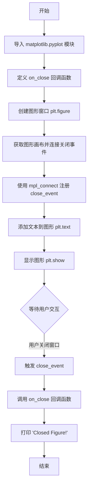
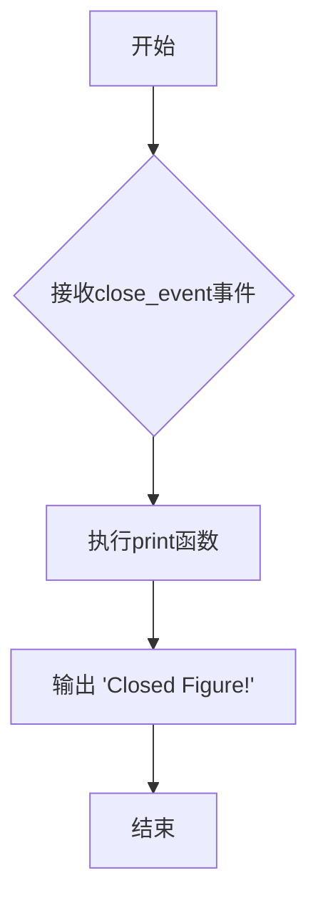

# `matplotlib\galleries\examples\event_handling\close_event.py` 详细设计文档

本代码演示了如何使用matplotlib的事件处理机制捕获并处理图形窗口关闭事件，通过注册回调函数在用户关闭窗口时触发相应的操作。

## 整体流程



## 类结构

```
close_event_example.py (Python脚本模块)
├── on_close (全局回调函数)
└── fig (全局图形对象)
```

## 全局变量及字段


### `fig`
    
matplotlib的Figure对象，表示图形窗口，用于连接和处理关闭事件

类型：`matplotlib.figure.Figure`
    


    

## 全局函数及方法


### `on_close`

该函数是matplotlib的回调函数，用于处理图形窗口关闭事件。当用户关闭图形窗口时，matplotlib会触发`close_event`并调用此回调函数，在控制台打印"Closed Figure!"消息。

参数：

- `event`：`matplotlib.event.Event`，matplotlib事件对象，包含触发事件的相关信息

返回值：`None`，该函数没有返回值，仅执行副作用操作（打印消息）

#### 流程图



#### 带注释源码

```python
def on_close(event):
    """
    关闭事件的回调函数
    
    参数:
        event: matplotlib.event.Event对象
               包含与关闭事件相关的信息
    
    返回值:
        None
    """
    # 打印关闭消息到控制台
    # 当用户关闭图形窗口时触发此回调
    print('Closed Figure!')
```

## 关键组件


### on_close 事件处理函数
自定义的回调函数，在图形窗口关闭时被调用，用于处理关闭事件

### fig 图形对象
matplotlib 的 Figure 对象，表示整个图形窗口，用于连接事件监听器

### close_event 关闭事件
Matplotlib 的内置事件类型，当用户关闭图形窗口时触发该事件

### mpl_connect 方法
用于将事件与回调函数绑定的连接方法，建立事件与处理函数之间的映射关系


## 问题及建议


### 已知问题

- **缺少异常处理**：回调函数 `on_close` 没有 try-except 包裹，如果打印失败或事件处理异常会导致程序崩溃
- **硬编码值**：文本位置 (0.35, 0.5) 和字体大小 (30) 硬编码，缺乏灵活配置
- **资源管理不完善**：没有实现图形关闭后的资源清理逻辑（如显式关闭 figure 或使用上下文管理器）
- **错误提示简单**：使用 print 输出关闭事件，不适合生产环境的日志记录需求
- **模块导入粒度粗**：导入整个 `matplotlib.pyplot` 模块而非按需导入，增加内存开销
- **缺少类型注解**：函数参数和返回值没有类型注解，降低代码可维护性和 IDE 支持
- **文档字符串缺失**：`on_close` 函数没有 docstring 说明其功能

### 优化建议

- 为回调函数添加异常处理，使用 logging 模块替代 print 进行日志记录
- 将硬编码值提取为配置常量或函数参数
- 使用 `with plt.figure() as fig:` 上下文管理器或添加 `fig.clf()` / `plt.close(fig)` 确保资源释放
- 考虑添加类型注解（`event: matplotlib.backend_bases.CloseEvent`）以提升代码可读性
- 为关键函数添加文档字符串，说明参数和返回值含义
- 如需更复杂的关闭逻辑，可考虑继承 `matplotlib.figure.FigureManagerBase` 或使用 `atexit` 模块注册清理函数


## 其它


### 设计目标与约束

该示例旨在演示Matplotlib中图形关闭事件的处理机制。设计目标包括：展示如何注册和管理图形关闭事件回调，使开发者能够在图形窗口关闭时执行特定操作。约束条件包括：依赖于matplotlib库的环境，需要支持交互式图形后端，仅在运行时有效，静态文档中无法展示交互特性。

### 错误处理与异常设计

本示例中的错误处理相对简单：on_close回调函数仅包含打印语句，未进行复杂的错误捕获。在实际应用中，应考虑添加异常处理机制，如try-except块来捕获回调执行过程中的潜在异常，防止因回调错误导致程序崩溃。plt.show()会阻塞主线程直至图形关闭，应在合适的图形后端环境中运行。

### 数据流与状态机

代码的数据流较为简单：plt.figure()创建Figure对象 → fig.canvas.mpl_connect()注册close_event事件回调 → 用户关闭图形窗口时触发事件系统 → 调用on_close(event)回调函数 → 打印"Closed Figure!"。状态机涉及图形生命周期：创建状态(figure创建) → 显示状态(plt.show()执行) → 关闭状态(用户关闭窗口触发事件) → 终止状态(程序结束)。

### 外部依赖与接口契约

主要外部依赖为matplotlib库，需要确保matplotlib已正确安装。接口契约方面：on_close函数必须接受一个event参数，该参数为matplotlib库提供的CloseEvent对象；plt.figure()返回Figure实例；fig.canvas.mpl_connect()接受事件名称字符串和回调函数作为参数，返回连接ID用于后续事件断开。

### 性能考虑

该示例性能开销极低，仅在图形关闭这一特定事件发生时调用简单回调函数。mlp_connect()的事件注册是轻量级操作。在大量图形场景下，每个图形独立维护事件连接，但总体性能影响仍可忽略。回调函数应保持简洁以避免阻塞事件处理。

### 安全性考虑

本示例无明显安全风险，因为仅执行本地打印操作。在实际应用中，若回调函数涉及文件操作、网络请求或敏感数据处理，需确保输入验证和错误处理到位，防止因图形关闭事件触发恶意代码执行。

### 可维护性与扩展性

当前实现具有良好的可扩展性：可通过添加更多回调函数实现多任务处理；可创建回调类封装复杂逻辑；可通过lambda或偏函数传递额外参数。维护建议：将回调函数封装为类方法便于状态管理；添加日志记录替代简单print；考虑事件连接的清理(使用cid进行disconnect)。

### 测试策略

测试应覆盖：图形创建验证、事件连接成功验证、关闭事件触发验证、回调执行验证。由于涉及GUI交互，测试建议使用matplotlib的Agg后端(非交互式后端)进行自动化测试，或使用unittest.mock模拟事件对象进行单元测试。

### 使用示例与用例

典型用例包括：保存图形状态到文件、释放图形相关资源、记录用户操作日志、更新其他UI组件状态、触发后续数据处理流程。扩展示例可包含：多个图形的事件管理、带有参数的自定义回调类、条件性保存图形数据等场景。

### 版本兼容性

该代码适用于Matplotlib 1.0及以上版本。close_event功能在较老版本中可能存在差异，建议使用最新稳定版matplotlib。不同操作系统和图形后端(Qt、Tkinter、GTK等)的事件行为可能略有差异，但close_event机制保持一致。

### 配置说明

无特殊配置要求。运行前确保matplotlib已安装(conda install matplotlib或pip install matplotlib)。如需非交互式运行，可设置matplotlib.use('Agg')使用非GUI后端。环境变量MPLBACKEND可指定默认后端。

### 关键组件信息

Figure对象：matplotlib的核心图形容器，提供画布(canvas)访问和事件处理能力；Canvas对象：负责图形渲染和事件分发，通过mpl_connect()方法注册事件回调；CloseEvent：图形关闭时创建的事件对象，包含事件类型和时间戳信息；Event System：matplotlib的事件处理系统，支持多种事件类型的注册和触发。

    