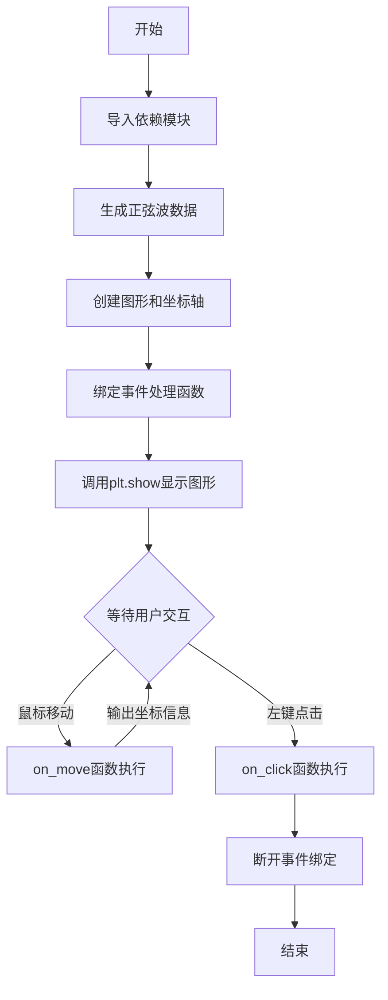
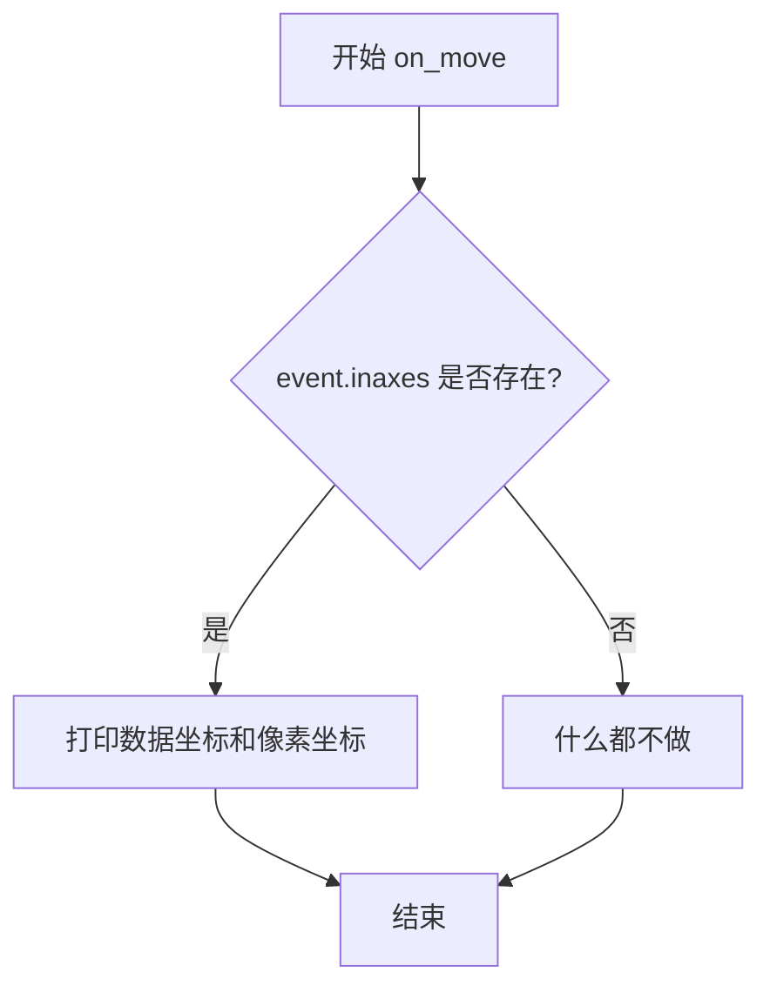

# `matplotlib\galleries\examples\event_handling\coords_demo.py` 详细设计文档

这是一个Matplotlib交互式图形示例，通过连接鼠标移动(motion_notify_event)和点击(button_press_event)事件，展示如何与绘图画布进行交互，并在用户移动鼠标时输出数据坐标和像素坐标，在用户点击左键时断开事件连接。

## 整体流程



## 类结构

```
Python脚本 (无面向对象结构)
├── 全局变量区域
│   ├── t (时间序列数据)
│   ├── s (正弦波数值)
│   ├── fig (Figure对象)
│   ├── ax (Axes对象)
│   └── binding_id (事件绑定ID)
├── 事件处理函数
on_move (鼠标移动回调)
│   └── on_click (鼠标点击回调)
└── 主执行流程
```

## 全局变量及字段


### `t`
    
时间序列数组，从0.0到1.0，步长0.01

类型：`numpy.ndarray`
    


### `s`
    
对应时间点的正弦波数值，2π频率

类型：`numpy.ndarray`
    


### `fig`
    
Matplotlib图形对象

类型：`matplotlib.figure.Figure`
    


### `ax`
    
坐标轴对象，包含plot方法

类型：`matplotlib.axes.Axes`
    


### `binding_id`
    
事件绑定的标识符，用于后续断开连接

类型：`int`
    


    

## 全局函数及方法


### `on_move`

这是一个鼠标移动事件回调函数，用于检测鼠标是否在坐标轴内，并在控制台打印当前鼠标位置的数据坐标和像素坐标。

参数：

- `event`：`matplotlib.backend_bases.MouseEvent`，鼠标移动事件对象，包含鼠标的像素坐标（x, y）、数据坐标（xdata, ydata）以及所在坐标轴（inaxes）等信息

返回值：`None`，该函数无返回值，仅执行打印操作

#### 流程图



#### 带注释源码

```python
def on_move(event):
    # 判断鼠标事件是否发生在某个坐标轴内
    if event.inaxes:
        # 如果鼠标在坐标轴内，打印数据坐标和像素坐标
        # event.xdata, event.ydata: 数据坐标系中的坐标
        # event.x, event.y: 像素坐标系中的坐标
        print(f'data coords {event.xdata} {event.ydata},',
              f'pixel coords {event.x} {event.y}')
```


### `on_click(event)`

鼠标点击事件回调函数，检测左键点击，打印消息并断开运动通知事件绑定。

参数：

-  `event`：鼠标事件对象，包含点击的按钮信息等

返回值：`None`，无返回值描述

#### 流程图

```mermaid
flowchart TD
    A[开始 on_click] --> B{event.button is MouseButton.LEFT?}
    B -->|是| C[打印 'disconnecting callback']
    C --> D[调用 plt.disconnect(binding_id) 断开事件绑定]
    D --> E[结束]
    B -->|否| E
```

#### 带注释源码

```python
def on_click(event):
    """
    鼠标点击事件回调函数
    
    参数:
        event: 鼠标事件对象，包含button属性表示点击的鼠标按钮
    """
    # 检查是否为左键点击
    if event.button is MouseButton.LEFT:
        # 打印断开连接的消息
        print('disconnecting callback')
        # 断开之前连接的运动通知事件绑定
        # binding_id 是之前通过 plt.connect() 返回的连接ID
        plt.disconnect(binding_id)
```

## 关键组件


### 一段话描述
该代码演示了Matplotlib中交互式绘图的基本用法，通过连接鼠标移动和点击事件到回调函数，实现实时打印鼠标位置坐标并在点击时断开事件连接，创建了一个动态交互的正弦波可视化示例。

### 文件的整体运行流程
1. 导入matplotlib.pyplot、numpy和matplotlib.backend_bases中的MouseButton。
2. 使用numpy生成0到1之间的线性时间数组t和对应的正弦波数据s。
3. 创建包含一个子图的图表fig和坐标轴ax，并绘制t和s的曲线。
4. 定义`on_move`函数用于处理鼠标移动事件，当鼠标在坐标轴内时打印数据坐标和像素坐标。
5. 定义`on_click`函数用于处理鼠标点击事件，当左键点击时打印消息并断开已连接的事件。
6. 使用`plt.connect`将`on_move`函数绑定到'motion_notify_event'事件，并将返回的连接ID存储在binding_id中；将`on_click`函数绑定到'button_press_event'事件。
7. 调用`plt.show()`显示图表，进入交互事件循环。

### 类的详细信息
本代码无类定义，仅包含模块级函数和全局变量。
#### 全局变量
- 名称: t，类型: numpy.ndarray，描述: 时间数组，从0.0到1.0（不含），步长0.01
- 名称: s，类型: numpy.ndarray，描述: 对应时间数组的正弦波数据，频率为2π
- 名称: fig，类型: matplotlib.figure.Figure，描述: Matplotlib图表对象
- 名称: ax，类型: matplotlib.axes.Axes，描述: Matplotlib坐标轴对象
- 名称: binding_id，类型: int，描述: 鼠标移动事件连接的标识符，用于断开连接

#### 模块级函数
- 函数名: on_move
  - 参数: event（类型: matplotlib.backend_bases.MouseEvent，描述: 鼠标事件对象，包含x、y、xdata、ydata等属性）
  - 返回值: None
  - 描述: 回调函数，当鼠标移动时触发，若鼠标在坐标轴内则打印数据坐标和像素坐标
- 函数名: on_click
  - 参数: event（类型: matplotlib.backend_bases.MouseEvent，描述: 鼠标事件对象，包含button属性）
  - 返回值: None
  - 描述: 回调函数，当鼠标点击时触发，若左键点击则打印消息并断开移动事件连接

### 关键组件信息
- **matplotlib.pyplot**: 完整的Matplotlib绘图库，提供了创建图表、连接事件和显示交互界面的功能
- **numpy**: 用于数值计算的Python库，这里用于生成正弦波数据
- **MouseButton**: 来自matplotlib.backend_bases的枚举类，定义了鼠标按钮常量（如MouseButton.LEFT）
- **事件连接器**: plt.connect方法用于将回调函数与特定事件类型关联，支持motion_notify_event（鼠标移动）和button_press_event（鼠标按下）
- **事件回调**: on_move和on_click函数作为具体的事件处理器，实现业务逻辑

### 潜在的技术债务或优化空间
- **缺乏健壮的错误处理**: 事件回调函数中直接访问event属性，未检查event是否为None，可能在某些边缘情况下导致AttributeError
- **代码复用性差**: 事件处理逻辑硬编码在全局函数中，如果需要多个图表复用相同逻辑，应封装为类或可调用对象
- **资源管理不完善**: 断开连接后没有重新连接的机制，且未考虑程序退出时的资源清理（如使用atexit）
- **硬编码配置**: 图表样式、事件类型和连接ID等以硬编码形式存在，缺乏配置灵活性
- **注释和文档不足**: 模块和函数缺少文档字符串（docstring），不利于后续维护和理解

### 其它项目
- **设计目标与约束**: 该示例旨在展示Matplotlib的交互能力，约束为仅处理鼠标事件，且未考虑键盘事件或多图表联动
- **错误处理与异常设计**: 错误处理极为基础，仅通过if event.inaxes避免打印无效坐标，未捕获其他可能的异常（如连接失败）
- **数据流与状态机**: 数据流为静态生成的正弦波，状态机表现为事件连接的建立和断开（通过binding_id标识）
- **外部依赖与接口契约**: 依赖matplotlib和numpy，接口契约为回调函数接收MouseEvent对象并按需修改全局状态或打印信息


## 问题及建议


### 已知问题

-   **变量作用域问题**：`binding_id` 在 `on_click` 函数内部被引用，但定义在函数之后。虽然 Python 的延迟绑定机制使其可以运行，但这种写法不符合最佳实践，容易造成代码理解困难和维护性问题。
-   **缺少异常处理**：`plt.disconnect(binding_id)` 调用时没有进行异常处理，如果回调未被正确连接或已经断开，抛出异常时会导致程序崩溃。
-   **全局变量滥用**：`binding_id` 作为全局变量存在，增加了代码耦合度，不利于封装和测试。
-   **缺少类型注解**：`on_move` 和 `on_click` 函数缺乏参数和返回值的类型注解，降低了代码可读性和 IDE 支持。
-   **调试代码残留**：使用 `print` 语句进行输出，未使用标准的 logging 模块，不利于生产环境的日志管理。
-   **资源未正确释放**：当 `plt.show()` 关闭后，注册的回调连接没有显式的清理机制，可能导致潜在的资源泄漏。
-   **函数缺少文档字符串**：`on_move` 和 `on_click` 两个回调函数没有 docstring，其他开发者难以理解其具体功能和用途。

### 优化建议

-   **调整变量定义顺序**：将 `binding_id` 的定义移至 `on_click` 函数之前，或使用函数参数传递的方式明确依赖关系。
-   **添加异常处理**：在使用 `plt.disconnect` 前检查 `binding_id` 是否有效，或使用 try-except 捕获可能的异常。
-   **使用类封装**：将回调函数和相关状态封装到类中，使用实例属性代替全局变量，提高代码的可维护性和可测试性。
-   **添加类型注解**：为函数参数和返回值添加类型提示，例如 `def on_move(event: MouseEvent) -> None:`。
-   **使用日志替代打印**：使用 `logging` 模块替代 `print` 语句，便于配置日志级别和输出格式。
-   **添加资源清理**：使用 `atexit` 模块或 `try-finally` 结构确保程序退出时正确断开所有事件连接。
-   **补充文档字符串**：为所有函数添加规范的 docstring，说明参数、返回值和功能描述。
-   **添加回调管理类**：考虑创建自定义的回调管理器类，统一管理事件的连接和断开操作。


## 其它


### 设计目标与约束

本示例旨在演示Matplotlib的交互能力，让用户能够在图形界面上实时获取鼠标位置坐标，并实现事件回调的动态管理。约束条件包括：1）依赖Matplotlib库；2）仅支持交互式后端运行；3）示例代码简单直接，不涉及复杂的应用逻辑。

### 错误处理与异常设计

本代码未实现显式的错误处理机制。潜在异常场景包括：1）非交互式后端下plt.show()会阻塞且无响应；2）event.inaxes为None时坐标访问可能异常；3）plt.disconnect()在未连接回调时调用无效。建议在实际应用中添加后端检查、坐标有效性验证和连接状态管理。

### 外部依赖与接口契约

主要外部依赖包括：matplotlib>=3.0、numpy>=1.8。关键接口契约：on_move(event)接收MouseEvent对象，event.inaxes表示是否在axes内，event.xdata/ydata为数据坐标，event.x/y为像素坐标；on_click(event)接收MouseEvent对象，event.button为MouseButton枚举类型；plt.connect(event_name, callback)返回绑定ID用于后续断开连接。

### 性能考虑

当前实现性能开销较小。优化建议：1）避免在on_move中执行耗时操作；2）如需频繁更新显示，考虑使用blitting技术；3）对于大数据量绘图，事件回调中应尽量减少计算量。

### 兼容性考虑

代码兼容Python 3.6+和主流Matplotlib后端（Qt5Agg、TkAgg、GTK3Agg等）。不同后端可能存在细微行为差异，如坐标精度、事件触发频率等。建议在目标部署环境进行测试验证。

### 可测试性

当前示例代码可测试性较低，因其依赖图形界面和事件循环。测试建议：1）将on_move和on_click函数设计为纯函数，便于单元测试；2）使用mock模拟MouseEvent对象；3）考虑将事件处理逻辑与UI绑定分离，提高可测试性。

### 部署和运行要求

运行要求：1）安装Matplotlib和NumPy；2）使用交互式后端（非Agg等非交互后端）；3）在支持图形界面的环境中运行。部署方式：作为独立脚本运行、或嵌入到Jupyter Notebook中使用%matplotlib notebook/widget魔法命令。

    