# `matplotlib\galleries\examples\event_handling\cursor_demo.py` 详细设计文档

This code demonstrates three different implementations of a cross-hair cursor for a matplotlib plot. It includes a simple cursor, a cursor using blitting for faster redraw, and a cursor that snaps to data points.

## 整体流程

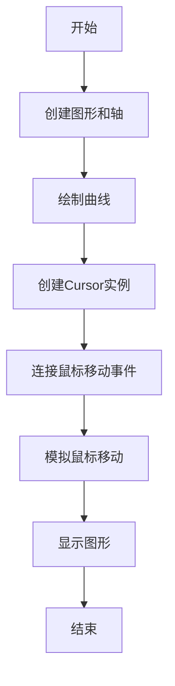

## 类结构

```
Cursor (抽象基类)
├── SimpleCursor (简单游标)
│   ├── BlittedCursor (使用blitting的游标)
│   └── SnappingCursor (吸附游标)
└── MouseEvent (鼠标事件)
```

## 全局变量及字段


### `x`
    
Array of x values for the plot.

类型：`numpy.ndarray`
    


### `y`
    
Array of y values for the plot.

类型：`numpy.ndarray`
    


### `fig`
    
The figure containing the plot.

类型：`matplotlib.figure.Figure`
    


### `ax`
    
The axes containing the plot.

类型：`matplotlib.axes._subplots.AxesSubplot`
    


### `line`
    
The line object representing the plot.

类型：`matplotlib.lines.Line2D`
    


### `cursor`
    
The cursor object for the plot.

类型：`Cursor`
    


### `blitted_cursor`
    
The blitted cursor object for the plot.

类型：`BlittedCursor`
    


### `snap_cursor`
    
The snapping cursor object for the plot.

类型：`SnappingCursor`
    


### `Cursor.ax`
    
The axes object associated with the cursor.

类型：`matplotlib.axes._subplots.AxesSubplot`
    


### `Cursor.horizontal_line`
    
The horizontal line of the cross-hair cursor.

类型：`matplotlib.lines.Line2D`
    


### `Cursor.vertical_line`
    
The vertical line of the cross-hair cursor.

类型：`matplotlib.lines.Line2D`
    


### `Cursor.text`
    
The text object displaying the cursor coordinates.

类型：`matplotlib.text.Text`
    


### `BlittedCursor.ax`
    
The axes object associated with the cursor.

类型：`matplotlib.axes._subplots.AxesSubplot`
    


### `BlittedCursor.background`
    
The background image used for blitting.

类型：`PIL.Image.Image`
    


### `BlittedCursor.horizontal_line`
    
The horizontal line of the cross-hair cursor.

类型：`matplotlib.lines.Line2D`
    


### `BlittedCursor.vertical_line`
    
The vertical line of the cross-hair cursor.

类型：`matplotlib.lines.Line2D`
    


### `BlittedCursor.text`
    
The text object displaying the cursor coordinates.

类型：`matplotlib.text.Text`
    


### `BlittedCursor._creating_background`
    
Flag indicating whether a new background is being created.

类型：`bool`
    


### `SnappingCursor.ax`
    
The axes object associated with the cursor.

类型：`matplotlib.axes._subplots.AxesSubplot`
    


### `SnappingCursor.horizontal_line`
    
The horizontal line of the cross-hair cursor.

类型：`matplotlib.lines.Line2D`
    


### `SnappingCursor.vertical_line`
    
The vertical line of the cross-hair cursor.

类型：`matplotlib.lines.Line2D`
    


### `SnappingCursor.x`
    
Array of x values for the data points.

类型：`numpy.ndarray`
    


### `SnappingCursor.y`
    
Array of y values for the data points.

类型：`numpy.ndarray`
    


### `SnappingCursor._last_index`
    
The index of the last indicated data point.

类型：`int`
    


### `SnappingCursor.text`
    
The text object displaying the cursor coordinates.

类型：`matplotlib.text.Text`
    
    

## 全局函数及方法


### np.arange

`np.arange` 是 NumPy 库中的一个函数，用于生成一个沿指定间隔的数字序列。

参数：

- `start`：`int` 或 `float`，序列的起始值。
- `stop`：`int` 或 `float`，序列的结束值。
- `step`：`int` 或 `float`，序列中相邻元素之间的间隔，默认为 1。

参数描述：

- `start`：序列的起始值。
- `stop`：序列的结束值，但不包括在内。
- `step`：序列中相邻元素之间的间隔。

返回值类型：`numpy.ndarray`

返回值描述：返回一个沿指定间隔的数字序列的 NumPy 数组。

#### 流程图

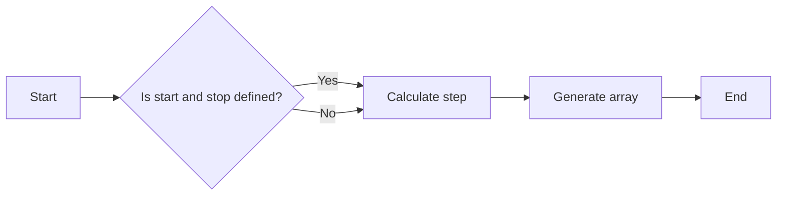

#### 带注释源码

```python
import numpy as np

def np_arange(start, stop=None, step=1):
    """
    Generate an array of numbers along a specified interval.

    Parameters:
    - start: The starting value of the sequence.
    - stop: The ending value of the sequence, not included.
    - step: The interval between adjacent elements in the sequence, default is 1.

    Returns:
    - numpy.ndarray: An array of numbers along the specified interval.
    """
    return np.arange(start, stop, step)
```


### np.sin

计算输入数组元素的正弦值。

参数：

- `x`：`numpy.ndarray`，输入数组，包含要计算正弦值的元素。

返回值：`numpy.ndarray`，包含输入数组元素的正弦值。

#### 流程图

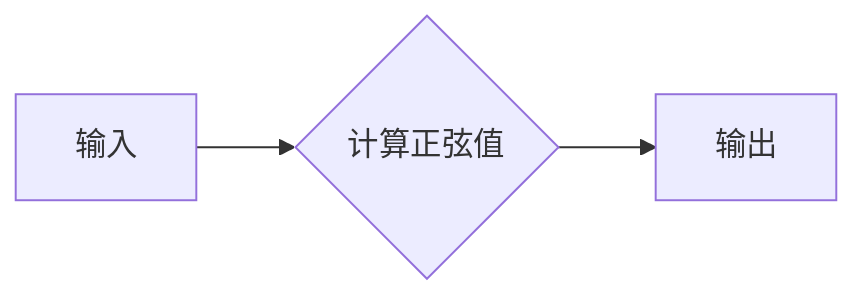

#### 带注释源码

```python
import numpy as np

def sin(x):
    """
    计算输入数组元素的正弦值。

    参数：
    - x：numpy.ndarray，输入数组，包含要计算正弦值的元素。

    返回值：numpy.ndarray，包含输入数组元素的正弦值。
    """
    return np.sin(x)
```


### plt.subplots

`plt.subplots` 是一个用于创建子图和轴对象的函数。

参数：

- `figsize`：`tuple`，指定图形的大小（宽度和高度）。
- `dpi`：`int`，指定图形的分辨率（每英寸点数）。
- `ncols`：`int`，指定子图的列数。
- `nrows`：`int`，指定子图的行数。
- `gridspec_kw`：`dict`，用于指定网格规格的参数。
- `constrained_layout`：`bool`，指定是否启用约束布局。
- `sharex`：`bool` 或 `str`，指定是否共享x轴。
- `sharey`：`bool` 或 `str`，指定是否共享y轴。
- `subplot_kw`：`dict`，用于指定子图参数的字典。

返回值：`Figure` 对象，包含一个轴对象。

返回值描述：`Figure` 对象是图形的容器，包含一个或多个轴对象。轴对象是图形的子区域，用于绘制图形元素。

#### 流程图

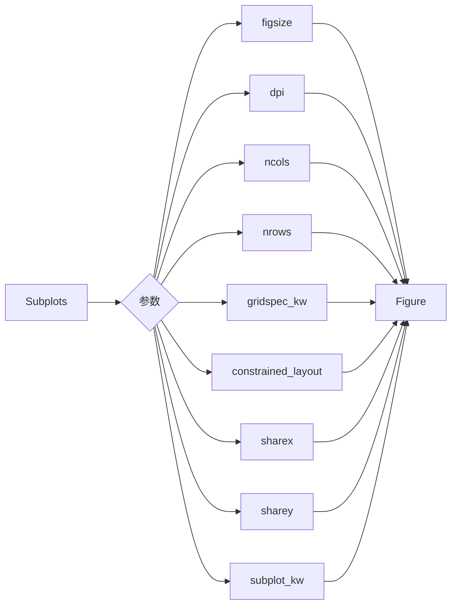

#### 带注释源码

```python
fig, ax = plt.subplots(figsize=(10, 6), dpi=100, ncols=2, nrows=2)
```


### ax.set_title

`ax.set_title` 是一个方法，用于设置matplotlib图形中轴的标题。

参数：

- `title`：`str`，要设置的标题文本。

返回值：`str`，返回轴的标题文本。

#### 流程图

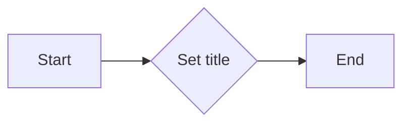

#### 带注释源码

```python
def set_title(self, title):
    """
    Set the title of the axes.

    Parameters
    ----------
    title : str
        The title string.

    Returns
    -------
    str
        The title string.
    """
    self._title = title
    self._update_title()
    return title
```


### ax.plot

`ax.plot` 是一个用于绘制二维线图的方法。

参数：

- `x`：`numpy.ndarray` 或 `matplotlib.collections.LineCollection`，x轴的数据点。
- `y`：`numpy.ndarray` 或 `matplotlib.collections.LineCollection`，y轴的数据点。
- ...

返回值：`Line2D` 对象，表示绘制的线。

#### 流程图

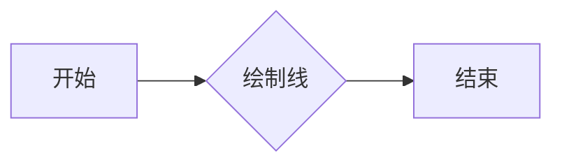

#### 带注释源码

```python
line, = ax.plot(x, y, 'o')
```

在这个例子中，`ax.plot(x, y, 'o')` 创建了一个线图，其中 `x` 和 `y` 是数据点，`'o'` 表示每个数据点用一个圆圈表示。


### fig.canvas.mpl_connect

连接事件处理函数到matplotlib画布。

描述：

该函数用于将事件处理函数连接到matplotlib画布，以便在特定事件发生时执行相应的函数。

参数：

- `event`: `str`，指定要连接的事件类型。
- `func`: `callable`，指定要连接的事件处理函数。

返回值：`None`

#### 流程图


#### 带注释源码

```python
fig.canvas.mpl_connect('motion_notify_event', cursor.on_mouse_move)
```

在这段代码中，`fig.canvas.mpl_connect` 将 `'motion_notify_event'` 事件与 `cursor.on_mouse_move` 方法连接起来。这意味着每当鼠标在画布上移动时，`cursor.on_mouse_move` 方法将被调用。


### plt.show()

`plt.show()` 是 Matplotlib 库中的一个全局函数，用于显示当前图形窗口。它将当前图形窗口显示在屏幕上，并保持打开状态，直到用户关闭窗口。

参数：

- 无

返回值：无

#### 流程图

```mermaid
graph LR
A[plt.show()] --> B{显示图形窗口}
B --> C[用户交互]
C --> B
```

#### 带注释源码

```python
plt.show()  # 显示当前图形窗口
```


### Cursor.__init__

This method initializes a `Cursor` object, setting up the cross-hair cursor for a given axes object.

参数：

- `ax`：`matplotlib.axes.Axes`，The axes object to which the cursor is attached.

返回值：无

#### 流程图

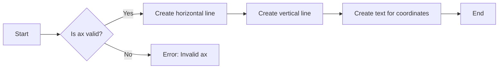

#### 带注释源码

```python
def __init__(self, ax):
    # Check if ax is a valid matplotlib.axes.Axes object
    if not isinstance(ax, matplotlib.axes.Axes):
        raise ValueError("ax must be a matplotlib.axes.Axes object")

    self.ax = ax  # Store the axes object
    self.horizontal_line = ax.axhline(color='k', lw=0.8, ls='--')  # Create horizontal line for cross-hair
    self.vertical_line = ax.axvline(color='k', lw=0.8, ls='--')  # Create vertical line for cross-hair
    # text location in axes coordinates
    self.text = ax.text(0.72, 0.9, '', transform=ax.transAxes)  # Create text to display coordinates
```


### Cursor.set_cross_hair_visible

Sets the visibility of the cross-hair cursor.

参数：

- `visible`：`bool`，Determines whether the cross-hair cursor is visible or not.

返回值：`bool`，Indicates whether a redraw is needed after setting the visibility.

#### 流程图

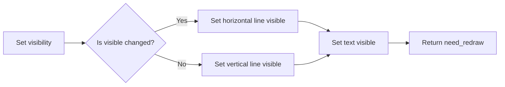

#### 带注释源码

```python
def set_cross_hair_visible(self, visible):
    need_redraw = self.horizontal_line.get_visible() != visible
    self.horizontal_line.set_visible(visible)
    self.vertical_line.set_visible(visible)
    self.text.set_visible(visible)
    return need_redraw
```


### Cursor.on_mouse_move

This method updates the cross-hair cursor position based on the mouse movement event.

参数：

- `event`：`MouseEvent`，The mouse movement event object.

返回值：`None`，This method does not return any value.

#### 流程图


#### 带注释源码

```python
def on_mouse_move(self, event):
    if not event.inaxes:
        need_redraw = self.set_cross_hair_visible(False)
        if need_redraw:
            self.ax.figure.canvas.draw()
    else:
        self.set_cross_hair_visible(True)
        x, y = event.xdata, event.ydata
        # update the line positions
        self.horizontal_line.set_ydata([y])
        self.vertical_line.set_xdata([x])
        self.text.set_text(f'x={x:1.2f}, y={y:1.2f}')
        self.ax.figure.canvas.draw()
```


### BlittedCursor.__init__

This method initializes a BlittedCursor object, setting up the necessary components for a cross-hair cursor that uses blitting for faster redraw.

参数：

- `ax`：`matplotlib.axes.Axes`，The axes object to which the cursor is attached.

返回值：无

#### 流程图

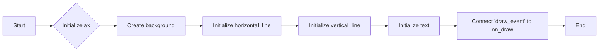

#### 带注释源码

```python
def __init__(self, ax):
    self.ax = ax  # Axes object to which the cursor is attached
    self.background = None  # Background image for blitting
    self.horizontal_line = ax.axhline(color='k', lw=0.8, ls='--')  # Horizontal line for cross-hair
    self.vertical_line = ax.axvline(color='k', lw=0.8, ls='--')  # Vertical line for cross-hair
    self.text = ax.text(0.72, 0.9, '', transform=ax.transAxes)  # Text to display cursor position
    self._creating_background = False  # Flag to prevent recursive calls to create_new_background
    ax.figure.canvas.mpl_connect('draw_event', self.on_draw)  # Connect 'draw_event' to on_draw method
```


### BlittedCursor.set_cross_hair_visible

Sets the visibility of the cross-hair cursor.

参数：

- `visible`：`bool`，Determines whether the cross-hair cursor is visible or not.

返回值：`bool`，Indicates whether a redraw is needed after setting the visibility.

#### 流程图

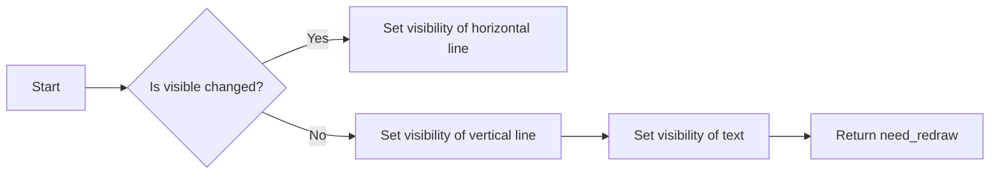

#### 带注释源码

```python
def set_cross_hair_visible(self, visible):
    need_redraw = self.horizontal_line.get_visible() != visible
    self.horizontal_line.set_visible(visible)
    self.vertical_line.set_visible(visible)
    self.text.set_visible(visible)
    return need_redraw
```


### BlittedCursor.on_draw

This method is responsible for creating a new background image of the plot without the cross-hair lines and text. It is called during the 'draw_event' to ensure that the background is up-to-date.

参数：

- `event`：`matplotlib.backend_bases.Event`，The draw event object.

返回值：`None`，This method does not return any value.

#### 流程图


#### 带注释源码

```python
def on_draw(self, event):
    self.create_new_background()

def create_new_background(self):
    if self._creating_background:
        # discard calls triggered from within this function
        return
    self._creating_background = True
    self.set_cross_hair_visible(False)
    self.ax.figure.canvas.draw()
    self.background = self.ax.figure.canvas.copy_from_bbox(self.ax.bbox)
    self.set_cross_hair_visible(True)
    self._creating_background = False
```


### BlittedCursor.create_new_background

This method creates a new background image for the blitted cursor, which is used to speed up the redraw process by only redrawing the changed parts of the plot.

参数：

- `self`：`BlittedCursor`，The instance of the BlittedCursor class.

返回值：`None`，This method does not return any value.

#### 流程图

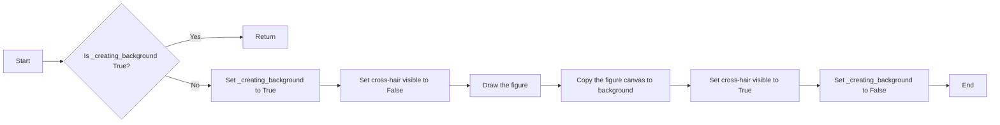

#### 带注释源码

```python
def create_new_background(self):
    if self._creating_background:
        # discard calls triggered from within this function
        return
    self._creating_background = True
    self.set_cross_hair_visible(False)
    self.ax.figure.canvas.draw()
    self.background = self.ax.figure.canvas.copy_from_bbox(self.ax.bbox)
    self.set_cross_hair_visible(True)
    self._creating_background = False
```


### BlittedCursor.on_mouse_move

This method updates the cross-hair cursor position based on the mouse movement event.

参数：

- `event`：`MouseEvent`，The mouse movement event object.

返回值：`None`，This method does not return any value.

#### 流程图

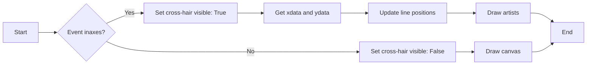

#### 带注释源码

```python
def on_mouse_move(self, event):
    if self.background is None:
        self.create_new_background()
    if not event.inaxes:
        need_redraw = self.set_cross_hair_visible(False)
        if need_redraw:
            self.ax.figure.canvas.restore_region(self.background)
            self.ax.figure.canvas.blit(self.ax.bbox)
    else:
        self.set_cross_hair_visible(True)
        # update the line positions
        x, y = event.xdata, event.ydata
        self.horizontal_line.set_ydata([y])
        self.vertical_line.set_xdata([x])
        self.text.set_text(f'x={x:1.2f}, y={y:1.2f}')

        self.ax.figure.canvas.restore_region(self.background)
        self.ax.draw_artist(self.horizontal_line)
        self.ax.draw_artist(self.vertical_line)
        self.ax.draw_artist(self.text)
        self.ax.figure.canvas.blit(self.ax.bbox)
```


### SnappingCursor.__init__

This method initializes a `SnappingCursor` object, which is a cross-hair cursor that snaps to the data point of a line, which is closest to the *x* position of the cursor.

参数：

- `ax`：`matplotlib.axes.Axes`，The axes object where the cursor will be displayed.
- `line`：`matplotlib.lines.Line2D`，The line object whose data points the cursor will snap to.

返回值：`None`，This method does not return any value.

#### 流程图

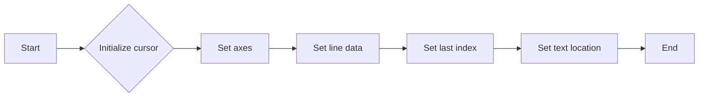

#### 带注释源码

```python
def __init__(self, ax, line):
    self.ax = ax  # Set the axes object
    self.horizontal_line = ax.axhline(color='k', lw=0.8, ls='--')  # Create a horizontal line for the cursor
    self.vertical_line = ax.axvline(color='k', lw=0.8, ls='--')  # Create a vertical line for the cursor
    self.x, self.y = line.get_data()  # Get the x and y data from the line object
    self._last_index = None  # Initialize the last index of the data point
    # text location in axes coords
    self.text = ax.text(0.72, 0.9, '', transform=ax.transAxes)  # Create a text object for displaying the cursor position
```


### Cursor.set_cross_hair_visible

Sets the visibility of the cross-hair cursor.

参数：

- `visible`：`bool`，Determines whether the cross-hair cursor is visible or not.

返回值：`bool`，Indicates whether a redraw is needed after setting the visibility.

#### 流程图


#### 带注释源码

```python
def set_cross_hair_visible(self, visible):
    need_redraw = self.horizontal_line.get_visible() != visible
    self.horizontal_line.set_visible(visible)
    self.vertical_line.set_visible(visible)
    self.text.set_visible(visible)
    return need_redraw
```


### SnappingCursor.on_mouse_move

This method updates the cross-hair cursor position to the nearest data point when the mouse moves over a plot.

参数：

- `event`：`MouseEvent`，The mouse event object that triggered the method.

返回值：`None`，This method does not return any value.

#### 流程图

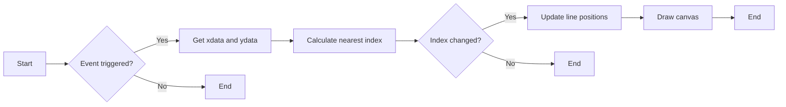

#### 带注释源码

```python
def on_mouse_move(self, event):
    if not event.inaxes:
        self._last_index = None
        need_redraw = self.set_cross_hair_visible(False)
        if need_redraw:
            self.ax.figure.canvas.draw()
    else:
        self.set_cross_hair_visible(True)
        x, y = event.xdata, event.ydata
        index = min(np.searchsorted(self.x, x), len(self.x) - 1)
        if index == self._last_index:
            return  # still on the same data point. Nothing to do.
        self._last_index = index
        x = self.x[index]
        y = self.y[index]
        # update the line positions
        self.horizontal_line.set_ydata([y])
        self.vertical_line.set_xdata([x])
        self.text.set_text(f'x={x:1.2f}, y={y:1.2f}')
        self.ax.figure.canvas.draw()
```


## 关键组件


### 张量索引与惰性加载

张量索引与惰性加载是代码中用于高效处理大型数据集的关键组件。它允许在需要时才计算或加载数据，从而减少内存消耗和提高性能。

### 反量化支持

反量化支持是代码中用于处理量化数据的关键组件。它允许将量化数据转换回原始数据，以便进行进一步的分析或处理。

### 量化策略

量化策略是代码中用于优化数据表示和存储的关键组件。它通过减少数据精度来减少内存消耗和提高处理速度。


## 问题及建议


### 已知问题

-   **性能问题**：在简单的游标实现中，每次鼠标移动都会重新绘制整个图形，这可能导致性能问题，尤其是在图形复杂或数据点众多的情况下。
-   **内存使用**：在BlittedCursor中，背景图像的存储可能会增加内存使用，尤其是在处理大型图形时。
-   **数据点排序假设**：SnappingCursor假设数据点的x值是排序的，这在实际应用中可能不成立，需要额外的逻辑来处理未排序的数据点。

### 优化建议

-   **优化简单游标实现**：可以通过缓存图形的某些部分来减少重新绘制的次数，或者使用更高效的图形库来提高渲染速度。
-   **动态背景更新**：在BlittedCursor中，可以考虑仅在必要时更新背景图像，例如当图形发生变化时，而不是在每次鼠标移动时。
-   **处理未排序数据点**：在SnappingCursor中，可以添加逻辑来处理未排序的数据点，例如使用二分搜索或其他排序算法来找到最接近的索引。
-   **使用更高效的搜索算法**：在SnappingCursor中，可以使用更高效的搜索算法来找到最接近的数据点，例如使用二分搜索而不是线性搜索。
-   **考虑使用更高级的库**：可以考虑使用更高级的图形库，如`matplotlib`的`blit`功能或`numpy`的数组操作，以提高性能和效率。


## 其它


### 设计目标与约束

- 设计目标：
  - 实现一个跨平台、可配置的十字准线光标，用于在绘图时显示数据点的位置。
  - 提供三种不同的实现方式：简单光标、使用双缓冲的快速光标和自动对齐数据点的光标。
  - 确保光标响应快速，减少绘图延迟。
- 约束：
  - 必须使用matplotlib库进行绘图。
  - 光标实现应尽可能高效，减少资源消耗。

### 错误处理与异常设计

- 错误处理：
  - 在鼠标移动事件中，如果鼠标不在轴内，则隐藏光标并重绘。
  - 如果在创建背景时发生错误，则记录错误并尝试恢复。
- 异常设计：
  - 使用try-except块捕获可能发生的异常，并记录错误信息。

### 数据流与状态机

- 数据流：
  - 用户移动鼠标，触发鼠标移动事件。
  - 事件处理函数根据鼠标位置更新光标位置。
  - 光标位置更新后，重新绘制图形。
- 状态机：
  - 光标有三种状态：可见、不可见和正在创建背景。

### 外部依赖与接口契约

- 外部依赖：
  - matplotlib库：用于绘图和事件处理。
  - numpy库：用于数值计算。
- 接口契约：
  - Cursor类：提供设置光标可见性和处理鼠标移动事件的方法。
  - BlittedCursor类：继承Cursor类，并实现使用双缓冲的快速光标。
  - SnappingCursor类：继承Cursor类，并实现自动对齐数据点的光标。


    