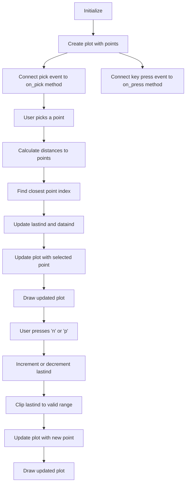
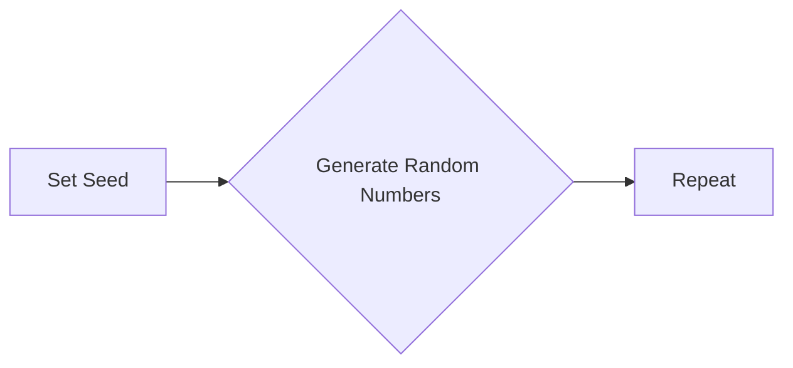
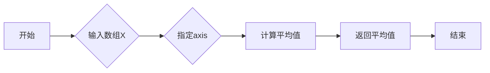
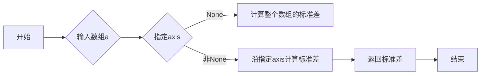
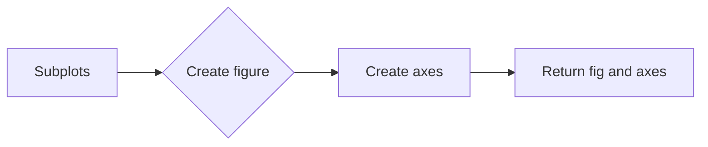
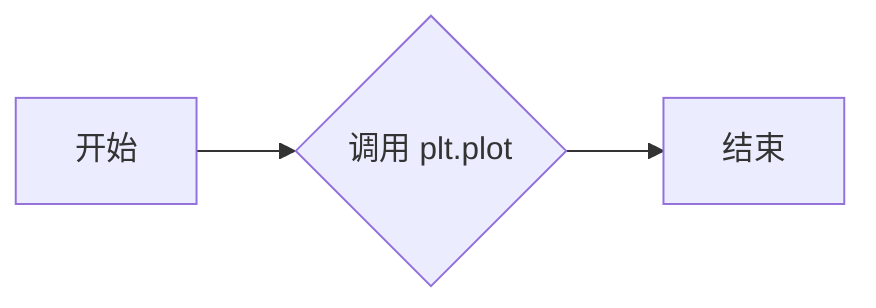
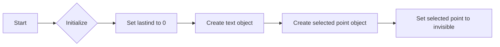
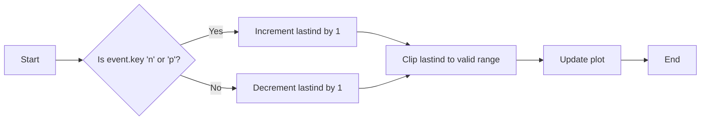
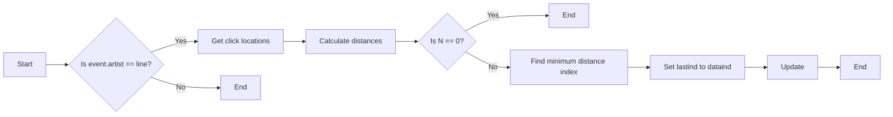

# `matplotlib\galleries\examples\event_handling\data_browser.py` 详细设计文档

The code provides an interactive data browser that allows users to select and highlight points on a plot, and then displays the corresponding data on another axis.

## 整体流程



## 类结构

```
PointBrowser (主类)
├── __init__(self)
│   ├── lastind (int)
│   ├── text (matplotlib.text.Text)
│   ├── selected (matplotlib.lines.Line2D)
│   └── ax (matplotlib.axes.Axes)
├── on_press(self, event)
│   ├── event (matplotlib.backend_bases.Event)
│   └── ...
├── on_pick(self, event)
│   ├── event (matplotlib.backend_bases.Event)
│   └── ...
└── update(self)
```

## 全局变量及字段


### `xs`
    
Array of x-coordinates for each point.

类型：`numpy.ndarray`
    


### `ys`
    
Array of y-coordinates for each point.

类型：`numpy.ndarray`
    


### `X`
    
2D array of data points.

类型：`numpy.ndarray`
    


### `line`
    
Line object representing the plot of xs and ys.

类型：`matplotlib.lines.Line2D`
    


### `fig`
    
Figure object containing the plot.

类型：`matplotlib.figure.Figure`
    


### `ax`
    
Axes object for the top plot.

类型：`matplotlib.axes._subplots.AxesSubplot`
    


### `ax2`
    
Axes object for the bottom plot.

类型：`matplotlib.axes._subplots.AxesSubplot`
    


### `browser`
    
Instance of PointBrowser class for handling interactions.

类型：`PointBrowser`
    


### `PointBrowser.lastind`
    
Index of the last selected point.

类型：`int`
    


### `PointBrowser.text`
    
Text object displaying the selected point index.

类型：`matplotlib.text.Text`
    


### `PointBrowser.selected`
    
Line object representing the selected point.

类型：`matplotlib.lines.Line2D`
    


### `PointBrowser.ax`
    
Axes object for the top plot, used for rendering the selected point.

类型：`matplotlib.axes._subplots.AxesSubplot`
    
    

## 全局函数及方法


### np.random.seed

设置NumPy随机数生成器的种子，以确保每次运行代码时生成的随机数序列相同。

参数：

- `seed`：`int`，用于初始化随机数生成器的种子值。

返回值：`None`，该函数没有返回值。

#### 流程图



#### 带注释源码

```python
# Fixing random state for reproducibility
np.random.seed(19680801)
```


### np.mean

计算输入数组的平均值。

参数：

- `X`：`numpy.ndarray`，输入数组。
- `axis`：`int`，沿此轴计算平均值，默认为0。

返回值：`numpy.ndarray`，计算得到的平均值。

#### 流程图



#### 带注释源码

```python
import numpy as np

# 计算输入数组X沿axis轴的平均值
xs = np.mean(X, axis=1)
```


### np.std

计算数组中元素的标准差。

参数：

- `a`：`numpy.ndarray`，输入数组。
- `axis`：`int`或`tuple`，沿指定轴计算标准差，默认为None，即计算整个数组的标准差。
- `dtype`：`numpy.dtype`，数据类型，默认为`a.dtype`。
- `out`：`numpy.ndarray`，输出数组，默认为None。

返回值：`numpy.ndarray`，计算出的标准差。

#### 流程图



#### 带注释源码

```python
def std(a, axis=None, dtype=None, out=None):
    """
    Compute the standard deviation along a specified axis.

    Parameters
    ----------
    a : ndarray
        Input array.
    axis : int or tuple of ints, optional
        Axis along which to compute the standard deviation. The default is
        to compute the standard deviation of the flattened array.
    dtype : dtype, optional
        Type to use in computations. If `dtype` is not specified, the
        dtype of `a` is used.
    out : ndarray, optional
        If provided, the result will be placed in this array. The shape
        must be correct to fit the resulting standard deviation.

    Returns
    -------
    std : ndarray
        Standard deviation along the specified axis.

    Raises
    ------
    ValueError
        If `axis` is out of bounds for the input array.

    Examples
    --------
    >>> a = np.array([[1, 2], [3, 4]])
    >>> np.std(a)
    1.4142135623730951
    >>> np.std(a, axis=0)
    array([1.41421356, 1.41421356])
    >>> np.std(a, axis=1)
    array([0.        , 1.41421356])
    """
    # ... (省略部分代码)
```


### plt.subplots

`plt.subplots` 是 Matplotlib 库中的一个函数，用于创建一个包含多个子图的图形窗口。

参数：

- `nrows`：整数，指定子图窗口的行数。
- `ncols`：整数，指定子图窗口的列数。
- `sharex`：布尔值，指定子图是否共享X轴。
- `sharey`：布尔值，指定子图是否共享Y轴。
- `fig`：Matplotlib 图形对象，如果提供，则子图将添加到该图形中。
- `gridspec_kw`：字典，用于指定GridSpec对象的关键字参数。
- `constrained_layout`：布尔值，指定是否启用约束布局。

返回值：`fig, axes`，其中`fig`是图形对象，`axes`是一个子图数组。

#### 流程图



#### 带注释源码

```python
fig, (ax, ax2) = plt.subplots(2, 1)
```

在这个例子中，`plt.subplots` 被用来创建一个包含两个子图的图形窗口，其中`ax`和`ax2`是这两个子图的引用。


### plt.plot

`plt.plot` 是 Matplotlib 库中的一个函数，用于在二维坐标系中绘制线图。

参数：

- `xs`：`numpy.ndarray` 或 `list`，表示 x 轴的数据点。
- `ys`：`numpy.ndarray` 或 `list`，表示 y 轴的数据点。
- `fmt`：`str`，表示线型、颜色和标记的字符串。
- `data`：`matplotlib.lines.Line2D`，表示线图对象。

返回值：`Line2D` 对象，表示绘制的线图。

#### 流程图



#### 带注释源码

```python
line, = ax.plot(xs, ys, 'o', picker=True, pickradius=5)
```

在这段代码中，`plt.plot` 被用来绘制一个点图，其中 `xs` 和 `ys` 分别是 x 轴和 y 轴的数据点，`'o'` 表示使用圆形标记，`picker=True` 允许用户通过点击来选择数据点，`pickradius=5` 设置了选择半径为 5。


### plt.show()

显示当前图形。

参数：

- 无

返回值：无

#### 流程图

```mermaid
graph LR
A[开始] --> B{调用plt.show()}
B --> C[结束]
```

#### 带注释源码

```python
if __name__ == '__main__':
    import matplotlib.pyplot as plt

    # ... (其他代码)

    plt.show()
```


### PointBrowser.__init__

初始化PointBrowser类，设置初始状态和属性。

参数：

- 无

返回值：无

#### 流程图



#### 带注释源码

```python
def __init__(self):
    # Set the last index to 0
    self.lastind = 0

    # Create a text object to display the selected index
    self.text = ax.text(0.05, 0.95, 'selected: none',
                        transform=ax.transAxes, va='top')

    # Create a selected point object
    self.selected, = ax.plot([xs[0]], [ys[0]], 'o', ms=12, alpha=0.4,
                             color='yellow', visible=False)
``` 


### PointBrowser.on_press

This method handles the key press events on the plot. It updates the selected index based on the key pressed ('n' for next, 'p' for previous).

参数：

- `event`：`matplotlib.event.Event`，The event object containing information about the key press.

返回值：`None`，This method does not return any value.

#### 流程图



#### 带注释源码

```python
def on_press(self, event):
    if self.lastind is None:
        return
    if event.key not in ('n', 'p'):
        return
    if event.key == 'n':
        inc = 1
    else:
        inc = -1

    self.lastind += inc
    self.lastind = np.clip(self.lastind, 0, len(xs) - 1)
    self.update()
```


### PointBrowser.on_pick

This method handles the selection of a point on the plot when it is clicked by the user.

参数：

- `event`：`matplotlib.widgets.PickEvent`，The event object containing information about the pick event.

返回值：`bool`，Indicates whether the event was handled or not.

#### 流程图



#### 带注释源码

```python
def on_pick(self, event):
    if event.artist != line:
        return True

    N = len(event.ind)
    if not N:
        return True

    # the click locations
    x = event.mouseevent.xdata
    y = event.mouseevent.ydata

    distances = np.hypot(x - xs[event.ind], y - ys[event.ind])
    indmin = distances.argmin()
    dataind = event.ind[indmin]

    self.lastind = dataind
    self.update()
```


### PointBrowser.update

更新选定点，并显示相关数据。

参数：

- `self`：`PointBrowser`，当前实例

返回值：无

#### 流程图

```mermaid
graph LR
A[开始] --> B{self.lastind is None?}
B -- 是 --> C[结束]
B -- 否 --> D[清除 ax2]
D --> E[绘制 X[dataind]]
E --> F[设置 ax2 文本]
F --> G[设置 selected 可见性]
G --> H[设置 selected 数据]
H --> I[设置 text 文本]
I --> J[绘制图形]
J --> K[结束]
```

#### 带注释源码

```python
def update(self):
    if self.lastind is None:
        return

    dataind = self.lastind

    ax2.clear()
    ax2.plot(X[dataind])

    ax2.text(0.05, 0.9, f'mu={xs[dataind]:1.3f}\nsigma={ys[dataind]:1.3f}',
             transform=ax2.transAxes, va='top')
    ax2.set_ylim(-0.5, 1.5)
    self.selected.set_visible(True)
    self.selected.set_data([xs[dataind]], [ys[dataind]])

    self.text.set_text('selected: %d' % dataind)
    fig.canvas.draw()
```


## 关键组件


### 张量索引与惰性加载

张量索引与惰性加载允许在需要时才计算或访问数据，从而提高性能和内存效率。

### 反量化支持

反量化支持使得模型可以在量化过程中保持精度，从而在降低模型大小的同时保持性能。

### 量化策略

量化策略定义了如何将浮点数转换为整数表示，以减少模型大小并提高推理速度。


## 问题及建议


### 已知问题

-   **全局变量和函数的可见性**：代码中使用了全局变量 `xs` 和 `ys`，这些变量在类外部定义，但在类内部被使用。这可能导致代码的可读性和可维护性降低，因为全局变量的使用通常是不推荐的。
-   **代码重复**：`on_press` 和 `on_pick` 方法中存在代码重复，特别是在更新显示的部分。这可以通过提取一个公共方法来减少。
-   **异常处理**：代码中没有异常处理机制，如果发生错误（例如，matplotlib版本不兼容），程序可能会崩溃。
-   **代码注释**：代码中缺少详细的注释，这可能会使得理解代码逻辑变得困难。

### 优化建议

-   **封装全局变量**：将 `xs` 和 `ys` 作为类的属性或方法参数传递，而不是使用全局变量。
-   **减少代码重复**：创建一个公共方法来处理更新显示的逻辑，这样 `on_press` 和 `on_pick` 方法就可以共享这部分代码。
-   **添加异常处理**：在关键操作处添加异常处理，确保程序在遇到错误时能够优雅地处理。
-   **增加代码注释**：在代码中添加必要的注释，解释代码的逻辑和目的，提高代码的可读性。
-   **代码风格**：使用 PEP 8 或其他代码风格指南来格式化代码，提高代码的可读性和一致性。
-   **测试**：编写单元测试来验证代码的功能，确保代码在修改后仍然按预期工作。
-   **文档**：为代码编写文档，包括如何使用该代码以及它的功能，这有助于其他开发者理解和使用代码。


## 其它


### 设计目标与约束

- 设计目标：实现一个数据浏览器，允许用户在多个画布之间连接数据，并交互式地选择和突出显示一个点，在另一个轴上生成该点的数据。
- 约束条件：使用Matplotlib库进行绘图，确保代码的可重用性和可维护性。

### 错误处理与异常设计

- 错误处理：在用户交互过程中，如果发生异常（如无效的输入），应捕获异常并给出友好的错误信息。
- 异常设计：使用try-except语句捕获可能的异常，并确保程序不会因为未处理的异常而崩溃。

### 数据流与状态机

- 数据流：用户通过点击或按键操作触发数据流，选择一个点后，在第二个轴上显示该点的数据。
- 状态机：程序的状态包括未选择、选择中、更新中，根据用户操作和程序逻辑进行状态转换。

### 外部依赖与接口契约

- 外部依赖：依赖于Matplotlib库进行绘图和交互。
- 接口契约：定义了PointBrowser类的接口，包括初始化、事件处理和更新显示等功能。


    