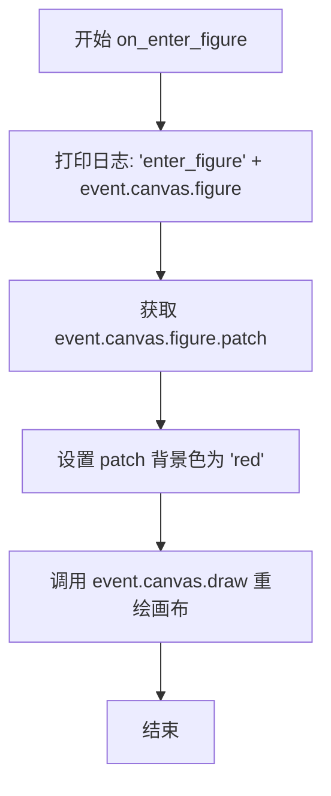
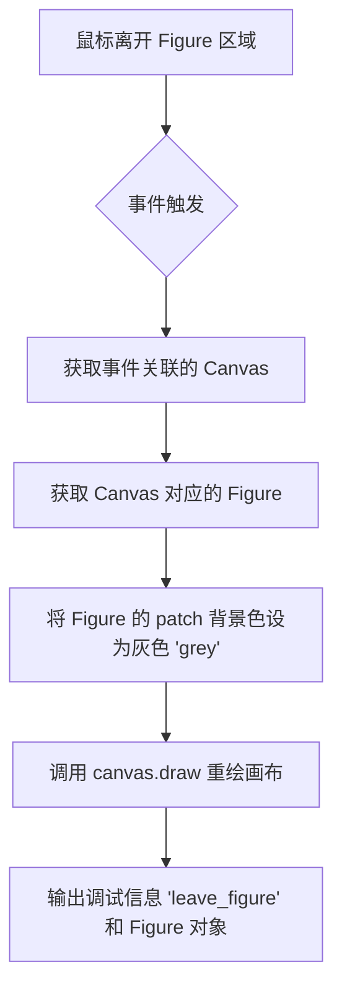

# `matplotlib\galleries\examples\event_handling\figure_axes_enter_leave.py` 详细设计文档

该代码演示了 Matplotlib 中 Figure 和 Axes 的鼠标进入和离开事件，通过绑定事件处理函数来动态改变 Figure 和 Axes 的背景颜色，从而提供视觉反馈。

## 整体流程

```mermaid
graph TD
    A[开始] --> B[导入 matplotlib.pyplot]
    B --> C[定义 on_enter_axes 函数]
    C --> D[定义 on_leave_axes 函数]
    D --> E[定义 on_enter_figure 函数]
    E --> F[定义 on_leave_figure 函数]
    F --> G[创建 Figure 和 Axes 子图]
    G --> H[设置 Figure 标题]
    H --> I[连接 figure_enter_event 事件]
    I --> J[连接 figure_leave_event 事件]
    J --> K[连接 axes_enter_event 事件]
    K --> L[连接 axes_leave_event 事件]
    L --> M[调用 plt.show() 显示图形]
    M --> N{等待事件触发}
    N --> O[鼠标进入 Figure 时触发 on_enter_figure]
    N --> P[鼠标离开 Figure 时触发 on_leave_figure]
    N --> Q[鼠标进入 Axes 时触发 on_enter_axes]
    N --> R[鼠标离开 Axes 时触发 on_leave_axes]
```

## 类结构

```
该代码不包含类定义，仅包含全局函数和模块级变量
无类层次结构
```

## 全局变量及字段


### `fig`
    
当前创建的 Figure 对象，用于显示图形和连接事件处理器

类型：`matplotlib.figure.Figure`
    


### `axs`
    
创建的 Axes 对象数组，包含图形中的坐标轴

类型：`numpy.ndarray 或 axes.Axes`
    


### `on_enter_axes`
    
处理鼠标进入 Axes 区域事件的回调函数，将 Axes 背景色改为黄色

类型：`function`
    


### `on_leave_axes`
    
处理鼠标离开 Axes 区域事件的回调函数，将 Axes 背景色改回白色

类型：`function`
    


### `on_enter_figure`
    
处理鼠标进入 Figure 区域事件的回调函数，将 Figure 背景色改为红色

类型：`function`
    


### `on_leave_figure`
    
处理鼠标离开 Figure 区域事件的回调函数，将 Figure 背景色改为灰色

类型：`function`
    


    

## 全局函数及方法


### `on_enter_axes`

处理鼠标进入 Axes 事件，当鼠标光标进入某个 Axes 区域时，该函数会被触发，将该 Axes 的背景色设置为黄色并重绘画布，同时在控制台打印进入的 Axes 信息。

参数：

- `event`：`matplotlib.backend_bases.MouseEvent`，Matplotlib 的鼠标事件对象，包含触发事件的相关信息，其中 `event.inaxes` 表示鼠标当前所在的 Axes 对象，`event.canvas` 表示触发事件的画布对象

返回值：`None`，该函数没有返回值，仅执行副作用操作（修改 Axes 颜色和重绘画布）

#### 流程图

```mermaid
flowchart TD
    A[开始: 鼠标进入 Axes] --> B[获取事件中的 Axes 对象: event.inaxes]
    B --> C[打印日志: 'enter_axes' + Axes 对象]
    C --> D[设置 Axes 背景色为黄色: patch.set_facecolor('yellow')]
    D --> E[重绘画布: canvas.draw()]
    E --> F[结束]
```

#### 带注释源码

```python
def on_enter_axes(event):
    """
    处理鼠标进入 Axes 事件的回调函数
    
    当鼠标光标进入某个 Axes 区域时，Matplotlib 会调用此函数。
    该函数的主要功能是：
    1. 在控制台打印进入的 Axes 信息，便于调试和观察
    2. 将该 Axes 的背景色设置为黄色，提供视觉反馈
    3. 重绘画布以使颜色变化生效
    
    参数:
        event: Matplotlib 的鼠标事件对象，包含以下关键属性：
            - event.inaxes: 鼠标当前所在的 Axes 对象（axes.Axes 实例）
            - event.canvas: 触发事件的画布对象（FigureCanvasBase 实例）
    
    返回值:
        无返回值（None）
    """
    # 打印事件信息，event.inaxes 是当前鼠标所在的 Axes 对象
    print('enter_axes', event.inaxes)
    
    # 获取 Axes 的 patch（背景）对象并设置背景色为黄色
    # patch 代表 Axes 的背景矩形区域
    event.inaxes.patch.set_facecolor('yellow')
    
    # 重绘画布，使背景色变化立即生效
    # 如果不调用 draw()，颜色变化可能不会立即显示
    event.canvas.draw()
```


### `on_leave_axes`

处理鼠标离开 Axes 事件，将 Axes 背景色设为白色并重绘画布的回调函数。当用户将鼠标光标从某个 Axes 区域移出时，Matplotlib 会自动调用此函数，将该 Axes 的patch（背景）颜色恢复为默认的白色，并通过 canvas.draw() 刷新显示。

参数：

- `event`：`matplotlib.backend_bases.MouseEvent`，鼠标事件对象，包含触发事件时的相关信息，其中 `event.inaxes` 表示鼠标离开的 Axes 对象，`event.canvas` 表示对应的画布对象

返回值：`None`，无返回值，仅执行副作用（修改背景色并重绘）

#### 流程图

```mermaid
flowchart TD
    A[开始: 鼠标离开 Axes 事件触发] --> B{检查 event.inaxes 是否存在}
    B -->|是| C[打印日志: 'leave_axes' + Axes 信息]
    C --> D[设置 Axes 背景色为白色: event.inaxes.patch.set_facecolor('white')]
    D --> E[重绘画布: event.canvas.draw]
    E --> F[结束]
    B -->|否| F
```

#### 带注释源码

```python
def on_leave_axes(event):
    """
    处理鼠标离开 Axes 事件的回调函数。
    
    当鼠标光标从某个 Axes 区域移出时，此函数被调用，
    将该 Axes 的背景色恢复为默认的白色。
    
    参数:
        event: matplotlib.backend_bases.MouseEvent 对象
               包含以下关键属性:
               - event.inaxes: 鼠标离开的 Axes 对象
               - event.canvas: 关联的画布对象
    """
    # 打印调试信息，显示事件类型和涉及的 Axes
    print('leave_axes', event.inaxes)
    
    # 获取鼠标所在的 Axes 的 patch（背景）对象，并设置背景色为白色
    # patch 代表 Axes 的背景矩形区域
    event.inaxes.patch.set_facecolor('white')
    
    # 调用画布的 draw 方法刷新显示，使背景色更改立即生效
    event.canvas.draw()
```


### `on_enter_figure`

处理鼠标进入 Figure 事件，当鼠标指针进入 Figure 区域时，将 Figure 的背景颜色设置为红色并重绘画布。

参数：

-  `event`：`matplotlib.backend_bases.Event`，Matplotlib 事件对象，包含触发事件的相关信息（如所属的 canvas 和 figure）

返回值：`None`，无返回值，仅执行副作用操作（修改背景色和重绘）

#### 流程图



#### 带注释源码

```python
def on_enter_figure(event):
    """
    处理鼠标进入 Figure 事件的回调函数。
    
    当鼠标指针进入 Figure 区域时触发此函数，
    将 Figure 背景色改为红色以提供视觉反馈。
    
    参数:
        event: Matplotlib 事件对象，包含 canvas 和 figure 信息
    """
    # 打印调试信息，输出事件类型和进入的 Figure 对象
    print('enter_figure', event.canvas.figure)
    
    # 获取 Figure 的 patch（背景区域）并设置填充颜色为红色
    event.canvas.figure.patch.set_facecolor('red')
    
    # 重绘画布以使背景色更改生效
    event.canvas.draw()
```


### `on_leave_figure`

该函数是 matplotlib 的事件回调处理函数，用于响应鼠标离开 Figure（画布）的事件。当鼠标从 Figure 区域移出时，该函数会将 Figure 的背景色设置为灰色（'grey'），并触发画布重绘以更新界面显示。

参数：

-  `event`：`matplotlib.backend_bases.MouseEvent`，matplotlib 鼠标事件对象，包含触发事件时的相关信息（如触发事件的画布、坐标等）

返回值：`None`，该函数没有返回值，仅执行副作用（修改背景色和重绘画布）

#### 流程图



#### 带注释源码

```python
def on_leave_figure(event):
    """
    处理鼠标离开 Figure 事件的回调函数。
    
    当鼠标从 Figure 画布区域移出时，此函数会被调用，
    将 Figure 的背景色改为灰色，并重绘画布以更新显示。
    
    参数:
        event: matplotlib.backend_bases.MouseEvent 对象
               包含鼠标事件的详细信息，如触发事件的坐标、
               所在的 axes 以及关联的 canvas 等
    
    返回值:
        None: 此函数没有返回值，仅执行副作用操作
    """
    # 打印调试信息，显示事件类型和对应的 Figure 对象
    print('leave_figure', event.canvas.figure)
    
    # 获取事件对应的 Figure 对象的 patch（背景）并设置背景色为灰色
    # patch 代表 Figure 的背景矩形区域
    event.canvas.figure.patch.set_facecolor('grey')
    
    # 调用 canvas 的 draw 方法重绘整个画布
    # 这会触发 Figure 的重新渲染，使背景色变化生效
    event.canvas.draw()
```

## 关键组件


### 事件处理系统 (Event Handling System)

Matplotlib 的事件处理机制，通过 mpl_connect 方法将事件名称与回调函数绑定，实现对鼠标悬停在 Figure 或 Axes 上时触发相应事件的功能。

### Figure 对象 (Figure Object)

Matplotlib 的顶层容器对象，表示整个图形窗口，包含一个 canvas 和一个 patch（背景），可以通过 patch.set_facecolor() 方法改变背景颜色。

### Axes 对象 (Axes Object)

Matplotlib 的子图区域对象，每个子图都有自己的 patch（背景），可以独立设置颜色，event.inaxes 属性返回当前鼠标所在的 Axes 对象。

### Canvas 渲染系统 (Canvas Rendering System)

Matplotlib 的画布对象，负责图形的实际绘制，通过 canvas.draw() 方法触发重绘，通过 mpl_connect 方法注册事件监听器。

### 事件回调函数 (Event Callback Functions)

四个独立的回调函数分别处理 axes_enter、axes_leave、figure_enter、figure_leave 事件，实现视觉反馈（颜色变化）并触发画布重绘。

### 事件对象 (Event Object)

Matplotlib 传递的事件对象，包含 event.inaxes（当前所在的 Axes）、event.canvas（触发事件的画布）、event.canvas.figure（所属 Figure）等属性，供回调函数使用。


## 问题及建议


### 已知问题

- **缺少空值检查**：在`on_enter_axes`和`on_leave_axes`函数中，未检查`event.inaxes`是否为`None`，可能在某些边缘情况下导致`AttributeError`
- **硬编码的颜色值**：颜色值（'yellow', 'white', 'red', 'grey'）被硬编码在函数中，缺乏可配置性，难以适应主题切换或多颜色方案需求
- **缺少原始状态保存**：离开事件时固定恢复为'white'/'grey'，没有保存进入前的原始颜色状态，可能导致颜色丢失
- **使用print调试**：使用`print`语句输出调试信息，不适合生产环境，应使用日志框架
- **重复代码模式**：每个事件处理函数都包含`event.canvas.draw()`调用，代码重复，可提取为公共函数
- **事件名称使用字符串字面量**：事件名称如'figure_enter_event'使用字符串，容易产生拼写错误，缺乏IDE类型检查支持
- **缺乏异常处理**：没有try-except保护，可能在事件触发时因未知异常导致程序崩溃
- **频繁重绘性能问题**：每次进入/离开都调用`event.canvas.draw()`，在快速鼠标移动时可能造成性能问题
- **无资源清理**：程序退出时没有显式断开事件连接或清理资源
- **可扩展性差**：所有逻辑直接写在全局作用域，难以复用为通用组件

### 优化建议

- 添加`event.inaxes is not None`的检查，防止空引用异常
- 将颜色配置提取为模块级常量或配置字典，便于维护和修改
- 在进入事件时保存原始颜色到事件对象的属性中，离开时恢复
- 替换print语句为`logging`模块的标准日志记录
- 抽取公共逻辑（如重绘操作）到辅助函数，减少重复
- 使用Matplotlib常量或枚举替代字符串字面量（如`matplotlib.backend_bases.Event`相关常量）
- 添加try-except块包装事件处理逻辑，保证程序稳定性
- 考虑使用`fig.canvas.draw_idle()`替代`draw()`，或在一定时间间隔内批量更新
- 使用`atexit`或上下文管理器确保资源清理
- 将功能封装为可复用的类，提供配置接口和事件回调注册机制


## 其它


### 设计目标与约束

本示例旨在演示Matplotlib中Figure和Axes的鼠标进入和离开事件的交互功能，通过颜色变化提供直观的视觉反馈。设计约束包括：仅在交互式后端生效，静态文档中无法展示动态效果，依赖Matplotlib的GUI事件循环。

### 错误处理与异常设计

代码未显式实现错误处理机制。潜在的异常场景包括：event.inaxes为None时的访问、canvas.draw()调用失败、事件回调中的异常不会中断主事件循环但会阻止后续回调执行。建议添加null检查和try-except包装。

### 数据流与状态机

数据流为：用户鼠标移动 → Matplotlib事件系统捕获 → 触发相应回调函数 → 修改patch的facecolor属性 → 调用canvas.draw()重绘。状态机包含：初始状态（默认颜色）→ 进入状态（高亮颜色）→ 离开状态（恢复默认颜色），Figure和Axes各自维护独立的状态。

### 外部依赖与接口契约

主要依赖：matplotlib.pyplot模块。接口契约：回调函数必须接收matplotlib.backend_bases.Event对象作为参数，event.inaxes返回Axes对象或None，event.canvas返回Canvas对象，event.canvas.figure返回Figure对象。

### 性能考虑

每次颜色变化都调用canvas.draw()进行全图重绘，在复杂图表中可能导致性能问题。优化方向：使用FigureCanvasBase.stale_callback判断是否需要重绘，或使用set_animated(True)结合blitting技术优化重绘性能。

### 兼容性考虑

代码依赖于交互式后端（Qt、Tkinter、GTK等），在Agg等非交互式后端上事件不会触发。不同操作系统和Matplotlib版本可能存在事件触发时机和坐标系的细微差异。

### 测试考虑

由于依赖GUI事件循环，自动化测试较为困难。可采用：mock Event对象进行单元测试、使用matplotlib.testing中的测试工具、验证patch属性变化而非视觉输出。

### 资源管理

未涉及外部资源申请。Canvas对象由plt.subplots()创建，plt.show()阻塞运行，关闭图形窗口后资源自动释放。无内存泄漏风险。

### 可扩展性

当前实现直接修改facecolor，可扩展为：支持自定义颜色配置、支持动画过渡效果、支持多Figure联动响应、抽取为可复用的AxesEventHandler类。

    