# `matplotlib\galleries\examples\event_handling\ginput_manual_clabel_sgskip.py` 详细设计文档

This code provides interactive examples using Matplotlib, including defining a triangle by clicking points, contour plotting, and nested zooming.

## 整体流程

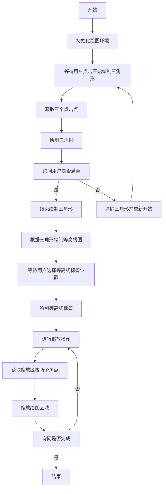

## 类结构

```
matplotlib.pyplot (全局模块)
├── tellme(s: str) (全局函数)
│   ├── 打印信息
│   ├── 设置标题
│   └── 绘制图形
├── np (全局模块)
│   ├── np.asarray(arr: list) (全局函数)
│   ├── np.zeros_like(arr: np.ndarray) (全局函数)
│   ├── np.sqrt(x: float) (全局函数)
│   └── np.meshgrid(x: np.ndarray, y: np.ndarray) (全局函数)
└── main (全局函数)
    ├── 初始化绘图环境
    ├── 获取用户点击点绘制三角形
    ├── 绘制等高线图
    ├── 进行缩放操作
    └── 显示图形
```

## 全局变量及字段


### `plt`
    
Matplotlib's pyplot module for plotting and visualizing data.

类型：`module`
    


### `np`
    
NumPy module for numerical operations.

类型：`module`
    


### `time`
    
Python's time module for time-related functions.

类型：`module`
    


### `plt.figure`
    
Create a new figure.

类型：`function`
    


### `plt.xlim`
    
Set the x-axis limits of the current axes.

类型：`function`
    


### `plt.ylim`
    
Set the y-axis limits of the current axes.

类型：`function`
    


### `plt.title`
    
Set the title of the current axes.

类型：`function`
    


### `plt.draw`
    
Redraw the current figure.

类型：`function`
    


### `plt.waitforbuttonpress`
    
Wait for a button press event.

类型：`function`
    


### `plt.ginput`
    
Get input from the mouse or keyboard.

类型：`function`
    


### `plt.fill`
    
Fill the area between the specified edges with a specified color.

类型：`function`
    


### `plt.contour`
    
Plot contour lines of a 2D field.

类型：`function`
    


### `plt.clabel`
    
Label the contours of a plot.

类型：`function`
    


### `plt.show`
    
Display a figure.

类型：`function`
    


### `time.sleep`
    
Pause the program for a specified number of seconds.

类型：`function`
    


    

## 全局函数及方法


### tellme(s)

显示给定的字符串作为标题，并在matplotlib图形上绘制。

参数：

- `s`：`str`，要显示的字符串。

返回值：`None`，没有返回值。

#### 流程图

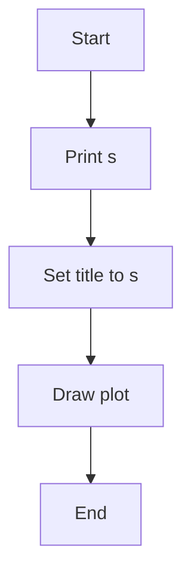

#### 带注释源码

```python
def tellme(s):
    print(s)  # 打印字符串
    plt.title(s, fontsize=16)  # 设置matplotlib图形的标题
    plt.draw()  # 绘制图形
```


### tellme(s)

打印并显示给定的字符串作为标题。

参数：

- `s`：`str`，要打印和显示的字符串。

返回值：无

#### 流程图

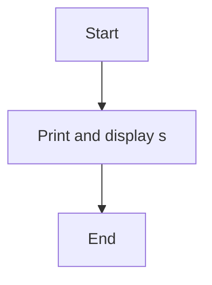

#### 带注释源码

```python
def tellme(s):
    print(s)
    plt.title(s, fontsize=16)
    plt.draw()
```

### plt.waitforbuttonpress()

等待用户按下鼠标按钮。

参数：无

返回值：`bool`，如果用户按下了鼠标按钮，则返回 `True`，否则返回 `False`。

#### 流程图

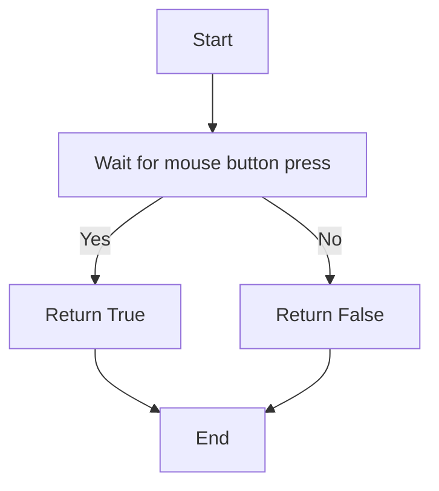

#### 带注释源码

```python
plt.waitforbuttonpress()
```

### plt.ginput(n, timeout=-1)

等待用户输入指定数量的点。

参数：

- `n`：`int`，要输入的点数。
- `timeout`：`float`，等待输入的超时时间（秒），默认为 `-1`，表示无限等待。

返回值：`list`，包含用户输入的点的坐标列表。

#### 流程图

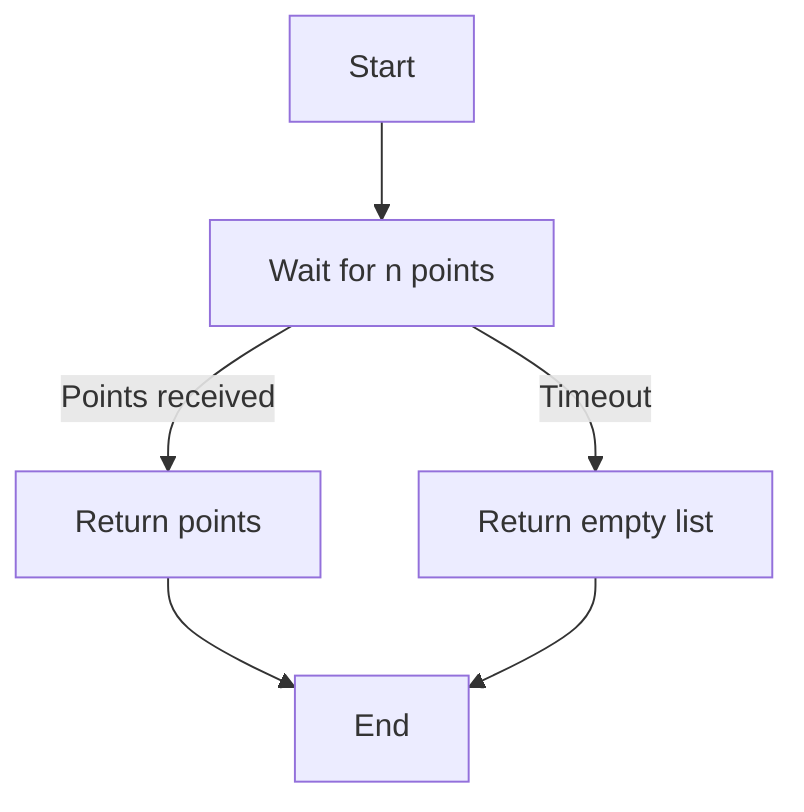

#### 带注释源码

```python
plt.ginput(3, timeout=-1)
```

### plt.fill(x, y, color, lw=None)

填充由坐标列表 `x` 和 `y` 定义的闭合多边形。

参数：

- `x`：`array_like`，多边形的 x 坐标。
- `y`：`array_like`，多边形的 y 坐标。
- `color`：`color`，填充颜色。
- `lw`：`float`，边框宽度，默认为 `None`。

返回值：`Line2D` 对象列表。

#### 流程图

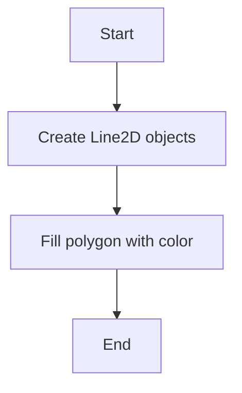

#### 带注释源码

```python
ph = plt.fill(pts[:, 0], pts[:, 1], 'r', lw=2)
```

### np.sqrt(x)

计算 x 的平方根。

参数：`x`：`array_like`，要计算平方根的值。

返回值：`array_like`，x 的平方根。

#### 流程图

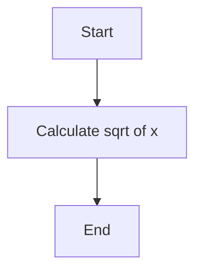

#### 带注释源码

```python
np.sqrt((x - p[0])**2 + (y - p[1])**2)
```

### plt.contour(X, Y, Z, N)

绘制等高线。

参数：

- `X`：`array_like`，x 坐标网格。
- `Y`：`array_like`，y 坐标网格。
- `Z`：`array_like`，要绘制等高线的值。
- `N`：`int`，等高线的数量。

返回值：`ContourSet` 对象。

#### 流程图

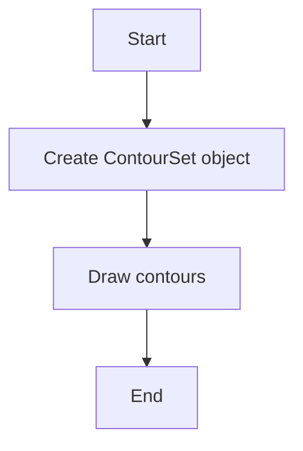

#### 带注释源码

```python
CS = plt.contour(X, Y, Z, 20)
```

### plt.clabel(CS, manual=True)

为等高线添加标签。

参数：

- `CS`：`ContourSet` 对象，要添加标签的等高线集。
- `manual`：`bool`，如果为 `True`，则允许用户手动选择标签位置。

返回值：`list`，包含标签对象的列表。

#### 流程图

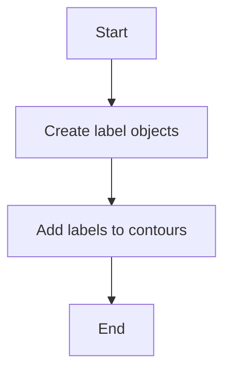

#### 带注释源码

```python
CL = plt.clabel(CS, manual=True)
```

### plt.xlim(xmin, xmax)

设置 x 轴的显示范围。

参数：

- `xmin`：`float`，x 轴的最小值。
- `xmax`：`float`，x 轴的最大值。

#### 流程图

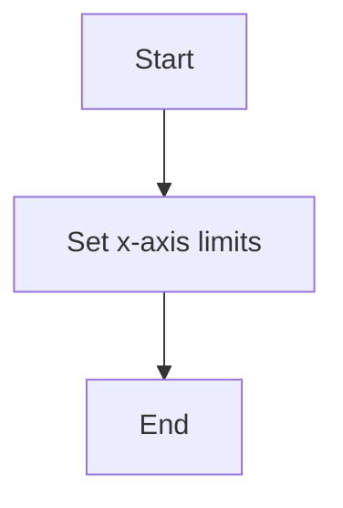

#### 带注释源码

```python
plt.xlim(xmin, xmax)
```

### plt.ylim(ymin, ymax)

设置 y 轴的显示范围。

参数：

- `ymin`：`float`，y 轴的最小值。
- `ymax`：`float`，y 轴的最大值。

#### 流程图


#### 带注释源码

```python
plt.ylim(ymin, ymax)
```

### plt.show()

显示图形。

参数：无

#### 流程图

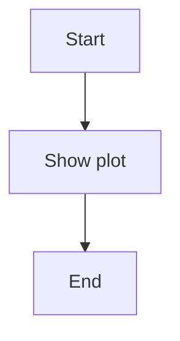

#### 带注释源码

```python
plt.show()
```


### plt.figure()

创建一个新的图形窗口。

参数：

- 无

返回值：`Figure`，表示创建的新图形窗口。

#### 流程图

```mermaid
graph LR
A[Start] --> B{plt.figure()}
B --> C[End]
```

#### 带注释源码

```python
plt.figure()
```


### plt.xlim(xmin, xmax)

设置当前图形的x轴限制。

参数：

- xmin：`float`，x轴的最小值。
- xmax：`float`，x轴的最大值。

返回值：无

#### 流程图

```mermaid
graph LR
A[Start] --> B{plt.xlim(xmin, xmax)}
B --> C[End]
```

#### 带注释源码

```python
plt.xlim(xmin, xmax)
```


### plt.ylim(ymin, ymax)

设置当前图形的y轴限制。

参数：

- ymin：`float`，y轴的最小值。
- ymax：`float`，y轴的最大值。

返回值：无

#### 流程图

```mermaid
graph LR
A[Start] --> B{plt.ylim(ymin, ymax)}
B --> C[End]
```

#### 带注释源码

```python
plt.ylim(ymin, ymax)
```


### plt.waitforbuttonpress()

等待用户按下鼠标按钮。

参数：

- 无

返回值：`bool`，如果用户按下了鼠标按钮，则返回`True`，否则返回`False`。

#### 流程图

```mermaid
graph LR
A[Start] --> B{plt.waitforbuttonpress()}
B --> C{bool}
C --> D[End]
```

#### 带注释源码

```python
plt.waitforbuttonpress()
```


### plt.ginput(n, timeout=-1)

等待用户输入鼠标点击。

参数：

- n：`int`，需要等待的点击次数。
- timeout：`float`，等待时间（秒），如果为负，则无限等待。

返回值：`ndarray`，包含用户点击位置的数组。

#### 流程图

```mermaid
graph LR
A[Start] --> B{plt.ginput(n, timeout=-1)}
B --> C{ndarray}
C --> D[End]
```

#### 带注释源码

```python
plt.ginput(3, timeout=-1)
```


### plt.fill(x, y, color, lw=None)

填充多边形。

参数：

- x：`array_like`，多边形的x坐标。
- y：`array_like`，多边形的y坐标。
- color：`color`，填充颜色。
- lw：`float`，边框宽度。

返回值：`Patch`，表示填充的多边形。

#### 流程图

```mermaid
graph LR
A[Start] --> B{plt.fill(x, y, color, lw=None)}
B --> C{Patch}
C --> D[End]
```

#### 带注释源码

```python
ph = plt.fill(pts[:, 0], pts[:, 1], 'r', lw=2)
```


### plt.clabel(CS, manual=True)

为等高线图添加标签。

参数：

- CS：`ContourSet`，等高线集。
- manual：`bool`，是否手动指定标签位置。

返回值：`list`，包含标签的列表。

#### 流程图

```mermaid
graph LR
A[Start] --> B{plt.clabel(CS, manual=True)}
B --> C{list}
C --> D[End]
```

#### 带注释源码

```python
CL = plt.clabel(CS, manual=True)
```


### plt.show()

显示图形。

参数：

- 无

返回值：无

#### 流程图

```mermaid
graph LR
A[Start] --> B{plt.show()}
B --> C[End]
```

#### 带注释源码

```python
plt.show()
```


### plt.xlim

`plt.xlim` 是 `matplotlib.pyplot` 模块中的一个函数，用于设置当前轴的 x 轴限制。

#### 描述

该函数接受两个参数，用于设置 x 轴的最小值和最大值。

#### 参数

- `xmin`：`float`，x 轴的最小值。
- `xmax`：`float`，x 轴的最大值。

#### 返回值

无返回值。

#### 流程图

```mermaid
graph LR
A[Start] --> B{Set xmin and xmax}
B --> C[End]
```

#### 带注释源码

```python
plt.xlim(0, 1)
```

该行代码设置了当前轴的 x 轴限制为从 0 到 1。


### plt.ylim

`plt.ylim` 是 `matplotlib.pyplot` 模块中的一个函数，用于设置当前轴的 y 轴限制。

#### 描述

`plt.ylim` 用于设置当前轴的 y 轴限制，即 y 轴的最小值和最大值。

#### 参数

- `*args`：`float` 或 `tuple`，y 轴的最小值和最大值。可以是一个值，也可以是一个包含两个值的元组。

#### 返回值

无返回值。

#### 流程图

```mermaid
graph LR
A[Set Y-axis Limits] --> B{Are the arguments a single value or a tuple?}
B -- Yes --> C[Set the y-axis limits to the single value]
B -- No --> D[Set the y-axis limits to the tuple values]
C --> E[No further action]
D --> E
```

#### 带注释源码

```python
# Set the y-axis limits to a single value
plt.ylim(0)

# Set the y-axis limits to a tuple of values
plt.ylim(0, 1)
```


### plt.xlim

`plt.xlim` 是 `matplotlib.pyplot` 模块中的一个函数，用于设置当前轴的 x 轴限制。

#### 描述

`plt.xlim` 用于设置当前轴的 x 轴限制，即 x 轴的最小值和最大值。

#### 参数

- `*args`：`float` 或 `tuple`，x 轴的最小值和最大值。可以是一个值，也可以是一个包含两个值的元组。

#### 返回值

无返回值。

#### 流程图

```mermaid
graph LR
A[Set X-axis Limits] --> B{Are the arguments a single value or a tuple?}
B -- Yes --> C[Set the x-axis limits to the single value]
B -- No --> D[Set the x-axis limits to the tuple values]
C --> E[No further action]
D --> E
```

#### 带注释源码

```python
# Set the x-axis limits to a single value
plt.xlim(0)

# Set the x-axis limits to a tuple of values
plt.xlim(0, 1)
```


### plt.waitforbuttonpress

`plt.waitforbuttonpress` 是 `matplotlib.pyplot` 模块中的一个函数，用于等待用户按下鼠标按钮。

#### 描述

`plt.waitforbuttonpress` 函数会暂停当前的事件循环，直到用户按下鼠标按钮。如果用户在指定的时间内没有按下鼠标按钮，则返回 `False`。

#### 参数

- `timeout`：`int` 或 `float`，等待用户按下鼠标按钮的时间（秒）。默认值为 `-1`，表示无限等待。

#### 返回值

- `bool`：如果用户在指定的时间内按下了鼠标按钮，则返回 `True`，否则返回 `False`。

#### 流程图

```mermaid
graph LR
A[Wait for Button Press] --> B{Is timeout specified?}
B -- Yes --> C[Wait for specified timeout]
B -- No --> D[Wait indefinitely]
C --> E{Did user press the button?}
E -- Yes --> F[Return True]
E -- No --> G[Return False]
D --> H{Did user press the button?}
H -- Yes --> I[Return True]
H -- No --> J[Return False]
```

#### 带注释源码

```python
# Wait for the user to press the mouse button
if plt.waitforbuttonpress(timeout=5):
    print("Button pressed")
else:
    print("No button pressed")
```


### plt.ginput

`plt.ginput` 是 `matplotlib.pyplot` 模块中的一个函数，用于从用户获取鼠标点击的位置。

#### 描述

`plt.ginput` 函数会暂停当前的事件循环，直到用户点击鼠标按钮。每次点击都会返回一个包含点击位置的元组。

#### 参数

- `numclicks`：`int`，期望获取的点击次数。默认值为 `1`。
- `timeout`：`int` 或 `float`，等待用户点击鼠标按钮的时间（秒）。默认值为 `-1`，表示无限等待。

#### 返回值

- `list`：包含点击位置的元组的列表。

#### 流程图

```mermaid
graph LR
A[Get Mouse Clicks] --> B{Is timeout specified?}
B -- Yes --> C[Wait for specified timeout]
B -- No --> D[Wait indefinitely]
C --> E{Did user click the mouse?}
E -- Yes --> F[Return the click positions]
E -- No --> G[Return an empty list]
D --> H{Did user click the mouse?}
H -- Yes --> I[Return the click positions]
H -- No --> J[Return an empty list]
```

#### 带注释源码

```python
# Get the click positions from the user
clicks = plt.ginput(3, timeout=-1)
print("Click positions:", clicks)
```


### plt.fill

`plt.fill` 是 `matplotlib.pyplot` 模块中的一个函数，用于在当前轴上绘制填充的多边形。

#### 描述

`plt.fill` 函数用于在当前轴上绘制填充的多边形。多边形的顶点由参数 `pts` 指定。

#### 参数

- `x`：`array_like`，多边形顶点的 x 坐标。
- `y`：`array_like`，多边形顶点的 y 坐标。
- `color`：`color`，多边形的颜色。
- `lw`：`float`，多边形的线宽。

#### 返回值

- `PolyCollection`：包含多边形对象的 `PolyCollection`。

#### 流程图

```mermaid
graph LR
A[Draw Filled Polygon] --> B{Are the x and y coordinates specified?}
B -- Yes --> C[Create a polygon from the coordinates]
B -- No --> D[Return an empty PolyCollection]
C --> E[Draw the polygon with the specified color and line width]
E --> F[Return the PolyCollection]
```

#### 带注释源码

```python
# Create a filled polygon
ph = plt.fill(pts[:, 0], pts[:, 1], 'r', lw=2)
```


### plt.contour

`plt.contour` 是 `matplotlib.pyplot` 模块中的一个函数，用于绘制等高线。

#### 描述

`plt.contour` 函数用于绘制等高线。等高线是连接具有相同值的点的线。

#### 参数

- `x`：`array_like`，x 坐标网格。
- `y`：`array_like`，y 坐标网格。
- `z`：`array_like`，z 坐标网格。
- `levels`：`int` 或 `sequence`，等高线的数量或等高线的值。

#### 返回值

- `ContourSet`：包含等高线对象的 `ContourSet`。

#### 流程图

```mermaid
graph LR
A[Draw Contour] --> B{Is the z array specified?}
B -- Yes --> C[Create a contour set from the x, y, and z arrays]
B -- No --> D[Return an empty ContourSet]
C --> E[Draw the contour set with the specified levels]
E --> F[Return the ContourSet]
```

#### 带注释源码

```python
# Create a contour set
CS = plt.contour(X, Y, Z, 20)
```


### plt.clabel

`plt.clabel` 是 `matplotlib.pyplot` 模块中的一个函数，用于在等高线上添加标签。

#### 描述

`plt.clabel` 函数用于在等高线上添加标签。标签的位置由参数 `manual` 指定。

#### 参数

- `contour_set`：`ContourSet`，包含等高线对象的 `ContourSet`。
- `manual`：`bool`，如果为 `True`，则手动指定标签的位置。

#### 返回值

- `list`：包含标签对象的列表。

#### 流程图

```mermaid
graph LR
A[Label Contour] --> B{Is manual labeling specified?}
B -- Yes --> C[Manually place the labels on the contours]
B -- No --> D[Automatically place the labels on the contours]
C --> E[Return the list of label objects]
D --> E
```

#### 带注释源码

```python
# Add labels to the contour set
CL = plt.clabel(CS, manual=True)
```


### plt.show

`plt.show` 是 `matplotlib.pyplot` 模块中的一个函数，用于显示图形。

#### 描述

`plt.show` 函数用于显示图形。如果图形已经显示，则刷新图形。

#### 参数

无参数。

#### 返回值

无返回值。

#### 流程图

```mermaid
graph LR
A[Show Plot] --> B[Display the plot]
```

#### 带注释源码

```python
# Show the plot
plt.show()
```


### matplotlib.pyplot.title

matplotlib.pyplot.title 是一个用于设置当前轴标题的函数。

参数：

- `s`：`str`，要设置的标题文本。

返回值：`None`，没有返回值。

#### 流程图

```mermaid
graph LR
A[Start] --> B{Is s a string?}
B -- Yes --> C[Set title to s]
B -- No --> D[Error: s must be a string]
C --> E[End]
D --> E
```

#### 带注释源码

```python
# tellme function
def tellme(s):
    print(s)  # 打印文本
    plt.title(s, fontsize=16)  # 设置标题
    plt.draw()  # 绘制当前图形
```


### tellme(s)

打印并显示给定字符串的标题，并调用 `plt.draw()` 来更新图形。

参数：

- `s`：`str`，要打印和显示的字符串。

返回值：无

#### 流程图

```mermaid
graph TD
    A[Start] --> B[Print and display title]
    B --> C[Call plt.draw()]
    C --> D[End]
```

#### 带注释源码

```python
def tellme(s):
    print(s)  # 打印字符串
    plt.title(s, fontsize=16)  # 显示标题
    plt.draw()  # 更新图形
```


### matplotlib.pyplot.waitforbuttonpress()

等待用户按下鼠标按钮或按下指定的键。

#### 描述

`waitforbuttonpress()` 函数用于等待用户在图形界面中按下鼠标按钮或按下指定的键。当用户进行操作时，函数返回 `True`，否则返回 `False`。

#### 参数

- 无

#### 返回值

- `bool`：如果用户进行了操作，则返回 `True`，否则返回 `False`。

#### 流程图

```mermaid
graph LR
A[开始] --> B{等待用户操作}
B -->|用户操作| C[返回 True]
B -->|无操作| D[返回 False]
C --> E[结束]
D --> E
```

#### 带注释源码

```python
if plt.waitforbuttonpress():
    break
```

在这个例子中，`waitforbuttonpress()` 被用来等待用户点击鼠标按钮以确认三角形的定义。如果用户点击鼠标，函数返回 `True`，循环结束，否则循环继续等待用户操作。


### matplotlib.pyplot.ginput

matplotlib.pyplot.ginput 是一个用于获取用户输入的函数，它允许用户通过鼠标点击来选择点或区域。

参数：

- `n`：`int`，指定要获取的点的数量。默认值为 1。
- `timeout`：`float`，指定等待用户输入的超时时间（以秒为单位）。默认值为 -1，表示无限期等待。

返回值：`list`，包含用户通过鼠标点击选择的点的坐标列表。

#### 流程图

```mermaid
graph LR
A[开始] --> B{等待用户输入}
B --> C{用户点击}
C --> D[获取点击位置]
D --> E[返回点击位置]
E --> F[结束]
```

#### 带注释源码

```python
# 获取用户输入的三个点来定义三角形
pts = np.asarray(plt.ginput(3, timeout=-1))
```

在这个例子中，`plt.ginput(3, timeout=-1)` 被用来获取用户通过鼠标点击定义三角形的三个顶点。`timeout=-1` 表示无限期等待用户输入，直到用户点击鼠标。`np.asarray` 用于将返回的点的坐标列表转换为 NumPy 数组。


### matplotlib.pyplot.fill

matplotlib.pyplot.fill 是一个用于绘制填充多边形的函数。

参数：

- `x`：`numpy.ndarray`，多边形顶点的 x 坐标数组。
- `y`：`numpy.ndarray`，多边形顶点的 y 坐标数组。
- `color`：`str` 或 `tuple`，填充颜色。
- `lw`：`float`，边框宽度。

返回值：`matplotlib.patches.Polygon`，绘制的多边形对象。

#### 流程图

```mermaid
graph LR
A[开始] --> B{调用 plt.fill}
B --> C[绘制多边形]
C --> D[返回 Polygon 对象]
D --> E[结束]
```

#### 带注释源码

```python
ph = plt.fill(pts[:, 0], pts[:, 1], 'r', lw=2)
```

在这段代码中，`plt.fill(pts[:, 0], pts[:, 1], 'r', lw=2)` 调用 `plt.fill` 函数，使用红色 (`'r'`) 和宽度为 2 的边框 (`lw=2`) 来绘制一个由 `pts[:, 0]` 和 `pts[:, 1]` 定义的三角形。


### matplotlib.pyplot.contour

matplotlib.pyplot.contour 是一个用于绘制等高线的函数。

参数：

- `X`：`numpy.ndarray`，X轴的网格数据。
- `Y`：`numpy.ndarray`，Y轴的网格数据。
- `Z`：`numpy.ndarray`，Z轴的数据，通常是二维的。
- `levels`：`int` 或 `sequence`，等高线的数量或等高线值。
- `colors`：`str` 或 `sequence`，等高线的颜色。
- `linestyles`：`str` 或 `sequence`，等高线的线型。
- `linewidths`：`float` 或 `sequence`，等高线的线宽。
- `alpha`：`float`，等高线的透明度。
- `extend`：`str`，等高线的延伸方式。

返回值：`ContourSet`，等高线集合对象。

#### 流程图

```mermaid
graph LR
A[Start] --> B{Call matplotlib.pyplot.contour}
B --> C[End]
```

#### 带注释源码

```python
# 在代码中找到以下行
CS = plt.contour(X, Y, Z, 20)
```

这段代码使用 `plt.contour` 函数绘制了等高线，其中 `X` 和 `Y` 是网格数据，`Z` 是数据值，`20` 是等高线的数量。


### matplotlib.pyplot.clabel

`clabel` is a method of the `matplotlib.pyplot` module that labels the contours of a plot.

参数：

- `contour`: `ContourSet`，The contour set to label.
- `manual`: `bool`，If True, use the manual locations provided by the `manual` keyword argument of `contour`.
- `inline`: `bool`，If True, place the labels inside the contour.
- `fontsize`: `float`，The size of the font used for the labels.
- `labelstyle`: `LabelStyle`，The style of the label.
- `colors`: `str` or `list` of `str`，The color of the labels.
- `bbox`: `Bbox`，The bounding box for the labels.
- `bbox pad`: `float`，The padding around the bounding box.
- `horizontalalignment`: `str`，The horizontal alignment of the label.
- `verticalalignment`: `str`，The vertical alignment of the label.
- `use_clabeltext`: `bool`，If True, use the text from the `label` attribute of the contour line.

返回值：`list` of `Text`，The list of label text objects.

#### 流程图

```mermaid
graph LR
A[Start] --> B{Is manual?}
B -- Yes --> C[Get manual locations]
B -- No --> D[Get automatic locations]
C --> E[Create labels]
D --> E
E --> F[Place labels]
F --> G[End]
```

#### 带注释源码

```python
CL = plt.clabel(CS, manual=True)
```

This line of code creates labels for the contours defined by `CS` using manual locations provided by the user.


### plt.show()

显示当前图形的窗口。

参数：

- 无

返回值：无

#### 流程图

```mermaid
graph LR
A[开始] --> B{调用plt.show()}
B --> C[结束]
```

#### 带注释源码

```python
plt.show()
```


### tellme(s)

显示给定的字符串，并将其作为图形的标题。

参数：

- `s`：`str`，要显示的字符串。

返回值：无

#### 流程图

```mermaid
graph LR
A[开始] --> B{传入参数s}
B --> C[打印s]
C --> D[设置plt.title(s, fontsize=16)]
D --> E[调用plt.draw()]
E --> F[结束]
```

#### 带注释源码

```python
def tellme(s):
    print(s)
    plt.title(s, fontsize=16)
    plt.draw()
```


### plt.waitforbuttonpress()

等待用户按下鼠标按钮。

参数：

- 无

返回值：`bool`，如果用户按下了鼠标按钮，则为 `True`，否则为 `False`。

#### 流程图

```mermaid
graph LR
A[开始] --> B{等待鼠标按钮按下}
B --> C{返回True或False}
C --> D[结束]
```

#### 带注释源码

```python
plt.waitforbuttonpress()
```


### plt.ginput(n, timeout=-1)

等待用户输入指定数量的点。

参数：

- `n`：`int`，要输入的点数。
- `timeout`：`float`，等待时间（秒），默认为 `-1`，表示无限等待。

返回值：`np.ndarray`，包含用户输入的点的数组。

#### 流程图

```mermaid
graph LR
A[开始] --> B{等待用户输入n个点}
B --> C[返回点的数组]
C --> D[结束]
```

#### 带注释源码

```python
plt.ginput(3, timeout=-1)
```


### plt.fill(x, y, color, lw=None)

填充由点数组定义的多边形。

参数：

- `x`：`np.ndarray`，多边形顶点的 x 坐标。
- `y`：`np.ndarray`，多边形顶点的 y 坐标。
- `color`：`str`，多边形的颜色。
- `lw`：`float`，多边形的线宽，默认为 `None`。

返回值：`matplotlib.patches.Polygon`，填充的多边形对象。

#### 流程图

```mermaid
graph LR
A[开始] --> B{传入多边形顶点坐标和颜色}
B --> C[创建多边形对象]
C --> D[返回多边形对象]
D --> E[结束]
```

#### 带注释源码

```python
ph = plt.fill(pts[:, 0], pts[:, 1], 'r', lw=2)
```


### plt.contour(X, Y, Z, N)

绘制等高线。

参数：

- `X`：`np.ndarray`，x 坐标网格。
- `Y`：`np.ndarray`，y 坐标网格。
- `Z`：`np.ndarray`，z 坐标网格。
- `N`：`int`，等高线的数量。

返回值：`matplotlib.contourset.ContourSet`，等高线集合对象。

#### 流程图

```mermaid
graph LR
A[开始] --> B{传入网格坐标和等高线数量}
B --> C[创建等高线集合对象]
C --> D[返回等高线集合对象]
D --> E[结束]
```

#### 带注释源码

```python
CS = plt.contour(X, Y, Z, 20)
```


### plt.clabel(CS, manual=True)

为等高线添加标签。

参数：

- `CS`：`matplotlib.contourset.ContourSet`，等高线集合对象。
- `manual`：`bool`，是否手动指定标签位置，默认为 `False`。

返回值：`matplotlib.collections.LineCollection`，标签对象。

#### 流程图

```mermaid
graph LR
A[开始] --> B{传入等高线集合对象和手动指定标签位置}
B --> C[添加标签]
C --> D[返回标签对象]
D --> E[结束]
```

#### 带注释源码

```python
CL = plt.clabel(CS, manual=True)
```


### plt.xlim(xmin, xmax)

设置 x 轴的显示范围。

参数：

- `xmin`：`float`，x 轴的最小值。
- `xmax`：`float`，x 轴的最大值。

返回值：无

#### 流程图

```mermaid
graph LR
A[开始] --> B{设置x轴显示范围}
B --> C[结束]
```

#### 带注释源码

```python
plt.xlim(xmin, xmax)
```


### plt.ylim(ymin, ymax)

设置 y 轴的显示范围。

参数：

- `ymin`：`float`，y 轴的最小值。
- `ymax`：`float`，y 轴的最大值。

返回值：无

#### 流程图

```mermaid
graph LR
A[开始] --> B{设置y轴显示范围}
B --> C[结束]
```

#### 带注释源码

```python
plt.ylim(ymin, ymax)
```


### f(x, y, pts)

计算距离三角形顶点的距离函数。

参数：

- `x`：`np.ndarray`，x 坐标。
- `y`：`np.ndarray`，y 坐标。
- `pts`：`np.ndarray`，三角形顶点的坐标。

返回值：`np.ndarray`，距离函数的值。

#### 流程图

```mermaid
graph LR
A[开始] --> B{传入x, y和三角形顶点坐标}
B --> C{计算距离函数的值}
C --> D[返回距离函数的值]
D --> E[结束]
```

#### 带注释源码

```python
def f(x, y, pts):
    z = np.zeros_like(x)
    for p in pts:
        z = z + 1/(np.sqrt((x - p[0])**2 + (y - p[1])**2))
    return 1/z
```


### X, Y

创建 x 和 y 坐标网格。

参数：

- 无

返回值：`np.ndarray`，x 和 y 坐标网格。

#### 流程图

```mermaid
graph LR
A[开始] --> B{创建x和y坐标网格}
B --> C[返回x和y坐标网格]
C --> D[结束]
```

#### 带注释源码

```python
X, Y = np.meshgrid(np.linspace(-1, 1, 51), np.linspace(-1, 1, 51))
```


### np.asarray

将输入转换为NumPy数组。

参数：

- `a`：`*args`，任意类型的输入，可以是列表、元组、字典、NumPy数组等。
- `dtype`：`{dtype}`，可选，指定输出数组的类型，默认为None，将自动推断类型。

参数描述：

- `a`：输入数据，可以是多种类型。
- `dtype`：输出数组的类型，如果未指定，则自动推断。

返回值：`{dtype}`，NumPy数组。

返回值描述：返回一个NumPy数组，其类型与输入数据类型相同或由`dtype`指定。

#### 流程图

```mermaid
graph LR
A[开始] --> B{输入类型}
B -- 列表/元组 --> C[转换为NumPy数组]
B -- 字典 --> D[转换为NumPy数组]
B -- NumPy数组 --> E[返回原数组]
B -- 其他 --> F[推断类型]
F --> C
C --> G[返回NumPy数组]
G --> H[结束]
```

#### 带注释源码

```python
import numpy as np

def np.asarray(a, dtype=None):
    # 检查输入类型
    if isinstance(a, list) or isinstance(a, tuple):
        # 转换为NumPy数组
        return np.array(a, dtype=dtype)
    elif isinstance(a, dict):
        # 转换为NumPy数组
        return np.array(list(a.items()), dtype=dtype)
    elif isinstance(a, np.ndarray):
        # 返回原数组
        return a
    else:
        # 推断类型
        return np.array(a, dtype=dtype)
```


### np.zeros_like

`np.zeros_like` 是 NumPy 库中的一个函数，用于创建一个与给定数组形状和类型相同的新数组，但所有元素都被初始化为 0。

参数：

- `x`：`{类型}`，输入数组，用于确定新数组的形状和类型。

返回值：`{类型}`，与输入数组形状和类型相同的新数组，所有元素都被初始化为 0。

#### 流程图

```mermaid
graph LR
A[开始] --> B{创建新数组}
B --> C[返回新数组]
C --> D[结束]
```

#### 带注释源码

```python
import numpy as np

def f(x, y, pts):
    z = np.zeros_like(x)  # 创建一个与x形状和类型相同的新数组，所有元素为0
    for p in pts:
        z = z + 1/(np.sqrt((x - p[0])**2 + (y - p[1])**2))
    return 1/z
```


### np.sqrt

计算输入数值的平方根。

参数：

- `x`：`numpy.ndarray` 或 `float`，输入数值或数组，用于计算平方根。

返回值：`numpy.ndarray` 或 `float`，输入数值或数组的平方根。

#### 流程图

```mermaid
graph LR
A[Start] --> B{Is x a numpy.ndarray or float?}
B -- Yes --> C[Calculate sqrt(x)]
B -- No --> D[Error: Invalid input type]
C --> E[End]
D --> E
```

#### 带注释源码

```python
import numpy as np

def np_sqrt(x):
    """
    Calculate the square root of a number or an array of numbers.

    Parameters:
    - x: numpy.ndarray or float, the input number or array to calculate the square root.

    Returns:
    - numpy.ndarray or float, the square root of the input number or array.
    """
    return np.sqrt(x)
```


### np.meshgrid

`np.meshgrid` 是一个 NumPy 函数，用于生成网格数据，它将输入的数组转换为二维网格，用于创建网格点。

参数：

- `x`：`numpy.ndarray`，输入的一维数组。
- `y`：`numpy.ndarray`，输入的一维数组。

参数描述：

- `x`：指定 x 轴上的网格点。
- `y`：指定 y 轴上的网格点。

返回值类型：`tuple`，包含两个 `numpy.ndarray`。

返回值描述：返回两个数组，第一个数组是 x 轴和 y 轴网格点的组合，第二个数组是 y 轴和 x 轴网格点的组合。

#### 流程图

```mermaid
graph LR
A[开始] --> B{输入 x 和 y}
B --> C[创建网格点]
C --> D[返回网格点]
D --> E[结束]
```

#### 带注释源码

```python
import numpy as np

# 定义 x 和 y 的网格点
X, Y = np.meshgrid(np.linspace(-1, 1, 51), np.linspace(-1, 1, 51))

# 使用网格点计算 Z
Z = f(X, Y, pts)
```


### f

`f` 是一个自定义函数，用于计算距离三角形顶点的距离的函数。

参数：

- `x`：`numpy.ndarray`，x 轴上的网格点。
- `y`：`numpy.ndarray`，y 轴上的网格点。
- `pts`：`numpy.ndarray`，三角形顶点的坐标。

参数描述：

- `x`：x 轴上的网格点。
- `y`：y 轴上的网格点。
- `pts`：三角形顶点的坐标。

返回值类型：`numpy.ndarray`。

返回值描述：返回一个与 x 和 y 相同形状的数组，其中包含每个网格点到三角形顶点的距离的倒数。

#### 流程图

```mermaid
graph LR
A[开始] --> B{输入 x, y 和 pts}
B --> C[计算距离]
C --> D[返回距离的倒数]
D --> E[结束]
```

#### 带注释源码

```python
def f(x, y, pts):
    z = np.zeros_like(x)
    for p in pts:
        z = z + 1/(np.sqrt((x - p[0])**2 + (y - p[1])**2))
    return 1/z
```

## 关键组件


### 张量索引与惰性加载

张量索引与惰性加载允许在处理大型数据集时，只计算和存储所需的数据部分，从而提高内存效率和计算速度。

### 反量化支持

反量化支持使得代码能够处理不同量级的数值，提供更广泛的数值范围和精度。

### 量化策略

量化策略用于将浮点数转换为固定点数，以减少计算资源消耗和提高执行速度。


## 问题及建议


### 已知问题

-   {问题1}：代码中使用了 `plt.waitforbuttonpress()` 来等待用户交互，这可能导致自动化测试或脚本执行困难，因为它们无法模拟鼠标点击。
-   {问题2}：代码中使用了 `plt.ginput()` 来获取用户输入，这同样可能导致自动化测试或脚本执行困难。
-   {问题3}：代码中使用了 `plt.clabel()` 的 `manual=True` 参数，这要求用户手动放置标签，这同样不适合自动化测试或脚本执行。
-   {问题4}：代码中使用了 `plt.fill()` 和 `plt.contour()` 来绘制图形，这些操作依赖于图形界面的交互，不适合无界面环境。

### 优化建议

-   {建议1}：将交互式部分改为命令行参数或配置文件，以便自动化测试和脚本执行。
-   {建议2}：提供图形界面的替代方案，例如使用 `matplotlib` 的 `notebook` 模式或 `matplotlib` 的 `agg` 模式，以便在无界面环境中运行。
-   {建议3}：将 `plt.clabel()` 的 `manual=True` 参数改为 `manual=False`，并预先定义标签位置，以便自动化测试和脚本执行。
-   {建议4}：将绘图代码封装成函数，并允许通过参数控制绘图行为，以便在不同的环境中灵活使用。


## 其它


### 设计目标与约束

- 设计目标：实现一个交互式绘图工具，允许用户通过鼠标点击定义三角形，并根据三角形的边界绘制等高线图。
- 约束条件：使用Matplotlib库进行绘图，不使用额外的图形库。

### 错误处理与异常设计

- 错误处理：在用户输入过程中，如果用户未选择足够的点，程序会提示用户重新选择，并等待一秒钟后再次提示。
- 异常设计：程序未使用try-except语句捕获特定异常，但通过检查函数返回值来处理潜在的错误。

### 数据流与状态机

- 数据流：用户通过鼠标点击输入点，这些点被存储在列表中，然后用于绘制三角形和等高线图。
- 状态机：程序包含几个状态，包括等待用户点击开始定义三角形、等待用户选择三角形顶点、等待用户选择等高线标签位置、等待用户选择缩放区域等。

### 外部依赖与接口契约

- 外部依赖：Matplotlib库用于绘图和交互功能。
- 接口契约：函数`tellme`用于显示提示信息并更新绘图窗口，`plt.ginput`用于获取用户输入，`plt.contour`用于绘制等高线图，`plt.clabel`用于添加标签。


    