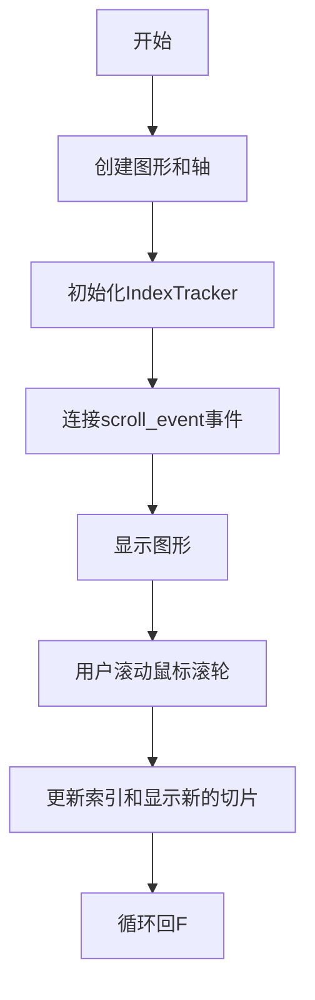
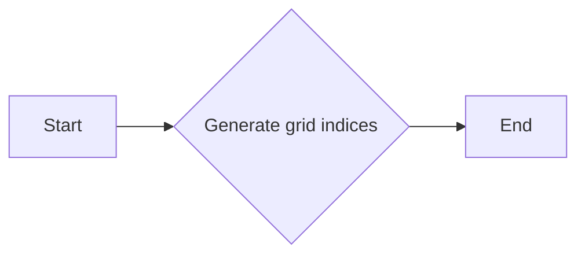
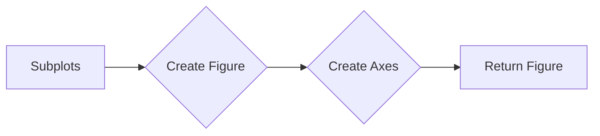
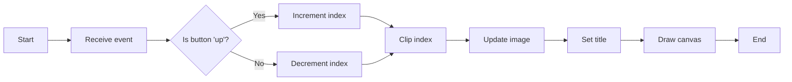
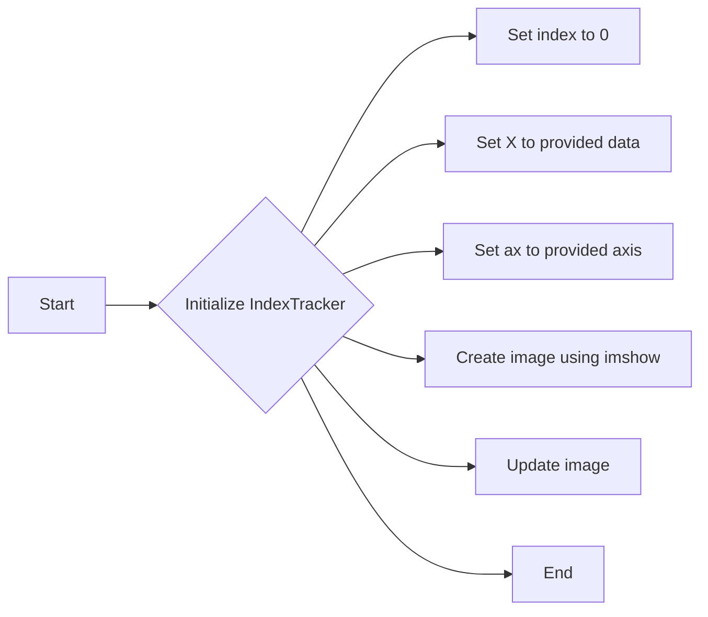
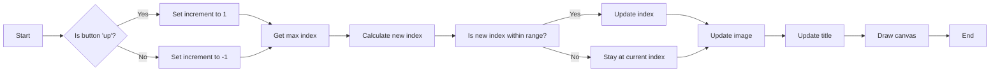
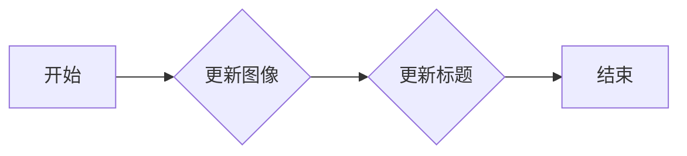

# `matplotlib\galleries\examples\event_handling\image_slices_viewer.py` 详细设计文档

This code allows users to navigate through 2D slices of 3D data using a scroll wheel event in a Matplotlib plot.

## 整体流程



## 类结构

```
IndexTracker (类)
├── matplotlib.pyplot (模块)
│   ├── subplots (函数)
│   └── ...
└── numpy (模块)
    └── ogrid (函数)
```

## 全局变量及字段


### `x`
    
Grid of x coordinates for the 3D data.

类型：`numpy.ndarray`
    


### `y`
    
Grid of y coordinates for the 3D data.

类型：`numpy.ndarray`
    


### `z`
    
Grid of z coordinates for the 3D data.

类型：`numpy.ndarray`
    


### `X`
    
3D data represented as a numpy array.

类型：`numpy.ndarray`
    


### `fig`
    
The figure object created by matplotlib for plotting.

类型：`matplotlib.figure.Figure`
    


### `ax`
    
The axes object on which the plot is drawn.

类型：`matplotlib.axes._subplots.AxesSubplot`
    


### `tracker`
    
An instance of the IndexTracker class used to track the index of the 2D slice being displayed.

类型：`IndexTracker`
    


### `IndexTracker.index`
    
Current index of the 2D slice being displayed.

类型：`int`
    


### `IndexTracker.X`
    
The 3D data array that the IndexTracker is working with.

类型：`numpy.ndarray`
    


### `IndexTracker.ax`
    
The axes object on which the plot is drawn.

类型：`matplotlib.axes._subplots.AxesSubplot`
    


### `IndexTracker.im`
    
The image object representing the 2D slice being displayed on the axes.

类型：`matplotlib.image.AxesImage`
    
    

## 全局函数及方法


### np.ogrid

`np.ogrid` 是一个 NumPy 函数，用于生成多维网格索引。

参数：

- `start, stop, step`：这些参数定义了网格的起始值、结束值和步长。它们可以是单个值或元组。

返回值：`{}`，返回一个包含网格索引的字典。

#### 流程图



#### 带注释源码

```python
x, y, z = np.ogrid[-10:10:100j, -10:10:100j, 1:10:20j]
```

在这段代码中，`np.ogrid` 被用来生成三个网格索引，分别对应于 x, y, z 轴。`-10:10:100j` 表示从 -10 到 10，步长为 100 的复数网格，`1:10:20j` 表示从 1 到 10，步长为 20 的复数网格。这些网格索引将被用于创建三维数据 `X`。


### plt.subplots

`plt.subplots` 是 Matplotlib 库中用于创建一个图形和一个轴（Axes）对象的函数。

参数：

- `figsize`：`tuple`，图形的大小（宽度和高度），默认为 (6, 4)。
- `dpi`：`int`，图形的分辨率，默认为 100。
- `facecolor`：`color`，图形的背景颜色，默认为 'white'。
- `num`：`int`，要创建的轴的数量，默认为 1。
- `gridspec_kw`：`dict`，用于定义网格规格的字典。
- `constrained_layout`：`bool`，是否启用约束布局，默认为 `False`。

返回值：`Figure` 对象，包含一个或多个轴（Axes）对象。

#### 流程图



#### 带注释源码

```python
fig, ax = plt.subplots()
# 创建一个图形对象 fig 和一个轴对象 ax
```


### fig.canvas.mpl_connect

连接matplotlib的事件处理函数。

描述：

该函数用于将特定的事件类型与一个事件处理函数连接起来，使得当事件发生时，相应的函数会被调用。

参数：

- `event_type`：`str`，事件类型，这里为`'scroll_event'`，表示滚动事件。
- `func`：`callable`，事件处理函数，这里为`tracker.on_scroll`，当滚动事件发生时，会调用`IndexTracker`类的`on_scroll`方法。

返回值：`None`

#### 流程图


#### 带注释源码

```python
fig.canvas.mpl_connect('scroll_event', tracker.on_scroll)
```


### plt.show()

`plt.show()` 是 Matplotlib 库中的一个全局函数，用于显示当前图形窗口。

参数：

- 无

返回值：无

#### 流程图

```mermaid
graph LR
A[Start] --> B[Call plt.show()]
B --> C[Display plot]
C --> D[End]
```

#### 带注释源码

```python
plt.show()  # 显示当前图形窗口
```


### IndexTracker.on_scroll

`IndexTracker.on_scroll` 是 `IndexTracker` 类中的一个方法，用于处理鼠标滚轮事件。

参数：

- `event`：`matplotlib.widgets.ScrollEvent`，表示滚轮事件的对象。

返回值：无

#### 流程图



#### 带注释源码

```python
def on_scroll(self, event):
    print(event.button, event.step)  # 打印滚轮按钮和步数
    increment = 1 if event.button == 'up' else -1  # 根据滚轮按钮确定增量
    max_index = self.X.shape[-1] - 1  # 获取最大索引
    self.index = np.clip(self.index + increment, 0, max_index)  # 限制索引范围
    self.update()  # 更新图像
```


### IndexTracker.update

`IndexTracker.update` 是 `IndexTracker` 类中的一个方法，用于更新图像和标题。

参数：

- 无

返回值：无

#### 流程图


#### 带注释源码

```python
def update(self):
    self.im.set_data(self.X[:, :, self.index])  # 更新图像数据
    self.ax.set_title(
        f'Use scroll wheel to navigate\nindex {self.index}')  # 设置标题
    self.im.axes.figure.canvas.draw()  # 绘制图像
```


### IndexTracker

`IndexTracker` 是一个用于跟踪和更新图像索引的类。

名称：`IndexTracker`

描述：跟踪和更新图像索引，以响应鼠标滚轮事件。

类字段：

- `self.index`：`int`，当前索引。
- `self.X`：`numpy.ndarray`，图像数据。
- `self.ax`：`matplotlib.axes.Axes`，图像轴。
- `self.im`：`matplotlib.image.AxesImage`，图像对象。

类方法：

- `__init__(self, ax, X)`：初始化 `IndexTracker` 对象。
- `on_scroll(self, event)`：处理鼠标滚轮事件。
- `update(self)`：更新图像和标题。

全局变量：

- 无

全局函数：

- 无

关键组件信息：

- `IndexTracker`：跟踪和更新图像索引的类。
- `plt.show()`：显示当前图形窗口。

潜在的技术债务或优化空间：

- 可以考虑使用更高级的图像处理技术来优化图像更新。
- 可以增加更多的交互功能，如缩放和平移。

设计目标与约束：

- 设计目标：实现一个简单的交互式图像浏览工具。
- 约束：使用 Matplotlib 库实现。

错误处理与异常设计：

- 在处理鼠标滚轮事件时，应确保索引值在有效范围内。

数据流与状态机：

- 数据流：用户通过鼠标滚轮滚动图像，`IndexTracker` 类跟踪和更新索引。
- 状态机：`IndexTracker` 类的状态由 `self.index` 字段表示。

外部依赖与接口契约：

- 依赖：Matplotlib 库。
- 接口契约：`IndexTracker` 类应遵循 Matplotlib 的接口规范。
```


### IndexTracker.__init__

初始化IndexTracker类，设置初始索引、数据集和图像轴。

参数：

- `ax`：`matplotlib.axes.Axes`，图像轴对象，用于显示图像。
- `X`：`numpy.ndarray`，数据集，通常是3D数组。

返回值：无

#### 流程图



#### 带注释源码

```python
def __init__(self, ax, X):
    # Set the initial index to 0
    self.index = 0
    # Set the data array
    self.X = X
    # Set the axis for the image
    self.ax = ax
    # Create an image using imshow
    self.im = ax.imshow(self.X[:, :, self.index])
    # Update the image
    self.update()
``` 


### IndexTracker.on_scroll

`IndexTracker.on_scroll` is a method of the `IndexTracker` class that handles scroll events to navigate through 2D slices of 3D data.

参数：

- `event`：`matplotlib.event.Event`，The scroll event object that contains information about the scroll event.

返回值：无

#### 流程图



#### 带注释源码

```python
def on_scroll(self, event):
    print(event.button, event.step)
    increment = 1 if event.button == 'up' else -1
    max_index = self.X.shape[-1] - 1
    self.index = np.clip(self.index + increment, 0, max_index)
    self.update()
```


### IndexTracker.update

更新索引跟踪器的显示，根据当前索引更新图像和标题。

参数：

- `self`：`IndexTracker`，当前索引跟踪器的实例

返回值：`None`，无返回值

#### 流程图



#### 带注释源码

```python
def update(self):
    # 更新图像数据
    self.im.set_data(self.X[:, :, self.index])
    # 更新标题
    self.ax.set_title(
        f'Use scroll wheel to navigate\nindex {self.index}')
    # 绘制图像
    self.im.axes.figure.canvas.draw()
```


## 关键组件


### 张量索引

张量索引用于在3D数据中定位和访问特定的二维切片。

### 惰性加载

惰性加载是一种数据访问策略，它仅在需要时才加载数据，以减少内存使用和提高性能。

### 反量化支持

反量化支持允许在量化过程中恢复原始数据，以便进行进一步的处理或分析。

### 量化策略

量化策略定义了如何将浮点数数据转换为固定点数表示，以减少模型大小和提高推理速度。


## 问题及建议


### 已知问题

-   {问题1}：代码中使用了 `matplotlib.pyplot` 库，该库在静态文档中无法展示交互性，这可能导致文档阅读者在没有实际运行代码的情况下无法完全理解其功能。
-   {问题2}：`IndexTracker` 类中的 `on_scroll` 方法直接修改了 `self.index` 的值，而没有进行任何错误检查或异常处理，这可能导致在极端情况下（例如，如果 `X` 的最后一个切片是空的）程序崩溃。
-   {问题3}：`update` 方法中使用了 `self.im.axes.figure.canvas.draw()`，这可能导致绘制操作过于频繁，尤其是在快速滚动时，可能会引起性能问题。

### 优化建议

-   {建议1}：在文档中明确指出代码需要运行在本地环境中才能展示其交互性，并提供运行代码的步骤或链接。
-   {建议2}：在 `on_scroll` 方法中添加错误检查，确保 `self.index` 的值始终在有效范围内，并处理可能的异常情况。
-   {建议3}：考虑使用事件缓冲或节流技术来减少 `draw()` 调用的频率，从而提高性能。
-   {建议4}：在 `IndexTracker` 类中添加日志记录，以便在调试时跟踪滚动事件和索引更新的过程。
-   {建议5}：考虑将 `IndexTracker` 类的代码封装到一个独立的模块中，以便在其他项目中重用。


## 其它


### 设计目标与约束

- 设计目标：实现一个交互式的3D数据切片滚动功能，使用户能够通过鼠标滚轮在2D切片之间导航。
- 约束条件：代码应使用Matplotlib库进行图形绘制，并保持交互性。

### 错误处理与异常设计

- 错误处理：在`on_scroll`方法中，使用`np.clip`确保索引值不会超出数据切片的范围。
- 异常设计：未定义异常处理机制，但应考虑在`on_scroll`方法中添加对异常情况的处理，例如鼠标滚轮事件异常。

### 数据流与状态机

- 数据流：用户通过鼠标滚轮滚动时，`index`字段更新，并调用`update`方法更新图像显示。
- 状态机：`IndexTracker`类负责管理滚动状态，包括索引值和图像显示。

### 外部依赖与接口契约

- 外部依赖：Matplotlib库用于图形绘制和交互。
- 接口契约：`IndexTracker`类提供了一个`on_scroll`方法，用于处理鼠标滚轮事件，并更新图像显示。


    