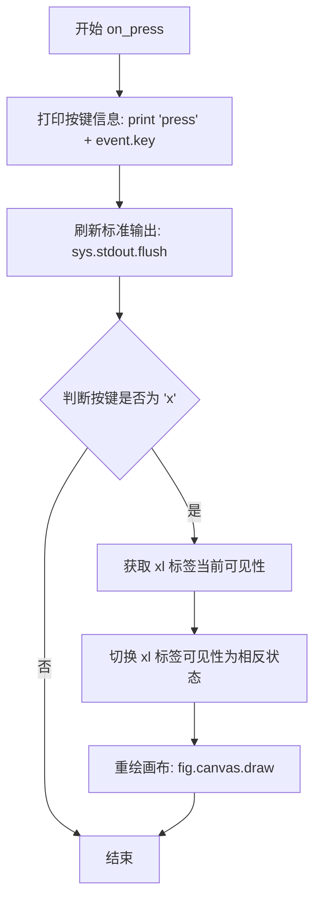

# `matplotlib\galleries\examples\event_handling\keypress_demo.py` 详细设计文档

这是一个Matplotlib交互式示例，演示如何连接键盘事件监听器，当用户按下键盘按键时触发回调函数，并可根据按键内容执行相应操作（如隐藏/显示x轴标签）

## 整体流程

```mermaid
graph TD
    A[开始] --> B[设置随机种子19680801]
B --> C[创建Figure和Axes子图]
C --> D[绑定key_press_event到on_press函数]
D --> E[在Axes上绘制随机散点图]
E --> F[设置x轴标签]
F --> G[设置图表标题]
G --> H[调用plt.show()显示图形]
H --> I{等待用户交互}
I -->|用户按键| J[触发on_press回调]
J --> K{按键是否为'x'}
K -- 是 --> L[切换xl标签可见性]
K -- 否 --> M[仅打印按键信息]
L --> N[重绘canvas]
M --> I
```

## 类结构

```
Python脚本 (无自定义类)
└── 使用Matplotlib库
    ├── plt.subplots() 返回 Figure, Axes
    ├── Figure.canvas.mpl_connect() 事件绑定
    └── 全局函数 on_press() 事件处理
```

## 全局变量及字段


### `fig`
    
图形容器，整个matplotlib图形的根对象，用于管理子图和图形属性

类型：`matplotlib.figure.Figure`
    


### `ax`
    
坐标轴对象，用于绘制数据图形、设置坐标轴范围和标签

类型：`matplotlib.axes.Axes`
    


### `xl`
    
x轴标签的文本对象，用于显示x轴的名称，可控制其可见性

类型：`matplotlib.text.Text`
    


### `np`
    
numpy模块别名，用于数值计算、数组操作和随机数生成

类型：`numpy module`
    


### `plt`
    
matplotlib.pyplot模块别名，用于创建图形、绘制图表和显示图形

类型：`matplotlib.pyplot module`
    


### `visible`
    
布尔值，表示x轴标签的当前可见性状态，用于切换标签显示

类型：`bool`
    


### `on_press.event`
    
matplotlib按键事件对象，包含按键的相关信息如键名（event.key）和鼠标位置

类型：`matplotlib.backend_bases.KeyEvent`
    
    

## 全局函数及方法


### `on_press(event)`

处理键盘事件回调函数，当用户按下键盘按键时触发，根据按键类型执行相应操作。如果按下'x'键，则切换指定标签的可见性并刷新画布。

参数：

-  `event`：`matplotlib.backend_bases.KeyEvent`，键盘事件对象，包含按键信息（如按键字符、按键代码等）

返回值：`None`，无返回值

#### 流程图



#### 带注释源码

```python
def on_press(event):
    """
    键盘事件回调函数，处理按键事件并根据按键切换标签可见性
    
    参数:
        event: 键盘事件对象，包含按键信息
    """
    # 打印按下的键到标准输出
    print('press', event.key)
    # 刷新输出缓冲区，确保立即显示
    sys.stdout.flush()
    # 判断是否按下了 'x' 键
    if event.key == 'x':
        # 获取 xl（x轴标签）的当前可见性状态
        visible = xl.get_visible()
        # 切换可见性为相反状态（显示→隐藏，隐藏→显示）
        xl.set_visible(not visible)
        # 重绘画布以应用可见性变化
        fig.canvas.draw()
```


## 关键组件


### 键按下事件处理（Keypress Event Handling）

该代码演示了Matplotlib中键盘事件的基本处理机制，通过连接key_press_event事件来实现交互式图形响应，当用户按下'x'键时切换x轴标签的可见性。

### 事件回调函数（on_press）

核心事件处理函数，接收matplotlib的键盘事件对象，检查按下的键值，执行相应的可视化更新操作。

### 图形与坐标轴对象（fig, ax）

Matplotlib的Figure和Axes对象，作为所有图形操作的容器和绘图基础，提供canvas访问和事件连接能力。

### 事件连接机制（mpl_connect）

Matplotlib的事件系统接口，通过fig.canvas.mpl_connect将key_press_event事件绑定到on_press回调函数，实现事件驱动的交互逻辑。

### 可见性切换机制（get_visible/set_visible）

利用Matplotlib Artist对象的属性控制机制，通过get_visible()获取当前状态，set_visible()设置新状态，实现图形元素的动态显示/隐藏。

### 随机数据生成（np.random.rand）

使用NumPy生成随机数据点，用于演示基本的折线图绑制功能。


## 问题及建议


### 已知问题

-   **全局变量依赖**：`xl` 变量在 `on_press` 函数外部定义但在函数内部使用，导致函数与外部状态耦合，削弱了函数的可复用性和可测试性
-   **缺乏类型注解**：代码未使用任何类型注解（类型提示），降低了代码可读性和 IDE 智能提示支持
-   **硬编码字符串**：按键 `'x'`、绘图样式 `'go'` 等使用硬编码字符串，缺乏常量定义，可维护性差
-   **空值安全缺失**：未对 `event.key` 进行空值检查，当事件对象不完整或某些特殊按键场景下可能抛出 `AttributeError`
-   **资源未清理**：注册的事件监听器 (`mpl_connect`) 未在程序结束时注销，长期运行场景下可能导致内存泄漏
-   **魔法数字**：随机种子 `19680801` 直接写在代码中，缺乏注释说明其用途
-   **缺乏异常处理**：打印和绘图操作均未包裹在 try-except 块中，程序健壮性不足
-   **stdout.flush() 调用**：手动调用 `sys.stdout.flush()` 增加了代码复杂度，在大多数环境下并非必要

### 优化建议

-   **封装函数**：将 `xl` 作为参数传递或使用闭包/类封装，消除对全局变量的依赖
-   **添加类型注解**：为函数参数和返回值添加类型提示，如 `def on_press(event: matplotlib.backend_bases.KeyEvent) -> None`
-   **提取常量**：定义常量如 `TOGGLE_KEY = 'x'` 和 `MARKER_STYLE = 'go'`，增强可维护性
-   **增加空值检查**：添加 `if event.key is None: return` 防护
-   **使用类封装**：创建 `KeyPressHandler` 类统一管理事件处理和状态，在 `__del__` 或显式 `close` 方法中清理事件连接
-   **添加注释**：为随机种子数字添加注释说明其来源或意义
-   **异常包装**：将 `print` 和 `fig.canvas.draw()` 等操作放入 try-except 块中
-   **条件化 flush**：仅在需要时调用 `flush()`，或使用 Python 的 `-u` 解释器标志替代手动 flush
-   **兼容性处理**：考虑添加对非交互式后端的检测，提升代码在不同环境下的鲁棒性


## 其它


### 设计目标与约束

本示例旨在演示Matplotlib中键盘事件处理的基本用法，帮助开发者理解如何响应用户键盘输入并执行相应操作。设计约束包括：必须使用Matplotlib的交互式后端，仅支持图形窗口获得焦点时的键盘事件捕获，且事件处理函数必须符合Matplotlib的事件签名规范。

### 错误处理与异常设计

本示例未实现显式的错误处理机制。在实际应用中应考虑：1) event对象为None时的空值检查；2) event.key为None时的处理；3) 图形窗口已关闭时的异常捕获；4) canvas.draw()调用失败时的错误日志记录。推荐使用try-except块包装关键操作，并提供用户友好的错误提示。

### 数据流与状态机

数据流：用户按键 → Matplotlib事件循环捕获 → on_press回调函数触发 → event.key解析 → 业务逻辑执行（可见性切换） → canvas重绘。状态机简化为两个状态：xl可见状态（True/False），由按键事件触发状态转换。

### 外部依赖与接口契约

外部依赖：matplotlib>=3.0、numpy>=1.15、Python标准库（sys）。接口契约：on_press函数必须接收一个matplotlib事件对象参数，该对象必须包含key属性（字符串类型，表示按键名称）；plt.show()会阻塞主线程直至窗口关闭；mpl_connect()返回连接ID，可用于事件断开。

### 性能考虑

本示例性能开销极低。潜在优化点：1) 可使用fig.canvas.draw_idle()替代draw()以减少不必要的重绘；2) 对于频繁事件处理，应考虑事件节流（throttling）；3) 批量更新时可暂时禁用交互以提升性能。

### 安全性考虑

本示例无安全性风险。注意事项：1) 避免在事件回调中执行耗时操作以免阻塞UI线程；2) 不建议在回调中执行敏感操作；3) print语句在生产环境中应替换为日志记录。

### 可测试性

测试建议：1) 单元测试：模拟Matplotlib事件对象测试on_press逻辑；2) 集成测试：验证事件连接是否成功建立；3) 模拟测试：使用matplotlib.testing中的mock对象验证canvas.draw()调用。可通过@patch装饰器模拟event对象进行自动化测试。

### 兼容性考虑

兼容的Matplotlib版本：3.0及以上。平台兼容性：Windows、macOS、Linux均支持。Python版本：3.6+。注意：某些特殊按键（如功能键）在不同操作系统上可能有不同的key值表示，建议使用标准ASCII字符进行关键业务逻辑。

    