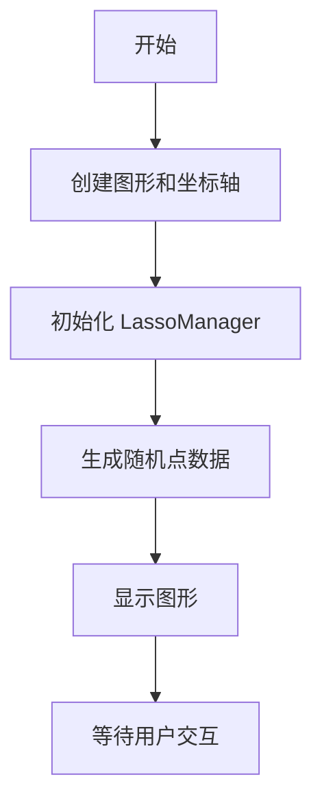
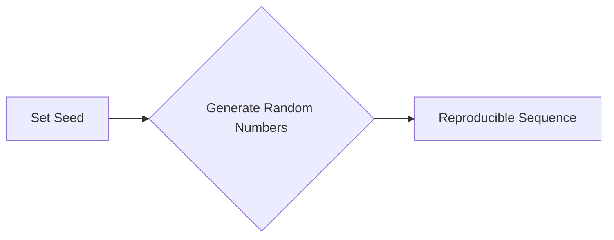
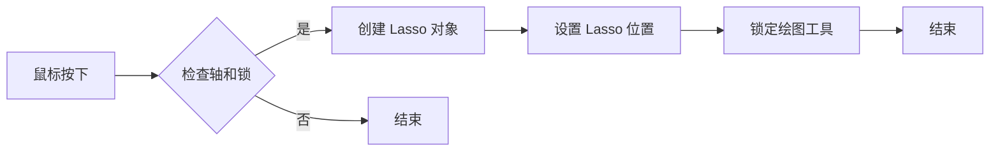
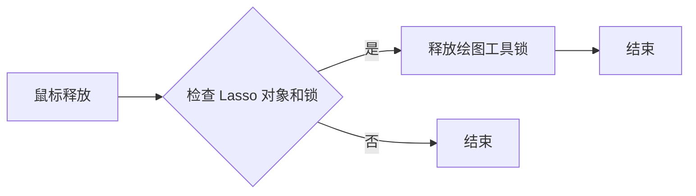
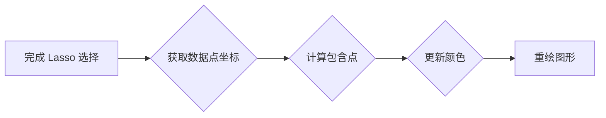
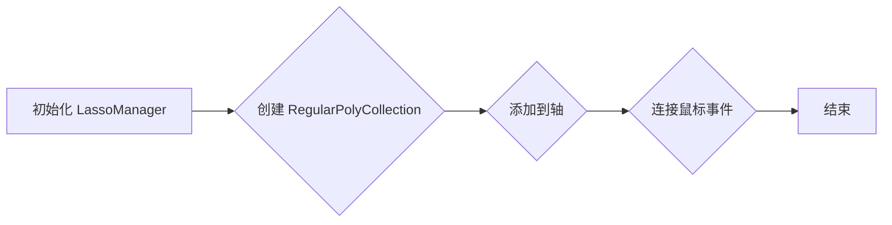
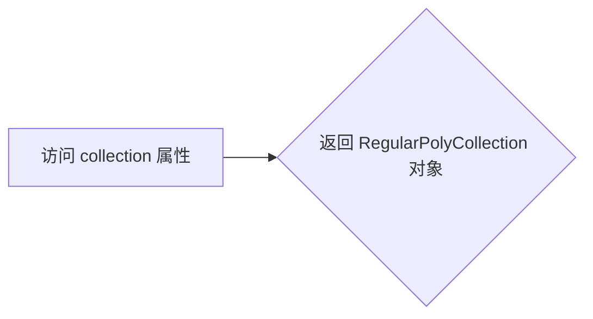
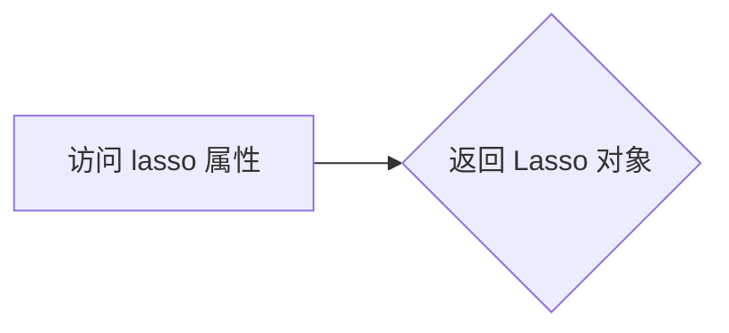
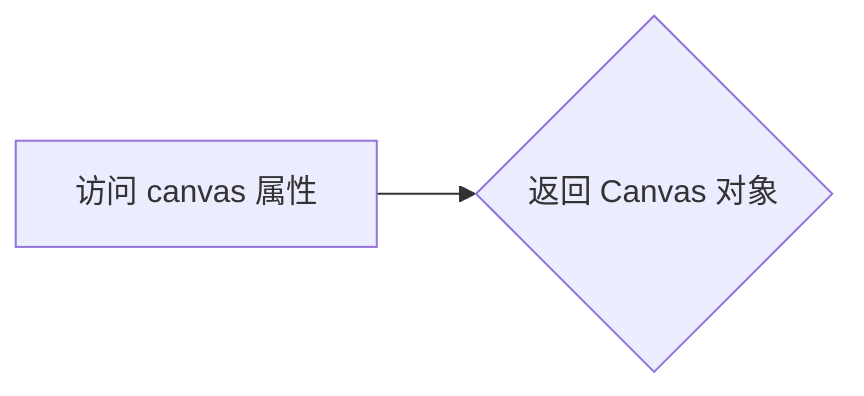

# `matplotlib\galleries\examples\event_handling\lasso_demo.py` 详细设计文档

This code provides an interactive demonstration of using a lasso tool in Matplotlib to select points on a plot and change their color based on selection.

## 整体流程



## 类结构

```
LassoManager (类)
├── RegularPolyCollection (内部使用)
├── canvas (内部使用)
├── Lasso (内部使用)
└── matplotlib (库依赖)
```

## 全局变量及字段


### `verts`
    
The vertices of the selected points.

类型：`tuple of tuples`
    


### `data`
    
The data points used to create the regular polygon collection.

类型：`numpy.ndarray`
    


### `canvas`
    
The canvas widget of the matplotlib figure.

类型：`matplotlib.backends.backend_tkagg.FigureCanvasTkAgg`
    


### `event`
    
The event object representing the mouse press or release event.

类型：`matplotlib.backend_bases.Event`
    


### `ax`
    
The axes object where the plot is drawn.

类型：`matplotlib.axes._subplots.AxesSubplot`
    


### `manager`
    
The LassoManager instance managing the lasso selection on the plot.

类型：`lasso.LassoManager`
    


### `lasso.LassoManager.collection`
    
The collection of regular polygons representing the points on the plot.

类型：`matplotlib.collections.RegularPolyCollection`
    


### `lasso.LassoManager.canvas`
    
The canvas widget of the matplotlib figure used for drawing and event handling.

类型：`matplotlib.backends.backend_tkagg.FigureCanvasTkAgg`
    


### `lasso.LassoManager.lasso`
    
The Lasso widget used to select points on the plot.

类型：`matplotlib.widgets.Lasso`
    
    

## 全局函数及方法


### np.random.seed

`np.random.seed` is a function used to initialize the random number generator in NumPy. It sets the seed for the generator, which ensures that the sequence of random numbers generated is reproducible.

参数：

- `seed`：`int`，An integer that serves as the seed for the random number generator. If not provided, the current system time is used.

返回值：`None`，This function does not return any value.

#### 流程图



#### 带注释源码

```
np.random.seed(19680801)
```

This line of code sets the seed for the random number generator to `19680801`. The next time random numbers are generated, they will be the same as if this line were executed again, assuming no other changes have been made to the state of the random number generator.


### plt.figure()

`plt.figure()` 是 Matplotlib 库中用于创建一个图形窗口的函数。

#### 描述

`plt.figure()` 用于创建一个新的图形窗口，并返回一个 Figure 对象。这个函数可以接受多个参数来配置图形的属性，如大小、分辨率、颜色等。

#### 参数

- `figsize`：一个元组，指定图形的宽度和高度（单位为英寸）。
- `dpi`：图形的分辨率（单位为点每英寸）。
- `facecolor`：图形背景颜色。
- `edgecolor`：图形边缘颜色。
- `frameon`：是否显示图形的边框。
- `num`：图形的编号。
- `figclass`：图形的类。

#### 返回值

- `Figure`：一个图形对象，可以用来添加轴、图形元素等。

#### 流程图

```mermaid
graph LR
A[plt.figure()] --> B{创建图形窗口}
B --> C[返回 Figure 对象]
```

#### 带注释源码

```python
import matplotlib.pyplot as plt

fig = plt.figure(figsize=(8, 6), dpi=100, facecolor='white', edgecolor='black', frameon=True)
```


### LassoManager.on_press()

`LassoManager.on_press()` 是 LassoManager 类中的一个方法，用于处理鼠标按下事件。

#### 描述

当用户在图形上按下鼠标按钮时，该方法会被调用。它创建一个 Lasso 对象，并将其与鼠标事件关联起来。

#### 参数

- `event`：一个鼠标事件对象。

#### 返回值

- 无

#### 流程图



#### 带注释源码

```python
def on_press(self, event):
    canvas = self.collection.figure.canvas
    if event.inaxes is not self.collection.axes or canvas.widgetlock.locked():
        return
    self.lasso = Lasso(event.inaxes, (event.xdata, event.ydata), self.callback)
    canvas.widgetlock(self.lasso)  # acquire a lock on the widget drawing
```


### LassoManager.on_release()

`LassoManager.on_release()` 是 LassoManager 类中的一个方法，用于处理鼠标释放事件。

#### 描述

当用户在图形上释放鼠标按钮时，该方法会被调用。它检查是否有 Lasso 对象，如果有，则释放绘图工具的锁。

#### 参数

- `event`：一个鼠标事件对象。

#### 返回值

- 无

#### 流程图



#### 带注释源码

```python
def on_release(self, event):
    canvas = self.collection.figure.canvas
    if hasattr(self, 'lasso') and canvas.widgetlock.isowner(self.lasso):
        canvas.widgetlock.release(self.lasso)
```


### LassoManager.callback()

`LassoManager.callback()` 是 LassoManager 类中的一个方法，用于处理 Lasso 事件。

#### 描述

当用户完成 Lasso 选择后，该方法会被调用。它根据选中的点更新图形的颜色。

#### 参数

- `verts`：一个包含 Lasso 选择点坐标的列表。

#### 返回值

- 无

#### 流程图



#### 带注释源码

```python
def callback(self, verts):
    data = self.collection.get_offsets()
    self.collection.set_array(path.Path(verts).contains_points(data))
    canvas = self.collection.figure.canvas
    canvas.draw_idle()
    del self.lasso
```


### LassoManager.__init__()

`LassoManager.__init__()` 是 LassoManager 类的构造函数，用于初始化 LassoManager 对象。

#### 描述

构造函数初始化 LassoManager 对象，创建一个 RegularPolyCollection 对象，并将其添加到轴上。它还连接了鼠标事件处理函数。

#### 参数

- `ax`：一个轴对象。
- `data`：一个包含数据点坐标的数组。

#### 返回值

- 无

#### 流程图



#### 带注释源码

```python
def __init__(self, ax, data):
    self.collection = RegularPolyCollection(
        6, sizes=(100,), offset_transform=ax.transData,
        offsets=data, array=np.zeros(len(data)),
        clim=(0, 1), cmap=mcolors.ListedColormap(["tab:blue", "tab:red"]))
    ax.add_collection(self.collection)
    canvas = ax.figure.canvas
    canvas.mpl_connect('button_press_event', self.on_press)
    canvas.mpl_connect('button_release_event', self.on_release)
```


### LassoManager.collection

`LassoManager.collection` 是 LassoManager 类中的一个属性，代表一个 RegularPolyCollection 对象。

#### 描述

这个属性存储了一个 RegularPolyCollection 对象，它用于在图形上绘制多边形，并跟踪哪些点被选中。

#### 参数

- 无

#### 返回值

- `RegularPolyCollection`：一个 RegularPolyCollection 对象。

#### 流程图



#### 带注释源码

```python
@property
def collection(self):
    return self._collection
```


### LassoManager.lasso

`LassoManager.lasso` 是 LassoManager 类中的一个属性，代表一个 Lasso 对象。

#### 描述

这个属性存储了一个 Lasso 对象，它用于处理鼠标事件并允许用户在图形上创建 Lasso 选择。

#### 参数

- 无

#### 返回值

- `Lasso`：一个 Lasso 对象。

#### 流程图



#### 带注释源码

```python
@property
def lasso(self):
    return self._lasso
```


### LassoManager.canvas

`LassoManager.canvas` 是 LassoManager 类中的一个属性，代表一个 Canvas 对象。

#### 描述

这个属性存储了一个 Canvas 对象，它用于处理绘图事件和更新图形。

#### 参数

- 无

#### 返回值

- `Canvas`：一个 Canvas 对象。

#### 流程图



#### 带注释源码

```python
@property
def canvas(self):
    return self.collection.figure.canvas
```


### LassoManager.on_press()

`LassoManager.on_press()` 是 LassoManager 类中的一个方法，用于处理鼠标按下事件。

#### 描述

当用户在图形上按下鼠标按钮时，该方法会被调用。它创建一个 Lasso 对象，并将其与鼠标事件关联起来。

#### 参数

- `event`：一个鼠标事件对象。

#### 返回值

- 无

#### 流程图


#### 带注释源码

```python
def on_press(self, event):
    canvas = self.collection.figure.canvas
    if event.inaxes is not self.collection.axes or canvas.widgetlock.locked():
        return
    self.lasso = Lasso(event.inaxes, (event.xdata, event.ydata), self.callback)
    canvas.widgetlock(self.lasso)  # acquire a lock on the widget drawing
```


### LassoManager.on_release()

`LassoManager.on_release()` 是 LassoManager 类中的一个方法，用于处理鼠标释放事件。

#### 描述

当用户在图形上释放鼠标按钮时，该方法会被调用。它检查是否有 Lasso 对象，如果有，则释放绘图工具的锁。

#### 参数

- `event`：一个鼠标事件对象。

#### 返回值

- 无

#### 流程图


#### 带注释源码

```python
def on_release(self, event):
    canvas = self.collection.figure.canvas
    if hasattr(self, 'lasso') and canvas.widgetlock.isowner(self.lasso):
        canvas.widgetlock.release(self.lasso)
```


### LassoManager.callback()

`LassoManager.callback()` 是 LassoManager 类中的一个方法，用于处理 Lasso 事件。

#### 描述

当用户完成 Lasso 选择后，该方法会被调用。它根据选中的点更新图形的颜色。

#### 参数

- `verts`：一个包含 Lasso 选择点坐标的列表。

#### 返回值

- 无

#### 流程图


#### 带注释源码

```python
def callback(self, verts):
    data = self.collection.get_offsets()
    self.collection.set_array(path.Path(verts).contains_points(data))
    canvas = self.collection.figure.canvas
    canvas.draw_idle()
    del self.lasso
```


### LassoManager.__init__()

`LassoManager.__init__()` 是 LassoManager 类的构造函数，用于初始化 LassoManager 对象。

#### 描述

构造函数初始化 LassoManager 对象，创建一个 RegularPolyCollection 对象，并将其添加到轴上。它还连接了鼠标事件处理函数。

#### 参数

- `ax`：一个轴对象。
- `data`：一个包含数据点坐标的数组。

#### 返回值

- 无

#### 流程图


#### 带注释源码

```python
def __init__(self, ax, data):
    self.collection = RegularPolyCollection(
        6, sizes=(100,), offset_transform=ax.transData,
        offsets=data, array=np.zeros(len(data)),
        clim=(0, 1), cmap=mcolors.ListedColormap(["tab:blue", "tab:red"]))
    ax.add_collection(self.collection)
    canvas = ax.figure.canvas
    canvas.mpl_connect('button_press_event', self.on_press)
    canvas.mpl_connect('button_release_event', self.on_release)
```


### LassoManager.collection

`LassoManager.collection` 是 LassoManager 类中的一个属性，代表一个 RegularPolyCollection 对象。

#### 描述

这个属性存储了一个 RegularPolyCollection 对象，它用于在图形上绘制多边形，并跟踪哪些点被选中。

#### 参数

- 无

#### 返回值

- `RegularPolyCollection`：一个 RegularPolyCollection 对象。

#### 流程图


#### 带注释源码

```python
@property
def collection(self):
    return self._collection
```


### LassoManager.lasso

`LassoManager.lasso` 是 LassoManager 类中的一个属性，代表一个 Lasso 对象。

#### 描述

这个属性存储了一个 Lasso 对象，它用于处理鼠标事件并允许用户在图形上创建 Lasso 选择。

#### 参数

- 无

#### 返回值

- `Lasso`：一个 Lasso 对象。

#### 流程图


#### 带注释源码

```python
@property
def lasso(self):
    return self._lasso
```


### LassoManager.canvas

`LassoManager.canvas` 是 LassoManager 类中的一个属性，代表一个 Canvas 对象。

#### 描述

这个属性存储了一个 Canvas 对象，它用于处理绘图事件和更新图形。

#### 参数

- 无

#### 返回值

- `Canvas`：一个 Canvas 对象。

#### 流程图


#### 带注释源码

```python
@property
def canvas(self):
    return self.collection.figure.canvas
```


### LassoManager.on_press()

`LassoManager.on_press()` 是 LassoManager 类中的一个方法，用于处理鼠标按下事件。

#### 描述

当用户在图形上按下鼠标按钮时，该方法会被调用。它创建一个 Lasso 对象，并将其与鼠标事件关联起来。

#### 参数

- `event`：一个鼠标事件对象。

#### 返回值

- 无

#### 流程图


#### 带注释源码

```python
def on_press(self, event):
    canvas = self.collection.figure.canvas
    if event.inaxes is not self.collection.axes or canvas.widgetlock.locked():
        return
    self.lasso = Lasso(event.inaxes, (event.xdata, event.ydata), self.callback)
    canvas.widgetlock(self.lasso)  # acquire a lock on the widget drawing
```


### LassoManager.on_release()

`LassoManager.on_release()` 是 LassoManager 类中的一个方法，用于处理鼠标释放事件。

#### 描述

当用户在图形上释放鼠标按钮时，该方法会被调用。它检查是否有 Lasso 对象，如果有，则释放绘图工具的锁。

#### 参数

- `event`：一个鼠标事件对象。

#### 返回值

- 无

#### 流程图


#### 带注释源码

```python
def on_release(self, event):
    canvas = self.collection.figure.canvas
    if hasattr(self, 'lasso') and canvas.widgetlock.isowner(self.lasso):
        canvas.widgetlock.release(self.lasso)
```


### LassoManager.callback()

`LassoManager.callback()` 是 LassoManager 类中的一个方法，用于处理 Lasso 事件。

#### 描述

当用户完成 Lasso 选择后，该方法会被调用。它根据选中的点更新图形的颜色。

#### 参数

- `verts`：一个包含 Lasso 选择点坐标的列表。

#### 返回值

- 无

#### 流程图


#### 带注释源码

```python
def callback(self, verts):
    data = self.collection.get_offsets()
    self.collection.set_array(path.Path(verts).contains_points(data))
    canvas = self.collection.figure.canvas
    canvas.draw_idle()
    del self.lasso
```


### LassoManager.__init__()

`LassoManager.__init__()` 是 LassoManager 类的构造函数，用于初始化 LassoManager 对象。

#### 描述

构造函数初始化 LassoManager 对象，创建一个 RegularPolyCollection 对象，并将其添加到轴上。它还连接了鼠标事件处理函数。

#### 参数

- `ax`：一个轴对象。
- `data`：一个包含数据点坐标的数组。

#### 返回值

- 无

#### 流程图

```mermaid
graph LR
A[初始化 LassoManager] --> B{创建 RegularPolyCollection}
B --> C{添加到轴}
C --> D{连接鼠标事件}
D --> E[结束]
```

#### 带注释源码

```python
def __init__(self, ax, data):
    self.collection = RegularPolyCollection(
        6, sizes=(100,), offset_transform=ax.transData,
        offsets=data, array=np.zeros(len(data)),
        clim=(0, 1), cmap=mcolors.ListedColormap(["tab:blue", "tab:red"]))
    ax.add_collection(self.collection)
    canvas = ax.figure.canvas
    canvas.mpl_connect('button_press_event', self.on_press)
    canvas.mpl_connect('button_release_event', self.on_release)
```


### LassoManager.collection

`LassoManager.collection` 是 LassoManager 类中的一个属性，代表一个 RegularPolyCollection 对象。

#### 描述

这个属性存储了一个 RegularPolyCollection 对象，它用于在图形上绘制多边形，并跟踪哪些点被选中。

#### 参数

- 无

#### 返回值

- `RegularPolyCollection`：一个 RegularPolyCollection 对象。

#### 流程图

```mermaid
graph LR
A[访问 collection 属性] --> B{返回 RegularPolyCollection 对象}
```

#### 带注释源码

```python
@property
def collection(self):
    return self._collection
```


### LassoManager.lasso

`LassoManager.lasso` 是 LassoManager 类中的一个属性，代表一个 Lasso 对象。

#### 描述

这个属性存储了一个 Lasso 对象，它用于处理鼠标事件并允许用户在图形上创建 Lasso 选择。

#### 参数

- 无

#### 返回值

- `Lasso`：一个 Lasso 对象。

#### 流程图


### plt.subplot

`plt.subplot` 是 Matplotlib 库中的一个函数，用于创建子图。

{描述}

参数：

- `nrows`：`int`，子图行数。
- `ncols`：`int`，子图列数。
- `index`：`int`，子图索引，从 1 开始。

返回值：`AxesSubplot`，子图对象。

#### 流程图

```mermaid
graph LR
A[Start] --> B{plt.subplot}
B --> C[End]
```

#### 带注释源码

```
# 假设以下代码片段位于代码文件中
import matplotlib.pyplot as plt

# 创建一个包含一个子图的图形
fig, ax = plt.subplots()

# 在图形中添加另一个子图
ax2 = plt.subplot(2, 1, 2)
```

由于提供的代码中没有直接使用 `plt.subplot` 函数，以下是一个示例，说明如何在代码中使用 `plt.subplot`：

```
import matplotlib.pyplot as plt

# 创建一个图形
fig = plt.figure()

# 创建一个子图，行数为 1，列数为 1，索引为 1
ax = plt.subplot(1, 1, 1)

# 绘制一些数据
ax.plot([1, 2, 3], [1, 4, 9])

# 显示图形
plt.show()
```

请注意，由于提供的代码中没有 `plt.subplot` 的实际使用，以上示例仅用于说明如何在代码中使用该函数。


### plt.show()

显示当前图形。

参数：

- 无

返回值：无

#### 流程图

```mermaid
graph LR
A[开始] --> B{显示图形}
B --> C[结束]
```

#### 带注释源码

```python
if __name__ == '__main__':
    np.random.seed(19680801)
    ax = plt.figure().add_subplot(
        xlim=(0, 1), ylim=(0, 1), title='Lasso points using left mouse button')
    manager = LassoManager(ax, np.random.rand(100, 2))
    plt.show()  # 显示图形
```


### LassoManager.__init__

初始化LassoManager类，设置lasso交互和颜色回调。

参数：

- `ax`：`matplotlib.axes.Axes`，用于绘制lasso的轴。
- `data`：`numpy.ndarray`，包含点的坐标数据。

返回值：无

#### 流程图

```mermaid
graph LR
A[初始化] --> B{设置collection}
B --> C{添加collection到轴}
C --> D{连接事件}
D --> E[结束]
```

#### 带注释源码

```python
def __init__(self, ax, data):
    # 创建一个正六边形集合，大小为100，偏移由data提供
    self.collection = RegularPolyCollection(
        6, sizes=(100,), offset_transform=ax.transData,
        offsets=data, array=np.zeros(len(data)),
        clim=(0, 1), cmap=mcolors.ListedColormap(["tab:blue", "tab:red"]))
    
    # 将集合添加到轴上
    ax.add_collection(self.collection)
    
    # 获取画布并连接事件
    canvas = ax.figure.canvas
    canvas.mpl_connect('button_press_event', self.on_press)
    canvas.mpl_connect('button_release_event', self.on_release)
```


### LassoManager.callback

This method is a callback function used to change the color of the selected points in the LassoManager class.

参数：

- `verts`：`tuple`，A tuple of vertices representing the selected area.

返回值：`None`，This method does not return any value.

#### 流程图

```mermaid
graph LR
A[Start] --> B{Check if verts is valid?}
B -- Yes --> C[Get data from collection]
B -- No --> D[Error handling]
C --> E[Create path from verts]
E --> F{Does path contain points in data?}
F -- Yes --> G[Set array to 1]
F -- No --> H[Set array to 0]
G --> I[Draw idle]
H --> I
I --> J[End]
```

#### 带注释源码

```python
def callback(self, verts):
    data = self.collection.get_offsets()
    self.collection.set_array(path.Path(verts).contains_points(data))
    canvas = self.collection.figure.canvas
    canvas.draw_idle()
    del self.lasso
```


### LassoManager.on_press

This method is called when the left mouse button is pressed. It initializes a lasso widget to select points on the plot.

参数：

- `event`：`matplotlib.event.Event`，The event object containing information about the mouse press.

返回值：`None`，This method does not return any value.

#### 流程图

```mermaid
graph LR
A[Start] --> B{Is event in axes?}
B -- Yes --> C[Initialize lasso with event coordinates]
B -- No --> D[End]
C --> E[Acquire widget lock]
E --> F[End]
D --> G[End]
```

#### 带注释源码

```python
def on_press(self, event):
    canvas = self.collection.figure.canvas
    if event.inaxes is not self.collection.axes or canvas.widgetlock.locked():
        return
    self.lasso = Lasso(event.inaxes, (event.xdata, event.ydata), self.callback)
    canvas.widgetlock(self.lasso)  # acquire a lock on the widget drawing
```


### LassoManager.on_release

This method is called when the mouse button is released during the lasso selection process. It releases the widget lock on the lasso object.

参数：

- `event`：`matplotlib.event.Event`，The event object containing information about the mouse release event.

返回值：`None`，This method does not return any value.

#### 流程图

```mermaid
graph LR
A[Start] --> B{Is lasso present?}
B -- Yes --> C[Release widget lock]
B -- No --> D[End]
C --> D
```

#### 带注释源码

```python
def on_release(self, event):
    canvas = self.collection.figure.canvas
    if hasattr(self, 'lasso') and canvas.widgetlock.isowner(self.lasso):
        canvas.widgetlock.release(self.lasso)
```


## 关键组件


### 张量索引与惰性加载

用于在图形界面中动态地索引和加载张量数据。

### 反量化支持

提供对反量化操作的支持，以便在量化过程中进行逆操作。

### 量化策略

定义了量化策略，用于在模型训练和推理过程中对张量进行量化处理。


## 问题及建议


### 已知问题

-   **代码注释不足**：代码中缺少对复杂逻辑或关键步骤的详细注释，这可能会影响其他开发者理解代码的工作原理。
-   **全局变量和函数的使用**：代码中使用了全局变量和函数，这可能会增加代码的耦合性和维护难度。
-   **异常处理**：代码中没有明显的异常处理机制，如果发生错误，可能会导致程序崩溃或不可预期的行为。
-   **代码复用性**：代码中的一些功能，如绘制点和多边形，可能可以抽象成更通用的函数以提高代码复用性。

### 优化建议

-   **添加详细注释**：在代码中添加详细的注释，解释复杂逻辑和关键步骤，以便其他开发者更容易理解代码。
-   **减少全局变量和函数的使用**：将全局变量和函数替换为类成员或局部变量，以减少代码的耦合性。
-   **实现异常处理**：添加异常处理机制，以捕获和处理可能发生的错误，提高代码的健壮性。
-   **提高代码复用性**：将重复的功能抽象成独立的函数或类，以提高代码的复用性和可维护性。
-   **代码格式化**：使用代码格式化工具（如PEP 8）来确保代码的一致性和可读性。
-   **单元测试**：编写单元测试来验证代码的功能，确保代码的正确性和稳定性。
-   **文档化**：编写文档来描述代码的功能、使用方法和设计决策，以便其他开发者能够更好地使用和维护代码。


## 其它


### 设计目标与约束

- 设计目标：实现一个交互式的图形界面，允许用户使用lasso选择点集，并实时改变选中点的颜色。
- 约束条件：使用Matplotlib库进行图形绘制，确保代码在大多数Python环境中兼容。

### 错误处理与异常设计

- 错误处理：在用户交互过程中，如果发生异常（如鼠标操作错误），应捕获异常并给出友好的错误提示。
- 异常设计：使用try-except语句捕获可能的异常，如`ValueError`、`TypeError`等。

### 数据流与状态机

- 数据流：用户通过鼠标点击和拖动选择点集，LassoManager类处理选择事件，并更新点的颜色。
- 状态机：LassoManager类在用户按下鼠标时开始监听事件，在释放鼠标时停止监听。

### 外部依赖与接口契约

- 外部依赖：Matplotlib库用于图形绘制和交互。
- 接口契约：LassoManager类提供`on_press`和`on_release`方法，用于处理鼠标事件。


    